# DietPi-Tools

## DietPi-Launcher

Es bietet einen einfachen Zugriff auf alle DietPi OS-Tools und kann durch Ausführen des nächsten Befehls aufgerufen werden:

```sh
dietpi-launcher
```

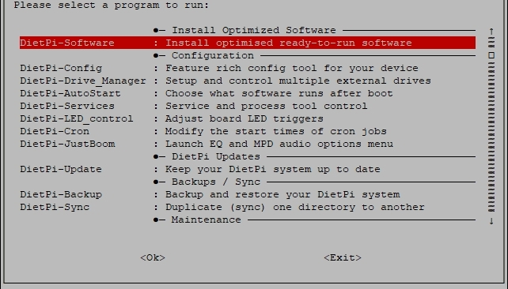{: width="642" height="366" loading="lazy"}

## DietPi-Software

`dietpi-software` wird automatisch beim ersten Login nach der Installation angezeigt. Es kann jederzeit mit dem nächsten Befehl darauf zugegriffen werden:

```sh
dietpi-software
```

Es ist eines der Kernwerkzeuge, mit dem Sie einen oder mehrere [**DietPi-optimierte Software**](../software/)-Titel installieren oder deinstallieren können.

{: width="643" height="365" loading="lazy"}

#### Softwareübersicht

=== "Software durchsuchen"

    - Beginnen Sie mit der Auswahl von **Browse Software** in der Hauptmenüliste und drücken Sie ++enter++.

    - Blättern Sie durch die Liste der verfügbaren Software - für weitere Details sehen Sie in der [DietPi-Softwareliste] (../software/) nach.

    Die Liste optimierter Software ist lang. Sie durchsuchen entweder die Liste oder verwenden die Option **Suchen Software**.

    - Um Software auf Ihrem DietPi zu installieren, wählen Sie sie in der Liste aus und drücken Sie ++Leertaste++, um sie zur Installationsliste hinzuzufügen. Wenn Sie Ihre Meinung ändern, drücken Sie erneut ++Leertaste++, um es zu entfernen.

    - Nachdem Sie die Software ausgewählt haben, die Sie installieren möchten, drücken Sie ++tab++, um zu den Bestätigungsoptionen unten zu wechseln. Wählen Sie **OK** und drücken Sie dann zur Bestätigung ++enter++.

    - Um mit der Installation Ihrer Software zu beginnen, wählen Sie **Installieren** aus der Hauptmenüliste und drücken Sie dann ++enter++. DietPi wird Sie bitten, Ihre Auswahl(en) zu bestätigen. Wählen Sie **OK** und drücken Sie dann ++Enter++, um mit der Installation zu beginnen.

    Die von Ihnen ausgewählte Software beginnt an diesem Punkt mit der Installation. Sobald der Vorgang abgeschlossen ist, werden Sie möglicherweise aufgefordert, Ihr Gerät neu zu starten. Drücken Sie zur Bestätigung **OK**.

    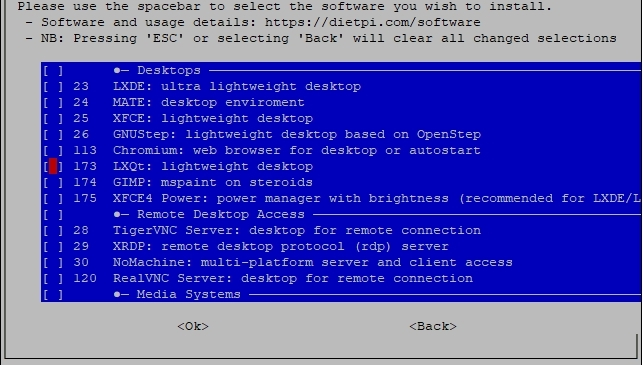{: width="643" height="365" loading="lazy"}

=== "Suchsoftware"

    DietPi unterstützt eine große Anzahl von Softwaretiteln. Anstatt durch die Liste **Software durchsuchen** zu scrollen, um einen bestimmten Softwaretitel zu finden, können Sie die Option **Software suchen** verwenden. Geben Sie die Software-ID oder ein beliebiges Schlüsselwort aus dem Titel oder der Beschreibung ein, und Sie erhalten eine nach übereinstimmenden Ergebnissen gefilterte Liste.

    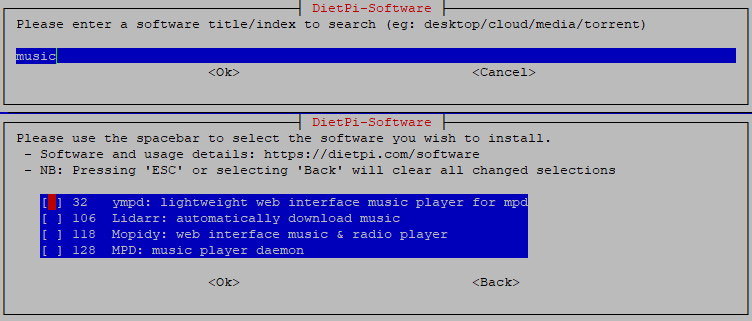{: with="752" height="321" loading="lazy"}

---

#### Schnellauswahl

=== "SSH-Server"

    Hier können Sie Ihren bevorzugten SSH-Server auswählen. Sie können auch jeden SSH-Server deinstallieren, um Speicherplatz zu sparen und jeden externen SSH-basierten Zugriff auszuschließen.

    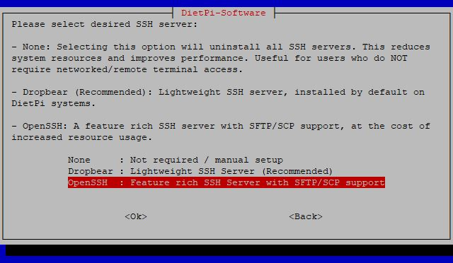{: width="550" height="320" loading="lazy"}

=== "Dateiserver"

    Mit der DietPi-Software können Sie ganz einfach eine Methode für den **Zugriff auf die Dateien** auf Ihrem DietPi-System auswählen.
    Wenn Sie einen der Dateiserver von DietPi installieren, können Sie auf Dateien auf Ihrem DietPi-System zugreifen und diese freigeben.

    DietPi installiert und richtet den Dateiserver dann automatisch für Sie ein. DietPi wird auch alle vorherigen Dateiserver von Ihrem System bereinigen und entfernen.

    Das **Standardzielverzeichnis** für Dateiserver ist `/mnt/dietpi_userdata`.

    Die Gründe für die Wahl von **ProFTPD** gegenüber **Samba** können sein:

    - ProFTPD übertrifft Samba in allen Leistungsaspekten.
    - ProFTPD kann die RPi-100-Mbit-Verbindung mit minimaler CPU-Auslastung maximieren.
    - Samba-Server auf einem RPi v1 erreichen 100 % CPU-Auslastung bei einer Übertragungsrate von 40 Mbit.

    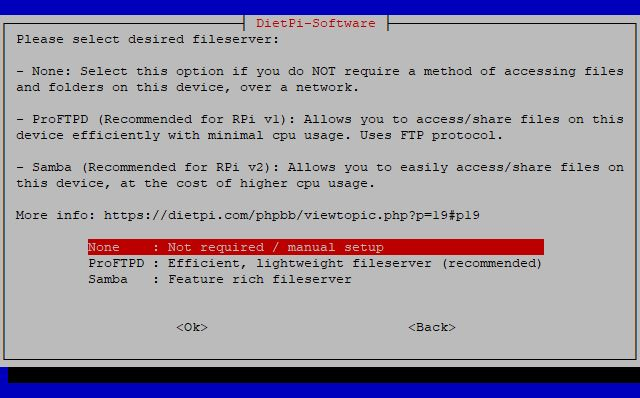{: width="550" height="342" loading="lazy"}

    Siehe [Dateiserver-Übersicht](../software/file_servers/) für weitere Informationen.

=== "Protokollsystem"

    Es können verschiedene Protokollierungsmethoden von leicht bis vollständig ausgewählt werden.
    Wenn Sie keine Protokolldateien benötigen, erhalten Sie einen Leistungsschub. Wenn Sie vollständige Systemprotokollierungsfunktionen benötigen, kann DietPi dies auch tun.

    Das Protokollsystem kann jederzeit geändert werden, indem Sie im Menü ein anderes „Protokollsystem“ auswählen.

    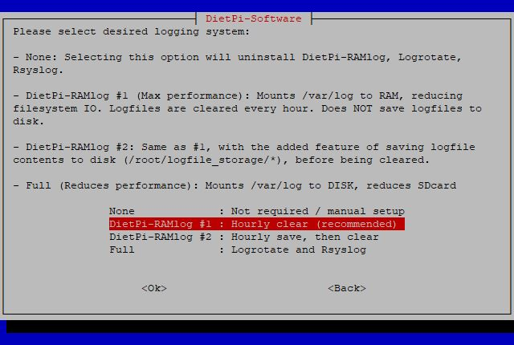{: width="550" height="370" loading="lazy"}

    Siehe [Auswahl des Protokollsystems](../software/log_system/) für weitere Details.

=== "Webserver-Einstellung"

    Das System **Webserver Preference** von DietPi ermöglicht es Ihnen, Ihren bevorzugten Webserver für die Verwendung in DietPi-Installationen auszuwählen. Wenn Sie sich nicht entschieden haben, lesen Sie mehr unter [Welchen WEBSERVER WÄHLEN?](../software/webserver_stack/#what-web-application-stack-is-best-for-you)

    !!! Hinweis "Automatische Auswahl"

        Wenn Sie eine Software zur Installation auswählen, die einen Webserver erfordert (z. B. Pi-hole, Nextcloud, Webmin, installiert über *Browse Software*), installiert, konfiguriert und optimiert DietPi automatisch Ihre gewählte *Webserver-Präferenz*.

        Dadurch müssen Sie keinen Webserver-Stack manuell auswählen/installieren. DietPi erledigt das alles für Sie.

    {: width="550" height="340" loading="lazy"}

=== "Speicherort der Benutzerdaten"

    In DietPi klassifizieren wir Benutzerdaten wie folgt:

    - **Datenspeicherung für Anwendungen**. Einige Beispiele sind der ownCloud/Nextcloud-Datenspeicher, BitTorrent-Downloads und der SQL-Datenspeicher.
    - Der Speicherort, auf den Ihre **Dateiserver**-Auswahl zeigt, wenn Sie einen installieren, wie Samba Server oder ProFTPD.
    - Der Ort, an dem Sie Ihre **Medieninhalte** hochladen und speichern können, damit sie von anderen Anwendungen wie Kodi, Emby oder Plex verwendet werden können.

    Für alle Software, die Sie in dietpi-software installieren, können Sie mit `/mnt/dietpi_userdata` auf Ihre Benutzerdaten zugreifen. Unabhängig davon, wo die Daten physisch gespeichert sind, wird bei Bedarf automatisch ein Symlink für Sie erstellt.
    Um zu überprüfen, wo sich der physische Standort befindet, können Sie den folgenden Befehl ausführen:

    ```sh
    readlink -f /mnt/dietpi_userdata
    ```

    Sie können Ihre Benutzerdaten an einen anderen Ort (z. B. USB-Stick) **verschieben**. Führen Sie einfach `dietpi-software` aus und geben Sie die Menüoption *Speicherort der Benutzerdaten* ein:

    - Wenn Sie ein neues externes Laufwerk einrichten müssen, wählen Sie *Drive Manager*, um *DietPi-Drive Manager* zu starten.
    - Verwenden Sie die Option *Liste*, um aus einer Liste der bereitgestellten Laufwerke auszuwählen, oder wählen Sie *Manuell* für einen benutzerdefinierten Speicherort.

    DietPi verschiebt Ihre bestehenden Benutzerdaten automatisch an Ihren neuen Standort.

    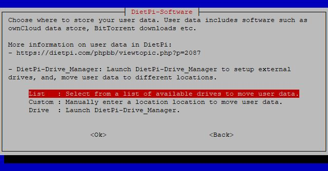{: width="550" height="287" loading="lazy"}

---

#### Software installieren oder entfernen

=== "Installieren"

    Installieren Sie Softwareelemente, die über die Liste **Software durchsuchen**, über **Software suchen** oder über den **SSH-Server**, **Dateiserver** oder **Protokollsystem** ausgewählt wurden Auswahlmöglichkeiten.

=== "Deinstallieren"

    Wählen Sie ein oder mehrere Softwareelemente aus, die Sie von Ihrem DietPi-System entfernen möchten.

=== "Kommandozeilenbasierte Installation"

    Neben der interaktiven Softwareinstallation über `dietpi-software` mit Überprüfung gewünschter Softwarepakete und deren Installation besteht die Möglichkeit, die Softwarepakete über die Shell-Kommandozeile zu installieren.
    Die Verwendung von `dietpi-Software` ist:

    ```bash
    Verwendung: dietpi-software [<Befehl> [<software_id>...]]
    Verfügbare Befehle:
      <empty>     Interaktives Menü zum Installieren oder Deinstallieren von Software
      install     <software_id>... Installiert jede Software, die durch eine durch Leerzeichen getrennte Liste von IDs angegeben ist
      reinstall   <software_id>... Jede Software neu installieren, die durch eine durch Leerzeichen getrennte Liste von IDs angegeben ist
      uninstall   <software_id>... Deinstalliert jede Software, die durch eine durch Leerzeichen getrennte Liste von IDs angegeben ist
      list        Drucken Sie eine Liste mit IDs und Informationen für alle verfügbaren Softwaretitel
      free        Drucken Sie eine unbenutzte Software-ID, kostenlos für eine neue Softwareimplementierung
    ```

    Die anzugebende `<software_id\>` ist diejenige, die in der Softwareliste innerhalb der `dietpi-software`-Dialoge vorhanden ist:

    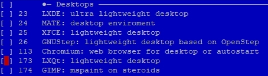{: width="454" height="129" loading="lazy"}

    Z.B. Um Chromium, LXQt und GIMP zu installieren, müssen Sie den nächsten Befehl im Terminal ausführen:

    ```sh
    dietpi-software install 113 173 174
    ```

---

### DietPi LetsEncrypt

Greifen Sie auf das Frontend für die `Let's Encrypt`-Integration zu.
Führen Sie `dietpi-letsencrypt`, mit demn folgenden Befehl aus: 

```sh
dietpi-letsencrypt
```

Im Falle eines nicht installierten Certbot-Pakets wird es zuerst installiert:

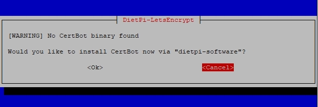{: width="642" height="216" loading="lazy"}

Im Installationsdialog müssen einige Angaben gemacht werden, die für das Zertifikat benötigt werden (Domäne, E-Mail), die anderen Angaben sind Konfigurationsoptionen. Es wird empfohlen, die Schlüsselgröße bei 4096 Bit zu belassen.

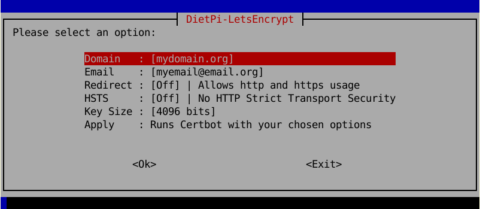{: width="642" height="279" loading="lazy"}

Wenn Sie die Zertifikatsinstallation ausführen, wird es auch für Ihren ausgewählten Webserver installiert, d. h. Sie müssen Ihre Webserver-Konfigurationsdateien nicht bearbeiten, die Installationsroutine erledigt alles für Sie.

!!! info "Portweiterleitung auf Ihrem Router"
    Um über das Internet erreichbar zu sein, benötigt Ihr Router normalerweise eine Portweiterleitungskonfiguration, um eingehende HTTP- und HTTPS-Zugriffe an Ihr DietPi-System weiterzuleiten.
    Obwohl Sie nur eine HTTPS-Protokollweiterleitung (normalerweise Port 433) benötigen, müssen Sie auch das HTTP-Protokoll (normalerweise Port 80) an Ihr DietPi-System weiterleiten, da sonst das Zertifizierungserneuerungsverfahren fehlschlägt (aufgrund der Tatsache, dass das Zertifizierungserneuerungsverfahren mehrere Monate später stattfindet, haben Sie dieses Problem möglicherweise vergessen).

### DietPi-VPN

DietPi-VPN ist eine Kombination aus OpenVPN-Installation und DietPi-Frontend-GUI. 
Ermöglicht allen VPN-Benutzern, sich schnell und einfach mit jedem NordVPN, ProtonVPN oder jedem anderen Server zu verbinden, der OpenVPN in TCP oder UDP verwendet, wobei nur Open-Source-Software verwendet wird.
Führen Sie `dietpi-vpn`, mit demn folgenden Befehl aus: 

```sh
dietpi-vpn
```

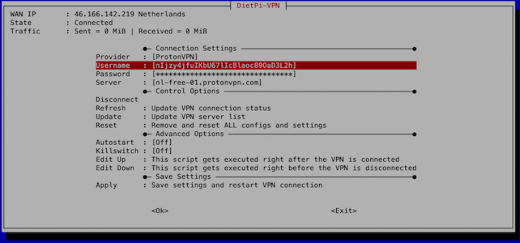{: width="642" height="300" loading="lazy"}

=== "VPN-Abonnement erforderlich"

    Obwohl wir die erzwungene Verschlüsselung auf allen unseren BitTorrent-Clients aktivieren, ist die Verwendung eines VPN entscheidend, wenn Sie vollständige Privatsphäre und Sicherheit für alle Ihre heruntergeladenen Inhalte gewährleisten möchten.
    Sie können jeden beliebigen VPN-Anbieter verwenden, aber DietPi-VPN unterstützt speziell ProtonVPN und NordVPN.

=== "Verwendung"

    Führen Sie einfach „dietpi-vpn“ aus, um die GUI zu verwenden, mit der Sie Ihre Verbindung und Ihren Anbieter einrichten können.
    DietPi startet und verbindet das VPN auch automatisch während des Systemstarts, wenn Sie Autostart auswählen.

=== "Killswitch"

    DietPi-VPN wird mit einem optionalen Killswitch geliefert, der Ihr Internet abschaltet, falls Sie Ihre Verbindung zum VPN-Server verlieren.
    Dies ermöglicht weiterhin den Zugriff von Ihrem LAN und ermöglicht es Ihnen, bei Bedarf Probleme mit SSH zu beheben.

{: width="200" height="58" loading="lazy"}

---
### DietPi-DDNS

DietPi-DDNS ist ein generischer Dynamic DNS (DDNS)-Client. 
Es kann verwendet werden, um einen Cron-Job einzurichten, der Ihre sich dynamisch ändernde öffentliche IP-Adresse alle definierten Minuten gegen einen DDNS-Anbieter aktualisiert, sodass Ihre öffentliche Domain gültig bleibt. 
Es unterstützt No-IP und ersetzt den No-IP-Client, der als Installationsoption auf früheren DietPi-Versionen verfügbar war.

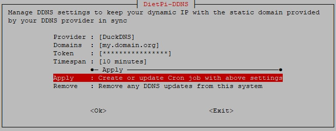{: width="656" height="256" loading="lazy"}

=== "Unterstützte Anbieter"

    - DuckDNS: <https://www.duckdns.org/>
    - No-IP: <https://www.noip.com/>
    - Dynu: <https://www.dynu.com/>
    - FreeDNS: <https://freedns.afraid.org/>
    - OVH: <https://docs.ovh.com/gb/en/domains/hosting_dynhost/>
	
    - Alternativ können Sie jeden anderen Anbieter verwenden, der eine API-URL zum Aktualisieren Ihrer dynamischen IP-Adresse hat.

=== "CLI"

    Geben Sie „dietpi-ddns -h“ ein, um einen Überblick über unterstützte CLI-Befehle und -Optionen zu erhalten:

    - Wenn kein Argument angegeben wird, wird das interaktive Menü gestartet.
    - Verwenden Sie `dietpi-ddns <options> apply <provider>`, um einen Cron-Job für den angegebenen Anbieter anzuwenden, und verwenden Sie die folgenden Optionssatzdetails:
        - `<Anbieter>` ist entweder der Name eines unterstützten Anbieters oder eine benutzerdefinierte Update-URL.
        - Verwenden Sie `-d <domains>`, um eine oder eine durch Kommas getrennte Liste mehrerer Domains hinzuzufügen, die auf die öffentliche IP-Adresse dieses Systems zeigen sollten.
        - Verwenden Sie `-u <Benutzername>`, um einen Benutzernamen oder eine Kennung festzulegen. Dies ist nicht für alle Anbieter erforderlich, bei einem benutzerdefinierten Anbieter wird er als Benutzername für die HTTP-Authentifizierung verwendet.
        - Verwenden Sie `-p <password>`, um ein Passwort oder einen Token festzulegen. Dies ist nicht für alle Anbieter erforderlich, bei einem benutzerdefinierten Anbieter wird er als Benutzername für die HTTP-Authentifizierung verwendet.
        - Verwenden Sie `-t <Zeitspanne>`, um ein Aktualisierungsintervall in Minuten festzulegen, das rein optional ist und standardmäßig 10 Minuten beträgt.
        - Wenn Sie DietPi-DDNS bereits zuvor eingerichtet haben, kann der Befehl „Übernehmen“ auch verwendet werden, um eine der obigen Einstellungen zu ändern. Alle anderen Optionen sind dann optional.
    - Verwenden Sie `dietpi-ddns remove`, um alle Cron-Jobs zu entfernen, die zuvor eingerichtet wurden.

---

## Systemkonfiguration

### DietPi-Konfiguration

Konfigurieren Sie verschiedene Systemeinstellungen, von Anzeige / Audio / Netzwerk bis hin zu _Autostart_-Optionen.
Führen Sie `dietpi-config`, mit demn folgenden Befehl aus:

```sh
dietpi-config
```
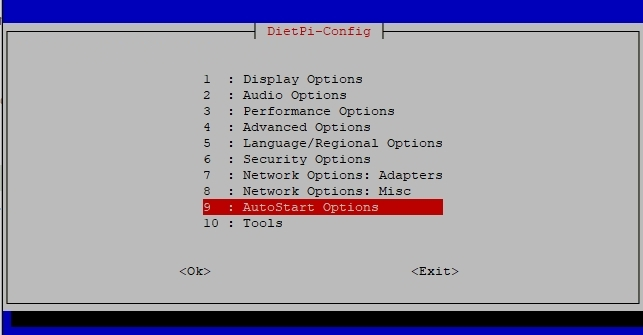{: width="643" height="335" loading="lazy"}

=== "Anzeigeoptionen"

    Die Anzeigeoptionen sind gewöhnungsbedürftig

    - Stellen Sie Ihre Bildschirmauflösung ein oder gehen Sie kopflos, um zusätzliche Ressourcen zu sparen.
    - Kontrollieren Sie Ihre GPU-Speicheraufteilungen.
    - Aktivieren/deaktivieren Sie die RPi-Kamera.

=== "Audiooptionen"

    Die Audiooptionen sind gewöhnungsbedürftig

    - Einfaches Wechseln der Soundkarte (z. B.: HiFiBerry / Odroid HiFi Shield).

=== "Leistungsoptionen"

    Die Leistungsoptionen sind gewöhnungsbedürftig

    - Übertakten Sie Ihr System mit einer großen Auswahl an Übertaktungsprofilen für Ihr Gerät.
    - Ändern Sie den CPU-Governor und optimieren Sie Ihre ARM-Temperaturgrenzen.

=== "Erweiterte Optionen"

    Die erweiterten Optionen sind gewöhnungsbedürftig

    - Konfigurieren Sie die Größe der Auslagerungsdatei
    - Konfigurieren Sie die Zeitsynchronisierung und die Quelle der Echtzeituhr
    - Geräte-Firmware aktualisieren
    - Serielle Konsole umschalten
    - Bluetooth umschalten

=== "Sicherheitsoptionen"

    Die Sicherheitsoptionen sind gewöhnungsbedürftig

    - Passwort und Hostnamen ändern

=== "Sprach-/Regionsoptionen"

    Die Sprach-/Regionsoptionen sind gewöhnungsbedürftig

    - Legen Sie Zeitzone, Gebietsschema und Tastaturoptionen fest. Alles, was Sie brauchen, damit es sich wie zu Hause anfühlt

=== "Netzwerkoptionen: Adapter"

    Die Netzwerkoptionen sind gewöhnungsbedürftig

    - Einfaches Scannen und Verbinden mit Ihrem WLAN-Router
    - Wechseln Sie zu einer statischen IP-Adresse in Ihrem Netzwerk
    - Konfigurieren Sie Ihre Proxy-Einstellungen
    - Internetverbindung testen
    - IPv6-Unterstützung umschalten

=== "Netzwerkoptionen: Verschiedenes"

    Die diversen Netzwerkoptionen sind gewöhnungsbedürftig

    - Wählen Sie einen **APT-Mirror** aus, um eine Verbindung zum Debian- (oder Raspbian-) APT-Repository herzustellen.
    - Wählen Sie einen **NTP-Mirror**, um Ihre Systemzeit zu synchronisieren.
    - Wählen Sie Timeouts für Netzwerk- und URL-Verbindungstests.
    - **Network Drives** leitet Sie zum **DietPi-Drive_Manager** weiter, mit dem Sie Samba- und NFS-Freigaben auf Ihrem DietPi-System mounten können.
    - **No-IP** ist ein [dynamisches DNS](https://wikipedia.org/wiki/Dynamic_DNS)-Anbieter, der es Ihnen ermöglicht, mit einem statischen Domainnamen auf Ihr Heimnetzwerk/Ihren Server zuzugreifen. Der Client muss No-IP regelmäßig Ihre aktuelle dynamische externe IP mitteilen.

=== "AutoStart-Optionen"

    Die Autostart-Optionen sind gewöhnungsbedürftig

    - Ändern Sie schnell und einfach, welche Software nach dem Booten ausgeführt wird. Kodi, Desktop, Konsole und viele mehr

=== "Werkzeuge"

    Die Werkzeugoptionen sind gewöhnungsbedürftig

    - Führen Sie CPU-, RAM-, Dateisystem- und Netzwerk-**Benchmarks** durch, laden Sie optional Ihre Ergebnisse hoch und überprüfen Sie die Statistiken unter: <https://dietpi.com/survey/#benchmark>
    - Führen Sie **Stresstests** für CPU/IO/RAM/DISK durch, um die Stabilität Ihres Systems zu testen, z. nachdem ich etwas übertaktet habe.

---

### DietPi-Laufwerksmanager

Funktionsreiches Dienstprogramm zur Laufwerksverwaltung. Es ist ein leichtes Programm, mit dem Sie:

- Laufwerke verwalten: Externe Laufwerke mounten, formatieren
- Wartungslaufwerke: Überprüfen und reparieren Sie Laufwerke, ändern Sie die Größe des Dateisystems (erweitern Sie es), ändern Sie die Anzahl der reservierten Blöcke
- Laufwerkattribute festlegen: Nur-Lese-Dateisysteme festlegen, Spindown-Zeit im Leerlauf festlegen
- DietPi-Benutzerdaten verschieben
- RootFS auf externes Laufwerk übertragen (nur Raspberry Pi und einige ODROID-Boards)
- Auslagerungsdatei deaktivieren, Größe der Auslagerungsdatei ändern
- Führen Sie Benchmarks auf Laufwerken aus
- Netzlaufwerke mounten (NFS und Samba)

Führen Sie `dietpi-drive_manager` aus, verwenden Sie den folgenden Befehl:

```sh
dietpi-drive_manager
```

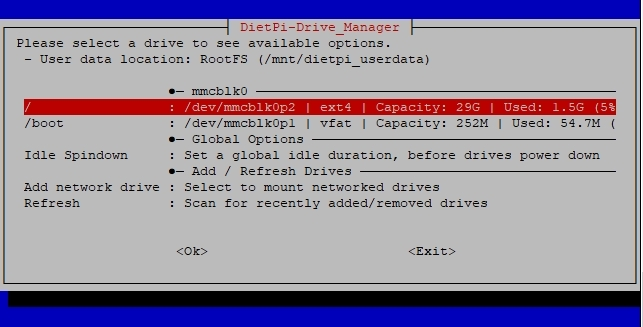{: width="643" height="327" loading="lazy"}

=== "Ein dediziertes Laufwerk für DietPi einrichten"

    Um ein zusätzliches Laufwerk (Beispiel USB-Laufwerk) zu verwenden, müssen die folgenden Schritte ausgeführt werden:

    1. Führen Sie „dietpi-drive_manager“ aus, um das Hauptmenü aufzurufen.
    1. Schließen Sie das Laufwerk an, das Sie verwenden möchten.
    1. Wählen Sie „Aktualisieren“ aus dem Menü (wenn es nicht sofort angezeigt wird, warten Sie ein paar Sekunden, bis das System aktualisiert wurde, und versuchen Sie es dann erneut).
    1. Wählen Sie das Laufwerk, das Sie verwenden möchten, aus der Liste aus und drücken Sie dann ++enter++.

        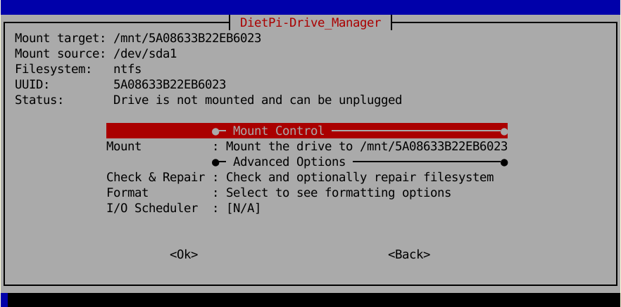{: width="600" height="297" loading="lazy"}

        Formatieren Sie das Laufwerk bei Bedarf vor der Verwendung, indem Sie die Option „Formatieren“ auswählen (Dateisystemtyp-Beschreibung siehe unten).
        Anmerkung: Das Formatieren von Laufwerken kann nur im unmontierten Zustand erfolgen.

        Mounten Sie das Laufwerk bei Bedarf über die Auswahl "Mount". Wenn gemountet, sind die Befehle `Unmount`, `Benchmark`, `User data`, `Swapfile` und `Read only` vorhanden.

        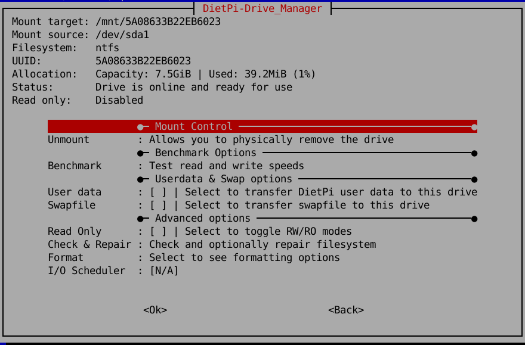{: width="600" height="395" loading="lazy"}

=== "Speicherort der Benutzerdaten und Auslagerungsdatei verschieben"

    Sie können den Speicherort der DietPi-Benutzerdaten (Standard `/mnt/dietpi_userdata`) oder die Auslagerungsdatei an einen anderen Speicherort auf einem Ziellaufwerk verschieben. Dies kann nützlich sein, wenn Ihr Dateisystem, das die DietPi-Benutzerdaten enthält, bzw. Auslagerungsdatei hat nur noch wenig Platz.
    Führen Sie dazu die folgenden Schritte aus (Beispiel Benutzerdaten, Auslagerungsdatei ist ziemlich ähnlich):

    1. Führen Sie „dietpi-drive_manager“ aus, um das Hauptmenü aufzurufen.
    1. Lassen Sie das Ziellaufwerk angeschlossen und gemountet (siehe Beschreibung oben).
    1. Wählen Sie das Ziellaufwerk aus und drücken Sie ++enter++.
    1. Wählen Sie im Menü Laufwerke `Benutzerdaten` bzw. `Swapfile` und folgen Sie den Anweisungen.

        - Benutzerdaten verschieben:

        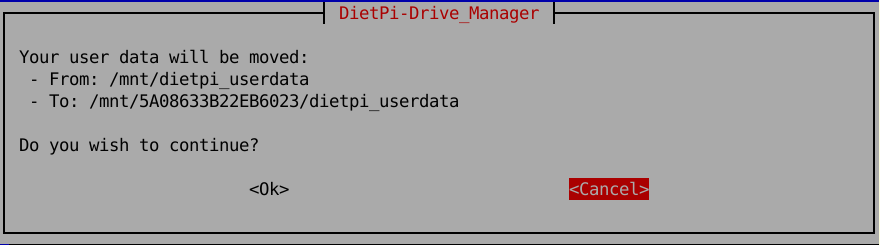{: width="500" height="139" loading="lazy"}

        - Größe der Auslagerungsdatei ändern:

        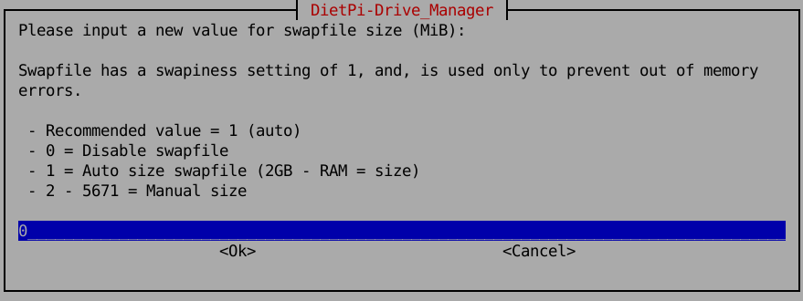{: width="500" height="188" loading="lazy"}

=== "Dateisystemtypen formatieren"

    Das Formatieren von Dateisystemen führt Sie zu diesen Dialogen:

    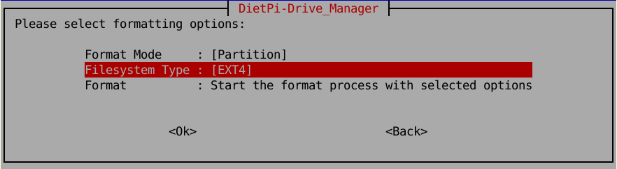{: width="500" height="137" loading="lazy"}
    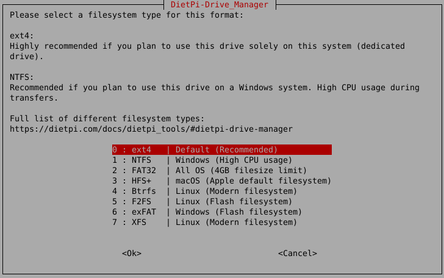{: width="500" height="326" loading="lazy"}

    Im letzteren Dialog müssen Sie den Dateisystemtyp auswählen. Folgende Auswahlmöglichkeiten stehen zur Auswahl:

    - `ext4` (Standard)
      Empfohlen für Benutzer, die dieses Laufwerk ausschließlich auf Linux-Systemen verwenden möchten (z. B. dediziertes Laufwerk).
      `+` Der Standard für Linux-Dateisysteme
      `-` Nicht kompatibel mit einem Windows-System

    - `NTFS`.
      Empfohlen für Benutzer, die dieses Laufwerk auf einem Windows-System verwenden möchten.
      `+` Kompatibel auf einem Windows-System
      `-` Nur emulierte Unterstützung für UNIX-Berechtigungen
      `-` Unterstützt symbolische Links (Erstellung)
      `-` Hohe CPU-Auslastung während Übertragungen (startet einen Prozess)

    - `FAT32`.
      Empfohlen für Benutzer, die eine hohe Kompatibilität zwischen mehreren Betriebssystemen wünschen.
      `+` Hohe Kompatibilität mit allen Betriebssystemen
      `-` 4 GiB Dateigrößenbeschränkung
      `-` 2 TiB Laufwerksgrößenbeschränkung
      `-` Unterstützt keine UNIX-Berechtigungen
      `-` Unterstützt keine symbolischen Links
	  
    - `exFAT`  
       Windows-Dateisystem, vorgesehen für externe Laufwerke, z. USB-Sticks oder SD-Karten.
       `+` Flash-freundliches Dateisystem: <https://en.m.wikipedia.org/wiki/ExFAT>
       `+` Kompatibel auf einem Windows-System
       `-` Unterstützt keine UNIX-Berechtigungen
       `-` Unterstützt keine symbolischen Links
	   
    - `HFS+`.
      Empfohlen für Benutzer, die dieses Laufwerk auf einem macOS-System verwenden möchten.
      `+` macOS-Dateisystem
      `-` Nicht kompatibel mit einem Windows-System

    - `Btrfs`.
      Ein modernes Linux-Dateisystem.
       `+` Vorteile wurden in [dieser DietPi-Ausgabe] beschrieben (https://github.com/MichaIng/DietPi/issues/271#issuecomment-247173250)
       `-` Kompatibel mit Windows nur über zusätzlichen Windows-Treiber [WinBtrfs](https://github.com/maharmstone/btrfs)

    - `F2FS`.
      Linux-Dateisystem, das für Flash/NAND-basierte Laufwerke entwickelt wurde.
      `+` Flash-freundliches Dateisystem: <https://en.wikipedia.org/wiki/F2FS>
      `-` Nicht kompatibel mit einem Windows-System

    - `XFS`.
      Ein modernes Linux-Dateisystem.
      `+` Gut akzeptiert für große Dateien (typischerweise in einem Fileserver-Einsatz)
      `-` Nicht kompatibel mit einem Windows-System

=== "DietPi-System auf eine größere SD-Karte verschieben"

    Wenn Sie den Speicherplatz Ihrer DietPi SD-Karte erweitern möchten, indem Sie das System auf eine größere Speicherkarte verschieben, können Sie dies durch die folgenden Schritte erreichen:

    1. Fahren Sie Ihr System herunter und stecken Sie die SD-Karte in einen Kartenleser eines anderen Systems.
    1. Kopieren Sie den Inhalt der SD-Karte auf die neue (größere) SD-Karte. Dies kann z. mit gemacht werden
        - der `dd`-Befehl (Befehlszeilenoption)
        - [balenaEtcher](https://etcher.io/) oder [Rufus](https://rufus.ie/) (Option für grafische Benutzeroberfläche)
        - `gnome-disks` (Option für grafische Benutzeroberfläche)
    1. Booten Sie das System mit der kopierten Speicherkarte.
    1. Führen Sie „dietpi-drive_manager“ aus, um das Hauptmenü aufzurufen.
    1. Wählen Sie die Festplatte mit der Root-Partition (`/`) und drücken Sie ++enter++.
    1. Wählen Sie „Größe ändern“ und drücken Sie ++enter++.

        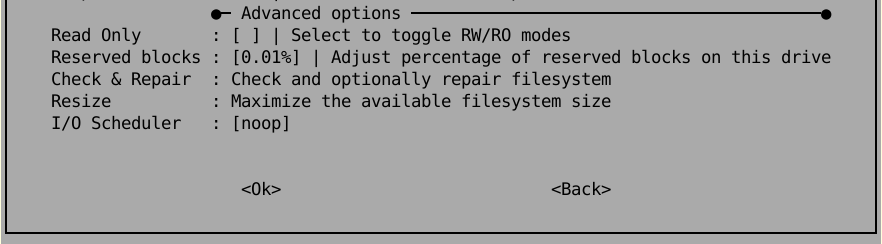{: width="500" height="138" loading="lazy"}

    1. Starten Sie Ihr System neu, um das Root-Dateisystem zu erweitern und den gesamten Speicherplatz der neuen Speicherkarte zu nutzen.

    Ein ähnliches Verfahren kann verwendet werden, wenn der Inhalt der SD-Karte auf eine kleinere SD-Karte verschoben wird. Während dieses Vorgangs müssen Sie normalerweise die Partitionsgröße verkleinern (z. B. mit „parted“ oder „gparted“), bevor Sie das Partitionsabbild auf eine andere Speicherkarte kopieren. Führen Sie auch die Größenänderung durch, um den gesamten Platz auf der neuen Karte zu nutzen.

=== "Netzlaufwerk bereitstellen"

    Wenn Sie ein NFS-Laufwerk oder eine Samba-Freigabe mounten möchten, können Sie dies folgendermaßen tun:

    1. Führen Sie „dietpi-drive_manager“ aus, um das Hauptmenü aufzurufen.
    1. Wählen Sie „Netzlaufwerk hinzufügen“.
    1. Wählen Sie den Typ Ihres Netzlaufwerks aus.
    1. Folgen Sie den Anweisungen.

    !!! info "Einbinden einer macOS Samba-Freigabe"
        Um eine unter „Freigabe“ aktivierte macOS-Samba-Freigabe zu mounten, müssen Sie (auf dem Server) zu „Freigabe > Dateifreigabe > Optionen > Windows-Dateifreigabe“ gehen und Ihren Benutzernamen auswählen.

---

### DietPi-Autostart

Definiert Softwarepakete, die beim Hochfahren des DietPi-Betriebssystems gestartet werden sollen. Beispiel: Starten Sie den Desktop, während Kodi ausgeführt wird.
Führen Sie `dietpi-autostart`, mit demn folgenden Befehl aus:

```sh
dietpi-autostart
```

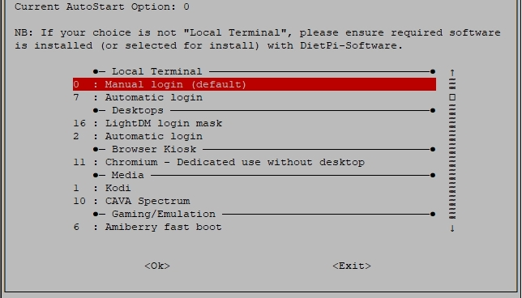{: width="644" height="368" loading="lazy"}

!!! info "Autostart-Option in `dietpi.txt` (erster Initialboot)"
    Beim erstmaligen Booten des DietPi-Systems kann die Autostart-Option auch über die Datei `dietpi.txt` eingestellt werden. Siehe Option
    `AUTO_SETUP_AUTOSTART_TARGET_INDEX=`
    Für weitere Informationen.
    Die links im Befehl `dietpi-autostart` angezeigten Zahlen entsprechen den Werten in `dietpi.txt`.

### DietPi-Services

Bietet Dienststeuerung, Optimierungen der Prioritätsebene und Statusdruck.
Führen Sie `dietpi-services`, mit demn folgenden Befehl aus:

```sh
dietpi-services
```

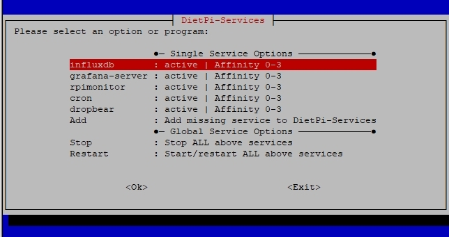{: width="644" height="341" loading="lazy"}

Der Dialog zum Optimieren eines Dienstes wird aufgerufen, indem der Dienst markiert wird (Tasten ++Pfeil-oben++ und ++Pfeil-unten++) und ++enter++ gedrückt wird. Der Konfigurationsdialog (Beispiel: Cron-Dienst) sieht folgendermaßen aus:

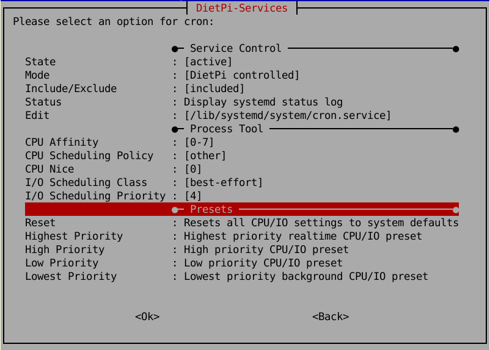{: width="644" height="461" loading="lazy"}

!!! Warnung: "Seien Sie vorsichtig beim Optimieren der Dienste."

---
### DietPi LED-Steuerung

Ändern Sie die Trigger für die Status-LEDs auf Ihrem SBC/Motherboard.
Führen Sie `dietpi-led_control`, mit demn folgenden Befehl aus:

```sh
dietpi-led_control
```

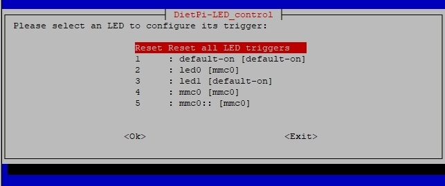{: width="643" height="269" loading="lazy"}

Abhängig von Ihrer verwendeten Hardware ändert sich die Anzahl der Einträge im Dialog.

### DietPi cron

Ändern Sie die Startzeiten bestimmter Cronjob-Gruppen.
Führen Sie „dietpi-cron“ aus.

```sh
dietpi-cron
```

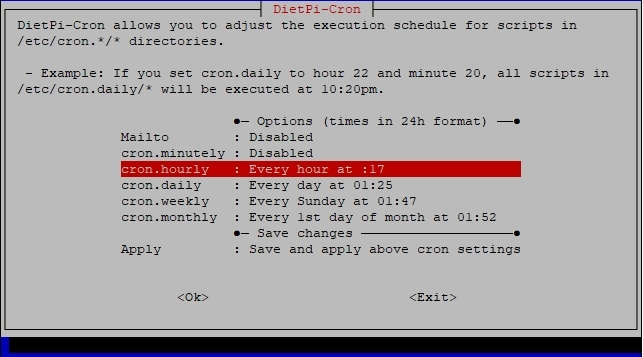{: width="643" height="357" loading="lazy"}

### DietPi JustBoom

Ändern Sie die Audioeinstellungen.
Führen Sie `dietpi-justboom`, mit demn folgenden Befehl aus:

```sh
dietpi-justboom
```

Wenn die Tonausgabe konfiguriert ist, erscheint folgender Dialog:

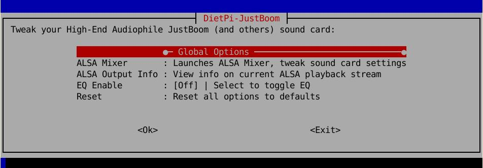{: width="642" height="223" loading="lazy"}

Wenn keine Tonausgabe konfiguriert ist, erscheint folgender Dialog:

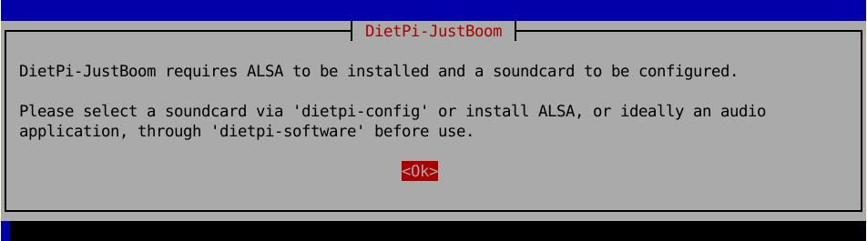{: width="642" height="228" loading="lazy"}

In diesem Fall müssen Sie z.B. über `dietpi-software` ein Soundprogrammpaket installieren oder die Soundausgabe konfigurieren z.B. über `dietpi-config`.

---
### DietPi survey

DietPi-Umfrage ermöglicht dem DietPi-Projekt, allgemeine Informationen über Ihr System und die installierte Software zu erhalten.
Führen Sie `dietpi-survey`, mit demn folgenden Befehl aus:

```sh
dietpi-survey
```

???+ wichtig "Datenschutz und Ziele"

    Die folgenden Datenschutzregeln und -ziele werden berücksichtigt:

    - Es werden keine privaten Daten gesendet. Niemand kann Sie identifizieren. Es wird keine IP-Adresse bezogen.
    - DietPi-Umfrage ist ein ***Opt-in***-System, was bedeutet, dass keine Daten ohne Ihre ausdrückliche interaktive Erlaubnis gesendet werden.
    - Bei Ihrer ersten interaktiven Anmeldung auf einem frischen DietPi-System werden Sie einmalig nach dem *Opt-in*/*Opt-out*-Modus gefragt.
    - Die übermittelten Daten ermöglichen dem DietPi-Projektteam, die bestmögliche Zukunftserfahrung für alle zu erzielen
        - Fokussierung und Verbesserung besonders beliebter Bereiche,
        - sicherzustellen, dass die gängigsten Geräte und Softwaretitel Unterstützung und Verbesserungen erhalten,
        - Halten Sie den Support für die von Ihnen verwendete Software und Hardware aufrecht.

    **Kurz gesagt:** Indem Sie ***Anmelden*** auswählen, unterstützen Sie das DietPi-Projekt ohne Auswirkungen auf Ihr System oder Ihre privaten Daten.

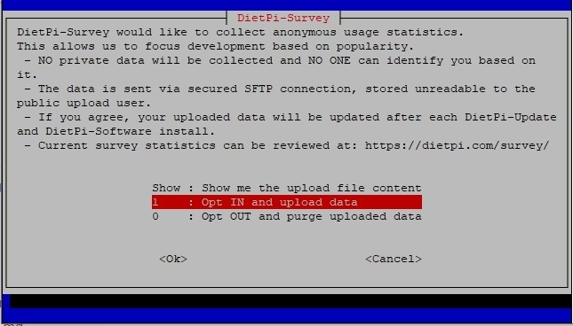{: width="645" height="368" loading="lazy"}

=== "Datenübertragungsereignisse"

    Die Datendatei der DietPi-Umfrage wird gesendet, wenn Sie Software mit „dietpi-software“ installieren und DietPi mit „dietpi-update“ aktualisieren.

=== "Hochgeladene Datenmenge"

    Die hochgeladenen Daten sind winzig (ca. 1 KB) und wirken sich nicht auf Ihre Internetbandbreite oder Systemleistung aus.

=== "Übertragene Dateninhalte"

    Innerhalb des Kommandozeilenprogramms „dietpi-survey“ kann die exakte Kopie der übermittelten Daten eingesehen werden. Die übertragene Datei ist in Bash-Code geschrieben, um uns eine schnellere Berichtsseitenerstellung zu ermöglichen (z. B. für <https://dietpi.com/survey>).

    Im Folgenden sehen Sie ein Beispiel, wie diese Datei aussehen könnte:

   ```sh
    #!/bin/bash
    ((aDIETPI_VERSION[6.34]++))
    ((aGIT_BRANCH[MichaIng/master]++))
    ((aDEVICE_NAME[Virtual Machine (x86_64)]++))
    ((aCPU_ARCH[x86_64]++))
    ((aCPU_COUNT[2]++))
    ((aDISTRO_VERSION[buster]++))
    ((aAUTOSTART_OPTION[${aAUTOSTART_NAME[0]:=0}]++))
    ((aAUTO_SETUP_AUTOMATED[0]++))
    ((aNETWORK_INTERFACE[eth0]++))
    # -------------------------
    # DietPi-Software installs
	# DietPi-Software installiert
    # -------------------------
    ((aSOFTWARE[${aSOFTWARE_NAME6_34[103]:=103}]++))
    ((aSOFTWARE[${aSOFTWARE_NAME6_34[104]:=104}]++))
    ```

    Das Ende der Datei listet installierte Softwarepakete nach ihren IDs auf. Das obige Beispiel zeigt ein sehr einfaches System, daher werden nur zwei Softwarepakete (`#103`: DietPi-RAMlog, `#104`: Dropbear) installiert.
    Um die Namen der installierten Softwarepaket-IDs herauszufinden, die über `dietpi-software` installiert wurden, können Sie ausführen

    ```sh
    dietpi-software list | grep ' =2'
    ```

    Dies gibt die IDs, Namen und Informationen der Software. Das obige Beispiel würde zeigen

    ```sh
    # dietpi-software list | grep ' =2'
    id 103 | =2 | dietpi-ramlog: minimal, optimised logging | | https://dietpi.com/docs/software/log_system/#dietpi-ramlog
    id 104 | =2 | dropbear: lightweight ssh server | | https://dietpi.com/docs/software/ssh/#dropbear
    ```

=== "Opt-in oder Opt-out auswählen"

    Sie können ***Opt-in*** oder ***Opt-out*** von DietPi Survey auswählen, indem Sie den folgenden Befehl ausführen und den Anweisungen folgen:

    ```sh
    dietpi-survey
    ```

    Dies kann auch durch Setzen von `SURVEY_OPTED_IN=0` (*Opt-out*) oder `SURVEY_OPTED_IN=1` (*Opt-in*) in `/boot/dietpi.txt` vor dem ersten Systemstart erreicht werden.

    Um den aktuellen Stand zu prüfen, kann `dietpi-survey` aufgerufen werden. Der aktuelle Modus wird vorausgewählt und hervorgehoben.
    Alternativ können Sie verwenden

    ```sh
    grep 'SURVEY_OPTED_IN' /boot/dietpi.txt
    ```

    die den Status wie anzeigt

    ```sh
    # grep 'SURVEY_OPTED_IN' /boot/dietpi.txt
    SURVEY_OPTED_IN=1
    ```

---

## Systemwartung

### DietPi-Update

Aktualisieren Sie die DietPi-Betriebssystemversion auf die neueste verfügbare Version und informieren Sie, wenn Updates für „apt upgrade“ verfügbar sind.
Führen Sie `dietpi-update`, mit demn folgenden Befehl aus:

```sh
dietpi-update
```

---

### DietPi-Reiniger

Bereinigen Sie nicht benötigte Dateien aus dem Betriebssystem und geben Sie wertvollen Speicherplatz frei.
Betrachten Sie es als leichtgewichtigen CCleaner für DietPi und Linux.
Führen Sie `dietpi-cleaner`, mit demn folgenden Befehl aus:

```sh
dietpi-cleaner
```

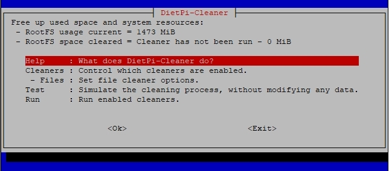{: width="644" height="284" loading="lazy"}

Durch Simulation des Cleaner-Vorgangs (über Menüeintrag „Test“) erhalten Sie eine Vorschau der Löschvorgänge, die der Cleaner durchführt, bevor Sie den Reinigungsprozess starten (über Menüeintrag „Ausführen“).

#### Reinigungstypen

DietPi-Cleaner verwendet Module, die Sie vor dem Ausführen des Reinigungsprozesses ein- oder ausschalten können. Wählen Sie diese über den Hauptmenüeintrag „Reiniger“ aus.

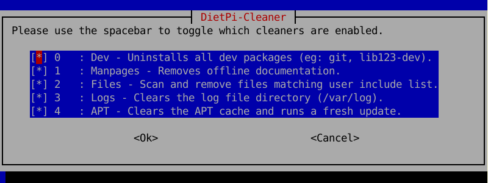{: width="644" height="242" loading="lazy"}

#### Dateien sauberer

Mit dem Dateibereiniger können Sie eine Liste mit Dateinamen anpassen, die während des Bereinigungsprozesses gesucht und entfernt werden sollen. Wählen Sie diese über den Hauptmenüeintrag `Dateien` aus.

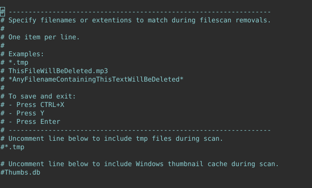{: width="644" height="388" loading="lazy"}

### DietPi-Protokoll löschen

Protokolldateien in `/var/log/` löschen.
Führen Sie `dietpi-logclear`, mit demn folgenden Befehl aus:

```sh
dietpi-logclear
```

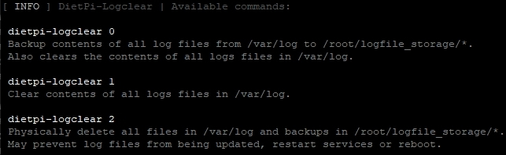{: width="643" height="198" loading="lazy"}

### DietPi-Sicherung (Sichern/Wiederherstellen)

`DietPi-Backup` ermöglicht Ihnen, Ihr DietPi-System zu sichern und wiederherzustellen, ähnlich der *Windows-Systemwiederherstellung*. Es erstellt eine Momentaufnahme des Systems, die jederzeit wiederhergestellt werden kann.
`DietPi-Backup` bietet folgende Features:

- Auswahl des **Zielverzeichnisses** (auch remote gemountete Shares sind möglich)
- Anpassung, welche **Dateien und Verzeichnisse** **eingeschlossen** und **ausgeschlossen** sind
- Aktivierung von **automatischen täglichen Backups**
- Einstellung einer **Anzahl aufzubewahrender Backups**
  Backups werden rotieren automatisch und wenn die maximale Anzahl erreicht ist, wird das älteste Backup als Grundlage für die inkrementelle neue Backup-Synchronisierung verwendet. 

Führen Sie `dietpi-backup`, mit demn folgenden Befehl aus:

```sh
dietpi-backup
```

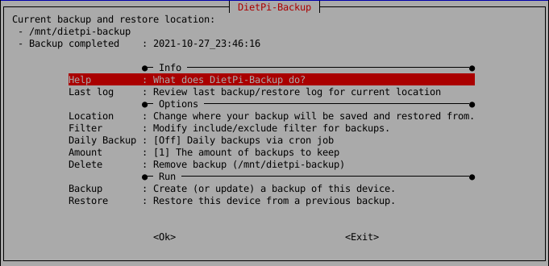{: width="681" height="330" loading="lazy"}
=== "Automatisches tägliches Backup"

     `Dietpi-Backup` bietet die Möglichkeit einer automatischen täglichen Backup-Funktion (gesteuert über den Linux-`Cron`-Mechanismus).

     Es enthält diese Optionen (siehe Screenshot oben):

     - „Daily Backup“: Aktiviert das tägliche Backup
     - „Anzahl“: Legt die Anzahl der aufzubewahrenden Backups fest. Backups werden automatisch rotiert, wenn die maximale Menge erreicht ist, wird das älteste Backup als Grundlage für den inkrementellen neuen Backup-Sync verwendet

     **Tägliche Backup-Ausführungszeit**

     Das automatische tägliche Backup (aktiviert über die Option „Daily Backup“, siehe Screenshot oben) wird über den Linux-Cron-Mechanismus gesteuert. Das Einstellen einer anderen Startzeit kann eine Option sein, z. wenn Sie mehrere Backup-Clients haben, die auf denselben Speicher (Backup-Server) sichern: Die Verschiebung der Backup-Startzeit dieser Systeme kann eine vorübergehende Überlastung des Backup-Servers verringern, indem gleichzeitiger Zugriff auf den Speicher vermieden wird.

     Der Startzeitpunkt wird grundsätzlich über die Datei `/etc/crontab` (die die Backup/Restore-Funktion über das Skript `/etc/cron.daily/dietpi` aufruft) definiert. Sie kann über den Eintrag `cron.daily` innerhalb von [`dietpi-cron`](#dietpi-cron) geändert werden. Es wird durch Ausführen des folgenden Befehls ausgeführt

     Bitte beachten Sie, dass alle anderen täglichen `cron`-basierten Verfahren ebenfalls zu dieser geänderten Zeit gestartet werden.

=== "Auswahl der Sicherungsdatei (Filter)"

     Die Definition, welche Dateien für den Backup-Vorgang verwendet werden, wird über die Option „Filter“ festgelegt (siehe Screenshot oben). Dadurch wird „nano“ geöffnet, um die Einschluss-/Ausschlussdefinitionen für das Backup zu bearbeiten.
     Die Filterdefinitionssyntax wird in der Datei selbst beschrieben.

     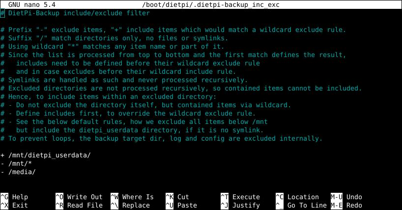{: width="681" height="330" loading="lazy"}

     Die Datei mit den Filterdefinitionen ist `/boot/dietpi/.dietpi-backup_inc_exc`.

=== "Leerzeichenprüfung"

     Eine Speicherplatzprüfung am Zielort vor dem Backup-Vorgang kann aktiviert/deaktiviert werden. Dies kann eine Option sein, wenn sicher genügend Speicherplatz verfügbar ist.
     Das Aktivieren der Speicherplatzprüfung macht das Backup etwas sicherer, das Deaktivieren beschleunigt es.

=== "Protokollierung"

     Protokollinformationen über den Sicherungsvorgang werden in den Dateien `.dietpi-backup_stats` und `.dietpi-backup.log` gegeben, die sich im Zielverzeichnis der Sicherung befinden (Option "Location"):

     - `.dietpi-backup_stats` gibt eine Liste der abgeschlossenen Operationen mit Uhrzeit und Datum aus
     - `.dietpi-backup.log` gibt eine Liste aller verarbeiteten Dateien

=== "Einstellungsdateien"

     Im Allgemeinen werden die Einstellungen des DietPi-Backups über die Menüeinträge des Befehls „dietpi-backup“ geändert.

     Das System speichert diese Einstellungen in den Dateien „/boot/dietpi/.dietpi-backup_settings“ und „/boot/dietpi/.dietpi-backup_inc_exc“, die von „dietpi-backup“ automatisch generiert werden. Daher müssen die Dateien nicht manuell vom Benutzer geändert werden.
	 
!!! info "DietPi-Benutzerdaten dürfen nicht enthalten sein"

    Wenn DietPi-Benutzerdaten auf ein externes Laufwerk verschoben wurden, d.h. `/mnt/dietpi_userdata` ist ein Symlink, wird dessen Inhalt standardmäßig von der Sicherung und Wiederherstellung ausgeschlossen. Sie können dies mit der Option „Filter“ ändern.

!!! info "DietPi-Backup basiert rein auf `Rsync`"

    Falls das Paket „rsync“ nicht installiert ist, erfolgt dies automatisch, sobald Sie eine Sicherung oder Wiederherstellung starten.

!!! Achtung "Eingeschränkter Systembetrieb während DietPi-Backup läuft"

     Während des Laufs von `dietpi-backup` werden alle Dienste gestoppt. Dies ist z.B. wenn Backups geplant werden.

     - Beispielsweise wird eine Webserver-basierte Anwendung (z. B. Nextcloud oder viele Medienserver wie Plex, Navidrome usw.) nicht ausgeführt, da die Webserver-basierte Benutzeroberfläche angehalten wird.
     - Außerdem werden viele der entsprechenden Backend-Dienste sowie grundlegende Dienste wie der Samba- oder NFS-Dienst gestoppt.

---
### DietPi-Datei-Explorer

Leichter Dateimanager und Explorer.
Führen Sie `dietpi-explorer`, mit demn folgenden Befehl aus:

```sh
dietpi-explorer
```

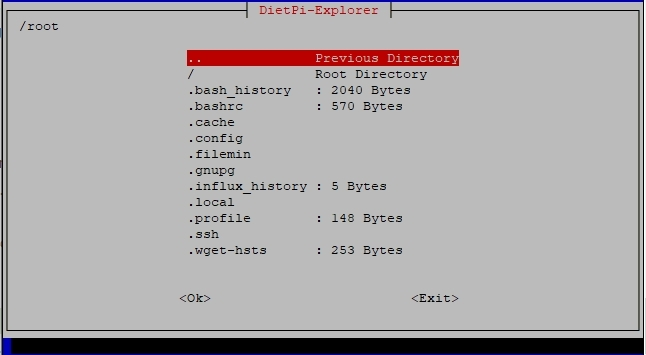{: width="646" height="355" loading="lazy"}

---
### DietPi-sync

Mit DietPi-Synchronisation können Sie ein Verzeichnis von einem Ort (*Quellort*) zu einem anderen (*Zielort*) duplizieren.
Führen Sie `dietpi-sync`, mit demn folgenden Befehl aus:
```sh
dietpi-sync
```
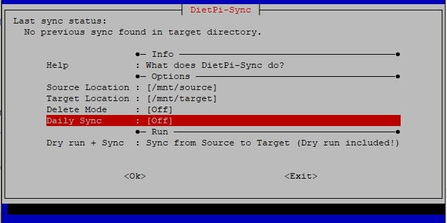{: width="646" height="322" loading="lazy"}

Beispiel: Wenn Sie die Daten auf Ihrer externen USB-Festplatte an einen anderen Speicherort duplizieren (synchronisieren) möchten, wählen Sie einfach die USB-Festplatte als Quelle und dann einen Zielspeicherort aus. Der Zielspeicherort kann ein beliebiger Samba-Dateiserver im Netzwerk oder sogar ein FTP-Server sein.
Jede Synchronisierung enthält einen führenden Probelauf, nach dem Sie das erwartete Ergebnis überprüfen können, bevor Sie entscheiden, ob Sie mit der eigentlichen Synchronisierung fortfahren möchten.

---
## Verschiedene Werkzeuge

### Nützliche DietPi-Shell-Funktionen

Es gibt ein paar allgemeine Befehle, die in DietPi eine Abkürzung haben:

- `G_OBTAIN_CPU_TEMP` - Gibt die CPU-Temperatur im Ganzzahlformat in Grad Celsius aus, für die Überwachung wahrscheinlich besser als die vollständige `CPU`-Ausgabe
- `G_OBTAIN_CPU_USAGE` - Gibt die CPU-Auslastung in Prozent im Format [x]x.x aus
- `G_TREESIZE` - Zeigt die aktuellen Verzeichnis-/Dateigrößen rekursiv an

Die folgenden Befehle sind nicht-interaktive, aber fehlerbehandelte Wrapper für `apt-get`-Befehle, nützlich für Skripte, die nicht-interaktiv laufen sollen, aber interaktive Wiederholungs- und Lösungsversuche zulassen:

- `G_AGI` - `apt-get install` und den Namen der APT angeben. 
- `G_AGP` - `apt-get purge` bereinigen.
- `G_AGA` - `apt-get autoremove --purge` automatisches bereinigen.
- `G_AGUP` - `apt-get update` führt ein Update aus. 
- `G_AGUG` - `apt-get upgrade` führt ein Upgrade aus. 
- `G_AGDUG` - `apt-get dist-upgrade` führt ein Distro-Upgrade aus. 

---
### DietPi-Banner

Ermöglicht die Konfiguration des anfänglichen Banners, das bei der Anmeldung angezeigt wird.
Führen Sie `dietpi-banner`, mit demn folgenden Befehl aus:

```sh
dietpi-banner
```

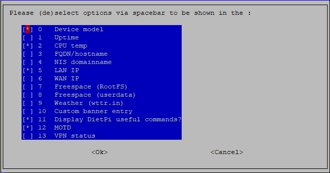{: width="643" height="338" loading="lazy"}

Mit diesen Einstellungen können Sie die anfangs angezeigten Informationen konfigurieren und die anfangs angezeigten Details auswählen. Unten sehen Sie ein Beispiel, in dem 4 Optionen ausgewählt sind:

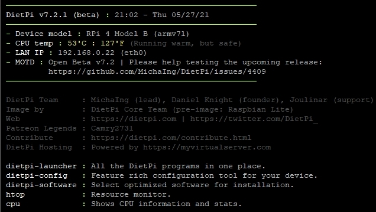{: width="636" height="359" loading="lazy"}

---
### DietPi-CPU-Info

Zeigt CPU-Temperatur, Prozessorfrequenz, Drosselungsstufe usw. an.
Führen Sie `cpu` aus.

```sh
cpu
```
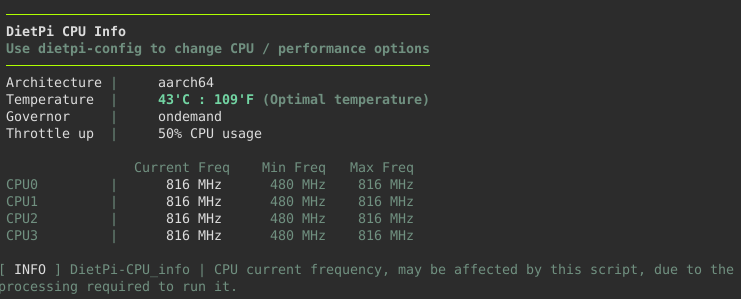{: width="741" height="299" loading="lazy"}

---
### DietPi-Morse-code

Es wandelt eine Textdatei in Morsecode um.
Führen Sie `dietpi-morsecode` aus.
```sh
dietpi-morsecode
```

---
### DietPi-Fehlerbericht

Führen Sie `dietpi-bugreport` aus.
```sh
dietpi-bugreport
```

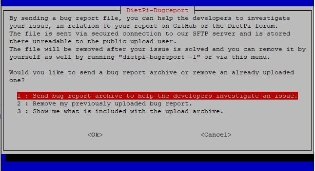{: width="646" height="352" loading="lazy"}