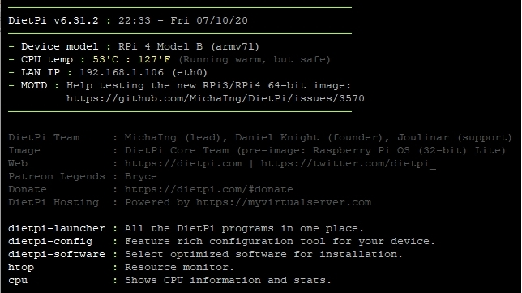

# Einstieg

## Überblick

Sobald Sie die [DietPi-Installation](../install/) abgeschlossen haben, können Sie wählen, ob Sie ein oder mehrere [DietPi-optimierte Softwareelemente](../software/) installieren oder eines der [DietPi-Tools](../ dietpi_tools/).

## Erster Start

Dies ist der erste Bildschirm, der angezeigt wird.

{: width="644" height="361" loading="lazy"}

## DietPi-Launcher

Führen Sie „dietpi-launcher“ aus, um alle verfügbaren DietPi-Tools anzuzeigen. Es bietet eine schnelle Möglichkeit, eines der DietPi-Tools auszuführen: von der Installation von **DietPi-optimierten Softwareelementen** bis zur einfachen Konfiguration Ihres Geräts, von der Aktivierung von Diensten bis zum Start Ihrer Installation und so weiter.

{: width="642" height="366" loading="lazy"}

## DietPi-Software -- Wählen Sie die Software, die Sie benötigen

Die Basisinstallation von DietPi ist **von Natur aus** minimal, sodass Sie auswählen können, welche Software Sie installieren und verwenden möchten. Wenn Sie sich nicht sicher sind, welche Software Sie installieren sollen, besuchen Sie die Seite [DietPi-optimierte Software](../software/) für weitere Details.

Die Liste der für DietPi optimierten Software umfasst:

- Desktop-Umgebungen
- Remote-Desktops
- Mediensysteme/Player
- Torrents/Herunterladen (Übertragung)
- Datensicherung in der Cloud
- Spielen
- Sozial
- Hotspots
- Systemstatistiken
- Hardware-Projekte
- Stacks (LAMP/LEMP etc.)
- Dateiserver
- Heimautomatisierung
- Drucken
- und [viel mehr...](../software/).

Um sie zu installieren und zu konfigurieren, verwenden Sie das Tool `dietpi-software` - [klicken Sie für weitere Details](../dietpi_tools/#dietpi-software).

{: width="643" height="365" loading="lazy"}

## Unterstützte SBC

Siehe die Liste der [unterstützten Einplatinencomputer (SBCs)](../hardware/)