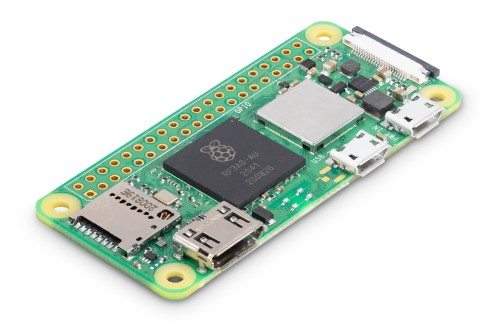

# Unterstützte Hardware

## Himbeer-Pi

Der Raspberry Pi wurde seit seiner Einführung im Jahr 2012 mehr als 31 Millionen Mal verkauft. Jeder Raspberry Pi kann als Zweitcomputer für E-Mails und das Surfen im Internet dienen. Der wahre Spaß beginnt, wenn Sie Ihren Pi für Projekte verwenden, die von Robotern über Retro-Arcade-Automaten bis hin zu Heimmedienservern, Sicherheitskameras und so weiter reichen können.

Sie können DietPi installieren, indem Sie die Schritt-für-Schritt-Anleitung [Startanleitung](../install/) befolgen.

DietPi läuft auf allen Raspberry Pi-Boards und -Computern. Dazu gehört der neu eingeführte [Raspberry Pi 400](https://www.raspberrypi.org/products/raspberry-pi-400/?resellerType=home),

{: width="800" height="571" loading="lazy"}

oder die neuesten **Raspberry Pi 4 Model B** Boards, die 2019 sowie 2020 auf den Markt kamen.

{: width="500" height="292" loading="lazy"}

DietPi läuft auch auf einem der ersten Modelle **Raspberry Pi 1**, das 2012 auf den Markt kam

{: width="500" height="242" loading="lazy"}

und sogar auf der kompakten Form **Raspberry Pi Zero**, sowohl **Zero W/WH** als auch **Zero 2 W**

{: width="500" height="333" loading="lazy"}

**New Zero** kurze Einführung:

<iframe src="https://www.youtube-nocookie.com/embed/V2frBYX62LU?rel=0" frameborder="0" allow="fullscreen" width="560" height="315" loading="lazy" ></iframe>

<div class="md-typeset__table">
    <Tabelle>
        <Kopf>
            <tr>
                <th><strong>Produkt</strong></th>
                <th><strong>Beschreibung</strong></th>
            </tr>
        </thead>
        <tbody>
            <tr>
                <td><a class="table"><strong>Raspberry Pi – ALLE Modelle</strong><br>Single Board Computer (SBC)<br>Compute Module (CM)</a></td>
                <td>
                    <strong>DietPi-Image für ALLE Raspberry Pi-Modelle</strong>: <a href="https://dietpi.com/downloads/images/DietPi_RPi-ARMv6-Bullseye.7z">Image herunterladen</a>
                    <stark>
                        <ul>
                            <li>Raspberry Pi Zero 2 W</li>
                            <li>Raspberry Pi 400</li>
                            <li>Raspberry Pi 4 Modell B<br>Rechenmodul 4</li>
                            <li>Raspberry Pi 3 Modell A+ / B / B+<br>Rechenmodul 3 / 3+</li>
                            <li>Raspberry Pi 2 Modell B v1.1 / B v1.2</li>
                            <li>Raspberry Pi 1 Modell A / A+ / B / B+<br>Rechenmodul 1</li>
                            <li>Raspberry Pi Zero / Zero W / Zero WH</li>
                        </ul>
                    </strong>
                </td>
            </tr>
            <tr>
                <td><a class="table"><strong>Raspberry Pi - ARMv7</strong><br>Einplatinencomputer (SBC)<br>Rechenmodul (CM)</a></td>
                <td>
                    <strong>DietPi-Image für Raspberry Pi mit ARMv7-CPU oder höher</strong>: <a href="https://dietpi.com/downloads/images/DietPi_RPi-ARMv7-Bullseye.7z">Image herunterladen</a>
                    <stark>
                        <ul>
                            <li>Raspberry Pi Zero 2 W</li>
                            <li>Raspberry Pi 400</li>
                            <li>Raspberry Pi 4 Modell B<br>Rechenmodul 4</li>
                            <li>Raspberry Pi 3 Modell A+ / B / B+<br>Rechenmodul 3 / 3+</li>
                            <li>Raspberry Pi 2 Modell B v1.1 / B v1.2</li>
                        </ul>
                    </strong>
                </td>
            </tr>
            <tr>
                <td><a class="table"><strong>Raspberry Pi - ARMv8</strong><br>Einplatinencomputer (SBC)<br>Rechenmodul (CM)</a></td>
                <td>
                    <strong>DietPi-Image für Raspberry Pi mit ARMv8/64-Bit-CPU</strong>: <a href="https://dietpi.com/downloads/images/DietPi_RPi-ARMv8-Bullseye.7z">Image herunterladen</ a>
                    <stark>
                        <ul>
                            <li>Raspberry Pi Zero 2 W</li>
                            <li>Raspberry Pi 400</li>
                            <li>Raspberry Pi 4 Modell B<br>Rechenmodul 4</li>
                            <li>Raspberry Pi 3 Modell A+ / B / B+<br>Rechenmodul 3 / 3+</li>
                            <li>Raspberry Pi 2 Modell B v1.2</li>
                        </ul>
                    </strong>
                </td>
            </tr>
        </tbody>
    </table>
</div>

##Odroid

ODROID Einplatinencomputer sind leistungsstark, stabil und leistungsfähig. Sie können als Heimkino-Set-Top-Box, als Allzweckcomputer zum Surfen im Internet, zum Spielen und für soziale Kontakte, als kompaktes Werkzeug für die Uni- oder Büroarbeit, als Prototyping-Gerät zum Basteln von Hardware, als Controller für die Heimautomatisierung, als Workstation für Software fungieren Entwicklung und vieles mehr. Weitere Informationen finden Sie unter <a target="_blank" rel="noopener" href="https://www.hardkernel.com/">Hardkernel.com</a>

ODROID-N2 ist eines der unterstützten Boards.

{: width="500" height="353" loading="lazy"}

Es ist ein Einplatinencomputer der neuen Generation, der auf dem Amlogic S922X SoC basiert und der [schnellste](https://dietpi.com/survey/#benchmark), den wir bis zum Zeitpunkt des Schreibens gemessen haben. Die Haupt-CPU des N2 besteht aus einer big.LITTLE Quad-Core-Cortex-A73 + Dual-Core-Cortex-A53-Kombination. Dank der modernen 12-nm-Siliziumtechnologie laufen die A73-Kerne mit bis zu 1,8 GHz (N2) bzw. 2,4 GHz (N2+) ohne thermische Drosselung unter Verwendung des serienmäßigen Kühlkörpers im Metallgehäuse, was einen robusten und leisen Computer ermöglicht.

<div class="md-typeset__table">
    <Tabelle>
        <Kopf>
            <tr>
                <th><strong>Produkt</strong></th>
                <th><strong>Beschreibung</strong></th>
            </tr>
        </thead>
        <tbody>
            <tr>
                <td><a class="table" href=""><strong>Odroid C1</strong></a></td>
                <td>
                   <strong>Herunterladen</strong>: <a href="https://dietpi.com/downloads/images/DietPi_OdroidC1-ARMv7-Bullseye.7z">DietPi-Image</a>
                </td>
            </tr>
            <tr>
                <td><a class="table" href=""><strong>Odroid C2</strong></a></td>
                <td>
                   <strong>Herunterladen</strong>: <a href="https://dietpi.com/downloads/images/DietPi_OdroidC2-ARMv8-Bullseye.7z">DietPi-Image</a>
                </td>
            </tr>
            <tr>
                <td><a class="table" href=""><strong>Odroid C4 / HC4</strong></a></td>
                <td>
                   <strong>Herunterladen</strong>: <a href="https://dietpi.com/downloads/images/DietPi_OdroidC4-ARMv8-Bullseye.7z">DietPi-Image</a>
                </td>
            </tr>
            <tr>
                <td><a class="table" href=""><strong>Odroid N2</strong></a></td>
                <td>
                   <strong>Herunterladen</strong>: <a href="https://dietpi.com/downloads/images/DietPi_OdroidN2-ARMv8-Bullseye.7z">DietPi-Image</a>
                </td>
            </tr>
            <tr>
                <td><a class="table" href=""><strong>Odroid XU3 / XU4 / MC1 / HC1 / HC2</strong></a></td>
                <td>
                   <strong>Herunterladen</strong>: <a href="https://dietpi.com/downloads/images/DietPi_OdroidXU4-ARMv7-Bullseye.7z">DietPi-Image</a>
                </td>
            </tr>
        </tbody>
    </table>
</div>

## KIEFER64

Hier begann die Reise von PINE64. Der PINE A64 ist ihr erster Einplatinencomputer, der von Allwinners A64 Quad-Core ARM Cortex A53 64-Bit SOC angetrieben wird. Weitere Informationen finden Sie unter <a target="_blank" rel="noopener" href="https://www.pine64.org/">PINE64.org</a>

Der ROCKPro64 ist der leistungsstärkste Einplatinencomputer von PINE64.

{: width="500" height="375" loading="lazy"}

Es verfügt über einen Rockchip RK3399 Hexa-Core-SOC und bis zu 4 GiB Dual-Channel-LPDDR4-Systemspeicher. Darüber hinaus ist das Board vollgepackt mit Funktionen, darunter: ein USB 3.0- und USB Typ C mit DP1.2-Anschluss, ein vollständiger PCIe x4 sowie ein eMMC-Modulsockel. Sie erhalten auch einen 40-Pin-Header mit I2C, SPI, UART und GPIO.

Das Board ist abwärtskompatibel mit vielen der bestehenden PINE64-Peripheriegeräte, einschließlich des WiFi/Bluetooth-Moduls, des Kameramoduls und des LCD-Panels, aber es ist auch eine Reihe neuer Peripheriegeräte speziell für das Board erhältlich. All dies in genau der gleichen Modell-A-Dimension wie die ursprüngliche PINE A64.

Das ROCKPro64 4 GiB Board wird als LTS (Long Term Support) bezeichnet, was bedeutet, dass PINE64 sich verpflichtet hat, mindestens 5 Jahre lang Support zu leisten – bis zum Jahr 2023 und darüber hinaus.

<div class="md-typeset__table">
    <Tabelle>
        <Kopf>
            <tr>
                <th><strong>Produkt</strong></th>
                <th><strong>Beschreibung</strong></th>
            </tr>
        </thead>
        <tbody>
            <tr>
                <td><a class="table" href=""><strong>PINE A64</strong></a></td>
                <td>
                   <strong>Herunterladen</strong>: <a href="https://dietpi.com/downloads/images/DietPi_PInea64-ARMv8-Bullseye.7z">DietPi-Image</a>
                </td>
            </tr>
            <tr>
                <td><a class="table" href=""><strong>PINE H64</strong></a></td>
                <td>
                   <strong>Herunterladen</strong>: <a href="https://dietpi.com/downloads/images/DietPi_PINEH64-ARMv8-Bullseye.7z">DietPi-Image</a>
                </td>
            </tr>
            <tr>
                <td><a class="table" href=""><strong>Pinebook</strong></a></td>
                <td>
                   <strong>Herunterladen</strong>: <a href="https://dietpi.com/downloads/images/DietPi_Pinebook-ARMv8-Bullseye.7z">DietPi-Image</a>
                </td>
            </tr>
            <tr>
                <td><a class="table" href=""><strong>Pinebook Pro</strong></a></td>
                <td>
                   <strong>Herunterladen</strong>: <a href="https://dietpi.com/downloads/images/DietPi_PinebookPro-ARMv8-Bullseye.7z">DietPi-Image</a>
                </td>
            </tr>
            <tr>
                <td><a class="table" href=""><strong>ROCK64</strong></a></td>
                <td>
                   <strong>Herunterladen</strong>: <a href="https://dietpi.com/downloads/images/DietPi_ROCK64-ARMv8-Bullseye.7z">DietPi-Image</a>
                </td>
            </tr>
            <tr>
                <td><a class="table" href=""><strong>ROCKPro64</strong></a></td>
                <td>
                   <strong>Herunterladen</strong>: <a href="https://dietpi.com/downloads/images/DietPi_ROCKPro64-ARMv8-Bullseye.7z">DietPi-Image</a>
                </td>
            </tr>
        </tbody>
    </table>
</div>

##Radxa

**Maker-freundlich, IoT-Konnektivität** aktiviert.

**Radxa ROCK Pi und Radxa Zero** verfügen über herstellerfreundliche Erweiterungsoptionen, einschließlich einer 40-poligen GPIO-Schnittstelle, die eine Schnittstelle mit einer Reihe von Eingängen von Tasten, Schaltern, Sensoren, LEDs und vielem mehr ermöglicht.
Für weitere Details besuchen Sie den [**Radxa ROCK Pi**](https://rockpi.org/) bzw. die [**Radxa Wiki**](https://wiki.radxa.com/Home)-Website.

Eines der unterstützten Boards ist ROCK Pi 4.

{: width="500" height="375" loading="lazy"}

**ROCK Pi 4** ist ein Single Board Computer (SBC) in einem ultrakleinen Formfaktor, der erstklassige Leistung bietet und gleichzeitig hervorragende mechanische Kompatibilität nutzt. Der ROCK Pi 4 bietet Makern, IoT-Enthusiasten, Hobbyisten, PC-Heimwerkern und anderen eine zuverlässige und äußerst leistungsfähige Plattform zum Bauen und Basteln ihrer Ideen in die Realität.
Es verfügt auch über ein Gbit-LAN ​​für das Netzwerk, mit dediziertem Bus und Controller, es funktioniert ohne Latenz bei Netzwerkanwendungen mit hoher Auslastung.

**Radxa Zero** ist ein ultradünner SBC in kleinem Formfaktor mit starker Leistung basierend auf Amlogic S905Y2. Radxa Zero verfügt über einen Quad Core 64 ARM-Prozessor, 32-Bit-LPDDR4, bis zu 4K bei 60 HDMI, 802.11 ac WIFI, Bluetooth 5.0, USB 3.0, 40-Pin-GPIO-Header. Radxa Zero unterstützt USB 2.0 und Stromversorgung über einen USB-C-Anschluss.

{: width="500" loading="lazy"}

<div class="md-typeset__table">
    <Tabelle>
        <Kopf>
            <tr>
                <th><strong>Produkt</strong></th>
                <th><strong>Beschreibung</strong></th>
            </tr>
        </thead>
        <tbody>
            <tr>
                <td><a class="table" href=""><strong>ROCK Pi 4</strong></a></td>
                <td>
                   <strong>Herunterladen</strong>: <a href="https://dietpi.com/downloads/images/DietPi_ROCKPi4-ARMv8-Bullseye.7z">DietPi-Image</a>
                </td>
            </tr>
            <tr>
                <td><a class="table" href=""><strong>ROCK Pi S</strong></a></td>
                <td>
                   <strong>Herunterladen</strong>: <a href="https://dietpi.com/downloads/images/DietPi_ROCKPiS-ARMv8-Bullseye.7z">DietPi-Image</a>
                </td>
            </tr>
            <tr>
                <td><a class="table" href=""><strong>Radxa Zero</strong></a></td>
                <td>
                   <strong>Herunterladen</strong>: <a href="https://dietpi.com/downloads/images/DietPi_RadxaZero-ARMv8-Bullseye.7z">DietPi-Image</a>
                </td>
            </tr>
        </tbody>
    </table>
</div>

## Allo Sparky SBC

Sparky Single Board Computer (SBC) ist ein scheckkartengroßes Board, das als eigenständiger Computer, in Elektronikprojekten, Spielen und auch in vielen anderen Anwendungen verwendet werden kann. Ein von der Community unterstützter eingebetteter Computer mit echter offener Hardware für Entwickler und Bastler. Der Sparky SBC hat alle Funktionen eines einfachen Computers. Weitere Informationen finden Sie auf der [**Allo Sparky SBC**](https://www.allo.com/sparky/sparky-sbc.html)-Website.

{: width="500" height="412" loading="lazy"}

<div class="md-typeset__table">
    <Tabelle>
        <Kopf>
            <tr>
                <th><strong>Produkt</strong></th>
                <th><strong>Beschreibung</strong></th>
            </tr>
        </thead>
        <tbody>
            <tr>
                <td><a class="table" href=""><strong>Sparky-SBC</strong></a></td>
                <td>
                   <strong>Herunterladen</strong>: <a href="https://dietpi.com/downloads/images/DietPi_SparkySBC-ARMv7-Bullseye.7z">DietPi-Image</a>
                </td>
            </tr>
        </tbody>
    </table>
</div>

## ASUS Tinker-Board

Tinker Board ist ein Single Board Computer (SBC) in einem ultrakleinen Formfaktor, der eine erstklassige Leistung bietet und gleichzeitig eine hervorragende mechanische Kompatibilität nutzt. Das Tinker Board bietet Makern, IoT-Enthusiasten, Hobbyisten, PC-Heimwerkern und anderen eine zuverlässige und äußerst leistungsfähige Plattform, um ihre Ideen in die Realität umzusetzen und zu basteln. Weitere Informationen finden Sie auf der [**ASUS Tinker Board**](https://tinker-board.asus.com/index.html)-Website.

Tinker Board verfügt über standardmäßige Konnektivitätsoptionen von Herstellern, einschließlich einer 40-poligen GPIO-Schnittstelle, die eine Verbindung mit einer Reihe von Eingängen von Tasten, Schaltern, Sensoren, LEDs und vielem mehr ermöglicht.

{: width="500" height="353" loading="lazy"}

Tinker Board ist mit einem DSI MIPI-Anschluss für Displays und Touchscreens ausgestattet. Die sekundäre CSI-MIPI-Verbindung dient zum Anschluss an kompatible Kameras, die Computer Vision und vieles mehr ermöglichen.

Sorgfältige Überlegungen gingen in das Design und die Entwicklung des Tinker Boards ein, um sicherzustellen, dass es sowohl Anfängern als auch erfahrenen Bastlern ein hervorragendes Benutzererlebnis bietet. Bauherren schätzen den farbcodierten GPIO-Header, der das Erkennen der jeweiligen Stiftleisten erleichtert.

<div class="md-typeset__table">
    <Tabelle>
        <Kopf>
            <tr>
                <th><strong>Produkt</strong></th>
                <th><strong>Beschreibung</strong></th>
            </tr>
        </thead>
        <tbody>
            <tr>
                <td><a class="table" href=""><strong>ASUS Tinker Board</strong></a></td>
                <td>
                   <strong>Herunterladen</strong>: <a href="https://dietpi.com/downloads/images/DietPi_ASUSTB-ARMv7-Bullseye.7z">DietPi-Image</a>
                </td>
            </tr>
        </tbody>
    </table>
</div>

## NanoPi-Serie (FriendlyARM)

**SBC der nächsten Generation von FriendlyARM** – Einer der schnellsten ARM-SBC (RK3399) auf dem heutigen Markt, mit 2 x 1,8-GHz-A72-Kernen und 4 x 1,4-GHz-A53-Kernen. Einer der kleinsten verfügbaren RK3399-SBCs, eine großartige Ergänzung Ihrer SBC-Reihe, die SBC-Leistung der nächsten Generation bietet.

Weitere Informationen finden Sie auf der Website [**FriendlyARM**](https://www.friendlyarm.com/).

{: width="500" height="350" loading="lazy"}

**NanoPi K2** unterstützt DVFS und kann High-Definition-Videostreams ruckelfrei wiedergeben und eignet sich sehr gut für Anwendungen wie Werbemaschinen, TV-Boxen, Home-Entertainment-Geräte oder Multimedia-Geräte.

<div class="md-typeset__table">
    <Tabelle>
        <Kopf>
            <tr>
                <th><strong>Produkt</strong></th>
                <th><strong>Beschreibung</strong></th>
            </tr>
        </thead>
        <tbody>
            <tr>
                <td><a class="table" href=""><strong>NanoPi NEO</strong></a></td>
                <td>
                   <strong>Herunterladen</strong>: <a href="https://dietpi.com/downloads/images/DietPi_NanoPiNEO-ARMv7-Bullseye.7z">DietPi-Image</a>
                </td>
            </tr>
            <tr>
                <td><a class="table" href=""><strong>NanoPi NEO Plus2</strong></a></td>
                <td>
                   <strong>Herunterladen</strong>: <a href="https://dietpi.com/downloads/images/DietPi_NanoPiNEOPlus2-ARMv8-Bullseye.7z">DietPi-Image</a>
                </td>
            </tr>
            <tr>
                <td><a class="table" href=""><strong>NanoPi NEO2</strong></a></td>
                <td>
                   <strong>Herunterladen</strong>: <a href="https://dietpi.com/downloads/images/DietPi_NanoPiNEO2-ARMv8-Bullseye.7z">DietPi-Image</a>
                </td>
            </tr>
            <tr>
                <td><a class="table" href=""><strong>NanoPi NEO2 Schwarz</strong></a></td>
                <td>
                   <strong>Herunterladen</strong>: <a href="https://dietpi.com/downloads/images/DietPi_NanoPiNEO2Black-ARMv8-Bullseye.7z">DietPi-Image</a>
                </td>
            </tr>
            <tr>
                <td><a class="table" href=""><strong>NanoPi NEO3</strong></a></td>
                <td>
                   <strong>Herunterladen</strong>: <a href="https://dietpi.com/downloads/images/DietPi_NanoPiNEO3-ARMv8-Bullseye.7z">DietPi-Image</a>
                </td>
            </tr>
            <tr>
                <td><a class="table" href=""><strong>NanoPi NEO4</strong></a></td>
                <td>
                   <strong>Herunterladen</strong>: <a href="https://dietpi.com/downloads/images/DietPi_NanoPiNEO4-ARMv8-Bullseye.7z">DietPi-Image</a>
                </td>
            </tr>
            <tr>
                <td><a class="table" href=""><strong>NanoPi K1 Plus</strong></a></td>
                <td>
                   <strong>Herunterladen</strong>: <a href="https://dietpi.com/downloads/images/DietPi_NanoPiK1Plus-ARMv8-Bullseye.7z">DietPi-Image</a>
                </td>
            </tr>
            <tr>
                <td><a class="table" href=""><strong>NanoPi K2</strong></a></td>
                <td>
                   <strong>Herunterladen</strong>: <a href="https://dietpi.com/downloads/images/DietPi_NanoPiK2-ARMv8-Bullseye.7z">DietPi-Image</a>
                </td>
            </tr>
            <tr>
                <td><a class="table" href=""><strong>NanoPi M1 Plus</strong></a></td>
                <td>
                   <strong>Herunterladen</strong>: <a href="https://dietpi.com/downloads/images/DietPi_NanoPiM1Plus-ARMv7-Bullseye.7z">DietPi-Image</a>
                </td>
            </tr>
            <tr>
                <td><a class="table" href=""><strong>NanoPi M1/T1</strong></a></td>
                <td>
                   <strong>Herunterladen</strong>: <a href="https://dietpi.com/downloads/images/DietPi_NanoPiM1-ARMv7-Bullseye.7z">DietPi-Image</a>
                </td>
            </tr>
            <tr>
                <td><a class="table" href=""><strong>NanoPi M2/T2</strong></a></td>
                <td>
                   <strong>Herunterladen</strong>: <a href="https://dietpi.com/downloads/images/DietPi_NanoPiM2-ARMv7-Bullseye.7z">DietPi-Image</a>
                </td>
            </tr>
            <tr>
                <td><a class="table" href=""><strong>NanoPi M3/T3</strong></a></td>
                <td>
                   <strong>Herunterladen</strong>: <a href="https://dietpi.com/downloads/images/DietPi_NanoPiM3-ARMv8-Bullseye.7z">DietPi-Image</a>
                </td>
            </tr>
            <tr>
                <td><a class="table" href=""><strong>NanoPi M4V2</strong></a></td>
                <td>
                   <strong>Herunterladen</strong>: <a href="https://dietpi.com/downloads/images/DietPi_NanoPiM4V2-ARMv8-Bullseye.7z">DietPi-Image</a>
                </td>
            </tr>
            <tr>
                <td><a class="table" href=""><strong>NanoPC T4</strong></a></td>
                <td>
                   <strong>Herunterladen</strong>: <a href="https://dietpi.com/downloads/images/DietPi_NanoPCT4-ARMv8-Bullseye.7z">DietPi-Image</a>
                </td>
            </tr>
            <tr>
                <td><a class="table" href=""><strong>NanoPi M4</strong></a></td>
                <td>
                   <strong>Herunterladen</strong>: <a href="https://dietpi.com/downloads/images/DietPi_NanoPCT4-ARMv8-Bullseye.7z">DietPi-Image</a>
                </td>
            </tr>
            <tr>
                <td><a class="table" href=""><strong>NanoPi Fire3</strong></a></td>
                <td>
                   <strong>Herunterladen</strong>: <a href="https://dietpi.com/downloads/images/DietPi_NanoPiFire3-ARMv8-Bullseye.7z">DietPi-Image</a>
                </td>
            </tr>
            <tr>
                <td><a class="table" href=""><strong>NanoPi R1</strong></a></td>
                <td>
                   <strong>Herunterladen</strong>: <a href="https://dietpi.com/downloads/images/DietPi_NanoPiR1-ARMv7-Bullseye.7z">DietPi-Image</a>
                </td>
            </tr>
            <tr>
                <td><a class="table" href=""><strong>NanoPi R2S</strong></a></td>
                <td>
                   <strong>Herunterladen</strong>: <a href="https://dietpi.com/downloads/images/DietPi_NanoPiR2S-ARMv8-Bullseye.7z">DietPi-Image</a>
                </td>
            </tr>
            <tr>
                <td><a class="table" href=""><strong>NanoPi R4S</strong></a></td>
                <td>
                   <strong>Herunterladen</strong>: <a href="https://dietpi.com/downloads/images/DietPi_NanoPiR4S-ARMv8-Bullseye.7z">DietPi-Image</a>
                </td>
            </tr>
            <tr>
                <td><a class="table" href=""><strong>ZeroPi</strong></a></td>
                <td>
                   <strong>Herunterladen</strong>: <a href="https://dietpi.com/downloads/images/DietPi_ZeroPi-ARMv7-Bullseye.7z">DietPi-Image</a>
                </td>
            </tr>
        </tbody>
    </table>
</div>

## Native PCs und virtuelle Maschinen

### Native PC-Images

Die nativen PC-Images eignen sich hervorragend für Situationen, in denen die SBC-Leistung einfach nicht ausreicht. Führen Sie eines davon auf jedem x86_64-PC/Server aus und erhalten Sie immer noch die gleichen großartigen DietPi-Funktionen und -Erfahrung. Dieses Image ist für Motherboards mit UEFI-Startunterstützung und integriertem eMMC (z. B.: Z83-II, Beelink AP32 und andere Intel NUC/SBC-Geräte mit integriertem eMMC).

### VMware

Die virtuelle VMware-Maschine (z. B. VMware Player, VMware Fusion) eignet sich hervorragend für Situationen, in denen die SBC-Leistung einfach nicht ausreicht. Führen Sie eines davon auf jedem x86_64-PC/Server (Windows, Linux, macOS) aus und erhalten Sie immer noch die gleichen großartigen DietPi-Funktionen und -Erfahrung.

### VirtualBox

{: width="133" height="136" loading="lazy"}

VirtualBox ist ein Allzweck-Vollvirtualisierungsprogramm für x86-Hardware, das auf Server-, Desktop- und eingebettete Anwendungen ausgerichtet ist.

Die virtuelle Maschine von VirtualBox eignet sich hervorragend für Situationen, in denen die SBC-Leistung einfach nicht ausreicht. Führen Sie eines davon auf jedem x86_64-PC/Server aus und erhalten Sie immer noch die gleichen großartigen DietPi-Funktionen und -Erfahrung.

### Parallels Desktop

{: width="270" height="82" loading="lazy"}

Die virtuelle Maschine von Parallels Desktop für macOS eignet sich hervorragend für Situationen, in denen die SBC-Leistung einfach nicht ausreicht. Führen Sie eines davon auf jedem x86_64-MacOS-System (z. B. Mac mini 2011/2012/2014/2018) aus und erhalten Sie immer noch die gleichen großartigen DietPi-Funktionen und -Erfahrung.

### Hyper-V

Die virtuelle Hyper-V-Maschine eignet sich hervorragend für Situationen, in denen die SBC-Leistung einfach nicht ausreicht. Führen Sie eines davon auf jedem x86_64-PC/Server aus und erhalten Sie immer noch die gleichen großartigen DietPi-Funktionen und -Erfahrung.

<div class="md-typeset__table">
    <Tabelle>
        <Kopf>
            <tr>
                <th><strong>Produkt</strong></th>
                <th><strong>Beschreibung</strong></th>
            </tr>
        </thead>
        <tbody>
            <tr>
                <td><a class="table" href=""><strong>Nativer PC für BIOS/CSM</strong></a></td>
                <td>
                   <strong>Herunterladen</strong>: <a href="https://dietpi.com/downloads/images/DietPi_NativePC-BIOS-x86_64-Bullseye.7z">DietPi-Image</a>
                   <br><strong>Herunterladen</strong>: <a href="https://dietpi.com/downloads/images/DietPi_NativePC-BIOS-x86_64-Bullseye_Installer.7z">Image des DietPi-Installationsprogramms</a>
                </td>
            </tr>
            <tr>
                <td><a class="table" href=""><strong>Nativer PC für UEFI</strong></a></td>
                <td>
                   <strong>Herunterladen</strong>: <a href="https://dietpi.com/downloads/images/DietPi_NativePC-UEFI-x86_64-Bullseye_Installer.7z">Image des DietPi-Installationsprogramms</a>
                </td>
            </tr>
            <tr>
                <td><a class="table" href=""><strong>VMware</strong></a></td>
                <td>
                   <strong>Herunterladen</strong>: <a href="https://dietpi.com/downloads/images/DietPi_VMware-x86_64-Bullseye.7z">DietPi-Appliance</a>
                </td>
            </tr>
            <tr>
                <td><a class="table" href=""><strong>VirtualBox</strong></a></td>
                <td>
                   <strong>Herunterladen</strong>: <a href="https://dietpi.com/downloads/images/DietPi_VirtualBox-x86_64-Bullseye.7z">DietPi-Appliance</a>
                </td>
            </tr>
            <tr>
                <td><a class="table" href=""><strong>Parallels Desktop (x86_64 macOS-System)</strong></a></td>
                <td>
                   <strong>Herunterladen</strong>: <a href="https://dietpi.com/downloads/images/DietPi_Parallels-x86_64-Bullseye.7z">Image des DietPi-Installationsprogramms</a>
                </td>
            </tr>
            <tr>
                <td><a class="table" href=""><strong>Hyper-V</strong></a></td>
                <td>
                   <strong>Herunterladen</strong>: <a href="https://dietpi.com/downloads/images/DietPi_Hyper-V-x86_64-Bullseye.7z">DietPi-Image</a>
                </td>
            </tr>
        </tbody>
    </table>
</div>

## Erstellen Sie Ihre eigene Distribution

Sie können kein verfügbares Bild für Ihr Gerät finden?
Keine Sorge, DietPi enthält ein Skript, das verwendet werden kann, um ein installiertes Debian-basiertes Betriebssystem in DietPi umzuwandeln.

!!! Achtung "Fortgeschrittene Linux-Kenntnisse erforderlich"
    Um Ihre eigene SBC-Unterstützung zu generieren, sind fortgeschrittene Linux-Kenntnisse erforderlich.
    Es gibt keine Garantie, dass dies für jedes System funktioniert. Verwenden Sie das DietPi-Imageerzeugungsskript auf eigene Gefahr!

!!! info "Eingeschränkter Endbenutzer-Support"
    Der Endbenutzer-Support wird auf DietPi-spezifische Probleme beschränkt sein (was Kernel, GPU, integriertes Bluetooth, WLAN, Audio usw. von unserem Support ausschließt). GPU-Funktionen sind für andere Geräte (z. B. Kodi, Desktop) deaktiviert, ideal für die Servernutzung.
    Generell kann es im Falle von Problemen erforderlich sein, dass Sie die Ursache der Probleme selbst suchen, da beim DietPi-Team keine SBCs vorhanden sind.

!!! Tipp "Verwenden Sie eine zusätzliche SD-Karte, um die DietPi-Imageerzeugung zu testen"
    Es kann eine gute Idee sein, Ihre "produktive und funktionierende SD-Karte" nicht zu verwenden, um das DietPi-Imageerzeugungsskript auszuführen.
    Sie sollten eine eigene SD-Karte verwenden und können diese für Ihre Tests vorher mit dem `dd`-Befehl auf eine SD-Karte kopieren.

### Grundinformation

Die Bilderzeugung basiert auf einem Shell-Skript (**PREP_SYSTEM_FOR_DIETPI.sh**, zu finden auf [GitHub DietPi share](https://github.com/MichaIng/DietPi)):

- **Das Skript** konvertiert jede "aufgeblähte" Debian/Raspbian-Installation in ein leichtgewichtiges DietPi-System.
- **Das Skript unterstützt NICHT** die Konvertierung vorhandener installierter Software (z. B. Nextcloud, Plex Media Server) auf das DietPi-System.
- **Alle vorhandene Software (APT) und Benutzerdaten werden gelöscht.**

Das Skript muss auf dem laufenden Zielsystem ausgeführt werden, das Sie in ein leichtgewichtiges DietPi-System konvertieren möchten, oder beim Booten des Original-Images als Container.

### Voraussetzungen

**Anforderung 1:** Stellen Sie sicher, dass ein Debian/Raspbian-Betriebssystem auf dem System ausgeführt wird:

- Für beste Ergebnisse empfehlen wir eine frische/saubere minimale Debian/Raspbian-Installation.
- Einheimische PC-Benutzer: Bitte vorher Debian Stable installieren: <https://www.debian.org/distrib/netinst>
- Desktop-Images sollten funktionieren, aber je kleiner das Image, desto schneller die Installation, da weniger Pakete entfernt werden müssen.
  Anmerkung: Wir unterstützen Ubuntu nicht oder haben dies in Planung.

**Voraussetzung 2:** Vorab zu installierende Pakete:

- Erforderliche Pakete sollten auf den meisten Systemen bereits vorhanden sein, reine Minimal-Images können jedoch die folgenden Installationen erfordern:

    ```sh
    apt update
    apt install -y curl ca-certificates systemd-sysv
    ```

### Ausführung des Skripts

!!! wichtig "Benötigt: Skript innerhalb des SSH-Befehls oder lokalen Begriffs ausführen"
    Führen Sie das Skript nicht in einer Desktopumgebung aus, da der Desktop während der Skriptausführung deinstalliert wird.
    Das wird Ihnen „den Boden unter den Füßen wegziehen“.

!!! wichtig "Benötigt: Root-Rechte"
    Stellen Sie sicher, dass Sie erhöhte Rechte haben (z. B.: melden Sie sich als „root“ an oder verwenden Sie „sudo“).

Führen Sie den folgenden Shell-Befehl aus, um das Skript herunterzuladen und auszuführen:

```sh
bash -c "$(curl -sSfL 'https://raw.githubusercontent.com/MichaIng/DietPi/master/PREP_SYSTEM_FOR_DIETPI.sh')"
```

Im folgenden Dialog müssen Sie den Zweig des DietPi-Installers auswählen. Verwenden Sie im Allgemeinen "Master", solange Sie kein Entwicklungsabbild erstellen möchten:

{: width="550" height="266" loading="lazy"}

Geben Sie in den folgenden Dialogen Ihren Namen und danach die eigentliche Image-Basis und das Gerät (SBC oder PC) auf dem das System läuft ein:

{: width="550" height="218" loading="lazy"}

{: width="550" height="290" loading="lazy"}

Je nachdem, ob Sie die WLAN-Funktion später nutzen möchten, müssen Sie die Option zum Beibehalten oder Löschen des WLAN-Pakets auswählen. Das Paket zu behalten könnte der Fall sein, wenn Ihre Hardware über ein integriertes WLAN verfügt oder Sie das WLAN z. über einen USB-WLAN-Adapter.

{: width="550" height="184" loading="lazy"}

Die letzte Auswahl ist die Ziel-Debian-Version (der alte **Buster**, der aktuelle stabile **Bullseye** oder der nächste Test **Bookworm**).
Danach läuft das Skript ein paar Minuten, schließlich kommt folgende Meldung:

{: width="550" height="113" loading="lazy"}

Danach können Sie Ihr System neu starten (`reboot`), alternativ können Sie die SC-Karte (über `dd`) in ein Image (`.img`) kopieren, um Ihre Basisinstallation zu duplizieren.

Ein weiterer Schritt kann sein, über das Skript „dietpi-imager“ ein komprimiertes DietPi-Image zu erzeugen. Dieses Skript befindet sich im Unterverzeichnis „.meta“ in der [GitHub DietPi-Freigabe](https://github.com/MichaIng/DietPi) oder kann ausgeführt werden über:

```sh
bash -c "$(curl -sSfL 'https://raw.githubusercontent.com/MichaIng/DietPi/master/.meta/dietpi-imager')"
```