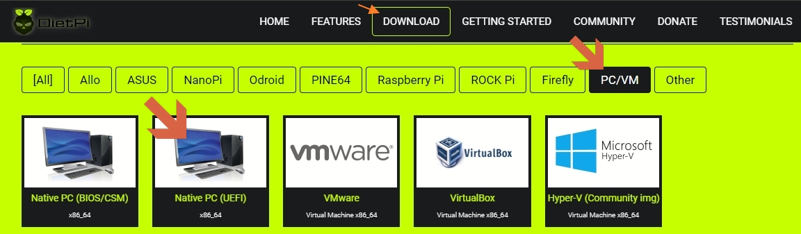

# So installieren Sie DietPi

Die Installation von DietPi besteht aus wenigen Schritten:

- Bereitstellung eines Installationsmediums (z. B. SD-Karte für Einplatinencomputer oder USB-Stick für PC)
- Holen Sie sich das DietPi-Image (und legen Sie es auf das Installationsmedium)
- Starten Sie das DietPi-Gerät und führen Sie die einmaligen Installationsschritte durch

Wenn Sie diesen Schritten folgen, können Sie DietPi zunächst einrichten und zusätzliche Softwarepakete installieren, die Sie verwenden möchten, indem Sie [dietpi-software](../dietpi_tools/#dietpi-software){:class="nospellcheck"} verwenden.

Wählen Sie die folgenden Registerkarten für die Installationsbeschreibung Ihres Ziels.

=== "Raspberry Pi und Derivate (SBC)"

    ## Einführung

    Einplatinencomputer (SBCs) auf Basis der bekannten Raspberry PI ARM-basierten Architektur haben in den letzten Jahren immer mehr Freunde gefunden. Die niedrigen Kosten in Kombination mit der Leistung und Hardwareflexibilität machen diese SBCs optimal für eingebettete Systeme, wie z. Hausautomation oder Cloud-Anwendungen.

    {: width="400" height="200" loading="lazy"}

    ## Voraussetzungen

    Um diesem Tutorial zu folgen, benötigen Sie die nächste Hardwareliste:

    - Ein Raspberry Pi, Odroid oder ein anderer SBC - öffne [die Liste aller unterstützten SBC](../hardware/)
    - Eine SD-Karte mit mindestens 4 GiB und eine Möglichkeit, sie auf Ihrem Computer zu beschreiben (integrierter Steckplatz oder externer SD-Kartenleser)
    - Optional: Ethernet-(Netzwerk-)Kabel

    _Hinweis_: Wenn Sie dieser Anleitung folgen, können Sie die Installation direkt (von einer Konsole) oder über das Netzwerk ausführen. Wenn Sie sich für eine Installation über das Netzwerk entscheiden, benötigen Sie keinen Monitor oder keine Tastatur, die mit Ihrem SBC oder Ihrer virtualisierten Umgebung verbunden sind.

    ## 1. Laden Sie das DietPi-Disk-Image herunter und extrahieren Sie es

    Öffnen Sie [dietpi.com](https://dietpi.com/#download){:class="nospellcheck"} und wählen Sie „Herunterladen“. Verschiedene unterstützte Geräte werden angezeigt. Wählen Sie den bevorzugten SBC und klicken Sie auf **Download**. Das Disk-Image wird lokal heruntergeladen.

    _Beispiel:_
    {: width="1186" height="561" loading="lazy"}

    **Entpacken Sie die heruntergeladene Datei in einen lokalen Ordner.**

    Da es sich um ein _7z_-Archivformat handelt, müssen Sie entweder [7zip für Windows](https://www.7-zip.org/) oder [The Unarchiver (Macintosh)](https://wakaba.c3.cx /s/apps/unarchiver.html). Beide sind kostenlos und wurden getestet, um das Bild korrekt zu entpacken.

    Linux-Benutzer müssen `p7zip` (die Terminalversion von `7zip`) herunterladen und installieren.

    ??? Hinweis "Wie entpacke ich das DietPi-Image unter Linux"
        Öffnen Sie auf Debian- und Ubuntu-basierten Systemen ein Terminal und geben Sie Folgendes ein:

        ```sh
        sudo apt install p7zip
        ```

        Geben Sie nach der Installation von p7zip Folgendes am Terminal ein, um die Datei zu extrahieren:

        ```sh
        7zr e DietPi-Image.7z
        ```

        Ersetzen Sie **DietPi-Image.7z** durch den korrekten Namen des heruntergeladenen Archivs, z. **DietPi_RPi-ARMv6-Bullseye.7z**. Dadurch wird die DietPi-Bilddatei zur Verwendung extrahiert.

    ## 2. Flashen Sie das DietPi-Image

    Laden Sie zunächst [balenaEtcher](https://etcher.io/) herunter und installieren Sie es. Diese Anwendung flasht OS-Images auf SD-Karten und USB-Laufwerke, sicher und einfach unter Windows, macOS, Linux.

    !!! note "Unter Windows können Sie auch [Rufus](https://rufus.ie/) verwenden, um das Image zu flashen."
        Klicken Sie oben auf die Registerkarte **Auf nativem PC installieren**, um ein Beispiel für die Verwendung von Rufus zu sehen. Bei SBC-Images sind alle Optionen ausgegraut, was richtig ist, sodass Sie nach der Auswahl des Images und des Ziellaufwerks nur noch auf START klicken müssen.

    Starten Sie balenaEtcher und vergewissern Sie sich, dass Sie Ihr Laufwerk oder Ihre SD-Karte in Ihren Computer eingesteckt haben. Suchen Sie das DietPi-Bild und wählen Sie es aus.

    {: width="795" height="529" loading="lazy"}

    Stellen Sie als Nächstes sicher, dass das ausgewählte Gerät das richtige ist.

    !!! Warnung "Alle Daten auf dem Laufwerk werden gelöscht!"
        Der Flash-Vorgang löscht das Laufwerk. Wenn Sie also das falsche auswählen, riskieren Sie Datenverlust.


    {: width="796" height="478" loading="lazy"}

    Sobald Sie bestätigt haben, dass alle Details korrekt sind, fahren Sie mit dem Flashen der SD-Karte fort. Dieser Vorgang kann eine Weile dauern.

    {: width="796" height="478" loading="lazy"}

    ??? info "Klicken Sie hier, wenn Sie eine WLAN-Verbindung nutzen möchten"
        Um das WLAN einzurichten, öffnen Sie den SD-Kartenordner und aktualisieren Sie die nächsten beiden Dateien mit einem Texteditor Ihrer Wahl:

        1. Öffnen Sie die Datei mit dem Namen `dietpi.txt`. Suchen Sie `AUTO_SETUP_NET_WIFI_ENABLED` und setzen Sie es auf den Wert 1.
        2. Öffnen Sie die Datei `dietpi-wifi.txt` und setzen Sie `aWIFI_SSID[0]` auf den Namen Ihres WLAN-Netzwerks.
        3. Setzen Sie in derselben Datei `dietpi-wifi.txt` bei `aWIFI_KEY[0]` das Passwort von Ihrem WLAN-Netzwerk ein.
        4. Speichern und schließen Sie die Dateien.

    ## 3. Bereiten Sie den ersten Start vor

    Entfernen Sie das Laufwerk bzw. SD-Karte aus dem PC und legen Sie sie in Ihr SBC-Gerät ein, um den ersten Start vorzubereiten.
    Schalten Sie den SBC ein, um sich anzumelden und den ersten Startvorgang auszuführen.

    ??? info "Option: Automatische Basisinstallation beim ersten Booten (Durchführen einer _unbeaufsichtigten Basisinstallation_)"

        DietPi bietet die Option für eine automatische First-Boot-Installation. Siehe Abschnitt ["So führen Sie eine automatische Basisinstallation beim ersten Booten durch"](../usage/#how-to-do-an-automatic-base-installation-at-first-boot) für Details.

    ???+ Hinweis "Initiale Startdauer"
        Aufgrund einer automatischen Größenänderung des Root-Dateisystems und grundlegender Einrichtungsschritte dauert dieser erste Start länger als weitere Systemstartsequenzen. Je nach Systemlaufwerk und Hardware kann es bis zu ein paar Minuten dauern.

=== "VirtualBox"

    <font size="+2">Einführung</font>

    Images virtueller Maschinen eignen sich hervorragend für Gelegenheiten, bei denen Sie ein DietPi-System sehr schnell einrichten und Dinge testen möchten. Es kann auch als Debian-basiertes Linux-System mit geringem Platzbedarf für Entwicklungszwecke verwendet werden, z. mit dem X11-Fenstersystem. Der geringe Platzbedarf macht es optimal auf PCs ohne großen eingebauten RAM nutzbar. Es können auch mehrere VMs für unterschiedliche Anwendungen betrieben werden.

    Ein großer Vorteil einer solchen VM ist, dass sie nur wenige Minuten braucht, um zu einem laufenden DietPi-System zu gelangen.

    Eine der Optionen einer virtuellen Maschine ist [__Oracle VirtualBox__](https://www.oracle.com/virtualization/virtualbox/).

    {: width="1593" height="814" loading="lazy"}

    <font size="+2">Voraussetzungen</font>

    Als Ausgangspunkt benötigen Sie einen **PC mit einer laufenden VirtualBox-Software**, auf dem das DietPi-System laufen soll.
    Auf diesem PC ist ein freier Festplattenspeicher von ca

    - 1,2 GiB für ein minimal laufendes System
    - 5 - 10 GiB für ein typisches laufendes System mit X11

    wird gebraucht. Eine empfohlene Größe ist mindestens ein freier Speicherplatz von 10 GiB.

    ??? wichtig "Installation von VirtualBox mit VirtualBox-Erweiterungspaket ("Gasterweiterungen")"
        Wenn Sie vorhaben, das VirtualBox-Erweiterungspaket zu installieren, müssen einige Dinge beachtet werden, um eine Arbeitszeitsynchronisation zu erreichen. Im Allgemeinen:

        - Das VirtualBox-Erweiterungspaket enthält eine eigene Zeitsynchronisierungsfunktion, die die VM-Systemzeit mit der Host-Systemzeit synchron halten kann.
          Der Zeitsynchronisationsmodus in `dietpi-config` sollte daher auf **Benutzerdefiniert** umgestellt werden, um Konflikte oder Zeitüberschreitungen während des Bootvorgangs zu vermeiden.
        - VirtualBox ohne das Erweiterungspaket erfordert eine Netzwerk-Zeitsynchronisierungslösung, z. einer der durch `dietpi-config` konfigurierbaren Zeitsynchronisationsmodi (die auf `systemd-timesyncd` basieren).

        Die notwendigen zusätzlichen Installationsschritte (Verwendung des Erweiterungspakets) werden hier (Installationsschritte auf dem Hostsystem) und unten (Installationsschritte innerhalb des DietPi-Gastsystems) beschrieben.
        Die Installation auf dem Hostsystem umfasst die Basisinstallation von VirtualBox und die Installation des Erweiterungspakets. Die Installation des VirtualBox-Hosts wird im Fall eines Linux-basierten Hostsystems beschrieben (die Beschreibung geht von einem Root-Benutzer aus, andernfalls fügen Sie „sudo“ entsprechend hinzu).

        1. Installation von VirtualBox auf einem Linux-Hostsystem
           Im Folgenden finden Sie die Beschreibung einer manuellen Installation (diese müssen Sie je nach aktueller VirtualBox-Version ändern):

             ```sh
             mkdir ~/Downloads
             cd ~/Downloads
             wget https://download.virtualbox.org/virtualbox/6.1.30/virtualbox-6.1_6.1.30-148432~Debian~bullseye_amd64.deb
             apt install ./virtualbox-6.1_6.1.30-148432~Debian~bullseye_amd64.deb
             ```

        2. Installation des VirtualBox-Erweiterungspakets auf einem Linux-Hostsystem
           Im Folgenden finden Sie die Beschreibung einer manuellen Installation (diese müssen Sie je nach aktueller VirtualBox-Version ändern):

             ```sh
             cd ~/Downloads
             wget https://download.virtualbox.org/virtualbox/6.1.18/Oracle_VM_VirtualBox_Extension_Pack-6.1.18.vbox-extpack
             VBoxManage extpack install Oracle_VM_VirtualBox_Extension_Pack-6.1.18.vbox-extpack
             ```

        Nach diesen beiden Schritten ist die Host-Installation des VirtualBox-Erweiterungspakets abgeschlossen. Nachfolgend werden weitere Installationsschritte auf dem Gastsystem beschrieben.

    <font size="+2">1. Laden Sie das DietPi-Disk-Image herunter und extrahieren Sie es</font>

    Laden Sie das **DietPi VirtualBox**-Image von [dietpi.com](https://dietpi.com/#download){:class="nospellcheck"} herunter und entpacken Sie die heruntergeladene Datei in einen lokalen Ordner. Da es sich um ein _7z_-Archivformat handelt, müssen Sie entweder [7zip für Windows](https://www.7-zip.org/) oder andere alternative Tools installieren.

    {: width="1152" height="733" loading="lazy"}

    Die Zip-Datei enthält ein paar Dateien, die wichtigste ist die .ova-Datei, die in VirtualBox importiert werden muss.

    {: width="533" height="83" loading="lazy"}

    <font size="+2">2. Import der .ova-Datei in VirtualBox</font>

    Als nächstes muss die virtuelle VirtualBox-Maschine eingerichtet werden, indem die .ova-Datei importiert wird (über \File\Import Appliance):

    {: width="483" height="308" loading="lazy"}

    Im folgenden Dialog muss der Benutzer die `.ova`-Datei auswählen, die importiert werden soll.

    {: width="971" height="775" loading="lazy"}

    Behalten Sie im nächsten Dialog die Einstellungen bei und klicken Sie auf „Importieren“.

    Nachdem der Import abgeschlossen ist, ist die DietPi VirtualBox Virtual Machine vorhanden:

    {: width="245" height="55" loading="lazy"}

    <font size="+2">3. Erster Start des neuen VirtualBox-Image</font>

    Drücken Sie die Start-Taste (grüner Pfeil), um Ihr System basierend auf dem DietPi-Image hochzufahren.

    ??? Achtung „Sie müssen IPv6 deaktivieren, wenn der Host WLAN verwendet“
        Manchmal hat die VM Schwierigkeiten, sich mit dem Internet zu verbinden. Dies wird in einem Netzwerk-Bridged-Modus gemeldet und wenn sich der Host über WLAN mit dem Internet verbindet: In diesen Fällen schlägt das IPv6-Routing zwischen der VM und dem Internet fehl (z. B. siehe [dort](https://communities.vmware.com/t5/VMware-Fusion-Discussions/IPv6-Bridged-Wireless/td-p/2038235)).
        Ein typisches Ergebnis ist, dass das System den Update-Server nicht findet (z. B. beim allerersten Update-Lauf). Dies wird dann während der "apt update"-Prozedur des ersten Boot-Starts signalisiert.
        Um dies zu umgehen, öffnen Sie eine Subshell (oder ein zusätzliches SSH-Fenster), starten Sie `dietpi-config` und deaktivieren Sie **IPv6** in den Netzwerkoptionen.

        {: width="500" height="225" loading="lazy"}

        Beenden Sie dann `dietpi-config`. Danach sollte das erstmalige Installationsprogramm erneut von Anfang an ausgeführt werden.

    ??? wichtige "Installationsschritte innerhalb des DietPi-Gastsystems bei Verwendung des VirtualBox-Erweiterungspakets"
        Wenn Sie das VirtualBox-Erweiterungspaket verwenden, müssen nach der DietPi-Basisinstallation (während des allerersten Bootens des DietPi-Systems durchgeführt) weitere Installationsschritte innerhalb des DietPi-Gastsystems durchgeführt werden, um eine funktionierende Zeitsynchronisation zu erreichen. Im Allgemeinen müssen Sie die folgenden **Zeitsynchronisierungsmodus**-Optionen verwenden, die über den Befehl `dietpi-config` (in den **Erweiterten Optionen**) festgelegt werden:

        - VirtualBox ohne Erweiterungspaket: Die Zeitsynchronisation muss die Optionen 1..4 ("Boot only", "Boot + Daily", "Boot + Hourly", "Daemon + Drift") verwenden. Es sind keine weiteren Installationsschritte notwendig.
        - VirtualBox mit Erweiterungspaket: Die Zeitsynchronisation muss die Option 0 ("Benutzerdefiniert") verwenden. Weitere Installationsschritte sind notwendig, siehe unten.

            {: width="600" height="328" loading="lazy"}

        Zusätzliche Installationsschritte bei Verwendung des Erweiterungspakets (die Beschreibung geht von einem Root-Benutzer aus, ansonsten `sudo` entsprechend ergänzen):

        1. Überprüfen Sie, ob eine optische Disc mit den VirtualBox-Erweiterungen (`.iso`) vorhanden ist:

            ```sh
            lsblk
            ```

            Wenn Sie kein optisches Laufwerk „/dev/sr0“ sehen, müssen Sie dies in den Einstellungen der virtuellen Maschine hinzufügen (im heruntergefahrenen Zustand der VM) „\Machine->Settings->Storage“: Fügen Sie einen optischen Speicher hinzu, der ist mit den Gasterweiterungen (`.iso`) verknüpft.

        2. Installieren Sie die Kernel-Header und das Erweiterungspaket:

            ```sh
            apt -y install build-essential dkms linux-headers-amd64
            mkdir /root/mnt
            mount /dev/sr0 /root/mnt
            cd /root/mnt
            ./VBoxLinuxAdditions.run
            ```

            Wenn Sie eine Fehlermeldung ***"VirtualBox Guest Additions: Kernel headers not found for target kernel"*** sehen, dann sind die Kernel-Header nicht richtig installiert (führen Sie `apt -y install linux-headers-amd64` aus und versuchen Sie anschließend ` ./VBoxLinuxAdditions.run` erneut).

        3. Starten Sie neu und überprüfen Sie den Dienst
           Überprüfen Sie einen laufenden VirtualBox-Erweiterungspaketdienst mit

             ```sh
             systemctl status vboxadd-service
             ```

             Der `vboxadd-service` sollte sich im Zustand *active* befinden.

        4. Einstellungen im Hostsystem
            Um sicherzustellen, dass die Gast-VM die Zeit mit dem Host beim Booten und beim Wiederherstellen aus dem gespeicherten Zustand synchronisiert, führen Sie die folgenden drei Befehle auf dem **Hostsystem** (nicht dem DietPi-Gastsystem) aus:

            ```sh
            VBoxManage guestproperty set "<vm_name>" --timesync-set-start
            VBoxManage guestproperty set "<vm_name>" --timesync-set-on-restore 1
            VBoxManage guestproperty set "<vm_name>" "/VirtualBox/GuestAdd/VBoxService/--timesync-set-threshold" 10000
            ```

            Ersetzen Sie „<vm_name>“ durch den Namen Ihrer virtuellen Maschine, der in der Benutzeroberfläche von VM VirtualBox Manager angezeigt wird, z. „DietPi_VirtualBox-x86_64-Bullseye“, wenn Sie die VM importieren, ohne ihren Namen zu ändern.

        Mit all diesen Einrichtungsschritten sollte die Zeitsynchronisation bei Verwendung des Erweiterungspakets funktionieren. Manchmal dauert es ein paar Minuten, bis die Zeit synchronisiert ist, also etwas Geduld haben.

=== "VMware"

    <font size="+2">Einführung</font>

    Images virtueller Maschinen eignen sich hervorragend für Gelegenheiten, bei denen Sie ein DietPi-System sehr schnell einrichten und Dinge testen möchten. Es kann auch als Debian-basiertes Linux-System mit geringem Platzbedarf für Entwicklungszwecke verwendet werden, z. mit dem X11-Fenstersystem. Der geringe Platzbedarf macht es optimal auf PCs ohne großen eingebauten RAM nutzbar. Es können auch mehrere VMs für unterschiedliche Anwendungen betrieben werden.

    Ein großer Vorteil einer solchen VM ist, dass sie nur wenige Minuten braucht, um zu einem laufenden DietPi-System zu gelangen.

    Eine der Möglichkeiten einer virtuellen Maschine ist [__VMware Workstation Player__](https://www.vmware.com/de/products/workstation-player/workstation-player-evaluation.html) bzw. [__VMware Fusion__](https://www.vmware.com/de/products/fusion/fusion-evaluation.html) (macOS).

    {: width="769" height="588" loading="lazy"}

    !!! info "Getestet mit Windows 10"
        Diese Beschreibung bezieht sich auf VMware Workstation 16 Player auf einem Microsoft Windows-System.
        ***VMware Workstation Pro*** sowie ***VMware Fusion für MAC*** wurden nicht getestet, sollten aber ebenfalls funktionieren.

    <font size="+2">Voraussetzungen</font>

    Als Ausgangspunkt benötigen Sie einen **PC mit einer laufenden VMware Workstation Player Software**, auf dem das DietPi-System laufen soll.

    Auf diesem PC ist ein freier Festplattenspeicher von ca

    - 3 GiB für ein minimal laufendes System (1,5 GiB im ausgeschalteten Zustand)
    - 5 - 10 GiB für ein typisches laufendes System mit X11

    wird gebraucht. Eine empfohlene Größe ist mindestens ein freier Speicherplatz von 10 GiB.

    <font size="+2">1. Laden Sie das DietPi-Disk-Image herunter und extrahieren Sie es</font>

    Laden Sie das **DietPi VMware**-Image von [dietpi.com](https://dietpi.com/#download){:class="nospellcheck"} herunter und entpacken Sie die heruntergeladene Datei in einen lokalen Ordner. Da es sich um ein _7z_-Archivformat handelt, müssen Sie entweder [7zip für Windows](https://www.7-zip.org/) oder andere alternative Tools installieren.

    {: width="1223" height="749" loading="lazy"}

    Die ZIP-Datei enthält ein paar Dateien, die beiden wichtigen sind die `.vmx`- und `.vmdk`-Datei, die in einen VMware-Maschinenordner kopiert werden müssen (Der Ordner kann sich irgendwo auf der Festplatte des PCs befinden).

    {: width="525" height="104" loading="lazy"}

    <font size="+2">2. Fügen Sie die Dateien in VMware</font> hinzu

    Als nächstes wird die virtuelle VMware-Maschine eingerichtet, indem einfach die `.vmx`-Datei geöffnet wird (über ***Open a Virtual Machine***):

    {: width="715" height="585" loading="lazy"}

    Im folgenden Dialog muss der Benutzer zu dem Verzeichnis navigieren, in dem die `.vmx`- und `.vmdk`-Datei gespeichert wurden. Wählen Sie die zu öffnende `.vmx`-Datei aus.
    Danach ist die DietPi VMware Virtual Machine vorhanden und kann gestartet werden:

    {: width="714" height="588" loading="lazy"}

    <font size="+2">3. Erster Start des neuen VMware-Image</font>

    Drücken Sie auf ***Virtuelle Maschine starten*** (grüner Pfeil), um Ihr System basierend auf dem DietPi-Image hochzufahren. Eventuell müssen Sie in einem erscheinenden Dialog "Ich habe es kopiert" bestätigen und fortfahren.
    Wenn Sie eine WLAN-Verbindung nutzen möchten, müssen Sie die Netzwerkeinstellungen entsprechend Ihrer Umgebung ändern (Dateien `\boot\dietpi.txt` und `\boot\dietpi-wifi.txt`).

    ??? Achtung „Sie müssen IPv6 deaktivieren, wenn der Host WLAN verwendet“
        Manchmal hat die VM Schwierigkeiten, sich mit dem Internet zu verbinden. Dies wird in einem Netzwerk-Bridged-Modus gemeldet und wenn sich der Host über WLAN mit dem Internet verbindet: In diesen Fällen schlägt das IPv6-Routing zwischen der VM und dem Internet fehl (z. B. siehe [dort](https://communities.vmware.com/t5 /VMware-Fusion-Discussions/IPv6-Bridged-Wireless/td-p/2038235)).
        Ein typisches Ergebnis ist, dass das System den Update-Server nicht findet (z. B. beim allerersten Update-Lauf). Dies wird dann während der "apt update"-Prozedur des ersten Boot-Starts signalisiert.
        Um dies zu umgehen, öffnen Sie eine Subshell (oder ein zusätzliches SSH-Fenster), starten Sie `dietpi-config` und deaktivieren Sie **IPv6** in den Netzwerkoptionen.

        {: width="500" height="225" loading="lazy"}

        Beenden Sie dann `dietpi-config`. Danach sollte das erstmalige Installationsprogramm erneut von Anfang an ausgeführt werden.

    <font size="+2">Zusätzliche Informationen</font>

    Informationen zum Ausführen von DietPi in einer VMware ESXi-Umgebung finden Sie in diesem Artikel: [Running the DietPi VMware image on ESXi 6.7](https://ccie.tv/running-dietpi-vmware-image-on-esxi-6- 7).

=== "Parallelen (macOS)"

    <font size="+2">Einführung</font>

    Images virtueller Maschinen eignen sich hervorragend für Gelegenheiten, bei denen Sie ein DietPi-System sehr schnell einrichten und Dinge testen möchten. Es kann auch als Debian-basiertes Linux-System mit geringem Platzbedarf für Entwicklungszwecke verwendet werden, z. mit dem X11-Fenstersystem. Der geringe Platzbedarf macht es optimal auf PCs ohne großen eingebauten RAM nutzbar. Es können auch mehrere VMs für unterschiedliche Anwendungen betrieben werden.

    Ein großer Vorteil einer solchen VM ist, dass sie nur wenige Minuten braucht, um zu einem laufenden DietPi-System zu gelangen.

    Eine der Optionen einer virtuellen Maschine ist [__Parallels Desktop__](https://www.parallels.com/products/desktop/) für macOS.

    {: width="896" height="504" loading="lazy"}

    <font size="+2">Voraussetzungen</font>

    Als Ausgangspunkt benötigen Sie einen **Apple Mac mit einer laufenden Parallels Desktop Software**, auf dem das DietPi-System laufen soll (x86-System, z. B. Mac mini 2011/2012/2014/2018).
    Auf diesem MAC ist ein freier Festplattenspeicher von ca

    - 1,2 GiB für ein minimal laufendes System
    - 5 - 10 GiB für ein typisches laufendes System mit X11

    wird gebraucht. Eine empfohlene Größe ist mindestens ein freier Speicherplatz von 10 GiB.

    <font size="+2">1. Laden Sie das DietPi-Disk-Image herunter und extrahieren Sie es</font>

    Laden Sie das **DietPi Parallels**-Image von [dietpi.com](https://dietpi.com/#download){:class="nospellcheck"} herunter.

    Doppelklicken Sie auf die heruntergeladene Datei, um sie zu extrahieren (oder über die Option „Im Finder öffnen“). Kopieren/Verschieben Sie die enthaltene `.pvm`-Datei in das Parallels-Verzeichnis (normalerweise das Verzeichnis „Parallels“ in Ihrem Home-Verzeichnis).

    <font size="+2">2. Öffnen Sie die virtuelle Maschine in Parallels Desktop</font>

    Als nächstes wird die Parallels Virtual Machine durch einen Doppelklick auf die `.pvm`-Datei geöffnet. Dann startet die Maschine.

    {: width="640" height="273" loading="lazy"}

=== "Hyper-V"

    <font size="+2">Einführung</font>

    Images virtueller Maschinen eignen sich hervorragend für Gelegenheiten, bei denen Sie ein DietPi-System sehr schnell einrichten und Dinge testen möchten. Es kann auch als Debian-basiertes Linux-System mit geringem Platzbedarf für Entwicklungszwecke verwendet werden, z. mit dem X11-Fenstersystem. Der geringe Platzbedarf macht es optimal auf PCs ohne großen eingebauten RAM nutzbar. Es können auch mehrere VMs für unterschiedliche Anwendungen betrieben werden.

    Ein großer Vorteil einer solchen VM ist, dass sie nur wenige Minuten braucht, um zu einem laufenden DietPi-System zu gelangen.

    Eine der Optionen einer virtuellen Maschine ist [__Microsoft Hyper-V__](https://docs.microsoft.com/en-us/windows-server/virtualization/hyper-v/hyper-v-technology-overview).

    {: width="722" height="450" ​​loading="lazy"}

    !!! info "Getestet mit Windows 10"
        Diese Beschreibung bezieht sich auf Hyper-V auf einem Microsoft Windows-System.

    <font size="+2">Voraussetzungen</font>

    Als Ausgangspunkt benötigen Sie einen **PC mit aktiviertem Hyper-V**, auf dem das DietPi-System laufen soll.

    ??? info "Hyper-V-Aktivierung in Windows"
        Hyper-V muss in Windows aktiviert werden (zB [siehe dort](https://docs.microsoft.com/en-us/virtualization/hyper-v-on-windows/quick-start/enable-hyper-v) ). Die Aktivierung erfolgt durch Aktivieren aller Hyper-V-Funktionen im Bereich ***Windows-Funktionen ein- oder ausschalten*** im Bereich ***Apps und Funktionen*** in den Windows-Einstellungen.

        {: width="367" height="328" loading="lazy"}

    Auf diesem PC ist ein freier Festplattenspeicher von ca

    - 3 GiB für ein minimal laufendes System (1,5 GiB im ausgeschalteten Zustand)
    - 8 - 10 GiB für ein typisches laufendes System mit X11

    wird gebraucht. Eine empfohlene Größe ist mindestens ein freier Speicherplatz von 10 GiB.

    <font size="+2">1. Laden Sie das DietPi-Disk-Image herunter und extrahieren Sie es</font>

    Laden Sie das **DietPi Hyper-V**-Image von [dietpi.com](https://dietpi.com/#download){:class="nospellcheck"} herunter und entpacken Sie die heruntergeladene Datei in einen lokalen Ordner. Da es sich um ein _7z_-Archivformat handelt, müssen Sie entweder [7zip für Windows](https://www.7-zip.org/) oder andere alternative Tools installieren.

    {: width="722" height="463" loading="lazy"}

    Das Archiv enthält die DietPi `README.md`, das `.vhdx` Virtual Disk Image und eine `hash.txt`, die Hashes enthält, um die Integrität des Virtual Disk Images zu prüfen. Verschieben Sie die `.vhdx`-Datei in den gewünschten Ordner der virtuellen Maschine auf Ihrer Festplatte.
	
	<font size="+2">2. Fügen Sie eine virtuelle Hyper-V-Maschine hinzu</font>

    Als nächstes muss eine Hyper-V-Maschine erstellt werden. Starten Sie den Hyper-V-Manager, klicken Sie mit der rechten Maustaste auf Ihren PCs-Knoten im linken Baum und öffnen Sie den Dialogassistenten für die Maschinengenerierung ("Neu" -> "Virtuelle Maschine"):

    {: width="450" ​​height="364" loading="lazy"}

    Im folgenden Assistenten müssen Sie folgendes einstellen:

    1. Geben Sie Ihrer Maschine einen Namen ("Name und Standort angeben")
    2. Wählen Sie die Hyper-V-Generation aus: Wählen Sie **Generation 1** ("Generation angeben")
    3. Wählen Sie Ihre RAM-Größe (z. B. 2048 MB)
    4. Wenn Sie bereits ein Netzwerk konfiguriert haben, wählen Sie Ihr Netzwerk aus. Lassen Sie andernfalls "Nicht verbunden" und ändern Sie es anschließend
    5. Wählen Sie die extrahierte `.vhdx`-Hyper-V-Disc-Datei (siehe oben)

    Wenn Sie noch keine Netzwerkverbindung eingerichtet haben, fahren Sie mit dem **Virtual Switch Manager** fort und fügen Sie ein Netzwerk hinzu. Wählen Sie dieses Netzwerk anschließend in den Einstellungen Ihrer virtuellen Maschine aus.

    {: width="250" height="284" loading="lazy"}

    <font size="+2">3. Erster Start des neuen Hyper-V-Rechners</font>

    Klicken Sie zunächst auf ***Verbinden***, um ein Fenster der virtuellen Maschine zu öffnen:

    {: width="450" ​​height="205" loading="lazy"}

    Drücken Sie dann ***Start***, um die Maschine hochzufahren:

    {: width="550" height="420" loading="lazy"}

    Danach sollte Ihr Computer hochfahren.

    ??? Achtung „Sie müssen IPv6 deaktivieren, wenn der Host WLAN verwendet“
        Manchmal hat die VM Schwierigkeiten, sich mit dem Internet zu verbinden. Dies wird in einem Netzwerk-Bridged-Modus gemeldet und wenn sich der Host über WLAN mit dem Internet verbindet: In diesen Fällen schlägt das IPv6-Routing zwischen der VM und dem Internet fehl (z. B. siehe [dort](https://communities.vmware.com/t5 /VMware-Fusion-Discussions/IPv6-Bridged-Wireless/td-p/2038235)).
        Ein typisches Ergebnis ist, dass das System den Update-Server nicht findet (z. B. beim allerersten Update-Lauf). Dies wird dann während der "apt update"-Prozedur des ersten Boot-Starts signalisiert.
        Um dies zu umgehen, öffnen Sie eine Subshell (oder ein zusätzliches SSH-Fenster), starten Sie `dietpi-config` und deaktivieren Sie **IPv6** in den Netzwerkoptionen.

        {: width="500" height="225" loading="lazy"}

        Beenden Sie dann `dietpi-config`. Danach sollte das erstmalige Installationsprogramm erneut von Anfang an ausgeführt werden.

    <font size="+2">Zusätzliche Informationen / Fehlerbehebung</font>

    <font size="+1">**Netzwerkverbindung nicht gefunden**</font>
    Falls Sie Ihre Netzwerkkonfiguration nicht richtig eingerichtet haben, findet der Bootvorgang keine Netzwerkverbindung und antwortet möglicherweise mit dieser Ausgabe der Bootkonsole:

    {: width="722" height="164" loading="lazy"}

    Dann müssen Sie Ihre Netzwerkkonfiguration im **Virtual Switch Manager** überprüfen und reparieren.

    <font size="+1">**Generieren Sie einen Hyper-V-Computer der 2. Generation**</font>
    Eine Option, um einen Hyper-V-Computer der Generation 2 zu erhalten, besteht darin, Ihr eigenes Hyper-V-Image über eine **Debian-Netzwerkinstallation** zu generieren (Booten des Hyper-V-Computers von einem Debian-`netinst.iso`-Installationsprogramm, wie Sie es tun würden auf einem PC). Installieren Sie eine minimale Debian-Maschine (d. h. keine X11-Desktops usw.). Führen Sie anschließend die im Abschnitt ["Eigene Distribution erstellen"](../hardware/#make-your-own-distribution) beschriebene Prozedur aus. Maschinen der Generation 2 unterstützen (und erfordern) das Booten im UEFI-Modus, unterstützen [Secure Boot](https://en.wikipedia.org/wiki/Unified_Extensible_Firmware_Interface#Secure_Boot), [TPM](https://en.wikipedia.org /wiki/Trusted_Platform_Module), verwenden moderne SCSI-Controller und haben höhere Hardwarebeschränkungen. Für den Einsatz als Heimserver benötigen Sie jedoch keine dieser Funktionen.

=== "Nativer PC"

    <font size="+2">Einführung</font>

    Die nativen PC-Images eignen sich hervorragend für Situationen, in denen die SBC-Leistung einfach nicht ausreicht. Ein Beispiel könnte [Intel NUC Kit](https://www.intel.com/content/www/us/en/products/boards-kits/nuc/kits.html?page=2) sein. Es ist ein kleiner, vielseitiger, erweiterbarer und erschwinglicher Desktop-PC mit denselben grundlegenden Funktionen wie ein viel größerer Computer.

    {: width="300" height="200" loading="lazy"}

    Es könnte auch eine großartige Möglichkeit sein, einen alten Computer zu nutzen, der nicht in der Lage ist, die neueste Version von Windows oder macOS auszuführen.

    !!! Frage "**UEFI** oder **BIOS**?"
        Zuerst müssen Sie herausfinden, ob Ihr PC **UEFI** ([Unified Extensible Firmware Interface](https://wikipedia.org/wiki/Unified_Extensible_Firmware_Interface)) oder **BIOS** ([Basic Input/Output System ](https://wikipedia.org/wiki/BIOS)):

        - Im Falle eines UEFI-basierten PCs sehen Sie sich die Registerkarte „**UEFI-Installer-Image**“ an.
        - Im Falle eines BIOS-basierten PCs sehen Sie sich die Registerkarte „**BIOS-Installer-Image**“ oder „**BIOS-Direct-Write-Image**“ an.

    !!! Frage ""**BIOS-Installer-Image**" oder "**BIOS-Direct-Write-Image**"?"
        Das „**BIOS-Installer-Image**“ dient zum Booten und Installieren des DietPi-Systems auf einem anderen Ziel-Bootlaufwerk (Speichermedium). Im Gegensatz dazu wird das "**BIOS Direct Write Image**" verwendet, um das Image direkt auf das Ziel-DietPi-Bootlaufwerk zu schreiben.

    === "UEFI-Installer-Image"

        <font size="+2">Voraussetzungen</font>

        Sie würden das nächste brauchen:

        - ein **funktionierender PC mit Internetzugang**, der beim Schreiben des Bootmediums hilft
        - ein **bootfähiges USB-Laufwerk** (z. B. Flash-Disk, mindestens 2 GiB), um das DietPi-Installer-Image zu speichern und den Ziel-PC zu booten
        - **Ziel-PC** installiert werden

        <font size="+2">1. Laden Sie das DietPi-Installer-Image herunter und extrahieren Sie es</font>

        Laden Sie **Native PC for UEFI** > **Installer Image** von [dietpi.com](https://dietpi.com/#download){:class="nospellcheck"} herunter und
        Extrahieren Sie die heruntergeladene Datei in einen lokalen Ordner. Da es sich um ein _7z_-Archivformat handelt, müssen Sie entweder [7zip für Windows](https://www.7-zip.org/) oder andere alternative Tools installieren.

        {: width="722" height="211" loading="lazy"}

        Laden Sie [Rufus](https://rufus.ie/) herunter und führen Sie die Anwendung aus. Es gibt eine portable Version von Rufus, die keine lokale Installation erfordert.

        !!! Warnung "Seien Sie vorsichtig, wenn Sie alternative Anwendungen ausführen!"
            Während [Balena Etcher](https://www.balena.io/etcher/) für die Installation von DietPi auf SBCs empfohlen wird, liefert es keine guten Ergebnisse für UEFI-Images. Dasselbe auch mit win32diskimager, was alternativ nicht funktioniert.

        <font size="+2">2. Bild auf USB-Laufwerk schreiben</font>

        Starten Sie die Anwendung [Rufus] (https://rufus.ie/) und vergewissern Sie sich, dass Ihr USB-Laufwerk an Ihren Computer angeschlossen ist. Folgen Sie den nächsten Schritten:

        1. Wählen Sie das USB-Gerät aus
        2. Wählen Sie das heruntergeladene Bild **DietPi** aus
        3. Wählen Sie **GPT** als Partitionsschema
        4. Wählen Sie als Zielsystem **UEFI** aus
        5. Klicken Sie auf die Schaltfläche **Start**

        Stellen Sie sicher, dass das ausgewählte USB-Medium das richtige ist.

        !!! Warnung "Alle Daten auf dem USB-Medium und später auf der Festplatte des Ziel-PCs werden gelöscht!"
            Erstellen Sie vor Beginn der Installation zunächst eine Sicherungskopie der auf dem Ziel-PC und USB-Laufwerk vorhandenen Daten, falls Sie diese später erneut benötigen!

        {: width="473" height="579" loading="lazy"}

        <font size="+2">3. Starten Sie den Ziel-PC und installieren Sie das Image auf der lokalen Festplatte</font>

        Booten Sie den **Ziel-PC** vom USB-Image und installieren Sie das Image auf der lokalen Platte / Festplatte. Stecken Sie den USB-Stick in den Ziel-PC und booten Sie von diesem USB-Stick.

        !!! Hinweis "BIOS-Einstellungen"
            Es kann erforderlich sein, die BIOS-Einstellungen zu ändern, um den UEFI-Start zu aktivieren. Diese Aktion wird hier nicht beschrieben.

        Beim ersten Booten kann folgender Dialog erscheinen, um vom USB-Stick zu booten:

        {: width="483" height="230" loading="lazy"}

        Nach dem Booten erscheint der Grafikauswahldialog:

        {: width="834" height="394" loading="lazy"}

        Sie können die Standardeinstellungen auswählen. Bei Problemen wählen Sie bitte "Sichere Grafikeinstellungen".

        Sobald dieser Schritt abgeschlossen ist, können Sie eine andere Tastatur auswählen. Ändern Sie gegebenenfalls Ihre Tastatureinstellungen und gehen Sie die entsprechenden Dialoge durch.

        Dann beginnt der Installationsprozess mit Hilfe des wunderbaren Clonezilla-Tools.

        Wählen Sie die Image-Datei aus, die auf der Festplatte des Ziel-PCs installiert werden soll. Normalerweise sollten Sie nur eine einzige Option sehen:

        {: width="656" height="198" loading="lazy"}

        Danach müssen Sie die Festplatte des Ziel-PCs auswählen, auf der Ihr DietPi installiert werden soll. In diesem Beispiel ist nur eine Festplatte vorhanden:

        {: width="853" height="181" loading="lazy"}

        Danach beginnt der Installationsprozess mit mehreren Schritten, z. zeigt den Vorgang des Kopierens von Bildern:

        {: width="500" height="350" loading="lazy"}

        Diese Schritte nehmen einige Zeit in Anspruch, seien Sie geduldig! Ansonsten SSD kaufen. :-)
        Am Ende führt das System einen Shutdown durch.

        ??? info "Klicken Sie hier, wenn Sie eine WLAN-Verbindung nutzen möchten"
		Um das WLAN einzurichten, müssen Sie die Netzwerkeinstellungen passend zu Ihrer Umgebung ändern:

            1. Öffnen Sie die Datei `dietpi-wifi.txt` und setzen Sie `aWIFI_SSID[0]` auf den Namen Ihres WLAN-Netzwerks.
            2. Setzen Sie in derselben Datei `dietpi-wifi.txt` bei `aWIFI_KEY[0]` das Passwort von Ihrem WLAN-Netzwerk ein.
            3. Speichern und schließen Sie die Dateien

            Sie müssen diese Werte einstellen, bevor Sie den PC zum ersten Mal hochfahren (Initial Boot).

        Trennen Sie für das erste Hochfahren Ihres PCs Ihren USB-Stick vom Ziel-PC und schalten Sie den PC ein, um sich anzumelden und den ersten Startvorgang auszuführen.

    === "BIOS-Installer-Image"

        <font size="+2">Voraussetzungen</font>

        Sie würden das nächste brauchen:

        - ein **funktionierender PC mit Internetzugang**, der beim Schreiben des Bootmediums hilft
        - ein **bootfähiges USB-Laufwerk** (z. B. Flash-Disk, mindestens 2 GiB), um das DietPi-Installer-Image zu speichern und den Ziel-PC zu booten
        - **Ziel-PC** installiert werden

        Anmerkung: Wenn Ihr PC nicht von einem USB-Laufwerk booten kann, können Sie eine ähnliche Installation durchführen, indem Sie das Installer-Image auf eine DVD brennen und von der DVD booten. Derselbe Installationsvorgang wird durchgeführt. Vergessen Sie nicht, Ihre DVD auszuwerfen, bevor der installierte DietPi zum ersten Mal von der Festplatte booten soll.

        <font size="+2">1. Laden Sie das DietPi-Installer-Image herunter und extrahieren Sie es</font>

        Laden Sie **Native PC for BIOS/CSM** > **Installer Image** von [dietpi.com](https://dietpi.com/#download){:class="nospellcheck"} herunter und
        Extrahieren Sie die heruntergeladene Datei in einen lokalen Ordner. Da es sich um ein _7z_-Archivformat handelt, müssen Sie entweder [7zip für Windows](https://www.7-zip.org/) oder andere alternative Tools installieren.

        {: width="722" height="218" loading="lazy"}

        Laden Sie [Rufus](https://rufus.ie/) herunter und führen Sie die Anwendung aus. Es gibt eine portable Version von Rufus, die keine lokale Installation erfordert.

        <font size="+2">2. Bild auf USB-Laufwerk schreiben</font>

        Starten Sie die Anwendung [Rufus] (https://rufus.ie/) und vergewissern Sie sich, dass Ihr USB-Laufwerk an Ihren Computer angeschlossen ist. Folgen Sie den nächsten Schritten:

        1. Wählen Sie das USB-Gerät aus
        2. Wählen Sie das heruntergeladene Bild **DietPi** aus
        3. Wählen Sie **MBR** als Partitionsschema und **BIOS oder UEFI** als Zielsystem
        4. Klicken Sie auf die Schaltfläche **Start**

        Stellen Sie sicher, dass das ausgewählte USB-Medium das richtige ist.

        !!! Warnung "Alle Daten auf dem USB-Medium und später auf der Festplatte des Ziel-PCs werden gelöscht!"
            Erstellen Sie vor Beginn der Installation zunächst eine Sicherungskopie der auf dem Ziel-PC und USB-Laufwerk vorhandenen Daten, falls Sie diese später erneut benötigen!

        {: width="474" height="580" loading="lazy"}

        <font size="+2">3. Starten Sie den Ziel-PC und installieren Sie das Image auf der lokalen Festplatte</font>

        Booten Sie den **Ziel-PC** vom USB-Image und installieren Sie das Image auf der lokalen Platte / Festplatte. Stecken Sie den USB-Stick in den Ziel-PC und booten Sie von diesem USB-Stick.

        !!! Hinweis "BIOS-Einstellungen"
            Es kann notwendig sein, die BIOS-Einstellungen zu ändern, um das Booten vom USB-Stick zu ermöglichen. Diese Aktion wird hier nicht beschrieben.

        Nach dem Booten erscheint der Grafikauswahldialog:

        {: width="834" height="394" loading="lazy"}

        Sie können die Standardeinstellungen auswählen. Bei Problemen wählen Sie bitte "Sichere Grafikeinstellungen".

        Sobald dieser Schritt abgeschlossen ist, können Sie eine andere Tastatur auswählen. Ändern Sie gegebenenfalls Ihre Tastatureinstellungen und gehen Sie die entsprechenden Dialoge durch.

        Dann beginnt der Installationsprozess mit Hilfe des wunderbaren Clonezilla-Tools.

        Wählen Sie die Image-Datei aus, die auf der Festplatte des Ziel-PCs installiert werden soll. Normalerweise sollten Sie nur eine einzige Option sehen:

        {: width="656" height="198" loading="lazy"}

        Danach müssen Sie die Festplatte des Ziel-PCs auswählen, auf der Ihr DietPi installiert werden soll. In diesem Beispiel ist nur eine Festplatte vorhanden:

        {: width="853" height="181" loading="lazy"}

        Danach beginnt der Installationsprozess mit mehreren Schritten, z. zeigt den Vorgang des Kopierens von Bildern:

        {: width="500" height="350" loading="lazy"}

        Diese Schritte nehmen einige Zeit in Anspruch, seien Sie geduldig! Ansonsten SSD kaufen. :-)
        Am Ende führt das System einen Shutdown durch.

        ??? info "Klicken Sie hier, wenn Sie eine WLAN-Verbindung nutzen möchten"
            Um das WLAN einzurichten, müssen Sie die Netzwerkeinstellungen passend zu Ihrer Umgebung ändern:

            1. Öffnen Sie die Datei `dietpi-wifi.txt` und setzen Sie `aWIFI_SSID[0]` auf den Namen Ihres WLAN-Netzwerks.
            2. Setzen Sie in derselben Datei `dietpi-wifi.txt` bei `aWIFI_KEY[0]` das Passwort Ihres WLAN-Netzwerks ein.
            3. Speichern und schließen Sie die Dateien

            Sie müssen diese Werte einstellen, bevor Sie den PC zum ersten Mal hochfahren (Initial Boot).

        Trennen Sie für das erste Hochfahren Ihres PCs Ihren USB-Stick vom Ziel-PC und schalten Sie den PC ein, um sich anzumelden und den ersten Startvorgang auszuführen.

    === "BIOS-Installer-Image"

        <font size="+2">Voraussetzungen</font>

        Sie würden das nächste brauchen:

        - ein **funktionierender PC mit Internetzugang**, der beim Schreiben des Bootmediums hilft
        - ein **bootfähiges USB-Laufwerk** (z. B. Flash-Disk, mindestens 2 GiB), um das DietPi-Installer-Image zu speichern und den Ziel-PC zu booten
        - **Ziel-PC** installiert werden

        Anmerkung: Wenn Ihr PC nicht von einem USB-Laufwerk booten kann, können Sie eine ähnliche Installation durchführen, indem Sie das Installer-Image auf eine DVD brennen und von der DVD booten. Derselbe Installationsvorgang wird durchgeführt. Vergessen Sie nicht, Ihre DVD auszuwerfen, bevor der installierte DietPi zum ersten Mal von der Festplatte booten soll.

        <font size="+2">1. Laden Sie das DietPi-Installer-Image herunter und extrahieren Sie es</font>

        Laden Sie **Native PC for BIOS/CSM** > **Installer Image** von [dietpi.com](https://dietpi.com/#download){:class="nospellcheck"} herunter und
        Extrahieren Sie die heruntergeladene Datei in einen lokalen Ordner. Da es sich um ein _7z_-Archivformat handelt, müssen Sie entweder [7zip für Windows](https://www.7-zip.org/) oder andere alternative Tools installieren.

        {: width="722" height="218" loading="lazy"}

        Laden Sie [Rufus](https://rufus.ie/) herunter und führen Sie die Anwendung aus. Es gibt eine portable Version von Rufus, die keine lokale Installation erfordert.

        <font size="+2">2. Bild auf USB-Laufwerk schreiben</font>

        Starten Sie die Anwendung [Rufus] (https://rufus.ie/) und vergewissern Sie sich, dass Ihr USB-Laufwerk an Ihren Computer angeschlossen ist. Folgen Sie den nächsten Schritten:

        1. Wählen Sie das USB-Gerät aus
        2. Wählen Sie das heruntergeladene Bild **DietPi** aus
        3. Wählen Sie **MBR** als Partitionsschema und **BIOS oder UEFI** als Zielsystem
        4. Klicken Sie auf die Schaltfläche **Start**

        Stellen Sie sicher, dass das ausgewählte USB-Medium das richtige ist.

        !!! Warnung "Alle Daten auf dem USB-Medium und später auf der Festplatte des Ziel-PCs werden gelöscht!"
            Erstellen Sie vor Beginn der Installation zunächst eine Sicherungskopie der auf dem Ziel-PC und USB-Laufwerk vorhandenen Daten, falls Sie diese später erneut benötigen!

        {: width="474" height="580" loading="lazy"}

        <font size="+2">3. Starten Sie den Ziel-PC und installieren Sie das Image auf der lokalen Festplatte</font>

        Booten Sie den **Ziel-PC** vom USB-Image und installieren Sie das Image auf der lokalen Platte / Festplatte. Stecken Sie den USB-Stick in den Ziel-PC und booten Sie von diesem USB-Stick.

        !!! Hinweis "BIOS-Einstellungen"
            Es kann notwendig sein, die BIOS-Einstellungen zu ändern, um das Booten vom USB-Stick zu ermöglichen. Diese Aktion wird hier nicht beschrieben.

        Nach dem Booten erscheint der Grafikauswahldialog:

        {: width="834" height="394" loading="lazy"}

        Sie können die Standardeinstellungen auswählen. Bei Problemen wählen Sie bitte "Sichere Grafikeinstellungen".

        Sobald dieser Schritt abgeschlossen ist, können Sie eine andere Tastatur auswählen. Ändern Sie gegebenenfalls Ihre Tastatureinstellungen und gehen Sie die entsprechenden Dialoge durch.

        Dann beginnt der Installationsprozess mit Hilfe des wunderbaren Clonezilla-Tools.

        Wählen Sie die Image-Datei aus, die auf der Festplatte des Ziel-PCs installiert werden soll. Normalerweise sollten Sie nur eine einzige Option sehen:

        {: width="656" height="198" loading="lazy"}

        Danach müssen Sie die Festplatte des Ziel-PCs auswählen, auf der Ihr DietPi installiert werden soll. In diesem Beispiel ist nur eine Festplatte vorhanden:

        {: width="853" height="181" loading="lazy"}

        Danach beginnt der Installationsprozess mit mehreren Schritten, z. zeigt den Vorgang des Kopierens von Bildern:

        {: width="500" height="350" loading="lazy"}

        Diese Schritte nehmen einige Zeit in Anspruch, seien Sie geduldig! Ansonsten SSD kaufen. :-)
        Am Ende führt das System einen Shutdown durch.

        ??? info "Klicken Sie hier, wenn Sie eine WLAN-Verbindung nutzen möchten"
            Um das WLAN einzurichten, müssen Sie die Netzwerkeinstellungen passend zu Ihrer Umgebung ändern:
			
			1. Öffnen Sie die Datei `dietpi-wifi.txt` und setzen Sie `aWIFI_SSID[0]` auf den Namen Ihres WLAN-Netzwerks.
            2. Setzen Sie in derselben Datei `dietpi-wifi.txt` bei `aWIFI_KEY[0]` das Passwort von Ihrem WLAN-Netzwerk ein.
            3. Speichern und schließen Sie die Dateien

            Sie müssen diese Werte einstellen, bevor Sie den PC zum ersten Mal hochfahren (Initial Boot).

        Trennen Sie für das erste Hochfahren Ihres PCs Ihren USB-Stick vom Ziel-PC und schalten Sie den PC ein, um sich anzumelden und den ersten Startvorgang auszuführen.

    === "BIOS Direct Write Image"

        <font size="+2">Voraussetzungen</font>

        Sie würden das nächste brauchen:

        - ein **funktionierender PC mit Internetzugang**, der beim Schreiben des Bootmediums hilft
        - ein **Laufwerk** für das DietPi-System. Es wird mit dem Direct-Write-Image geschrieben und wird das Laufwerk im DietPi-System sein.
        - **Ziel-PC** installiert werden

        <font size="+2">1. Laden Sie das DietPi Direct Write Image herunter und extrahieren Sie es</font>

        Laden Sie **Native PC for BIOS/CSM** > **Direct write Image** von [dietpi.com](https://dietpi.com/#download){:class="nospellcheck"} herunter und
        Extrahieren Sie die heruntergeladene Datei in einen lokalen Ordner. Da es sich um ein _7z_-Archivformat handelt, müssen Sie entweder [7zip für Windows](https://www.7-zip.org/) oder andere alternative Tools installieren.

        {: width="722" height="218" loading="lazy"}

        Laden Sie [Rufus](https://rufus.ie/) herunter und führen Sie die Anwendung aus. Es gibt eine portable Version von Rufus, die keine lokale Installation erfordert.

        <font size="+2">2. Image auf Laufwerk schreiben</font>

        Starten Sie die Anwendung [Rufus] (https://rufus.ie/) und vergewissern Sie sich, dass Ihr Laufwerk mit Ihrem Computer verbunden ist. Dies kann z. mit einem USB-zu-SATA-Controller durchgeführt werden, wenn Sie ein SATA-Laufwerk verwenden. Folgen Sie den nächsten Schritten:

        1. Zeigen Sie erweiterte Laufwerkseigenschaften an und wählen Sie **USB-Festplatten auflisten**
          (falls Sie Ihr Laufwerk über einen USB-Adapter angeschlossen haben)
        2. Wählen Sie das Laufwerkgerät aus
        3. Wählen Sie das heruntergeladene **DietPi**-Bild aus
        4. Klicken Sie auf die Schaltfläche **Start**

        Stellen Sie sicher, dass das ausgewählte Laufwerk das richtige ist.

        !!! Warnung "Alle Daten auf dem Laufwerk werden gelöscht!"
            Bevor Sie mit der Installation beginnen, erstellen Sie zunächst eine Sicherungskopie der auf dem Laufwerk vorhandenen Daten, falls Sie diese später wieder benötigen!

        {: width="474" height="607" loading="lazy"}

        <font size="+2">3. Starten Sie den Ziel-PC </font>

        ??? info "Klicken Sie hier, wenn Sie eine WLAN-Verbindung nutzen möchten"
            Um das WLAN einzurichten, müssen Sie die Netzwerkeinstellungen passend zu Ihrer Umgebung ändern:

            1. Öffnen Sie die Datei `dietpi-wifi.txt` und setzen Sie `aWIFI_SSID[0]` auf den Namen Ihres WLAN-Netzwerks.
            2. Setzen Sie in derselben Datei `dietpi-wifi.txt` bei `aWIFI_KEY[0]` das Passwort von Ihrem WLAN-Netzwerk ein.
            3. Speichern und schließen Sie die Dateien

            Sie müssen diese Werte einstellen, bevor Sie den PC zum ersten Mal hochfahren (Initial Boot).

        Trennen Sie beim ersten Hochfahren Ihres PCs Ihr Laufwerk von Ihrem funktionierenden PC und verbinden Sie es mit dem Ziel-PC. Schalten Sie dann den Ziel-PC ein, um sich anzumelden und den ersten Startvorgang auszuführen.

        ??? info "Option: Automatische Basisinstallation beim ersten Booten (Durchführen einer _unbeaufsichtigten Basisinstallation_)"

            DietPi bietet die Option für eine automatische First-Boot-Installation. Siehe Abschnitt ["So führen Sie eine automatische Basisinstallation beim ersten Booten durch"](../usage/#how-to-do-an-automatic-base-installation-at-first-boot) für Details.

## 4. Erste Anmeldung auf DietPi

Der Hostname des Systems lautet: **DietPi**.
Sie können den Namen vor dem ersten Booten in der Konfigurationsdatei `dietpi.txt` ändern.

Nachdem das System hochgefahren ist, können Sie den Anweisungen auf dem Bildschirm folgen oder sich über das Netzwerk verbinden:

- Wenn Sie eine Tastatur und einen Monitor an Ihr System angeschlossen haben, melden Sie sich über diese Konsole an.
- Wenn Sie ein Headless-System ohne angeschlossene Tastatur und Monitor haben, können Sie einen **SSH**-Client wie [PuTTY](https://www.chiark.greenend.org.uk/~sgtatham/putty/latest.html ), um eine Verbindung von einem entfernten System herzustellen. Der SSH-Server [Dropbear](../software/ssh/#dropbear) ist standardmäßig auf DietPi installiert und aktiviert.
- Die meisten SBCs ermöglichen alternativ den Anschluss einer seriellen Konsole über **UART**, was standardmäßig auch auf DietPi aktiviert ist.

Es erscheint eine Anmeldeaufforderung. Verwenden Sie die anfänglichen Anmeldeinformationen:

- Login: `root`
- Passwort: `dietpi` (bzw. das über `dietpi.txt` gesetzte)

??? Hinweis "Klicken Sie hier, wenn Sie sich über SSH verbinden möchten (mit einer _headless install_)"

    !!! warning "Bei der ersten Anmeldung aktualisiert DietPi sofort das System und die Pakete. Wenn Ihre Netzwerkverbindung nicht stabil ist, wird empfohlen, diesen Schritt stattdessen lokal durchzuführen."

    **IP-Scanning tool**

    Für die folgenden Schritte benötigen wir ein IP-Scanning-Tool, um die IP-Adresse des Raspberry Pi zu ermitteln.

    - Für Windows können Sie „Advanced IP Scanner“ ausprobieren. Laden Sie das Tool [hier](https://www.advanced-ip-scanner.com) herunter.
    - Für Linux können Sie den Befehl "nmap" verwenden:

        ```sh
        sudo apt-get install nmap # for installing Nmap
        sudo nmap -sn 192.168.1.0/24 # for scanning IP address in the eange 192.168.1.0 - 192.168.1.255
        ```

    Alternativ können Sie die IP-Adresse auch in der DHCP-Statusseite Ihres DHCP-Servers (oft in einem Router enthalten) ermitteln: Suchen Sie nach dem Hostnamen **DietPi** und beziehen Sie die IP-Adresse.

    **Über SSH mit DietPi verbinden**

    Ein beliebter SSH-Client für Windows ist PuTTY. Sie können PuTTY [hier](https://www.chiark.greenend.org.uk/~sgtatham/putty/latest.html) herunterladen. Geben Sie im Feld „Hostname“ die beim Scannen gefundene IP-Adresse ein, wählen Sie „SSH“ und klicken Sie dann auf die Schaltfläche „Öffnen“.
    Abhängig von Ihrer DHCP-Konfiguration kann auch nur `dietpi` als Hostname ausreichen.
    Manchmal muss darauf die Domain Ihres Routers folgen (z. B. `dietpi.fritz.box`).

    

    Die meisten Linux-Distributionen werden mit einem SSH-Client geliefert. Geben Sie den nächsten Befehl Ihres Terminals ein (ersetzen Sie die Beispiel-IP-Adresse „192.168.1.20“ durch die, die Sie beim Scannen des Netzwerks gefunden haben):

    ```sh
    ssh root@192.168.1.20
    ```

    bzw.

    ```sh
    ssh root@dietpi
    ```

Um fortzufahren, müssen Sie die DietPi GPL-Lizenz akzeptieren. Drücken Sie dazu die ++Enter++-Taste auf Ihrer Tastatur.

{: width="640" height="371" loading="lazy"}

DietPi beginnt dann sofort mit der Suche und Installation aktualisierter Softwarepakete, was einige Zeit in Anspruch nehmen wird.

Sobald die Pakete aktualisiert wurden, wird DietPi Sie bitten, zu bestätigen, ob Sie die Benutzeranalyse aktivieren möchten.

!!! info "DietPi-Umfrage"
    DietPi-Umfrage ist **optional und standardmäßig nicht aktiviert**. Es ist anonym, gesichert und erfordert eine minimale Datenübertragung. ALLE geteilten Details werden auf der Seite [dietpi.com/survey](https://dietpi.com/survey/){:class="nospellcheck"} veröffentlicht. Checken Sie aus und sehen Sie, wie DietPi verwendet wird!

{: width="642" height="385" loading="lazy"}

Das standardmäßige DietPi-Passwort ist öffentlich, daher werden Sie aufgefordert, dies im nächsten Schritt sowohl für die Benutzerkonten „root“ als auch „dietpi“ zu ändern. Wählen Sie OK und drücken Sie ++Enter++, geben Sie dann Ihr Passwort (zweimal) zur Bestätigung ein.

Sie können das Passwort später wieder ändern, indem Sie am Terminal `passwd` eingeben oder auch über das Kommandozeilenskript `dietpi-config` (innerhalb der "Sicherheitsoptionen").

{: width="643" height="386" loading="lazy"}

## 5. Weitere Schritte

Die Basisinstallation von DietPi ist **absichtlich** minimal, sodass Sie auswählen können, welche Software Sie installieren und verwenden möchten: Führen Sie einfach `dietpi-software` aus und installieren Sie [**DietPi Optimized Software**](../software /).
Sie können jederzeit zum **DietPi-Software**-Tool zurückkehren, um weitere Änderungen vorzunehmen, indem Sie im Terminal „dietpi-software“ eingeben oder „dietpi-launcher“ eingeben und das **DietPi-Software**-Tool auswählen.

Wenn Sie weitere Änderungen an Ihrer DietPi-Konfiguration vornehmen möchten, können Sie „dietpi-launcher“ auf dem Terminal ausführen, um alle verfügbaren DietPi-Tools anzuzeigen, einschließlich **DietPi-Update** zum Aktualisieren Ihres Geräts und **DietPi-Backup* * um Ihr Gerät zu sichern.

Weitere Einzelheiten finden Sie im Abschnitt [DietPi Tools](../dietpi_tools/).

## YouTube-Tutorials (von der Community erstellt)

Ein Video-Tutorial zum Thema _Installation und Erstkonfiguration von DietPi_ von Roberto Jorge.

<iframe src="https://www.youtube-nocookie.com/embed/Me0PfuNLl-Q?rel=0" frameborder="0" allow="fullscreen" width="560" height="315" loading=" faul"></iframe>

Weitere Videos:

- YouTube-Video Nr. 1: [DietPi installieren: Schnelles Linux für jeden Raspberry Pi!!!](https://www.youtube.com/watch?v=U-UXenzA2m8){:class="nospellcheck"}  
– YouTube-Video Nr. 2: [So installieren Sie DietPi Raspberry Pi 4 oder einen beliebigen SBC - Installieren, Einrichten, Konfigurieren](https://www.youtube.com/watch?v=qH0YsFNIyFo){:class="nospellcheck"}  
- YouTube-Video Nr. 3: [Headless Installation von DietPi | Kein Monitor, kein LAN, kein Router-Login | WLAN vorkonfigurieren](https://www.youtube.com/watch?v=vlMpn9u0Y4o){:class="nospellcheck"}  
- YouTube-Video Nr. 4: [Installieren von DietPi auf Raspberry Pi, Erster Start und Konfiguration](https://www.youtube.com/watch?v=LzJpAUufyy0){:class="nospellcheck"}  
- YouTube-Video Nr. 5 (deutschsprachig): [Raspberry Pi 4 & DietPi - die schnelle Alternative - Grundinstallation einfach erklärt](https://www.youtube.com/watch?v=J5yPeJFLSO0&list=PLQIL7cyHMGboXtOzwAcX4hGPW6ECbVinp&index=7){:class= "nospellcheck"}  