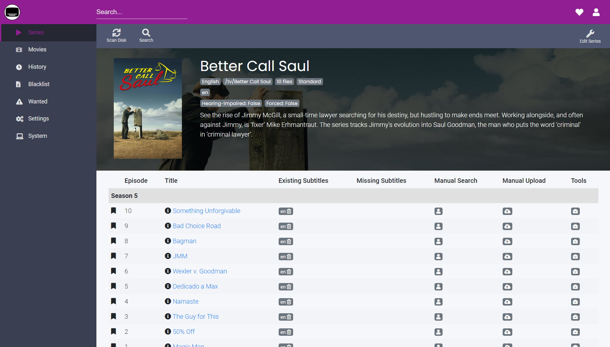

# Versionshinweise

## Oktober 2020 (Version 6.33)

### H&ouml;hepunkte

- **Bazarr** ist die neueste Anwendung aus dem optimierten Software-Portfolio von DietPi. Es ist eine Begleitanwendung zu Sonarr und Radarr und verwaltet und lädt Untertitel basierend auf definierten Anforderungen herunter.

{: width="1898" height="1080" loading="lazy"}

Für weitere Details zur Installation und Konfiguration &ouml;ffnen Sie die Seite [DietPi Optimized Software - Bazarr](../../software/bittorrent/#bazarr).

Begleitanwendung zu Sonarr und Radarr, die Untertitel basierend auf Ihren Anforderungen verwaltet und herunterlädt, jetzt zur Installation verfügbar. &Ouml;ffnen Sie die Seite [Bazarr](../../software/bittorrent/#bazarr) in [Optimierte Software](../../software/).
Vielen Dank an @DiogoAbu für diesen Vorschlag [Ausgabe #2045](https://github.com/MichaIng/DietPi/issues/2045)

- **Docker-Logging im RAM/Journald verfügbar**

Diese Funktion ist jetzt für neue Docker-Installationen oder -Neuinstallationen verfügbar. Protokolle werden jetzt mit begrenzter Ausführlichkeit für systemd-journald (RAM) erstellt. Sie k&ouml;nnten mit dem nächsten Befehl zugänglich sein:

    ```sh
    journalctl -u docker -u containerd
    ```

Diese Änderung bietet den Vorteil reduzierter Festplattenschreibvorgänge und macht Protokolle für das Systemjournal zugänglich (au&szlig;erhalb der containerisierten Umgebung). Um vollständig von dieser Verbesserung zu profitieren, kann Docker mit dem nächsten Befehl neu installiert werden:

    ```sh
    dietpi-software reinstall 162
    ```

Vielen Dank an @SaturnusDJ für diesen Vorschlag: [Issue #2388](https://github.com/MichaIng/DietPi/issues/2388)

### Verbesserungen

- **DietPi-Login** :octicons-arrow-right-16: Anmeldungen warten nicht mehr auf das Ende von DietPi-PostBoot, da dies nicht unbedingt erforderlich ist. Auf der lokalen Konsole blockiert die DietPi-PostBoot-Verarbeitungsausgabe praktisch die Anmeldung, bis sie abgeschlossen ist oder abgelaufen ist, und Anmeldungen auf einer anderen Konsole wie SSH oder seriell erfordern dies nicht. DietPi-PostBoot sucht nur nach DietPi-Updates, startet Hintergrunddienste und druckt das Pre-Login-Banner auf der lokalen Konsole, nichts, was für die Konsolennutzung erforderlich ist.
- **DietPi-Autostart** :octicons-arrow-right-16: Autostart-Programme mit einem Vordergrundprozess werden jetzt als Ersatz für den DietPi-Login-Prozess über "exec" gestartet, was 3-4 MiB RAM-Verbrauch spart.
- **DietPi-Software** :octicons-arrow-right-16: Bei Verwendung eines ungültigen Eingabearguments gibt die dietpi-Software jetzt Nutzungsinformationen an das Terminal aus.
- **DietPi-Software** :octicons-arrow-right-16: Die `"dietpi"` UNIX-Gruppe wurde zur primären Gruppe für alle Dienste gemacht, die vorher mit `"Group=dietpi"` liefen: Transmission, Mopidy, MiniDLNA, Airsonic, Plex Media Server, Emby Server, Medusa, Tonido, Blynk Server, SABnzbd, Koel, NZBGet. Wenn der Benutzer (+Gruppe) von einem externen Paket oder Installationsprogramm erstellt wird, wird die ursprüngliche primäre Gruppe als zusätzliche Gruppe beibehalten, um die Zugriffsberechtigungen auf vorab erstellte Verzeichnisse und Dateien m&ouml;glicherweise nicht zu unterbrechen. Derzeit ist die einzige Ausnahme von diesen Änderungen _Deluge_ - wir wollen den separaten Web-UI-Dienst nicht mit Gruppenberechtigungen von `dietpi` ausführen. Im Fall von _Tautulli_ werden die Berechtigungen der `dietpi`-Gruppe entfernt, da _Tautulli_ sie nicht ben&ouml;tigt.
- **DietPi-Software** :octicons-commit-24: **phpBB** :octicons-arrow-right-16: Neue phpBB-Installationen werden mit Version 3.3.1 durchgeführt. Vorhandene Instanzen werden nicht berührt, da Updates manuell über den internen Update-Mechanismus durchgeführt werden müssen, der die obligatorische Datenbankmigration umfasst. Neue phpBB-Installationen werden nun im Ordner `/var/www/phpbb` abgelegt. Der frühere Installationsspeicherort `/var/www/phpBB3` wird, falls verfügbar, weiterhin ordnungsgemä&szlig; behandelt.
- **DietPi-Software** :octicons-commit-24: **OctoPrint** :octicons-arrow-right-16: Der Dienst läuft jetzt als Benutzer `octoprint`, das Git-Branch-Verzeichnis wurde nach `/opt /octoprint` und `/mnt/dietpi_userdata/octoprint` ist jetzt das Heimatverzeichnis des Benutzers und damit das Konfigurations- und Datenverzeichnis. Um diese Änderungen anzuwenden, wird OctoPrint mit DietPi v6.33 neu installiert, das die Python 3-Migration (siehe v6.32-Änderungsprotokoll) auf Buster- und Bullseye-Systemen enthält. Dies impliziert, dass die CLI (Befehl `octoprint`) als Benutzer `octoprint` ausgeführt werden muss, um die richtige Konfiguration aufzurufen. Ein Bash-Shell-Alias l&ouml;st dies automatisch für alle Benutzer mit sudo-Berechtigungen, aber wenn Sie eine benutzerdefinierte Shell verwenden, muss die CLI wie folgt aufgerufen werden:

    ```sh
    sudo -u octoprint octoprint <command>
    ```

Vielen Dank an @ModischFabrications für die Meldung eines Problems, das damit zusammenhängt, dass der Dienst zuvor als Root-Benutzer ausgeführt wurde: [Issue #3315](https://github.com/MichaIng/DietPi/issues/3315)

- **DietPi-Software** :octicons-commit-24: **Tautulli** :octicons-arrow-right-16: Verzeichnisse, Benutzer und Dienst werden von `"plexpy"` in `"tautulli"` umbenannt. Au&szlig;erdem läuft es jetzt mit Python 3 statt mit Python 2. Diese Änderungen werden auch während des DietPi-Updates angewendet.
- **DietPi-Software** :octicons-commit-24: **Baïkal** :octicons-arrow-right-16: Aktualisieren Sie die (Neu-)Installationsprozedur, um das neue Konfigurationsverzeichnis abzudecken und die vorgepackte Version zu verwenden Archive statt Rohquelle und Komponist. Die Webserver-Konfigurationen wurden hinzugefügt, um die Zugriffsberechtigungen abzusichern.
- **DietPi-Software** :octicons-commit-24: **Mosquitto** :octicons-arrow-right-16: Wo m&ouml;glich wird jetzt das offizielle APT-Repository verwendet, das derzeit ARMv8/arm64 und Raspbian/Debian Bullseye ausschlie&szlig;t . Diese Änderung wird über eine Neuinstallation während des DietPi-Updates angewendet. Vielen Dank an @marcobrianza für diesen Vorschlag: [Issue #3042](https://github.com/MichaIng/DietPi/issues/3042)
- **DietPi-Software** :octicons-commit-24: **Cuberite** :octicons-arrow-right-16: Ein falscher Verzeichnisname aufgrund eines Tippfehlers wurde behoben. Eine Neuinstallation aktualisiert Cuberite und verschiebt sein Installationsverzeichnis wie beabsichtigt nach `/mnt/dietpi_userdata/cuberite`. Dies wird über die DietPi-Aktualisierung angewendet, aber es wird ein Backup erstellt, um Probleme aufgrund m&ouml;glicher struktureller Änderungen abzudecken, insbesondere für ältere Instanzen, die unter `/etc/cuberite` installiert sind.
- **DietPi-Software** :octicons-commit-24: **Amiberry** :octicons-arrow-right-16: Ein Update auf Amiberry v3.3 wird während des DietPi v6.33-Updates angewendet.
- **DietPi-Software** :octicons-commit-24: **LXDE** :octicons-arrow-right-16: Standardmä&szlig;ig wird jetzt ein Doppelklick auf ein Desktop-Icon oder eine ausführbare Datei direkt ausgeführt, ohne vorher gefragt zu werden, was zu tun ist. Dieses Verhalten kann im `PCManFM`-Dateimanager > `Bearbeiten` > `Einstellungen` > `Allgemein` > `Optionen zum Starten der ausführbaren Datei nicht fragen` geändert werden.

### Dokumentationsverbesserungen

- **Installationsanleitung** :octicons-arrow-right-16: Es wurde vollständig geändert und vereinfacht. Es gibt eine einzelne Seite mit mehr Registerkarten. Die Seite hebt verschiedene Schritte hervor, die für verschiedene Plattformen verwendet werden, während die gemeinsame Struktur beibehalten wird. Vielen Dank an @StephanStS für diese Aktualisierungen.
- **Schreibregeln** :octicons-arrow-right-16: Die Dokumentation hat sich weiterentwickelt. Es beginnt mit einer Dateinamenskonvention, mehr aktualisierten URLs und so weiter. Vielen Dank an @StephanStS für diese Aktualisierungen.

### API-Änderungen

- **DietPi-Globals** :octicons-arrow-right-16: Die Variable `G_FP_DIETPI_USERDATA` wurde entfernt. Variablen k&ouml;nnen nicht in jedem Kontext verwendet werden, z. B. nicht in Konfigurationsdateien, die auf GitHub oder dietpi.com zum Download gespeichert sind, ihr Wert `/mnt/dietpi_userdata` ändert sich nicht und die Verwendung des Pfads erm&ouml;glicht buchstäblich eine leicht vereinfachte und gehärtete Codierung.

### Fehlerbehebung

- **Allgemein** :octicons-arrow-right-16: Es wurde ein Problem behoben, bei dem die Verwendung von `AUTO_UNMASK_LOGIND=1` oder die Aktivierung von Amiberry Fast Boot es nicht erlaubte, `systemd-logind` wie beabsichtigt zu starten, wenn das erforderliche `dbus`-Paket vorhanden war vorher nicht installiert. Vielen Dank an @razerbann für die Meldung dieses Problems: [Issue #3770](https://github.com/MichaIng/DietPi/issues/3770)
- **RPi** :octicons-arrow-right-16: Es wurde ein Problem behoben, bei dem Allo USBridgeSig (`ASIX AX88179`) Ethernet aufgrund eines nicht übereinstimmenden Treibers fehlschlägt. Vielen Dank an @dsnyder0pc für die Meldung dieses Problems und vielen Dank an Allo für die Bereitstellung stabiler Branch-Treiber-Builds und einer Methode zum Vergleichen von Kernel-Modul-Layouts: [Issue #3725](https://github.com/MichaIng/DietPi/issues/3725 )
- **DietPi-Backup** :octicons-arrow-right-16: Behebung eines Problems, bei dem F2FS nicht als Zielspeicherort unterstützt wurde. Da es über volle UNIX-Berechtigungen und Symlinks-Unterstützung verfügt und als rootfs-Dateisystem verwendet werden kann, kann es auch für Betriebssystemsicherungen verwendet werden. Vielen Dank an @Cjkeenan für die Meldung dieses Problems: [Issue #606](https://github.com/MichaIng/DietPi/issues/606#issuecomment-695944450)
- **DietPi-Set_swapfile** :octicons-arrow-right-16: Es wurde ein Problem behoben, bei dem `swapon` auf ext4 aufgrund eines externen Fehlers in Linux 5.7 und 5.8 fehlschlug. Das Skript versucht nun unabhängig von der Kernelversion und dem Dateisystemtyp zuerst eine schnelle und weniger schreibintensive `fallocate`-Vorabzuweisung und greift im Fehlerfall auf dd zurück. Vielen Dank an @auanasgheps für die Meldung dieses Problems: [Issue #3756](https://github.com/MichaIng/DietPi/issues/3756)
- **DietPi-Config** :octicons-arrow-right-16: Behebung eines Problems, bei dem auf Geräten mit alten Linux-Kernelversionen (z. B. Sparky SBC mit Linux 3.10.38) die Leistungsoptionen mit einem Syntaxfehler nicht ge&ouml;ffnet werden konnten. Vielen Dank an @dsnyder0pc für die Meldung dieses Problems: [Issue #3799](https://github.com/MichaIng/DietPi/issues/3799)
- **DietPi-Config** :octicons-arrow-right-16: Behebung eines Problems auf RPi 2, bei dem eine falsche Standard-SDRAM-Frequenz angezeigt wurde, die bei der aktuellen Firmware 450 MHz statt 400 MHz beträgt.
- **DietPi-Software** :octicons-commit-24: **OpenTyrian** :octicons-arrow-right-16: Die Autostart-Option und das Ausführungsskript wurden korrigiert und leicht verbessert, um die RAM-Nutzung um ein Gebot zu senken.
- **DietPi-Software** :octicons-commit-24: **Firefox Sync Server** :octicons-arrow-right-16: Behebung eines Problems, bei dem der Build aufgrund fehlender MySQL/MariaDB-Header fehlschlug, neu erforderlich. Vielen Dank an @kinoushe für die Meldung dieses Problems: [Issue #3744](https://github.com/MichaIng/DietPi/issues/3774)
- **DietPi-Software** :octicons-commit-24: **Firefox Sync Server** :octicons-arrow-right-16: Ein weiteres Problem wurde behoben, bei dem der Build aufgrund des Ü;bergangs des gesamten Projekts von Python zu Rust fehlschlug. Wir bleiben jetzt bei einem festen Commitment und werden keine neueren Versionen von Firefox Sync Server ausliefern, bis dieser Ü;bergang vollständig abgeschlossen ist, da sich der Installationsprozess und die Anforderungen ständig ändern werden. Nochmals vielen Dank an @kinoushe für die Meldung dieses Problems.
- **DietPi-Software** :octicons-commit-24: **LXDE** :octicons-arrow-right-16: Mehrere Probleme aufgrund von Konflikten zwischen den RPi-Desktop-LXDE-Paketen mit nativem LXDE wurden behoben.
- **DietPi-Software** :octicons-commit-24: **Webmin** :octicons-arrow-right-16: Umgehung eines Problems, bei dem die Installation fehlschlug. Webmin hängt von `apt-show-versions` ab, die keine komprimierten APT-Listendateien unterstützen, was standardmä&szlig;ig mit DietPi v6.32 implementiert wurde.
- **DietPi-Software** :octicons-commit-24: **WebIOPi** :octicons-arrow-right-16: Es wurde ein Problem behoben, bei dem der Download fehlschlug.
- **DietPi-Software** :octicons-commit-24: **Home Assistant** :octicons-arrow-right-16: Es wurde ein Problem behoben, bei dem die Installation auf ARM aufgrund fehlender neuer Build-Abhängigkeiten fehlschlug. Vielen Dank an @pbutterworth für die Meldung und [phpBB:novitibo](https://dietpi.com/phpbb/memberlist.php?username=novitibo){: class="nospellcheck"} für die Bereitstellung der L&ouml;sung: [Issue Forum]( https://dietpi.com/phpbb/viewtopic.php?&t=8095)
- **DietPi-Software** :octicons-commit-24: **Kodi** :octicons-arrow-right-16: Behebung eines Problems auf Odroid XU4, bei dem die Installation aufgrund des fehlenden Pakets `librockchip-mpp1` fehlschlug, das stattdessen vorhanden war soll nur auf Odroid N1 installiert werden.
- **DietPi-Software** :octicons-commit-24: **TigerVNC+LXDE** :octicons-arrow-right-16: Es wurde ein Problem behoben, bei dem der Start von `lxappearance` (`Look and Feel anpassen`) in TigerVNC hängen blieb Sitzungen.
- **DietPi-Software** :octicons-commit-24: **Fail2Ban** :octicons-arrow-right-16: Es wurde ein Problem behoben, bei dem der Dienst aufgrund einer fehlenden Variablendeklaration in unserer Standardkonfiguration nicht gestartet werden konnte . Vielen Dank an [phpBB:mafioso12dk](https://dietpi.com/phpbb/memberlist.php?username=mafioso12dk){: class="nospellcheck"} für die Meldung dieses Problems: <https://dietpi.com/phpbb/viewtopic.php?t=8147>
- **DietPi-Software** :octicons-commit-24: **DietPi-RAMlog** :octicons-arrow-right-16: Behebung eines Problems, bei dem /var/log-Inhalte bei der Neuinstallation von DietPi-RAMlog nicht wiederhergestellt wurden, z beim Umschalten des Aufzeichnungsmodus von Nr. 1 auf Nr. 2. Dies k&ouml;nnte zu Dienststartproblemen geführt haben, wenn diese darauf angewiesen sind, dass Protokolldateien oder Verzeichnisse vorhanden sind. Vielen Dank an [phpBB:djashdj](https://dietpi.com/phpbb/memberlist.php?username=djashdj){: class="nospellcheck"} für die Meldung dieses Problems: <https://dietpi.com/phpbb/viewtopic.php?t=8163>

Wie immer wurden viele kleinere Codeleistungs- und Stabilitätsverbesserungen sowie visuelle und Rechtschreibkorrekturen vorgenommen, zu viel, um sie alle hier aufzulisten. Sehen Sie sich alle Codeänderungen dieser Version auf GitHub an: <https://github.com/MichaIng/DietPi/pull/3829>
