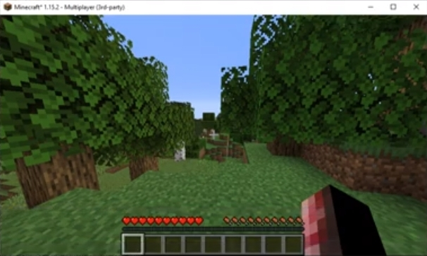
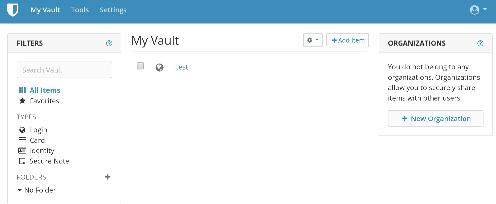

# Versionshinweise

## Dezember 2020 (Version 6.34)

### Ü;berblick

Willkommen zur **Ver&ouml;ffentlichung vom Dezember 2020** :octicons-gift-16: von DietPi. Diese Version enthält **5 neue Softwaretitel** :octicons-paper-airplane-16:, volle Unterstützung für den neu eingeführten **Raspberry Pi 400** und weitere interessante Funktionen und Fehlerbehebungen.

Als Zusammenfassung des Jahres 2020 hatte DietPi **8 Ver&ouml;ffentlichungen** mit über **175.000** Downloads. Es brachte 128 :octicons-light-bulb-16: Verbesserungen und Änderungen sowie 119 :octicons-issue-closed-16: Fehlerbehebungen.

{: width="447" loading="lazy"}

### Neue optimierte Softwarepakete

**[Portainer - Docker-Containerverwaltung](../../software/programming/#portainer)**

Es ist ein neues Softwarepaket, das in der optimierten DietPi-Liste enthalten ist. Portainer vereinfacht Ihr Docker-Container-Management über die Portainer-Weboberfläche. Es erm&ouml;glicht eine schnellere Bereitstellung der Anwendungen und bietet Transparenz in Echtzeit.

Weitere Einzelheiten finden Sie auf der [Dokumentationsseite](../../software/programming/#portainer).

{: width="1159" loading="lazy"}

Vielen Dank an @Joulinar für die Implementierung dieser Softwareoption - mehr Details hier: MichaIng/DietPi#3933

**[PaperMC - Hochoptimierter Minecraft-Server](../../software/gaming/#papermc)**

PaperMC erweitert die Liste der von DietPi unterstützten Minecraft-Server. Es ist eine Hochleistungsgabel des Spigot Minecraft Servers, die darauf abzielt, die Inkonsistenzen im Spiel und in der Mechanik zu beheben sowie die Leistung zu verbessern. Es ist in Java geschrieben und über Plugins erweiterbar, die jetzt zur Installation verfügbar sind.

Weitere Einzelheiten finden Sie auf der [Dokumentationsseite](../../software/gaming/#papermc).

{: width="606" loading="lazy"}

Vielen Dank an @ravenclaw900 für die Implementierung dieser Softwareoption: MichaIng/DietPi#3828

**[Tor-Relay – Werde Teil des Tor-Projekts](../../software/advanced_networking/#tor-relay)**

Werden Sie Teil des Tor-Projekts und verwandeln Sie Ihren DietPi in ein Tor-Relay, um anderen zu helfen, sicher und privat im Internet zu surfen.

Weitere Einzelheiten finden Sie auf der [Dokumentationsseite](../../software/advanced_networking/#tor-relay).

{: width="200" height="121" loading="lazy"}

Vielen Dank an @ravenclaw900 für die Implementierung dieser Softwareoption: MichaIng/DietPi#3921.

**[Ungebunden – Open-Source-DNS-Resolver](../../software/dns_servers/#ungebunden)**

Validierender, rekursiver, zwischenspeichernder DNS-Resolver ist jetzt für die Installation und Integration mit [Pi-hole](../../software/dns_servers/#pi-hole) verfügbar.

Weitere Einzelheiten finden Sie auf der [Dokumentationsseite](../../software/dns_servers/#unbound)

{: width="603" height="331" loading="lazy"}

Vielen Dank an @ravenclaw900 für die Implementierung dieser Softwareoption: MichaIng/DietPi#3872

**[Bitwarden_RS - Passwort-Manager-Server](../../software/cloud/#vaultwarden)**

Bitwarden_RS ist ein inoffizieller Bitwarden-Passwort-Manager-Server mit Web-UI, der in Rust geschrieben ist und sich perfekt für selbst gehostete Bereitstellungen eignet.

Weitere Einzelheiten finden Sie auf der [Dokumentationsseite](../../software/cloud/#vaultwarden)

{: width="2000" height="823" loading="lazy"}

Vielen Dank an @CactiChameleon9 für die Implementierung dieser Softwareoption (MichaIng/DietPi!3724).

### Neuer unterstützter SBC

Das neue [Raspberry Pi 400](https://www.raspberrypi.org/blog/raspberry-pi-400-the-70-desktop-pc/) wird jetzt vollständig unterstützt. Inspiriert von den Heimcomputern der 1980er Jahre ist der Raspberry Pi 400 ein vollständiger Personal Computer, der in eine kompakte Tastatur eingebaut ist.

Weitere Einzelheiten zur Installation von DietPi finden Sie in der [Dokumentation](../../hardware/#raspberry-pi).

{: width="800" height="571" loading="lazy"}

### Änderungen / Verbesserungen / Optimierungen

- **Aktivieren Sie automatische APT-Paketaktualisierungsprüfungen und aktualisieren Sie sie sogar täglich**. Durch Setzen der neuen `dietpi.txt`-Einstellung

    ```sh
    CONFIG_CHECK_APT_UPDATES=1
    ```

    Sie k&ouml;nnen tägliche APT-Update-Prüfungen aktivieren (Standardwert). Das Ergebnis wird im DietPi-Login-Banner angezeigt, ähnlich wird ein verfügbares DietPi-Update präsentiert.

    dietpi-automated_APT_package_update
    {: width="670" height="326" loading="lazy"}

    Satz

    ```sh
    CONFIG_CHECK_APT_UPDATES=2
    ```

    um _APT-Pakete täglich automatisch_ aktualisieren zu lassen, wobei Protokolle in der nächsten Datei `/var/tmp/dietpi/logs/dietpi-update_apt.log` gespeichert werden. Cron wird für den Zeitplan verwendet, was bedeutet, dass Sie die Ausführungszeit über `dietpi-cron > "cron.daily"` steuern k&ouml;nnen.

    Vielen Dank an @ravenclaw900 für die Implementierung dieser Funktion: <https://github.com/MichaIng/DietPi/pull/3899>

- **DietPi-Dokumentation** wurde erweitert. Es deckt jetzt alle **[DietPi-optimierte Software](../../software/)**-Kategorien ab. Vielen Dank an @StephanStS für all diese Updates.

    {: width="1335" height="667" loading="lazy"}

- **DietPi-Globals** :octicons-arrow-right-16: In DietPi-Skripten wird die PATH-Variable jetzt mit dem Debian/bash-Systemstandard überschrieben, um sicherzustellen, dass kein beschädigter oder manipulierter PATH über zB `su` übergeben werden kann oder `sudo -E`. Das bedeutet, dass Overrides jetzt in `/usr/local/(s)bin` abgelegt werden müssen, was zuvor auch der einzige Speicherort für systemweite Overrides war. Vielen Dank an @tandy-1000 für die Meldung eines ähnlichen Problems (MichaIng/DietPi!3873).
- **DietPi-Set_swapfile** :octicons-arrow-right-16: Gehärtete Berechtigungen des Zram-Swap-Geräts `/dev/zram0`, damit nur Root-Benutzer (Modus 0600) darauf zugreifen k&ouml;nnen und Eingabeargument `/dev/ interpretieren zram0` und `zram0` auch als `zram-swap`, abgesehen von nur `zram`. Vielen Dank an @hansjuergenmay für die Meldung eines ähnlichen Problems (MichaIng/DietPi!3869).
- **DietPi-NordVPN** :octicons-arrow-right-16: Eine Funktion wurde hinzugefügt, um die NordVPN-Serverliste zu aktualisieren, zB wenn neue Server verfügbar sind, die näher an Ihrem Standort sind.
- **[DietPi-JustBoom](../../dietpi_tools/#configuration)** :octicons-arrow-right-16: Die ALSA-Equalizer-Einstellungen werden nicht in `/var/lib/dietpi/dietpi-config /.alsaequal.bin`, wo alle Benutzer/Dienste es lesen k&ouml;nnen und alle Mitglieder der `dietpi`-Gruppe (oder `root`) es erstellen und schreiben k&ouml;nnen. Vielen Dank an @wowcut für die Meldung dieses Problems (MichaIng/DietPi!3950).
- **[DietPi-Config | Raspberry Pi](../../dietpi_tools/#display-options)** :octicons-arrow-right-16: Bei Verwendung von weniger als 32 MiB GPU-Speicher werden das VCSM-Gerät (VideoCore Shared Memory) und das Kernel-Modul deaktiviert jetzt. Die automatisch geladenen abgespeckten Firmware-Dateien unterstützen dies nicht, was zu derzeit 5 erwarteten Kernel-Fehlermeldungen führt. Das Deaktivieren von Anfang an k&ouml;nnte den Startvorgang geringfügig beschleunigen und die Speichernutzung reduzieren, aber was noch wichtiger ist, reduziert Verwirrung oder Sorgen, die durch die Fehlermeldungen verursacht werden.
- **[DietPi-Config | Audiooptionen](../../dietpi_tools/#audio-options)** :octicons-arrow-right-16: Option zum Umschalten zwischen direkter Audioausgabe und automatischer Softwarekonvertierung für Kanäle, Format und Rate über ALSA hinzugefügt `Plug`-Plugin. Dies kann erforderlich sein, um jede rohe `.wav`-Datei abzuspielen, unabhängig von den Fähigkeiten der Soundkarte und ohne manuell unterstützte Werte zu definieren. Wenn automatische Softwarekonvertierungen aktiviert sind, entspricht dies den Debian ALSA-Standardeinstellungen, kann jedoch die CPU-Auslastung erh&ouml;hen und die Klangqualität verringern.
- **[DietPi-Config | Raspberry Pi](../../dietpi_tools/#advanced-options)**: Beim Aktivieren der I2C-Unterstützung wird jetzt das Python 3 SMbus-Modul anstelle der veralteten Python 2-Version installiert. Dies entspricht auch der Abhängigkeit von PiJuice, das heutzutage Python 3 SMbus als Paketabhängigkeit zieht, daher vermeidet diese Änderung die veraltete Installation des gesamten Python 2-Stacks, wenn PiJuice über die dietpi-Software installiert wird. Vielen Dank an @Trunkzeh für die Meldung dieses Problems: <https://github.com/MichaIng/DietPi/issues/3963#issuecomment-748547394>
- **[DietPi-Software | OpenBazaar](../../software/social/#openbazaar)** :octicons-arrow-right-16: Build wird jetzt mit dem aktuell neuesten Go v1.15.3 durchgeführt und der Dienst läuft stattdessen als unprivilegierter Benutzer `openbazaar` von "Wurzel".
- **[DietPi-Software | XRDP](../../software/remote_desktop/#xrdp)** :octicons-arrow-right-16: Remote-Desktop-Verbindungen k&ouml;nnen jetzt mit der `Xorg`-Methode hergestellt werden und erfordern daher keinen aktiven VNC-Server mehr. Neue Installationen ziehen TigerVNC nicht als Abhängigkeit und wenn nur RDP ben&ouml;tigt wird, kann TigerVNC deinstalliert werden.
- **[DietPi-Software | Einzeldatei-PHP-Galerie](../../software/social/#image-gallery)** :octicons-arrow-right-16: Neue Installationen auf die neueste Version 4.7.1 aktualisiert. Führen Sie `dietpi-software reinstall 56` aus, um Ihre vorhandene Instanz zu aktualisieren.
- **[DietPi-Software | MineOS](../../software/gaming/#mineos)** :octicons-arrow-right-16: Ein systemd-Dienst wird jetzt verwendet, um den Daemon zugunsten des vorherigen Supervisors, des veralteten `mineos`-Benutzers, auszuführen wird nicht mehr erstellt, Node.js v11 wird zum Erstellen von MineOS verwendet, veraltete Abhängigkeiten wurden entfernt und eine Neuinstallation führt jetzt ein MineOS-Upgrade durch und die vorhandene `/etc/mineos.conf` wird nicht mehr ersetzt.
- **[DietPi-Software | Mycroft AI](../../software/hardware_projects/#mycroft-ai)** :octicons-arrow-right-16: Standardmä&szlig;ig ist das ALSA-Plugin für automatische Konvertierungen jetzt bei der Installation aktiviert, wodurch die OOTB-Kompatibilität mit allen erm&ouml;glicht wird `.wav` Soundformate und Soundkarte. Au&szlig;erdem wurde die Ü;berschreibung der H&ouml;rer-Abtastrate (48000 Hz) entfernt und auf die Mycroft-Standardeinstellung (16000 Hz) zurückgesetzt, wodurch ein Problem mit hängendem Mikrofonpegel in CLI und damit verbundener fehlgeschlagener Spracherkennung behoben werden k&ouml;nnte.
- **[DietPi-Software | Gogs](../../software/cloud/#gogs)** :octicons-arrow-right-16: Wurde für ARMv8-Boards aktiviert und auf ARMv7-Boards wird die neueste Version wieder installiert, was seitdem nicht mehr der Fall war Gog v0.12. aufgrund geänderter Download-Namen. Vielen Dank an [phpBB:MadKernel](https://dietpi.com/phpbb/memberlist.php?username=MadKernel){: class="nospellcheck"} für den erneuten Hinweis auf die ARMv8-Unterstützung: <https://dietpi.com/phpbb/viewtopic.php?t=8276>
- **[DietPi-Software | Folding@Home](../../software/distributed_projects/#foldinghome)** :octicons-arrow-right-16: Ist jetzt für ARMv8 (arm64) Boards verfügbar. Spenden Sie Ihre ungenutzte CPU-Leistung, um Forschern beim Kampf gegen Krankheiten wie Krebs, Alzheimer, Ebola und COVID-19 zu helfen.
- **[DietPi-Software | Radarr](../../software/bittorrent/#radarr)** :octicons-arrow-right-16: Wurde auf die neueste Hauptversion 3 aktualisiert, einschlie&szlig;lich der erforderlichen Branch-Migration (von `develop` zu `master`) und für Nicht-ARMv6-Boards eine Migration zum jetzt verfügbaren .NET-basierten Build weg von Mono. Diese Änderung wird auf alle DietPi-Systeme über die Radarr-Neuinstallation angewendet, wobei Ihre Daten und Konfigurationen natürlich erhalten bleiben.
- **[DietPi-Software | OctoPrint](../../software/printing/#octoprint)** :octicons-arrow-right-16: Ist jetzt über das PyPI-Repository verfügbar, kann daher einfacher und schneller installiert und aktualisiert werden, ohne die Quellen herunterzuladen und zu erstellen . Git wird nicht mehr ben&ouml;tigt, da der interne Updater ebenfalls nur Python pip verwendet. Wir migrieren alle DietPi OctoPrint-Instanzen auf die neue Version und neue Installationsmethode, sodass das Git/install-Verzeichnis `/opt/octoprint` veraltet ist und entfernt wird. Alle Ihre Daten bleiben selbstverständlich erhalten. Vielen Dank an @Stinocon für die Meldung von Problemen im Zusammenhang mit unserer vorherigen Implementierung: <https://github.com/MichaIng/DietPi/issues/3940>

### Entfernte Softwarepakete

- **DietPi-Software** | **CloudPrint** :octicons-arrow-right-16: Diese Softwareoption wurde entfernt, da der Google Cloud Print-Dienst Ende 2020 eingestellt wird und wir keine Softwareoptionen anbieten m&ouml;chten, die für funktionieren h&ouml;chstens zwei Monate. Bitte migrieren Sie rechtzeitig auf eine andere Druckl&ouml;sung. Bereits installierte CloudPrint-Instanzen bleiben installiert und der Systemdienst bleibt bis Ende des Jahres funktionsfähig. Mit dem ersten DietPi-Release im Jahr 2021 werden wir das Service-Handling entfernen und die Paketentfernung während des Update-Prozesses anbieten. Weitere Informationen finden Sie hier: <https://www.google.com/cloudprint/learn/>
- **DietPi-Software** | **Tonido** :octicons-arrow-right-16: Diese Softwareoption wurde entfernt, da sie seit drei Jahren nicht mehr entwickelt wurde, keine Quellen gefunden wurden und die neuesten Binärdateien alte Bibliotheksversionen erfordern, die nicht einfach installiert werden k&ouml;nnen auf derzeit unterstützten Debian-Versionen.

### Fehlerbehebung

- **[DietPi-Config](../../dietpi_tools/#configuration)** :octicons-arrow-right-16: Behebung eines Problems auf RPi, bei dem die Auswahl der integrierten 3,5-mm-Buchse bei einem HDMI-Bildschirm nicht funktionierte war angebracht. Wenn Sie explizit entweder HDMI-Audio oder integrierte 3,5-mm-Buchse auswählen, wird die andere jetzt auf Gerätebaumebene deaktiviert, was bedeutet, dass sie nicht ohne Neustart umgeschaltet werden kann. Dies ist derzeit die einzige bekannte M&ouml;glichkeit, um sicherzustellen, dass die 3,5-mm-Buchse für die Audioausgabe verwendet wird, unabhängig von jetzt oder später angeschlossenen oder abgenommenen HDMI-Bildschirmen. Vielen Dank an @corasaniti für die Meldung dieses Problems: <https://github.com/MichaIng/DietPi/issues/3887>
- **[DietPi-Config](../../dietpi_tools/#configuration)** :octicons-arrow-right-16: Behebung eines Problems auf RPi, bei dem bei Auswahl des LCD-Panels `waveshare32` ein veraltetes Gerätebaum-Overlay installiert wurde , nicht kompatibel mit dem aktuellen Linux 5.4-Kernel. Vielen Dank an @black00019 für die Meldung dieses Problems: <https://github.com/MichaIng/DietPi/issues/3881>
- **[DietPi-Services](../../dietpi_tools/#configuration)** :octicons-arrow-right-16: Es wurde ein Problem behoben, bei dem die Auswahl der CPU-Affinität aufgrund eines Syntaxfehlers fehlschlug.
- **[DietPi-Bugreport](../../dietpi_tools/#dietpi-bug-report)** :octicons-arrow-right-16: Es wurde ein Problem behoben, bei dem das Hochladen von Fehlerberichten abgebrochen wurde, wenn ein Verbindungstest auf Port 80 durchgeführt wurde /443 schlug fehl, obwohl Uploads über SFTP auf Port 22 durchgeführt wurden.
- **DietPi-Cleaner** :octicons-arrow-right-16: Es wurde ein Problem behoben, bei dem die Cleaner-Auswahl mit einem Syntaxfehler fehlschlug.
- **DietPi-Sync** :octicons-arrow-right-16: Es wurde ein Problem behoben, bei dem das Setzen des L&ouml;schmodus auf "Ein" keine Auswirkung darauf hatte. Vielen Dank an [phpBB:mafioso12dk](https://dietpi.com/phpbb/memberlist.php?username=mafioso12dk){: class="nospellcheck"} für die Meldung dieses Problems: <https://dietpi.com/phpbb/viewtopic.php?t=8226>
- **DietPi-Banner** + **DietPi-NordVPN** :octicons-arrow-right-16: Es wurde ein Problem behoben, bei dem die WAN-IP in eine mehrzeilige Ausgabe geändert wurde. Vielen Dank an @maartenlangeveld für die Meldung dieses Problems: <https://github.com/MichaIng/DietPi/issues/3908>
- **[DietPi-CloudShell](../../software/system_stats/#dietpi-cloudshell)** :octicons-arrow-right-16: Es wurde ein Problem behoben, bei dem die Szenenauswahl mit einem Syntaxfehler fehlschlug. Vielen Dank an @ravenclaw900 für die Meldung dieses Problems: <https://github.com/MichaIng/DietPi/issues/3880>
- **[DietPi-Software | PiVPN](../../software/vpn/#pivpn)** :octicons-arrow-right-16: Es wurde ein Problem behoben, bei dem das Installationsprogramm hängen blieb, da die interaktiven Whiptail-Dialoge nicht auf der Konsole angezeigt wurden. Vielen Dank an @kelliegator für die Meldung dieses Problems: <https://github.com/MichaIng/DietPi/issues/3844>
- **[DietPi-Software | Medusa](../../software/bittorrent/#medusa)** :octicons-arrow-right-16: Es wurde ein Problem behoben, bei dem Medusa nach der Installation nicht gestartet werden konnte. Vielen Dank an @Luan7805 für die Meldung dieses Problems: <https://github.com/MichaIng/DietPi/issues/3842>
- **[DietPi-Software | Webserver](../../software/webserver_stack/#webservers)** :octicons-arrow-right-16: Es wurde ein Problem behoben, bei dem die Neuinstallation fehlschlug, wenn `/var/www/html` nicht existierte.
- **[DietPi-Software | Lighttpd](../../software/webserver_stack/#lighttpd)** :octicons-arrow-right-16: Es wurde ein Problem behoben, bei dem die (Neu-)Installation fehlschlug, wenn das Modul `fastcgi` oder `fastcgi-php` aktiviert war schon.
- **DietPi-Software** | **O!MPD** :octicons-arrow-right-16: Es wurde ein Problem behoben, bei dem die URL-Prüfung für youtube-dl fehlschlug.
- **[DietPi-Software | Einzeldatei-PHP-Galerie](../../software/social/#image-gallery)** :octicons-arrow-right-16: Es wurde ein Problem behoben, bei dem Verzeichnisvorschauen aufgrund fehlender Berechtigungen nicht angezeigt wurden. Vielen Dank an [phpBB:tallbastard](https://dietpi.com/phpbb/memberlist.php?username=tallbastard){: class="nospellcheck"} für die Meldung dieses Problems: <https://dietpi.com/phpbb/viewtopic.php?p=28155#p28155>
- **[DietPi-Software | WebIOPi](../../software/hardware_projects/#webiopi)** :octicons-arrow-right-16: Es wurde ein Problem behoben, bei dem der Download und die Installation fehlschlugen.
- **[DietPi-Software | Nginx](../../software/webserver_stack/#nginx)** :octicons-arrow-right-16: Es wurde ein Problem behoben, bei dem die Anzahl der Worker-Prozesse nicht wie vorgesehen auf die Anzahl der CPU-Threads gesetzt wurde.
- **[DietPi-Software | MineOS](../../software/gaming/#mineos)** :octicons-arrow-right-16: Es wurde ein Problem behoben, bei dem das Node.js-Downgrade und daher das Kompilieren der Web-Benutzeroberfläche fehlschlug. Vielen Dank an @CactiChameleon9 für die Meldung dieses Problems: <https://github.com/MichaIng/DietPi/issues/3901>
- **[DietPi-Software | Mycroft AI](../../software/hardware_projects/#mycroft-ai)** :octicons-arrow-right-16: Es wurde ein Problem behoben, bei dem Skill-Installationen aufgrund fehlender Berechtigungen fehlschlugen. Vielen Dank an [phpBB:GreenGentleman](https://dietpi.com/phpbb/memberlist.php?username=GreenGentleman){: class="nospellcheck"} für die Meldung dieses Problems: <https://dietpi.com/phpbb /viewtopic.php?p=28464#p28464>
- **[DietPi-Software | Jellyfin](../../software/media/#jellyfin)** :octicons-arrow-right-16: Es wurde ein Problem behoben, bei dem Jellyfin nicht auf ARMv6 (RPi 1- und Zero-Modelle) lief. ARMv6/Raspbian-kompatible Binärdateien werden jetzt über ein anderes APT-Repository ausgeliefert. Vielen Dank an [phpBB:Shiivu](https://dietpi.com/phpbb/memberlist.php?username=Shiivu){: class="nospellcheck"} für die Meldung dieses Problems: <https://dietpi.com/phpbb /viewtopic.php?t=8263>
- **[DietPi-Software | WLAN-Hotspot](../../software/advanced_networking/#wifi-hotspot)** :octicons-arrow-right-16: Es wurde ein Problem auf RPi mit WLAN-Adaptern mit einem `RTL8188C*`-Chip behoben, bei dem der Dienst fehlschlug aufgrund eines ungültigen Treibers zu starten. Vielen Dank an [phpBB:yerc](https://dietpi.com/phpbb/memberlist.php?username=yerc){: class="nospellcheck"} für die Meldung dieses Problems: <https://dietpi.com/phpbb /viewtopic.php?p=28984#p28984>
- **[DietPi-Software | OctoPrint](../../software/printing/#octoprint)** :octicons-arrow-right-16: Es wurde ein Problem behoben, bei dem der Dienst und das System nicht mehr über die OctoPrint-Webbenutzeroberfläche und auf RPi neu gestartet werden konnten Der CPU-Drosselungsstatus konnte nicht abgeleitet werden.
- **[DietPi-Software | Ampache](../../software/media/#ampache)** :octicons-arrow-right-16: Es wurde ein Problem behoben, bei dem die Installation aufgrund einer inkompatiblen PHP-Composer-Version fehlschlug und es nicht m&ouml;glich war, die Konfiguration zu aktualisieren Datei auf eine neue Version über die Weboberfläche. Vielen Dank an [phpBB:kk345](https://dietpi.com/phpbb/memberlist.php?username=kk345){: class="nospellcheck"} für die Meldung dieser Probleme: <https://dietpi.com/phpbb/viewtopic.php?t=8367>

Wie immer wurden viele kleinere Codeleistungs- und Stabilitätsverbesserungen sowie visuelle und Rechtschreibkorrekturen vorgenommen, zu viel, um sie alle hier aufzulisten. Sehen Sie sich alle Codeänderungen dieser Version auf GitHub an.
