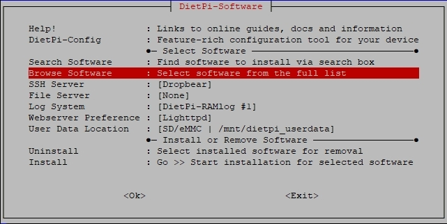
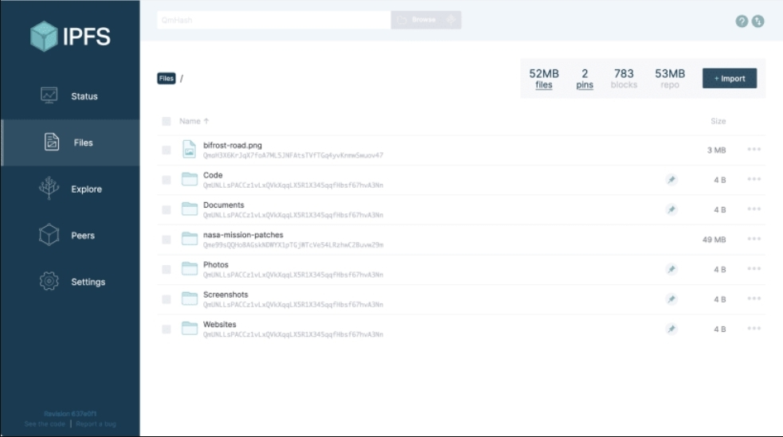
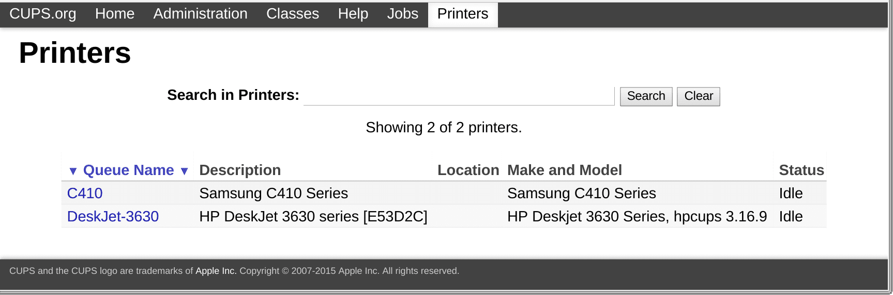
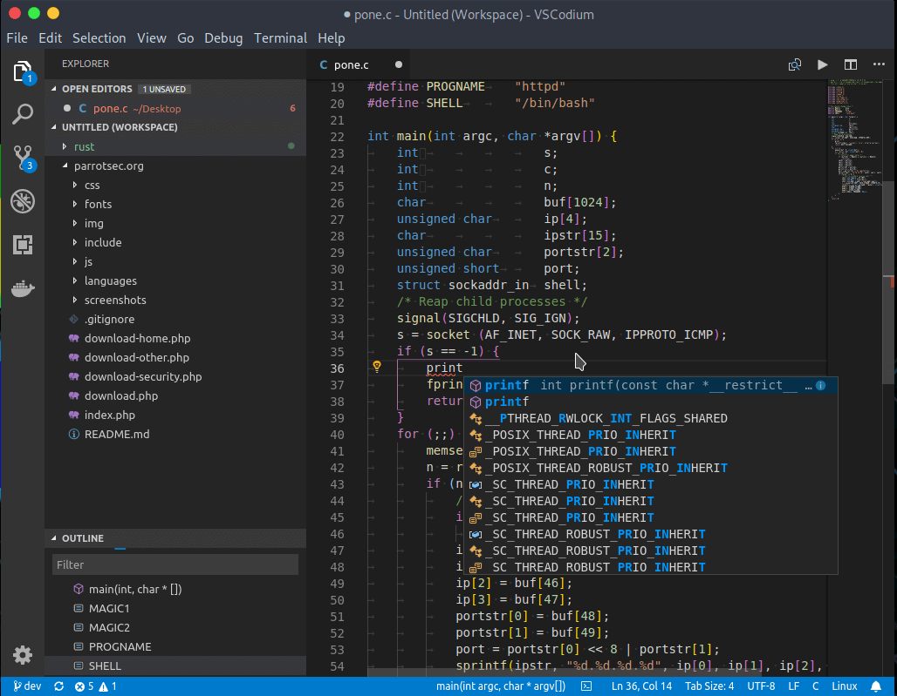
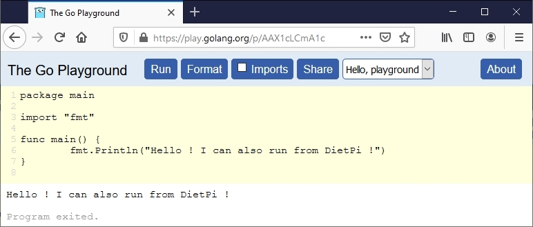
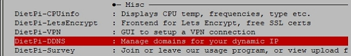
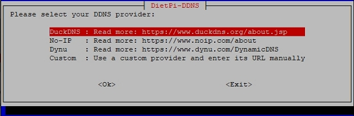
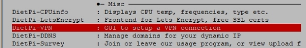
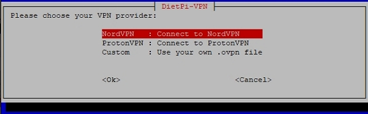
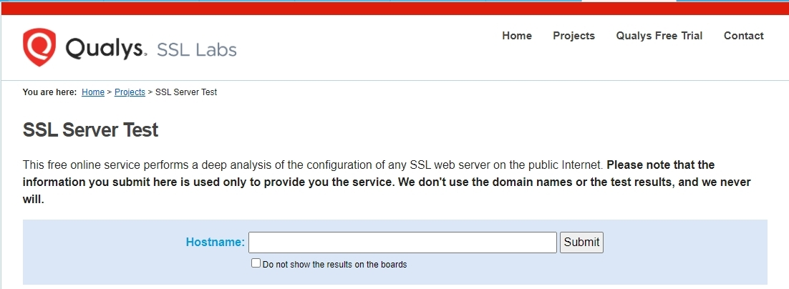

# Versionshinweise

## April 2021 (Version 7.1)

### &Uuml;berblick

Willkommen zur **Ver&ouml;ffentlichung vom April 2021** :octicons-heart-16: von **DietPi**. Es handelt sich um eine inkrementelle Version, die darauf abzielt, die Softwareauswahl zu vereinfachen und Dinge zu verbessern, die Sie mit **DietPi** tun k&ouml;nnen. Es ist jetzt einfacher, sich zu verbinden (DDNS), zu sichern (VPN, LetsEncrypt), Dateien oder Daten zu teilen (IPFS), zu drucken (CUPS) und zu konfigurieren.

:octicons-paper-airplane-16: Wenn Sie DietPi 7 noch nicht ausprobiert haben, ist dies ein hervorragendes Upgrade!

{: width="320" height="427" loading="lazy"}

!!! zitieren ""

_Foto von [David Pisnoy](https://unsplash.com/@davidpisnoy){: class="nospellcheck"} auf [Unsplash](https://unsplash.com)_{: class="nospellcheck"}

!!! Hinweis "Highlights"

- [**Zusammengef&uuml;hrte Softwareliste**](#select-software-from-a-merged-list)

Die Softwareauswahl ist jetzt vereinfacht! Sie haben eine einzige Liste mit &uuml;ber 190 Softwareoptionen zur Auswahl!

- [**Neue Software**](#neue-optimierte-Software-in-71)

IPFS-Knoten, Common UNIX Printing System (CUPS) und mehr in der Programmierung (Go-Sprache und eine hervorragende IDE: VSCodium).

- [**DietPi-Tools**: Erg&auml;nzungen und wichtige Updates](#dietpi-tools-in-71-new-notable-updates)

DietPi unterst&uuml;tzt mehr VPN-Clients und verf&uuml;gt &uuml;ber mehr dynamische DNS-Optionen. Die Aktivierung von SSL/TLS-Zertifikaten ist jetzt einfacher, wenn die Updates f&uuml;r das Tool `DietPi-LetsEncrypt` verwendet werden. Weitere Verbesserungen finden Sie in: `DietPi-Drive_Manager`, `DietPi-Config`.

- [**Verbesserungen**](#&Auml;nderungen-Verbesserungen-Optimierungen-in-71)

Weitere Verbesserungen an verschiedenen Softwaretiteln.

- [**Bugfixes**](#bug-fixes-in-71) & Aktualisierungen der Liste [**supported SBC**](#supported-sbc-updates-in-71).

Vielen Dank an alle Mitwirkenden und Betatester :octicons-heart-16: :octicons-heart-16:.
Mit Ihrer Hilfe k&ouml;nnten wir all diese Updates erreichen! Installiere oder aktualisiere auf dieses neueste Update – es hat noch mehr Dinge, von denen wir hoffen, dass sie dir gefallen!
Teilen Sie Ihr Feedback auf [Twitter](https://twitter.com/DietPi_), [DietPi Forum](https://dietpi.com/phpbb/) und melden Sie jedes Problem an [GitHub](https://github .com/MichaIng/DietPi/issues)!

!!! check "N&auml;chste DietPi-Ver&ouml;ffentlichung"

Als neue Funktion werden wir k&uuml;rzere Release-Zyklen und einen festen Zeitplan einf&uuml;hren. Das n&auml;chste Update ist bereits in Planung: ***DietPi 7.2 erscheint am 29.05.2021***.

### Software aus einer zusammengef&uuml;hrten Liste ausw&auml;hlen

Die _optimierten_ und _zus&auml;tzlichen_ Softwaremen&uuml;s wurden innerhalb des Tools `dietpi-software` zusammengef&uuml;hrt. Die fr&uuml;here Aufteilung folgte keinen einheitlichen Regeln. Die Zusammenf&uuml;hrung erlaubt Entwicklungstools und -plattformen eine prominentere Stellung. Es vereinfacht auch die Softwareauswahl und behebt eine m&ouml;gliche Verwirrung &uuml;ber diese Trennung in der Community.

{: width="641" height="322" loading="lazy" }

_Hinweis:_ Da mehrere Softwaretitel die Ports `5000` und `8000` &uuml;berwachten, wurden die Standardports dieser Titel ge&auml;ndert, um Konflikte bei gleichzeitigen Installationen zu vermeiden. W&auml;hrend des DietPi-Updates wird keine &Auml;nderung vorgenommen, selbst eine Neuinstallation des Softwaretitels &auml;ndert dies in den meisten F&auml;llen nicht. Details siehe unten bei den einzelnen Software&auml;nderungen.

### Neue Softwaretitel {: #neue-optimierte-Software-in-71 }

- [**IPFS-Knoten**](../../software/distributed_projects/#ipfs-node)

Das **InterPlanetary File System** (IPFS) ist ein Protokoll und ein Peer-to-Peer-Netzwerk zum Speichern und Zugreifen auf Dateien, Anwendungen und Daten in einem verteilten Dateisystem. Es kann jetzt mit `dietpi-software` oder direkt mit der Software-ID `186` installiert werden.

Nach der Installation k&ouml;nnen Sie &uuml;ber den Link `http://<your.IP>:5003/webui` auf die Web-Benutzeroberfl&auml;che zugreifen

{: width="983" height="549" loading="lazy"}

Vielen Dank an @ravenclaw900 f&uuml;r die Implementierung dieser Softwareoption: <https://github.com/MichaIng/DietPi/issues/4232>

- [**CUPS**](../../software/printing/#cups)

**Common UNIX Printing System** (CUPS) ist ein standardisiertes und modulares Drucksystem, das zahlreiche Datenformate auf dem Druckserver verarbeiten kann und auch das Internet Printing Protocol (IPP) unterst&uuml;tzt.

Es ist jetzt als optimierte Installationsoption mit der Software-ID `187` verf&uuml;gbar, einschlie&szlig;lich einer Webschnittstelle zum Verwalten und Freigeben von lokalen und Netzwerkdruckern in Ihrem LAN.

{: width="1727" height="573" loading="lazy"}

- [**VSCodium**](../../software/programming/#vscodium)

Es ist eine 100 % Open Source-Version von [Microsoft VS Code] (https://code.visualstudio.com). Es ist identisch mit VS Code, mit dem gr&ouml;&szlig;ten Unterschied, dass VSCodium im Gegensatz zu VS Code Ihre Nutzungsdaten nicht verfolgt (und es enth&auml;lt kein Microsoft-Branding, Telemetrie und Lizenzierung).

VSCodium ist ein hervorragender Editor nicht nur f&uuml;r Webentwickler, sondern auch f&uuml;r andere Programmierer. Aufgrund seiner Funktionen gilt es als einer der besten Open-Source-Code-Editoren mit voller Unterst&uuml;tzung f&uuml;r verschiedene Programmiersprachen, darunter Java, JavaScript, Go, Node.js, Python und C++.

{: width="1028" height="799" loading="lazy"}

- [**Go** Programmiersprache](../../software/programming/#go)

**Go** <https://golang.org> ist eine Open-Source-Programmiersprache, die es einfach macht, einfache, zuverl&auml;ssige und effiziente Software zu erstellen.

Seine Installation war zuvor in die Installation von [OpenBazaar](../../software/social/#openbazaar) eingebunden. Die Programmiersprache _Go_ ist jetzt eine dedizierte Installationsoption mit `dietpi-software` oder direkt mit der Software-ID `188` geworden. Die Installation umfasst das Laufzeitsystem, den Paketinstaller und die Compiler-Toolkette, wie unter <https://golang.org/dl/> zu finden.

Sie k&ouml;nnen einen Editor Ihrer Wahl verwenden oder [VSCodium](../../software/programming/#vscodium) verwenden. Die in VSCodium verf&uuml;gbare _Go-Erweiterung_ bietet umfassende Sprachunterst&uuml;tzung f&uuml;r die Programmiersprache Go.

Nur um einen Vorgeschmack zu bekommen, k&ouml;nnten Sie einige Befehle in diesem [_Go Spielplatz_](https://play.golang.org/p/AAX1cLCmA1c) ausf&uuml;hren.

{: width="772" height="329" loading="lazy"}

### DietPi Tools (neue / bemerkenswerte Updates) {: #dietpi-tools-in-71-new-notable-updates }

- [**DietPi-DDNS**](../../dietpi_tools/#dietpi-ddns)

Es ist ein neues DietPi-Tool, mit dem Sie Domains f&uuml;r Ihre **dynamische IP-Adresse** verwalten k&ouml;nnen.

{: width="600" height="97" loading="lazy"}

W&auml;hlen Sie einen Anbieter f&uuml;r dynamisches DNS (DDNS) aus oder f&uuml;gen Sie eine benutzerdefinierte API-URL hinzu, um Ihren DDNS-Eintrag regelm&auml;&szlig;ig &uuml;ber `cURL` und einen Cron-Job aktualisieren zu lassen. Unter anderem unterst&uuml;tzt es No-IP und ersetzt den bisher von DietPi unterst&uuml;tzten No-IP-Client.

{: width="600" height="198" loading="lazy"}

- [**DietPi-VPN**](../../dietpi_tools/#dietpi-vpn)

Es ist ein gr&ouml;&szlig;eres Upgrade eines bereits verf&uuml;gbaren Tools `DietPi-NordVPN`, das jetzt in den Ruhestand versetzt wird.

{: width="600" height="95" loading="lazy"}

Es erm&ouml;glicht mehr VPN-Clients und wird mit einem ProtonVPN-Client sowie mit einer benutzerdefinierten OVPN-Konfiguration geliefert. Das Skript wurde nach `/boot/dietpi/dietpi-vpn` verschoben und der Alias des Konsolenbefehls entsprechend in `dietpi-vpn` ge&auml;ndert.

{: width="600" height="186" loading="lazy"}

Zus&auml;tzlich wurde eine `Killswitch`-Funktion hinzugef&uuml;gt. Es verwirft zwangsweise alle WAN-Pakete, die nicht &uuml;ber das VPN gesendet wurden, wenn die Verbindung unterbrochen wurde, bis das VPN manuell/absichtlich getrennt wird. Au&szlig;erdem wird IPv6 jetzt automatisch deaktiviert, wenn die VPN-Verbindung aufgebaut wird. Dies ist erforderlich, um IPv6-Lecks zu verhindern, da die meisten ver&ouml;ffentlichten VPN-Anbieter/Server IPv6 nicht unterst&uuml;tzen. Fr&uuml;her wurde IPv6 automatisch wieder aktiviert, sobald die VPN-Verbindung beendet wurde.

Vielen Dank an @ravenclaw900 f&uuml;r diese umfassende &Uuml;berarbeitung – siehe <https://github.com/MichaIng/DietPi/pull/4180>.

- [**DietPi-LetsEncrypt**](../../dietpi_tools/#dietpi-letsencrypt) ist einfacher zu verwenden und hat mehrere Verbesserungen :octicons-arrow-right-16:

!!! Hinweis ""

- Es ist jetzt m&ouml;glich, **Zertifikate f&uuml;r mehrere Domains** zu erhalten. Diese sollten als durch Kommas getrennte Liste bereitgestellt werden, wobei die erste Domain als prim&auml;rer Webservername verwendet wird.
- Es wird m&ouml;glich, Zertifikate **ohne installierten Webserver** zu erhalten. Certbot kann f&uuml;r diesen Fall einen eigenen internen Webserver starten und das Zertifikat kann dann verwendet werden, um HTTPS manuell f&uuml;r andere Webanwendungen zu aktivieren, die auf anderen Ports als 80/443 laufen.
- Es ist m&ouml;glich, das Anheften des **Online Certificate Status Protocol** (OCSP) f&uuml;r das erhaltene Zertifikat zu aktivieren. Dadurch k&ouml;nnen Clients &uuml;berpr&uuml;fen, ob das Zertifikat widerrufen wurde, zB wenn der Server kompromittiert oder der private Schl&uuml;ssel gestohlen wurde.
- Wenn **Lighttpd** verwendet wird, wird HTTPS jetzt auch f&uuml;r IPv6-Anfragen aktiviert und die veralteten **TLSv1.0 und TLSv1.1** werden von Debian Buster deaktiviert. Mit der von Debian Stretch gelieferten Lighttpd-Version k&ouml;nnen diese TLS-Versionen nicht deaktiviert werden.

Weitere Informationen zu TLSv1.0 und TLSv1.1 bzw. Zum Testen k&ouml;nnen Sie einen Online-TLS-Checker verwenden. Ein Beispiel k&ouml;nnte sein: <https://www.ssllabs.com/ssltest/>.

{: width="1102" height="404" loading="lazy"}

- [**DietPi-Drive_Manager**](../../dietpi_tools/#dietpi-drive-manager) Verbesserungen :octicons-arrow-right-16:

!!! Hinweis ""

- Das Skript unterst&uuml;tzt die Gr&ouml;&szlig;en&auml;nderung f&uuml;r **F2FS**- und **Btrfs**-Dateisysteme. Der Dateisystemtyp **XFS** wird jetzt vollst&auml;ndig unterst&uuml;tzt, um Laufwerke damit zu formatieren und sie auf Dateisystemfehler &uuml;berpr&uuml;fen zu lassen.
- Beim Hinzuf&uuml;gen von **Samba-Mounts** werden Anmeldeinformationen nicht mehr im Klartext zu `/etc/fstab` hinzugef&uuml;gt, sondern stattdessen in einer separaten Credential-Datei pro Mount mit strikten Nur-Root-Leseberechtigungen gespeichert.
Vielen Dank an @TheOriginalMrWolf f&uuml;r diesen Vorschlag: <https://github.com/MichaIng/DietPi/issues/4082>

- [**DietPi-Config**](../../dietpi_tools/#dietpi-configuration) Verbesserungen :octicons-arrow-right-16:

!!! Hinweis ""

- Ein **sicheres &Uuml;bertaktungsprofil f&uuml;r RPi 3+-Modelle** hinzugef&uuml;gt! Vielen Dank an @lone f&uuml;r die Durchf&uuml;hrung von Langzeitstabilit&auml;tstests und die R&uuml;ckmeldung des Ergebnisses. Sehen Sie sich das vollst&auml;ndige Gespr&auml;ch an: [RPi 3 A+ DietPi-Config Performance Options](https://dietpi.com/phpbb/viewtopic.php?p=32285#p32285)

- Beim **Deaktivieren der RPi-Kamerafunktion** wird das Kernelmodul `bcm2835_isp` nun zus&auml;tzlich auf die schwarze Liste gesetzt. Seit Kernel 5.X wird es ansonsten automatisch geladen und zieht den gesamten Kameramodulstapel als Abh&auml;ngigkeit ein, was zus&auml;tzlichen Speicherverbrauch und Boot-Overhead hinzuf&uuml;gt. Vielen Dank an @ferbar f&uuml;r den Hinweis: <https://github.com/MichaIng/DietPi/issues/4203>

- DietPi-Config | Umgehung eines Problems in RPi, bei dem die Auswahl einer **Soundkarte** unter bestimmten Umst&auml;nden mit einer Fehlermeldung endete. Vielen Dank an @sturbs f&uuml;r die Meldung dieses Problems: #4306

- **DietPi-FS_partition_resize** :octicons-arrow-right-16: Unterst&uuml;tzung hinzugef&uuml;gt, um die Gr&ouml;&szlig;e von F2FS- und Btrfs-Dateisystemen beim ersten Start automatisch zu &auml;ndern.

### &Auml;nderungen / Verbesserungen / Optimierungen {: #&Auml;nderungen-Verbesserungen-Optimierungen-in-71 }

- **DietPi-Software** | [**Sonarr**](../../software/bittorrent/#sonarr) / [**Radarr**](../../software/bittorrent/#radarr) Verbesserungen: octicons-Pfeil-rechts -16:

!!! Hinweis ""

- **DietPi-Arr_to_RAM** :octicons-arrow-right-16: Unterst&uuml;tzung f&uuml;r [Sonarr](../../software/bittorrent/#sonarr) v3 und [Radarr](../../software/ bittorrent/#radarr) v3 wurde hinzugef&uuml;gt. Bei der ersten Verbindung zum RAM wird ein Skript `/mnt/dietpi_userdata/(sonarr|radarr|lidarr)/dietpi-arr_to_RAM.sh` erstellt, das die Aktualisierung der verkn&uuml;pften Datenbanksicherungen &uuml;ber die Funktion `Benutzerdefiniertes Skript` des Programms erm&ouml;glicht. Seit v3 ist es nicht mehr m&ouml;glich, Argumente an benutzerdefinierte Skripte zu &uuml;bergeben oder Skripte innerhalb des `boot`-Verzeichnisses aufzurufen, was das vorherige `/boot/dietpi/misc/dietpi-arr_to_RAM 2 (sonarr|radarr|lidarr)` zerst&ouml;rte Anrufe auf zwei Arten.
- [**Sonarr**](../../software/bittorrent/#sonarr) :octicons-arrow-right-16: Unterst&uuml;tzung f&uuml;r v3 und Migration auf v3 wurden implementiert. Bestehende Installationen werden nicht automatisch migriert. F&uuml;hren Sie dazu `dietpi-software reinstall 144` aus, um Ihr Sonarr auf v3 zu aktualisieren. Beim DietPi-Update erhalten Benutzer von Sonarr v2 eine Benachrichtigung.
- Nachdem beide jetzt als v3 oder h&ouml;her installiert wurden, ist ein lange ausstehendes Problem behoben. Das Importieren von Downloads in Dateisysteme ohne native UNIX-Berechtigungsunterst&uuml;tzung ist in der Vergangenheit fehlgeschlagen, einschlie&szlig;lich Samba/CIFS-Mounts.

- **DietPi-Software** | [**Mosquitto**](../../software/hardware_projects/#mosquitto) :octicons-arrow-right-16: Seit v2 sind standardm&auml;&szlig;ig Remote-Verbindungen und keine unauthentifizierten Anfragen mehr m&ouml;glich. Bei Neuinstallationen und Neuinstallationen aktivieren wir Remoteverbindungen, erstellen jedoch eine Passwortdatei, sodass sich MQTT-Clients standardm&auml;&szlig;ig mit dem Benutzernamen `mosquitto` und dem globalen Softwarepasswort authentifizieren m&uuml;ssen. Vielen Dank an @mattsmithuk f&uuml;r die Meldung dieser &Auml;nderung: <https://github.com/MichaIng/DietPi/issues/4133>
- **DietPi-Software** | [**IceCast**](../../software/media/#icecast) :octicons-arrow-right-16: Der Streaming-Server kann jetzt auch auf virtuellen Maschinen installiert werden und das standardm&auml;&szlig;ige Web-UI-Passwort wird jetzt verwendet das globale Softwarepasswort sein und kein zuf&auml;lliges. Da die DarkIce-Konfigurationsdatei `/etc/darkice.cfg` das globale Softwarepasswort im Klartext enth&auml;lt, wird ihr Berechtigungsmodus auf 600 ge&auml;ndert, um den Lesezugriff nur auf den Root-Benutzer zu beschr&auml;nken.
- **DietPi-Software** | [**OctoPrint**](../../software/printing/#octoprint) :octicons-arrow-right-16: Bei Neuinstallationen wurde der Standard-Listening-Port von 5000 auf 5001 ge&auml;ndert, um Konflikte mit Shairport zu vermeiden Synchronisieren.
- **DietPi-Software** | [**Firefox Sync Server**](../../software/cloud/#firefox-sync-server) :octicons-arrow-right-16: Bei Neuinstallationen wurde der Standard-Listening-Port von 5000 auf ge&auml;ndert 5002, um Konflikte mit Shairport Sync zu vermeiden.
- **DietPi-Software** | [**rTorrent**](../../software/bittorrent/#rtorrent) :octicons-arrow-right-16: Aus Leistungsgr&uuml;nden und um Konflikte mit Shairport Sync zu vermeiden, war der standardm&auml;&szlig;ige SCGI/RPC-Zugriff von TCP-Port `5000` auf UNIX-Socket ge&auml;ndert. Diese &Auml;nderung wird bei Neuinstallationen und Neuinstallationen von rTorrent angewendet, da sie eine &Auml;nderung auf beiden Seiten, rTorrent, ruTorrent und dem Webserver, erfordert. Die HTTP-Authentifizierung wird jetzt f&uuml;r den rTorrent-RPC-Zugriff mit allen Webservern erzwungen, wobei standardm&auml;&szlig;ig das globale Softwarepasswort verwendet wird, und der Passwort-Hash-Algorithmus wurde mit [Nginx](../../software/webserver_stack/#nginx) geh&auml;rtet.
- **DietPi-Software** | [**WebIOPi**](../../software/hardware_projects/#webiopi) :octicons-arrow-right-16: Bei Neuinstallationen wurde der Standard-Listening-Port von 8000 auf 8002 ge&auml;ndert, um Konflikte mit [ IceCast](../../software/media/#icecast). Au&szlig;erdem wurde der Installationsprozess etwas beschleunigt, indem unn&ouml;tige Installer-interne APT-Aufrufe &uuml;bersprungen wurden.
- **DietPi-Software** | [**Koel**](../../software/media/#koel) Verbesserungen :octicons-arrow-right-16:

!!! Hinweis ""

- Bei Neuinstallationen und Neuinstallationen wurde der **Listening Port** von `8000` auf `8003` ge&auml;ndert, um Konflikte mit IceCast zu vermeiden.
- Zus&auml;tzlich wurde der Installationsprozess vereinfacht und Abh&auml;ngigkeiten reduziert, da ab Koel v5.0.0 vorkompilierte Frontend-Binaries verf&uuml;gbar sind. Dies erm&ouml;glicht nun auch eine komplett unbeaufsichtigte Installation. Als kleine **Sicherheitsh&auml;rtung** wurde das Passwort der Koel MariaDB-Datenbank in eine lange zuf&auml;llige Zeichenfolge ge&auml;ndert und der Berechtigungsmodus der Konfigurationsdateien wurde auf `600` ge&auml;ndert, um nur dem Benutzer des Koel-Dienstes Lesezugriff zu gew&auml;hren.
- Es wurden weitere Probleme behoben, die **das Fehlschlagen der Installation verursachten**. Diese wurden durch ge&auml;nderte Archivverzeichnisnamen und ge&auml;nderte Laravel-Abh&auml;ngigkeiten verursacht.
- Schlie&szlig;lich als kleine **Leistungsverbesserung**, Koel verbindet sich jetzt &uuml;ber UNIX-Socket mit MariaDB, anstatt die TCP-Verbindung anzuzeigen, was es erm&ouml;glicht, TCP-Listening in [MariaDB](.././software/databases/#mariadb) zu deaktivieren.

- **DietPi-Software** | [**YaCy**](../../software/social/#yacy) :octicons-arrow-right-16: Bei Neuinstallationen und Neuinstallationen wird jetzt automatisch die neueste Version erkannt und heruntergeladen. Dies erm&ouml;glicht eine einfache Update-Methode durch einfaches Neuinstallieren von YaCy &uuml;ber `dietpi-software reinstall 133`, unabh&auml;ngig von der DietPi-Version.
- **DietPi-Software** | [**Remot3.it**](../../software/remote_desktop/#remot3it) :octicons-arrow-right-16: Nach Abschluss der Installation wird nun angeboten, das interaktive `connectd_installer`-Setup direkt durchzuf&uuml;hren . Es ist weder ein Neustart erforderlich, noch muss ein Dienst ausgef&uuml;hrt werden, um registriert zu werden. Dies ist besonders hilfreich f&uuml;r Installationen &uuml;ber `dietpi-software install 68`, wo der Hinweis auf diese erforderliche Einrichtung zuvor nicht gezeigt wurde.
- **DietPi-Software** | **RPi.GPIO** :octicons-arrow-right-16: Diese Softwareoption wurde in `Python 3 RPi.GPIO` umbenannt, um deutlich zu machen, dass es sich um ein Python-Paket handelt. In unseren Bem&uuml;hungen, alle Softwareoptionen auf Python 3 zu migrieren, wird von nun an nur noch das Python 3-Paket installiert. Um es f&uuml;r Python 2 zu installieren, muss man den folgenden Befehl manuell &uuml;ber die Konsole ausf&uuml;hren: `apt install python-rpi.gpio`

### Unterst&uuml;tzte SBC (Updates) {: #supported-sbc-updates-in-71 }

- Aus historischen Gr&uuml;nden hatte DietPi interne **Hardware-Identifikatoren** f&uuml;r SBCs, die seit langem nicht mehr offiziell unterst&uuml;tzt werden, n&auml;mlich verschiedene Orange Pi- und Banana Pi-Modelle, BeagleBone Black und LeMaker Guitar. Da wir kein Referenzbild bereitstellen und keine Funktionen auf diesen Boards testen, haben wir keine M&ouml;glichkeit, diese Hardware-IDs codeweise sinnvoll zu verwenden, um Optimierungen vorzunehmen oder Funktionen zu aktivieren, was sie bedeutungslos macht. Um falsche Annahmen zu vermeiden, haben wir daher die Identifizierungen f&uuml;r die genannten SBC-Modelle entfernt.

Als Ersatz haben wir einen Satz generischer SoC-Identifikatoren hinzugef&uuml;gt, die auch aus dem DietPi-PREP-Systemkonverterskript ausgew&auml;hlt werden k&ouml;nnen. Das hei&szlig;t, man kann zB `Generic Allwinner H3` ausw&auml;hlen und sich damit eine SoC-Kennung setzen lassen, die innerhalb des Codes f&uuml;r Bedingungen auf Basis des SoC verwendet wird, zB bez&uuml;glich GPU-Beschleunigung und anderen SoC-internen Hardwarefeatures. Die entfernten SBC-Modelle werden automatisch in diese generischen Bezeichner konvertiert, so dass zB nach dem Update ein OrangePi-PC in unseren Skripten und Bannern als "Generic Allwinner H3" angezeigt wird. W&auml;hrend es wie eine Verschlechterung aussieht, ist es eine H&auml;rtung, da es sicherstellt, dass keine falschen Annahmen und Bedingungen in unseren Skripten ausgel&ouml;st werden, sondern nur solche, von denen wir sicher wissen k&ouml;nnen, dass sie wahr sind, unabh&auml;ngig davon, welches urspr&uuml;ngliche Debian-Image Sie verwendet haben.

- **Firefly RK3399 wurde aus der Liste der unterst&uuml;tzten Ger&auml;te entfernt**, da kein einziger Benutzer &uuml;ber DietPi-Survey (<https://dietpi.com/survey/#device>) gemeldet wird. Falls es tats&auml;chlich Firefly RK3399 DietPi-Systeme g&auml;be, die nicht an der DietPi-Umfrage teilnehmen, w&uuml;rden diese auf die `Generic Rockchip RK3399`-Kennung migriert, die Code-weise genau dieselbe Unterst&uuml;tzung beibeh&auml;lt.

### Fehlerbehebungen {: #bug-fixes-in-71 }

- **DietPi-Config** / **DietPi-PREP** :octicons-arrow-right-16: Behebung eines Problems auf Debian Bullseye, wenn beim Umschalten zwischen seriellen Konsolen versucht wurde, `/etc/securetty` sogar zu &auml;ndern dass es nicht mehr verwendet wird und seit Debian Bullseye nicht mehr existiert. Vielen Dank an @NastyDesertFox f&uuml;r die Meldung dieses Problems: <https://github.com/MichaIng/DietPi/issues/4205>
- **DietPi-Config** :octicons-arrow-right-16: Behebung eines Problems auf Sparky SBC, bei dem die Auswahl der generischen USB-DAC-Soundkartenoption aufgrund ung&uuml;ltiger `amixer`-Aufrufe fehlschlug. Vielen Dank an @Balmoral86 f&uuml;r die Meldung dieses Problems: <https://github.com/MichaIng/DietPi/issues/4249>
- **DietPi-Config** :octicons-arrow-right-16: Umgehung eines Problems in RPi, bei dem die Auswahl einer Soundkarte unter bestimmten Umst&auml;nden mit einer Fehlermeldung endete. Vielen Dank an @sturbs f&uuml;r die Meldung dieses Problems: <https://github.com/MichaIng/DietPi/issues/4306>
- **DietPi-Drive_Manager** :octicons-arrow-right-16: Erkennung und Visualisierung von Loop-Ger&auml;ten im Men&uuml; korrigiert.
- **DietPi-Set_userdata** :octicons-arrow-right-16: Wenn dietpi_userdata auf ein anderes Laufwerk verschoben wurde, wurde der beabsichtigte dietpi:dietpi-Besitz nicht wie beabsichtigt auf das Zielverzeichnis angewendet. Dies wird von einigen Softwaretiteln wie Syncthing und Dateiservern ben&ouml;tigt, um die Erstellung von Dateien und Verzeichnissen zu erm&ouml;glichen. Vielen Dank an @redschumi f&uuml;r die Meldung dieses Problems: <https://github.com/MichaIng/DietPi/issues/4228>
- **DietPi-Software** :octicons-arrow-right-16: Es wurde ein Problem behoben, bei dem der Befehl "deinstallieren" nicht funktionierte und die "Neuinstallation" nicht die beabsichtigte Sicherungsaufforderung anzeigte. Vielen Dank an @Zeuskk f&uuml;r das Melden dieser v7.0-Regression: [MariaDB-Fehler](https://dietpi.com/phpbb/viewtopic.php?t=8729)
- **DietPi-Software** :octicons-arrow-right-16: Es wurde ein Problem behoben, bei dem Verzeichnisberechtigungen falsch sein konnten, weil 7zr die Standard-Umask &uuml;berschrieb. Dies f&uuml;hrte zB zu einem 403-Browserfehler bei einer frischen Single File PHP Gallery-Installation. Vielen Dank an @Alexgolshtein f&uuml;r die Meldung dieses Problems: <https://github.com/MichaIng/DietPi/issues/4251>
- **DietPi-Software** | **X.Org X Server** :octicons-arrow-right-16: Es wurde ein Problem auf RPi behoben, bei dem der Start des X-Servers fehlschlug, wenn das KMS-Ger&auml;tebaum-Overlay nicht aktiviert war. Vielen Dank an @xthedakmanx f&uuml;r die Meldung dieses Problems: <https://github.com/MichaIng/DietPi/issues/4175>
- **DietPi-Software** | [**LXDE**](../../software/desktop/#lxde) :octicons-arrow-right-16: Behebung eines Problems, bei dem das System nach der Installation von LXDE sogar automatisch in die LightDM-Desktop-Anmeldemaske gebootet hat wenn Desktop-Autologin nicht &uuml;ber dietpi-autostart ausgew&auml;hlt wurde. Vielen Dank an [phpBB:manilx](https://dietpi.com/phpbb/memberlist.php?username=manilx){: class="nospellcheck"} f&uuml;r die Meldung dieses Problems: <https://dietpi.com/phpbb /viewtopic.php?t=8766>
- **DietPi-Software** | [**Portainer**](../../software/programming/#portainer) :octicons-arrow-right-16: Es wurde ein Problem behoben, bei dem die Deinstallation fehlschlug, wenn der Container oder das Image zuvor manuell entfernt wurde oder nicht aus einem anderen Grund gefunden. Vielen Dank an @redschumi f&uuml;r die Meldung dieses Problems: <https://github.com/MichaIng/DietPi/issues/4224>
- **DietPi-Software** | [**IceCast**](../../software/media/#icecast) :octicons-arrow-right-16: Es wurde ein Problem behoben, bei dem DarkIce aufgrund eines ung&uuml;ltigen Hostnamens standardm&auml;&szlig;ig keine Verbindung zu IceCast herstellen kann Konfig.
- **DietPi-Software** | [**myMPD**](../../software/media/#mympd) :octicons-arrow-right-16: Es wurde ein Problem behoben, bei dem der Dienst aufgrund einer umbenannten Einstellung nicht gestartet werden konnte. Vielen Dank an @sofad f&uuml;r die Meldung dieses Problems: <https://github.com/MichaIng/DietPi/issues/4256>
- **DietPi-Software** | [**O!MPD**](../../software/media/#ompd) :octicons-arrow-right-16: Es wurde ein Problem behoben, bei dem das Durchsuchen des Medienverzeichnisses &uuml;ber die Webbenutzeroberfl&auml;che aufgrund eines fehlenden Schr&auml;gstrichs fehlschlug in der lokalen Konfigurationsdatei. Vielen Dank an [phpBB:pinkdot](https://dietpi.com/phpbb/memberlist.php?username=pinkdot){: class="nospellcheck"} f&uuml;r die Meldung dieses Problems: [Kleines Problem in O!MPD mit fehlendem Schr&auml;gstrich ](https://dietpi.com/phpbb/viewtopic.php?t=8904)
- **DietPi-Software** | [**Kodi**](../../software/media/#kodi) :octicons-arrow-right-16: Umgehung eines Problems auf 64-Bit-RPi-Systemen, bei dem versucht wurde, das falsche Kodi-Paket zu verwenden installiert, was zu einem APT-Fehler f&uuml;hrt. Vielen Dank an @mmnpkf f&uuml;r die Meldung dieses Problems: <https://github.com/MichaIng/DietPi/issues/4194>
- **DietPi-Software** | [**Chromium**](../../software/desktop/#chromium) :octicons-arrow-right-16: Umgehung eines Problems auf 64-Bit-RPi-Systemen, bei dem die Installation fehlschlug, als The Raspberry Pi Das Repository liefert noch keinen 64-Bit-Build aus. Stattdessen wird nun das Chromium-Paket aus dem Debian-Repository installiert.
- **DietPi-Software** | [**WebIOPi**](../../software/hardware_projects/#): Es wurde ein Problem behoben, bei dem die GPIO-Pins nicht &uuml;ber die Webschnittstelle umgeschaltet werden konnten, indem zu einem neueren Fork dieses Projekts gewechselt wurde. Dadurch konnten wir es zus&auml;tzlich mit Python 3 ausf&uuml;hren und auf RPi 3- und RPi 4-Modellen aktivieren. Vielen Dank an [phpBB:torwan](https://dietpi.com/phpbb/viewtopic.php?t=8945){: class="nospellcheck"} f&uuml;r die Meldung dieses Problems.
- **DietPi-Software** | [**Plex Media Server**](../../software/media/#plex) :octicons-arrow-right-16: Es wurde ein Problem behoben, bei dem der sichere Fernzugriff &uuml;ber `app.plex.tv` nicht funktionierte wenn Unbound mit DNS-Rebinding-Schutz installiert ist. Vielen Dank an [phpBB:danmo117](https://dietpi.com/phpbb/viewtopic.php?t=8896){: class="nospellcheck"} f&uuml;r die Meldung dieses Problems.
- **DietPi-Software** | [**MATE**](../../software/desktop/#mate) :octicons-arrow-right-16: Es wurde ein Problem behoben, bei dem DietPi-Men&uuml;- und Desktop-Verkn&uuml;pfungen nicht gestartet werden konnten, wie es beim MATE-Terminalemulator der Fall ist nicht kompatibel mit dem `Start in Console`-Flag von Desktop-Verkn&uuml;pfungen. xterm wird jetzt zusammen mit MATE installiert, um den standardm&auml;&szlig;igen Terminalemulator zu ersetzen. Vielen Dank an [phpBB:maya95](https://dietpi.com/phpbb/viewtopic.php?t=8949){: class="nospellcheck"} f&uuml;r die Meldung dieses Problems.

Wie immer wurden viele kleinere Codeleistungs- und Stabilit&auml;tsverbesserungen sowie visuelle und Rechtschreibkorrekturen vorgenommen, zu viel, um sie alle hier aufzulisten. Sehen Sie sich alle Code&auml;nderungen dieser Version auf GitHub an: <https://github.com/MichaIng/DietPi/pull/4305>

### Softwarepakete entfernt

- **DietPi-Software** | **DietPi-NordVPN** :octicons-arrow-right-16: Als Teil der gr&ouml;&szlig;eren &Uuml;berarbeitung (siehe &Auml;nderungen oben) wurde die dedizierte Installationsoption entfernt. Das Skript ist sofort einsatzbereit und l&auml;dt, installiert oder entfernt Teile, abh&auml;ngig von Ihrer Anbieterauswahl und Men&uuml;auswahl.
- **DietPi-Software** | **No-IP** :octicons-arrow-right-16: Als Ergebnis des neuen DietPi-DDNS-Tools (siehe neue Skripte oben) wurde die dedizierte Installationsoption entfernt. `DietPi-DDNS` ist immer verf&uuml;gbar und erfordert keinen zus&auml;tzlichen Download oder die Installation externer Dateien.

F&uuml;r alle zus&auml;tzlichen Probleme, die nach der Ver&ouml;ffentlichung auftreten k&ouml;nnen, besuchen Sie bitte den folgenden Link f&uuml;r aktive Tickets: <https://github.com/MichaIng/DietPi/issues>.
