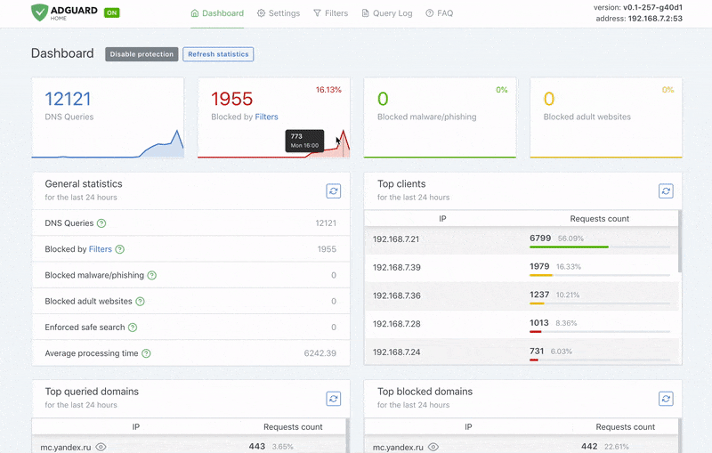
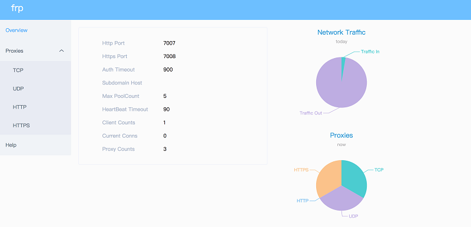

# Versionshinweise

## Juni 2021 (Version 7.3)

### &Uuml;berblick

Willkommen zur **Ver&ouml;ffentlichung vom Juni 2021** :octicons-heart-16: von **DietPi**. Es enth&auml;lt 6 neue Softwaretitel, die verschiedene Bereiche abdecken, wie Sicherheit, Medienverwaltung, Multiroom-Audiol&ouml;sung oder eine leichtgewichtige Kubernetes-Distribution, die speziell f&uuml;r IoT- und Edge-Computing entwickelt wurde.

### Neue Softwaretitel {: #new-software-in-73 }

- [**AdGuard Home**](../../software/dns_servers/#adguard-home)

    AdGuard Home ist eine netzwerkweite Software zum Blockieren von Werbung und Tracking, &auml;hnlich wie [Pi-hole](../../software/dns_servers/#pi-hole), die bereits von DietPi unterst&uuml;tzt wird.

    Es deckt alle Ihre Ger&auml;te ab, und Sie ben&ouml;tigen daf&uuml;r keine clientseitige Software. Besonders mit dem Aufkommen von Internet-of-Things und vernetzten Ger&auml;ten wird es immer wichtiger, Ihr gesamtes Netzwerk kontrollieren zu k&ouml;nnen.

    {: width="500" loading="lazy"}

    Jetzt verf&uuml;gbar zur Installation mit [`dietpi-software`](../../dietpi_tools/#dietpi-software) oder direkt mit der Software-ID `126`.

- [**Beets**](../../software/media/#beets)

    {: width="144" height="144" loading="lazy"}

    **Beets** ist ein Befehlszeilen-Mediathekverwaltungssystem f&uuml;r Musikfreaks. Es ist als Bibliothek konzipiert und kann fast alles tun, was Sie sich f&uuml;r Ihre Musiksammlung vorstellen k&ouml;nnen.

    Wie auf der offiziellen Website angegeben, _ist der Zweck von **Beets**, Ihre Musiksammlung ein f&uuml;r alle Mal richtig zu machen_.

    Jetzt verf&uuml;gbar zur Installation mit [`dietpi-software`](../../dietpi_tools/#dietpi-software) oder direkt mit der Software-ID `190`.

- [**frp**](../../software/advanced_networking/#frp)

    {: width="500" loading="lazy"}

    **frp** ist ein schneller Reverse-Proxy, der Ihnen hilft, einen lokalen Server hinter einem NAT oder einer Firewall dem Internet auszusetzen.

    Jetzt verf&uuml;gbar zur Installation mit [`dietpi-software`](../../dietpi_tools/#dietpi-software) oder direkt mit der Software-ID `171`.

- [**Snapcast-Server**](../../software/media/#snapcast-server) & [**Snapcast-Client**](../../software/media/#snapcast-client)

    {: width="300" height="48" loading="lazy"}

    **Snapcast** zentralisiert die &Uuml;bertragung von Audiostreams und &uuml;bernimmt das Senden von Audiostreams an drahtlose Empf&auml;nger, wodurch ein **drahtloses Multiroom-Lautsprechersystem** entsteht.

    Mit Snapcast k&ouml;nnen sich viele verschiedene Clients mit demselben Server verbinden, um dasselbe Audio zu streamen. Sie k&ouml;nnen Lautsprecher gruppieren und die Latenz f&uuml;r jeden Lautsprecher anpassen.

    Jetzt verf&uuml;gbar zur Installation mit [`dietpi-software`](../../dietpi_tools/#dietpi-software) oder direkt mit den Software-IDs `191` und `192`. Vielen Dank an @foxy82 f&uuml;r die Implementierung dieser Softwaretitel: <https://github.com/MichaIng/DietPi/pull/4465>

- [**K3s**](../../software/system_stats/#k3s)

    {: width="300" height="116" loading="lazy"}

    **K3s** hat alle erforderlichen Kubernetes-Teile, einschlie&szlig;lich Abh&auml;ngigkeiten, in einer einzigen Bin&auml;rdatei zusammengestellt. W&auml;hrend es Tools und Distributionen gibt, die bei der Installation der Kubernetes-spezifischen Komponenten eines Clusters helfen, ist der Wert einer einzelnen Bin&auml;rdatei f&uuml;r Edge-Anwendungsf&auml;lle klar: Vereinfacht sowohl die einfache Installation, den Laufzeitbetrieb als auch die Wartung von Kubernetes.

    **K3s** ist Kubernetes, verpackt in einen einfachen Launcher, der einen Gro&szlig;teil der Komplexit&auml;t von TLS und Optionen f&uuml;r die eingebetteten Bin&auml;rdateien handhabt. Es macht die Container-Orchestrierung im Wesentlichen einfacher zu installieren, auszuf&uuml;hren oder zu betreiben.

    Jetzt verf&uuml;gbar zur Installation mit [`dietpi-software`](../../dietpi_tools/#dietpi-software) oder direkt mit den Software-IDs `193`. Vielen Dank an @mortenlj f&uuml;r die Implementierung dieses Softwaretitels: <https://github.com/MichaIng/DietPi/pull/4476>

### DietPi Tools (neue / bemerkenswerte Updates) {: #dietpi-tools-73 }

- **DietPi-Automation** :octicons-arrow-right-16: Eine neue `dietpi.txt`-Einstellung wurde hinzugef&uuml;gt - `AUTO_SETUP_DHCP_TO_STATIC`. Wenn es aktiviert ist

    ```sh
    AUTO_SETUP_DHCP_TO_STATIC=1
    ```

    DHCP-gemietete Netzwerkeinstellungen werden w&auml;hrend der Ersteinrichtung automatisch als statische Netzwerkeinstellungen angewendet. Dies funktioniert auch mit &auml;lteren Bildern, indem die obige Einstellung in `dietpi.txt` hinzugef&uuml;gt wird.

- [**DietPi-Drive_Manager**](../../dietpi_tools/#dietpi-drive-manager) :octicons-arrow-right-16: Behebung eines Problems, bei dem Netzwerklaufwerke als physische Laufwerke erkannt wurden (v7.2 R&uuml;ckfall). Vielen Dank an @maartenlangeveld f&uuml;r die Meldung dieses Problems: <https://github.com/MichaIng/DietPi/issues/4479>

- [**DietPi-Software**](../../dietpi_tools/#dietpi-software) :octicons-arrow-right-16: Es wurde ein Problem behoben, bei dem mit

    ```sh
    AUTO_SETUP_AUTOMATED=1
    ```

    Der OpenSSH-Client wurde immer beim ersten Booten installiert, auch wenn er nicht angefordert wurde.

- [**DietPi-Backup**](../../dietpi_tools/#dietpi-backup-backuprestore) :octicons-arrow-right-16: Das Einschlie&szlig;en/Ausschlie&szlig;en-Filter-Handling wurde &uuml;berarbeitet. `/mnt` (`dietpi_userdata`) und `/media`-bezogene Regeln werden jetzt &uuml;ber die bearbeitbare benutzerdefinierte Filterdatei hinzugef&uuml;gt, was Benutzern mehr Kontrolle &uuml;ber diese gibt. Insbesondere erlaubt es, andere Einh&auml;ngepunkte unterhalb von `/mnt` einzuf&uuml;gen, also externe `dietpi_userdata`, was zuvor aufgrund der Reihenfolge, in der diese Filterregeln angewendet werden, unm&ouml;glich war.

- [**DietPi-JustBoom**](../../dietpi_tools/#dietpi-justboom) :octicons-arrow-right-16: Es wurde ein Problem behoben, bei dem der Equalizer immer als "Aus" angezeigt wurde, selbst wenn er es war gerade oder zuvor aktiviert (v7.2-Regression). Vielen Dank an [phpBB:shao](https://dietpi.com/phpbb/memberlist.php?username=shao){: class="nospellcheck"} f&uuml;r die Meldung dieses Problems: [ALSA-Equalizer funktioniert nicht](https://dietpi.com/phpbb/viewtopic.php?p=35072#p35072)

- [**DietPi-VPN**](../../dietpi_tools/#dietpi-vpn) :octicons-arrow-right-16: Der Killswitch wurde angepasst, um eingehende SSH-Verbindungen zuzulassen. Vielen Dank an @yslupdates f&uuml;r diese Anfrage: <https://github.com/MichaIng/DietPi/issues/4447>

- [**DietPi-Config**](../../dietpi_tools/#dietpi-configuration) :octicons-arrow-right-16: Unterst&uuml;tzung f&uuml;r das Allo Boss2 DAC OLED-Display wurde zu den **Anzeigeoptionen hinzugef&uuml;gt ** > Men&uuml; **LCD/OLED-Panel-Addon**. Wenn Sie den Allo Boss2 DAC als Soundkarte ausw&auml;hlen, werden Sie gefragt, ob Sie auch das OLED-Display aktivieren m&ouml;chten.

### Verbesserungen {: #changes-73 }

- [DietPi-Software | **Cuberite**](../../software/gaming/#cuberite) :octicons-arrow-right-16: Dies wurde f&uuml;r ARMv8-Systeme aktiviert, wo die verf&uuml;gbaren ARMv7-Bin&auml;rdateien problemlos funktionieren.
- [DietPi-Software | **Allo Web UI**](https://dietpi.com/phpbb/viewtopic.php?t=2317) :octicons-arrow-right-16: Aktualisiert auf v13.3, das Unterst&uuml;tzung f&uuml;r den Allo Boss2 DAC und behebt ein Problem, bei dem der Squeezelite-Dienst nicht gesteuert werden konnte, da sich der Dienstpfad ge&auml;ndert hat. Alle Credits gehen an Allo f&uuml;r die Implementierung dieser &Auml;nderungen.

### Fehlerbehebungen {: #bug-fixes-73 }

- [DietPi-Software | **Node-RED**](../../software/hardware_projects/#node-red) :octicons-arrow-right-16: Es wurde ein Problem behoben, bei dem versucht wurde, das Python 3 RPi.GPIO-Modul als zu installieren Abh&auml;ngigkeit von Nicht-RPi-Ger&auml;ten (v7.2-Regression). Vielen Dank an @TheAdminFrmoHell f&uuml;r die Meldung dieses Problems: <https://github.com/MichaIng/DietPi/issues/4478>
- [DietPi-Software | **PI-SPC**](../../software/hardware_projects/#audiophonics-pi-spc) :octicons-arrow-right-16: Es wurde ein Syntaxfehler in der Shutdown-Skriptschleife behoben. Vielen Dank an @renaudlarzilliere f&uuml;r die Meldung dieses Problems: <https://github.com/MichaIng/DietPi/issues/4488>

### Entfernte Software {: #removed-software-73 }

- **Tomcat 8** :octicons-arrow-right-16: Tomcat Version 8 ist nur bis Debian Stretch verf&uuml;gbar, ab Buster und neueren Versionen wird es [**Tomcat 9**](../../software/webserver_stack/#tomcat). Es gibt keine vern&uuml;nftige Konfiguration, die `DietPi-Software` zus&auml;tzlich zur Installation des APT-Pakets durchf&uuml;hren kann, was einfach manuell durchgef&uuml;hrt werden kann, indem der n&auml;chste Befehl ausgef&uuml;hrt wird:

    ```sh
    apt install tomcat9
    ```

    Die Softwareoption `Tomcat` wird daher aus der `DietPi-Software` zugunsten einer manuellen Paketinstallation entfernt.

Wie immer wurden viele kleinere Codeleistungs- und Stabilit&auml;tsverbesserungen sowie visuelle und Rechtschreibkorrekturen vorgenommen, zu viel, um sie alle hier aufzulisten. Sehen Sie sich alle Code&auml;nderungen dieser Version auf GitHub an: <https://github.com/MichaIng/DietPi/pull/4515>
