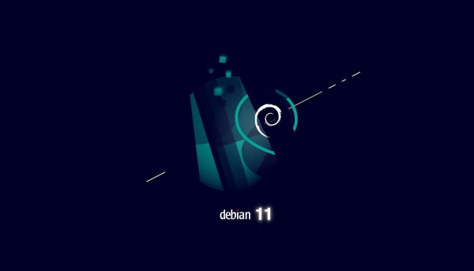

# Versionshinweise

## August 2021 (Version 7.5)

### Ü;berblick

Willkommen zur **Ver&ouml;ffentlichung vom August 2021** :octicons-heart-16: von **DietPi**. Diese Ver&ouml;ffentlichung konzentrierte sich darauf, die Unterstützung für die neueste Ver&ouml;ffentlichung des Debian-Betriebssystems zu verbessern.

{: width="600" height="343" loading="lazy"}

### Debian 11 (Codename _Bullseye_)

Die neue Version Debian 11, Codename `Bullseye`, wurde am 14. August 2021 ver&ouml;ffentlicht. Jede Debian-Ver&ouml;ffentlichung ist eine gro&szlig;e Sache, mit Unterstützung von seiner gro&szlig;en Benutzergemeinschaft. Debian ist auch das Kernbetriebssystem für andere Linux-Distributionen wie Ubuntu von Canonical, DietPi, Raspberry Pi OS oder Armbian.

DietPi-Images für Raspberry Pi (basierend auf Debian 11 Release) und native PCs stehen bereits zum Download bereit. Alle anderen DietPi-Images werden in Kürze auf Bullseye migriert. Lesen Sie unseren Blogbeitrag darüber, welche Vorteile Bullseye bringt und wie Sie Ihr System aktualisieren k&ouml;nnen: <https://dietpi.com/blog/?p=811>

### Neuer Softwaretitel {: #new-software-75 }

- **Java JRE** :octicons-arrow-right-16: Die OpenJDK JRE (Java Runtime Environment) wurde als dedizierte Softwareoption verfügbar gemacht. Jetzt verfügbar zur Installation mit [`dietpi-software`](../../dietpi_tools/#dietpi-software) oder direkt mit der Software-ID `196`.

### DietPi Tools (neue / bemerkenswerte Updates) {: #dietpi-tools-75 }

- **DietPi-Globals** :octicons-arrow-right-16: Eine neue globale Funktion G_GET_WAN_IP wurde hinzugefügt, um die &ouml;ffentliche IP und Standortinformationen zu drucken. Diese Funktion wird jetzt von DietPi-Banner und DietPi-VPN verwendet, um die &ouml;ffentliche IP anzuzeigen. Es nutzt die &ouml;ffentliche API unter `freegeoip.app`, die wie alle &ouml;ffentlichen APIs auch von Malware verwendet werden kann und daher in &ouml;ffentlichen Sperrlisten vorhanden sein kann. Ob dies der Fall ist, prüft die Funktion über den Exit-Code von curl und gibt gegebenenfalls eine aussagekräftige Fehlermeldung aus. Vielen Dank an @cocoflan für die Meldung eines ähnlichen Falls: <https://github.com/MichaIng/DietPi/issues/4445>
- **DietPi-FirstBoot** :octicons-arrow-right-16: Auf unseren x86_64-BIOS-Images ist der GRUB-Bootloader so konfiguriert, dass er sich selbst beim Upgrade auf das Laufwerk `/dev/sda` installiert, das das am häufigsten verwendete System ist Laufwerkspfad und es gibt keine M&ouml;glichkeit, eine eindeutige Kennung zu konfigurieren, die mit Sicherheit mit dem späteren tatsächlichen Systemlaufwerk übereinstimmt. Wenn GRUB aktualisiert wird und der konfigurierte Laufwerkspfad nicht existiert oder GRUB Zweifel hat, dass es sich um das richtige Systemlaufwerk handelt, schlägt die Aktualisierung fehl. Wenn sich GRUB auf dem falschen Laufwerk installiert, stimmt die tatsächlich gebootete GRUB-Version nicht mit den GRUB-Dateien im Root-Dateisystem überein, was dazu führen kann, dass das System nicht mehr bootfähig ist. Um die Situation zu verbessern, erkennt DietPi beim ersten Start das scheinbare Systemlaufwerk und ändert die GRUB-Konfiguration entsprechend. Dies funktioniert bei allen unseren Images, aber beachten Sie, dass es bei benutzerdefinierten Images falsch sein kann: Im Allgemeinen ist es m&ouml;glich, den Bootloader auf einem Laufwerk zu installieren, aber das Root-Dateisystem auf einem anderen physischen Laufwerk zu speichern, und wir haben keine M&ouml;glichkeit, dies zuverlässig zu tun diesen Fall erkennen. Vielen Dank an @brianbloom für die Meldung des Problems: <https://github.com/MichaIng/DietPi/issues/4542>
- DietPi-Software | **Java** :octicons-arrow-right-16: Diese Installationsoption wurde nun in **JRE (Java Runtime Environment)** und **JDK (Java Development Kit)** aufgeteilt. Unsere in Java geschriebenen Softwareoptionen erfordern nur die Installation von JRE. Durch diese Auswahl sparen wir über 200 MB zusätzlichen JDK-bezogenen Speicherplatz. Für Entwickler bleibt die JDK-Installationsoption mit derselben Software-ID verfügbar.
- [DietPi-Software | Cuberite](../../software/gaming/#cuberite) :octicons-arrow-right-16: Die offizielle Binärdatei wurde auf ARMv6-Systemen (Raspberry Pi 1 und Zero) erneut angewendet. Da diese in der Vergangenheit ARMv6 nicht unterstützten, haben wir eine alte selbst gehostete Binärdatei installiert, aber jetzt kann die neueste offizielle verwendet werden. Vielen Dank an @tigerw, dass Sie uns über die Änderung informiert haben: <https://github.com/MichaIng/DietPi/issues/3664#issuecomment-901261614>
- [DietPi-Software | Lidarr](../../software/bittorrent/#lidarr) :octicons-arrow-right-16: Wo unterstützt (auf allen Plattformen au&szlig;er Raspberry Pi 1/Zero), wird jetzt der .NET-Core-Build-Build installiert, der macht die dedizierte Mono-Laufzeit obsolet und sollte im Allgemeinen besser funktionieren. Diese Migration wird während des DietPi-Updates automatisch angewendet, Ihre Einstellungen und Daten bleiben unberührt. Vielen Dank, dass Sie uns über diese m&ouml;gliche Verbesserung informiert haben: <https://github.com/MichaIng/DietPi/issues/4607>
- [DietPi-Software | PaperMC](../../software/gaming/#papermc) :octicons-arrow-right-16: Da Minecraft 1.17 Java 16 oder neuer erfordert, funktioniert es nicht mehr auf Debian-Versionen unter Bullseye und nicht auf ARMv6, mit die von uns ausgelieferten Java-Builds und wurde daher für diese Systeme deaktiviert. AdoptOpenJDK ist derzeit dabei, ein neues APT-Repository zu erstellen, nach dem wir migrieren k&ouml;nnen, um die Unterstützung älterer Debian-Versionen wieder zu aktivieren. Auf ARMv6 werde ich jedoch h&ouml;chstwahrscheinlich nicht funktionieren, und der neueste gefundene Java-Build über Version 8, der auf ARMv6 ausgeführt wird, ist ein einzelner Zulu Java 11-Build.

### Fehlerbehebungen {: #fixes-75 }

- [DietPi-Software | **Blynk Server**](../../software/hardware_projects/#blynk-server) :octicons-arrow-right-16: Es wurde ein Problem behoben, bei dem die Installation fehlschlug, da das vorherige offizielle Repository von Blynk Inc. entfernt wurde Wir haben zu einem Fork gewechselt, der Stunden vor der Entfernung des Repositorys erstellt wurde, um die Installationsoption beizubehalten und Benutzer davor zu bewahren, die kommerziellen Cloud-Server verwenden zu müssen. Beachten Sie jedoch, dass es keine Garantie dafür gibt, dass die offiziellen Apps es noch lange unterstützen. Falls ältere Versionen der Apps verwendet werden müssen.
- [DietPi-Software | **Roon Extension Manager**](../../software/media/#roon-extension-manager) :octicons-arrow-right-16: Es wurde ein Problem behoben, bei dem das Installationsprogramm fehlschlug, wenn dietpi-Software mit sudo ausgeführt wurde als nicht privilegierter Benutzer. Das Installationsprogramm verwendet intern die SUDO_USER-Variable, um einige Aufgaben auszuführen, wodurch das Container-Start-Shell-Skript nicht heruntergeladen werden kann, da nur root in den Download-Speicherort schreiben kann. Vielen Dank an @Esad-np für die Meldung dieses Problems: <https://github.com/MichaIng/DietPi/issues/4462>
- DietPi-Software | **Java JRE** :octicons-arrow-right-16: Es wurde ein Problem behoben, bei dem die Installation auf ARMv6 fehlschlug: <https://github.com/MichaIng/DietPi/issues/4509#issuecomment-876413815>
- DietPi-Software | **Java JRE** :octicons-arrow-right-16: Es wurde ein Problem behoben, bei dem die Installation auf Raspbian Bullseye-Systemen fehlschlug, da Raspbian noch keine kompilierten Java 17-Pakete hat.
- [DietPi-Software | **VSCodium**](../../software/programming/#vscodium) :octicons-arrow-right-16: Fehlende Abhängigkeit von ALSA für Fälle hinzugefügt, in denen kein Desktop installiert ist und VSCodium als eigenständiger X-Server gestartet wird Sitzung. Vielen Dank an @Gill-Bates für die Meldung dieses Problems: <https://github.com/MichaIng/DietPi/issues/4610>
- [DietPi-Software | Bazarr](../../software/bittorrent/#bazarr) :octicons-arrow-right-16: Es wurde ein Problem behoben, bei dem die Installation fehlschlug, da Assets in ein eigenes Repository verschoben wurden, gebündelt mit jetzt ver&ouml;ffentlichten Downloads. Vielen Dank an @psi5asp für die Meldung dieses Problems: <https://github.com/MichaIng/DietPi/issues/4615>
- [DietPi-Software | phpSysInfo](../../software/system_stats/#phpsysinfo) :octicons-arrow-right-16: Es wurde ein Problem behoben, bei dem die Installation aufgrund einer geänderten Download-URL fehlschlug. Vielen Dank an [phpBB:robex](https://dietpi.com/phpbb/memberlist.php?username=robex){: class="nospellcheck"} für die Meldung dieses Problems: <https://dietpi.com/phpbb/viewtopic.php?t=9278>
- [DietPi-Software | LXDE](../../software/desktop/#lxde) :octicons-arrow-right-16: Es wurde ein Problem auf Raspberry Pi Bullseye-Systemen behoben, bei dem die Installation fehlschlug. Vielen Dank an @ravenclaw900 für die Meldung dieses Problems: <https://github.com/MichaIng/DietPi/issues/4555#issuecomment-898780672>
- [DietPi-Software | PiJuice](../../software/hardware_projects/#pijuice) :octicons-arrow-right-16: Es wurde ein Problem behoben, bei dem die Installation auf Bullseye-Systemen fehlschlug. Vielen Dank, dass Sie dieses Problem gemeldet haben: <https://github.com/MichaIng/DietPi/issues/4643>
- [DietPi-Software | LXQt](../../software/desktop/#lxqt) :octicons-arrow-right-16: Es wurde ein Problem behoben, bei dem die Installation auf Bullseye-Systemen fehlschlug. Vielen Dank an @LieDanG für die Meldung dieses Problems: <https://github.com/MichaIng/DietPi/issues/4656>
- [DietPi-Software | PaperMC](../../software/gaming/#papermc) :octicons-arrow-right-16: Es wurde ein Problem behoben, bei dem die Installation aufgrund fehlender Build-Abhängigkeiten fehlschlug.
- [DietPi-Software | ProFTPD](../../software/file_servers/#proftpd) :octicons-arrow-right-16: Es wurde ein Problem behoben, bei dem der Dienststart auf Bullseye-Systemen aufgrund eines ungültigen Konfigurationseintrags fehlschlug. Vielen Dank an @twikedk für die Meldung dieses Problems: <https://github.com/MichaIng/DietPi/issues/4666>
- [DietPi-Software | Kodi](../../software/media/#kodi) :octicons-arrow-right-16: Es wurde ein Problem behoben, bei dem die Installation auf ARMv6-Bullseye-Images fehlschlug, da weder Raspbian noch das Raspberry Pi-Repository noch ein Kodi-Paket enthalten . Wir versenden jetzt ein eigenes Paket. Vielen Dank an @sibofax für die Meldung dieses Problems: <https://github.com/MichaIng/DietPi/issues/4650>

Wie immer wurden viele kleinere Codeleistungs- und Stabilitätsverbesserungen sowie visuelle und Rechtschreibkorrekturen vorgenommen, zu viel, um sie alle hier aufzulisten. Sehen Sie sich alle Codeänderungen dieser Version auf GitHub an: <https://github.com/MichaIng/DietPi/pull/4668>
