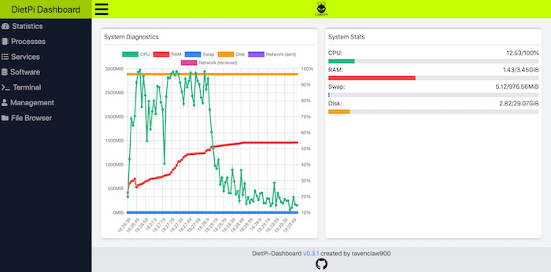
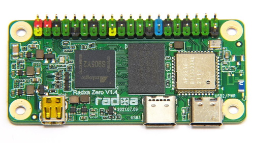
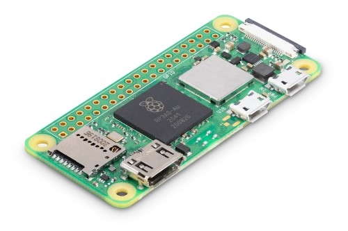
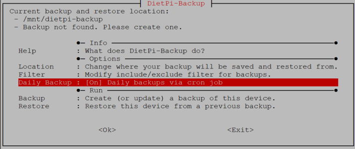
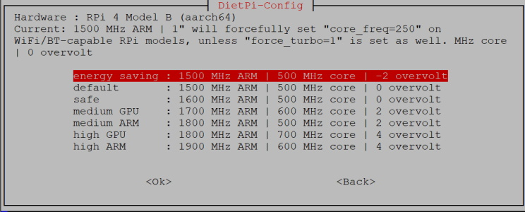

# Versionshinweise

## November 2021 (Version 7.8)

### &Uuml;berblick

Diese Version f&uuml;gt DietPi eine wesentliche Verbesserung hinzu und bietet unser eigenes offizielles DietPi-Dashboard, um Ihre DietPi-Installationen sowohl zu **&uuml;berwachen als auch zu verwalten**. Es bietet auch volle Unterst&uuml;tzung f&uuml;r die neuesten Produkteinf&uuml;hrungen: **Raspberry Pi Zero 2 W** und **Radxa Zero SBCs** – zwei leistungsstarke und ultrakleine SBC-Varianten!

### Neue Software {: #new-software-78 }

- [**DietPi-Dashboard**](../../software/system_stats/#dietpi-Dashboard)
Wir sind stolz darauf, die offizielle DietPi-Webschnittstelle zur &Uuml;berwachung und Verwaltung Ihres DietPi-Systems mit Ihrem Webbrowser anzuk&uuml;ndigen: octicons-heart-16:! Sie k&ouml;nnen verschiedene Statistiken sehen und sogar Befehle in der in die Webseite eingebetteten Konsole ausf&uuml;hren! Danke an die tolle Arbeit von @ravenclaw900!

{: width="700" height="346" loading="lazy"}

!!! Warnung "DietPi-Dashboard"

**Es befindet sich noch in der Betaphase**, da wir weitere Funktionen testen und nach und nach implementieren. Wir empfehlen daher noch nicht, in sensiblen Produktionssystemen aktiv zu verwenden.

Wir w&uuml;rden uns freuen, wenn Sie versuchen w&uuml;rden, es zu installieren, entweder mit der dietpi-Software oder mit dem Befehl in der Konsole:

`Sch
dietpi-software installieren 200
```

Bitte teilen Sie Ihr Feedback! Weitere Details finden Sie in der urspr&uuml;nglichen GitHub-Ausgabe: <https://github.com/MichaIng/DietPi/issues/448>

### Neue unterst&uuml;tzte SBCs {: #new-sbc-78 }

- [**Radxa Zero**](../../hardware/#radxa)
DietPi bietet Unterst&uuml;tzung f&uuml;r diesen winzigen Quad-Core-SBC. Es hat den gleichen Formfaktor wie Raspberry Pi Zero, ist aber viel leistungsf&auml;higer. Dieser SBC wurde DietPi mit der Hardware-ID `74` hinzugef&uuml;gt. Vielen Dank an @almirus und @dhry f&uuml;r die Hilfe beim Testen und Debuggen eines fr&uuml;hen Images: <https://github.com/MichaIng/DietPi/issues/4831>

{: width="500" height="281" loading="lazy"}

- [**Raspberry Pi Zero 2 W**](../../hardware/#raspberry-pi)
Der Raspberry Pi Zero 2 W bringt eine erh&ouml;hte Rechenleistung. Laut Raspberry sind Multithreading-Aufgaben bis zu f&uuml;nfmal schneller, was eine deutliche Steigerung darstellt, w&auml;hrend genau der gleiche Formfaktor beibehalten wird.

{: width="500" height="333" loading="lazy"}

Mit dieser Version wurde die anf&auml;ngliche DietPi-Unterst&uuml;tzung f&uuml;r diesen Raspberry Pi Zero / Zero W-Nachfolger hinzugef&uuml;gt. Es wird auch mit &Uuml;bertaktungsprofilen geliefert, die hilfreich sind, um eine noch bessere Leistung zu erzielen. Es verwendet die Hardware-ID `3` (gemeinsam mit RPi 3/3+, da diese Version denselben Prozessor wie das urspr&uuml;ngliche Raspberry Pi 3 hat).

Vielen Dank an [phpBB:CassTG](https://dietpi.com/phpbb/memberlist.php?username=CassTG){: class="nospellcheck"} f&uuml;r die Bereitstellung der fr&uuml;hen Hardwareinformationen und die Durchf&uuml;hrung intensiver &Uuml;bertaktungstests: <https: //dietpi.com/phpbb/viewtopic.php?t=9599>.

### Verbesserungen {: #verbesserungen-78 }

- [**DietPi-Backup**](../../dietpi_tools/#dietpi-backup-backuprestore)
- Eine Funktion wurde hinzugef&uuml;gt, um die t&auml;gliche Systemsicherung per Cron-Job zu erm&ouml;glichen. Vielen Dank an @Lycidias93 f&uuml;r den Vorschlag dieser Funktion: <https://github.com/MichaIng/DietPi/issues/3871>
{: width="713" height="300" loading="lazy"}

- `Rsync` / &Uuml;bertragungsprotokolle werden jetzt in `dietpi-backup.log` innerhalb des Backup-Verzeichnisses erstellt. So bleiben sie auch bei aktiviertem `DietPi-RAMlog` bestehen und k&ouml;nnen zu einem sp&auml;teren Zeitpunkt eingesehen werden. Dies ist besonders hilfreich, wenn t&auml;gliche Sicherungen per Cron-Job aktiviert sind, bei denen das Protokoll offensichtlich nicht direkt angezeigt wird, wenn die Sicherung abgeschlossen ist. Eine verwandte Option zum &Uuml;berpr&uuml;fen des letzten &Uuml;bertragungsprotokolls wurde dem Hauptmen&uuml; von dietpi-backup hinzugef&uuml;gt. Die alte Protokolldatei `/var/log/dietpi-backup.log` wird an den neuen Speicherort verschoben, wenn beim n&auml;chsten DietPi-Update ein Backup vorhanden ist.
- Bei Verwendung eines NFS-Mounts als Sicherungsziel wird nun &uuml;berpr&uuml;ft, ob die NFS-Freigabe UNIX-Berechtigungen unterst&uuml;tzt, um die Erstellung einer fehlerhaften Systemsicherung von vornherein zu verhindern.

- [**DietPi-Config**](../../dietpi_tools/#dietpi-configuration)
- &Uuml;bertaktungsprofile f&uuml;r die meisten Raspberry Pi-Modelle wurden **aktualisiert**, um den effektiven 100-MHz-ARM/CPU-Frequenzschritten zu entsprechen, die von der aktuellen Firmware verwendet werden.
- Bei einigen Modellen wurde ein **Energiesparprofil** hinzugef&uuml;gt, das minimale und maximale Spannung etwas reduziert, wodurch der Energieverbrauch und die W&auml;rmeabgabe im Leerlauf und unter Last etwas reduziert werden.
{: width="744" height="300" loading="lazy"}
- Die Option, IPv4-Verbindungen zu bevorzugen, wenn IPv6 aktiviert ist, wurde entfernt: Dies funktionierte nur f&uuml;r APT und `wget`, w&auml;hrend zB `cURL` und ping nie von dieser Einstellung betroffen waren, was zu einem inkonsistenten Verhalten f&uuml;hrte. Wenn bei aktiviertem IPv6 Probleme auftreten, sollte es einfach deaktiviert werden, anstatt IPv4 nur f&uuml;r bestimmte Tools zu bevorzugen/zu erzwingen.

- [**DietPi-Drive_Manager**](../../dietpi_tools/#dietpi-drive-manager)
- Beim &Uuml;bertragen der DietPi-Benutzerdaten auf ein anderes Laufwerk wird nun gepr&uuml;ft, ob sich der Zielort innerhalb eines unterst&uuml;tzten Dateisystemtyps befindet, eines mit nativem Symlink und UNIX-Berechtigungsunterst&uuml;tzung. Das Gleiche geschieht bei Verwendung des CLI-Skripts `/boot/dietpi/func/dietpi-set_userdata`.
- Die &Uuml;bertragung des Root-Dateisystems wird jetzt auf Odroid C4/HC4-Modellen unterst&uuml;tzt.
- Die Option zum &Uuml;bertragen des Root-Dateisystems wird nun auch angezeigt, wenn das Laufwerk kein Dateisystem enth&auml;lt. Der Prozess impliziert sowieso eine Formatierung mit einem unterst&uuml;tzten Dateisystem, wodurch die Bedingung obsolet wird. Au&szlig;erdem ist es nicht mehr erforderlich, das Dateisystem zuerst manuell auszuh&auml;ngen, da dies automatisch vor dem Formatieren erfolgt. Im zugeh&ouml;rigen Formatmen&uuml; werden nur unterst&uuml;tzte Dateisysteme aufgelistet, also ext4 und zus&auml;tzlich F2FS auf dem Raspberry Pi. Das Eingabefeld zur Eingabe eines benutzerdefinierten Einh&auml;ngepunkts entf&auml;llt, da es nur vor&uuml;bergehend verwendet wird, bis die &Uuml;bertragung des Root-Dateisystems abgeschlossen ist. Die Auslagerungsdatei wird nicht mehr deaktiviert, da sie ohne Probleme kopiert und unver&auml;ndert auf dem neuen Root-Dateisystem wiederverwendet werden kann.
- Beim &Uuml;bertragen des Root-Dateisystems werden weitere Pr&uuml;fungen durchgef&uuml;hrt: Es muss eine dedizierte Boot-Partition vorhanden sein (erforderlich auf Raspberry Pi und standardm&auml;&szlig;ig auf unseren aktuellen Odroid-Images), da dies die &Uuml;bertragungsschritte erwarten und der einzige Grund f&uuml;r das Verschieben nur der Root-Dateisystem, anstatt das gesamte Laufwerk zu klonen oder das DietPi-Image &uuml;berhaupt auf ein externes Laufwerk zu flashen. Die erwarteten Boot-/Kernel-Konfigurationsdateien m&uuml;ssen vorhanden sein, damit der Kernel angewiesen werden kann, das neue Root-Dateisystem einzuh&auml;ngen. Die DietPi-Benutzerdaten d&uuml;rfen sich derzeit nicht auf der Zielpartition befinden, da diese formatiert w&uuml;rden und somit alle Daten verloren gingen.
- Auf ext4-Dateisystemen wird jetzt der Prozentsatz der reservierten Bl&ouml;cke angezeigt und kann auch ge&auml;ndert werden, wenn das Laufwerk derzeit nicht gemountet ist.

- [**DietPi-RAMlog**](../../software/log_system/#dietpi-ramlog) :octicons-arrow-right-16: Die `/var/log`-Verzeichnisstruktur wird jetzt mit der persistenten Festplattenspeicher nach Softwareinstallationen und &uuml;ber t&auml;gliche Cron-Jobs, um fehlende Protokolldateien oder Verzeichnisse bei unsauberem Herunterfahren zu verhindern, was normalerweise zu fehlgeschlagenen Dienststarts f&uuml;hrt.
- [DietPi-Software | **Roon Server**](../../software/media/#roon-server) :octicons-arrow-right-16: Unterst&uuml;tzung f&uuml;r die neue .NET-Core-basierte Version hinzugef&uuml;gt, die am 3 Es wird erwartet, dass die Leistung im Vergleich zur alten Mono-basierten Version verbessert wurde. Um ein altes Problem mit unserer Roon-Server-Implementierung (siehe unten) zu beheben, wird w&auml;hrend des DietPi-Updates eine Neuinstallation durchgef&uuml;hrt, die auch die .NET-Core-Abh&auml;ngigkeiten mit einbezieht. Dies wird jedoch NICHT die Roon Server-Version aktualisieren, um Probleme mit m&ouml;glicherweise erforderlichen Migrationsschritten zu vermeiden. Verwenden Sie nach dem Update von DietPi den internen Updater von Roon, um von der neuen Version zu profitieren.

### Fehlerbehebungen {: #bug-fixes-78 }

- [**Raspberry Pi**](../../hardware/#raspberry-pi) :octicons-arrow-right-16: Umgehung eines Problems auf Raspberry Pi ARMv6/7 Bullseye-Systemen, bei dem einige Software nicht gestartet werden konnte , zB RealVNC, wenn Bin&auml;rdateien gegen eine &auml;ltere `libraspberrypi0`-Version mit anderen gemeinsam genutzten Bibliotheksnamen kompiliert wurden.
- [**DietPi-Drive_Manager**](../../dietpi_tools/#dietpi-drive-manager) :octicons-arrow-right-16: Es wurde ein Problem behoben, bei dem die Gr&ouml;&szlig;en&auml;nderung von F2FS-Dateisystemen fehlschlug, wenn sie aktuell gemountet waren. Im Gegensatz zu den Dokumenten und der Fehlerausgabe reicht es nicht aus, das Dateisystem schreibgesch&uuml;tzt zu mounten, sondern es muss stattdessen ausgeh&auml;ngt werden, was jetzt vor der Gr&ouml;&szlig;en&auml;nderung automatisch erfolgt und danach wieder eingeh&auml;ngt wird.
- [**DietPi-Drive_Manager**](../../dietpi_tools/#dietpi-drive-manager) :octicons-arrow-right-16: Es wurde ein Problem behoben, bei dem die Gr&ouml;&szlig;en&auml;nderung von ext4-Dateisystemen fehlschlagen konnte, wenn sie derzeit nicht gemountet waren. Insbesondere wenn das Laufwerk neu angeschlossen wird, muss ein vollst&auml;ndiges `fsck` einmal durchgef&uuml;hrt werden, bevor die Gr&ouml;&szlig;e ge&auml;ndert werden kann. Dies geschieht jetzt automatisch, sodass Dateisystemfehler interaktiv behoben werden k&ouml;nnen, bevor die Gr&ouml;&szlig;e eines Offline-ext4-Dateisystems ge&auml;ndert wird.
- [**DietPi-Config**](../../dietpi_tools/#dietpi-configuration) :octicons-arrow-right-16: Es wurde ein Problem behoben, bei dem &Uuml;bertaktungsprofile f&uuml;r Raspberry Pi 4 auf Raspberry Pi 400 angeboten wurden. A Neue Profile wurden jetzt speziell f&uuml;r den Raspberry Pi 400 hinzugef&uuml;gt.
- [DietPi-Software | **IceCast**](../../software/media/#icecast) :octicons-arrow-right-16: Es wurde ein Problem behoben, bei dem eine Neuinstallation aufgrund eines versuchten Vorgangs an einer nicht vorhandenen Datei fehlschlug. Vielen Dank an @killtux f&uuml;r die Meldung dieses Problems: <https://github.com/MichaIng/DietPi/issues/4858>
- [DietPi-Software | **Logitech Media Server**](../../software/media/#logitech-media-server) :octicons-arrow-right-16: Es wurde ein Problem behoben, bei dem die Deinstallation fehlschlug, als das Skript `postinst` des Pakets versuchte um den Dienstbenutzer zu entfernen, bevor der Dienst beendet wurde.
- [DietPi-Software | **Roon Server**](../../software/media/#roon-server) :octicons-arrow-right-16: Es wurde ein Problem behoben, bei dem der interne Updater alle Daten und Konfigurationen von Roon Server gel&ouml;scht hat, da die Daten Verzeichnis befand sich innerhalb des Installationsverzeichnisses. Roon Server wird nun nach `/opt/roonserver` installiert, w&auml;hrend das Datenverzeichnis unter `/mnt/dietpi_userdata/roonserver` verbleibt. Diese &Auml;nderung wird auch &uuml;ber das DietPi-Update angewendet, Ihre Daten und Konfigurationen bleiben unber&uuml;hrt. Vielen Dank an @JanKoudijs f&uuml;r die Meldung dieses Problems und die Bereitstellung einer L&ouml;sung: <https://github.com/MichaIng/DietPi/pull/4897>
- [DietPi-Software | **LXDE**](../../software/desktop/#lxde) :octicons-arrow-right-16: Es wurde ein Problem behoben, bei dem in einigen F&auml;llen beim ersten Desktop-Start Desktop-Symbole fehlten, und ein weiteres Problem bei Bullseye Systemen, bei denen beim Desktop-Start die Fehlermeldung `No session for pid` auftauchte. Vielen Dank an @kerryland f&uuml;r das Melden dieser Probleme: <https://github.com/MichaIng/DietPi/issues/4914>
- [DietPi-Software | **LXDE**](../../software/desktop/#lxde) :octicons-arrow-right-16: Es wurde ein Problem behoben, bei dem das Firefox-Browser-Bedienfeldsymbol vorhanden war, selbst wenn kein Firefox installiert war. In diesem Fall wird nun entweder Chromium oder der Texteditor als Ersatz hinzugef&uuml;gt.
- [DietPi-Software | **Home Assistant**](../../software/home_automation/#home-assistant) :octicons-arrow-right-16: Es wurde ein Problem behoben, bei dem die Installation auf ARMv6/ARMv7 Bullseye-Systemen fehlschlug.
- [DietPi-Software | **Tor Relay**](../../software/distributed_projects/#tor-relay) :octicons-arrow-right-16: Diese Softwareoption wurde auf Stretch deaktiviert. Das vom Debian-Stretch-Repository gelieferte Tor-Paket ist zu alt, um die erforderlichen Protokolle des Tor-Netzwerks zu unterst&uuml;tzen, wenn ein Relay ausgef&uuml;hrt wird. Vielen Dank an @cptechnik f&uuml;r die Meldung dieses Problems: <https://github.com/MichaIng/DietPi/issues/4925>
- [DietPi-Software | **Deluge**](../../software/bittorrent/#deluge) :octicons-arrow-right-16: Es wurde ein Problem behoben, bei dem bei Neuinstallationen die Dienste aufgrund einer ung&uuml;ltigen Konfigurationsdateisyntax fehlschlugen. Vielen Dank an [phpBB:bookedirl](https://dietpi.com/phpbb/memberlist.php?username=bookedirl){: class="nospellcheck"} f&uuml;r die Meldung dieses Problems: <https://dietpi.com/phpbb /viewtopic.php?t=9553>
- [DietPi-Software | **Deluge**](../../software/bittorrent/#deluge) :octicons-arrow-right-16: Da das Paket von Raspbian Bullseye derzeit fehlschl&auml;gt, mussten wir Deluge f&uuml;r Raspberry Pi-Systeme mit ARMv6 Bullseye deaktivieren Bild. Der Fehler wurde den Raspbian-Maintainern gemeldet und wir hoffen auf eine Behebung bis zum n&auml;chsten DietPi-Release: <https://github.com/MichaIng/DietPi/issues/4944>
- [DietPi-Software | **Lighttpd**](../../software/webserver_stack/#lighttpd) :octicons-arrow-right-16: Es wurde ein Problem behoben, bei dem Neuinstallationen auf einem Bullseye-System mit verwendetem DietPi-LetsEncrypt f&auml;lschlicherweise eine SSL-Konfiguration aktivierten, die k&ouml;nnte den Dienststart verhindern.

Wie immer wurden viele kleinere Codeleistungs- und Stabilit&auml;tsverbesserungen sowie visuelle und Rechtschreibkorrekturen vorgenommen, zu viel, um sie alle hier aufzulisten. Sehen Sie sich alle Code&auml;nderungen dieser Version auf GitHub an: <https://github.com/MichaIng/DietPi/pull/4951>

### Entfernte Software {: #removed-software-78 }

- **Subsonic** :octicons-arrow-right-16: Da es nicht mehr weiterentwickelt wird und aufgrund von Shared-Library-Abh&auml;ngigkeiten nur mit Debian Stretch kompatibel ist, haben wir Subsonic aus der DietPi-Software entfernt. Mit Airsonic-Advanced stellen wir in K&uuml;rze eine gut gepflegte und Bullseye-kompatible Alternative zur Verf&uuml;gung. Wenn Sie derzeit Subsonic installiert haben, bleibt es bestehen. Wenn Sie es deinstallieren m&ouml;chten, folgen Sie den Anweisungen hier: <https://github.com/MichaIng/DietPi/pull/4895>
- **emonHub** :octicons-arrow-right-16: Da wir keine einzige gemeldete Installation haben, haben wir emonHub aus der DietPi-Software entfernt. Wenn Sie derzeit emonHub installiert haben, bleibt es bestehen. Wenn Sie es weiterhin verwenden und aktualisieren m&ouml;chten, werfen Sie einen Blick auf das offizielle Repository unter <https://github.com/openenergymonitor/emonhub>. Wenn Sie es deinstallieren m&ouml;chten, folgen Sie den Anweisungen hier: <https://github.com/MichaIng/DietPi/pull/4895>

### Unterst&uuml;tzter SBC entfernt {: #removed-SBC-78 }

- **Odroid N1** :octicons-arrow-right-16: Es gibt kein einziges gemeldetes DietPi Odroid N1-System, was Sinn macht, da dieses Modell nie wirklich ver&ouml;ffentlicht wurde. Nur eine kleine Anzahl von Entwicklerbeispielen schwimmt herum, es lohnt sich nicht, ein Image und einen dedizierten Code zu pflegen. Wenn es da drau&szlig;en nicht gemeldete Odroid N1 DietPi-Systeme gibt, werden sie beim DietPi-Update automatisch auf die generische Rockchip RK3399-Ger&auml;te-ID migriert.
