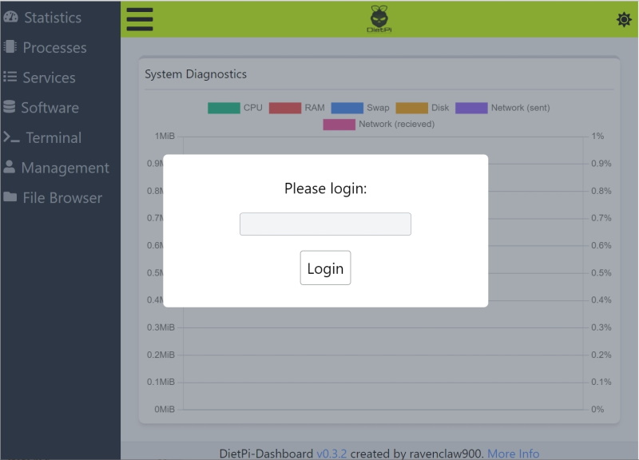
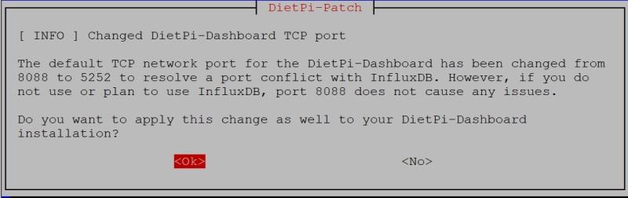

# Versionshinweise

## Dezember 2021 (Version 7.9)

### Ü;berblick

Willkommen zur **Ver&ouml;ffentlichung vom Dezember 2021** :octicons-heart-16: von **DietPi**. Es aktiviert den Passwortschutz für [**DietPi-Dashboard**](../../software/system_stats/#dietpi-dashboard), [**DietPi-Backup**](../../dietpi_tools/ #dietpi-backup-backuprestore) beginnt mehrere Backups zu unterstützen und der **[Apache](../../software/webserver_stack/#apache)** Webserver verwendet den dedizierten `PHP-FPM`-Server, was die Gesamtleistung verbessert. Und vieles mehr.

### Bekanntmachung

!!! Warnung `**Debian `Stretch`-Unterstützung**`

    Debian 9 `Stretch` wurde 2017 ver&ouml;ffentlicht und wurde zunächst von Debian 10 `Buster` und dann von Debian 11 `Bullseye` abgel&ouml;st.

    **DietPi v7.9 wird die letzte Version mit Unterstützung für Debian Stretch sein**. Die nächste Version wird **DietPi v8.0** sein und erfordert Debian Buster oder neuer.

    Lesen Sie unseren Artikel [**Warum Sie Ihr Stretch-System jetzt aktualisieren sollten**](https://dietpi.com/blog/?p=1001), um mehr über die Notwendigkeit dieses Upgrades zu erfahren und wie Sie dies ganz einfach tun k&ouml;nnen Debian Buster und noch weiter bis zur neuesten Version (**Debian Bullseye**).

### Verbesserungen {: #verbesserungen-79 }

- [**DietPi-Dashboard**](../../software/system_stats/#dietpi-Dashboard)
    - Bei Neuinstallationen ist der Passwortschutz jetzt standardmä&szlig;ig aktiviert und verwendet das **globale Softwarepasswort**.

        {: width="800" height="576" loading="lazy"}

        Sie k&ouml;nnen dies manuell anwenden oder ändern, indem Sie den Anweisungen in unserer [Dokumentation](../../software/system_stats/#dietpi-dashboard) folgen.

    - Der Standard-TCP-Netzwerkport wurde von `8088` auf `5252` geändert, um einen Portkonflikt mit InfluxDB zu l&ouml;sen. Wenn Sie DietPi-Dashboard bereits installiert haben, werden Sie gefragt, ob Sie diese Änderung während des Updates übernehmen m&ouml;chten.

        {: width="800" height="252" loading="lazy"}

        Vielen Dank an @blablazzz für die Meldung dieses Problems: <https://github.com/MichaIng/DietPi/issues/4966>

- [**DietPi-Backup**](../../dietpi_tools/#dietpi-backup-backuprestore)
    - Es kann jetzt ein Backup-Archiv mit einer wählbaren Anzahl von zu behaltenden Backups erstellt werden. Backups werden automatisch rotiert und wenn die maximale Menge erreicht ist, wird das älteste Backup als Grundlage für die inkrementelle neue Backup-Synchronisierung verwendet, um Schreibvorgänge zu reduzieren und die Geschwindigkeit zu erh&ouml;hen.

        {: width="800" height="265" loading="lazy"}

        Vielen Dank an [phpBB:johnvick](https://dietpi.com/phpbb/memberlist.php?username=johnvick){: class="nospellcheck"} und viele andere für die Anfrage nach dieser Funktion [im DietPi-Forum](https://dietpi.com/phpbb/viewtopic.php?t=3593).

    - Backups k&ouml;nnen jetzt au&szlig;erhalb von `/mnt` in jedem Verzeichnis oder Einhängepunkt gespeichert werden, solange das Dateisystem `symlinks` und UNIX-`Berechtigungen` unterstützt.
    – Es wurde ein Problem behoben, bei dem Sicherung und Wiederherstellung fehlschlugen, wenn ein nicht standardmä&szlig;iger Sicherungsspeicherort verwendet wurde, da ein falscher Protokolldateipfad verwendet wurde. Dies ist eine v7.8-Regression. Vielen Dank an [phpBB:Malinka](https://dietpi.com/phpbb/memberlist.php?username=Malinka){: class="nospellcheck"} für die Meldung dieses Problems [im DietPi-Forum](https://dietpi.com/phpbb/viewtopic.php?p=39909#p39909).

- [**Himbeer-Pi**](../../hardware/#raspberry-pi)
    - Seit Bullseye verwenden einige Mediensoftwaretitel, vor allem `FFmpeg` und solche, die `FFmpeg`-Bibliotheken verwenden, die für die Raspberry Pi-Firmware kompiliert wurden (**Kodi**, **Jellyfin**, **Chromium**), Verwendung die Raspberry Pi V4L2-Codec-Treiber. Diese wurden zuvor mit dem RPi-Kameramodulschalter in dietpi-config aktiviert/deaktiviert. Die Hardware-Codec-Treiber sind nun zu einem eigenen CLI-Befehl und Menüschalter in den Anzeigeoptionen der dietpi-config geworden und werden automatisch aktiviert, wenn einer der genannten Softwaretitel auf Bullseye (oder h&ouml;her) installiert oder neu installiert wird.

- **DietPi-Software** | **[SABnzbd](../../software/bittorrent/#sabnzbd)**
    - Bei Neuinstallationen wurde die Dateiprotokollierung zugunsten der Journalprotokollierung deaktiviert. Alle Dienst- und Prozessprotokolle k&ouml;nnen daher jetzt überprüft werden über: `journalctl -u sabnzbd`
    – Behebung eines Problems, bei dem Installationen auf ARMv6- und ARMv7-Stretch-Systemen fehlschlugen. Vielen Dank an @bensp für die Meldung dieses Problems: <https://github.com/MichaIng/DietPi/issues/4997>.

- **DietPi-Software** | **[Apache](../../software/webserver_stack/#apache)**
    - Neuinstallationen und Neuinstallationen werden mit `PHP-FPM` anstelle von `mod_php` konfiguriert. Als Voraussetzung wird statt Prefork das Event `MPM` verwendet. Dies reduziert die Speichernutzung und erh&ouml;ht die Zugriffsleistung bei gleichzeitigen Anfragen erheblich, da der Apache-Elternprozess nicht für jeden einzelnen Prozess einen neuen Kindprozess forken muss.
    - Es wird weiter optimiert, indem nur ein einziger statischer untergeordneter Prozess erzeugt wird, während gleichzeitige Anforderungen von einer ausreichenden Anzahl von Prozess-Threads verarbeitet werden. Dies erm&ouml;glicht Apache, Speicher effizient zu teilen und macht es ziemlich leicht. Es sind keine Nachteile bekannt, wenn nur ein einzelner Prozess verwendet wird, im Vergleich zu mehreren Prozessen mit jeweils weniger Threads. Weitere Informationen finden Sie in den verwandten Fragen und Antworten zu StackExchange: [StackExchange - Apache2 MPM event: More threads vs more processes?](https://superuser.com/questions/1611015/apache2-mpm-event-more-threads-vs-more-Prozesse)
    - Die Standard-/Basiskonfiguration wird jetzt als separate Datei hinzugefügt, sodass die Hauptdatei `apache2.conf` nicht mehr berührt wird. Au&szlig;erdem wird der standardmä&szlig;ige `vhost` jetzt vor der Paketinstallation vorab erstellt, sodass er bei einer Neuinstallation übersprungen werden kann, um benutzerdefinierte Einstellungen nicht zu überschreiben. Diese in Kombination erm&ouml;glichen eine sichere und saubere Neuinstallation, ohne vom Administrator vorgenommene Änderungen zu beschädigen, mit der kleinen Ausnahme, dass das Webroot auf `/var/www` gesetzt ist, was für alle unsere Softwareoptionen erforderlich ist, die einen externen Webserver verwenden.
    - Die neue Standardkonfiguration bietet maximale Datenschutzeinstellungen und Sicherheitsheader. Es ist einfach, diese mit eigenen Konfigurationen auf `vhost`- oder Verzeichnisebene zu überschreiben.
    - Die Protokollierung erfolgt jetzt standardmä&szlig;ig im Journal, und Sie k&ouml;nnen sie anzeigen, indem Sie den nächsten Befehl ausführen:

        ```sh
        journalctl -u apache2
        ```

    - Die Direktive `ServerName` wird mit der **lokalen IP** hinzugefügt, um entsprechende Startwarnungen stummzuschalten.
    Dies kann zu Zugriffs- und CORS-Fehlern führen, wenn Anwendungen den Servernamen als zulässigen Hostnamen prüfen, aber andere externe IPs/Hostnamen für den Zugriff verwendet wurden. In einem solchen Fall bieten Anwendungen im Allgemeinen eine M&ouml;glichkeit, eine Liste zulässiger Hostnamen zu definieren. Ohne einen festgelegten Servernamen wendet der Webserver normalerweise einfach den `HTTP_HOST`-Header an, der jede damit verbundene Ü;berprüfung umgeht. Laut der protokollierten Warnung scheint Apache dann `127.0.1.1` zu verwenden.

- **DietPi-Software** | [**Kodi**](../../software/media/#kodi)
    - Auf **Raspberry Pi Bullseye**-Systemen ist jetzt das neue offizielle **Raspberry Pi**-Repository-Build für Kodi 19.3 installiert. Sie k&ouml;nnen das Upgrade manuell anwenden, indem Sie Kodi neu installieren.

        ```sh
        dietpi-software reinstall 31
        ```

- Das Addon-Repository wird jetzt standardmä&szlig;ig bei allen Kodi-Installationen installiert, was zuvor nur bei RPi und Odroids der Fall war. Wenn es derzeit fehlt, kann es manuell installiert werden

        ```sh
        apt install kodi-repository-kodi
        ```

- **DietPi-Software** | [**Gitea**](../../software/cloud/#gitea)
    - Der Dienst läuft jetzt als dedizierter Benutzer `gitea` mit seinem Heimatverzeichnis `/mnt/dietpi_userdata/gitea`, um eine einfache Ü;bertragung und Verwendung von SSH-Schlüsseln für den Fernzugriff zu erm&ouml;glichen. Dies gilt für neu installierte oder neu installierte Gitea-Instanzen. Vielen Dank an @LilTrublMakr für die Meldung der damit verbundenen Einschränkung mit dem zuvor verwendeten `dietpi`-Benutzer: <https://github.com/MichaIng/DietPi/issues/4620>.
    - [**Gitea**](../../software/cloud/#gitea) und [**Gogs**](../../software/cloud/#gogs) kollidieren miteinander, da beide Verwenden Sie standardmä&szlig;ig den Port "3000". DietPi verwendet ein neues Konfliktmanagementsystem, um zu verhindern, dass beide gleichzeitig installiert werden.

- **DietPi-Software** | [**Chromium**](../../software/desktop/#chromium) :octicons-arrow-right-16: Auf Raspberry Pi wird nun das Paket `chromium-codecs-ffmpeg-extra` zusammen mit installiert Chromium, das zusätzliche Codecs für patentierte Video-/Audioformate hinzufügt. Vielen Dank an @Krawei für die Identifizierung dieser Chromium-Videowiedergabeverbesserung – siehe <https://github.com/MichaIng/DietPi/issues/5013>.

- **DietPi-Software** | [**rTorrent**](../../software/bittorrent/#rtorrent) :octicons-arrow-right-16: Bei Neuinstallationen lauscht rTorrent jetzt standardmä&szlig;ig auf **TCP-Port 49164** auf eingehende BitTorrent Verbindungen. Abgesehen von `DHT` war das Lauschen auf eingehende Verbindungen zuvor komplett deaktiviert, was je nach verwendetem Tracker zu langsamen oder gar keinen Peer-Verbindungen führte. Vielen Dank an @Camry2731 für die Meldung dieser Inkonsistenz mit unseren anderen BitTorrent-Serveroptionen.

- **DietPi-Software** - **Dateiserver** :octicons-arrow-right-16: Dieses Auswahlmenü wurde aus der DietPi-Software entfernt, da die meisten Dateiserver gleichzeitig laufen k&ouml;nnen. Somit ist es nicht mehr erforderlich, zuerst den bestehenden Dateiserver (zB einen Samba-Server) zu entfernen und dann etwas Neues (zB einen FTP-Server) zu installieren. Dadurch ist kein dedizierter Menüpunkt in der DietPi-Software notwendig.

    Dateiserver k&ouml;nnen über die Menüs `Browse Software` oder `Search Software` in `dietpi-software` oder über CLI ausgewählt werden. Siehe die Dokumentation für die verfügbaren [DietPi-Dateiserver](../../software/file_servers/).

    {: width="643" height="365" loading="lazy"}

    Die zugeh&ouml;rige `dietpi.txt`-Einstellung wurde auch für neue Bilder entfernt, aber sie wird immer noch berücksichtigt, wenn sie vorhanden ist. Verwenden Sie für eine automatische Installation mit neuen Images stattdessen die Einstellung `AUTO_SETUP_INSTALL_SOFTWARE_ID`.

- **DietPi-Dokumentation** | [**Anleitung**](../../usage/#how-to-do-an-automatic-base-installation-at-first-boot-dietpi-automation) :octicons-arrow-right-16 : Abschnitt hinzugefügt, der die **automatische Basisinstallation beim ersten Booten** über die Datei `/boot/dietpi.txt` (DietPi-Automation) beschreibt.

### Fehlerbehebungen {: #bug-fixes-79 }

- [**Raspberry Pi**](../../hardware/#raspberry-pi) :octicons-arrow-right-16: Es wurde ein Problem in den DietPi-Images behoben, bei dem beim ersten Booten zwei serielle Anmeldekonsolen auf dem generischen `symlinked` und tatsächliche serielle Geräte k&ouml;nnten gestartet worden sein. Dies verdoppelte die Eingaben und brach beim ersten Start die erfolgreiche Anmeldung mit `Benutzername` und `Passwort` über die serielle Konsole. Vielen Dank an @ad7718 für die Meldung dieses Problems: <https://github.com/MichaIng/DietPi/issues/5014>.
- [**DietPi-Config**](../../dietpi_tools/#dietpi-configuration)
    – Es wurde ein Problem behoben, bei dem die Aktivierung des LCD-Panels `odroid-lcd35` auf Odroids fehlschlug, da SPI standardmä&szlig;ig aktiviert ist und dieselben GPIO-Ports blockiert. Vielen Dank an @MarcProux für die Meldung dieses Problems <https://github.com/MichaIng/DietPi/issues/4154>.
    – Es wurde ein Problem behoben, bei dem das Netzwerkadaptermenü die statischen DNS-Server nicht angezeigt hat, die effektiv beim ersten Start basierend auf den Einstellungen von `dietpi.txt` angewendet wurden. Vielen Dank an @nils-trubkin für die Meldung dieses Problems <https://github.com/MichaIng/DietPi/issues/5054>.
- **DietPi-Software** :octicons-arrow-right-16: Eine DietPi v7.8-Regression behoben, bei der [ReadyMedia](../../software/media/#readymedia), [Deluge](../ ../software/bittorrent/#deluge), [Sonarr](../../software/bittorrent/#sonarr) und [Jellyfin](../../software/media/#jellyfin) Installationen schlugen mit einem fehl Fehler auf `usermod`, da die Dienste nicht zuerst gestoppt wurden. Dies wurde auch über Live-Patches für DietPi v7.8 geliebt.
- **DietPi-Software** | [**Transmission**](../../software/bittorrent/#transmission) :octicons-arrow-right-16: Es wurde eine v7.8-Regression behoben, bei der bei Neuinstallationen die beabsichtigte Konfiguration nicht bereitgestellt wurde. Vielen Dank an [phpBB:kannz](https://dietpi.com/phpbb/memberlist.php?username=kannz){: class="nospellcheck"} und [phpBB:alessandro.psrt](https://dietpi.com/phpbb/memberlist.php?username=alessandro.psrt){: class="nospellcheck"} für die Meldung dieses Problems im DietPi-Forum: ["Ü;bertragungseinstellungen?"](https://dietpi.com/phpbb/viewtopic.php?t=9567) oder ["Falsche `settings.json` im Ü;bertragungsdaemon"](https://dietpi.com/phpbb/viewtopic.php?t=9683).
- **DietPi-Software** | [**Deluge**](../../software/bittorrent/#deluge) :octicons-arrow-right-16: Umgehung eines Problems auf Raspberry Pi ARMv6-Userland-Systemen, bei dem der Dienst nicht gestartet werden konnte. _Deluge_ wurde daher für diese Systeme wieder aktiviert. Vielen Dank an @themagicbullet für die Bereitstellung der Problemumgehung: <https://github.com/MichaIng/DietPi/issues/4944>.
- **DietPi-Software** | **UnRAR** :octicons-arrow-right-16: Es wurde ein Problem auf Raspberry Pi 1 an Zero (1) behoben, bei dem eine inkompatible `unrar`-Binärdatei installiert war. `unrar-free` von Raspbian ist jetzt auf diesen Modellen installiert, aber beachten Sie, dass es nicht alle RAR-Formate vollständig unterstützt. Daher kann es in manchen Fällen fehlschlagen, Archive zu extrahieren.
- **DietPi-Software** | [**rTorrent**](../../software/bittorrent/#rtorrent) :octicons-arrow-right-16: Es wurde ein Problem behoben, bei dem der `/RPC2`-Proxy zum rTorrent-UNIX-Socket beim Apache-Webserver nicht funktionierte Arbeit wegen ungültiger Syntax. Vielen Dank an @Camry2731 für die Meldung dieses Problems.
- **DietPi-Software** | [**RealVNC**](../../software/remote_desktop/#realvnc-server) :octicons-arrow-right-16: Problemumgehung für einen fehlgeschlagenen ersten Start von RealVNC aufgrund einer gel&ouml;schten Passwortdatei aktualisiert/behoben . Vielen Dank an @xmicky für die Meldung dieses Problems <https://github.com/MichaIng/DietPi/issues/5050>.

Wie immer wurden viele kleinere Codeleistungs- und Stabilitätsverbesserungen sowie visuelle und Rechtschreibkorrekturen vorgenommen, zu viel, um sie alle hier aufzulisten. Sehen Sie sich alle Codeänderungen dieser Version auf GitHub an: <https://github.com/MichaIng/DietPi/issues/5019>

Für alle zusätzlichen Probleme, die nach der Ver&ouml;ffentlichung auftreten k&ouml;nnen, besuchen Sie bitte den folgenden Link für aktive Tickets: <https://github.com/MichaIng/DietPi/issues>.
