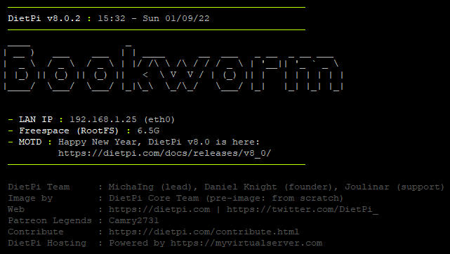

# Versionshinweise

## Januar 2022 (Version 8.0)

### &Uuml;berblick

**Januar 2022 Release von DietPi** entfernt die Unterst&uuml;tzung f&uuml;r Debian Stretch und bringt eine inkrementelle Verbesserung der gesamten Plattform.

{: width="447" height="281" loading="lazy"}

!!! zitiere "_Foto von Alicja, Pixabay_"

### Debian-Stretch-Unterst&uuml;tzung

Die Unterst&uuml;tzung f&uuml;r Debian Stretch wurde ab Version 8.0 entfernt. Diese &Auml;nderung erm&ouml;glichte uns eine umfassende Codebereinigung und Migration zu einigen neueren Methoden in verschiedenen Bereichen, die nur auf Buster und h&ouml;her verf&uuml;gbar sind.

!!! Warnung ""

Debian 9 `Stretch` wurde 2017 ver&ouml;ffentlicht und wurde zun&auml;chst von Debian 10 `Buster` und dann von Debian 11 `Bullseye` abgel&ouml;st.

DietPi v7.9 war die letzte Ver&ouml;ffentlichung mit Unterst&uuml;tzung f&uuml;r Debian Stretch. **DietPi v8.0** und h&ouml;her erfordern Debian Buster oder neuer.

Lesen Sie unseren Artikel [**Warum Sie Ihr Stretch-System jetzt aktualisieren sollten**] (https://dietpi.com/blog/?p=1001), um mehr &uuml;ber die Notwendigkeit dieses Upgrades zu erfahren und wie Sie dies ganz einfach tun k&ouml;nnen Debian Buster und noch weiter bis zur neuesten Version (**Debian Bullseye**).

### Verbesserungen

- **Netzwerk** :octicons-arrow-right-16: F&uuml;r neue Bilder wird das standardm&auml;&szlig;ige DHCP-Timeout nicht mehr auf 10 Sekunden reduziert. Dies k&ouml;nnte zu kurz gewesen sein, in diesem Fall werden Netzwerkziele der Boot-Sequenz erreicht, bevor tats&auml;chlich eine IP zugewiesen wurde. Insbesondere bei `AUTO_SETUP_AUTOMATED=1` konnte dies zu Verbindungstest-Timeouts und damit zum Abbruch des automatisierten Erstlaufaufbaus f&uuml;hren. Vielen Dank an @jpeg2600 f&uuml;r die Meldung eines solchen Falls: <https://github.com/MichaIng/DietPi/issues/5143>
- [**DietPi-Config**](../../dietpi_tools/#dietpi-configuration) :octicons-arrow-right-16: Beim Konfigurieren eines ersten WLAN-Slots &uuml;ber das Scannen nach SSIDs wird der WLAN-Adapter jetzt nicht &uuml;ber `ifup` aufgerufen, aber `ip l dev wlanX up`. Auf diese Weise werden keine DHCP- und WPA-Client-Starts ausgel&ouml;st, die zum Scheitern verurteilt sind, wenn der WLAN-Adapter noch mit keinem Access Point verbunden ist. Insbesondere bei dem standardm&auml;&szlig;igen DHCP-Timeout von 60 Sekunden w&uuml;rde dies sonst zu einer unn&ouml;tig langen Verz&ouml;gerung f&uuml;hren.
- [**DietPi-Dashboard**](../../software/system_stats/#dietpi-dashboard) :octicons-arrow-right-16: Option hinzugef&uuml;gt, um mehrere Dashboard-Knoten von einer Frontend-Weboberfl&auml;che aus anzuzeigen. In diesem Zusammenhang kann das Backend jetzt nur installiert werden, was die Speichernutzung reduziert und es unm&ouml;glich macht, au&szlig;erhalb der Backend-API manuell auf den Knoten zuzugreifen.
- **DietPi-Print_large** :octicons-arrow-right-16: Dieses neue Skript wurde hinzugef&uuml;gt, das ausgef&uuml;hrt oder von `/boot/dietpi/func/dietpi-print_large` bezogen werden kann, um die &uuml;ber das erste Argument &uuml;bergebene Zeichenfolge zu drucken in gro&szlig;en Schriftarten im `Figlet`-Stil. Es unterst&uuml;tzt derzeit nur die Zeichen az, AZ, 0-9, Punkt und Bindestrich, also die &uuml;blicherweise in Hostnamen erlaubten.
- [**DietPi-Banner**](../../dietpi_tools/#dietpi-banner) :octicons-arrow-right-16: Es wurde eine Option hinzugef&uuml;gt, um den Hostnamen des Systems in gro&szlig;en Schriftarten im `Figlet`-Stil zu drucken, rechts unter dem Banner-Header. Falls es ebenfalls aktiviert ist, wird die regul&auml;re/kleine Hostname-Zeile dann &uuml;bersprungen. Vielen Dank an @matelis f&uuml;r die Implementierung dieser Funktion: <https://github.com/MichaIng/DietPi/pull/5113>

{: width="641" height="362" loading="lazy"}

- **DietPi-Software** | **Mono** :octicons-arrow-right-16: `mono-complete` wird nicht mehr installiert, sondern nur noch `mono-devel`. Dadurch wird der Webserverdienst `XSP4` &uuml;bersprungen, der standardm&auml;&szlig;ig auf Port 8084 lauscht, wo er mit dem Dateibrowser in Konflikt ger&auml;t. Dies betrifft nur Neuinstallationen. Sie k&ouml;nnen diese &Auml;nderung manuell anwenden, indem Sie den n&auml;chsten Befehl ausf&uuml;hren:

`Sch
apt-mark manual mono-devel && apt --autoremove purge mono-complete
```

Vielen Dank an @jaguar489 f&uuml;r die Meldung dieses Problems: <https://github.com/MichaIng/DietPi/issues/5093>

- **DietPi-Software** | [**FuguHub**](../../software/cloud/#fuguhub) :octicons-arrow-right-16: Der veraltete offizielle Installer wurde durch ein vollautomatisiertes eigenes Setup ersetzt, das veraltete oder sogar sch&auml;dliche entfernt interaktive Dialoge. Bei Neuinstallationen wird auch ein Administratorkonto `dietpi` mit einem globalen Softwarepasswort erstellt.
- **DietPi-Software** | [**myMPD**](../../software/media/#mympd) :octicons-arrow-right-16: Die Installation erfolgt jetzt &uuml;ber das offizielle APT-Repository, was eine schnellere Installation im Vergleich zum Kompilieren aus dem Quellcode bedeutet, weniger Abh&auml;ngigkeiten und einfachere Updates &uuml;ber `apt upgrade`: <https://github.com/MichaIng/DietPi/issues/5115>
- **DietPi-Software** | [**Airsonic**](../../software/media/#airsonic) :octicons-arrow-right-16: Da das Projekt von seinem Betreuer archiviert wurde und unter der kritischen [Log4Shell](https: //dietpi.com/blog/?p=1172) Sicherheitsl&uuml;cke sind wir auf den beworbenen Fork `Airsonic-Advanced` umgezogen, der auch die Kompatibilit&auml;t mit Java 17 und damit Debian Bullseye erm&ouml;glicht. Airsonic wird im Rahmen des DietPi-Updates neu installiert, um die Migration anzuwenden. Alle Daten und Einstellungen bleiben erhalten und werden automatisch migriert.
- **DietPi-Bilder** | [**Parallels Desktop (macOS)**](../../hardware/#parallels-desktop) :octicons-arrow-right-16: Neues Image der virtuellen Maschine f&uuml;r Parallels Desktop unter macOS.

{: width="640" height="360" loading="lazy"}

### Fehlerbehebung

- [**Raspberry Pi**](../../hardware/#raspberry-pi) :octicons-arrow-right-16: Behebung eines Problems, bei dem unbeabsichtigt der Turbo-Modus aktiviert wurde. Dies wurde auf v7.9, auf unsere bestehenden RPi-Images und per Live-Patch zur&uuml;ckportiert. Vielen Dank an @ayo-x und @whyisthisbroken f&uuml;r die Meldung dieses Problems: <https://github.com/MichaIng/DietPi/issues/5088>
- **DietPi-FS_partition_resize** :octicons-arrow-right-16: Es wurde ein Problem behoben, bei dem in einigen F&auml;llen die Bootpartition beim ersten Booten nicht gemountet werden konnte, da das System nach der Gr&ouml;&szlig;en&auml;nderung der Partition in einigen F&auml;llen nicht gen&uuml;gend Zeit daf&uuml;r hatte Wenden Sie die &Auml;nderung vollst&auml;ndig an, bevor Sie mit dem Boot-Mount-Versuch fortfahren. Vielen Dank an @Mausy5043 und @sistemicorp f&uuml;r die Meldung dieses Problems: <https://github.com/MichaIng/DietPi/issues/5006>
- [**DietPi-Config**](../../dietpi_tools/#dietpi-configuration) :octicons-arrow-right-16: Es wurde ein Problem behoben, bei dem auf Raspberry Pi, wenn der vollst&auml;ndige KMS-Anzeigetreiber verwendet wird, die Soundkartenauswahl k&ouml;nnte f&auml;lschlicherweise &uuml;bernommen worden sein. Bei vollst&auml;ndig aktiviertem KMS erscheint f&uuml;r jeden HDMI-Anschluss eine zus&auml;tzliche HDMI-Soundkarte (anstelle des regul&auml;ren Firmware-HDMI-Soundger&auml;ts), selbst wenn kein HDMI-Ger&auml;t angeschlossen und das integrierte Audio deaktiviert ist. Dies f&uuml;hrte zu einem Anstieg der externen Soundkarten-Indizes. Das Erscheinungsbild der KMS HDMI-Soundkarten ist nun an die Onboard-Firmware der HDMI-Soundkarten angeglichen, dh wenn nicht onboard `auto` oder HDMI in `dietpi-config` ausgew&auml;hlt ist, werden jetzt auch die KMS-HDMI-Soundger&auml;te deaktiviert und verwenden des Overlay-Parameters "noaudio" des Ger&auml;tebaums.
- **DietPi-Software**
– Es wurde ein Problem behoben, bei dem beim ersten Start Auswahl- und Einstellungsmen&uuml;auswahlen einen Fehler ausl&ouml;sten, da die Installationsstatusdatei noch nicht existierte. Vielen Dank an @bsheeres f&uuml;r die Meldung dieses Problems: <https://github.com/MichaIng/DietPi/issues/5080>
- Es wurde ein Problem behoben, bei dem die veraltete Option "AUTO_SETUP_FILE_SERVER_INDEX" in der Datei "dietpi.txt" invertiert angewendet wurde. `-1` h&auml;tte [ProFTPD](../../software/file_servers/#proftpd) und `-2` Samba installieren sollen, w&auml;hrend es umgekehrt gemacht wurde. Beachten Sie jedoch, dass diese Einstellung bei aktuellen Images nicht vorhanden und veraltet ist. Verwenden Sie stattdessen `AUTO_SETUP_INSTALL_SOFTWARE_ID`, um einen oder mehrere Dateiserver f&uuml;r die automatische Installation zu markieren. Vielen Dank an @bsheeres f&uuml;r die Meldung dieses Problems: <https://github.com/MichaIng/DietPi/issues/5081>
- **Browser** - Auf den ARMv6-Raspberry-Pi-Modellen Raspberry Pi 1 und Zero (1) seit Bullseye, [Chromium](../../software/desktop/#chromium) und [Firefox](../. ./software/desktop/#firefox) k&ouml;nnen aufgrund von Hardware- und Build-Einschr&auml;nkungen, die au&szlig;erhalb unserer Kontrolle liegen, nicht gestartet werden. Da dies derzeit die einzigen beiden Browser sind, die von `dietpi-software` erh&auml;ltlich sind, wurden sie zusammen mit dem Browser-Einstellungsmen&uuml; f&uuml;r diese Systeme deaktiviert, bis wir einen guten zus&auml;tzlichen kompatiblen Browser gefunden und implementiert haben. Weitere Informationen: <https://github.com/RPi-Distro/chromium-browser/issues/21>.
- **DietPi-Software** | [**Kodi**](../../software/media/#kodi) :octicons-arrow-right-16: Es wurde ein Problem behoben, bei dem nachfolgende Kodi-Neuinstallationen Duplikate des `CMA`-Parameters f&uuml;r die KMS-Overlay-Einstellung erstellten in `config.txt`. Die Duplikate werden w&auml;hrend des DietPi-Updates ausgepatcht.
- **DietPi-Software** | [**Docker**](../../software/programming/#docker) :octicons-arrow-right-16: Es wurde ein Problem behoben, bei dem die Installation aufgrund einer falschen Pr&uuml;fung auf fehlende Kernel-Module abgebrochen wurde. Vielen Dank an @dragonandy f&uuml;r die Meldung dieses Problems: <https://github.com/MichaIng/DietPi/issues/5061>
- **DietPi-Software** | [**Pi-hole**](../../software/dns_servers/#pi-hole) :octicons-arrow-right-16: Es wurde ein Problem behoben, bei dem das Teleporter-Importprotokoll nicht angezeigt, aber vom X verweigert wurde -Frame-Options-Header: <https://discourse.pi-hole.net/t/unable-to-restore-teleporter-backup-fresh-install-no-funky-changes-made/51573>
- **DietPi-Software** | [**Blynk Server**](../../software/hardware_projects/#blynk-server) :octicons-arrow-right-16: Es wurde ein Problem bei ARMv6 RPi-Modellen behoben, bei dem die Installation als neueste Version von Blynk Server fehlschlug enth&auml;lt keinen Java 8-Build. Da der &auml;ltere Java 8-Build keine native Log4Shell-Schwachstellenminderung enth&auml;lt, wird er auf diesen Systemen serverweise hinzugef&uuml;gt.
- **DietPi-Software** | [**Mycroft AI**](../../software/hardware_projects/#mycroft-ai) :octicons-arrow-right-16: Es wurde ein Problem auf Bullseye-Systemen (und h&ouml;her) behoben, bei denen `mycroft-cli-client ` schl&auml;gt mit einem Berechtigungsproblem fehl, selbst als Root-Benutzer. Vielen Dank an @berndverhofstadt f&uuml;r die Meldung dieses Problems: <https://github.com/MichaIng/DietPi/issues/5100>
- **DietPi-Software** | [**Nukkit**](../../software/gaming/#nukkit) :octicons-arrow-right-16: Es wurde ein Problem behoben, bei dem die Installation aufgrund einer ge&auml;nderten Download-URL fehlschlug. Die Jenkins-Instanz ist nach `ci.opencollab.dev` umgezogen, wo auch die Geyser- und Floodgate-Projekte gehostet werden.
- **DietPi-Software** | [**FuguHub**](../../software/cloud/#fuguhub) :octicons-arrow-right-16: Es wurde ein Problem behoben, bei dem die Deinstallation fehlschlug, da der Prozess nicht wie beabsichtigt gestoppt wurde. Vielen Dank an @kd9352 f&uuml;r die Meldung dieses Problems: <https://github.com/MichaIng/DietPi/issues/5058>
- **DietPi-Software** | [**myMPD**](../../software/media/#mympd) :octicons-arrow-right-16: Es wurde ein Problem behoben, bei dem die Installation aufgrund einer aktualisierten Abh&auml;ngigkeit fehlschlug. Vielen Dank an @supersexy f&uuml;r die Meldung dieses Problems: <https://github.com/MichaIng/DietPi/issues/5115>
- **DietPi-Software** | [**Python 3**](../../software/programming/#python-3) :octicons-arrow-right-16: Umgehung eines Problems, bei dem die Neuinstallation von `pip` fehlschlug. Vielen Dank an @hueppinr f&uuml;r die Meldung dieses Problems: <https://github.com/MichaIng/DietPi/issues/5117>
- **DietPi-Software** | [**Unbound**](../../software/dns_servers/#unbound) :octicons-arrow-right-16: Es wurde ein Problem behoben, bei dem der Dienst `unbound-resolvconf` localhost automatisch als lokalen Nameserver anwendete, wenn das `resolvconf`-Paket wurde installiert. Da Unbound oft in Kombination mit Pi-hole oder AdGuard Home installiert wird und diese normalerweise nur von Netzwerkclients verwendet werden, nicht vom Server selbst, ist `unbound-resolvconf` jetzt bei Unbound-Installationen deaktiviert. Wenn Unbound auch als lokaler Resolver gew&uuml;nscht wird, sollte es explizit konfiguriert werden, zB &uuml;ber die Netzwerkoptionen von dietpi-config. Vielen Dank an @Ianszh f&uuml;r die Meldung dieses Problems: <https://github.com/MichaIng/DietPi/issues/5133>
- **DietPi-Software** | [**Mosquitto**](../../software/hardware_projects/#mosquitto) :octicons-arrow-right-16: Wendete eine Problemumgehung auf ARMv6 an, wo die neuesten Mosquitto-Pakete aus dem offiziellen APT-Repository nicht ARMv6-kompatibel sind . Vielen Dank an @thomasmockridge f&uuml;r die Meldung dieses Problems: <https://github.com/MichaIng/DietPi/issues/5140>

Wie immer wurden viele kleinere Codeleistungs- und Stabilit&auml;tsverbesserungen sowie visuelle und Rechtschreibkorrekturen vorgenommen, zu viel, um sie alle hier aufzulisten. Sehen Sie sich alle Code&auml;nderungen dieser Version auf GitHub an: <https://github.com/MichaIng/DietPi/issues/5137>

### Bekannte/ausstehende Probleme

- [**DietPi-Config**](../../dietpi_tools/#dietpi-configuration) :octicons-arrow-right-16: Das Aktivieren von WLAN- und Ethernet-Adaptern, beide in unterschiedlichen Subnetzen, unterbricht in einigen F&auml;llen die WLAN-Verbindung : <https://github.com/MichaIng/DietPi/issues/2103>

F&uuml;r alle zus&auml;tzlichen Probleme, die nach der Ver&ouml;ffentlichung auftreten k&ouml;nnen, besuchen Sie bitte den folgenden Link f&uuml;r aktive Tickets: <https://github.com/MichaIng/DietPi/issues>
