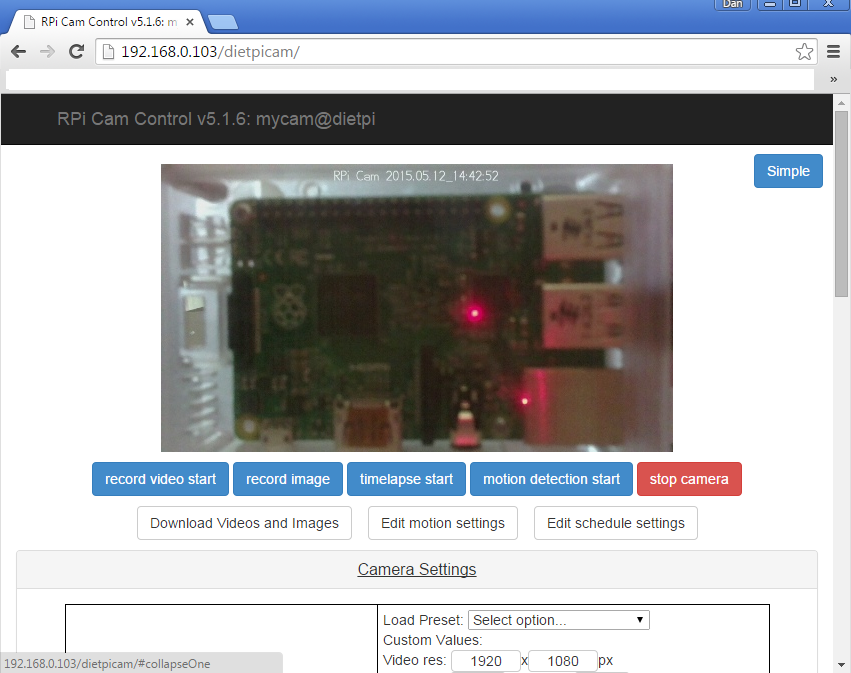
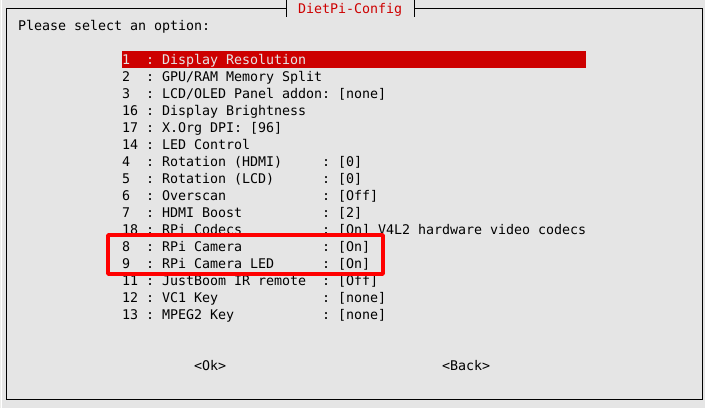
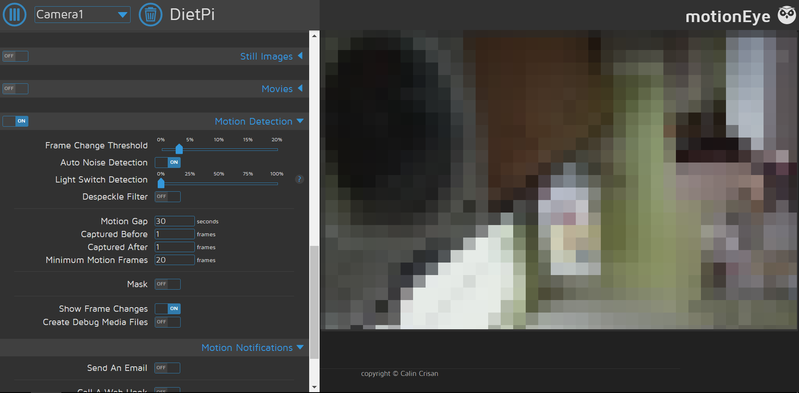
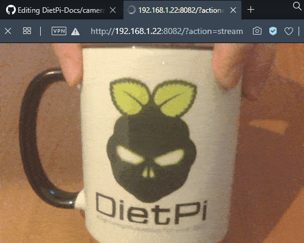

# Kamera & Ü;berwachung

## Ü;berblick

- [**RPi Cam Control - Webinterface & Steuerelemente für Ihre RPi-Kamera**](#rpi-cam-control)
- [**MotionEye - Webinterface & Ü;berwachung für Ihre Kamera**](#motioneye)
- [**mjpg-streamer - Einfaches Kamera-Streaming-Tool mit HTML-Plugin**](#mjpg-streamer)

??? Information "Wie führe ich **DietPi-Software** aus und installiere **optimierte Software**-Elemente?"
    Um eines der unten aufgeführten **DietPi-optimierten Softwareelemente** zu installieren, führen Sie es über die Befehlszeile aus:

    ```sh
    dietpi-software
    ```

    Wählen Sie **Software durchsuchen** und wählen Sie einen oder mehrere Artikel aus. Wählen Sie abschlie&szlig;end `Installieren`.
    DietPi führt alle notwendigen Schritte aus, um diese Softwareelemente zu installieren und zu starten.

    {: width="643" height="365" loading="lazy"}

    Um alle DietPi-Konfigurationsoptionen anzuzeigen, lesen Sie den Abschnitt [DietPi Tools](../../dietpi_tools/).

[Zurück zur **Liste der optimierten Software**](../../software/)

## RPi-Kamerasteuerung

Das Paket *RPi Cam Control* kann in Kombination mit einem Raspberry Pi Kameramodul verwendet werden

- ein Bild machen
- ein Video aufnehmen
- Beobachten basierend auf Bewegungserkennung
- Nehmen Sie ein Video mit Zeitraffer auf

Es besteht aus der vollständigen Steuerung der Kamera in einer webbasierten Schnittstelle.

{: width="500" height="395" loading="lazy"}

=== "Zugriff auf die Weboberfläche"

    Das Webinterface ist erreichbar über:

    - URL = `http://<your.IP>/rpicam`

=== "Zugriff auf Aufzeichnungen (ohne Webinterface)"

    Um ohne das Webinterface aus der Ferne auf Ihre Aufzeichnungen zuzugreifen, m&ouml;chten Sie vielleicht einen der [Dateiserver von DietPi](../file_servers/) installiert haben.
    Von MotionEye verwendete Verzeichnisse:

    - Medienverzeichnis = `/mnt/dietpi_userdata/rpicam`
    - Zugriff vom Dateiserver = `/rpicam`

=== "Auf neueste Version aktualisieren"

    RPi Cam Control kann auf die neueste Version aktualisiert werden, indem es über neu installiert wird

    ```sh
    dietpi-software reinstall 59
    ```

=== "RPi-Kameramodul"

    Das RPi-Kameramodul wird während des Installationsvorgangs automatisch aktiviert. Es erfordert jedoch einen Neustart und/oder manchmal einen Power-Cycle, um wirksam zu werden.
    Die Kameraaktivierung kann über `dietpi-config` > `Display Options` > `RPi Camera` überprüft werden, um `[On]` anzuzeigen. Zusätzlich kann im selben Dialog über `RPi Camera LED` das Verhalten der Kamera-LED eingestellt werden.

    Anmerkung: Nach dem Ändern der Kameraaktivierung müssen Sie den SBC inkl. Kamera.

    {: width="500" height="290" loading="lazy"}

***

Github-Seite: <https://github.com/silvanmelchior/RPi_Cam_Web_Interface>
Wiki: <https://elinux.org/RPi-Cam-Web-Interface>
Lizenz: [MIT](https://github.com/silvanmelchior/RPi_Cam_Web_Interface/blob/master/LICENSE.txt)

## MotionEye

Das Paket *MotionEye* bietet Ü;berwachung für Ihre Kamera.
Es konzentriert sich hauptsächlich auf die Verwendung der Bewegungserkennung. Es enthält ein Webinterface.

Die Software kann

- ein Bild machen
- ein Video aufnehmen
- Beobachten basierend auf Bewegungserkennung
- Nehmen Sie ein Video mit Zeitraffer auf

von jeder RPi-Kamera, USB-Kamera oder einem Netzwerkstream einer IP-Kamera.

{: width="500" height="246" loading="lazy"}

=== "Zugriff auf die Weboberfläche"

    Das Webinterface ist über Port **8765** erreichbar:

    - URL = `http://<Ihre.IP>:8765`
    - Benutzer = `admin`.
    - Passwort = nicht erforderlich

    Passw&ouml;rter k&ouml;nnen im Webinterface konfiguriert werden.

=== "Zugriff auf Aufzeichnungen (ohne Webinterface)"

    Um ohne das Webinterface aus der Ferne auf Ihre Aufzeichnungen zuzugreifen, m&ouml;chten Sie vielleicht einen der [Dateiserver von DietPi](../file_servers/) installiert haben.
    Von MotionEye verwendete Verzeichnisse:

    - Medienverzeichnis = `/mnt/dietpi_userdata/motioneye`
    - Zugriff über Dateiserver = `/motioneye`

=== "Auf neueste Version aktualisieren"

MotionEye kann auf die neueste Version aktualisiert werden über

    ```sh
    sudo pip2 install -U motioneye
    ```

=== "RPi-Kameramodul"

    Wenn Sie ein offizielles Raspberry Pi-Kameramodul haben, kann es über `dietpi-config` > `Display Options` > `RPi Camera` aktiviert werden, um `[On]` anzuzeigen.
    Zusätzlich kann im selben Dialog über `RPi Camera LED` das Verhalten der Kamera-LED eingestellt werden.

    Anmerkung: Nach dem Ändern der Kameraaktivierung müssen Sie den SBC inkl. Kamera.

    {: width="500" height="290" loading="lazy"}

***

Github-Seite: <https://github.com/ccrisan/motioneye>
Wiki: <https://github.com/ccrisan/motioneye/wiki>
Tutorial: [MotionEye auf DietPi auf Raspberry Pi: alles im Blick behalten](https://mansfield-devine.com/speculatrix/2018/12/motioneye-on-dietpi-on-raspberry-pi/)
YouTube-Video-Tutorial: `DietPi & MotionEye - Vollautomatische Installation inkl. Wlan Konfiguration, Updates und Anwendung`.

<iframe src="https://www.youtube-nocookie.com/embed/vQxL3TfQK5E?rel=0" frameborder="0" allow="fullscreen" width="560" height="315" loading="lazy" ></iframe>

Lizenz: [GPLv3](https://github.com/ccrisan/motioneye/blob/dev/LICENSE)

## mjpg-Streamer

Streamen Sie JPEG-Frames von verschiedenen Quellen zu verschiedenen m&ouml;glichen Ausgängen. Mit der Standardeinstellung wird ein angehängtes Kamerabild mit dem enthaltenen HTTP-Plugin auf eine einfache Webseite gestreamt.

{: width="500" height="400" loading="lazy"}

=== "Auf den HTTP-Stream zugreifen"

    Das Webinterface verwendet Port **8082**:

    - Stream: `http://<your.IP>:8082/?action=stream`
    - Snapshot: `http://<your.IP>:8082/?action=snapshot`
    - HTTP-Plugin-Dokumentation: <https://github.com/jacksonliam/mjpg-streamer/blob/master/mjpg-streamer-experimental/plugins/output_http/README.md>

=== "Setup für OctoPrint"

    Wenn [OctoPrint](../printing/#octprint) installiert wird, wird es automatisch so konfiguriert, dass es den mjpg-streamer-HTTP-Stream und Snapshots verwendet, da dies der Hauptanwendungsfall ist, für den dieser Softwaretitel angefordert wurde. Sie k&ouml;nnen die Einrichtung in den Einstellungen der OctoPrint-Weboberfläche überprüfen und testen.

=== "HTML-Authentifizierung"

    Standardmä&szlig;ig ist der HTTP-Stream auf Port **8082** ohne Authentifizierung zugänglich. Dies ist erforderlich, wenn Sie es in [OctoPrint](../printing/#octprint) einbetten, da der Browser die Anfrage sendet und derzeit keine Anmeldeinformationen weitergeben kann. Wenn Sie den Stream jedoch anderweitig verwenden, insbesondere wenn Sie ihn dem World-Wide-Web zur Verfügung stellen, empfehlen wir, ein Passwort einzurichten. Dafür:

    1. Führen Sie `dietpi-services` aus
    2. Wählen Sie `mjpg-Streamer` aus
    3. Wählen Sie `Bearbeiten`, um eine Service-Override-Konfiguration mit dem `nano`-Befehlszeileneditor zu &ouml;ffnen.
    4. Entkommentieren Sie im Abschnitt `[Service]` die Zeile `ExecStart=` und fügen Sie ` -c username:password` zum letzten Block mit einfachen Anführungszeichen `''` hinzu, mit Benutzername und Passwort Ihrer Wahl.
    5. Oberhalb dieser Zeile müssen Sie ein weiteres `ExecStart=` ohne Inhalt hinzufügen, das den ursprünglichen Startbefehl entfernen soll, damit Ihr ihn effektiv ersetzt. Die Datei k&ouml;nnte schlie&szlig;lich so aussehen:

        ```systemd
        [Unit]
        #Description=mjpg-streamer (DietPi)
        #Documentation=https://github.com/jacksonliam/mjpg-streamer/tree/master/mjpg-streamer-experimental
        #Wants=network-online.target
        #After=network-online.target dietpi-boot.service

        [Service]
        #User=mjpg-streamer
        #WorkingDirectory=/opt/mjpg-streamer
        ExecStart=
        ExecStart=/opt/mjpg-streamer/mjpg_streamer -i 'input_uvc.so -d /dev/video0' -o 'output_http.so -p 8082 -n -c micha:youNeverGuessThis!'

        # Hardening
        #ProtectSystem=strict
        #PrivateTmp=true
        #ProtectHome=true
        #ProtectKernelTunables=true
        #ProtectControlGroups=true

        [Install]
        #WantedBy=multi-user.target
        ```

    6. Drücken Sie ++ctrl+o++, um die Datei zu speichern und ++ctrl+x++, um den Editor zu verlassen. Beim Beenden von `dietpi-services` wird der Dienst automatisch neu geladen und ist fortan passwortgeschützt.

=== "Auf neueste Version aktualisieren"

    mjpg-streamer kann auf die neueste Version aktualisiert werden, indem Sie ihn über neu installieren

    ```sh
    dietpi-software reinstall 137
    ```

=== "Protokollierung"

    Sie k&ouml;nnen die Dienstprotokolle über anzeigen

    ```sh
    journalctl -u mjpg-streamer
    ```

    und der Dienststatus über

    ```sh
    systemctl status mjpg-streamer
    ```

=== "RPi-Kameramodul"

    Wenn Sie ein offizielles Raspberry Pi-Kameramodul haben, kann es über `dietpi-config` > `Display Options` > `RPi Camera` aktiviert werden, um `[On]` anzuzeigen.
    Zusätzlich kann im selben Dialog über `RPi Camera LED` das Verhalten der Kamera-LED eingestellt werden.

    Anmerkung: Nach dem Ändern der Kameraaktivierung müssen Sie den SBC inkl. Kamera.

    {: width="500" height="290" loading="lazy"}

***

Github-Seite: <https://github.com/jacksonliam/mjpg-streamer>
Plugin-Dokumentation: <https://github.com/jacksonliam/mjpg-streamer/tree/master/mjpg-streamer-experimental>
Lizenz: [GPLv2](https://github.com/jacksonliam/mjpg-streamer#license)

[Zurück zur **Liste der optimierten Software**](../../software/)
