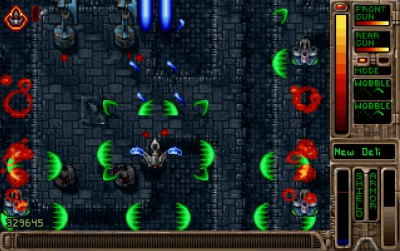
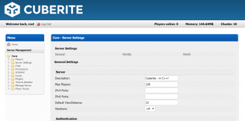
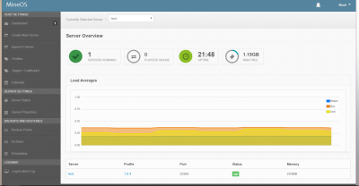
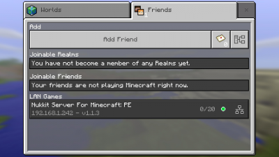
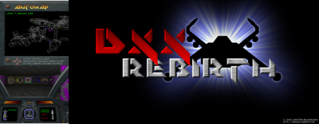
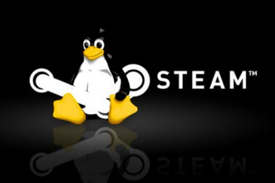
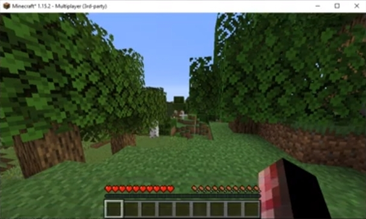

# Gaming & Emulation

## Ü;berblick

- [**OpenTyrian - Open-Source-Portierung des DOS-Spiels Tyrian**](#opentyrian)
- [**Cuberite - Schneller Minecraft-Server mit Webinterface**](#cuberite)
- [**MineOS - Mehrere Minecraft-Server mit Webinterface**](#mineos)
- [**Nukkit - Server für Minecraft Pocket Edition**](#nukkit)
- [**Amiberry - Amiga-Emulationssystem**](#amiberry)
- [**DXX-Rebirth - Descent 1 und 2 OpenGL-Port**](#dxx-rebirth)
- [**Steam - Steam-Client**](#steam)
- [**PaperMC - Schneller und optimierter Minecraft-Server**](#papermc)
- [**Box86 - i386 Userspace-Emulation für ARMv7**](#box86)
- [**Box64 - x86_64 Userspace-Emulation für ARMv8**](#box64)

??? Information "Wie führe ich **DietPi-Software** aus und installiere **optimierte Software**-Elemente?"
    Um eines der unten aufgeführten **DietPi-optimierten Softwareelemente** zu installieren, führen Sie es über die Befehlszeile aus:

    ```sh
    dietpi-software
    ```

    Wählen Sie **Software durchsuchen** und wählen Sie einen oder mehrere Artikel aus. Wählen Sie abschlie&szlig;end `Installieren`.
    DietPi führt alle notwendigen Schritte aus, um diese Softwareelemente zu installieren und zu starten.

    {: width="643" height="365" loading="lazy"}

    Um alle DietPi-Konfigurationsoptionen anzuzeigen, lesen Sie den Abschnitt [DietPi Tools](../../dietpi_tools/).

[Zurück zur **Liste der optimierten Software**](../../software/)

## OpenTyrian

Tyrian ist ein vertikal scrollender Shooter im Arcade-Stil. Die Geschichte steht fest
in 20.031, wo Sie als Trent Hawkins spielen, ein erfahrener Kampfpilot, der angestellt ist
um gegen MicroSol zu kämpfen und die Galaxie zu retten.

{: width="400" height="251" loading="lazy"}

=== "Starte das Spiel"

    - Konsole: Um OpenTyrian von der Konsole aus auszuführen, verwenden Sie den folgenden Befehl: `opentyrian`
    - Desktop: Um OpenTyrian vom Desktop aus auszuführen, wurden ein Desktop-Symbol und ein Startmenüeintrag hinzugefügt.
    - Autostart: Um OpenTyrian automatisch beim Booten auszuführen, wählen Sie es aus dem `dietpi-autostart`-Menü oder direkt über: `dietpi-autostart 4`

=== "Pers&ouml;nliche Notiz"

    Tyrian (OpenTyrian) ist zwar nicht das beste Spiel der Welt, aber das beste Top-Down-Shooter/Scroller-Spiel, das je entwickelt wurde.
    OpenTyrian lässt sich am besten mit einer Maus und der ++Enter++-Taste erleben, um den Rückfeuermodus zu ändern.
    Es ist alt, retro und ein Klassiker usw., aber ich bezweifle, dass Sie ein ähnliches aktuelles Spiel finden werden, das der Sucht nach OpenTyrian nahe kommt.

## Cuberit

Mit Cuberite k&ouml;nnen Sie einen einzigen, blitzschnellen Minecraft-Server erstellen, der die Leistungsvorteile von C++ (anstelle von Java) nutzt und über eine praktische Weboberfläche verfügt.

{: width="400" height="198" loading="lazy"}

=== "Zugriff auf die Weboberfläche"

Das Webinterface ist über Port **1339** erreichbar:

    - URL = `http://<Ihre.IP>:1339`
    - Benutzername = `admin`
    - Passwort = `<globalSoftwarePassword>` (Standard: `dietpi`)

=== "Optimieren"

    Optimieren Sie die Servereinstellungen, indem Sie die folgenden Dateien ändern:

    - Allgemeine Servereinstellungen:

        ```
        /mnt/dietpi_userdata/cubrite/settings.ini
        ```

    - Einstellungen für die Webadministration:

        ```
        /mnt/dietpi_userdata/cubrite/webadmin.ini
        ```

    - Einstellungen für die Welt:

        ```
        /mnt/dietpi_userdata/cubrite/world/world.ini
        ```

=== "Dienst neu starten"

    Sie k&ouml;nnen den Dienst neu starten, indem Sie Folgendes ausführen:

    ```sh
    systemctl restart cuberite
    ```

=== "Protokolle anzeigen"

    - Protokolldateien: `/mnt/dietpi_userdata/cubrite/logs/`
    - Dienstprotokolle: `journalctl -u cuberite`

=== "Aktualisieren"

    Update auf neuste Version:

    ```sh
    dietpi-software reinstall 52
    ```

##MineOS

Mit MineOS k&ouml;nnen Sie über eine einfache Weboberfläche problemlos mehrere Minecraft-Server erstellen.

{: width="400" height="208" loading="lazy"}

=== "Zugriff auf Webinterface"

    Das Webinterface ist über Port **8443** erreichbar:

    - URL: `https://<your.IP>:8443`
      Sie k&ouml;nnen die Zertifikats-"Warnung" getrost ignorieren, falls eine angezeigt wird.
    - Benutzername: `root`.
    - Passwort: Dasselbe wie Ihr Root-Login-Passwort. Standard ist `dietpi`.

=== "1st run setup"

Nach dem Einloggen in die Weboberfläche:

    1. Klicken Sie auf Profile auf der linken Seite des Bildschirms
    2. Wählen Sie eine Minecraft-Version, die Ihren Anforderungen entspricht, und klicken Sie dann auf Herunterladen
    3. Klicken Sie auf der linken Seite des Bildschirms auf Neuen Server erstellen
    4. Geben Sie einen Servernamen ein und klicken Sie dann unten auf Neuen Server erstellen
    5. Ihr Server wird nun am unteren Rand des Dashboard-Bildschirms angezeigt, wählen Sie ihn aus
    6. Wählen Sie in den Dropdown-Feldern `Profil ändern in:` und `Ausführbare JAR-Datei ändern in:` den Eintrag aus, der die Serverversionsnummer enthält, die Sie in Profile heruntergeladen haben
    7. Klicken Sie auf EULA akzeptieren
    8. Klicken Sie erneut auf EULA akzeptieren
    9. Klicken Sie auf Starten

Ihr Server sollte jetzt auf dem Standardport 25565 laufen.

***

Offizielles Forum: <https://discourse.codeemo.com/>
Quellcode: <https://github.com/hexparrot/mineos-node>
Lizenz: [GPLv3](https://github.com/hexparrot/mineos-node/blob/master/LICENSE.md)

##Nukkit

Nukkit ist ein Java-basierter Server für Minecraft Pocket Edition.

{: width="400" height="225" loading="lazy"}

=== "Informationen"

    Nukkit betreibt standardmä&szlig;ig einen einzelnen Server, der im LAN verfügbar ist.

=== "Optimieren"

    Optimieren Sie die Servereinstellungen, indem Sie die folgende Datei ändern:

    ```
    /usr/local/bin/nukkit/server.properties
    ```

=== "Dienst neu starten"

    Sie k&ouml;nnen den Dienst neu starten, indem Sie Folgendes ausführen:

    ```sh
    systemctl restart nukkit
    ```

## Amibeere

Amiberry ist ein optimierter Amiga-Emulator für den Raspberry Pi und andere ARM-basierte SoCs, der Ihnen die leistungsstärkste Amiga-Emulation bietet. Ob klassischer A500, A1200, CD32 oder bis hin zu einem High-End-Modell, das mit einem 68040 und einer Grafikkarte ausgestattet ist, wir haben alles für Sie.

Diese Installation ist m&ouml;glich durch eine Zusammenarbeit mit Dimitris Panokostas (Amiberry) und Daniel Knight (DietPi).

- Tastatur + Maus wird dringend empfohlen.
- Wir bieten auch ein vollständig automatisiertes Installations-Image für Amiberry an. Siehe: <https://blitterstudio.com/amiberry/>.
- Direkter Download-Link: <https://dietpi.com/downloads/images/DietPi_RPi-ARMv6-Bullseye_Amiberry.7z>.

{: width="400" height="189" loading="lazy"}

=== "1st run setup"

    - **Kickstarts (Amiga BIOS/Bootsystem)**
      Amiga Kickstart ROM-Images sind erforderlich, um die Systeme auszuführen, die Sie emulieren m&ouml;chten. Diese k&ouml;nnen aufgrund von Urheberrechtsbeschränkungen nicht gebündelt werden.
      Wenn Sie das Amiga Forever-Produkt besitzen, k&ouml;nnen Sie Kickstarts, für die Sie berechtigt sind, legal herunterladen und verwenden von: <https://www.amigaroms.com/>
      **Anmerkung:** *Kickstart 1.3 (A500-A2500-A3000-CDTV) wird dringend empfohlen, um mit den meisten Spielen zu funktionieren.*
      Kickstarts k&ouml;nnen in `/mnt/dietpi_userdata/amiberry/kickstarts` abgelegt werden.
    - **Disketten (Amiga `.adf`-Images)**
      Disketten-Images von Amiga haben die Dateierweiterung `.adf`.
      Sie ben&ouml;tigen mindestens ein ADF-Image, um Ihr Amiga-Erlebnis zu beginnen.
      Laden Sie Ihren ADF oder platzieren Sie ihn dort, wo Sie ihn haben m&ouml;chten, z. B. erstellen und verwenden Sie:
      `/mnt/dietpi_userdata/amiberry/floppy_images`
      Denken Sie daran, die erforderlichen Berechtigungen zu erteilen, um Uploads über Dateiserver zuzulassen, z.
      `chown dietpi:dietpi /mnt/dietpi_userdata/amiberry/floppy_images`

=== "Starten"

    - Amiberry kann gestartet werden durch Ausführen von: `systemctl start amiberry`
    - Optional k&ouml;nnen Sie den Amiberry-Autostart aktivieren, um so schnell wie m&ouml;glich direkt in die Amiga-Umgebung zu booten, mit der geringstm&ouml;glichen St&ouml;rung durch Linux.
      Führen Sie `dietpi-autostart 6` von der Konsole oder `dietpi-autostart` aus und wählen Sie *Amiberry fast boot* aus dem Menü, dann starten Sie Ihr System neu.
      Wenn Sie Probleme mit der Schnellstartoption haben oder andere Dienste zuerst starten müssen, verwenden Sie `dietpi-autostart 8` bzw. wählen Sie *Amiberry-Standardstart*.

=== "Erstelle eine Amiga-Konfiguration"

    Sobald Amiberry läuft, müssen Sie den Emulator konfigurieren, um ihm mitzuteilen, welches Amiga-System emuliert werden soll.

    - Wählen Sie `Schnellstart` (im Menü auf der linken Seite)
    - Unter Amiga-Modell: Wählen Sie das Amiga-Modell aus, das Sie emulieren m&ouml;chten (Beispiel A500)
    - Unter Config: Wählen Sie die zusätzlichen Optionen für das Ziel-Amiga-Modell (falls erforderlich)
    - Klicken Sie auf die Schaltfläche Konfiguration festlegen, um die Änderungen zu übernehmen.

Als nächstes müssen Sie den Emulator für das Kickstart- und Disketten-Image einrichten, das Sie verwenden m&ouml;chten:

    - Kickstart (ROM) auswählen:
    - Wählen Sie auf der linken Seite ROM aus.
    - Klicken Sie unter Haupt-ROM-Datei: auf die Schaltfläche zum Durchsuchen (3 Punkte) ...
    - Navigieren Sie zu Ihrem Kickstarts-Verzeichnis
      `/mnt/dietpi_userdata/amiberry/kickstarts`
      Anmerkung: Amiberry unterstützt derzeit keine symbolischen Links. Wenn Sie ein dediziertes USB-Laufwerk installiert haben, lautet der Speicherort:
      `/mnt/uuid-of-drive/amiberry/kickstarts`
    - Wählen Sie einen Kickstart (1.3 wird empfohlen)

    - Wählen Sie ein Disketten-Image (ADF):
    - Wählen Sie auf der linken Seite Diskettenlaufwerke.
    - Wählen Sie unter `DF0:` die Schaltfläche zum Durchsuchen auf der rechten Seite (3 Punkte) ...
    - Navigieren Sie zu Ihrem Disketten-Image-Verzeichnis, z
      `/mnt/dietpi_userdata/amiberry/floppy_images`
      Anmerkung: Amiberry unterstützt derzeit keine symbolischen Links. Wenn Sie ein dediziertes USB-Laufwerk installiert haben, lautet der Speicherort:
      `/mnt/uuid-of-drive/amiberry/floppy_images`
    - Wählen Sie das ROM aus, das Sie verwenden m&ouml;chten.

=== "Vollbildausgabe aktivieren"

    Wählen Sie auf der linken Seite **Anzeige** aus.
    Stellen Sie sicher, dass die Option **Vollbild** aktiviert ist.

=== "Optional: Stellen Sie die CPU-Geschwindigkeit auf die h&ouml;chste ein (empfohlen)"

    Dadurch wird der Amiga so schnell wie m&ouml;glich emuliert und sichergestellt, dass Sie die maximale FPS für Ihre SBC-Hardware erhalten.

    - Wählen Sie auf der linken Seite CPU und FPU aus.
    - Wählen Sie unter CPU-Geschwindigkeit die schnellste Option aus.
    - Wenn Sie feststellen, dass diese Änderung die Emulation verlangsamt, versuchen Sie es mit dem festen Wert von 25 MHz

=== "Optional: Konfiguration speichern (empfohlen)"

    Es wird empfohlen, Ihre Einstellungen zu speichern. Dadurch wird sichergestellt, dass die Einstellungen beim nächsten Start von Amiberry übernommen werden.

    - Wählen Sie auf der linken Seite **Konfigurationen**.
    - Geben Sie den Namen ein, z. B. "autostart", und klicken Sie dann auf **Speichern**.

=== "Häufig gestellte Fragen"

    #### Wie kann ich Kickstarts & Floppy Images auf das Gerät übertragen?

    Stellen Sie sicher, dass Sie einen der Dateiserver von DietPi installiert haben.

    - Floppy Disk Image (`.adf`) Verzeichnis wie zuvor gewählt, zB `/amiberry/floppy_images`
    - Kickstarts (`.rom`) Verzeichnis = `/amiberry/kickstarts`

    #### Wie kann ich das Konfigurationsfenster &ouml;ffnen, nachdem der Emulator gestartet wurde?

    Der vordefinierte Schlüssel dafür ist ++f12++.

    #### Wie kann ich die Amiga-Emulationsumgebung neu starten (Amiga-Reset)?

    Verwenden Sie die Tasten ++ctrl+lwin+rwin++.
    Wenn Sie keine Taste ++rwin++ haben, versuchen Sie es stattdessen mit der Taste ++menu++.

    #### Was sind die Standardsteuerungen für den Joystick, wenn eine Tastatur verwendet wird?

    Bei Verwendung einer Tastatur sind die standardmä&szlig;igen Joystick-Steuerelemente:

    - ++oben++/++unten++/++links++/++rechts++ = Oben/Unten/Links/Rechts
    - ++Bild-unten++ = Feuer/Taste 1
    - ++Bild-auf++ = Feuer/Taste 2

    #### Wie kann ich die Leistung (Bildrate) verbessern?

    Eine ***niedrigere Aufl&ouml;sung*** kann die Leistung bei den meisten Spielen verbessern. Aus dem Hauptmenü des Emulators:

    - Wählen Sie auf der linken Seite Anzeige
    - 640 x 256 ist eine hohe Aufl&ouml;sung
    - 320 x 256 ist eine niedrige Aufl&ouml;sung und sollte eine verbesserte Leistung bieten

    Durch ***Ü;bertakten*** Ihres Systems wird die Leistung verbessert. Die Stabilität kann je nach Gerät variieren und Ü;bertaktung wird nicht offiziell unterstützt:

    - Führen Sie von einem Terminal aus `dietpi-config` aus
    - Wählen Sie das Menü Leistungsoptionen
    - Wählen Sie Ü;bertaktungsprofile
    - Wählen Sie ein Ü;bertaktungsprofil und starten Sie das System neu

    #### Wie stelle ich die Geschwindigkeit des Diskettenlaufwerks für Kompatibilität ein?

    Die Diskettenlaufwerk-Emulation ist standardmä&szlig;ig auf "800 %" eingestellt. Dies reduziert die Ladezeiten um bis zu 8x.
    Sie k&ouml;nnen dies auf 100 % senken, was die Kompatibilität erh&ouml;ht:

    - Wählen Sie auf der linken Seite Diskettenlaufwerke
    - Ändern Sie den Wert für die Emulationsgeschwindigkeit des Diskettenlaufwerks auf 100 %

    #### Einige Spiele sind nicht im Vollbildmodus

    Spiele laufen mit verschiedenen Aufl&ouml;sungen über das Hauptmenü des Emulators:

    - Wählen Sie auf der linken Seite Anzeige
    - Ändern Sie den H&ouml;henwert auf 200 oder 256
    - Drücken Sie die Fortsetzen- oder Start-Taste

    Wenn Sie diese Installation nützlich finden, spenden Sie bitte. Verwenden Sie den folgenden Link und wählen Sie **Spenden für DietPi und Amiberry 50:50**, um es zwischen Dimitris Panokostas (Amiberry) und DietPi aufzuteilen.
    [PayPal spenden](https://www.paypal.com/cgi-bin/webscr?cmd=_s-xclick&hosted_button_id=6DVBECXRW3TAA)

**Gut zu GEHEN!**
Wenn Sie fertig sind, wählen Sie **Start**, um den Emulator zu starten. Habe Spa&szlig;!

***

YouTube-Video-Tutorial #1: *Amiga auf dem Raspberry Pi mit DietPi und Amiberry: Ich habe den Pi 400 zum Laufen gebracht!*.

<iframe src="https://www.youtube-nocookie.com/embed/osBU7iVSQ78?rel=0" frameborder="0" allow="fullscreen" width="560" height="315" loading="lazy" ></iframe>

YouTube-Video-Tutorial #2: [Amiga auf dem Raspberry Pi mit DietPi und Amiberry: Workbench und Autobooting](https://www.youtube.com/watch?v=LU-G0PRNffQ)

## DXX-Wiedergeburt

Abstieg 1 & 2. Ein Meisterwerk 3D FPS. Mit dem DXX-Rebirth-Projekt wieder zum Leben erweckt. Spielen Sie Descent originalgetreu mit OpenGLES-Rendering.

- DietPi installiert die Demo- und Shareware-Versionen von Descent. Bitte lesen Sie die FAQ unten, um das vollständige Spiel zu übertragen.
- Tastatur + Maus wird dringend empfohlen
- Wir haben die neueste Version von DXX-Rebirth (0.58.1) mit Unterstützung für FB und RPi OpenGL kompiliert.

{: width="400" height="156" loading="lazy"}

=== "Starte DXX-Rebirth"

    DXX-Rebirth kann durch Ausführen von `dxx-rebirth` gestartet werden.
    Um DXX-Rebirth beim Booten automatisch zu starten, führen Sie einfach `dietpi-autostart 7` von der Konsole oder `dietpi-autostart` aus und wählen Sie `DXX-Rebith (Descent 1/2)` aus dem Menü und starten Sie Ihr System neu.

=== "Einen Piloten auswählen"

    Wir haben ein Pilotprojekt namens DietPi erstellt. Die Konfiguration wurde für das Spielen im WSAD-Stil eingerichtet und wird für FPS-Spieler empfohlen, die WSAD + Maus verwenden.

    - ++w++/++a++/++s++/++d++ = Vorwärts/Rückwärts/Links/Rechts
    - ++q++/++z++ = Auf/Ab
    - ++e++/++r++ = Z-Achse (vorwärts) drehen
    - ++f++ = Flare starten
    - ++alt+f2++ = Spiel speichern

=== "Häufig gestellte Fragen"

    #### Wie übertrage ich die vollständigen Originalspieldateien von Descent?

    Bevor Sie beginnen, ben&ouml;tigen Sie die Originalspieldateien einer legalen Kopie und Installation von Descent.
    Stellen Sie sicher, dass Sie einen der Dateiserver von DietPi installiert haben.

    - Kopieren Sie Ihre Descent 1-Spieldateien nach `/mnt/dietpi_userdata/dxx-rebirth/descent_1_game`
    - Kopieren Sie Ihre Descent 2-Spieldateien nach `/mnt/dietpi_userdata/dxx-rebirth/descent_2_game`

***

Offizielle Website: <https://www.dxx-rebirth.com/>

## Steam

{: width="400" height="267" loading="lazy"}

Steam ist ein Gaming-Client und -Shop von Valve.

### Steam auf ARM

Steam ist für x86 gemacht, aber es und viele Steam-Spiele mit Linux-Versionen k&ouml;nnen mit Hilfe von [Box86](#box86) auf ARM ausgeführt werden. Beachten Sie, dass 2D-Spiele am besten zu spielen sind und komplexere Spiele m&ouml;glicherweise eine Ü;bertaktung Ihres Geräts erfordern.

??? Warnung `Bekannte Probleme auf ARM`

    - Nur der kleine Modus (die Liste der Minispiele) wird unterstützt, da der interne Bibliotheksbrowser auf 64-Bit-Komponenten angewiesen ist.
    - Daher ist es nicht m&ouml;glich, Spiele vom Client aus zu suchen/hinzuzufügen, was über den Website-Store (funktioniert nicht für kostenlose Spiele) oder einen anderen Client erfolgen muss.
    - Das Beenden des Steam-Clients funktioniert nur durch Ausführen von `killall steam.sh` von einer Konsole aus. Wenn Sie die Schaltfläche `Beenden` aus dem Menü oder dem Bedienfeldsymbol verwenden, wird Steam hängen bleiben.

## PaperMC

Ein hochoptimierter Minecraft-Server mit Plugins, geschrieben in Java.
PaperMC führt standardmä&szlig;ig einen einzelnen Server aus, der im LAN verfügbar ist, aber über einen Port weitergeleitet werden kann, damit andere Personen eine Verbindung herstellen k&ouml;nnen.

{: width="100" height="100" loading="lazy"}

{: width="500" height="300" loading="lazy"}

=== "Standardserver/Abfrageport"

    - Der standardmä&szlig;ige Server-/Abfrageport ist: **25565**

=== "Konsolenzugriff über rcon"

    - Port: **25575**
    - Passwort: `<globalSoftwarePassword>` (Standard: `dietpi`)
    - Konsolenbefehl: `mcrcon -p <globalSoftwarePassword>`

=== "Verzeichnisse"

    - Launcher: `/opt/papermc`
    - Konfiguration und Daten: `/mnt/dietpi_userdata/papermc`
    - Protokolle: `/var/log/papermc`

=== "Protokolle anzeigen"

    - Dienst: `journalctl -u papermc`
    - Datei: `/var/log/papermc/latest.log`

=== "Optimieren"

    Optimieren Sie die Servereinstellungen, indem Sie die folgende Datei oder eine beliebige Datei im Konfigurationsverzeichnis ändern, die auf `.yml` endet:
    `/mnt/dietpi_userdata/papermc/server.properties`

=== "Speicherverwaltung"

    Da PaperMC als Java-Anwendung läuft, hängt der Systemspeicherbedarf stark von der Java-Heap-Gr&ouml;&szlig;e ab, die angepasst werden kann. Die absolute Mindestkopfgr&ouml;&szlig;e, die zum Ausführen von PaperMC erforderlich ist, beträgt 512 MiB, was zu ~850 MiB insgesamt verwendetem Systemspeicher führt. Wir empfehlen, ihn für die Produktionsnutzung auf mindestens 1 GiB (~1,35 GiB Gesamtspeichernutzung) oder h&ouml;her zu erh&ouml;hen, je nach Anzahl der Benutzer und installierten Plugins.

    Gehen Sie wie folgt vor, um die Gr&ouml;&szlig;e des Java-Heapspeichers zu ändern:

    1. Führen Sie `dietpi-services` von der Konsole aus.
    2. Wählen Sie `papermc`.
    3. Wählen Sie `Bearbeiten`.
    4. Entkommentieren Sie die Zeile, die mit `#ExecStart=` beginnt (entfernen Sie das führende `#`) und fügen Sie z. B. `-Xms1G -Xmx1G` direkt hinter dem `java`-Befehl hinzu, um eine Heap-Gr&ouml;&szlig;e von 1 GiB anzuwenden. Zusätzlich müssen Sie oben ein `ExecStart=` hinzufügen, um den Befehl des ursprünglichen Dienstes zu deaktivieren, sodass es schlie&szlig;lich so aussieht:

        ```
        ExecStart=
        ExecStart=/usr/bin/java -Xms1G -Xmx1G -jar /opt/papermc/paperclip.jar --nogui --noconsole
        ```

    5. Verwenden Sie ++ctrl+o++ und ++enter++, um die Datei zu speichern, dann ++ctrl+x++, um zum Menü `dietpi-services` zurückzukehren. Beim Beenden werden Sie gefragt, ob Sie den Dienst neu starten m&ouml;chten, um die Änderungen zu übernehmen.

    !!! Warnung "Bewahren Sie Ihre Auslagerungsdatei nicht auf einer SD-Karte auf!"
        Wenn der verwendete Systemspeicher den physischen Arbeitsspeicher Ihres SBC übersteigt, empfehlen wir dringend, die Auslagerungsdatei **nicht** auf einer SD-Karte, sondern auf einem externen Laufwerk zu speichern, da SD-Karten normalerweise die regelmä&szlig;ige Verwendung nicht überleben Auslagerungsdatei schreibt lange, was im schlimmsten Fall zu Serverabstürzen und Datenverlust führt.

=== "Dienst neu starten"

    Sie k&ouml;nnen den Dienst neu starten, indem Sie Folgendes ausführen:

    ```sh
    systemctl restart papermc
    ```

=== "Auf neueste Version aktualisieren"

    ```sh
    dietpi-software reinstall 181
    ```

=== "Häufig gestellte Fragen"

    #### Wie greife ich auf die Konsole des Servers zu?

    Verwenden Sie das installierte Tool MCrcon: `mcrcon -p <globalSoftwarePassword>`

    #### Wie finde und installiere ich Plugins?

    <https://www.spigotmc.org/resources/categories/spigot.4/>

    Verschieben Sie einfach die heruntergeladene JAR-Datei in das Verzeichnis `/mnt/dietpi_userdata/papermc/plugins`.

    #### Auf welcher Version von Minecraft funktioniert das?

    PaperMC wurde entwickelt, um auf der Java-Edition ausgeführt zu werden, kann jedoch mit den optionalen Geyser- und Floodgate-Plug-ins auch auf der Bedrock-Edition ausgeführt werden.
    Wählen Sie einfach, sie am Anfang zu installieren.

***

Offizielle Website: <https://paper.readthedocs.io>
Quellcode: <https://github.com/PaperMC/Paper>

##Box86

Mit Box86 k&ouml;nnen Sie **i386** Linux-Programme (z. B. Spiele) auf **ARMv7**-Systemen ausführen. Dank [binfmt_misc](https://en.wikipedia.org/wiki/Binfmt_misc), das standardmä&szlig;ig aktiviert ist, k&ouml;nnen Sie **i386**-Binärdateien wie jede andere ausführbare Datei ausführen und Box86 wird automatisch aufgerufen.

##Box64

Mit Box64 k&ouml;nnen Sie **x86_64** Linux-Programme (z. B. Spiele) auf **ARMv8**-Systemen ausführen. Dank [binfmt_misc](https://en.wikipedia.org/wiki/Binfmt_misc), das standardmä&szlig;ig aktiviert ist, k&ouml;nnen Sie **x86_64**-Binärdateien wie jede andere ausführbare Datei ausführen und Box64 wird automatisch aufgerufen.

[Zurück zur **Liste der optimierten Software**](../../software/)
