# Mediensysteme

## &Uuml;berblick

- [**Kodi - Media Center/Player**](#kodi)
- [**ympd - Leichtgewichtiger Webinterface-Audioplayer f&uuml;r MPD**](#ympd)
- [**myMPD - Leichtgewichtiger Webinterface-Audioplayer f&uuml;r MPD**](#mympd)
- [**O!MPD - Funktionsreicher Webinterface-Audioplayer f&uuml;r MPD**](#ompd)
- [**CAVA - Optional: Konsolenbasierter Audiovisualisierer f&uuml;r MPD**](#cava)
- [**Mopidy - Webinterface Musik/Radioplayer**](#mopidy)
- [**Airsonic-Advanced - Feature-Rich-Media-Streaming-Server mit Web-Interface**](#airsonic)
- [**Logitech Media Server - auch bekannt als LMS, Squeezebox Server**](#logitech-media-server)
- [**Squeezelite - Audioplayer f&uuml;r Logitech Media Server**](#squeezelite)
- [**Shairport Sync - AirPlay-Audioplayer mit Multiroom-Synchronisierung**](#shairport-sync)
- [**ReadyMedia - (MiniDLNA) Media-Streaming-Server (DLNA, UPnP)**](#readymedia)
- [**Ampache - Media-Streaming-Server der Webschnittstelle**](#ampache)
- [**Emby - Media-Streaming-Server der Webschnittstelle**](#emby)
- [**Plex Media Server - Medien-Streaming-Server der Webschnittstelle**](#plex-media-server)
- [**Tautulli - &Uuml;berwachungs- und Tracking-Tool f&uuml;r Plex Media Server**](#tautulli)
- [**Murmeln - Mumble VoIP Server**](#Murmeln)
- [**Roon Bridge - Verwandelt Ihr Ger&auml;t in einen Roon-f&auml;higen Audioplayer**](#roon-bridge)
- [**Roon Server - Verwandelt Ihr Ger&auml;t in einen Roon-f&auml;higen Audioplayer und Roon-Core**](#roon-server)
- [**Roon Extension Manager - Verwalten Sie Erweiterungen innerhalb von Roon**](#roon-extension-manager)
- [**NAA Daemon - Signalyst Network Audio Adapter (NAA)**](#naa-daemon)
- [**IceCast - Shoutcast-Streaming-Server, einschlie&szlig;lich DarkIce**](#icecast)
- [**Koel - Webinterface-Streaming-Server**](#koel)
- [**GMediaRender - Ressourceneffizienter UPnP/DLNA-Renderer**](#gmediarender)
- [**Ubooquity - Kostenloser Heimserver f&uuml;r Ihre Comic- und E-Book-Bibliothek**](#ubooquity)
- [**Komga - Kostenloser und Open-Source-Comics/Mangas-Medienserver mit Web-UI**](#komga)
- [**Raspotify - Spotify Connect-Client**](#raspotify)
- [**Spotify Connect Web - Webinterface, Client und Player f&uuml;r Spotify Premium**](#spotify-connect-web)
- [**Spotifyd - Lightweight FOSS Spotify-Client**](#spotifyd)
- [**Jellyfin - Media-Streaming-Server mit Live-TV**](#jellyfin)
- [**Beets - Musikorganisator und -manager**](#beets)
- [**Snapcast Server - Audioserver f&uuml;r mehrere R&auml;ume**](#snapcast-server)
- [**Snapcast Client - Audioclient f&uuml;r mehrere R&auml;ume**](#snapcast-client)

??? Information "Wie f&uuml;hre ich **DietPi-Software** aus und installiere **optimierte Software**-Elemente?"
    Um eines der unten aufgef&uuml;hrten **DietPi-optimierten Softwareelemente** zu installieren, f&uuml;hren Sie es &uuml;ber die Befehlszeile aus:

    ```sh
    dietpi-software
    ```

    W&auml;hlen Sie **Software durchsuchen** und w&auml;hlen Sie einen oder mehrere Artikel aus. W&auml;hlen Sie abschlie&szlig;end `Installieren`.
    DietPi f&uuml;hrt alle notwendigen Schritte aus, um diese Softwareelemente zu installieren und zu starten.

    {: width="643" height="365" loading="lazy"}

    Um alle DietPi-Konfigurationsoptionen anzuzeigen, lesen Sie den Abschnitt [DietPi Tools](../../dietpi_tools/).

[Zur&uuml;ck zur **Liste der optimierten Software**](../../software/)

##Kodi

Das einzige Media Center/Player, das Sie jemals brauchen werden.

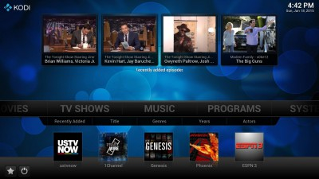{: width="400" height="225" loading="lazy"}

Wenn Sie Kodi nicht zum Starten beim Booten ausgew&auml;hlt haben, k&ouml;nnen Sie die Autostart-Optionen in `dietpi-autostart` &auml;ndern:

- Desktop = Kodi ist &uuml;ber das LXDE-Startmen&uuml; und Desktop verf&uuml;gbar.
- Console = Kodi kann auch durch Eingabe von "startkodi" ausgef&uuml;hrt werden.

## ympd

Ein leichter, schlichter HiFi-Musikplayer ohne Schnickschnack mit webbasierter Benutzeroberfl&auml;che. ympd ist ein Frontend f&uuml;r MPD.

Installiert auch:

- MPD (Musik-Player-Daemon)

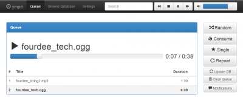{: width="400" height="162" loading="lazy"}

=== "Zugriff auf die Weboberfl&auml;che"

    Das Webinterface ist &uuml;ber Port **1337** erreichbar:

    - URL = `http://<Ihre.IP>:1337`

=== "Musik &uuml;bertragen/hinzuf&uuml;gen"

    Stellen Sie sicher, dass Sie einen der [Dateiserver](../file_servers/) von DietPi installiert haben.
    Verwendete Ordner:

    - local = `/mnt/dietpi_userdata/Music`
    - Zugriff vom Dateiserver = `/Music`

=== "Musikdateien / Datenbank aktualisieren"

    W&auml;hlen Sie einfach die Schaltfl&auml;che `DB aktualisieren` aus dem Einstellungsmen&uuml; in ympd.

=== "DietPi-JustBoom-Systemsteuerung"

    - Optimieren Sie die Audiooptionen im Handumdrehen mit dem Bedienfeld.
    - F&uuml;hren Sie einfach `dietpi-justboom` von der Befehlszeile aus, um es zu starten.

        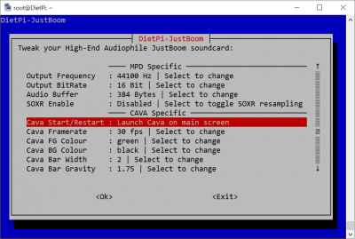{: width="400" height="269" loading="lazy"}

## myMPD

Ein leichter, schlichter HiFi-Musikplayer ohne Schnickschnack mit webbasierter Benutzeroberfl&auml;che. myMPD ist ein Frontend f&uuml;r MPD und ein neuer Fork von ympd.

Installiert auch:

- MPD (Musik-Player-Daemon)

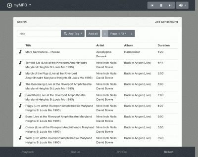{: width="400" height="318" loading="lazy"}

=== "Zugriff auf die Weboberfl&auml;che"

    Das Webinterface ist &uuml;ber Port **1333** erreichbar:

    - URL = `http://<Ihre.IP>:1333`

=== "Installationshinweise"

    Wir haben SSL und seine Weiterleitung standardm&auml;&szlig;ig bei der DietPi-Installation deaktiviert. Dies dient dazu, Umleitungen auf den Hostnamen zu verhindern.
    So aktivieren Sie die SSL-Verbindung und die Umleitungsoption erneut:

    - Bearbeiten Sie `/etc/mympd.conf`
    - Ersetzen Sie `ssl = false` durch `ssl = true`.
    - &Auml;nderungen sichern und beenden
    - Dienste mit `systemctl restart mympd` neu starten
    - Verwenden Sie dieselbe URL-Adresse oben, sie wird w&auml;hrend der Verbindung zu HTTPS umgeleitet

=== "Musik &uuml;bertragen/hinzuf&uuml;gen"

    Stellen Sie sicher, dass Sie einen der [Dateiserver](../file_servers/) von DietPi installiert haben.
    Verwendete Ordner:

    - local = `/mnt/dietpi_userdata/Music`
    - Zugriff vom Dateiserver = `/Music`

=== "Musikdateien / Datenbank aktualisieren"

    W&auml;hlen Sie einfach die Option `Datenbank aktualisieren` aus dem Einstellungsmen&uuml; in myMPD.

=== "DietPi-JustBoom-Systemsteuerung"

    - Optimieren Sie die Audiooptionen im Handumdrehen mit dem Bedienfeld.
    - F&uuml;hren Sie einfach `dietpi-justboom` von der Befehlszeile aus, um es zu starten.

{: width="400" height="269" loading="lazy"}

## O!MPD

Ein funktionsreicher Webinterface-Audioplayer f&uuml;r MPD. Inklusive Song-/Album-Scraping, ideal zum Durchsuchen von Musikkatalogen.

Installiert auch:

- MPD (Musik-Player-Daemon)
- Webserver

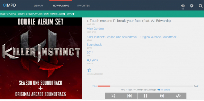{: width="400" height="199" loading="lazy"}

=== "Zugriff auf die Weboberfl&auml;che"

    - URL = `http://<Ihre.IP>/ompd`
    - Benutzername = `admin`
    - Passwort = `admin`.

=== "Musik &uuml;bertragen/hinzuf&uuml;gen"

Stellen Sie sicher, dass Sie einen der [Dateiserver](../file_servers/) von DietPi installiert haben.
Von O!MPD verwendete Ordner:

    - Lokal = `/mnt/dietpi_userdata/Music`
    - Zugriff &uuml;ber Dateiserver = `/Music`

=== "Bibliothek aktualisieren/scannen"

    Klicken Sie auf die Schaltfl&auml;che `Einstellungen` (Zahnrad oben rechts).
    Klicken Sie auf `Aktualisieren`.

## CAVA

Konsolenbasierter Audio Visualizer f&uuml;r MPD. Kann in SSH-Terminals, Konsolen und LCD-HATS angezeigt werden.

Installiert auch:

- MPD (Musik-Player-Daemon)

{: width="500" height="114" loading="lazy"}

=== "Autostart-Option"

    Wenn Sie CAVA nicht zum Starten beim Booten ausgew&auml;hlt haben:

    - CAVA kann auch durch Eingabe von `cava` ausgef&uuml;hrt werden. Verwenden Sie ++Strg+C++ zum Beenden.
    - Sie k&ouml;nnen die Autostart-Optionen in `dietpi-autostart` &auml;ndern.

=== "DietPi-JustBoom-Systemsteuerung"

    - Optimieren Sie CAVA-Optionen im Handumdrehen mit dem Panel.
    - F&uuml;hren Sie einfach `dietpi-justboom` von der Befehlszeile aus, um es zu starten.

{: width="400" height="269" loading="lazy"}

## Mopidy

Mopidy ist eine auf Python basierende, webbasierte Benutzeroberfl&auml;che f&uuml;r Musikplayer f&uuml;r MPD.

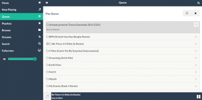{: width="400" height="198" loading="lazy"}

=== "Zugriff auf die Weboberfl&auml;che"

    Das Webinterface verwendet Port **6680**:

    - URL = `http://<your.IP>:6680/musicbox_webclient` oder einfach `http://<your.IP>:6680`

=== "Musik &uuml;bertragen/hinzuf&uuml;gen"

    Stellen Sie sicher, dass Sie einen der [Dateiserver](../file_servers/) von DietPi installiert haben.
    Von Mopidy verwendete Ordner:

    - Lokal = `/mnt/dietpi_userdata/Music`
    - Zugriff &uuml;ber Dateiserver = `/Music`

=== "Musikdateien / Datenbank aktualisieren"

    Dies geschieht automatisch, Sie k&ouml;nnen jedoch mit dem Befehl ein Update erzwingen

    ```sh
    mopidyctl local scan
    ```

=== "Hinzuf&uuml;gen von Mopidy-Erweiterungen"

Mopidy ist hochgradig anpassbar und unterst&uuml;tzt verschiedene Erweiterungen von alternativen Webclients bis hin zu Backend-Erweiterungen. Siehe [*Erweiterungen*](https://mopidy.com/ext/) f&uuml;r eine Liste.

Diese k&ouml;nnen &uuml;ber `pip` installiert werden, zB:

    ```sh
    pip3 install --no-cache-dir -U Mopidy-Jellyfin
    ```

oder auf Stretch:

    ```sh
    pip2 install --no-cache-dir -U Mopidy-Jellyfin
    ```

=== "Unterst&uuml;tzung von Codecs"

Aktivieren Sie die Unterst&uuml;tzung f&uuml;r eine gro&szlig;e Anzahl von Codecs wie .m4a. F&uuml;hren Sie die folgende Installationsprozedur aus:

    ```sh
    apt-get install -y gstreamer1.0-plugins-bad
    ```

    Vielen Dank an Roth f&uuml;r [diesen Hinweis](https://dietpi.com/phpbb/viewtopic.php?t=785).

## Airsonic-Erweitert {: #airsonic }

Feature-Rich-Media-Streaming-Server mit einer in Java codierten Webschnittstelle.

{: width="350" height="100" loading="lazy"}

=== "Webinterface"

    Das Webinterface verwendet Port **8080**:

    - URL: `http://<your.IP>:8080/airsonic`
    - Benutzername: `admin`
    - Passwort: `admin`.

    !!! Hinweis "Die Weboberfl&auml;che kann sich beim ersten Zugriff tr&auml;ge anf&uuml;hlen."

    Dies ist beim ersten Zugriff nach Dienststart normal. Ist eine Seite einmal angesehen bzw. ein Element das erste Mal ausgew&auml;hlt, werden nachfolgende Zugriffe deutlich schneller ablaufen.

=== "Erste Ausf&uuml;hrung einrichten"

    Sobald Sie zum ersten Mal mit der Weboberfl&auml;che verbunden sind, empfehlen wir die folgenden Einrichtungsschritte:

    Zuerst haken wir die Seite **Erste Schritte** ab und gehen zu **Einstellungen**:

    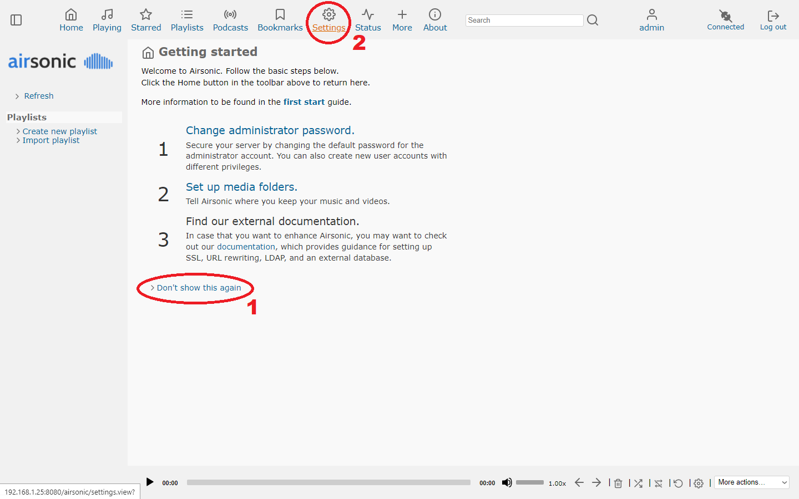{: width="1440" height="900" loading="lazy"}

    Auf der Registerkarte **Medienordner** &auml;ndern wir den Pfad zu DietPis Standard-Musikverzeichnis `/mnt/dietpi_userdata/Music`, speichern und scannen das neue Medienverzeichnis:

    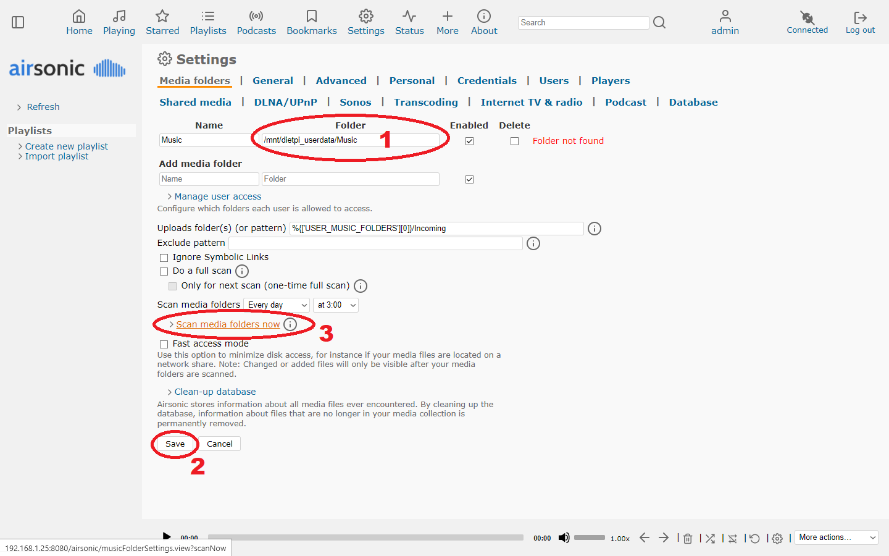{: width="1440" height="900" loading="lazy"}

    Auf der Registerkarte **Credentials** f&uuml;gen wir ein neues Admin-Passwort hinzu, die Standardkodierung `bcrypt` ist sehr gut f&uuml;r die sichere Speicherung von Passw&ouml;rtern. Dann l&ouml;schen wir das anf&auml;ngliche Standardpasswort:

    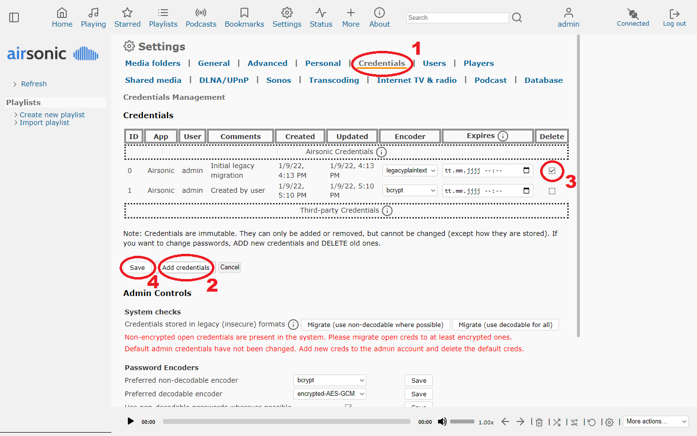{: width="1440" height="900" loading="lazy"}

    Schlie&szlig;lich m&uuml;ssen wir aufgrund eines [aktuellen Fehlers mit dem Standard-Webplayer](https://github.com/airsonic-advanced/airsonic-advanced/issues/646) zum ersten Klonen auf die Registerkarte **Players** wechseln den Standardplayer und erstelle ihn dann neu. Schlie&szlig;lich k&ouml;nnen wir auf der linken Seite auf **Aktualisieren** klicken, um Mediendateien zur Liste hinzuzuf&uuml;gen, wodurch wir unsere Musik &uuml;ber den Browser abspielen k&ouml;nnen:

    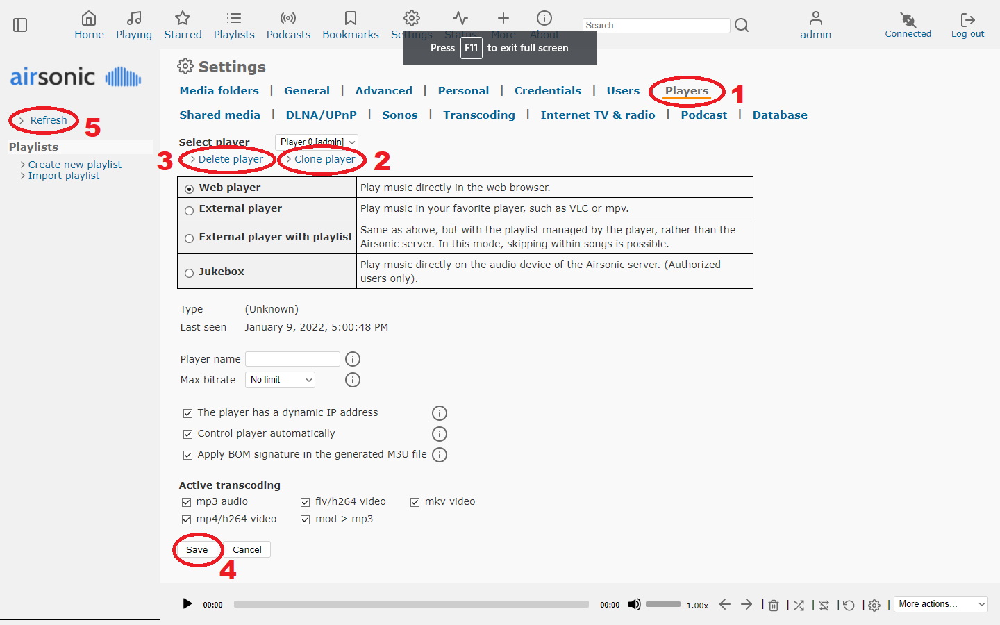{: width="1440" height="900" loading="lazy"}

=== "Einrichtungsdetails"

    Das Installations-, Konfigurations- und Datenverzeichnis befindet sich unter:

    ```
    /mnt/dietpi_userdata/airsonic
    ```

=== "Dienststeuerung"

Da Airsonic-Advanced als Systemdienst l&auml;uft, kann es mit folgenden Befehlen gesteuert werden:

    ```sh
    systemctl status airsonic
    ```

    ```sh
    systemctl start airsonic
    ```

    ```sh
    systemctl stop airsonic
    ```

    ```sh
    systemctl restart airsonic
    ```

=== "Protokolle"

    Da Airsonic-Advanced als systemd-Dienst ausgef&uuml;hrt wird, k&ouml;nnen seine Protokolle angezeigt werden &uuml;ber:

    ```sh
    journalctl -u airsonic
    ```

=== "Aktualisieren"

    Airsonic-Advanced kann durch einfache Neuinstallation aktualisiert werden:

    ```sh
    dietpi-software reinstall 33
    ```

***

Quellcode: <https://github.com/airsonic-advanced/airsonic-advanced>
Lizenz: [GPLv3](https://github.com/airsonic-advanced/airsonic-advanced/blob/master/LICENSE.txt)

## Logitech-Medienserver

Logitech Media Server (alias LMS, Squeezebox Server) ist die Serversoftware, die die Steuerung &uuml;ber die Webschnittstelle erm&ouml;glicht von:

- Software-Audioplayer: Squeezelite
- Hardware-Audioplayer von Logitech: Squeezebox, SlimDevices

Anmerkung: Wenn Sie keinen Hardware-Player besitzen, k&ouml;nnen Sie Ihr DietPi-System in einen Squeezebox-Audio-f&auml;higen Player verwandeln, indem Sie Squeezelite zur Installation in `dietpi-software` ausw&auml;hlen.

{: width="400" height="216" loading="lazy"}

=== "Zugriff auf die Weboberfl&auml;che"

    Das Webinterface ist &uuml;ber Port **9000** erreichbar:

    - URL = `http://<Ihre.IP>:9000`

=== "Musik &uuml;bertragen/hinzuf&uuml;gen"

    Stellen Sie sicher, dass Sie einen der [Dateiserver](../file_servers/) von DietPi installiert haben.
    Von Mopidy verwendete Ordner:

    - Ordner = `/mnt/dietpi_userdata/Music`

=== "Squeezelite-Befehlszeilenoptionen &auml;ndern"

    - F&uuml;hren Sie `dietpi-services` aus
    - W&auml;hlen Sie `Squeezelite` aus
    - W&auml;hlen Sie `Bearbeiten`.
    - Setzen Sie den Eintrag `ExecStart` zur&uuml;ck und setzen Sie ihn erneut:

      ```systemd
      ExecStart=
      ExecStart=/usr/bin/squeezelite [<your custom arguments>]
      ```

    Das erste `ExecStart=` wird ben&ouml;tigt, um den vorhandenen `ExecStart`-Eintrag zu ersetzen, anstatt einen zweiten hinzuzuf&uuml;gen.

    - &Auml;nderungen mit ++ctrl+o++ speichern und `dietpi-services` beenden
    - Starten Sie den Dienst neu: `systemctl restart squeezelite`

=== "Aktualisieren"

    Um Logitech Media Server auf die aktuelle Version zu aktualisieren, f&uuml;hren Sie Folgendes aus

    ```sh
    dietpi-software reinstall 35
    ```

## Squeezelit

Squeezelite ist der Audioplayer f&uuml;r den Logitech Media Server.

{: width="400" height="216" loading="lazy"}

=== "Zugriff auf die Weboberfl&auml;che"

    Das Webinterface ist &uuml;ber Port **9000** erreichbar:

    - URL = `http://<Ihre.IP>:9000`

=== "Musik &uuml;bertragen/hinzuf&uuml;gen"

    Stellen Sie sicher, dass Sie einen der [Dateiserver](../file_servers/) von DietPi installiert haben.
    Von Mopidy verwendete Ordner:

    - Ordner = `/mnt/dietpi_userdata/Music`

=== "Squeezelite-Befehlszeilenoptionen &auml;ndern"

    - F&uuml;hren Sie `dietpi-services` aus
    - W&auml;hlen Sie `Squeezelite` aus
    - W&auml;hlen Sie `Bearbeiten`.
    - Setzen Sie den Eintrag `ExecStart` zur&uuml;ck und setzen Sie ihn erneut:

      ```systemd
      ExecStart=
      ExecStart=/usr/bin/squeezelite [<your custom arguments>]
      ```

      Das erste `ExecStart=` wird ben&ouml;tigt, um den vorhandenen `ExecStart`-Eintrag zu ersetzen, anstatt einen zweiten hinzuzuf&uuml;gen.

      - &Auml;nderungen mit ++ctrl+o++ speichern und `dietpi-services` beenden
      - Starten Sie den Dienst neu: `systemctl restart squeezelite`

##Shairport-Sync

Shairport Sync ist ein AirPlay-Audioplayer, der Audio abspielt, das von iTunes, iOS-Ger&auml;ten und AirPlay-Quellen von Drittanbietern wie ForkedDaapd und Airfoil gestreamt wird.
Audio, das von einem Shairport Sync-betriebenen Ger&auml;t wiedergegeben wird, bleibt mit der Quelle und damit mit &auml;hnlichen Ger&auml;ten, die dieselbe Quelle wiedergeben, synchronisiert. Dies erm&ouml;glicht synchronisiertes Multiroom-Audio auf mehreren Ger&auml;ten.

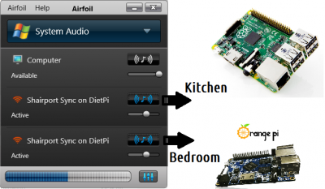{: width="400" height="233" loading="lazy"}

=== "AirPlay-Ger&auml;tename"

      F&uuml;hren Sie bei der Suche nach einem Airplay-Ger&auml;t `shairport-sync` auf DietPi aus.

=== "Von Android und iPad/iPhone streamen"

      Es gibt viele AirPlay-Player f&uuml;r Android (zB [AirPlay For Android](https://play.google.com/store/apps/details?id=com.screen.mirroring.airplay.streamtotv&hl=de)) und iPad/ iPhone (zB [AirPlay](https://support.apple.com/en-gb/HT204289)).
      Laden Sie den Player Ihrer Wahl herunter und verwenden Sie ihn.

=== "Von einem Windows/Mac-PC streamen"

      Airfoil ist eine Anwendung, mit der Sie die Audiowiedergabe direkt auf jedes Shairport Sync-Ger&auml;t streamen k&ouml;nnen. Dr&uuml;cken Sie auf Ihrem bevorzugten Musikplayer (z. B. Winamp/Spotify) auf Play und klicken Sie auf den Lautsprecher neben dem DietPi-Ger&auml;t.

=== "Audiophile - Meistere Musik in Echtzeit"

      Wenn Sie einen PC + [Airfoil] (https://www.rogueamoeba.com/airfoil/) verwenden, k&ouml;nnen Sie die Musik mithilfe der PC-CPU in Echtzeit mastern. Dadurch k&ouml;nnen alle Ihre Shairport Sync-Ger&auml;te noch besser klingen, ohne dass die Leistung des Ger&auml;ts beeintr&auml;chtigt wird.

=== "Mehrere Shairport-Ger&auml;te / Shairport Sync-Namen &auml;ndern"

      Wenn Sie vorhaben, mehrere Shairport-Ger&auml;te im selben Netzwerk zu verwenden, stellen Sie bitte sicher, dass der Hostname jedes Ger&auml;ts eindeutig ist. Der Hostname wirkt sich auch auf den `shairport-sync`-Namen aus.
      Dies kann in `dietpi-config` \> `Security Options` \> `Change Hostname` abgeschlossen werden.

=== "Soxr-Interpolation"

      Die Soxr-Interpolation verbessert die Audioausgabequalit&auml;t auf Shairport. Allerdings ist es extrem CPU-intensiv.
      Soxr aktivieren:

    ```sh
    sed -i '/interpolation = /c\interpolation = "soxr";' /usr/local/etc/shairport-sync.conf
    systemctl restart shairport-sync
    ```

    Soxr deaktivieren:

    ```sh
    sed -i '/interpolation = /c\\/\/interpolation = "soxr";' /usr/local/etc/shairport-sync.conf
    systemctl restart shairport-sync
    ```

    Bei abgehackter Wiedergabe mit Soxr:
    Das Erh&ouml;hen der `shairplay-sync`-Prozesspriorit&auml;t (nice) kann das Problem l&ouml;sen.

    - F&uuml;hren Sie `dietpi-services` vom Terminal aus
    - W&auml;hlen Sie `shairport-sync` &uuml;ber die Auf-/Ab-Tasten und dr&uuml;cken Sie dann ++enter++
    - W&auml;hlen Sie `CPU Nice` &uuml;ber die Auf-/Ab-Tasten und dr&uuml;cken Sie dann ++enter++
    - W&auml;hlen Sie "-20: (H&ouml;chste Priorit&auml;t)" &uuml;ber die Aufw&auml;rtstaste und dr&uuml;cken Sie dann ++enter++

    DietPi wird sich dann automatisch bewerben und das Nice-Level einstellen.

    Wenn die abgehackte Wiedergabe fortgesetzt wird, reicht die CPU h&ouml;chstwahrscheinlich nicht f&uuml;r die Verarbeitung aus, die f&uuml;r Soxr erforderlich ist. Dann sollte Soxr deaktiviert werden.

## ReadyMedia

Streamen Sie Ihre freigegebenen Medien auf jedes DLNA/UPnP-f&auml;hige Ger&auml;t.

{: width="351" height="341" loading="lazy"}

=== "Zugriff auf ReadyMedia-Status"

    Das Webinterface ist &uuml;ber Port **8200** erreichbar:

    - URL = `http://<Ihre.IP>:8200`

=== "Mediendateien auf ReadyMedia &uuml;bertragen"

    Stellen Sie sicher, dass Sie einen der [Dateiserver](../file_servers/) von DietPi installiert haben.
    Von ReadyMedia verwendete Ordner:

    - `/Musik`
    - `/Bilder`
    - `/Video`

=== "ReadyMedia-Datenbank aktualisieren"

Die Datenbank kann mit diesem Befehl aktualisiert werden:

    ```sh
    rm -r /mnt/dietpi_userdata/.MiniDLNA_Cache/* && systemctl restart minidlna
    ```

***

Verf&uuml;gbare UPnP-Clients: <https://www.wikipedia.org/wiki/List_of_UPnP_AV_media_servers_and_clients#UPnP_AV_clients>

## Ampache

Eine webbasierte Audio-/Video-Streaming-Anwendung und ein Dateimanager, mit dem Sie von &uuml;berall und mit fast jedem internetf&auml;higen Ger&auml;t auf Ihre Musik und Videos zugreifen k&ouml;nnen.

Installiert auch:

- Webserver-Stack

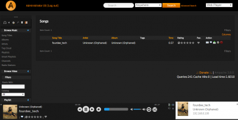{: width="400" height="202" loading="lazy"}

=== "Zugriff auf die Weboberfl&auml;che"

    - URL = `http://<your.IP>/ampache`
    - Benutzername = `admin`
    - Passwort = `dietpi`

=== "Mediendateien auf ReadyMedia &uuml;bertragen"

    Stellen Sie sicher, dass Sie einen der [Dateiserver](../file_servers/) von DietPi installiert haben.
    Von Ampache verwendete Ordner:

    - audio = `/mnt/dietpi_userdata/Music`
    - Videos = `/mnt/dietpi_userdata/Video`

=== "Nach Medien suchen, Ampache-Datenbank aktualisieren"

    DietPi f&uuml;gt w&auml;hrend der Installation automatisch verschiedene Katalogverzeichnisse zu Ampache hinzu. Sie k&ouml;nnen diese Verzeichnisse nach Bedarf &auml;ndern, bevor Sie Ihren ersten Scan ausf&uuml;hren.
    So starten Sie den Scan und importieren Ihre Medien in Ampache:

    - W&auml;hlen Sie die Schaltfl&auml;che `Admin`.
    - W&auml;hlen Sie auf der linken Seite `Kataloge anzeigen`.
    - W&auml;hlen Sie `Alle aktualisieren`.

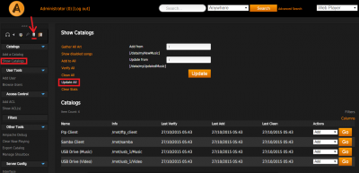{: width="400" height="193" loading="lazy"}

=== "Benutzerdefinierte Medienordner hinzuf&uuml;gen"

    - W&auml;hlen Sie die Schaltfl&auml;che `Admin`.
    - W&auml;hlen Sie auf der linken Seite `Katalog hinzuf&uuml;gen`.
    - Geben Sie die Details Ihres Pfads ein (siehe Bildbeispiel unten, um den Musikordner Ihres USB-Laufwerks zu Ampache hinzuzuf&uuml;gen).
    - W&auml;hlen Sie die Schaltfl&auml;che `Katalog hinzuf&uuml;gen`.

Anmerkung: Damit Ampache auf benutzerdefinierte Verzeichnisse zugreifen kann, m&uuml;ssen Sie den Lesezugriff auf den Ordner sicherstellen, z. B. durch:

    ```sh
    chmod -R 775 /my/directory
    ```

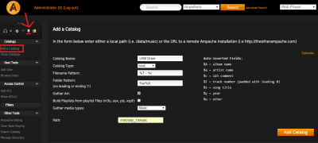{: width="400" height="180" loading="lazy"}

=== "Zus&auml;tzliche Dateiformate per Transkodierung aktivieren"

    - <https://github.com/ampache/ampache/wiki/Transcoding>
    - Um zB die Wiedergabe von .m4a zu erm&ouml;glichen:

      ```sh
      G_CONFIG_INJECT 'transcode_m4a[[:blank:]]' 'transcode_m4a = allowed' /var/www/ampache/config/ampache.cfg.php
      ```

=== "Ampache aktualisieren"

    F&uuml;hren Sie aus, um Ampache auf die aktuelle Version zu aktualisieren

    ```sh
    dietpi-software reinstall 40
    ```

## Emby

Ein Webinterface-Media-Streaming-Server. Denken Sie an Kodi, aber verwenden Sie jedes Ger&auml;t mit einem Webbrowser.

??? Hinweis `Transkodierleistung auf SBC`

    Die Leistung der Videotranskodierung auf SBC-Ger&auml;ten ist tr&auml;ge und kann sogar auf dem RPi 3 stottern:
    <https://github.com/MichaIng/DietPi/issues/310#issuecomment-216262850>
    SBCs sollten nur f&uuml;r Musik in Ordnung sein.
    Eine virtuelle Maschine wird f&uuml;r die Videotranscodierung dringend empfohlen:
    <https://github.com/MichaIng/DietPi/issues/310#issuecomment-219067830>

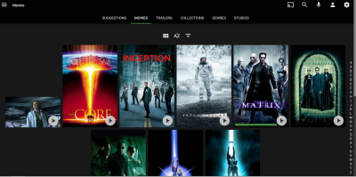{: width="400" height="199" loading="lazy"}

=== "Zugriff auf die Weboberfl&auml;che"

    Das Webinterface ist &uuml;ber Port **8096** erreichbar:

    URL = `http://<Ihre.IP>:8096`

=== "Erste Ausf&uuml;hrung einrichten"

    Sobald Sie mit der Weboberfl&auml;che verbunden sind, folgen Sie einfach den Anweisungen auf dem Bildschirm.
    Wenn Sie Ihre Medienbibliotheken einrichten erreichen:

    ```sh
    /mnt/dietpi_userdata/Music
    /mnt/dietpi_userdata/Video
    ```

    Sie k&ouml;nnen auch Samba/NFS-Freigaben mounten, indem Sie `dietpi-drive_manager` ausf&uuml;hren und `Mount network drive` aus dem Men&uuml; ausw&auml;hlen.

=== `Mediendateien auf Ihr Ger&auml;t &uuml;bertragen`

    Stellen Sie sicher, dass Sie einen der [Dateiserver](../file_servers/) von DietPi installiert haben.
    Von Emby verwendete Ordner:

- Audio: `/mnt/dietpi_userdata/Music`
- Videos: `/mnt/dietpi_userdata/Video`

=== "Protokolle anzeigen"

    Um Emby-Serverprotokolle anzuzeigen, f&uuml;hren Sie den folgenden Befehl von der Konsole aus:

    ```sh
    journalctl -u emby-server
    ```

=== "Aktualisieren"

    Um die Emby Server-Version zu aktualisieren, installieren Sie einfach Emby Server neu, um ihn auf die neueste Version zu aktualisieren. Es beh&auml;lt alle vorhandenen Daten und Einstellungen bei:

    ```sh
    dietpi-software reinstall 41
    ```

***

YouTube-Video-Tutorial: *DietPi Emby Media Server Setup auf Raspberry Pi 3 B Plus*.

<iframe src="https://www.youtube-nocookie.com/embed/zEcNNLCFngI?rel=0" frameborder="0" allow="fullscreen" width="560" height="315" loading="lazy" ></iframe>

## Plex-Medienserver

Plex organisiert Ihre Video-, Musik- und Fotosammlungen und streamt sie auf alle Ihre Bildschirme. Auch bekannt als "Webinterface Media Streaming Server".

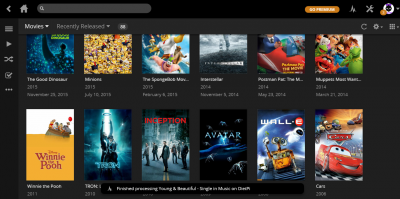{: width="400" height="199" loading="lazy"}

=== "Zugriff auf die Weboberfl&auml;che"

    Das Webinterface verwendet Port **32400**:

    URL = `http://<Ihre.IP>:32400/web`

=== "Erste Ausf&uuml;hrung einrichten"

    Bitte befolgen Sie die Anweisungen auf dem Bildschirm, um den Einrichtungsassistenten abzuschlie&szlig;en:

    - Erstellen Sie Ihr Plex-Konto, indem Sie sich anmelden.
    - Geben Sie Ihrem Server einen Namen (zB: `DietPi-Plex`)
    - Klicken Sie auf "Bibliothek", um Ihre Medienspeicherorte einzurichten:

        ```
        /mnt/dietpi_userdata/Music
        /mnt/dietpi_userdata/Video
        ```

    Sie k&ouml;nnen auch Samba/NFS-Freigaben mounten, indem Sie `dietpi-drive_manager` ausf&uuml;hren und `Mount network drive` aus dem Men&uuml; ausw&auml;hlen.

=== `Mediendateien auf Ihr Ger&auml;t &uuml;bertragen`

    Stellen Sie sicher, dass Sie einen der [Dateiserver](../file_servers/) von DietPi installiert haben.
    Von Plex Media Server verwendete Ordner:

    - Audio = `/mnt/dietpi_userdata/Music`
    - Video = `/mnt/dietpi_userdata/Video`

***

Tutorial: [Einrichtungsanleitung f&uuml;r Plex auf Raspberry Pi](https://blog.barnettjones.com/2020/11/26/dietpi-plex-setup/)

YouTube-Video-Tutorial: `Raspberry Pi 4 - Plex TV Media Server unter DietPi installieren und Zugriff von aussen (FritzBox)`.

<iframe src="https://www.youtube-nocookie.com/embed/EElrNjXc3aA?rel=0" frameborder="0" allow="fullscreen" width="560" height="315" loading="lazy" ></iframe>

##Tautulli

Ein Python-basiertes &Uuml;berwachungs- und Tracking-Tool f&uuml;r Plex Media Server.

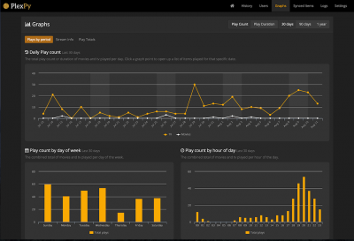{: width="400" height="273" loading="lazy"}

=== "Zugriff auf die Weboberfl&auml;che"

    Das Webinterface ist &uuml;ber Port **8181** erreichbar:

    - URL = `http://<Ihre.IP>:8181`

=== "Zugriff auf die Logdateien"

    ```
    /mnt/dietpi_userdata/plexpy/logs/
    ```

## Murmeln

Verwandeln Sie Ihr Ger&auml;t in einen leichten Mumble-VoIP-Server.

{: width="100" height="100" loading="lazy"}

=== "Verbindungsdetails zum Murmur-Server"

    Der Server ist &uuml;ber Port **64738** erreichbar:

    - URL = `http://<Ihre.IP>:64738`
    - Passwort = Kein Passwort erforderlich
    - Superuser-Passwort = `dietpi`

=== "Murmur-Server-Einstellungen &auml;ndern"

Sie m&uuml;ssen die Murmur-Konfigurationsdatei bearbeiten:

    ```sh
    nano /etc/mumble-server.ini
    systemctl restart mumble-server
    ```

## Roon-Bridge

Verwandelt Ihren SBC in einen Roon-f&auml;higen Audioplayer. Indem Sie die Roon-Hauptanwendung auf einem anderen Ger&auml;t verwenden, k&ouml;nnen Sie Ihren Musikkatalog direkt auf die Roon Bridge streamen, die auf Ihrem SBC l&auml;uft.

{: width="150" height="81" loading="lazy"}

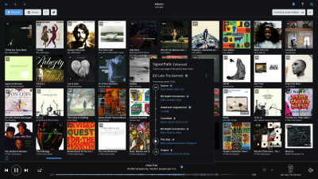{: width="400" height="225" loading="lazy"}

=== "Anforderungen"

    Roon auf einem anderen System (zB: Windows-PC), um den Player zu steuern.
    [Roon-Lizenz](https://roonlabs.com/pricing) (kostenlose Testversion ist ebenfalls verf&uuml;gbar).

***

Offizielle Website: <https://roonlabs.com/>
Offizielles Forum: <https://community.roonlabs.com/>
YouTube-Videos von `David Snyder`: <https://www.youtube.com/c/dsnyder0cnn/search?query=roon>

## Roon-Server

Verwandelt Ihr Ger&auml;t in einen Roon-f&auml;higen Audioplayer und Coreserver.

{: width="150" height="81" loading="lazy"}

{: width="400" height="134" loading="lazy"}

=== "Installieren Sie eine Roon Remote auf einem anderen System"

    Sie k&ouml;nnen die Roon Remote Apps verwenden, um den Roon Server zu steuern und zu konfigurieren: <https://roonlabs.com/downloads>

=== `Empfohlenes Musikspeicherverzeichnis`

    Bei der Konfiguration Ihres Roon Servers empfehlen wir dringend, das DietPi-Benutzerdatenverzeichnis zu verwenden. Auf diese Weise k&ouml;nnen Sie Musik einfach &uuml;ber das Netzwerk &uuml;bertragen (siehe Musik &uuml;bertragen unten) und die Musik auf Ihrem Roon Server-System speichern:

    ```
    /mnt/dietpi_userdata/Music
    ```

=== `Mediendateien auf Ihr Ger&auml;t &uuml;bertragen`

    Stellen Sie sicher, dass Sie einen der [Dateiserver](../file_servers/) von DietPi installiert haben.
    Von Roon Server verwendete Ordner:

    - Musikverzeichnis = `/mnt/dietpi_userdata/Music`
    - Zugriff &uuml;ber Dateiserver = `/Music`

=== "Verzeichnisse"

    Die Roon Server Installation finden Sie unter:

    ```
    /opt/roonserver
    ```

    Seine Konfiguration und Daten finden Sie unter:

    ```
    /mnt/dietpi_userdata/roonserver
    ```

=== "Dienststeuerung"

    Roon Server wird standardm&auml;&szlig;ig als systemd-Dienst gestartet und kann daher mit den folgenden Befehlen gesteuert werden:

    ```sh
    systemctl status roonserver
    ```

    ```sh
    systemctl stop roonserver
    ```

    ```sh
    systemctl start roonserver
    ```

    ```sh
    systemctl restart roonserver
    ```

=== "Protokolle anzeigen"

    Dienstprotokolle k&ouml;nnen mit dem folgenden Befehl &uuml;berpr&uuml;ft werden:

    ```sh
    journalctl -u roonserver
    ```

    Ausf&uuml;hrlichere Protokolle der einzelnen Roon-Serverkomponenten finden Sie in den folgenden Dateien:

- `/mnt/dietpi_userdata/roonserver/RAATServer/Logs/RAATServer_log.txt`
- `/mnt/dietpi_userdata/roonserver/RoonServer/Logs/RoonServer_log.txt`
- `/mnt/dietpi_userdata/roonserver/RoonGoer/Logs/RoonGoer_log.txt`

=== "Auf neueste Version aktualisieren"

    Der Roon Server wird mit einem internen Updater geliefert, der verwendet werden sollte. Wenn die Installation in irgendeiner Weise besch&auml;digt ist, k&ouml;nnen Sie sie mit den folgenden Befehlen reparieren:

    ```sh
    rm -R /opt/roonserver
    dietpi-software reinstall 154
    ```

***

Offizielle Website: <https://roonlabs.com/>
Offizielles Forum: <https://community.roonlabs.com/>
YouTube-Videos von `David Snyder`: <https://www.youtube.com/c/dsnyder0cnn/search?query=roon>

## Roon-Erweiterungsmanager

Beim Start greift der Roon Extension Manager auf ein Repository zu, das die von der Community entwickelten Erweiterungen enth&auml;lt. &Uuml;ber `Einstellungen` \> `Erweiterungen` innerhalb von Roon kann das Repository eingesehen und eine Erweiterung ausgew&auml;hlt werden, um eine bestimmte Aktion auszuf&uuml;hren.

{: width="150" height="81" loading="lazy"}

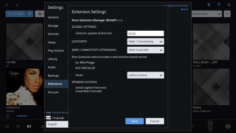{: width="400" height="225" loading="lazy"}

***

Details und Nutzungsinformationen: <https://community.roonlabs.com/t/roon-extension-manager-v0-11-8/26632>
Credits: Vielen Dank an @JanKoudijs f&uuml;r den Beitrag zu DietPi

## NAA-Daemon

Mit dem Signalyst Network Audio Adapter (NAA)-Daemon k&ouml;nnen Sie Musik von einer HQPlayer-Quelle (wie Windows) streamen und direkt von Ihrem DietPi-Ger&auml;t ausgeben. Verf&uuml;gt &uuml;ber DRC, hochwertiges Upsampling (wie 192 kHz) und mehr.
Funktioniert auch mit Roon.

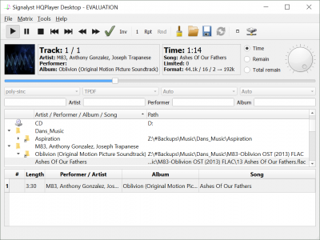{: width="400" height="300" loading="lazy"}

=== "HQPlayer Desktop (Windows)"

Dadurch k&ouml;nnen Sie Audio von Ihrem Windows-PC zum NAA-Daemon auf dem DietPi-Ger&auml;t streamen.

    - Laden Sie HQPlayer Desktop f&uuml;r Windows herunter und installieren Sie es:
      <https://www.signalyst.eu/consumer.html>
    - F&uuml;hren Sie das Programm aus
    - So konfigurieren Sie HQPlayer f&uuml;r die Verwendung des NAA-Daemons auf dem DietPi-Ger&auml;t:
        - W&auml;hlen Sie `Datei` und dann `Einstellungen`.
        - W&auml;hlen Sie unter `Backend` `NetworkAudioAdapter` aus. Das DietPi-Ger&auml;t sollte automatisch erkannt werden.
        - Klicken Sie auf `OK`, um die &Auml;nderungen zu speichern

=== "Wie verwende ich Roon und HQPlayer zusammen?"

    Leitfaden: <https://help.roonlabs.com/portal/en/kb/articles/faq-how-do-i-use-roon-and-hqplayer-together>

=== "Updatemethode um zu aktualisieren"

    ```sh
    dietpi-software reinstall 124
    ```

***

Website: <https://www.signalyst.eu/consumer.html>

## IceCast

Shoutcast-Streaming-Server, enth&auml;lt DarkIce f&uuml;r die Audioeingabe, wie ein Mikrofon.

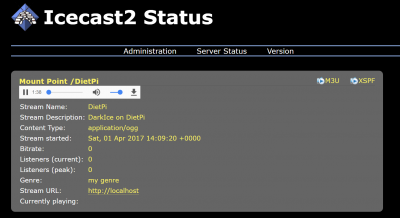{: width="400" height="218" loading="lazy"}

=== "Installationshinweise"

DietPi wird versuchen, w&auml;hrend der Installation Mikrofoneingaben zu erkennen und auf DarkIce anzuwenden. Wenn kein Mikrofon verf&uuml;gbar war oder Probleme auftreten, &uuml;berpr&uuml;fen Sie verf&uuml;gbare Mikrofone mit:

    ```sh
    arecord -l
    ```

    - Bearbeiten Sie dann den Ger&auml;teeintrag in `/etc/darkice.cfg`, oder
    - Einfach kopieren und einf&uuml;gen:

        ```sh
        sed -i "/^device[[:blank:]]/c\device = hw:$(arecord -l | mawk -F'[ :]' '/card/{print $2;exit}'),0" /etc/darkice.cfg
        ```

    - Starten Sie den DarkIce-Dienst neu:

        ```sh
        systemctl restart darkice
        ```

    Wir erstellen `systemd`-Dienste f&uuml;r IceCast und DarkIce, die automatisch von DietPi gestartet werden. Sie k&ouml;nnen ihren Status &uuml;berpr&uuml;fen, indem Sie den folgenden Befehl ausf&uuml;hren:

    ```sh
    systemctl status icecast2
    systemctl status darkice
    ```

=== "Zugriff auf die IceCast-Weboberfl&auml;che"

    Das Webinterface ist &uuml;ber Port **8000** erreichbar:

    - URL = `http://<Ihre.IP>:8000`
    - Admin-Benutzer = `admin`
    - Admin-Passwort = `<Ihr globales Passwort>` (Standard: `dietpi`)
    - Quellpasswort = `<Ihr globales Passwort>` (Standard: `dietpi`)
    - Relay-Passwort = `<Ihr globales Passwort>` (Standard: `dietpi`)

=== `Aufzeichnungsdatei zugreifen`

    Dies ist standardm&auml;&szlig;ig deaktiviert.

    - Eine Aufzeichnung des Streams kann aktiviert werden, indem `/etc/darkice.cfg` bearbeitet und dann auskommentiert wird

        ```
        localDumpFile = /mnt/dietpi_userdata/darkice_recording.ogg
        ```

    - Starten Sie den DarkIce-Dienst neu:

        ```sh
        systemctl restart darkice
        ```

    - Eine Aufzeichnung wird dann an folgendem Ort gespeichert: `/mnt/dietpi_userdata/darkice_recording.ogg`

=== "Konfigurationsdateien"

    - IceCast: `/etc/icecast2/icecast.xml`
    - DarkIce: `/etc/darkice.cfg`

=== "Protokolle anzeigen"

    F&uuml;hren Sie die folgenden Befehle auf einer Konsole aus, um Protokolle f&uuml;r IceCast und DarkIce anzuzeigen:

    ```sh
    journalctl -u icecast2
    journalctl -u darkice
    ```

    IceCast erstellt zus&auml;tzlich Zugriffs- und Fehlerprotokolldateien unter: `/var/log/icecast2/`

=== "Auf neueste Version aktualisieren"

    IceCast und DarkIce werden aus dem Debian APT-Repository installiert und k&ouml;nnen daher durch Ausf&uuml;hren der folgenden Befehle aktualisiert werden:

    ```sh
    apt update
    apt install icecast2 darkice
    ```

## Koel

Musikstreamer mit Webinterface.

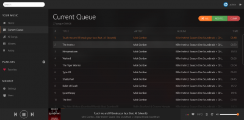{: width="400" height="197" loading="lazy"}

=== "Zugriff auf die Weboberfl&auml;che"

    Das Webinterface ist &uuml;ber Port **8003** erreichbar:

    - URL = `http://<Ihre.IP>:8003`
    - E-Mail-Adresse = `admin@koel.dev`
    - Passwort = `KoelIsCool`

=== "Erste Ausf&uuml;hrung einrichten"

    Wir empfehlen dringend, die E-Mail-Adresse und das Passwort des Admin-Benutzers zu &auml;ndern:

    1. Melden Sie sich an der Weboberfl&auml;che an
    2. W&auml;hlen Sie unten im Navigationsbereich auf der linken Seite `Benutzer` aus
    3. Gehen Sie jedoch &uuml;ber die Benutzerkachel und w&auml;hlen Sie `Profil aktualisieren`
    4. &Auml;ndern Sie den Namen und die Anmeldeinformationen und w&auml;hlen Sie `Speichern`

=== `Mediendateien auf Ihr Ger&auml;t &uuml;bertragen`

    Stellen Sie sicher, dass Sie einen der [Dateiserver](../file_servers/) von DietPi installiert haben.
    Von Koel verwendete Verzeichnisse:

    - Lokal = `/mnt/dietpi_userdata/Music`
    - Zugriff &uuml;ber Dateiserver = `/Music`

=== "Protokolle anzeigen"

    Um Koel-Dienstprotokolle anzuzeigen, f&uuml;hren Sie den folgenden Befehl von der Konsole aus:

    ```sh
    journalctl -u koel
    ```

=== "Auf neueste Version aktualisieren"

Um Koel auf die neueste Version zu aktualisieren, installieren Sie es einfach neu:

    ```sh
    dietpi-software reinstall 143
    ```

***

Offizielle Website: <https://koel.dev/>
Offizielle Dokumentation: <https://docs.koel.dev/>
Quellcode: <https://github.com/koel/koel>
Lizenz: [MIT](https://github.com/koel/koel/blob/master/LICENSE.md)

## GMediaRender

Ein DLNA-Audio-Renderer/-Endpunkt. Erm&ouml;glicht das Streamen und Abspielen von Musik von einem anderen Ger&auml;t wie [BubbleUPnP](https://play.google.com/store/apps/details?id=com.bubblesoft.android.bubbleupnp).

{: width="128" height="128" loading="lazy"}

## Ubooquity

Ubooquity ist ein kostenloser Heimserver f&uuml;r Ihre Comics- und E-Books-Bibliothek mit Remote-Webschnittstellenanzeige.

{: width="400" height="188" loading="lazy"}

=== "Zugriff auf die Weboberfl&auml;che"

    Das Webinterface verwendet Port **2038** bzw. **2039**:

    - Admin-Seite = `http://<your.IP>:2038/admin`
    - Bibliotheksansichtsseite = `http://<your.IP>:2039`

=== `E-Books/Comics auf Ihr Ger&auml;t &uuml;bertragen`

    Stellen Sie sicher, dass Sie einen der [Dateiserver](../file_servers/) von DietPi installiert haben.

    - Verwenden Sie die folgenden Ordner = `/mnt/dietpi_userdata/ebooks` und `/mnt/dietpi_userdata/comics`
    - Verwenden Sie dann die Admin-Seite, um die oben genannten Speicherorte f&uuml;r E-Books und Comics festzulegen
    - F&uuml;hren Sie einen Scan auf der Admin-Seite durch, um die Datenbank zu aktualisieren

=== "Auf neueste Version aktualisieren"

    ```sh
    dietpi-software reinstall 80
    ```

***

YouTube-Video-Tutorial: *DietPi Ubooquity Comics und Ebook Reader auf Raspberry Pi 3 B Plus*.

<iframe src="https://www.youtube-nocookie.com/embed/xUewleo7f2Q?rel=0" frameborder="0" allow="fullscreen" width="560" height="315" loading="lazy" ></iframe>

##Komga

Kostenloser und Open-Source-Comic-/Mangas-Medienserver mit Web-Benutzeroberfl&auml;che.

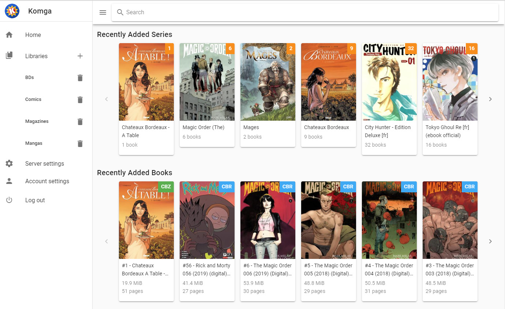{: width="500" height="306" loading="lazy"}

=== "Zugriff auf die Weboberfl&auml;che"

    Das Webinterface ist &uuml;ber Port **2037** erreichbar:

    - URL = `http://<Ihre.IP>:2037`

=== "Datenverzeichnis"

    Variable Daten und Konfigurationen werden im folgenden Verzeichnis gespeichert:

    ```
    /mnt/dietpi_userdata/komga
    ```

=== "Konfigurationsdatei"

    Die Konfigurationsdatei befindet sich an folgendem Speicherort:

    ```
    /mnt/dietpi_userdata/komga/application.yml
    ```

    Sie m&uuml;ssen den Dienst neu starten, damit die &Auml;nderungen wirksam werden:

    ```sh
    systemctl restart komga
    ```

=== "Datei-Hashing"

    Datei-Hashing ist bei Installationen &uuml;ber DietPi standardm&auml;&szlig;ig deaktiviert, um die CPU-Last f&uuml;r kleine Hardware zu reduzieren. Der Nachteil ist, dass Komga beim Verschieben oder Umbenennen von Mediendateien keine Metadaten und Lesestatus angeh&auml;ngt behalten kann, da der Datenbankeintrag mit dem Dateipfad verkn&uuml;pft ist. Der urspr&uuml;ngliche Medieneintrag wird in der Bibliothek weiterhin als `nicht verf&uuml;gbar` angezeigt, sodass Sie Metadaten manuell in den neuen Eintrag kopieren k&ouml;nnen. Um den alten Eintrag zu entfernen, l&ouml;schen Sie den Papierkorb der Bibliothek.

    Wenn Datei-Hashing aktiviert ist, werden Datenbankeintr&auml;ge und damit Metadaten und Lesestatus dem Datei-Hash zugeordnet, sodass er intakt bleibt, wenn Dateien nur verschoben oder umbenannt werden, mit dem Nachteil zus&auml;tzlicher CPU-Belastung und Ressourcennutzung, insbesondere auf kleinerer Hardware. Um das Datei-Hashing zu aktivieren, setzen Sie den folgenden Eintrag in der Konfigurationsdatei:

    ```yaml
    file-hashing: true
    ```

    Lesen Sie mehr: <https://komga.org/guides/trash.html#file-hashes>

=== "Protokolle anzeigen"

    Protokolle werden im Systemjournal gespeichert und k&ouml;nnen durch Ausf&uuml;hren des folgenden Befehls angezeigt werden:

    ```sh
    journalctl -u komga
    ```

Wenn Sie eine Dateiprotokollierung ben&ouml;tigen, legen Sie einen Pfad &uuml;ber die Konfigurationsdatei fest, z.

    ```yaml
    logging:
      file:
        name: "/var/log/komga/komga.log"
    ```
    
    Stellen Sie sicher, dass das Verzeichnis existiert und der Benutzer oder die Gruppe `komga` &uuml;ber Schreibberechtigungen verf&uuml;gt.

=== "Auf neueste Version aktualisieren"

    Um Komga auf die neueste Version zu aktualisieren, installieren Sie es einfach &uuml;ber die DietPi-Software neu:

    ```sh
    dietpi-software reinstall 179
    ```

***

Offizielle Website: <https://komga.org/>
Offizielle Dokumentation: <https://komga.org/guides>
Quellcode: <https://github.com/gotson/komga>
Lizenz: [MIT](https://github.com/gotson/komga/blob/master/LICENSE)

##Raspotify

Spotify Connect-Client f&uuml;r den Raspberry Pi that Just Worksâ`¢.

!!! note `Sie ben&ouml;tigen ein Spotify Premium-Konto, um den Spotify Connect-Client zu verwenden.`

{: width="331" height="100" loading="lazy"}

=== "Optionen &auml;ndern"

    Raspotify sollte direkt nach dem Auspacken funktionieren. Sie k&ouml;nnen die verf&uuml;gbaren Optionen jedoch &auml;ndern in:

    - `/etc/default/raspotify`

    Starten Sie dann den Dienst neu mit:

    ```sh
    systemctl restart raspotify
    ```

=== "Dienststeuerung"

    Der Dienst wird automatisch beim Booten gestartet, aber Sie k&ouml;nnen ihn auch manuell steuern:

    - Dienst manuell starten:

        ```sh
        systemctl start raspotify
        ```

    - Beenden Sie den Dienst manuell:

        ```sh
        systemctl stop raspotify
        ```

    - Dienst manuell neu starten:

        ```sh
        systemctl restart raspotify
        ```

=== "Protokolle anzeigen"

    Zeigen Sie die Dienstprotokolle an &uuml;ber:

    ```sh
    journalctl -u raspotify
    ```

***

Offizielle Website: <https://dtcooper.github.io/raspotify/>
Quellcode: <https://github.com/dtcooper/raspotify>

##Spotify Connect Web

Spotify Connect Web ist ein Konsolen-Client und -Player f&uuml;r Spotify Connect, einschlie&szlig;lich eines Web-Frontends.

=== "Zugriff auf die Weboberfl&auml;che"

    Das Webinterface ist &uuml;ber Port **4000** erreichbar:

    - URL: `http://<Ihre.IP>:4000`

=== "Spotify-API-Schl&uuml;ssel generieren"

    Die Generierung von `spotify_appkey.key` ist erforderlich, um der Anwendung &uuml;ber Ihr Konto Zugriff auf die Spotify-API zu gew&auml;hren.

    F&uuml;llen Sie das Antragsformular aus <https://developer.spotify.com/documentation/general/guides/authorization/app-settings/>.
    Warten Sie, bis es "akzeptiert" wird.

=== "Spotify API-Schl&uuml;ssel &uuml;bertragen"

    Stellen Sie sicher, dass Sie einen der [Dateiserver](../file_servers/) von DietPi installiert haben.
    Kopieren Sie die `spotify_appkey.key` in das folgende Verzeichnis:

    - Verzeichnis: `/mnt/dietpi_userdata/spotify-connect-web`
    - Zugriff vom Dateiserver: `/spotify-connect-web`

=== "Dienststeuerung"

Der Dienst wird automatisch beim Booten gestartet, aber Sie k&ouml;nnen ihn auch manuell steuern:

    - Dienst manuell starten:

        ```sh
        systemctl start spotify-connect-web
        ```

    - Beenden Sie den Dienst manuell:

        ```sh
        systemctl stop spotify-connect-web
        ```

    - Dienst manuell neu starten:

        ```sh
        systemctl restart spotify-connect-web
        ```

=== "Protokolle anzeigen"

    Zeigen Sie die Dienstprotokolle an &uuml;ber:

    ```sh
    journalctl -u spotify-connect-web
    ```

***

Quellcode: <https://github.com/Fornoth/spotify-connect-web>
Schnellstartdokumentation: <https://developer.spotify.com/documentation/web-api/quick-start>

##Spotify

Spotifyd ist ein schlanker FOSS Spotify-Client, der das Spotify Connect-Protokoll unterst&uuml;tzt.

!!! Hinweis `Sie ben&ouml;tigen ein Spotify Premium-Konto, um Spotifyd zu verwenden.`

{: width="331" height="100" loading="lazy"}

=== "Optionen &auml;ndern"

    Spotifyd sollte sofort funktionieren. Sie k&ouml;nnen die verf&uuml;gbaren Optionen jedoch &auml;ndern in:

    - `/mnt/dietpi_userdata/spotifyd/spotifyd.conf`

    Starten Sie dann den Dienst neu mit:

    ```sh
    systemctl restart spotifyd
    ```

=== "Dienststeuerung"

    Der Dienst wird automatisch beim Booten gestartet, aber Sie k&ouml;nnen ihn auch manuell steuern:

    - Dienst manuell starten:

        ```sh
        systemctl start spotifyd
        ```

    - Beenden Sie den Dienst manuell:

        ```sh
        systemctl stop spotifyd
        ```

    - Dienst manuell neu starten:

        ```sh
        systemctl restart spotifyd
        ```

=== "Protokolle anzeigen"

    Zeigen Sie die Dienstprotokolle an &uuml;ber:

    ```sh
    journalctl -u spotifyd
    ```

***

Offizielle Dokumentation: <https://spotifyd.github.io/spotifyd/>
Quellcode: <https://github.com/Spotifyd/spotifyd>
Lizenz: [GPLv3](https://github.com/Spotifyd/spotifyd/blob/master/LICENSE)

## Jellyfin

Ein FOSS-Webinterface-Media-Streaming-Server, einschlie&szlig;lich Live-TV, abgezweigt von Emby.

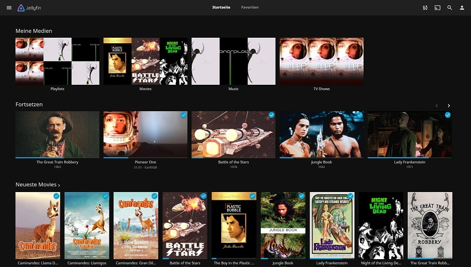{: width="600" height="341" loading="lazy"}

=== "Zugriff auf die Weboberfl&auml;che"

    Das Webinterface ist &uuml;ber Port **8096** erreichbar:

    - URL = `http://<Ihre.IP>:8096`

=== "Protokolle anzeigen"

    - Service:

        ```sh
        journalctl -u jellyfin
        ```

    - Binary: `/var/log/jellyfin/`

=== "Datenverzeichnis"

    `/mnt/dietpi_userdata/jellyfin`

=== "Auf neueste Version aktualisieren"

    Code: Alles ausw&auml;hlen

    ```sh
    apt update
    apt install jellyfin jellyfin-ffmpeg
    ```

***

Quellcode: <https://github.com/jellyfin/jellyfin>

## Beets

Ein Befehlszeilen-Musikorganisator und -manager. Einige der wichtigsten Funktionen sind:

- Flexibler automatischer Metadatenkorrektor und Dateiumbenenner
- Albumcover-Downloader, Songtext-Abrufer und Genre-Identifikator
- Instrument zur &Uuml;berpr&uuml;fung und &Auml;nderung von Musikmetadaten f&uuml;r viele Audiodateitypen

{: width="144" height="144" loading="lazy"}

=== "Schnellstart"

    Beginnen Sie mit der Eingabe von `Beet` in der Befehlszeile. Alle Optionen und Befehle werden verf&uuml;gbar gemacht.
    
    Sie k&ouml;nnten beginnen, Beets zu verwenden, indem Sie Musik mit `beet import` importieren und dann die Bibliothek mit `beet list` abfragen. Zum Beispiel zeigt die n&auml;chste Befehlszeile alle Tangos im Jahr 2010

    ```sh
    beet ls year:2010 genre:Tango
    ```

=== "Konfiguration &auml;ndern"

    Sie k&ouml;nnen die Beets-Konfiguration &auml;ndern, indem Sie die n&auml;chste Datei bearbeiten: `/mnt/dietpi_userdata/beets/config.yaml`.

***

Offizielle Website: <https://beets.io/>
Offizielle Dokumentation: <https://beets.readthedocs.io/en/stable/>
Quellcode: <https://github.com/beetbox/beets>
Lizenz: [MIT](https://github.com/beetbox/beets/blob/master/LICENSE)

## Snapcast-Server

Eine Multiroom-Audiol&ouml;sung von FOSS – dieser Teil ist die Server-App, die Musik zum Abspielen an einen oder mehrere Clients sendet.

{: width="300" height="48" loading="lazy"}

Die Audioquellen des Snapcast-Servers m&uuml;ssen nach der Installation manuell konfiguriert werden. Weitere Einzelheiten finden Sie in den Snapcast-Dokumenten: <https://github.com/badaix/snapcast#server>

=== "Zugriff auf die Weboberfl&auml;che"

    Der Snapcast-Server bietet eine Webschnittstelle auf Port **1780**, mit der Sie die Lautst&auml;rke f&uuml;r alle Clients steuern und optional Audio &uuml;ber Ihren Browser wiedergeben k&ouml;nnen:

    - URL = `http://<Ihre.IP>:1780`

=== "Implementierungsdetails"

    DietPi-Software installiert den Snapcast-Server fast mit den Standardkonfigurationen, wie sie mit dem offiziellen Paket geliefert werden. Nur der JSON-RPC, der standardm&auml;&szlig;ig auf Port **1705** lauscht, ist deaktiviert. Um es zu aktivieren und zu konfigurieren, &uuml;berpr&uuml;fen Sie den Abschnitt `[tcp]` der Konfigurationsdatei (siehe Registerkarte "&Auml;ndern von Optionen").

=== "Optionen &auml;ndern"

    - `/etc/snapserver.conf`

    Starten Sie dann die Dienste neu mit:

    ```sh
    systemctl restart snapserver
    ```

=== "MPD als Eingangsquelle verwenden"

    Wenn Sie MPD installiert haben, k&ouml;nnen Sie es als Eingangsquelle verwenden.

    Zuerst m&uuml;ssen Sie sicherstellen, dass MPD an eine Pipe ausgibt. Sie k&ouml;nnen dies auf zwei Arten tun.
    1) Installieren Sie CAVA aus der Liste der DietPi-Software.
    ODER
    2) F&uuml;gen Sie Folgendes zu `/etc/mpd.conf` hinzu und starten Sie mit `systemctl restart mpd` neu

    ```
    audio_output {
        type "fifo"
        enabled "yes"
        name "snapcast"
        path "/tmp/mpd.fifo"
        format "48000:16:2"
    }
    ```

    Sobald Sie dies getan haben, m&uuml;ssen Sie Folgendes zu `/etc/snapserver.conf` unter `[stream]` hinzuf&uuml;gen. Der `Name` ist der Name, wie er Snapcast-Clients erscheint, hier habe ich ihn `myMPD` genannt. &Uuml;berpr&uuml;fen Sie die Snapcast-Serverdokumentation auf zus&auml;tzliche Parameter, die Sie &uuml;bergeben k&ouml;nnen: <https://github.com/badaix/snapcast/blob/master/doc/configuration.md#pipe>

    ```
    source = pipe:///tmp/mpd.fifo?name=myMPD&mode=read
    ```

=== "Mopidy als Eingabequelle verwenden"

    Wenn Sie Mopidy installiert haben, k&ouml;nnen Sie es als Eingabequelle verwenden.

    Zuerst m&uuml;ssen Sie sicherstellen, dass Mopidy in eine Pipe ausgibt. F&uuml;gen Sie Folgendes zu `/etc/mopiady/mopidy.conf` hinzu und starten Sie mit `systemctl restart mopidy` neu

    ```
    [audio]
    output = audioresample ! audioconvert ! audio/x-raw,rate=48000,channels=2,format=S16LE ! wavenc ! filesink location=/tmp/mopidy.fifo
    ```

Sobald Sie dies getan haben, m&uuml;ssen Sie Folgendes zu `/etc/snapserver.conf` unter `[stream]` hinzuf&uuml;gen. Der `Name` ist der Name, wie er Snapcast-Clients erscheint, hier habe ich ihn `myMopidy` genannt. &Uuml;berpr&uuml;fen Sie die Snapcast-Serverdokumentation auf zus&auml;tzliche Parameter, die Sie &uuml;bergeben k&ouml;nnen: <https://github.com/badaix/snapcast/blob/master/doc/configuration.md#pipe>

    ```
    source = pipe:///tmp/mopidy.fifo?name=myMopidy&mode=read
    ```

=== `Raspotify/librespot als Eingabequelle verwenden`

    Wenn Sie Raspotify installiert haben, k&ouml;nnen Sie es als Eingabequelle verwenden.

    F&uuml;gen Sie die folgende Konfiguration unter `[stream]` hinzu. Der `Name` ist der Name, wie er Snapcast-Clients hier angezeigt wird. Ich habe ihn `mySpotify` genannt. Der `Ger&auml;tename` ist der Name, der beim Verbinden in Spotify angezeigt wird. &Uuml;berpr&uuml;fen Sie die Snapcast-Serverdokumentation auf zus&auml;tzliche Parameter, die Sie &uuml;bergeben k&ouml;nnen: <https://github.com/badaix/snapcast/blob/master/doc/configuration.md#librespot>. Ich habe den Audio-Cache deaktiviert, um die SD-Karte zu sch&uuml;tzen.

    ```
    source = librespot:///usr/bin/librespot?name=mySpotify&devicename=SnapcastSpotify&disable_audio_cache=true
    ```

=== "Verwendung von AirPlay (Shairport Sync) als Eingabe"

    Installieren Sie zuerst `shairport-sync`.

    Dann (im Moment - siehe: <https://github.com/MichaIng/DietPi/issues/4470>) m&uuml;ssen wir die Shairport Sync-Bin&auml;rdatei durch eine ersetzen, die `stdout` unterst&uuml;tzt. Dazu m&uuml;ssen wir eine neue Bin&auml;rdatei kompilieren - Details finden Sie hier:
    <https://github.com/mikebrady/shairport-sync/blob/master/INSTALL.md#build-and-install>

    Sie m&uuml;ssen diese Zeile beim Konfigurieren anstelle der Zeile aus der Dokumentation verwenden:

    ```sh
    ./configure --sysconfdir=/etc --with-alsa --with-soxr --with-avahi --with-ssl=openssl --with-systemd --with-metadata --with-stdout
    ```

    Vergessen Sie nicht, `make` und `make install` auszuf&uuml;hren.

    F&uuml;gen Sie dann die folgende Konfiguration unter `[stream]` hinzu. Der `Name` ist der Name, wie er Snapcast-Clients hier erscheint, ich habe ihn `myAirport` genannt. Der `Ger&auml;tename` ist der Name, der bei der Suche nach Airport-Ger&auml;ten angezeigt wird. &Uuml;berpr&uuml;fen Sie die Snapcast-Serverdokumentation auf zus&auml;tzliche Parameter, die Sie &uuml;bergeben k&ouml;nnen: <https://github.com/badaix/snapcast/blob/master/doc/configuration.md#airplay>

    ```
    source = airplay:///usr/local/bin/shairport-sync?name=myAirport&devicename=SnapcastAirport&params=--configfile=/usr/local/etc/shairport-sync.conf
    ```

    Sie m&uuml;ssen dann entweder den urspr&uuml;nglichen Shairport Sync-Dienst maskieren

    ```sh
    systemctl mask shairport-sync
    ```

    oder Sie k&ouml;nnen versuchen, einen davon auf einem anderen Port auszuf&uuml;hren – Snapcast-Dokumentation zeigt hier, wie das geht: <https://github.com/badaix/snapcast/blob/master/doc/configuration.md#airplay>

***

Quellcode: <https://github.com/badaix/snapcast>

## Snapcast-Client

Eine FOSS-Audiol&ouml;sung f&uuml;r mehrere R&auml;ume - dieser Teil ist eine Client-App, die den Server abh&ouml;rt und das gesendete Audio wiedergibt

{: width="300" height="48" loading="lazy"}

Der Snapcast-Client fordert Sie bei der Installation zur Eingabe der IP und des Ports des Servers auf und wird so eingerichtet, dass er beim Hochfahren startet. Dies sollte f&uuml;r die meisten Leute funktionieren, aber es gibt zus&auml;tzliche Konfigurationsparameter, die in der Snapcast-Dokumentation zu finden sind: <https://github.com/badaix/snapcast#client>

=== "Optionen &auml;ndern"

    Es sollte einfach funktionieren, aber Sie k&ouml;nnen die verf&uuml;gbaren Optionen &auml;ndern in:

    - `/etc/default/snapclient`

    Starten Sie dann die Dienste neu mit:

    ```sh
    systemctl restart snapclient
    ```

***

Quellcode: <https://github.com/badaix/snapcast>

[Zur&uuml;ck zur **Liste der optimierten Software**](../../software/)
