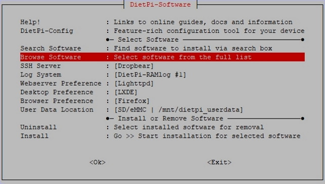

# Sozial / Suche

## Überblick

- [**FreshRSS - Ein selbst gehosteter RSS-Feed-Aggregator**](#freshrss)
- [**phpBB - Kostenlose Flat-Forum-Bulletin-Board-Softwarel&ouml;sung**](#phpbb)
- [**Wordpress - Website-Blog und Ver&ouml;ffentlichungsplattform**](#wordpress)
- [**Single File PHP Gallery - Hosten und durchsuchen Sie Ihre Bilder über eine Weboberfläche**](#single-file-php-gallery)
- [**Baïkal - Lightweight CalDAV + CardDAV-Server**](#baikal)
- [**OpenBazaar - Dezentraler Peer-to-Peer-Marktserver mit Bitcoin**](#openbazaar)
- [**Synapse - Dezentrale Kommunikation mit dem Matrix-Protokoll**](#synapse)

??? Information " "Wie führe ich **DietPi-Software** aus und installiere **optimierte Software**-Elemente?"
    Um eines der unten aufgeführten **DietPi-optimierten Softwareelemente** zu installieren, führen Sie es über die Befehlszeile aus:

    ```sh
    dietpi-software
    ```

    Wählen Sie **Software durchsuchen** und wählen Sie einen oder mehrere Artikel aus. Wählen Sie abschlie&szlig;end `Installieren`.
    DietPi führt alle notwendigen Schritte aus, um diese Softwareelemente zu installieren und zu starten.

    {: width="643" height="365" loading="lazy"}

    Um alle DietPi-Konfigurationsoptionen anzuzeigen, lesen Sie den Abschnitt [DietPi Tools](../../dietpi_tools/).

[Zurück zur **Liste der optimierten Software**](../../software/)

## FreshRSS

FreshRSS ist ein selbst gehosteter RSS-Feed-Aggregator.

{: width="400" height="247" loading="lazy"}

=== "Zugriff auf die Weboberfläche"

    - URL = `<http://<Ihre.IP>/freshrss`
    - Benutzername = `dietpi`
    - Passwort = `dietpi`

***

Offizielle Dokumentation: <https://freshrss.github.io/FreshRSS/en/users/02_First_steps.html>

## phpBB

Wenn Sie schon immer Ihr eigenes Forum haben wollten, ist phpBB alles, was Sie brauchen.

Installiert auch:

- Webserver

{: width="400" height="298" loading="lazy"}

### Zugriff auf Foren

URL = `http://<Ihre.IP>/phpbb`

### Ersteinrichtung einrichten

DietPi erstellt automatisch die SQL-Datenbank für phpBB. Bitte befolgen Sie die nachstehenden Schritte, um diese Details in phpBB einzugeben und die Einrichtung abzuschlie&szlig;en.

#### Zugriff auf die phpBB-Website

- URL = `http://<Ihre.IP>/phpbb`
- Klicken Sie auf die Registerkarte "Installieren".
- Klicken Sie auf `Weiter zum nächsten Schritt`
- Klicken Sie auf "Installation starten"

#### MySQL/MariaDB-Datenbankdetails

So geben Sie die MySQL/MariaDB-Datenbankdetails ein:

- Datenbankserver-Hostname oder Datenquellenname (DSN) = `localhost`
- Datenbankbenutzername = `phpbb`
- Datenbankname = `phpbb`
- Datenbank-Passwort = `dietpi` (bzw. Ihr gewähltes globales Software-Passwort)

- Klicken Sie auf `Weiter zum nächsten Schritt`
- Klicken Sie auf `Weiter zum nächsten Schritt`

#### Erstellen Sie Ihr Administratorkonto

Dieses Konto wird für den vollen Zugriff auf das phpBB-Forum verwendet.

- Klicken Sie auf `Weiter zum nächsten Schritt`
- Klicken Sie auf `Weiter zum nächsten Schritt`
- Klicken Sie auf `Weiter zum nächsten Schritt`

#### E-Mail- und Server-URL-Einstellungen

Verwenden Sie die Standardwerte.

- Klicken Sie auf `Weiter zum nächsten Schritt`
- Klicken Sie auf `Weiter zum nächsten Schritt`

Die Datenbanktabellen werden nun generiert, bitte warten.

#### Anmeldung

Klicken Sie auf "Anmelden"
Mit Ihren zuvor erstellten Admin-Login-Daten k&ouml;nnen Sie nun Ihre Forenseiten verwalten und erstellen.

Da die Installation nun abgeschlossen ist, müssen Sie den Installationsordner entfernen, bevor das Forum live gehen kann. Führen Sie den folgenden Befehl aus:

```sh
rm -R /var/www/phpbb/install
```

Ihr Forum ist nun bereit.

## WordPress

WordPress ist eine hochmoderne semantische Personal-Publishing-Plattform mit Fokus auf Ästhetik, Webstandards und Benutzerfreundlichkeit.
Damit k&ouml;nnen Sie Ihre eigene Website erstellen.

{: width="400" height="242" loading="lazy"}

=== "Zugriff auf die Weboberfläche"

    URL = `http://<your.IP>/wordpress`

=== "Erste Verbindung"

Geben Sie bei der ersten Verbindung die folgenden MySQL-Datenbankdetails ein:

    - Datenbankname = `wordpress`
    - Benutzername = `wordpress`
    - Passwort = Ihr globales Anwendungspasswort
    - Datenbankhost = `localhost`
    - Tabellenpräfix = `wp_`

## Einzeldatei-PHP-Galerie

*Single File PHP Gallery* erm&ouml;glicht es Ihnen, Ihre Bilder von einer Weboberfläche aus zu hosten und zu durchsuchen.

Installiert auch:

- LASP-Webserver

{: width="400" height="248" loading="lazy"}

=== "Zugriff auf Bildergalerie"

    URL = `http://<your.IP>/gallery`

=== "Bilder hinzufügen"

So fügen Sie Ihre eigenen Bilder hinzu:

    - Erstellen Sie Ihren Bildordner

        ```sh
        mkdir /var/www/gallery/MyImageFolder
        ```

    - Legen Sie eine Bilddatei in Ihren neuen Ordner

        ```sh
        wget https://dietpi.com/images/dietpi-logo_192x192.png
        mv dietpi-logo_192x192.png /var/www/gallery/MyImageFolder/
        ```

***

Website: <https://sye.dk/sfpg>

YouTube-Video-Tutorial: *DietPi: Einfaches Einrichten von Raspberry Pi-Projekten (z. B. eine gemeinsame Fotogalerie)*.

<iframe src="https://www.youtube-nocookie.com/embed/0by117lpq_o?rel=0" frameborder="0" allow="fullscreen" width="560" height="315" loading="lazy" ></iframe>

## Baikal

Baïkal ist ein leichtgewichtiger CalDAV + CardDAV-Server.

{: width="400" height="219" loading="lazy"}

=== "Erste Ausführung einrichten"

    Greifen Sie auf die Setup-Seite zu:

    - URL = `http://<your.IP>/baikal/html`
    - Geben Sie ein neues Admin-Passwort für Ihr Konto ein und klicken Sie dann auf die Schaltfläche Weiter/Speichern.

    Geben Sie MySQL-Details ein:

    - MySQL verwenden = Ja
    - MySQL-Host = `127.0.0.1`.
    - Name der MySQL-Datenbank = `baikal`
    - MySQL-Benutzername = `baikal`
    - MySQL-Passwort = Ihr globales Software-Passwort (Standard: `dietpi`)

=== "Zugriff auf die Weboberfläche"

    - URL = `http://<your.IP>/baikal/html/admin`
    - Benutzername = `admin`
    - Passwort = Das, was Sie während der ersten Ausführung oben festgelegt haben.

Eine [deutschsprachige Anleitung zu Baikal](https://github.com/JsBergbau/BaikalAnleitung) ist auf Github zu finden.

## OpenBazaar

OpenBazaar ist ein kostenloser dezentraler Peer-to-Peer-Marktserver für alle. Keine Gebühren. Verwendung von Bitcoins.
Oldschool: Denken Sie an Napster, aber für den Kauf und Verkauf von Sachen mit Ihren Bitcoins.

{: width="400" height="240" loading="lazy"}

=== "OpenBazaar-Client"

    Der Client erm&ouml;glicht es Ihnen, innerhalb des Marktnetzwerks von OpenBazaar zu st&ouml;bern und zu handeln.
    <https://www.openbazaar.org/download/>

=== "OpenBazaar-Client mit Ihrem OpenBazaar-Server verbinden"

    Schritt 1:
    Während der Installation werden Sie aufgefordert, einen Benutzernamen, ein Passwort und eine zulässige IP-Adresse einzugeben.

    Schritt 2:
    Als nächstes müssen Sie den OpenBazaar-Client &ouml;ffnen und Ihren Server hinzufügen:

    - Klicken Sie auf Menü (oben rechts)
    - Klicken Sie auf Neuer Server
    - Wählen Sie Eigenständig
    - Geben Sie die IP-Adresse Ihres DietPi-Geräts sowie den Benutzernamen und das Passwort ein, die Sie in Schritt 1 vergeben haben.

## Synapse

Synapse ist ein in Python geschriebener Server für die Kommunikation über das Matrix-Protokoll.

=== "Kunde"

    Für die Kommunikation mit Synapse k&ouml;nnen Sie [Element](https://element.io/) verwenden, aber jeder Client, der das Matrix-Protokoll unterstützt, sollte funktionieren.

=== "F&ouml;deration"

    Synapse ist standardmä&szlig;ig als privater Server ohne Verbindung zu anderen Servern eingerichtet. So verbinden Sie sich mit anderen Servern (Federate), finden Sie unter https://github.com/matrix-org/synapse/blob/develop/docs/federate.md. Beachten Sie, dass frp derzeit nicht mit Synapse funktioniert.

=== "Konfiguration"

    - Config-Verzeichnis:
     `/mnt/dietpi_userdata/synapse`
    - Hauptkonfigurationsdatei:
    `/mnt/dietpi_userdata/synapse/homeserver.yaml`
    - DietPi-Konfiguration überschreiben:
    `/mnt/dietpi_userdata/synapse/homeserver.yaml.d/00-dietpi.yaml`
    Diese enthält auch die PostgreSQL-Datenbankdetails und diese Datei ist daher nur für Root oder den Benutzer "synapse" lesbar.

    Um Einstellungen hinzuzufügen oder zu ändern, empfiehlt es sich, eine neue Override-Konfiguration zu erstellen, z. B.:

    ```
    /mnt/dietpi_userdata/synapse/homeserver.yaml.d/99-local.yaml
    ```

    Damit die Änderungen wirksam werden, muss der Dienst neu geladen werden:

    ```sh
    systemctl reload synapse
    ```

=== "Serviceabwicklung"

    Die DietPi-Synapse-Implementierung erstellt einen systemd-Dienst `synapse.service`, um den Synapse-Server zu starten und zu steuern. Folgende Befehle k&ouml;nnen verwendet werden:

    - Start: `systemctl start synapse`
    - Stop: `systemctl stop synapse`
    - Neustart: `systemctl restart synapse`
    - Konfiguration neu laden: `systemctl reload synapse`
    - Druckstatus: `systemctl start synapse`

=== "Protokolle anzeigen"

    Protokolle werden im Systemjournal erstellt und k&ouml;nnen angezeigt werden über:

    ```sh
    journalctl -u synapse
    ```

=== "Auf neueste Version aktualisieren"

    Da Synapse über Python 3 Pip installiert wird, k&ouml;nnen Sie es aktualisieren über:

    ```sh
    pip3 install -U matrix-synapse
    ```

***

Offizielle Website: <https://matrix.org/>
Offizielle Dokumentation: <https://matrix.org/docs/guides>
Quellcode: <https://github.com/matrix-org/synapse>
Lizenz: [Apache 2.0](https://github.com/matrix-org/synapse/blob/develop/LICENSE)

[Zurück zur **Liste der optimierten Software**](../../software/)
