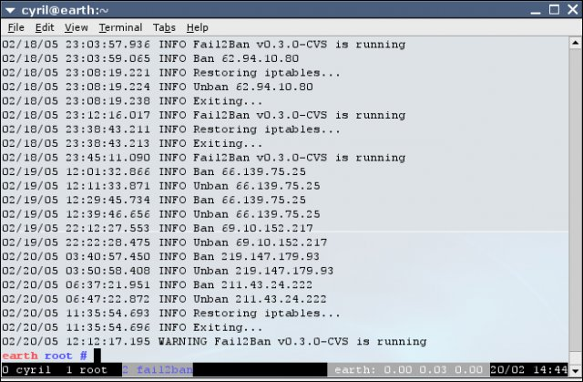

# Systemsicherheit

## &Uuml;berblick

- [**Let's Encrypt - HTTPS/SSL aktivieren**](#lets-encrypt)
- [**Fail2Ban - Sch&uuml;tzt Ihr System vor Brute-Force-Angriffen**](#fail2ban)

??? Information "Wie f&uuml;hre ich **DietPi-Software** aus und installiere **optimierte Software**-Elemente?"
    Um eines der unten aufgef&uuml;hrten **DietPi-optimierten Softwareelemente** zu installieren, f&uuml;hren Sie es &uuml;ber die Befehlszeile aus:

    ```sh
    dietpi-software
    ```

    W&auml;hlen Sie **Software durchsuchen** und w&auml;hlen Sie einen oder mehrere Artikel aus. W&auml;hlen Sie abschlie&szlig;end `Installieren`.
    DietPi f&uuml;hrt alle notwendigen Schritte aus, um diese Softwareelemente zu installieren und zu starten.

    {: width="643" height="365" loading="lazy"}

    Um alle DietPi-Konfigurationsoptionen anzuzeigen, lesen Sie den Abschnitt [DietPi Tools](../../dietpi_tools/).

[Zur&uuml;ck zur **Liste der optimierten Software**](../../software/)

## Lassen Sie uns verschl&uuml;sseln

Let’s Encrypt ist ein Anbieter von kostenlosen SSL-Zertifikaten. Certbot ist der offizielle Client, um SSL-Zertifikate von Let’s Encrypt auf Ihren Webserver anzuwenden. Dies erm&ouml;glicht Ihnen den `https://` (verschl&uuml;sselt und authentifiziert) Zugriff auf Ihre Websites.

### Anforderungen

Um Certbot zu verwenden, ben&ouml;tigen Sie:

- Ein funktionierender Apache-, Nginx- oder Lighttpd-Webserver
- Eine URL/Domain (zB: `mysite.org`). No-IP kann f&uuml;r eine URL/Domain verwendet werden, die auf Ihr Ger&auml;t verweist.
- Die Ports 80 und 443 (TCP) m&uuml;ssen an Ihr Ger&auml;t weitergeleitet werden. Dies wird normalerweise in Ihrem Router eingestellt.

???+ wichtig "Port 80 f&uuml;r Certbot-Erneuerung offen halten"
    Selbst wenn Sie nur HTTPS auf Port 443 verwenden, erfordert Let's Encrypt, dass Port 80 f&uuml;r Zertifikatserneuerungen ge&ouml;ffnet bleibt (in der Weiterleitungsfunktion Ihres Routers).

{: width="400" height="183" loading="lazy"}

### Erstellen Sie Ihr Zertifikat und wenden Sie es an

Sobald Certbot von `dietpi-software` installiert wurde, f&uuml;hren Sie `dietpi-letsencrypt` aus, um Ihr SSL-Zertifikat zu konfigurieren, zu erstellen und anzuwenden:

```sh
dietpi-letsencrypt
```

Geben Sie einfach die erforderlichen Details und Einstellungen ein und w&auml;hlen Sie dann `Anwenden`.
Let's Encrypt ist so einfach!

***

Webseite: <https://letsencrypt.org>

## Fail2Ban

Fail2Ban sch&uuml;tzt Ihr System vor Brute-Force-Angriffen, indem es die Quell-IP-Adresse sperrt.
Wir haben die Erkennung f&uuml;r SSH-Server (OpenSSH und Dropbear) aktiviert, Fail2Ban unterst&uuml;tzt jedoch auch zus&auml;tzliche Software.

{: width="200" height="157" loading="lazy"}

{: width="550" height="360" loading="lazy"}

Quelle: [`Lostcontrol` des Fail2ban-Wikis](https://fail2ban.org/wiki/index.php/File:Fail2ban-screenshot.jpg), [GPL](https://commons.wikimedia.org/w/ index.php?curid=19776087)

Eine IP-Adresse wird standardm&auml;&szlig;ig nach 3 fehlgeschlagenen SSH-Anmeldeversuchen gesperrt. Fail2Ban wird die Quell-IP-Adresse f&uuml;r 10 Minuten sperren.

=== "Status der Blockierungsaktivit&auml;t pr&uuml;fen"

    Der Status kann mit diesen Befehlen &uuml;berpr&uuml;ft werden:

    ```sh
    fail2ban-client status sshd
    fail2ban-client status dropbear
    ```

=== "Unterst&uuml;tzung f&uuml;r zus&auml;tzliche Programme aktivieren"

    Fail2Ban unterst&uuml;tzt Brute-Force-Schutz f&uuml;r andere Software (z. B. Apache, ProFTPD usw.).
    Sie k&ouml;nnen diese Funktionen aktivieren/deaktivieren, indem Sie die Datei */etc/fail2ban/jail.conf* &auml;ndern und `enable = true` unter dem Namen *[software]* setzen.

***

Website: <https://fail2ban.org/wiki/index.php/Main_Page>

[Zur&uuml;ck zur **Liste der optimierten Software**](../../software/)
