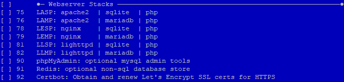
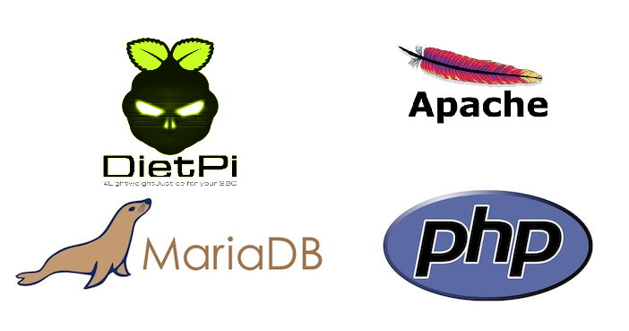
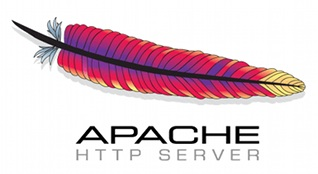

# Web Entwicklung

## &Uuml;berblick

[**Stacks f&uuml;r die Webentwicklung**](#stacks-for-web-development)

- [**LAMP** Webstack - **Apache / MariaDB / PHP**](#lamp-web-stack)
- [**LASP** Webstack - **Apache / SQLite / PHP**](#lasp-web-stack)
- [**LEMP** Webstack - **Nginx / MariaDB / PHP**](#lemp-web-stack)
- [**LESP** Webstack - **Nginx / SQLite / PHP**](#lesp-web-stack)
- [**LLMP** Webstack - **Lighttpd / MariaDB / PHP**](#llmp-web-stack)
- [**LLSP** Webstack - **Lighttpd / SQLite / PHP**](#llsp-web-stack)

[**Webserver**](#webservers)

- [**Apache** - Webserver mit vielen Funktionen](#apache)
- [**Nginx** - Hochleistungs-Webserver, Load-Balancer und Reverse-Proxy](#nginx)
- [**Lighttpd** - Extrem leichter Webserver](#lighttpd)
- [**Tomcat** - Apache Tomcat-Server](#Tomcat)

[**Webentwicklung - Programmierung & Frameworks**](#web-development-programming-frameworks)

- [**Flask** - Micro-Web-Framework powered by Python](#flask)
- [**PHP** - Skriptsprache, die f&uuml;r die Webentwicklung geeignet ist](#php)
- [**Node.js** - JavaScript-Laufzeitumgebung zum Erstellen skalierbarer Netzwerkanwendungen](#nodejs)

??? Information "Wie f&uuml;hre ich **DietPi-Software** aus und installiere **optimierte Software**-Elemente?"
    Um eines der unten aufgef&uuml;hrten **DietPi-optimierten Softwareelemente** zu installieren, f&uuml;hren Sie es &uuml;ber die Befehlszeile aus:

    ```sh
    dietpi-software
    ```

    W&auml;hlen Sie **Software durchsuchen** und w&auml;hlen Sie einen oder mehrere Artikel aus. W&auml;hlen Sie abschlie&szlig;end `Installieren`.
    DietPi f&uuml;hrt alle notwendigen Schritte aus, um diese Softwareelemente zu installieren und zu starten.

    {: width="643" height="365" loading="lazy"}

    Um alle DietPi-Konfigurationsoptionen anzuzeigen, lesen Sie den Abschnitt [DietPi Tools](../../dietpi_tools/).

[Zur&uuml;ck zur **Liste der optimierten Software**](../../software/)

## Stacks f&uuml;r die Webentwicklung

DietPi bietet eine **Ein-Klick-Installation** der folgenden Webentwicklungs-Stacks:

- [**LAMP** Webstack - **Apache / MariaDB / PHP**](#lamp-web-stack)
- [**LASP** Webstack - **Apache / SQLite / PHP**](#lasp-web-stack)
- [**LEMP** Webstack - **Nginx / MariaDB / PHP**](#lemp-web-stack)
- [**LESP** Webstack - **Nginx / SQLite / PHP**](#lesp-web-stack)
- [**LLMP** Webstack - **Lighttpd / MariaDB / PHP**](#llmp-web-stack)
- [**LLSP** Webstack - **Lighttpd / SQLite / PHP**](#llsp-web-stack)

!!! Hinweis "Bedeutung der Akronyme *LAMP*, *LASP*, *LEMP*, *LESP*, *LLMP*, *LLSP*"

    - Betriebssystem: **L** f&uuml;r Linux / DietPi
    - Webserver: **A** f&uuml;r Apache, **E** f&uuml;r [Nginx](#nginx), **L** f&uuml;r [Lighttpd](#lighttpd)
    - Datenbank: **M** f&uuml;r MariaDB, **S** f&uuml;r [SQLite](../databases/#sqlite)
    - Skriptsprache: **P** f&uuml;r [PHP](#php)

!!! Hinweis ""
    Alle Stacks werden mit **PHP-Caches** (APCu und OPcache) geliefert, die basierend auf einem Anteil des Gesamtspeichers optimiert werden.

### Welcher Web Application Stack ist der beste f&uuml;r Sie?

=== "Welchen WEBSERVER W&Auml;HLEN?"

    **[Apache](#apache)**

    - Speichernutzung = **Hoch** | Multithreading = **Ja**

    Es ist funktionsreich und beliebt. Es wird Anf&auml;ngern und Benutzern empfohlen, die Apache-basierten Anleitungen folgen m&ouml;chten.

    **[Nginx](#nginx)**

    - Speichernutzung = **M    ittel** | Multithreading = **Ja**

    Es ist eine leichtgewichtige Alternative zu [Apache](#apache) und behauptet[^4] eine schnellere Webserverleistung im Vergleich zu [Apache](#apache). Es ist ideal f&uuml;r Situationen mit mittlerem bis hohem Datenverkehr, in denen [Lighttpd](#lighttpd) darunter leidet.

    **[Lighttpd](#lighttpd)**

    - Speichernutzung = **Niedrig** | Multithreaded = **Optional** - Einige Nachteile

    Es ist extrem leicht und wird allgemein als die "beste" Webserver-Leistung unter Linux f&uuml;r SBCs (Single Board Computers) angesehen. Es wird f&uuml;r Benutzer empfohlen, die einen geringen Webserver-Traffic und/oder pers&ouml;nlichen Gebrauch erwarten.

    Obwohl die DietPi-Installation von Lighttpd auf Single-Threading eingestellt ist, lassen Sie sich davon nicht abschrecken, in Szenarien mit geringer Nutzung (<10 Benutzer) wird es immer noch [Nginx](#nginx) und [Apache](#apache) &uuml;bertreffen. Die Aktivierung von Multithreading ist in der Paketbeschreibung [Lighttpd](#lighttpd) beschrieben.

    !!! Hinweis "DietPi - Webserver Pr&auml;ferenz"

        Auf dem DietPi-Webserver-Einstellungsbildschirm k&ouml;nnen Sie Ihren bevorzugten Webserver f&uuml;r die Verwendung in DietPi-Installationen ausw&auml;hlen. &Uuml;berpr&uuml;fen Sie mehr die **Web-Einstellungen** in der [Erweiterten Konfiguration](../../dietpi_tools/#quick-selections).

    !!! Information ""

        F&uuml;r weitere Details siehe [Der Kampf der Webserver Apache vs. Nginx vs. Lighttpd 2](https://detechter.com/the-battle-of-the-web-servers-apache-vs-Nginx-vs-lighttpd -2/).

=== "Welche DATENBANK W&Auml;HLEN?"

    **[MariaDB](../databases/#mariadb)**
    Es ist ein Open-Source-RDBMS (Relational Database Management System). Es ist anwendungskompatibel zu MySQL, dh es kann als *drop-in*-Ersatz f&uuml;r MySQL verwendet werden. Es hat mehr Funktionen, weniger Fehler und eine bessere Leistung im Vergleich zu MySQL.

    **[SQLite](../databases/#sqlite)**
    Es ist ein RDBMS, das auch zu MySQL kompatibel ist. Es bietet eine breitere Sprachunterst&uuml;tzung (dh mehr Bindungen an Programmiersprachen) im Vergleich zu [MariaDB](../databases/#mariadb). [SQLite](../databases/#sqlite) hat einen sehr geringen Platzbedarf. Als Nachteile hat es keine Mehrbenutzerf&auml;higkeiten und einige SQL-Funktionen fehlen.

***

### Wie installiert man ?

DietPi enth&auml;lt die Option, den Webstack Ihres Favoriten auszuw&auml;hlen. Grunds&auml;tzlich w&auml;hlt man den Webstack bzw. Webserver haben Sie zwei M&ouml;glichkeiten innerhalb von `dietpi-software`:

    - Auswahl &uuml;ber ***Softwareoptimiert*** bzw
    - Auswahl &uuml;ber ***Webserver-Pr&auml;ferenz***

Letzteres wird nur bei der ersten Hintergrundinstallation des Webservers verwendet.

=== "Auswahl &uuml;ber Software optimiert"

    {: width="680" height="162" loading="lazy"}

    Mit dieser Option w&auml;hlen Sie den kompletten Webstack zur Installation aus. W&auml;hlen Sie einfach den Webstack aus, den Sie installieren m&ouml;chten, und f&uuml;hren Sie die Installation &uuml;ber die *Install*-Ausf&uuml;hrung innerhalb von `dietpi-software` durch.

    !!! Hinweis ""
        Sofern Sie nicht _speziell_ einen Webstack ben&ouml;tigen, wird empfohlen, dass Sie DietPi erlauben, den Standard-Webstack automatisch zu installieren. Dies gew&auml;hrleistet die Kompatibilit&auml;t und Stabilit&auml;t Ihres Systems.

=== "Auswahl &uuml;ber Webserver-Pr&auml;ferenz"

    {: width="500" height="309" loading="lazy"}

    Mit dieser Option w&auml;hlen Sie nur den Webserver f&uuml;r die Verwendung in DietPi-Installationen aus.
    Wenn Sie eine Software zur Installation ausw&auml;hlen, die einen Webserver erfordert (z. B. Pi-hole, Nextcloud, Webmin, installiert &uuml;ber *Software Optimized*), installiert, konfiguriert und optimiert DietPi automatisch die von Ihnen gew&auml;hlte Webserver-Pr&auml;ferenz. DietPi installiert auch [MariaDB](../databases/#mariadb) / [SQLite](../databases/#sqlite) nach Bedarf, abh&auml;ngig von Ihrer Softwareauswahl. Grunds&auml;tzlich m&uuml;ssen Sie nie wieder einen Webserver-Stack manuell ausw&auml;hlen/installieren. DietPi erledigt das alles f&uuml;r Sie.

    ???+ info "Kein Webserverwechsel falls bereits installiert"
        Diese Einstellung `Webserver Preference*` kann NICHT ge&auml;ndert werden, wenn ein vorhandener Webserver auf dem System installiert ist.

***

YouTube-Video-Tutorial: *DietPi-Webserver-Tutorial | Hosten Sie eine Website von Home | Himbeer-Pi*.

<iframe src="https://www.youtube-nocookie.com/embed/nB-i959ZGzQ?rel=0" frameborder="0" allow="fullscreen" width="560" height="315" loading=" faul"></iframe>

***

### LAMP-Webstack

LAMP-Stack ist eine beliebte Open-Source-Webplattform, die h&auml;ufig zum Ausf&uuml;hren dynamischer Websites und Server verwendet wird. Es wird von vielen als Plattform der Wahl f&uuml;r die Entwicklung und Bereitstellung von Hochleistungs-Webanwendungen angesehen, die eine solide und zuverl&auml;ssige Grundlage erfordern.

{: width="702" height="369" loading="lazy"}

=== "Schnellstart"

    **Website aufrufen:**

    - URL = `http://<your.IP>` oder `http://<your.host.name>`
    - Lokales Verzeichnis = `/var/www`

    **Zugriff auf die PHP-Infoseite:**

    - URL = `http://<Ihre.IP>/phpinfo.php`

    **Informationen zum Speichercache abrufen:**

    - APCu = `http://<Ihre.IP>/apc.php`
    - OPcache = `http://<your.IP>/opcache.php`

    &Uuml;berpr&uuml;fen Sie f&uuml;r die Datenbank die Details von **[MariaDB](../databases/#mariadb)**.

=== "Gesicherter Zugriff - HTTPS/SSL"

    **Let's Encrypt** wird dringend empfohlen - [sehen Sie hier, wie es installiert wird](../../dietpi_tools/#dietpi-letsencrypt). Dadurch wird die Erstellung und Einrichtung Ihres kostenlosen SSL-Zertifikats automatisiert.

    ??? note "Alternativer Weg: Manuelles Aktivieren von HTTP/SSL durch Installieren eines selbstsignierten SSL-Zertifikats"

        !!! warning "Nur empfohlen, falls **Let's encrypt** keine praktikable Option ist."

        **Schritt 1. Schl&uuml;ssel erstellen**

        ```sh
        mkdir -p /etc/apache2/ssl
        openssl req -x509 -nodes -days 1000 -newkey rsa:2048 -keyout /etc/apache2/ssl/apache.key -out /etc/apache2/ssl/apache.crt
        ```

        **Schritt 2. SSL-Konfiguration aktivieren und Apache neu starten**

        ```sh
        chmod 600 /etc/apache2/ssl/*
        cat << '_EOF_' > /etc/apache2/sites-enabled/default-ssl.conf
        <IfModule mod_ssl.c>
            <VirtualHost _default_:443>
                    ServerAdmin webmaster@localhost
                    ServerName example.com:443
                    DocumentRoot /var/www

                    LogLevel error
                    ErrorLog ${APACHE_LOG_DIR}/error.log
                    #CustomLog ${APACHE_LOG_DIR}/access.log combined

                    SSLEngine on

                    SSLCertificateFile /etc/apache2/ssl/apache.crt
                    SSLCertificateKeyFile /etc/apache2/ssl/apache.key

                    <FilesMatch "\.(cgi|shtml|phtml|php)$">
                                    SSLOptions +StdEnvVars
                    </FilesMatch>
                    <Directory /usr/lib/cgi-bin>
                                    SSLOptions +StdEnvVars
                    </Directory>
                </VirtualHost>
            </IfModule>
        _EOF_
        a2ensite ssl
        systemctl restart apache2
        ```

    Webseite aufrufen:

    - URL = `https://<your.IP>` oder `https://<your.host.name>`

***

### LASP-Webstack

LASP ist eine Variation des beliebten Open-Source-[LAMP-Webstacks](#lamp-web-stack), der [SQLite](../databases/#sqlite) anstelle von [MariaDB](../databases/#mariadb) bereitstellt. .

[SQLite](../databases/#sqlite) ist eine eingebettete relationale Datenbank-Engine. Es ist beliebt und k&ouml;nnte zusammen mit [Apache](#apache) und PHP ein guter Kandidat f&uuml;r Einplatinencomputer sein.

=== "Schnellstart"

    **Website aufrufen:**

    - URL = `http://<your.IP>` oder `http://<your.host.name>`
    - Lokales Verzeichnis = `/var/www`

    **Informationen zum Speichercache abrufen:**

    - APCu = `http://<Ihre.IP>/apc.php`
    - OPcache = `http://<your.IP>/opcache.php`

=== "Gesicherter Zugriff - HTTPS/SSL"

    **Let's Encrypt** wird dringend empfohlen - [sehen Sie hier, wie es installiert wird](../../dietpi_tools/#dietpi-letsencrypt). Dadurch wird die Erstellung und Einrichtung Ihres kostenlosen SSL-Zertifikats automatisiert.

    ??? note "Alternativer Weg: Manuelles Aktivieren von HTTP/SSL durch Installieren eines selbstsignierten SSL-Zertifikats"

        !!! warning "Nur empfohlen, falls **Let's encrypt** keine praktikable Option ist."

        **Schritt 1. Schl&uuml;ssel erstellen**

        ```sh
        mkdir -p /etc/apache2/ssl
        openssl req -x509 -nodes -days 1000 -newkey rsa:2048 -keyout /etc/apache2/ssl/apache.key -out /etc/apache2/ssl/apache.crt
        ```

    **Schritt 2. SSL-Konfiguration aktivieren und Apache neu starten**

        ```sh
        chmod 600 /etc/apache2/ssl/*
        cat << '_EOF_' > /etc/apache2/sites-enabled/default-ssl.conf
        <IfModule mod_ssl.c>
            <VirtualHost _default_:443>
                    ServerAdmin webmaster@localhost
                    ServerName example.com:443
                    DocumentRoot /var/www

                    LogLevel error
                    ErrorLog ${APACHE_LOG_DIR}/error.log
                    #CustomLog ${APACHE_LOG_DIR}/access.log combined

                    SSLEngine on

                    SSLCertificateFile /etc/apache2/ssl/apache.crt
                    SSLCertificateKeyFile /etc/apache2/ssl/apache.key

                    <FilesMatch "\.(cgi|shtml|phtml|php)$">
                                    SSLOptions +StdEnvVars
                    </FilesMatch>
                    <Directory /usr/lib/cgi-bin>
                                    SSLOptions +StdEnvVars
                    </Directory>
                </VirtualHost>
            </IfModule>
        _EOF_
        a2ensite ssl
        systemctl restart apache2
        ```

    Webseite aufrufen:

    - URL = `https://<your.IP>` oder `https://<your.host.name>`

***

### LEMP-Webstack

LEMP ist eine Variation des beliebten Open-Source-[LAMP-Webstacks](#lamp-web-stack), der [Nginx](#nginx) anstelle des [Apache](#apache)-Webservers bereitstellt.

**Nginx** ist eine beliebte Wahl, dank seiner leichten Nutzung von Ressourcen und seiner Flexibilit&auml;t, selbst mit minimaler Ausr&uuml;stung einfach zu skalieren.

=== "Schnellstart"

    **Website aufrufen:**

    - URL = `http://<your.IP>` oder `http://<your.host.name>`

    **Zugriff auf die PHP-Infoseite:**

    - URL = `http://<Ihre.IP>/phpinfo.php`

    **Informationen zum Speichercache abrufen:**

    - APCu = `http://<Ihre.IP>/apc.php`
    - OPcache = `http://<your.IP>/opcache.php`

    &Uuml;berpr&uuml;fen Sie f&uuml;r die Datenbank die Details von **[MariaDB](../databases/#mariadb)**.

=== "Gesicherter Zugriff - HTTPS/SSL"

    **Let's Encrypt** wird dringend empfohlen - [sehen Sie hier, wie es installiert wird](../../dietpi_tools/#dietpi-letsencrypt). Dadurch wird die Erstellung und Einrichtung Ihres kostenlosen SSL-Zertifikats automatisiert.

    ??? note "Alternativer Weg: Manuelles Aktivieren von HTTP/SSL durch Installieren eines selbstsignierten SSL-Zertifikats"

        !!! warning "Nur empfohlen, falls **Let's encrypt** keine praktikable Option ist."

        **Schritt 1. Schl&uuml;ssel erstellen**

        ```sh
        mkdir -p /etc/apache2/ssl
        openssl req -x509 -nodes -days 1000 -newkey rsa:2048 -keyout /etc/apache2/ssl/apache.key -out /etc/apache2/ssl/apache.crt
        ```

        **Schritt 2. SSL-Konfiguration aktivieren und Apache neu starten**

        ```sh
        chmod 600 /etc/apache2/ssl/*
        cat << '_EOF_' > /etc/apache2/sites-enabled/default-ssl.conf
        <IfModule mod_ssl.c>
            <VirtualHost _default_:443>
                    ServerAdmin webmaster@localhost
                    ServerName example.com:443
                    DocumentRoot /var/www

                    LogLevel error
                    ErrorLog ${APACHE_LOG_DIR}/error.log
                    #CustomLog ${APACHE_LOG_DIR}/access.log combined

                    SSLEngine on

                    SSLCertificateFile /etc/apache2/ssl/apache.crt
                    SSLCertificateKeyFile /etc/apache2/ssl/apache.key

                    <FilesMatch "\.(cgi|shtml|phtml|php)$">
                                    SSLOptions +StdEnvVars
                    </FilesMatch>
                    <Directory /usr/lib/cgi-bin>
                                    SSLOptions +StdEnvVars
                    </Directory>
                </VirtualHost>
            </IfModule>
        _EOF_
        a2ensite ssl
        systemctl restart apache2
        ```

    Webseite aufrufen:

    - URL = `https://<your.IP>` oder `https://<your.host.name>`

***

### LESP-Webstack

LESP ist eine Variation des beliebten Open-Source-[LAMP-Webstacks](#lamp-web-stack), der [Nginx](#nginx) anstelle des [Apache](#apache)-Webservers und [SQLite](.. /databases/#sqlite) anstelle von MariaDB.

**[Nginx](#nginx)** ist eine beliebte Wahl, dank seiner geringen Ressourcennutzung und seiner Flexibilit&auml;t, selbst mit minimaler Ausr&uuml;stung einfach zu skalieren.

=== "Schnellstart"

    **Website aufrufen:**

    - URL = `http://<your.IP>` oder `http://<your.host.name>`

    **Informationen zum Speichercache abrufen:**

    - APCu = `http://<Ihre.IP>/apc.php`
    - OPcache = `http://<your.IP>/opcache.php`

=== "Gesicherter Zugriff - HTTPS/SSL"

    **Let's Encrypt** wird dringend empfohlen - [sehen Sie hier, wie es installiert wird](../../dietpi_tools/#dietpi-letsencrypt). Dadurch wird die Erstellung und Einrichtung Ihres kostenlosen SSL-Zertifikats automatisiert.

    Webseite aufrufen:

    - URL = `https://<your.IP>` oder `https://<your.host.name>`

***

### LLMP-Webstack

LLMP ist eine Variation des beliebten Open-Source-[LAMP-Webstacks](#lamp-web-stack), der [Lighttpd](#lighttpd) anstelle des [Apache](#apache)-Webservers bereitstellt.

=== "Schnellstart"

    **Website aufrufen:**

    - URL = `http://<your.IP>` oder `http://<your.host.name>`
    - Lokales Verzeichnis = `/var/www`

    **Zugriff auf die PHP-Infoseite:**

    - URL = `http://<Ihre.IP>/phpinfo.php`

    **Informationen zum Speichercache abrufen:**

    - APCu = `http://<Ihre.IP>/apc.php`
    - OPcache = `http://<your.IP>/opcache.php`

    &Uuml;berpr&uuml;fen Sie f&uuml;r die Datenbank die Details von **[MariaDB](../databases/#mariadb)**.

=== "Gesicherter Zugriff - HTTPS/SSL"

    **Let's Encrypt** wird dringend empfohlen - [sehen Sie hier, wie es installiert wird](../../dietpi_tools/#dietpi-letsencrypt). Dadurch wird die Erstellung und Einrichtung Ihres kostenlosen SSL-Zertifikats automatisiert.

    Webseite aufrufen:

    - URL = `https://<your.IP>` oder `https://<your.host.name>`

***

### LLSP-Webstack

LLSP ist eine Variante des beliebten Open-Source-[LAMP-Webstacks](#lamp-web-stack), der **[Lighttpd](#lighttpd)** anstelle von [Apache](#apache)-Webserver und **[ SQLite](../databases/#sqlite)** statt [MariaDB](../databases/#mariadb).

=== "Schnellstart"

    **Website aufrufen:**

    - URL = `http://<your.IP>` oder `http://<your.host.name>`
    - Lokales Verzeichnis = `/var/www`

**Zugriff auf die PHP-Infoseite:**

    - URL = `http://<Ihre.IP>/phpinfo.php`

**Informationen zum Speichercache abrufen:**

    - APCu = `http://<Ihre.IP>/apc.php`
    - OPcache = `http://<your.IP>/opcache.php`

    &Uuml;berpr&uuml;fen Sie f&uuml;r die Datenbank die Details von **[MariaDB](../databases/#mariadb)**.

=== "Gesicherter Zugriff - HTTPS/SSL"

    **Let's Encrypt** wird dringend empfohlen - [sehen Sie hier, wie es installiert wird](../../dietpi_tools/#dietpi-letsencrypt). Dadurch wird die Erstellung und Einrichtung Ihres kostenlosen SSL-Zertifikats automatisiert.

    Webseite aufrufen:

    - URL = `https://<your.IP>` oder `https://<your.host.name>`

=== "Einzelinstallation"

    Der Web Development Stack kann auch einzeln installiert werden. Diese Option bietet mehr Flexibilit&auml;t und bietet die M&ouml;glichkeit zur Auswahl:

    - **Webserver**

    Abh&auml;ngig von Ihren Anforderungen k&ouml;nnen Sie den Webserver ausw&auml;hlen, der Ihren Anforderungen am besten entspricht. Falls **[Lighttpd](#lighttpd)** nicht die richtige Wahl ist, k&ouml;nnen Sie mit **Apache Web Server**, **[Nginx](#nginx)** oder **Tomcat Webserver** fortfahren.

    - Datenbank

    Sie k&ouml;nnen **[MariaDB](../databases/#mariadb)** oder andere verf&uuml;gbare Datenbanken wie **[InfluxDB](../databases/#influxdb)**, **[Redis](. ./databases/#redis)**, **[SQLite](../databases/#sqlite)**.

## Webserver

###Apache

Apache ist Open Source und der am h&auml;ufigsten verwendete Webserver auf Linux-Systemen.

{: width="200" height="109" loading="lazy"}

Webserver werden zum Bereitstellen von Webseiten verwendet, die von Clientcomputern angefordert werden. Clients fordern und zeigen Webseiten normalerweise mit Webbrowser-Anwendungen wie Firefox, Opera, Chromium, Microsoft Edge, Internet Explorer usw. an.

Apache ist ein Projekt der Apache Software Foundation. Das Ziel ist die Bereitstellung eines sicheren, effizienten und erweiterbaren Servers, der HTTP-Dienste synchron mit den aktuellen HTTP-Standards bereitstellt.

=== "Protokollierung"

    Die Protokollierung erfolgt standardm&auml;&szlig;ig im Journal, und Sie k&ouml;nnen die Details anzeigen, indem Sie den n&auml;chsten Befehl ausf&uuml;hren:

    ```sh
    journalctl -u apache2
    ```

=== "Servername"

    Die Direktive `ServerName` wird mit der lokalen IP aktualisiert. Dies hilft, die zugeh&ouml;rigen Startwarnungen stummzuschalten.
    
    **Anmerkungen:**
    
    - Dies kann zu Zugriffs- und CORS-Fehlern [^6] f&uuml;hren, wenn Anwendungen nach dem Servernamen suchen. In einem solchen Fall bieten Anwendungen im Allgemeinen eine M&ouml;glichkeit, eine Liste zul&auml;ssiger Hostnamen zu definieren.
    
    - Ohne einen festgelegten Servernamen wendet der Webserver normalerweise einfach den HTTP_HOST-Header an, wodurch jede zugeh&ouml;rige Pr&uuml;fung umgangen wird. Apache scheint dann laut der protokollierten Warnung 127.0.1.1 zu verwenden.

***

Offizielle Dokumentation: <https://httpd.apache.org/docs>

### Nginx

**Nginx** [Engine x] ist ein HTTP- und Reverse-Proxy-Server, ein Mail-Proxy-Server und ein generischer TCP/UDP-Proxy-Server. Es wurde 2004 ver&ouml;ffentlicht, um das Problem des erh&ouml;hten Webverkehrs anzugehen. Es hat sich einen ausgezeichneten Ruf erworben und wird auf den Top-Millionen verkehrsreichsten Websites verwendet – einige der Erfolgsgeschichten sind: Dropbox, Netflix, Wordpress.com, FastMail.FM.[^1]

{: width="200" height="85" loading="lazy"}

Die Innovation von Nginx gegen&uuml;ber fr&uuml;heren Servern wie Apache bestand darin, eine asynchrone, ereignisgesteuerte Architektur zu verwenden. Nginx ist blitzschnell und &auml;u&szlig;erst effizient in Bezug auf die Hardwareauslastung, sodass Server mehr Geschwindigkeit aus ihrer begrenzten CPU und ihrem begrenzten RAM herausholen k&ouml;nnen. Infolgedessen ist es eine der schnellsten Webserveroptionen zum Bereitstellen statischer Inhalte.

***

Offizielle Dokumentation: <https://www.nginx.com>

### Lighttpd

**Lighttpd** ist ein Webserver f&uuml;r die Betriebssysteme UNIX/Linux und Windows. Es ist eine Alternative zum Apache-Webserver. Es wird auch Lighty genannt.

{: width="200" height="163" loading="lazy"}

Quelle: Fair use, <https://en.wikipedia.org/w/index.php?curid=10881730>.

Es wurde entwickelt, um sicher, schnell, standardkonform und flexibel zu sein und gleichzeitig f&uuml;r geschwindigkeitskritische Umgebungen optimiert zu sein. Sein geringer Speicherbedarf im Vergleich zu anderen Webservern, die geringe CPU-Last und seine Geschwindigkeitsziele machen Lighttpd zu einem perfekten Kandidaten f&uuml;r SBCs.

=== "Schnellzugriff"

    &Uuml;berpr&uuml;fen Sie nach der Installation, ob der Lighttpd-Dienst auf `http://<your.IP>` ausgef&uuml;hrt wird.

=== "Auf mehrere CPUs skalieren"

    Multithreading wird von Lighttpd unterst&uuml;tzt und kann in der Konfigurationsdatei `/etc/lighttpd/lighttpd.conf` aktiviert werden. &Auml;ndern Sie den Wert von "4" in Ihre Gesamtkernzahl:

    ```
    server.max-worker = 4
    ```

    Starten Sie dann die Dienste neu:

    ```sh
    systemctl restart lighttpd
    ```

***

Offizielle Dokumentation: <https://www.lightpd.net>

### Tomcat

Was ist **Apache Tomcat**? Im Wesentlichen handelt es sich um ein Open-Source-Java-Servlet und einen Java Server Page-Container, mit dem Entwickler eine Reihe von Java-Unternehmensanwendungen implementieren k&ouml;nnen. Tomcat f&uuml;hrt auch eine HTTP-Webserverumgebung aus, in der Java-Code ausgef&uuml;hrt werden kann.

{: width="200" height="133" loading="lazy"}

Quelle: [The Apache Software Foundation](https://svn.apache.org/viewvc/jakarta/site/xdocs/images/logos/tomcat.eps), [Apache License 2.0](https://commons.wikimedia. org/w/index.php?curid=11302180).

=== "Installieren"

    Beginnend mit DietPi 7.3 wurde `Tomcat 8` aus der DietPi-Softwareliste entfernt. Der Grund ist, dass `Tomcat 8` nur bis Debian Stretch verf&uuml;gbar ist. Ab Debian Buster und neueren Versionen wird nur noch Tomcat 9 unterst&uuml;tzt.
    
    Um Tomcat 9 zu installieren, f&uuml;hren Sie den n&auml;chsten Befehl in der Konsole aus:

    ```sh
    apt install tomcat9
    ```

=== "Schnellzugriff"

    Das Webinterface ist &uuml;ber Port **8080** erreichbar:

    - URL = `http://<Ihre.IP>:8080`

***

Offizielle Dokumentation: <https://tomcat.apache.org>

## Webentwicklung - Programmierung & Frameworks

###PHP

{: width="200" height="108" loading="lazy"}

Quelle: [Colin Viebrock](https://www.php.net/download-logos.php), [CC BY-SA 4.0](https://commons.wikimedia.org/w/index.php?curid= 9632398).

PHP wurde erstmals von Rasmus Lerdorf eingef&uuml;hrt und ist eine allgemeine serverseitige Open-Source-Skriptsprache, die sich inzwischen zu einem De-facto-Codierungsstandard in der Webentwicklungsbranche entwickelt hat.

=== "Schnellstart"

    - Es gibt viele Tutorials - hier ist die offizielle [_Erste Schritte_](https://www.php.net/manual/en/getting-started.php) aus der PHP-Dokumentation.

***

Website: <https://www.php.net>
Offizielle Dokumentation: <https://www.php.net/manual/en/index.php>

### Flasche

Flask ist ein leichtgewichtiges Framework f&uuml;r Webanwendungen. Es wurde entwickelt, um den Einstieg schnell und einfach zu machen, mit der F&auml;higkeit, auf komplexe Anwendungen zu skalieren, und es hat sich zu einem der beliebtesten Frameworks f&uuml;r Python-Webanwendungen entwickelt.

=== "Schnellstart"

    Um **Flask** verwenden zu k&ouml;nnen, muss zuerst der Python Package Manager installiert werden - [siehe Python 3](../programming/#python-3). F&uuml;hren Sie dann den n&auml;chsten Befehl aus.

    ```sh
    pip3 install -U Flask
    ```

***

Website: <https://palletsprojects.com/p/flask>
Offizielle Dokumentation: <https://flask.palletsprojects.com/en/1.1.x>
PyPI-Paketseite: <https://pypi.org/project/Flask>

### Node.js {: #nodejs }

Node.js ist eine JavaScript-Laufzeitumgebung, die auf der V8-JavaScript-Engine von Chrome basiert.


Quelle: Von [nodejs.org](https://nodejs.org), [Markenrichtlinie](https://nodejs.org/en/about/trademark/)

Durch die Verwendung des Event-Callback/Non-Blocking-Ansatzes bietet Node.js ein Single-Threaded-Event-IO-Modell, das die Orchestrierung parallel laufender Aufgaben erm&ouml;glicht. Es unterst&uuml;tzt mehrere Verbindungen, ohne dass ein gro&szlig;er Speicherbedarf erforderlich ist. Amazon, Netflix, eBay, Reddit, LinkedIn, Tumblr und PayPal verwenden Node.js.[^5]

=== "Node.js-Version"

    Beginnend mit Version 7.2 f&uuml;gte DietPi Unterst&uuml;tzung f&uuml;r [Node.js inoffizielle Builds von inofficial-builds.nodejs.org](https://unofficial-builds.nodejs.org/download/release/) hinzu. Auf diese Weise k&ouml;nnen Sie die Vorteile der Verwendung der neuesten Node.js-Version nutzen.
    
    _Warum das?_ Wir glauben, dass es wichtig und sicherer ist, die neueste Version zu verwenden. Zum Zeitpunkt des Schreibens der Dokumentation hat der neueste offizielle ARMv6-Build f&uuml;r Node.js die Version 11 und der neueste _inoffizielle Build_, der von Node.js herausgegeben wurde, ist v15.14.

***

Website: <https://nodejs.org/>
Offizielle Dokumentation: <https://nodejs.org/api/>

[^1]:
    Erfahren Sie mehr &uuml;ber die Erfolgsgeschichten von Nginx unter: <https://nginx.org/en/>
[^2]:
    [`Dead Database Walking: MySQLs Sch&ouml;pfer dar&uuml;ber, warum die Zukunft MariaDB geh&ouml;rt – MariaDB, Open Source, mysql, Oracle`](https://www2.computerworld.com.au/article/457551/dead_database_walking_mysql_creator_why_future_belongs_mariadb/). Computerwelt. Abgerufen am 22. November 2020.
[^3]:
    [Am weitesten verbreitete und verwendete Datenbank-Engine] (https://www.sqlite.org/mostdeployed.html). Abgerufen am 12. Dezember 2020
[^4]:
    [NGINX vs. Apache: Unsere Sicht auf eine jahrzehntealte Frage](https://www.nginx.com/blog/nginx-vs-apache-our-view/). Abgerufen am 12. Dezember 2020

[^5]: <https://hostingtribunal.com/blog/node-js-stats/#gref>. Abgerufen am 29. Mai 2021

[^6]: [CORS-Fehler Mozilla](https://developer.mozilla.org/en-US/docs/Web/HTTP/CORS/Errors). Abgerufen am 05. Dezember 2021

[Zur&uuml;ck zur **Liste der optimierten Software**](../../software/)
