# BitTorrent / Download-Tools

## Überblick

- [**Transmission - Lightweight BitTorrent-Server mit Webinterface**](#transmission)
- [**Deluge - Alternativer BitTorrent-Server mit Webinterface**](#deluge)
- [**qBittorrent - Leichter und schneller (C++) BitTorrent-Server mit Webinterface**](#qbittorrent)
- [**rTorrent - BitTorrent-Server mit ruTorrent-Weboberfläche**](#rtorrent)
- [**Aria2 - Downloadmanager mit Webinterface**](#aria2)
- [**SABnzbd - NZB-Download-Manager mit Weboberfläche**](#sabnzbd)
- [**Medusa - Fernsehsendungen automatisch herunterladen**](#medusa)
- [**Sonarr - Fernsehsendungen automatisch herunterladen**](#sonarr)
- [**Radarr - Filme automatisch herunterladen**](#radarr)
- [**Bazarr - Untertitel für Sonarr/Radarr automatisch herunterladen**](#bazarr)
- [**Lidarr - Musik automatisch herunterladen**](#lidarr)
- [**Jackett - API-Unterstützung für Ihre bevorzugten Torrent-Tracker**](#jackett)
- [**NZBGet - NZB-Download-Manager mit Weboberfläche**](#nzbget)
- [**HTPC Manager - kombiniert all Ihre Lieblingssoftware in einer eleganten Oberfläche**](#htpc-manager)
- [**youtube-dl - Videos von YouTube und anderen Seiten herunterladen**](#youtube-dl)

??? Information "Wie führe ich **DietPi-Software** aus und installiere **optimierte Software**-Elemente?"
    Um eines der unten aufgeführten **DietPi-optimierten Softwareelemente** zu installieren, führen Sie es über die Befehlszeile aus:

    ```sh
    dietpi-software
    ```

    Wählen Sie **Software durchsuchen** und wählen Sie einen oder mehrere Artikel aus. Wählen Sie abschließend „Installieren“.
    DietPi führt alle notwendigen Schritte aus, um diese Softwareelemente zu installieren und zu starten.

    {: width="643" height="365" loading="lazy"}

    Um alle DietPi-Konfigurationsoptionen anzuzeigen, lesen Sie den Abschnitt [DietPi Tools](../../dietpi_tools/).

[Zurück zur **Liste der optimierten Software**](../../software/)

## Übertragung

Transmission, die leichtgewichtige Webschnittstelle des BitTorrent-Servers, mit der Sie BitTorrent-Dateien herunterladen können.

!!! Hinweis "dedizierte USB-Festplatte dringend empfohlen"

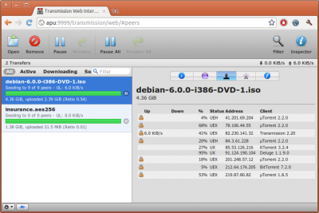{: width="500" height="334" loading="lazy"}

=== "Zugriff auf die Weboberfläche"

    Das Webinterface ist über Port **9091** erreichbar:

    - URL = `http://<Ihre.IP>:9091`
    - Benutzername = `root`
    - Passwort = `<Ihr globales Passwort>`

=== "Auf Downloads zugreifen"

    Stellen Sie sicher, dass Sie einen der [Dateiserver](../file_servers/) von DietPi installiert haben.
    Von Transmission verwendete Ordner:

    - Ordner, auf den über den Dateiserver zugegriffen wird = `downloads`
    - lokaler Ordner = `/mnt/dietpi_userdata/downloads`

=== "Probleme mit geschlossenen Ports"

    DietPi richtet Transmission ein, um die Portweiterleitung auf dem Router zu verwenden.
    In seltenen Fällen funktioniert dies bei einigen Routern nicht und Sie müssen die Portweiterleitung manuell einrichten:

    - Verwenden Sie TCP+UDP mit dem standardmäßigen DietPi-Übertragungsport von **51413**.
    - Richten Sie diesen Port auf die IP-Adresse Ihres DietPi-Systems.

    Sobald die Portweiterleitung eingerichtet ist, führen Sie einfach die folgenden Schritte aus, um die Übertragung zu aktualisieren:

    - Laden Sie das Übertragungs-Webinterface hoch
    - Klicken Sie auf die Schaltfläche "Einstellungen" (Schraubenschlüssel unten links)
    - Klicken Sie auf die Registerkarte „Netzwerk“.
    - Wo steht "Use port forwarding on my router", deaktivieren Sie dieses Kästchen.

    Schließen Sie einfach diesen Bildschirm und öffnen Sie ihn erneut, um den Portstatus zu aktualisieren.

=== „Empfohlen: Schützen Sie Ihre Privatsphäre mit einem VPN“

    Obwohl wir die erzwungene Verschlüsselung auf allen unseren BitTorrent-Clients aktivieren, ist die Verwendung eines VPN entscheidend, wenn Sie vollständige Privatsphäre und Sicherheit für alle Ihre heruntergeladenen Inhalte gewährleisten möchten. Wir empfehlen dringend [**NordVPN**](https://go.nordvpn.net/aff_c?offer_id=15&aff_id=5305&url_id=902), da es unbegrenzte Bandbreite, keine Protokollierung und bis zu 6 Geräte in einem einzigen Konto bietet. Es kann einfach mit unserem Tool [**DietPi-VPN**](../../dietpi_tools/#dietpi-vpn) eingerichtet werden.
    [{: width="300" height="65" loading="lazy"}](https://go.nordvpn.net/ aff_c?offer_id=15&aff_id=5305&url_id=902)

## Deluge

Deluge, der Webinterface-BitTorrent-Server, mit dem Sie BitTorrent-Dateien herunterladen können. Dieser Python-codierte BitTorrent-Server ist eine Alternative zur Option [Lightweight Transmission](#transmission-lightweight-bittorrent-server-with-web-interface).

!!! Hinweis "dedizierte USB-Festplatte dringend empfohlen"

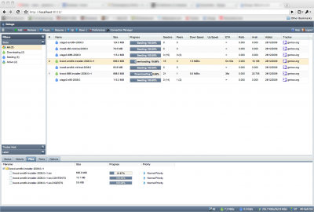{: width="500" height="338" loading="lazy"}

=== "Zugriff auf die Weboberfläche"

    Das Webinterface ist über Port **8112** erreichbar:

    - URL = `http://<Ihre.IP>:8112`
    - Passwort = `<Ihr globales Passwort>`

    Wählen Sie den Host 127.0.0.1 aus und klicken Sie auf „Verbinden“.

=== "Zugriff auf die Deluge-Konsole"

    ```sh
    sudo -u debian-deluged deluge-console
    ```

=== „Verbinden Sie sich mit Ihrem Desktop-Deluge-Client“

    - Öffnen Sie den Deluge-Client auf Ihrem anderen System
    - Wählen Sie „Preferences“ \> „Interface“ und deaktivieren (deaktivieren) „Classic Mode“. Speichern Sie die Änderungen und starten Sie Deluge neu
    - Wenn der Verbindungsmanager erscheint, wählen Sie „Hinzufügen“.
    - Geben Sie die folgenden Daten ein:
    - Hostname = IP-Adresse Ihres Geräts (zB: 192.168.0.100)
    - Port = 58846
    - Benutzername = `root`
    - Passwort = `<Ihr globales Passwort>`
    - Einfach auswählen und mit dem neuen Eintrag verbinden

=== "Auf Downloads zugreifen"

    Stellen Sie sicher, dass Sie einen der [Dateiserver](../file_servers/) von DietPi installiert haben.
    Von Deluge verwendete Ordner:

    - Ordner, auf den über den Dateiserver zugegriffen wird = `downloads`
    - Lokaler Ordner = `/mnt/dietpi_userdata/downloads`

=== „Empfohlen: Schützen Sie Ihre Privatsphäre mit einem VPN“

    Obwohl wir die erzwungene Verschlüsselung auf allen unseren BitTorrent-Clients aktivieren, ist die Verwendung eines VPN entscheidend, wenn Sie vollständige Privatsphäre und Sicherheit für alle Ihre heruntergeladenen Inhalte gewährleisten möchten. Wir empfehlen dringend [**NordVPN**](https://go.nordvpn.net/aff_c?offer_id=15&aff_id=5305&url_id=902), da es unbegrenzte Bandbreite, keine Protokollierung und bis zu 6 Geräte in einem einzigen Konto bietet. Es kann einfach mit unserem Tool [**DietPi-VPN**](../../dietpi_tools/#dietpi-vpn) eingerichtet werden.
    [{: width="300" height="65" loading="lazy"}](https://go.nordvpn.net/ aff_c?offer_id=15&aff_id=5305&url_id=902)

## qBittorrent

qBittorrent ist ein leichtgewichtiger BitTorrent-Server mit einer eleganten Weboberfläche. Da es in C++ (Qt) codiert ist, bietet es eine hervorragende Leistung auf jedem Gerät.

!!! Notiz "dedizierte USB-Festplatte dringend empfohlen"

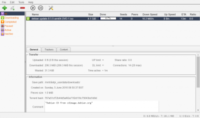{: width="400" height="236" loading="lazy"}

=== "Zugriff auf die Weboberfläche"

    Das Webinterface ist über Port **1340** erreichbar:

    - URL = `http://<Ihre.IP>:1340`
    - Benutzername = `qbittorrent`
    - Passwort = `<Ihr globales Passwort>` (Standard: `dietpi`)
        Anmerkung: Seit qBittorrent v4.2.0 (Debian Bullseye) wird ein neuer sicherer Hash-Algorithmus verwendet, den wir derzeit nicht mit gängigen Shell-Tools dynamisch für das globale Software-Passwort replizieren können. Bis dahin lautet das Passwort für Ihren ersten Login `dietpi`. Bitte ändern Sie es direkt nach dem ersten Login: <https://github.com/MichaIng/DietPi/issues/5078>

=== "Auf Downloads zugreifen"

    Stellen Sie sicher, dass Sie einen der [Dateiserver](../file_servers/) von DietPi installiert haben.
    Von qBittorrent verwendete Ordner:

    - Ordner, auf den über den Dateiserver zugegriffen wird = `downloads`
    - Lokaler Ordner = `/mnt/dietpi_userdata/downloads`

=== "Verwendung von Such-Plugins"

    Bevor Sie Such-Plugins in qBittorrent aktivieren, müssen Sie zuerst Python installieren. Anschließend können Sie die Plugins suchen und aktivieren.

=== „Empfohlen: Schützen Sie Ihre Privatsphäre mit einem VPN“

    Obwohl wir die erzwungene Verschlüsselung auf allen unseren BitTorrent-Clients aktivieren, ist die Verwendung eines VPN entscheidend, wenn Sie vollständige Privatsphäre und Sicherheit für alle Ihre heruntergeladenen Inhalte gewährleisten möchten. Wir empfehlen dringend [**NordVPN**](https://go.nordvpn.net/aff_c?offer_id=15&aff_id=5305&url_id=902), da es unbegrenzte Bandbreite, keine Protokollierung und bis zu 6 Geräte in einem einzigen Konto bietet. Es kann einfach mit unserem Tool [**DietPi-VPN**](../../dietpi_tools/#dietpi-vpn) eingerichtet werden.
    [{: width="300" height="65" loading="lazy"}](https://go.nordvpn.net/ aff_c?offer_id=15&aff_id=5305&url_id=902)

## rTorrent

rTorrent ist ein BitTorrent-Server. ruTorrent wird ebenfalls installiert, um den Zugriff und die Kontrolle über die Webschnittstelle zu ermöglichen.

Installiert auch:

- Webserver

!!! Hinweis "dedizierte USB-Festplatte dringend empfohlen"

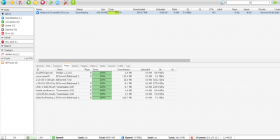{: width="400" height="201" loading="lazy"}

=== "Zugriff auf die Weboberfläche"

    - URL = `http://<your.IP>/rutorrent`
    - Benutzername = `root`
    - Passwort = `<Ihr globales Passwort>` (Standard: `dietpi`)

    Die Anmeldeinformationen können je nach Webserver-Wahl mit den folgenden Befehlen geändert werden:

    ```sh
    # mit Lighttpd (default):
    echo "username:rtorrent:$(echo -n 'username:rtorrent:password' | md5sum | mawk '{print $1}')" > /etc/.rutorrent-htaccess

    # mit Apache:
    htpasswd -c /etc/.rutorrent-htaccess

    # mit Nginx:
    echo "username:$(openssl passwd -apr1 'password')" > /etc/.rutorrent-htaccess
    ```

=== "Auf Downloads zugreifen"

    Stellen Sie sicher, dass Sie einen der [Dateiserver](../file_servers/) von DietPi installiert haben.
    Von rTorrent verwendete Ordner:

    - Ordner, auf den über den Dateiserver zugegriffen wird = `downloads`
    - Lokaler Ordner = `/mnt/dietpi_userdata/downloads`

    Wichtiger Hinweis:
    rTorrent erstellt eine Sperrdatei basierend auf dem Hostnamen des Systems. Wenn der Hostname geändert wird (z. B. über `dietpi-config` \> `Sicherheitsoptionen`), muss die alte Sperrdatei entfernt werden, damit rTorrent eine neue basierend auf dem neuen Hostnamen erstellen kann:

    ```sh
    rm /mnt/dietpi_userdata/downloads/.session/rtorrent.lock
    systemctl restart rtorrent
    ```

=== "Auf rTorrent RPC zugreifen"

    rTorrent lauscht standardmäßig auf dem UNIX-Domain-Socket unter `/mnt/dietpi_userdata/downloads/.session/rpc.socket`. Der Webserver ist so konfiguriert, dass er `http://<your.IP>/RPC2`-Aufrufe an den UNIX-Socket weiterleitet, aber für diese URL wird eine HTTP-Authentifizierung erzwungen.

=== „Empfohlen: Schützen Sie Ihre Privatsphäre mit einem VPN“

    Obwohl wir die erzwungene Verschlüsselung auf allen unseren BitTorrent-Clients aktivieren, ist die Verwendung eines VPN entscheidend, wenn Sie vollständige Privatsphäre und Sicherheit für alle Ihre heruntergeladenen Inhalte gewährleisten möchten. Wir empfehlen dringend [**NordVPN**](https://go.nordvpn.net/aff_c?offer_id=15&aff_id=5305&url_id=902), da es unbegrenzte Bandbreite, keine Protokollierung und bis zu 6 Geräte in einem einzigen Konto bietet. Es kann einfach mit unserem Tool [**DietPi-VPN**](../../dietpi_tools/#dietpi-vpn) eingerichtet werden.
    [{: width="300" height="65" loading="lazy"}](https://go.nordvpn.net/ aff_c?offer_id=15&aff_id=5305&url_id=902)

=== "Protokolle anzeigen"

    Führen Sie den folgenden Befehl aus, um rTorrent-Dienstprotokolle anzuzeigen:

    ```sh
    journalctl -u rtorrent
    ```

Probleme mit der Weboberfläche können über Webserver-Protokolle behoben werden:

    ```sh
    # mit Lighttpd (default):
    journalctl -u lighttpd
    more /var/log/lighttpd/error.log

    # mit Apache:
    journalctl -u apache2
    more /var/log/apache2/error.log

    # mit Nginx:
    journalctl -u nginx
    more /var/log/nginx/error.log
    ```

=== "Auf neueste Version aktualisieren"

    rTorrent selbst wird über APT installiert und kann daher durch Ausführen der folgenden Befehle aktualisiert werden:

    ```sh
    apt update
    apt install rtorrent
    ```

    Soll auch das ruTorrent-Webinterface aktualisiert werden, ist am einfachsten eine Neuinstallation:

    ```sh
    dietpi-software reinstall 107
    ```

***

Offizielle Website: <https://rakshasa.github.io/rtorrent/>
Offizielle Dokumentation: <https://github.com/rakshasa/rtorrent/wiki>
Wikipedia: <https://wikipedia.org/wiki/RTorrent>
Quellcode: <https://github.com/rakshasa/rtorrent>
Lizenz: [GPLv2](https://github.com/rakshasa/rtorrent/blob/master/COPYING)

ruTorrent-Dokumentation: <https://github.com/Novik/ruTorrent/wiki>
ruTorrent-Quellcode: <https://github.com/Novik/ruTorrent>
ruTorrent-Lizenz: [GPLv3](https://github.com/Novik/ruTorrent/blob/master/LICENSE.md)

## Arie2

Download-Manager mit einer eleganten Web-Benutzeroberfläche. Unterstützt auch BitTorrent-Downloads.

Installiert auch:

- Webserver

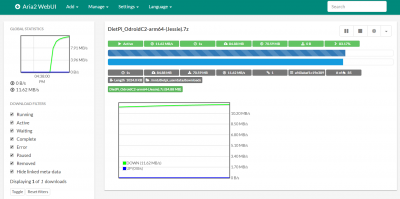{: width="400" height="199" loading="lazy"}

=== "Zugriff auf die Weboberfläche"

    - URL = `http://<your.IP>/aria2/docs`
    - rpc secret password = `<Ihr globales Passwort>`

    Dies muss an der folgenden Stelle in der Weboberfläche eingegeben werden:

    - „Einstellungen“.
    - „Verbindungseinstellungen“.
    - Geben Sie das geheime RPC-Passwort in das Feld "Geben Sie das geheime Token ein (optional):" ein und speichern Sie die Änderungen

=== "Auf Downloads zugreifen"

Stellen Sie sicher, dass Sie einen der [Dateiserver](../file_servers/) von DietPi installiert haben.
Von Aria2 verwendete Ordner:

    - Ordner, auf den über den Dateiserver zugegriffen wird = `downloads`
    - Lokaler Ordner = `/mnt/dietpi_userdata/downloads`

=== "Einstellungsänderungen dauerhaft vornehmen"

Bitte beachten Sie, dass das `aria2-webui` das Speichern von Einstellungen nach dem Beenden der Sitzung nicht unterstützt, dies ist eine bekannte Einschränkung der Software, bitte verwenden Sie die Datei `aria2.conf`, um Änderungen vorzunehmen:

    - Stoppen Sie Dienste mit `systemctl stop aria2`
    - Bearbeiten Sie die folgende Konfigurationsdatei: `/mnt/dietpi_userdata/aria2/aria2.conf` und nehmen Sie die erforderlichen Änderungen vor.
    - Dienste mit `systemctl start aria2` starten

Vollständige Liste der `aria2.conf`-Einstellungen: <https://aria2.github.io/manual/en/html/aria2c.html>

=== „Empfohlen: Schützen Sie Ihre Privatsphäre mit einem VPN“

    Obwohl wir die erzwungene Verschlüsselung auf allen unseren BitTorrent-Clients aktivieren, ist die Verwendung eines VPN entscheidend, wenn Sie vollständige Privatsphäre und Sicherheit für alle Ihre heruntergeladenen Inhalte gewährleisten möchten. Wir empfehlen dringend [**NordVPN**](https://go.nordvpn.net/aff_c?offer_id=15&aff_id=5305&url_id=902), da es unbegrenzte Bandbreite, keine Protokollierung und bis zu 6 Geräte in einem einzigen Konto bietet. Es kann einfach mit unserem Tool [**DietPi-VPN**](../../dietpi_tools/#dietpi-vpn) eingerichtet werden.
    [{: width="300" height="65" loading="lazy"}](https://go.nordvpn.net/ aff_c?offer_id=15&aff_id=5305&url_id=902)

## SABnzbd

NZB-Download-Manager mit Weboberfläche.

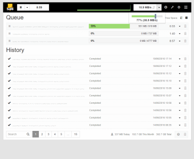{: width="400" height="328" loading="lazy"}

=== "Zugriff auf die Weboberfläche"

    Das Webinterface verwendet Port **8080**:

    - URL = `http://<your.IP>:8080/sabnzbd`

=== "Webinterface wird nicht geladen / Zugriff nicht möglich"

    In einigen Fällen ist die anfängliche Konfigurationsgenerierung während der Installation nicht erfolgreich.
    Wenn dies bei Ihnen auftritt, führen Sie bitte die folgenden Befehle aus, um die Konfigurationseinstellungen für DietPi erneut anzuwenden (kopieren und einfügen).

    ```sh
    systemctl stop sabnzbd
    G_CONFIG_INJECT 'download_dir =' "download_dir = /mnt/dietpi_userdata/downloads/incomplete" /etc/sabnzbd/sabnzbd.ini
    G_CONFIG_INJECT 'complete_dir =' "complete_dir = /mnt/dietpi_userdata/downloads/complete" /etc/sabnzbd/sabnzbd.ini
    G_CONFIG_INJECT 'nzb_backup_dir =' "nzb_backup_dir = /mnt/dietpi_userdata/downloads/sabnzbd_nzb_backup" /etc/sabnzbd/sabnzbd.ini
    G_CONFIG_INJECT 'admin_dir =' "admin_dir = /mnt/dietpi_userdata/downloads/sabnzbd_admin" /etc/sabnzbd/sabnzbd.ini
    G_CONFIG_INJECT 'log_dir =' 'log_dir = /var/log/sabnzbd' /etc/sabnzbd/sabnzbd.ini
    G_CONFIG_INJECT 'log_level =' 'log_level = 0' /etc/sabnzbd/sabnzbd.ini
    G_CONFIG_INJECT 'refresh_rate =' 'refresh_rate = 2' /etc/sabnzbd/sabnzbd.ini
    G_CONFIG_INJECT 'host =' 'host = 0.0.0.0' /etc/sabnzbd/sabnzbd.ini
    G_CONFIG_INJECT 'permissions =' 'permissions = 0775' /etc/sabnzbd/sabnzbd.ini
    G_CONFIG_INJECT 'auto_browser =' 'auto_browser = 0' /etc/sabnzbd/sabnzbd.ini
    systemctl start sabnzbd
    ```

=== "Auf Downloads zugreifen"

    Stellen Sie sicher, dass Sie einen der [Dateiserver](../file_servers/) von DietPi installiert haben.
    Von SABnzbd verwendete Ordner:

    - Ordner, auf den über den Dateiserver zugegriffen wird = `downloads/complete`
    - lokaler Ordner = `/mnt/dietpi_userdata/downloads/complete`

=== "Optional: Multithreaded PAR2"

    Erfordert eine kompilierte Installation, siehe: <https://sabnzbd.org/wiki/installation/multicore-par2>

    Hinweis: Die Schritte erfordern einen Git-Client und Build-Tools (Build-Essentials). Sie können diesen Running Next-Befehl im Terminal installieren:

    ```sh
    dietpi-software install 16 17
    ```

=== „Empfohlen: Schützen Sie Ihre Privatsphäre mit einem VPN“

    Obwohl wir die erzwungene Verschlüsselung auf allen unseren BitTorrent-Clients aktivieren, ist die Verwendung eines VPN entscheidend, wenn Sie vollständige Privatsphäre und Sicherheit für alle Ihre heruntergeladenen Inhalte gewährleisten möchten. Wir empfehlen dringend [**NordVPN**](https://go.nordvpn.net/aff_c?offer_id=15&aff_id=5305&url_id=902), da es unbegrenzte Bandbreite, keine Protokollierung und bis zu 6 Geräte in einem einzigen Konto bietet. Es kann einfach mit unserem Tool [**DietPi-VPN**](../../dietpi_tools/#dietpi-vpn) eingerichtet werden.
    [{: width="300" height="65" loading="lazy"}](https://go.nordvpn.net/ aff_c?offer_id=15&aff_id=5305&url_id=902)

## Medusa

Laden Sie Ihre Lieblingsfernsehsendungen automatisch herunter, sobald sie verfügbar sind.
Durchsucht sowohl Bit Torrent als auch Usenet und verfügt über eine Funktion zum automatischen Herunterladen und Organisieren des Downloads mit Ihrer bevorzugten Bit Torrent-App.

??? Notiz "Ein Download-Client ist erforderlich"

    Übertragung BitTorrent-Server wird empfohlen, um automatische Downloads zu ermöglichen

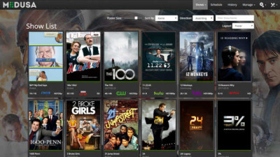{: width="400" height="225" loading="lazy"}

=== "Zugriff auf die Weboberfläche"

    Das Webinterface ist über Port **8081** erreichbar:

    - URL = `http://<Ihre.IP>:8081`

=== "TV-Sendung hinzufügen"

    Einmal bei Medusa registriert und eingeloggt:

    - Klicken Sie auf die Schaltfläche "Shows" (oben auf dem Bildschirm)
    - Klicken Sie auf die Option „Shows hinzufügen“.
    - Wählen Sie die Option „Neue Sendung hinzufügen“.
    - Geben Sie eine zu suchende TV-Sendung in das Suchfeld ein, wählen Sie einen der Einträge aus den Suchergebnissen aus und klicken Sie dann auf „Weiter“.
    - Stellen Sie sicher, dass der übergeordnete Ordner „/mnt/dietpi_userdata/downloads“ ist, und klicken Sie dann auf „Weiter“.
    - Klicken Sie abschließend auf die Schaltfläche "Show hinzufügen".

=== "Optional: Ändern Sie, welche BitTorrent-Sites Medusa durchsuchen soll"

    - Klicken Sie auf die „Einstellungen“-Schaltfläche „Zahnrad“ (in der oberen rechten Ecke des Bildschirms).
    - Wählen Sie „Anbieter suchen“.
    - Wählen und aktivieren Sie die BitTorrent-Sites, die Sie aktivieren möchten. Wenn Medusa nach einer TV-Sendung sucht, werden diese Seiten nach dem verfügbaren Torrent durchsucht.
    - Klicken Sie abschließend auf „Änderungen speichern“ (unten auf der Seite)

=== "Medusa so einrichten, dass Torrents automatisch heruntergeladen werden"

    Um diese Funktion nutzen zu können, muss ein unterstützter BitTorrent-Server installiert sein. Alle in `dietpi-software` verfügbaren BitTorrent-Server werden von Medusa unterstützt.

    - Klicken Sie auf die „Einstellungen“-Schaltfläche „Zahnrad“ (in der oberen rechten Ecke des Bildschirms).
    - Wählen Sie „Sucheinstellungen“.
    - Wählen Sie die Registerkarte „Torrent-Suche“.
    - Stellen Sie sicher, dass der Eintrag Torrent-Suchanbieter aktivieren aktiviert ist (Häkchen gesetzt)
    - Wählen Sie unter dem Abschnitt „Torrent-Dateien senden an“ das BitTorrent-Programm aus, das Sie installiert haben, und geben Sie dann die Details ein.
    - Verwenden Sie die Schaltfläche „Verbindung testen“ unten auf der Seite, um sicherzustellen, dass Medusa eine Verbindung zu Ihrem BitTorrent-Server herstellen kann.
    - Klicken Sie abschließend auf „Änderungen speichern“ (unten auf der Seite)

=== „Empfohlen: Schützen Sie Ihre Privatsphäre mit einem VPN“

    Obwohl wir die erzwungene Verschlüsselung auf allen unseren BitTorrent-Clients aktivieren, ist die Verwendung eines VPN entscheidend, wenn Sie vollständige Privatsphäre und Sicherheit für alle Ihre heruntergeladenen Inhalte gewährleisten möchten. Wir empfehlen dringend [**NordVPN**](https://go.nordvpn.net/aff_c?offer_id=15&aff_id=5305&url_id=902), da es unbegrenzte Bandbreite, keine Protokollierung und bis zu 6 Geräte in einem einzigen Konto bietet. Es kann einfach mit unserem Tool [**DietPi-VPN**](../../dietpi_tools/#dietpi-vpn) eingerichtet werden.
    [{: width="300" height="65" loading="lazy"}](https://go.nordvpn.net/ aff_c?offer_id=15&aff_id=5305&url_id=902)

## Sonarr

Laden Sie Ihre Lieblingsfernsehsendungen automatisch herunter, sobald sie verfügbar sind.

??? Notiz "Ein Download-Client ist erforderlich"

    Übertragung BitTorrent-Server wird empfohlen, um automatische Downloads zu ermöglichen

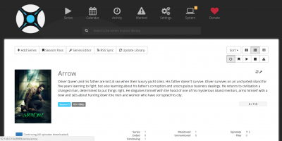{: width="400" height="200" loading="lazy"}

=== "Zugriff auf die Weboberfläche"

    Das Webinterface ist über Port **8989** erreichbar:

    - URL = `http://<Ihre.IP>:8989`

=== "Erste Ausführung einrichten"

    Bevor Sie TV-Sendungen hinzufügen können, müssen Sie auf der Weboberfläche einen Suchindexer auswählen, der verwendet werden soll:

    - Gehen Sie einfach zu „Einstellungen“ \> „Indexer“ und wählen Sie dann mindestens einen Indexer aus.

    Richten Sie Ihren Download-Client ein:

    - Gehen Sie einfach zu „Einstellungen“ \> „Download-Client“, wählen Sie Ihren installierten Download-Client aus und geben Sie [erforderliche Anmeldeinformationen](#transmission-lightweight-bittorrent-server-with-web-interface) ein.

    Maske zum Erstellen von Setup-Dateien:
    Wenn Sie Schreibzugriff von anderen Anwendungen benötigen (z. B. Plex-Untertitel-Downloads), müssen Sie auch die Datei-/Ordner-Erstellungsmaske so einstellen, dass dies zulässig ist.

    - Wählen Sie in der Sonarr-Weboberfläche „Einstellungen“.
    - Wechseln Sie zum Schieberegler "Erweiterte Einstellungen" (aktivieren)
    - Scrollen Sie auf der Registerkarte "Medienverwaltung" zum Ende der Seite, stellen Sie unter "Berechtigungen" die folgenden Werte ein:

    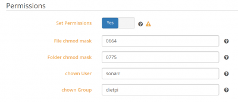{: width="400" height="171" loading="lazy"}

    - Änderungen speichern

=== "TV-Sendung hinzufügen"

    - Wählen Sie einfach "Serien" \> "TV-Sendung hinzufügen".
    - Geben Sie einen Namen der Show ein, die Sie finden möchten
    - Einmal gefunden, verwenden Sie unter Pfad den folgenden Speicherort `/mnt/dietpi_userdata/downloads`
    - Ändern Sie bei Bedarf weitere Optionen (z. B. Videoqualität) und wählen Sie dann „+“.

=== "Benutzerdefinierte Download-/Medienverzeichnisse verwenden"

    Standardmäßig hat Sonarr strenge Berechtigungen, um nur auf Download- und Medienverzeichnisse in `/mnt/` zuzugreifen. Wenn Sie einen anderen Standort verwenden müssen, gehen Sie bitte wie folgt vor:

    1. Führen Sie „dietpi-services“ von der Konsole aus
    2. Wählen Sie „sonarr“ aus
    3. Wählen Sie „Bearbeiten“.
    4. Kommentieren Sie die Zeile aus (entfernen Sie das führende `#`), beginnend mit `ReadWritePaths=`
    5. Fügen Sie Ihren benutzerdefinierten Pfad am Ende dieser Zeile hinzu, getrennt durch ein Leerzeichen
    6. Drücken Sie die Tasten ++ctrl+o++ zum Speichern und ++ctrl+x++ zum Beenden

=== "Datenbanken mit RAM verknüpfen"

    Verknüpfen Sie die Sonarr-Info-/Einstellungsdatenbank mit dem RAM, um die Zugriffsleistung zu erhöhen, die Festplatten-E/A zu reduzieren und das ständige Drehen externer Festplatten aufgrund des sehr regelmäßigen Zugriffs auf diese Dateien zu vermeiden: <https://dietpi.com/phpbb/viewtopic.php? t=5828>

=== „Empfohlen: Schützen Sie Ihre Privatsphäre mit einem VPN“

    Obwohl wir die erzwungene Verschlüsselung auf allen unseren BitTorrent-Clients aktivieren, ist die Verwendung eines VPN entscheidend, wenn Sie vollständige Privatsphäre und Sicherheit für alle Ihre heruntergeladenen Inhalte gewährleisten möchten. Wir empfehlen dringend [**NordVPN**](https://go.nordvpn.net/aff_c?offer_id=15&aff_id=5305&url_id=902), da es unbegrenzte Bandbreite, keine Protokollierung und bis zu 6 Geräte in einem einzigen Konto bietet. Es kann einfach mit unserem Tool [**DietPi-VPN**](../../dietpi_tools/#dietpi-vpn) eingerichtet werden.
    [{: width="300" height="65" loading="lazy"}](https://go.nordvpn.net/ aff_c?offer_id=15&aff_id=5305&url_id=902)

***

YouTube-Video-Tutorial: *Installieren und Konfigurieren von Sonarr auf Raspberry Pi mit DietPi*.

<iframe src="https://www.youtube-nocookie.com/embed/3h0GvdKcR0Y?rel=0" frameborder="0" allow="fullscreen" width="560" height="315" loading="lazy" ></iframe>

## Radar

Laden Sie Ihre Lieblingsfilme automatisch herunter, sobald sie verfügbar sind.

??? Notiz "Ein Download-Client ist erforderlich"

    Übertragung BitTorrent-Server wird empfohlen, um automatische Downloads zu ermöglichen

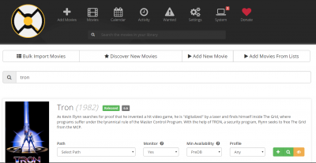{: width="400" height="207" loading="lazy"}

=== "Zugriff auf die Weboberfläche"

    Das Webinterface ist über Port **7878** erreichbar:

    - URL = `http://<Ihre.IP>:7878`

=== "Erste Ausführung einrichten"

    Bevor Sie Filme hinzufügen können, müssen Sie auf der Weboberfläche einen Suchindexer auswählen, der verwendet werden soll:

    - Gehen Sie einfach zu „Einstellungen“ \> „Indexer“ und wählen Sie dann mindestens einen Indexer aus.

    Richten Sie Ihren Download-Client ein:

    - Gehen Sie einfach zu „Einstellungen“ \> „Download-Client“, wählen Sie Ihren installierten Download-Client aus und geben Sie [erforderliche Anmeldeinformationen](#transmission-lightweight-bittorrent-server-with-web-interface) ein.

    Maske zum Erstellen von Setup-Dateien:
    Wenn Sie Schreibzugriff von anderen Anwendungen benötigen (z. B. Plex-Untertitel-Downloads), müssen Sie auch die Datei-/Ordner-Erstellungsmaske so einstellen, dass dies zulässig ist.

    - Wählen Sie in der Sonarr-Weboberfläche „Einstellungen“.
    - Wechseln Sie zum Schieberegler "Erweiterte Einstellungen" (aktivieren)
    - Scrollen Sie auf der Registerkarte "Medienverwaltung" zum Ende der Seite, stellen Sie unter "Berechtigungen" die folgenden Werte ein:

{: width="400" height="171" loading="lazy"}

    - Änderungen speichern

=== "Film hinzufügen"

    - Wählen Sie einfach "Filme hinzufügen".
    - Geben Sie einen Namen des Films ein, den Sie finden möchten
    - Einmal gefunden, verwenden Sie unter „Pfad“ den folgenden Speicherort „/mnt/dietpi_userdata/downloads“.
    - Ändern Sie bei Bedarf weitere Optionen (z. B. Videoqualität) und wählen Sie dann „+“.

=== "Benutzerdefinierte Download-/Medienverzeichnisse verwenden"

    Standardmäßig hat Radarr strenge Berechtigungen, um nur auf Download- und Medienverzeichnisse in `/mnt/` zuzugreifen. Wenn Sie einen anderen Standort verwenden müssen, gehen Sie bitte wie folgt vor:

    1. Führen Sie „dietpi-services“ von der Konsole aus
    2. Wählen Sie „Radar“ aus
    3. Wählen Sie „Bearbeiten“.
    4. Kommentieren Sie die Zeile aus (entfernen Sie das führende `#`), beginnend mit `ReadWritePaths=`
    5. Fügen Sie Ihren benutzerdefinierten Pfad am Ende dieser Zeile hinzu, getrennt durch ein Leerzeichen
    6. Drücken Sie die Tasten ++ctrl+o++ zum Speichern und ++ctrl+x++ zum Beenden

=== "Datenbanken mit RAM verknüpfen"

    Verknüpfen Sie die Info-/Einstellungsdatenbank von Radarr mit dem RAM, um die Zugriffsleistung zu erhöhen, die Festplatten-E/A zu reduzieren und das ständige Drehen externer Festplatten aufgrund des sehr regelmäßigen Zugriffs auf diese Dateien zu vermeiden: <https://dietpi.com/phpbb/viewtopic.php? t=5828>

=== „Empfohlen: Schützen Sie Ihre Privatsphäre mit einem VPN“

    Obwohl wir die erzwungene Verschlüsselung auf allen unseren BitTorrent-Clients aktivieren, ist die Verwendung eines VPN entscheidend, wenn Sie vollständige Privatsphäre und Sicherheit für alle Ihre heruntergeladenen Inhalte gewährleisten möchten. Wir empfehlen dringend [**NordVPN**](https://go.nordvpn.net/aff_c?offer_id=15&aff_id=5305&url_id=902), da es unbegrenzte Bandbreite, keine Protokollierung und bis zu 6 Geräte in einem einzigen Konto bietet. Es kann einfach mit unserem Tool [**DietPi-VPN**](../../dietpi_tools/#dietpi-vpn) eingerichtet werden.
    [{: width="300" height="65" loading="lazy"}](https://go.nordvpn.net/ aff_c?offer_id=15&aff_id=5305&url_id=902)

***

YouTube-Video-Tutorial: *Installieren und Konfigurieren von Radarr auf Raspberry Pi mit DietPi*.

<iframe src="https://www.youtube-nocookie.com/embed/ji9CgSBcf5E?rel=0" frameborder="0" allow="fullscreen" width="560" height="315" loading="lazy" ></iframe>

## Bazar

Bazarr ist eine Begleitanwendung zu Sonarr und Radarr, die Untertitel basierend auf Ihren Anforderungen verwaltet und herunterlädt.

Hauptmerkmale:

- **Automatische Suche**
Suchen Sie automatisch nach fehlenden Untertiteln und laden Sie sie herunter, sobald sie in Ihrer gewünschten Sprache verfügbar sind.
- **Manuelle Suche**
Finden Sie alle passenden Untertitel, wählen Sie den gewünschten aus und laden Sie ihn mit dem richtigen Namen zur Verwendung durch Ihren Mediaplayer in Ihr Medienverzeichnis herunter.
- **Untertitel-Upgrade**
Suchen Sie regelmäßig nach passenden Untertiteln und aktualisieren Sie den zuvor heruntergeladenen, wenn ein besserer gefunden wird.

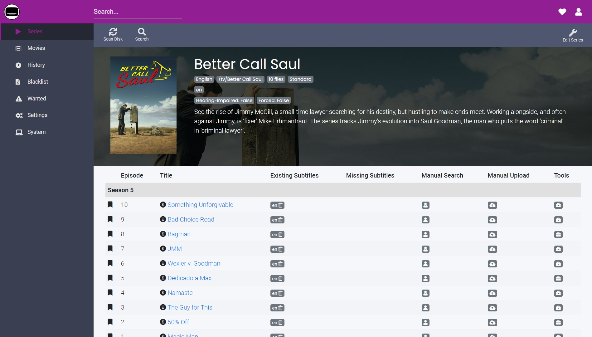{: width="1898" height="1080" loading="lazy"}

=== "Schnellstart"

    Das Webinterface ist über Port **6767** erreichbar:

    - URL = `http://<Ihre.IP>:6767`

    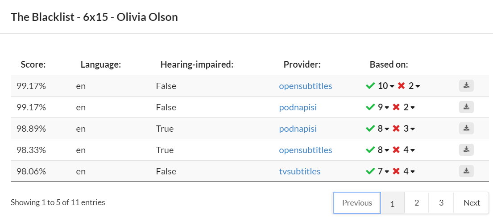{: width="1105" height="490" loading="lazy"}

=== "Erweitert"

    - Installationsverzeichnis: `/opt/bazarr`
    - Datenverzeichnis: `/mnt/dietpi_userdata/bazarr`
    - Bazarr-Konfigurationsdatei: `/mnt/dietpi_userdata/bazarr/config/config.ini`

=== "Protokolle anzeigen"

    - Dienst: `journalctl -u bazarr`
    - Binär: `/var/log/bazarr/bazarr.log`

=== "Auf neueste Version aktualisieren"

    - Verwenden Sie den internen webbasierten Updater

***

Offizielle Dokumentation: <https://github.com/morpheus65535/bazarr/wiki>
Quellcode: <https://github.com/morpheus65535/bazarr>

## Lidarr

Laden Sie Ihre Lieblingsmusik automatisch herunter.

??? Notiz "Ein Download-Client ist erforderlich"

Übertragung BitTorrent-Server wird empfohlen, um automatische Downloads zu ermöglichen

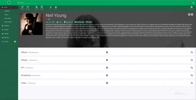{: width="400" height="205" loading="lazy"}

=== "Zugriff auf die Weboberfläche"

    Das Webinterface ist über Port **8686** erreichbar:

    - URL = `http://<Ihre.IP>:8686`

=== "Erste Ausführung einrichten"

    Bevor Sie Musik verwenden können, müssen Sie einen Suchindexer auswählen, der von der Weboberfläche verwendet werden soll:

    - Gehen Sie einfach zu `Einstellungen` \> `Indexer` und wählen Sie dann mindestens einen Indexer aus.

    Richten Sie Ihren Download-Client ein:

    - Gehen Sie einfach zu `Einstellungen` \> `Download-Client`, wählen Sie Ihren installierten Download-Client aus und geben Sie [erforderliche Anmeldeinformationen](#transmission-lightweight-bittorrent-server-with-web-interface) ein.

    Maske zum Erstellen von Setup-Dateien:
    Wenn Sie Schreibzugriff von anderen Anwendungen benötigen (z. B. Plex-Untertitel-Downloads), müssen Sie auch die Datei-/Ordner-Erstellungsmaske so einstellen, dass dies zulässig ist.

    - Wählen Sie in der Sonarr-Weboberfläche `Einstellungen`.
    - Wechseln Sie zum Schieberegler `Erweiterte Einstellungen` (aktivieren)
    - Scrollen Sie auf der Registerkarte `Medienverwaltung` zum Ende der Seite, stellen Sie unter "Berechtigungen" die folgenden Werte ein:

        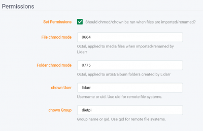{: width="400" height="257" loading="lazy"}

    - Änderungen speichern

=== "Musik hinzufügen"

    - Wählen Sie einfach `Künstler` \> `Neu hinzufügen` aus
    - Geben Sie den Namen des Künstlers ein, den Sie finden möchten
    - Sobald Sie es gefunden haben, verwenden Sie im Stammordner den folgenden Speicherort `/mnt/dietpi_userdata/downloads`
    - Ändern Sie alle anderen Einstellungen nach Bedarf und wählen Sie dann `Hinzufügen`.

=== "Benutzerdefinierte Download-/Medienverzeichnisse verwenden"

    Standardmäßig hat Lidarr strenge Berechtigungen, um nur auf Download- und Medienverzeichnisse in `/mnt/` zuzugreifen. Wenn Sie einen anderen Standort verwenden müssen, gehen Sie bitte wie folgt vor:

    1. Führen Sie `dietpi-services` von der Konsole aus
    2. Wählen Sie `lidarr` aus
    3. Wählen Sie `Bearbeiten`.
    4. Kommentieren Sie die Zeile aus (entfernen Sie das führende `#`), beginnend mit `ReadWritePaths=`
    5. Fügen Sie Ihren benutzerdefinierten Pfad am Ende dieser Zeile hinzu, getrennt durch ein Leerzeichen
    6. Drücken Sie die Tasten ++ctrl+o++ zum Speichern und ++ctrl+x++ zum Beenden

=== "Datenbanken mit RAM verknüpfen"

    Verknüpfen Sie die Lidarr-Info-/Einstellungsdatenbank mit dem RAM, um die Zugriffsleistung zu erhöhen, die Festplatten-E/A zu reduzieren und das ständige Drehen der externen Festplatte aufgrund des sehr regelmäßigen Zugriffs auf diese Dateien zu vermeiden:
    <https://dietpi.com/phpbb/viewtopic.php?t=5828>

=== „Empfohlen: Schützen Sie Ihre Privatsphäre mit einem VPN“

    Obwohl wir die erzwungene Verschlüsselung auf allen unseren BitTorrent-Clients aktivieren, ist die Verwendung eines VPN entscheidend, wenn Sie vollständige Privatsphäre und Sicherheit für alle Ihre heruntergeladenen Inhalte gewährleisten möchten. Wir empfehlen dringend [**NordVPN**](https://go.nordvpn.net/aff_c?offer_id=15&aff_id=5305&url_id=902), da es unbegrenzte Bandbreite, keine Protokollierung und bis zu 6 Geräte in einem einzigen Konto bietet. Es kann einfach mit unserem Tool [**DietPi-VPN**](../../dietpi_tools/#dietpi-vpn) eingerichtet werden.
    [{: width="300" height="65" loading="lazy"}](https://go.nordvpn.net/ aff_c?offer_id=15&aff_id=5305&url_id=902)

## Jacke

API-Unterstützung für Ihre bevorzugten Torrent-Tracker.

Jackett fungiert als Proxy-Server: Es übersetzt Anfragen von Apps (Sonarr, Radarr, Lidarr, Medusa) in Tracker-Site-spezifische HTTP-Anfragen, parst die HTML-Antwort und sendet die Ergebnisse dann zurück an die anfragende Software. Dies ermöglicht das Abrufen aktueller Uploads (wie RSS) und das Durchführen von Suchen.

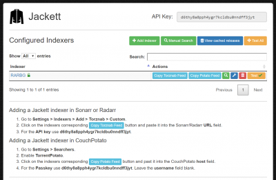{: width="400" height="262" loading="lazy"}

=== "Zugriff auf die Weboberfläche"

    Das Webinterface ist über Port **9117** erreichbar:

    - URL = `http://<Ihre.IP>:9117`

=== „Empfohlen: Schützen Sie Ihre Privatsphäre mit einem VPN“

    Obwohl wir die erzwungene Verschlüsselung auf allen unseren BitTorrent-Clients aktivieren, ist die Verwendung eines VPN entscheidend, wenn Sie vollständige Privatsphäre und Sicherheit für alle Ihre heruntergeladenen Inhalte gewährleisten möchten. Wir empfehlen dringend [**NordVPN**](https://go.nordvpn.net/aff_c?offer_id=15&aff_id=5305&url_id=902), da es unbegrenzte Bandbreite, keine Protokollierung und bis zu 6 Geräte in einem einzigen Konto bietet. Es kann einfach mit unserem Tool [**DietPi-VPN**](../../dietpi_tools/#dietpi-vpn) eingerichtet werden.
    [{: width="300" height="65" loading="lazy"}](https://go.nordvpn.net/ aff_c?offer_id=15&aff_id=5305&url_id=902)

## NZBGet

Extrem effizienter und schneller NZB-Download-Manager mit Webinterface. Codiert in C++.

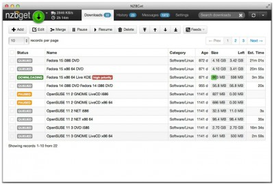{: width="400" height="270" loading="lazy"}

=== "Zugriff auf die Weboberfläche"

    Das Webinterface ist über Port **6789** erreichbar:

    - URL = `http://<Ihre.IP>:6789`
    - Benutzername = `admin`
    - Passwort = `<Ihr globales Passwort>`

=== "Auf Downloads zugreifen"

    Stellen Sie sicher, dass Sie einen der [Dateiserver](../file_servers/) von DietPi installiert haben.
    Von Transmission verwendete Ordner:

    - Ordnerzugriff über Dateiserver = `downloads/complete`
    - Lokaler Ordner = `/mnt/dietpi_userdata/downloads/complete`

=== „Empfohlen: Schützen Sie Ihre Privatsphäre mit einem VPN“

    Obwohl wir die erzwungene Verschlüsselung auf allen unseren BitTorrent-Clients aktivieren, ist die Verwendung eines VPN entscheidend, wenn Sie vollständige Privatsphäre und Sicherheit für alle Ihre heruntergeladenen Inhalte gewährleisten möchten. Wir empfehlen dringend [**NordVPN**](https://go.nordvpn.net/aff_c?offer_id=15&aff_id=5305&url_id=902), da es unbegrenzte Bandbreite, keine Protokollierung und bis zu 6 Geräte in einem einzigen Konto bietet. Es kann einfach mit unserem Tool [**DietPi-VPN**](../../dietpi_tools/#dietpi-vpn) eingerichtet werden.
    [{: width="300" height="65" loading="lazy"}](https://go.nordvpn.net/ aff_c?offer_id=15&aff_id=5305&url_id=902)

## HTPC-Manager

HTPC Manager kombiniert all Ihre Lieblingssoftware in einer glatten Oberfläche.
Erledigen Sie alle Ihre HTPC-Aufgaben, ohne 5 verschiedene Schnittstellen zu verwenden!

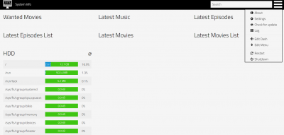{: width="400" height="191" loading="lazy"}

=== "Zugriff auf die Weboberfläche"

    Das Webinterface ist über Port **8085** erreichbar:

    - URL = `http://<Ihre.IP>:8085`

=== "Auf neueste Version aktualisieren"

    ```sh
    dietpi-software reinstall 155
    ```

## youtube-dl

„youtube-dl“ ist ein Befehlszeilenprogramm zum Herunterladen von Videos von YouTube.com und vielen weiteren Websites. Sehen Sie hier die vollständige Liste der unterstützten Websites – [link](https://ytdl-org.github.io/youtube-dl/supportedsites.html).

=== "Schnellstart"

    Auf dieses Tool kann über die Befehlszeile zugegriffen werden

    ```sh
    youtube-dl [OPTIONS] URL [URL...]
    ```

    Lesen Sie die Dokumentation für weitere Details zu den verwendeten Optionen - [link](https://github.com/ytdl-org/youtube-dl).

***

Website: <https://ytdl-org.github.io/youtube-dl/>
Dokumentation: <https://github.com/ytdl-org/youtube-dl/blob/master/README.md#readme>

[Zurück zur **Liste der optimierten Software**](../../software/)
