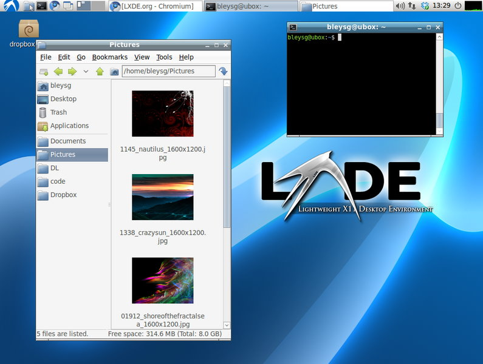
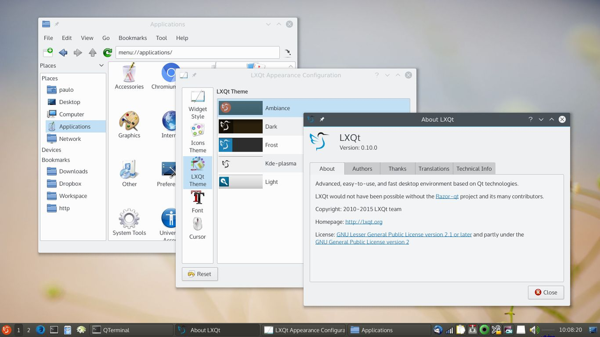
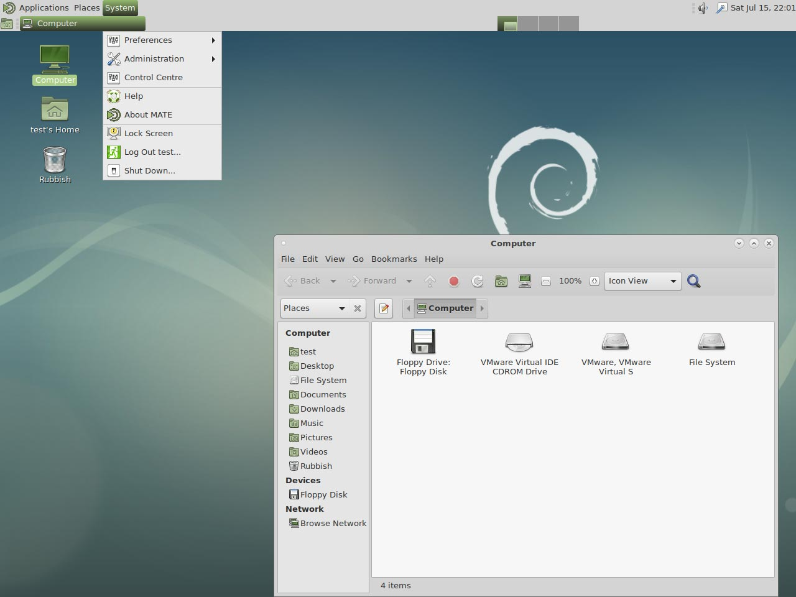
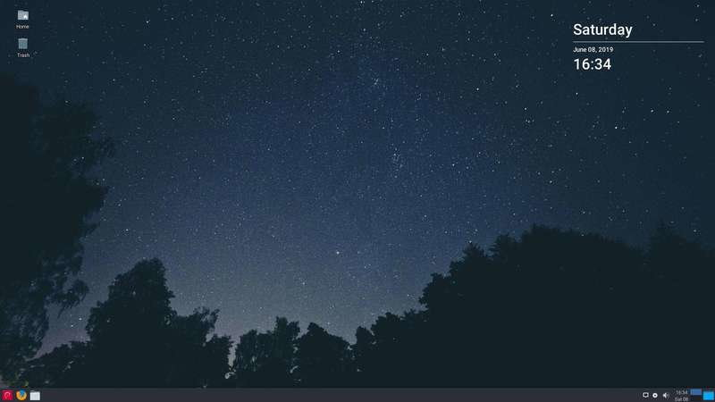
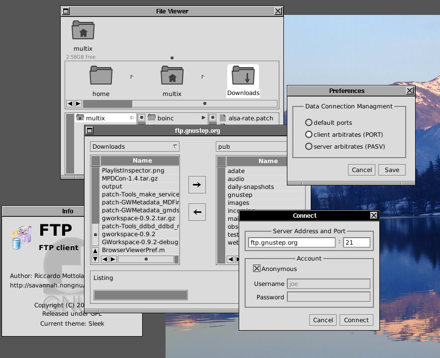
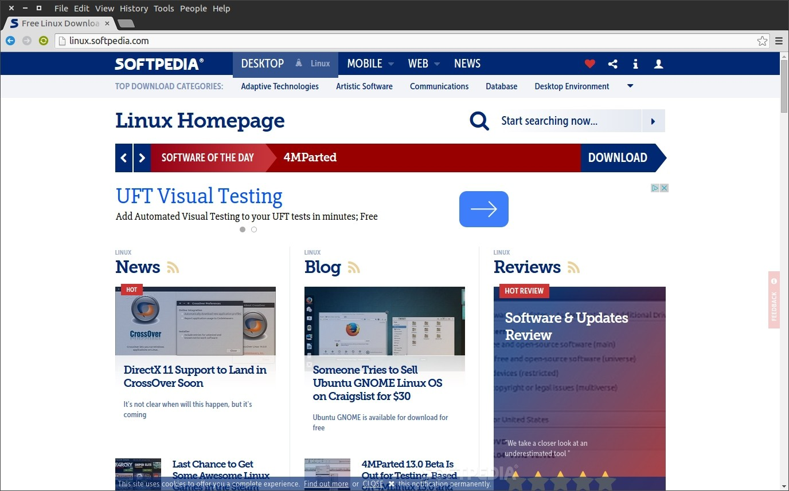
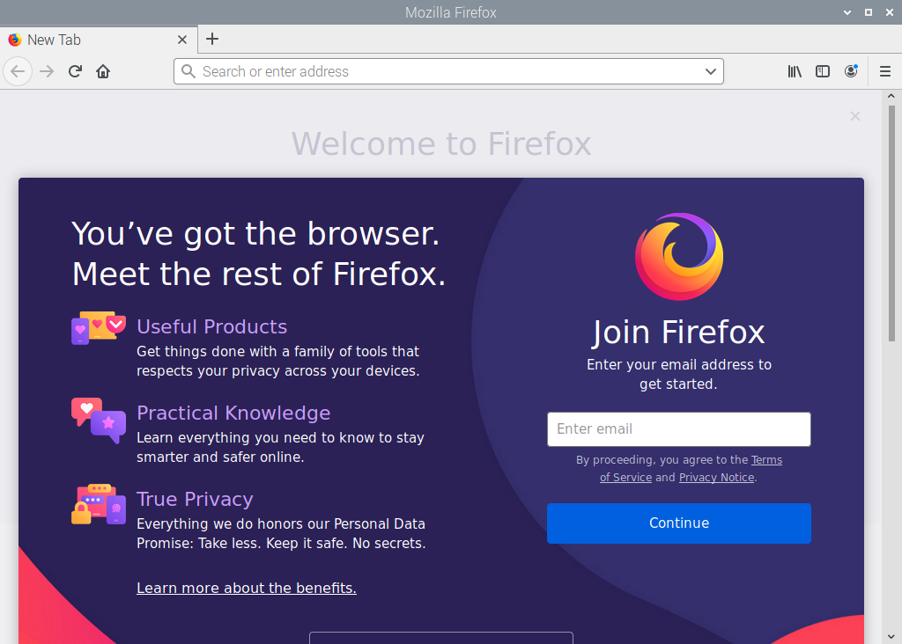
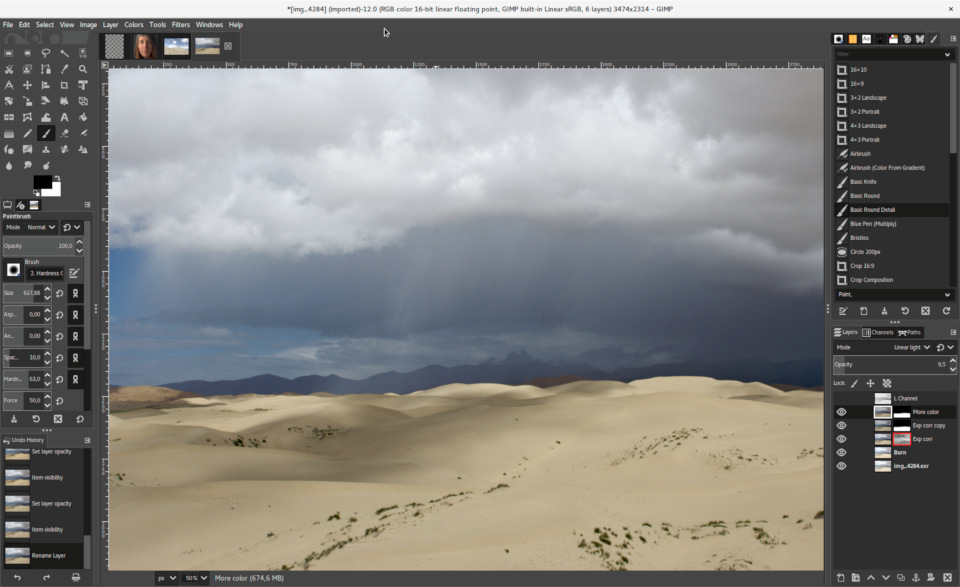
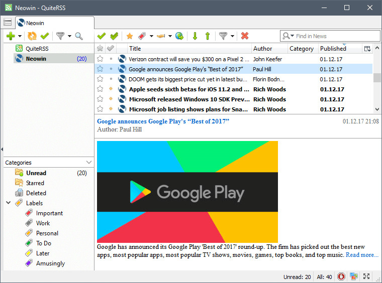
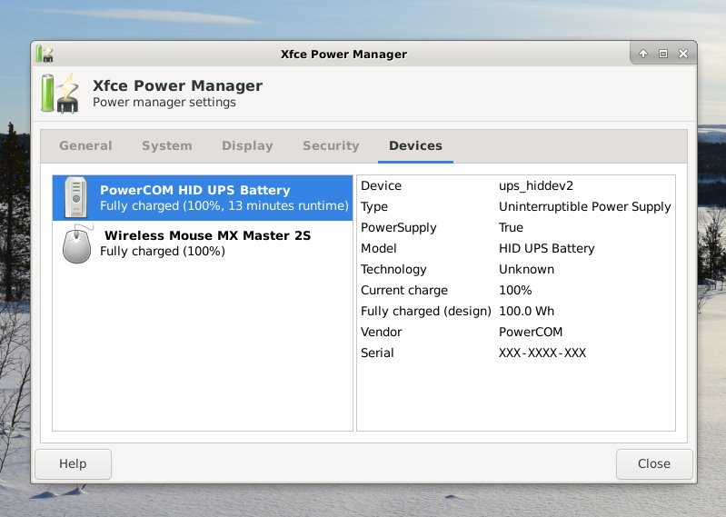

# Desktop-Umgebungen und Dienstprogramme

## &Uuml;berblick

### Desktops

- [**LXDE - Hochoptimierter ultraleichter Desktop**](#lxde)
- [**LXQt - Glatter und optimierter leichter Desktop**](#lxqt)
- [**MATE - Beliebter Gnome 2-Desktop**](#mate)
- [**Xfce - Lightweight-Desktop**](#xfce)
- [**GNUstep - Alternativer/einzigartiger Desktop**](#gnustep)

### Desktop-Dienstprogramme

- [**Chromium - Webbrowser**](#chromium)
- [**Firefox - Webbrowser**](#firefox)
- [**GIMP - Bildbearbeitung**](#gimp)
- [**QuiteRSS - Reader f&uuml;r RSS- und Atom-Newsfeeds**](#quiterss)
- [**Xfce Power Manager - Energiemanager mit Helligkeitssteuerung**](#xfce-power-manager)

??? Information "Wie f&uuml;hre ich **DietPi-Software** aus und installiere **optimierte Software**-Elemente?"
    Um eines der unten aufgef&uuml;hrten **DietPi-optimierten Softwareelemente** zu installieren, f&uuml;hren Sie es &uuml;ber die Befehlszeile aus:

    ```sh
    dietpi-software
    ```

    W&auml;hlen Sie **Software durchsuchen** und w&auml;hlen Sie einen oder mehrere Artikel aus. W&auml;hlen Sie abschlie&szlig;end `Installieren`.
    DietPi f&uuml;hrt alle notwendigen Schritte aus, um diese Softwareelemente zu installieren und zu starten.

    {: width="643" height="365" loading="lazy"}

    Um alle DietPi-Konfigurationsoptionen anzuzeigen, lesen Sie den Abschnitt [DietPi Tools](../../dietpi_tools/).

[Zur&uuml;ck zur **Liste der optimierten Software**](../../software/)

##LXDE

LXDE ist ein hochoptimierter und ultraleichter Desktop. Es funktioniert gut mit Computern am unteren Ende des Leistungsspektrums wie Netbooks und kleinen Computern der neuen Generation oder &auml;lteren Computern mit begrenzten Ressourcen.

{: width="795" height="600" loading="lazy"}

=== "Schnellstart"
    Nach der Installation kann der Desktop durch Eingabe ausgef&uuml;hrt werden

    ```sh
    startx
    ```

=== "Autostart aktivieren"
    Um verschiedene Programme beim Booten des Systems zu starten, f&uuml;hren Sie von der Befehlszeile aus:

    ```sh
    dietpi-autostart
    ```

    Um alle DietPi-Konfigurationsoptionen anzuzeigen, lesen Sie den Abschnitt [DietPi Tools](../../dietpi_tools/).

***

Website: <https://www.lxde.org>
Offizielle Dokumentation: <https://wiki.lxde.org/en/Main_Page>

##LXQt

Optimierter leichter Desktop ohne Bloatware. Glatte und fl&uuml;ssige GUI, jedoch ressourcenintensiver als LXDE.

{: width="1280" height="720" loading="lazy"}

Quelle: [LXQt](https://lxqt.github.io/screenshots/), CC BY-SA 3.0, [wikimedia](https://commons.wikimedia.org/w/index.php?curid=52420839) .

=== "Schnellstart"
    Nach der Installation kann der Desktop durch Eingabe ausgef&uuml;hrt werden

    ```sh
    startx
    ```

=== "Autostart aktivieren"
    Um verschiedene Programme beim Booten des Systems zu starten, f&uuml;hren Sie von der Befehlszeile aus:

    ```sh
    dietpi-autostart
    ```

    Um alle DietPi-Konfigurationsoptionen anzuzeigen, lesen Sie den Abschnitt [DietPi Tools](../../dietpi_tools/).

***

Offizielle Dokumentation: <https://wiki.debian.org/LXQt>

## MATE

Beliebte Gnome2-basierte Desktop-Umgebung.

{: width="1280" height="960" loading="lazy"}

=== "Schnellstart"
    Nach der Installation kann der Desktop durch Eingabe ausgef&uuml;hrt werden

    ```sh
    startx
    ```

=== "Autostart aktivieren"
    Um verschiedene Programme beim Booten des Systems zu starten, f&uuml;hren Sie von der Befehlszeile aus:

    ```sh
    dietpi-autostart
    ```

    Um alle DietPi-Konfigurationsoptionen anzuzeigen, lesen Sie den Abschnitt [DietPi Tools](../../dietpi_tools/).

***

Website: <https://mate-desktop.org>

## Xfce

{: width="800" height="450" loading="lazy"}

=== "Schnellstart"
    Nach der Installation kann der Desktop durch Eingabe ausgef&uuml;hrt werden

    ```sh
    startx
    ```

=== "Autostart aktivieren"
    Um verschiedene Programme beim Booten des Systems zu starten, f&uuml;hren Sie von der Befehlszeile aus:

    ```sh
    dietpi-autostart
    ```

    Um alle DietPi-Konfigurationsoptionen anzuzeigen, lesen Sie den Abschnitt [DietPi Tools](../../dietpi_tools/).

***

Webseite: <https://wiki.debian.org/Xfce>

## GNUstep

{: width="885" height="720" loading="lazy"}

=== "Schnellstart"
    Nach der Installation kann der Desktop durch Eingabe ausgef&uuml;hrt werden

    ```sh
    startx
    ```

=== "Autostart aktivieren"
    Um verschiedene Programme beim Booten des Systems zu starten, f&uuml;hren Sie von der Befehlszeile aus:

    ```sh
    dietpi-autostart
    ```

    Um alle DietPi-Konfigurationsoptionen anzuzeigen, lesen Sie den Abschnitt [DietPi Tools](../../dietpi_tools/).

***

Website: <http://gnustep.org>

## Desktop-Dienstprogramme

### Chromium

#### Unterst&uuml;tzt mein Ger&auml;t GPU-Beschleunigung?

Nicht alle Ger&auml;te unterst&uuml;tzen die GPU-Beschleunigung mit Chromium.

- RPis unterst&uuml;tzt natives OpenGL und wird w&auml;hrend der Installation konfiguriert.
- Odroids unterst&uuml;tzen OpenGLES und werden w&auml;hrend der Installation konfiguriert.
- Andere Ger&auml;te werden h&ouml;chstwahrscheinlich auf Software-Rendering beschr&auml;nkt sein.

#### Wo kann ich den Status der GPU-Beschleunigung &uuml;berpr&uuml;fen?

Sobald Chromium l&auml;uft, gehen Sie einfach zu folgender Adresse: <chrome://gpu>

#### Unterst&uuml;tzung f&uuml;r Widevine DRM-gesch&uuml;tzte Inhalte auf RPi aktivieren

- Manuell: [https://blog.vpetkov.net/2019/07/12/net ... -chromium/](https://blog.vpetkov.net/2019/07/12/netflix-and-spotify-on-a-raspberry-pi-4-with-latest-default-chromium/)
- mit Skripten: [[https://blog.vpetkov.net/2020/03/30/ras ... many-others/](https://blog.vpetkov.net/2020/03/30/raspberry-pi-netflix-one-line-easy-install-along-with-hulu-amazon-prime-disney-plus-hbo-spotify-pandora-and-many-others/)

{: width="1376" height="858" loading="lazy"}

### Firefox

{: width="128" height="128" loading="lazy"}

Firefox Browser, auch einfach als Firefox bekannt, ist ein kostenloser Open-Source-Webbrowser, der von der Mozilla Foundation und ihrer Tochtergesellschaft, der Mozilla Corporation, entwickelt wurde.

&Auml;hnlich wie [Chromium](#chromium) wurde Firefox zu einer separaten Installationsoption gemacht. F&uuml;r Desktop-Installationen k&ouml;nnen Benutzer zwischen Chromium, Firefox oder keinem Webbrowser w&auml;hlen.

{: width="1024" height="723" loading="lazy"}

### GIMP

MS Paint auf Steroiden. Wenn Sie Pixel mit einer Vielzahl von Werkzeugen bearbeiten m&uuml;ssen, ist GIMP das einzige Programm, das Sie ben&ouml;tigen.

{: width="960" height="587" loading="lazy"}

***

Website: <https://www.gimp.org>

### QuiteRSS

QuiteRSS ist ein plattform&uuml;bergreifender Open-Source-Reader f&uuml;r RSS-/Atom-Newsfeeds mit der Hauptidee, f&uuml;r den Endbenutzer schnell und komfortabel zu sein.

{: width="760" height="564" loading="lazy"}

### Xfce Power Manager

Erm&ouml;glicht Laptop-Benutzern, ein Energieprofil f&uuml;r zwei verschiedene Modi `im Akkubetrieb` und `im Netzbetrieb` einzurichten, w&auml;hrend es Desktop-Benutzern weiterhin erm&ouml;glicht wird, zumindest die DPMS-Einstellungen und die CPU-Frequenz &uuml;ber den Einstellungsdialog zu &auml;ndern.

{: width="799" height="569" loading="lazy"}

[Zur&uuml;ck zur **Liste der optimierten Software**](../../software/)
