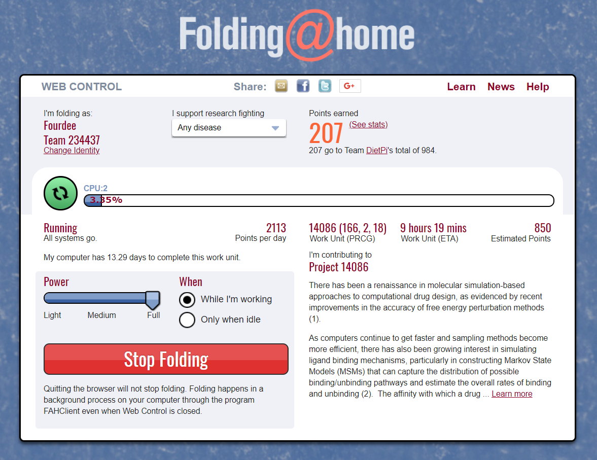
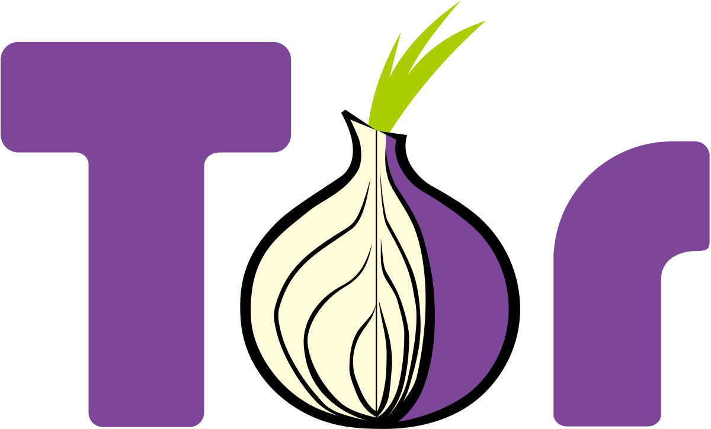
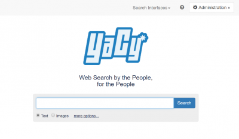
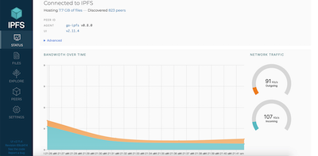

# Verteilte Projekte

## &Uuml;berblick

- [**Folding@Home - Nutzung der Rechenleistung zur Unterst&uuml;tzung der Krankheitsforschung**](#foldinghome)
- [**Tor-Relay - F&uuml;ge einen Knoten zum Tor-Netzwerk hinzu**](#tor-relay)
- [**YaCy - Dezentrale Open-Source-Suchmaschine**](#yacy)
- [**IPFS-Knoten – Beitrag zu einem dezentralisierten Internet**](#ipfs-node)

??? Information "Wie f&uuml;hre ich **DietPi-Software** aus und installiere **optimierte Software**-Elemente?"
    Um eines der unten aufgef&uuml;hrten **DietPi-optimierten Softwareelemente** zu installieren, f&uuml;hren Sie es &uuml;ber die Befehlszeile aus:

    ```sh
    dietpi-software
    ```

    W&auml;hlen Sie **Software durchsuchen** und w&auml;hlen Sie einen oder mehrere Artikel aus. W&auml;hlen Sie abschlie&szlig;end `Installieren`.
    DietPi f&uuml;hrt alle notwendigen Schritte aus, um diese Softwareelemente zu installieren und zu starten.

    {: width="643" height="365" loading="lazy"}

    Um alle DietPi-Konfigurationsoptionen anzuzeigen, lesen Sie den Abschnitt [DietPi Tools](../../dietpi_tools/).

[Zur&uuml;ck zur **Liste der optimierten Software**](../../software/)

## Folding@Home

[Folding@home](https://foldingathome.org/home/) ist ein Projekt, das sich auf die Erforschung von Krankheiten konzentriert.
Die gel&ouml;sten Probleme erfordern so viele Computerberechnungen, dass die Hilfe der Community ben&ouml;tigt wird, um die Heilmittel zu finden!

*Standardm&auml;&szlig;ig f&uuml;gt unsere Installation Sie der DietPi-Teamgruppe hinzu, Sie k&ouml;nnen dies jedoch jederzeit im Webinterface &auml;ndern.*

{: width="550" height="424" loading="lazy"}

=== "Zugriff auf die Weboberfl&auml;che"

    Das Webinterface ist &uuml;ber den Port **7396** erreichbar, z. B. k&ouml;nnte dies sein:

    - URL = `http://<Ihre.IP>:7396`

=== "Konfiguration"

Die Konfiguration befindet sich in der Datei `/mnt/dietpi_userdata/fahclient/config.xml`.
Sie k&ouml;nnen die Konfiguration mit den folgenden Schritten &auml;ndern:

1. Stoppen Sie Dienste mit `dietpi-services stop`
2. Bearbeiten Sie `/mnt/dietpi_userdata/fahclient/config.xml`
3. Speichern Sie die &Auml;nderungen und starten Sie die Dienste mit `dietpi-services start` neu

=== "Protokollierung"

    Folding@Home verf&uuml;gt &uuml;ber eine Protokollierungsfunktion, die in das Journalprotokollierungssystem ausgegeben wird. Die Protokolle k&ouml;nnen eingesehen werden &uuml;ber:

    ```sh
    journalctl -u fahclient
    ```

=== "Rechenleistung beeinflussen"

    Zus&auml;tzlich zum *Powerslider* im Webinterface kann der Benutzer die Anzahl der Jobs beeinflussen, die auf dem System laufen.
    Die unten angegebene Beispielkonfiguration hat 3 Job-Slots, ideal f&uuml;r eine 6-Kern-CPU (wobei 2 CPU-Kerne pro Job-Slot zul&auml;ssig sind):

    ```xml
    <config>
      <!-- Steckplatzsteuerung -->
      <power v='FULL'/>

      <!-- Benutzerinformationen -->
      <user v='Fourdee'/>

      <!-- Klappschlitze -->
      <slot id='0' type='CPU'/>
      <slot id='1' type='CPU'/>
      <slot id='2' type='CPU'/>
    </config>
    ```

## Tor-Relais

{: width="150" height="91" loading="lazy"}

Tragen Sie einen Knoten zum Tor-Netzwerk bei, der es Menschen erm&ouml;glicht, im Internet anonym zu sein.

=== "Relaistypen"

    Sie k&ouml;nnen viele Arten von Relais ausf&uuml;hren, die jeweils ihre eigenen technischen Anforderungen und rechtlichen Auswirkungen haben.

    Bridges sind das sicherste Relais, das von zu Hause aus betrieben werden kann, und sie sind relativ einfach, risikoarm und haben eine geringe Bandbreite, aber sie haben gro&szlig;e Auswirkungen auf die Benutzer, insbesondere in zensierten L&auml;ndern. Normalerweise werden IP-Adressen und andere Informationen von Tor-Relays ver&ouml;ffentlicht, was es Websites erleichtert, das Relay und alles andere, das diese IP-Adresse verwendet, auf die schwarze Liste zu setzen. Da eine Bridge nicht &ouml;ffentlich aufgef&uuml;hrt ist, ist es unwahrscheinlich, dass sie von Websites blockiert wird oder Missbrauchsbeschwerden erh&auml;lt.

    Guard/Middle-Relais sind die ersten bzw. zweiten Relais, mit denen sie verbunden sind. Informationen &uuml;ber sie werden aufgelistet, aber es ist unwahrscheinlich, dass sie Missbrauchsbeschwerden erhalten. Sie k&ouml;nnen jedoch von bestimmten Diensten blockiert werden, die nicht verstehen, wie Tor funktioniert, oder Tor-Benutzer absichtlich zensieren wollen. Wenn Sie eine statische IP-Adresse haben, sollten Sie stattdessen eine Bridge betreiben.

    Exit-Relays sind das letzte Relay, mit dem verbunden ist, und dasjenige, das den Datenverkehr tats&auml;chlich an sein Ziel sendet. Die Website sieht die IP-Adresse des Exit-Relays anstelle der echten IP-Adresse des Tor-Benutzers. Ausgangsrelais haben die gr&ouml;&szlig;te rechtliche Gef&auml;hrdung und Haftung aller Relais und sollten nicht von zu Hause aus betrieben werden.

    ??? Information "Ausgangsrelaisvorbereitung"
        Das Ausf&uuml;hren von Exit-Relays erfordert einige Vorbereitung.
        Bevor Sie ein Exit-Relay ausf&uuml;hren, sollten Sie einen Reverse-DNS-Eintrag (und, wenn m&ouml;glich, WHOIS) erstellen, um deutlicher zu machen, dass Ihre IP-Adresse ein Tor-Exit-Relay ist.
        Au&szlig;erdem wird empfohlen, ein Exit-Relay auf einem eigenen Server mit eigener IP-Adresse auszuf&uuml;hren.

=== "&Uuml;berwachung"

    Der einfachste Weg, das Tor-Relay zu &uuml;berwachen, ist die Verwendung der DietPi-CloudShell-Szene. F&uuml;hren Sie dazu "dietpi-cloudshell" von der Befehlszeile aus und w&auml;hlen Sie die "Tor Relay"-Szene aus. Es verwendet den Tor-Monitor [nyx] (https://nyx.torproject.org/), der im Standalone-Modus aufgerufen werden kann, indem `nyx` von der Befehlszeile ausgef&uuml;hrt wird.

    Sie k&ouml;nnen es auch mit der [Tor-Relay-Suche] (https://metrics.torproject.org/rs.html) &uuml;berwachen. F&uuml;gen Sie einfach entweder den Fingerabdruck (zu finden unter `/var/lib/tor/fingerprint`) oder den Spitznamen Ihres Relais ein.

    ??? Information "Hinweis f&uuml;r Br&uuml;ckenbetreiber"
        Die Tor-Relay-Suche funktioniert nicht immer f&uuml;r Bridges und zeigt sie manchmal als ausgefallen an, wenn sie laufen. Verwenden Sie in diesem Fall die spezifische Tor-Bridge-&Uuml;berwachungs-URL:
        `https://bridges.torproject.org/status?type=obfs4&id=<FINGERABDRUCK>`

=== "Bleiben Sie auf dem Laufenden"

    Tor-Relays auf dem neuesten Stand zu halten, ist wichtig f&uuml;r die Sicherheit sowohl der Benutzer als auch des Betreibers. Aus diesem Grund werden automatische Upgrades empfohlen und bei der Erstinstallation gefragt. Andernfalls f&uuml;hren Sie regelm&auml;&szlig;ig die folgenden Befehle aus, um Ihre Systempakete auf dem neuesten Stand zu halten:

    ```sh
    apt update
    apt upgrade
    ```

=== "Protokolle anzeigen"

    Tor-Dienstprotokolle k&ouml;nnen mit dem folgenden Befehl angezeigt werden:

    ```sh
    journalctl -t tor
    ```

***

Offizielle Dokumentation: <https://community.torproject.org/relay/setup>

##YaCy

YaCy ist eine dezentralisierte Open-Source-Suchmaschine.
Im Wesentlichen ist es eine "Peer-to-Peer"-Google-Suchmaschine, die nicht von Google kontrolliert wird.

{: width="400" height="233" loading="lazy"}

=== "Zugriff auf die Weboberfl&auml;che"

    Das Webinterface ist &uuml;ber Port **8090** erreichbar:

    - URL = `http://<Ihre.IP>:8090`

=== "Admin-Interface-Anmeldung"

    Passwort setzen mit:

    ```sh
    /etc/yacy/bin/passwd.sh mypassword
    ```

    Die Zugangsdaten lauten dann:

    - Benutzername = `admin`
    - Passwort = `meinpasswort`

=== "CPU-Auslastung reduzieren"

    YaCy ist extrem CPU-intensiv, gepaart mit st&auml;ndiger Hintergrundverarbeitung, wir empfehlen dringend die Verwendung von `dietpi-services`, um die Prozesspriorit&auml;t zu reduzieren.

    Empfohlene Einstellung: Sch&ouml;n = 19

## IPFS-Knoten

IPFS (InterPlanetary File System) ist ein Peer-to-Peer-Hypermedia-Protokoll, das entwickelt wurde, um das Web schneller, sicherer und offener zu machen.
Mit diesem Knoten k&ouml;nnen Sie Dateien &uuml;ber IPFS herunterladen und Ihre eigenen Dateien zum Netzwerk hinzuf&uuml;gen.

{: width="400" height="233" loading="lazy"}

=== "Zugriff auf die Weboberfl&auml;che und das IPFS-Gateway"

    Das Webinterface ist &uuml;ber Port **5003** erreichbar und das Gateway &uuml;ber **8087**:

    - WebUI = `http://<your.IP>:5003/webui`
    - Gateway = `http://<your.IP>:8087/ipfs/IPFSHash`

=== `Verwendung mit IPFS Companion-Browsererweiterung`

    Sie k&ouml;nnen Ihren IPFS-Knoten mit der Browsererweiterung IPFS Companion verwenden, um automatisch von IPFS gehostete Dateien &uuml;ber Ihren Knoten herunterzuladen.
    &Auml;ndern Sie auf der Einstellungsseite der Erweiterung `IPFS API URL` in `http://<your.IP>:5003` und `Local Gateway` in `http://<your.IP>:8087`.

    Firefox: https://addons.mozilla.org/en-US/firefox/addon/ipfs-companion/

    Chromium und Derivate: https://chrome.google.com/webstore/detail/ipfs-companion/nibjojkomfdiaoajekhjakgkdhaomnch

??? Information "Hinweis zur Verwendung mit Erweiterung"
    IPFS-Inhalte werden ohne SSL-Zertifikat nicht auf `https://`-Seiten geladen. Wir empfehlen ein kostenloses von LetsEncrypt mit [DietPi-LetsEncrypt](../../dietpi_tools/#dietpi-letsencrypt).

=== "Protokollierung"

Sie k&ouml;nnen die Dienstprotokolle &uuml;ber anzeigen

    ```sh
    journalctl -u ipfs
    ```

=== "Aktualisierung"

Sie k&ouml;nnen Ihren IPFS-Knoten aktualisieren, indem Sie ihn ausf&uuml;hren

    ```sh
    dietpi-software reinstall 186
    ```

    IPFS hat einen eingebauten Aktualisierungsbefehl (`ipfs update`), aber dies erfordert die `ipfs-update`-Bin&auml;rdatei, die unter https://dist.ipfs.io/#ipfs-update zu finden ist.

Offizielle Dokumentation: <https://docs.ipfs.io>

!!! Warnung `Nicht dem Internet aussetzen`
    F&uuml;r die Verwendung der IPFS-Webschnittstelle ist keine Authentifizierung erforderlich. Setzen Sie es nicht dem Internet aus, ohne geeignete Sicherheitsma&szlig;nahmen wie einen authentifizierten Reverse-Proxy, VPN oder &auml;hnliches zu ergreifen.

[Zur&uuml;ck zur **Liste der optimierten Software**](../../software/)
