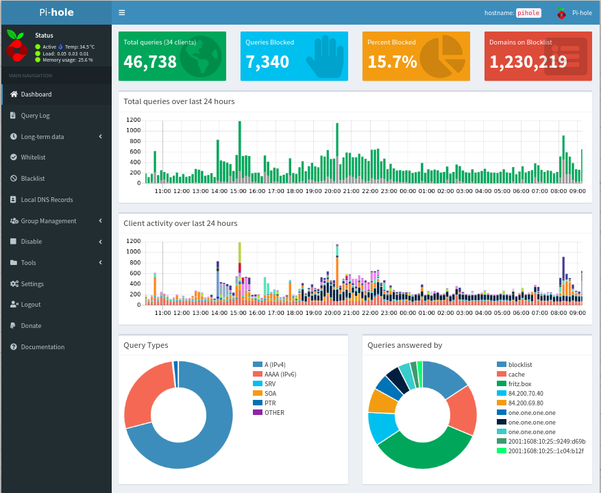
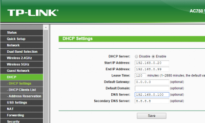
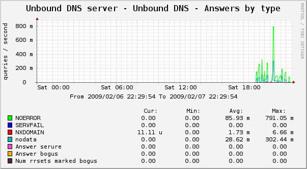
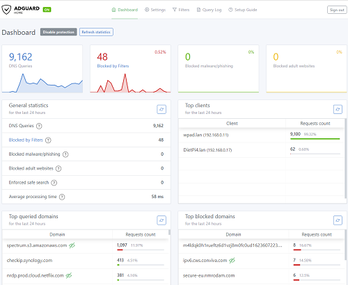
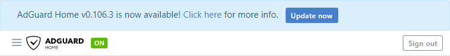

# DNS-Server

## &Uuml;berblick

- [**Pi-hole - Netzwerkweite Werbeblockierung**](#pi-hole)
- [**Unbound - Ein validierender, rekursiver und zwischenspeichernder DNS-Resolver**](#unbound)
- [**AdGuard Home - Ein leistungsstarker netzwerkweiter Anzeigen- und Tracker-Blocker-DNS-Server**](#adguard-home)

??? Information "Wie f&uuml;hre ich **DietPi-Software** aus und installiere **optimierte Software**-Elemente?"
    Um eines der unten aufgef&uuml;hrten **DietPi-optimierten Softwareelemente** zu installieren, f&uuml;hren Sie es &uuml;ber die Befehlszeile aus:

    ```sh
    dietpi-software
    ```

    W&auml;hlen Sie **Software durchsuchen** und w&auml;hlen Sie einen oder mehrere Artikel aus. W&auml;hlen Sie abschlie&szlig;end `Installieren`.
    DietPi f&uuml;hrt alle notwendigen Schritte aus, um diese Softwareelemente zu installieren und zu starten.

    {: width="643" height="365" loading="lazy"}

    Um alle DietPi-Konfigurationsoptionen anzuzeigen, lesen Sie den Abschnitt [DietPi Tools](../../dietpi_tools/).

[Zur&uuml;ck zur **Liste der optimierten Software**](../../software/)

##Pi-Loch

Pi-hole ist ein DNS-Sinkhole mit Webschnittstelle, das Anzeigen f&uuml;r jedes Ger&auml;t in Ihrem Netzwerk blockiert.

- Installiert auch: [Webserver-Stack](../webserver_stack/)

{: width="500" height="410" loading="lazy"}

!!! Warnung "Webserver-Installation"
    DietPi-Software ruft den Pi-hole-Installer mit dem Flag `--disable-install-webserver` auf, das die Lighttpd- und PHP-Installationsteile &uuml;berspringt. Stattdessen werden Lighttpd, Nginx oder Apache separat installiert, je nach Wahl des Benutzers, und PHP als eigenst&auml;ndiger PHP-FPM-Server bzw. Modul f&uuml;r Apache. Dies erm&ouml;glicht auch flexiblere Webserver-Konfigurationen, einfaches HTTPS, andere Websites/Anwendungen auf demselben Server usw. Beim **Reparieren** und **Neukonfigurieren** von Pi-Hole (siehe Registerkarte `Pi-Hole reparieren` unten), Es ist wichtig, Lighttpd NICHT zu installieren, wenn Sie dazu aufgefordert werden, da dies zu doppelten PHP- und Webserver-Installationen oder widerspr&uuml;chlichen Webserver-Einstellungen f&uuml;hren w&uuml;rde.

=== "Zugriff auf die Weboberfl&auml;che"

    Auf die Weboberfl&auml;che von Pi-hole kann zugegriffen werden &uuml;ber:

    - URL = `http://<Ihre.IP>/admin`
    - Passwort = `<yourGlobalSoftwarePassword>` (Standard: `dietpi`)

=== "Konfiguration"

    Die Konfiguration enth&auml;lt Einstellungsger&auml;te (z. B. Router), um Pi-hole f&uuml;r die DNS-Aufl&ouml;sung zu verwenden.

    <font size="+2">Option 1 - Einrichten einzelner Ger&auml;te zur Verwendung des Pi-hole-DNS-Servers</font>

    &Auml;ndern Sie einfach Ihre DNS-Einstellungen, um die IP-Adresse Ihres Pi-hole-Ger&auml;ts zu verwenden. Dies muss f&uuml;r jedes Ger&auml;t durchgef&uuml;hrt werden, mit dem Pi-hole arbeiten soll.

    Beispiel:

    - Mein Pi-hole-Ger&auml;t hat die IP-Adresse 192.168.0.100
    - Auf meinem PC w&uuml;rde ich die DNS-Adresse auf 192.168.0.100 setzen
    - Tutorial [Der ultimative Leitfaden zum &Auml;ndern Ihrer DNS-Einstellungen] (https://www.howtogeek.com/167533/the-ultimate-guide-to-changing-your-dns-server/).

    <font size="+2">Option 2 – Richten Sie Ihren Router so ein, dass er den DNS-Server von Pi-hole verwendet</font>

    Diese Methode verweist automatisch jedes Ger&auml;t (das DHCP verwendet) in Ihrem Netzwerk auf Pi-hole.
    Auf der Webseite der Systemsteuerung Ihres Routers m&uuml;ssen Sie eine Option namens "DNS-Server" finden. Dies sollte sich unter den DHCP-Einstellungen befinden.

    Geben Sie einfach unter `DNS-Server` die IP-Adresse Ihres Pi-hole-Ger&auml;ts ein:

    {: width="400" height="240" loading="lazy"}

    Auf Ihrem Pi-hole-Ger&auml;t m&uuml;ssen Sie einen anderen DNS-Server einstellen.
    Abh&auml;ngig von Ihrer Routerkonfiguration kann das Pi-hole-Ger&auml;t m&ouml;glicherweise nicht auf das Internet zugreifen, wenn Sie diesen Schritt nicht ausf&uuml;hren. Es wird dringend empfohlen, dass das Ger&auml;t Pi-hole ausf&uuml;hrt und auf einen DNS-Server au&szlig;erhalb Ihres Netzwerks verweist.

    - F&uuml;hren Sie den folgenden Befehl aus: `dietpi-config 8 1`
    - W&auml;hlen Sie: *Ethernet*
    - Wenn Sie im DHCP-Modus arbeiten, w&auml;hlen Sie *Change Mode* und dann: *Copy Current address to Static*
    - W&auml;hlen Sie *Statisches DNS* aus der Liste und dann einen DNS-Server aus oder geben Sie manuell einen benutzerdefinierten Eintrag ein.
    - Wenn Sie fertig sind, w&auml;hlen Sie *&Uuml;bernehmen*, um die &Auml;nderungen zu speichern.

=== "DietPi-Unterschiede"

    Die DietPi Pi-Hole-Implementierung verwendet das offizielle Installationsskript, weist jedoch einige Unterschiede im Vergleich zum offiziellen Standard-Setup auf:

    1. Das `/var/log/pihole.log`-Nur-Text-DNS-Abfrageprotokoll ist standardm&auml;&szlig;ig deaktiviert. Es ist eine zweite Abfrageprotokollimplementierung, da `/etc/pihole/pihole-FTL.db` bereits als datenbankweise Protokollimplementierung verwendet wird, die von der Webschnittstelle verwendet wird, um Langzeitprotokolle zu durchsuchen. Wenn Sie jedoch den Befehl `pihole -t`/`pihole tail` verwenden m&ouml;chten, um farbige Protokolle auf der Konsole auszugeben, m&uuml;ssen Sie die dateibasierte Protokollierung erneut aktivieren:

        ```sh
        pihole -l on
        ```

       Auch das DietPi [Protokollierungssystem](../../dietpi_tools/#quick-selections) muss ge&auml;ndert werden, um DietPi-RAMlog zu deaktivieren, da sonst `/var/log/pihole.log` st&uuml;ndlich geleert wird.
    2. Die Protokollierungsdauer f&uuml;r das datenbankbezogene DNS-Abfrageprotokoll in `/etc/pihole/pihole-FTL.db` wird von 365 Tagen auf 2 Tage reduziert. Eine interne Diskussion ergab, dass niemand von uns Protokolle verwendet, die &auml;lter als ein paar Stunden sind. Ein Jahr Protokolle f&uuml;hrt zu Datenbankgr&ouml;&szlig;en von Hunderten von MiB bis GiB. Wir belassen es bei 2 Tagen, damit die Dashboard-Grafiken/Diagramme der Webschnittstelle nach dem (Neu-)Start von Pi-Hole nicht leer sind. Sie k&ouml;nnen die Protokollierungsdauer einfach anpassen, indem Sie die Konfigurationsdatei `/etc/pihole/pihole-FTL.conf` bearbeiten. Um beispielsweise die standardm&auml;&szlig;igen 365-Tage-Protokolle wiederherzustellen:

        ```sh
        MAXDBDAYS=365
        ```

=== "Aktualisiere Pi-Hole"

    Pi-hole kann &uuml;ber den Shell-Befehl `pihole -up` aktualisiert werden.

=== "Pi-Loch reparieren"

    Sie k&ouml;nnen `pihole -r` verwenden, um Ihre Pi-hole-Instanz zu reparieren oder neu zu konfigurieren.

    !!! Warnung "W&auml;hlen Sie **NICHT** Lighttpd zu installieren"
        W&auml;hlen Sie **NICHT** Lighttpd zu installieren, wenn Sie dazu aufgefordert werden, da dies zu doppelten PHP- und Webserver-Installationen oder widerspr&uuml;chlichen Webserver-Einstellungen f&uuml;hren w&uuml;rde.

=== "Passwort setzen"

    Wenn Sie Ihr Login-Passwort f&uuml;r die Pi-hole-Admin-Webseite vergessen haben, k&ouml;nnen Sie es mit dem Shell-Befehl `pihole -a -p` auf Ihrem Pi-hole-Ger&auml;t festlegen.

=== "Blocklisten und Whitelists"

    Es gibt viele Websites im Internet, die Sperrlisten und Whitelists f&uuml;r Pi-Hole anbieten. Sie k&ouml;nnen verwendet werden, wenn Sie mehr Blockierung w&uuml;nschen, als die Standardinstallation Ihnen bietet. Hier sind einige Beispiele:

    - [Die gro&szlig;e Blocklist-Sammlung von `WaLLy3K`](https://firebog.net/)
    - [Blockliste der Phishing-Armee](https://phishing.army/)
    - [Whitelist-Sammlung von `anudeepND`](https://github.com/anudeepND/whitelist)

=== "Zugriff &uuml;ber OpenVPN oder WireGuard"

    Um VPN-Clients (OpenVPN oder WireGuard) den Zugriff auf Ihre lokale Pi-hole-Instanz zu erlauben, m&uuml;ssen Sie DNS-Anfragen von allen Netzwerkschnittstellen zulassen: `pihole -a -i local`.

=== "Pi-Hole &uuml;berwachen"

    [DietPi-CloudShell](../system_stats/#dietpi-cloudshell) enth&auml;lt eine Pi-hole-Szene, mit der die wichtigsten DNS-Abfragen und Blockstatistiken &uuml;berwacht werden k&ouml;nnen. F&uuml;hren Sie einfach `dietpi-cloudshell` aus, w&auml;hlen Sie `Scenes` und vergewissern Sie sich, dass `8 Pi-hole` ausgew&auml;hlt ist. Schalten Sie `Output Display` um, um auszuw&auml;hlen, ob die Ausgabe auf der aktuellen Konsole oder dem Hauptbildschirm gedruckt werden soll, und w&auml;hlen Sie dann `Start / Restart`, um die Ausgabe zu starten.

***

Offizielle Website: <https://pi-hole.net/>
Offizielle Dokumentation: <https://docs.pi-hole.net/>
Wikipedia: <https://wikipedia.org/wiki/Pi-hole>
Quellcode: <https://github.com/pi-hole>

DietPi-Blog: [Pi-Hole & Unbound: So haben Sie in wenigen Minuten ein werbefreies und sichereres Internet](https://dietpi.com/blog/?p=564)

YouTube-Video-Tutorial Nr. 1: *Raspberry Pi / Pi-hole / Diet-Pi / Netzwerkweiter Werbeblocker !!!!*.

<iframe src="https://www.youtube-nocookie.com/embed/RO2_eZlVrj4?rel=0" frameborder="0" allow="fullscreen" width="560" height="315" loading="lazy" ></iframe>

YouTube-Video-Tutorial Nr. 2: [Werbung &uuml;berall blockieren mit Pi-hole und PiVPN auf DietPi](https://www.youtube.com/watch?v=qbLEHlKkGiE){:class="nospellcheck"}
YouTube Video Tutorial #3 (deutschsprachig): [Raspberry Pi & DietPi : Pi-hole der Werbeblocker f&uuml;r Netzwerke mit Anleitung f&uuml;r AVM FritzBox](https://www.youtube.com/watch?v=vXUvFWhXW6c&list=PLQIL7cyHMGboXtOzwAcX4hGPW6ECbVinp&index=6) {:class="nospellcheck"}
YouTube-Video-Tutorial #4: [Raspberry Pi Zero W mit Pi-hole - g&uuml;nstiger Werbeblocker & Schritt f&uuml;r Schritt Anleitung unter DietPi](https://www.youtube.com/watch?v=IxWuMHu9IYk&list=PLQIL7cyHMGboXtOzwAcX4hGPW6ECbVinp&index=2 ){:class="nospellcheck"}
Blogeintrag mit YouTube-Video #5 (deutschsprachig): [Unbound Installation f&uuml;r PiHole unter DietPi](https://blog.login.gmbh/unbound-installation-fuer-pihole-unter-dietpi/){:class="nospellcheck "}

## Unbound

Unbound ist ein validierender, rekursiver, zwischenspeichernder DNS-Resolver. Es kann Hostnamen aufl&ouml;sen, indem es die Root-Nameserver direkt abfragt und ISP/&ouml;ffentliche DNS-Resolver ersetzt. Die Eliminierung eines Spielers, der an der Bearbeitung Ihrer DNS-Anfragen beteiligt ist, erh&ouml;ht Ihre Privatsph&auml;re im Internet. Zus&auml;tzlich kann Unbound so konfiguriert werden, dass es das verschl&uuml;sselte DoT-Protokoll verwendet, das wiederum einen &ouml;ffentlichen DNS-Anbieter erfordert, aber stattdessen Anfragen f&uuml;r Ihren LAN-Betreiber und ISP maskiert. Weitere Informationen finden Sie unten auf der Registerkarte `Aktivieren von DNS &uuml;ber TLS (DoT)`.

{: width="150" height="34" loading="lazy"}

{: width="500" height="274" loading="lazy"}

=== "Standard-DNS-Ports"

    - Standard-DNS-Port: **53**
    - DNS-Port, wenn Pi-hole oder AdGuard Home installiert sind: **5335**

=== "Konfigurationsverzeichnis"

    Dort befindet sich das Konfigurationsverzeichnis: `/etc/unbound`

=== "Protokolle anzeigen"

    Sehen Sie sich die Protokolldateien an:

     ```sh
     journalctl -u unbound
     ```

=== "Aktualisierung ungebunden"

    Update auf neueste Version:

    ```sh
    apt update
    apt upgrade
    ```

=== "DNS &uuml;ber TLS (DoT) aktivieren"

    DoT sendet verschl&uuml;sselte DNS-Anfragen und maskiert sie vor Ihrem LAN-Betreiber und ISP. Daf&uuml;r braucht es aber wieder einen &ouml;ffentlichen DNS-Provider, um die Root-Nameserver abzufragen, was ansonsten dank Unbound nicht n&ouml;tig ist. Root-Nameserver-Anfragen k&ouml;nnen nur unverschl&uuml;sselt sein, entweder direkt von Unbound (Standard) oder von einem &ouml;ffentlichen Anbieter (bei Verwendung von DoT). Ob DoT (oder ein anderes verschl&uuml;sseltes DNS-Wrapper-Protokoll) vorzuziehen ist oder nicht, h&auml;ngt von Ihrem Einzelfall und Ihren Bed&uuml;rfnissen ab, dh ob Sie Ihrem LAN-Betreiber und ISP mehr vertrauen oder einem &ouml;ffentlichen DNS-Anbieter. Sie k&ouml;nnen DoT aktivieren, indem Sie den folgenden Befehlsblock kopieren und ausf&uuml;hren:

    ```sh
    cat << '_EOF_' > /etc/unbound/unbound.conf.d/dietpi-dot.conf
    # Adding DNS-over-TLS support
    server:
    tls-cert-bundle: /etc/ssl/certs/ca-certificates.crt
    forward-zone:
    name: "."
    forward-tls-upstream: yes
    ## Cloudflare
    forward-addr: 1.1.1.1@853#cloudflare-dns.com
    forward-addr: 1.0.0.1@853#cloudflare-dns.com
    ## Quad9
    forward-addr: 9.9.9.9@853#dns.quad9.net
    forward-addr: 149.112.112.112@853#dns.quad9.net
    _EOF_
    ```

??? Hinweis "Die verwendeten DNS-Server sind nur Beispiele und k&ouml;nnen durch Ihren Favoriten ersetzt werden."
    Eine Liste &ouml;ffentlicher DNS-Anbieter, ihrer IP-Adressen und ihrer gegebenenfalls enthaltenen Funktionen zum Blockieren von Anzeigen / Inhalten f&uuml;r Erwachsene ist auf Wikipedia verf&uuml;gbar:

- <https://wikipedia.org/wiki/Public_recursive_name_server>

    Damit die &Auml;nderung wirksam wird, muss der Unbound-Dienst neu gestartet werden:

    ```sh
    systemctl restart unbound
    ```

***

Offizielle Website: <https://www.nlnetlabs.nl/projects/unbound/about/>
Offizielle Dokumentation: <https://nlnetlabs.nl/documentation/unbound/unbound>
Neue WIP-Dokumentation: <https://unbound.readthedocs.io/>
Wikipedia: <https://wikipedia.org/wiki/Unbound_(DNS_server)>
Quellcode: <https://github.com/NLnetLabs/unbound>

DietPi-Blog: [Pi-Hole & Unbound: So haben Sie in wenigen Minuten ein werbefreies und sichereres Internet](https://dietpi.com/blog/?p=564)

Blogeintrag mit YouTube-Video: [Unbound Installation f&uuml;r PiHole unter DietPi](https://blog.login.gmbh/unbound-installation-fuer-pihole-unter-dietpi/){:class="nospellcheck"}

## AdGuard-Startseite

AdGuard Home ist ein DNS-Sinkhole mit Webschnittstelle, das Anzeigen f&uuml;r jedes Ger&auml;t in Ihrem Netzwerk blockiert.

{: width="500" height="410" loading="lazy"}

=== "Zugriff auf die Weboberfl&auml;che"

    Das Webinterface ist &uuml;ber Port **8083** erreichbar:

    - URL = `http://<Ihre.IP>:8083`
    - Benutzer = `admin`.
    - Passwort = `<yourGlobalSoftwarePassword>` (Standard: `dietpi`)

=== "Konfiguration"

    Die Konfiguration enth&auml;lt Ger&auml;te (z. B. Router), die AdGuard Home f&uuml;r die DNS-Aufl&ouml;sung verwenden.

    <font size="+2">Option 1 – Einrichten einzelner Ger&auml;te zur Verwendung des AdGuard Home-DNS-Servers</font>

    &Auml;ndern Sie einfach Ihre DNS-Einstellungen, um die IP-Adresse Ihres AdGuard Home-Ger&auml;ts zu verwenden. Dies muss f&uuml;r jedes Ger&auml;t durchgef&uuml;hrt werden, mit dem AdGuard Home funktionieren soll.

    Beispiel:

    - Mein AdGuard Home-Ger&auml;t hat die IP-Adresse 192.168.0.100
    - Auf meinem PC w&uuml;rde ich die DNS-Adresse auf 192.168.0.100 setzen
    - Tutorial [Der ultimative Leitfaden zum &Auml;ndern Ihrer DNS-Einstellungen] (https://www.howtogeek.com/167533/the-ultimate-guide-to-changing-your-dns-server/).

    <font size="+2">Option 2 – Richten Sie Ihren Router so ein, dass er den AdGuard Home-DNS-Server verwendet</font>

    Diese Methode verweist automatisch jedes Ger&auml;t (das DHCP verwendet) in Ihrem Netzwerk auf AdGuard Home.
    Auf der Webseite der Systemsteuerung Ihres Routers m&uuml;ssen Sie eine Option namens "DNS-Server" finden. Dies sollte sich unter den DHCP-Einstellungen befinden.

    Geben Sie einfach unter "DNS-Server" die IP-Adresse Ihres AdGuard Home-Ger&auml;ts ein:

    {: width="400" height="240" loading="lazy"}

    Auf Ihrem AdGuard Home-Ger&auml;t m&uuml;ssen Sie einen anderen DNS-Server einstellen.
    Abh&auml;ngig von Ihrer Routerkonfiguration kann das AdGuard Home-Ger&auml;t m&ouml;glicherweise nicht auf das Internet zugreifen, wenn Sie diesen Schritt nicht ausf&uuml;hren. Es wird dringend empfohlen, auf dem Ger&auml;t AdGuard Home auszuf&uuml;hren, das auf einen DNS-Server au&szlig;erhalb Ihres Netzwerks verweist.

    - F&uuml;hren Sie den folgenden Befehl aus: `dietpi-config 8 1`
    - W&auml;hlen Sie: *Ethernet*
    - Wenn Sie im DHCP-Modus arbeiten, w&auml;hlen Sie *Change Mode* und dann: *Copy Current address to Static*
    - W&auml;hlen Sie *Statisches DNS* aus der Liste und dann einen DNS-Server aus oder geben Sie manuell einen benutzerdefinierten Eintrag ein.
    - Wenn Sie fertig sind, w&auml;hlen Sie *&Uuml;bernehmen*, um die &Auml;nderungen zu speichern.

=== "Aktualisierung von AdGuard Home"

    Bitte verwenden Sie den internen Updater der Weboberfl&auml;che, um Ihr AdGuard Home zu aktualisieren. Sobald ein Update verf&uuml;gbar ist, wird oben auf der Seite eine Benachrichtigung angezeigt.

    {: width="753" height="95" loading="lazy"}

=== "Passwort setzen"

    Wenn Sie Ihr Anmeldekennwort f&uuml;r die AdGuard Home-Administrationswebseite vergessen haben, k&ouml;nnen Sie es mit dem folgenden Shell-Befehl auf Ihrem AdGuard Home-Ger&auml;t festlegen.

    ```sh
    G_CONFIG_INJECT 'password:[[:blank:]]' "  password: $(htpasswd -bnBC 10 '' "<your_new_password>" | tr -d ':\n' | sed 's/\$2y/\$2a/')" /mnt/dietpi_userdata/adguardhome/AdGuardHome.yaml
    systemctl restart adguardhome
    ```

=== "Blocklisten und Whitelists"

    Es gibt viele Websites im Internet, die Blocklisten und Whitelists f&uuml;r AdGuard Home bereitstellen. Sie k&ouml;nnen verwendet werden, wenn Sie mehr Blockierung w&uuml;nschen, als die Standardinstallation Ihnen bietet. Hier sind einige Beispiele:

    - [Die gro&szlig;e Blocklist-Sammlung von `WaLLy3K`](https://firebog.net/)
    - [Blockliste der Phishing-Armee](https://phishing.army/)
    - [Whitelist-Sammlung von `anudeepND`](https://github.com/anudeepND/whitelist)

***

Offizielle Website: <https://adguard.com/en/adguard-home/overview.html>
Offizielle Dokumentation: <https://github.com/AdguardTeam/AdGuardHome/wiki>
Wikipedia: <https://en.wikipedia.org/wiki/AdGuard#AdGuard_Home>
Quellcode: <https://github.com/AdguardTeam/AdGuardHome>
Lizenz: [GPLv3](https://github.com/AdguardTeam/AdGuardHome/blob/master/LICENSE.txt)

[Zur&uuml;ck zur **Liste der optimierten Software**](../../software/)
