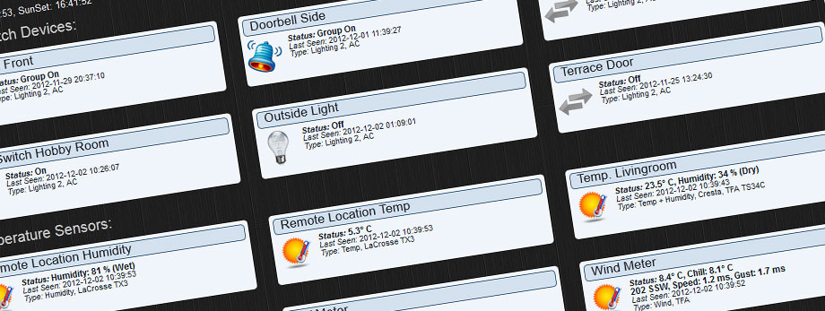

# Heimautomatisierung

## &Uuml;berblick

- [**Home Assistant - Open-Source-Hausautomatisierungsplattform, die auf Python 3 l&auml;uft**](#home-assistant)
- [**Domoticz - Multi-Plattform-Hausautomationssystem**](#domoticz)
- [**TasmoAdmin - Verwaltungswebsite f&uuml;r Tasmota-Ger&auml;te**](#tasmoadmin)

??? Information "Wie f&uuml;hre ich **DietPi-Software** aus und installiere **optimierte Software**-Elemente?"
    Um eines der unten aufgef&uuml;hrten **DietPi-optimierten Softwareelemente** zu installieren, f&uuml;hren Sie es &uuml;ber die Befehlszeile aus:

    ```sh
    dietpi-software
    ```

    W&auml;hlen Sie **Software durchsuchen** und w&auml;hlen Sie einen oder mehrere Artikel aus. W&auml;hlen Sie abschlie&szlig;end `Installieren`.
    DietPi f&uuml;hrt alle notwendigen Schritte aus, um diese Softwareelemente zu installieren und zu starten.

    {: width="643" height="365" loading="lazy"}

    Um alle DietPi-Konfigurationsoptionen anzuzeigen, lesen Sie den Abschnitt [DietPi Tools](../../dietpi_tools/).

[Zur&uuml;ck zur **Liste der optimierten Software**](../../software/)

## Home-Assistent

Home Assistant ist eine Open-Source-Hausautomatisierungsplattform, die auf Python 3 l&auml;uft. Verfolgen und steuern Sie alle Ger&auml;te zu Hause und automatisieren Sie die Steuerung. Perfekt f&uuml;r den Betrieb auf einem Raspberry Pi.

{: width="500" height="184" loading="lazy"}

=== "Erstinstallation und Zugriff"

    Der Installationsvorgang auf langsameren SBC-Modellen kann sehr lange dauern, bis zu 2 Stunden, also trinken Sie einen Kaffee, suchen Sie nach einer anderen Aktivit&auml;t und schauen Sie ab und zu wieder vorbei. Es wird sehr lange Installing Python-3.xx.. angezeigt.
    Wenn Sie Verarbeitungsdetails sehen m&ouml;chten, f&uuml;hren Sie `htop` auf einem dedizierten Terminal oder einer SSH-Sitzung aus, um den Python-Build-Prozess live zu sehen.

    Nachdem `dietpi-software` fertig ist und der Dienst das erste Mal startet, f&uuml;hren Sie bitte die folgenden Schritte manuell durch:

    - F&uuml;hren Sie `htop` aus und warten Sie, bis die CPU-Auslastung der `homeassistant`-Prozesse auf nahezu Null gesunken ist.
    - F&uuml;hren Sie `systemctl restart home-assistant` aus
    - F&uuml;hren Sie `htop` aus und warten Sie, bis die CPU-Auslastung der `homeassistant`-Prozesse auf nahezu Null gesunken ist.
    - &Ouml;ffnen Sie die HA-Weboberfl&auml;che (siehe Registerkarte `Zugriff auf die Weboberfl&auml;che`). Beim ersten Zugriff werden wieder einige Python-Module installiert, was wiederum eine Weile dauern kann. &Uuml;berpr&uuml;fen Sie immer `htop`, wenn Sie sich nicht sicher sind, was einen aktuell laufenden Python/pip-Modul-Installationsprozess anzeigt.

=== "Zugriff auf die Weboberfl&auml;che"

    Das Webinterface ist &uuml;ber Port **8123** erreichbar:

    URL = `http://<Ihre.IP>:8123`

=== "Konfigurationsdateien"

    Die Konfigurationsdateien werden systemweit gespeichert in:
    `/mnt/dietpi_userdata/homeassistant`

    Bitte beachten Sie die Online-Dokumentation: <https://home-assistant.io/docs/>

=== "Python-Umgebung anpassen"

    Home Assistant wird in einer dedizierten Python-Umgebung installiert, betrieben von: <https://github.com/pyenv/pyenv>.
    Dadurch wird eine eigenst&auml;ndige Python-Instanz platziert, die v&ouml;llig unabh&auml;ngig von anderen installierten Python-Instanzen oder -Modulen ausgef&uuml;hrt wird. Wenn Sie zus&auml;tzliche Python-Module in dieser pyenv-Umgebung installieren, Python selbst aktualisieren oder &auml;hnliches m&uuml;ssen, m&uuml;ssen Sie eine Shell als Benutzer `homeassistant` &ouml;ffnen und die pyenv-Umgebung aktivieren:

    ```sh
    sudo -u homeassistant bash
    . /home/homeassistant/pyenv-activate.sh
    pip3 install <module> # Or whichever install/update you need to do
    ```

=== "Home Assistant auf aktuelle Version aktualisieren"

    Um Home Assistant schnell auf die aktuelle Version zu aktualisieren, f&uuml;hren Sie Folgendes aus:

    ```sh
    /home/homeassistant/homeassistant-update.sh
    ```

=== "Bekannte zus&auml;tzliche Abh&auml;ngigkeiten f&uuml;r die Ger&auml;teintegration"

    IKEA TRÅDFRI: `apt install autoconf`

***

Offizielle Dokumentation: <https://home-assistant.io/docs>

## Domoticz

Domoticz ist ein Hausautomationssystem, mit dem Sie verschiedene Ger&auml;te wie Lampen, Schalter, verschiedene Sensoren/Messger&auml;te f&uuml;r Temperatur, Regen, Wind, UV-Strahlung, elektrische Felder, Gas, Wasser und vieles mehr &uuml;berwachen und konfigurieren k&ouml;nnen. Benachrichtigungen/Warnungen k&ouml;nnen an jedes mobile Ger&auml;t gesendet werden.

{: width="600" height="226" loading="lazy"}

=== "Zugriff auf die Weboberfl&auml;che"

    Das Webinterface ist &uuml;ber Port **8124** bzw. **8424**:

    - HTTP: `http://<Ihre.IP>:8124`
    - HTTPS: `https://<your.IP>:8424`

=== "Protokolle anzeigen"

    ```sh
    journalctl -u domoticz
    ```

=== "Serviceabwicklung"

    Verwenden Sie die folgenden Befehle, um den Domoticz-Systemdienst zu steuern:

    ```sh
    systemctl status domoticz
    ```

    ```sh
    systemctl stop domoticz
    ```

    ```sh
    systemctl start domoticz
    ```

    ```sh
    systemctl restart domoticz
    ```

=== "Installationsverzeichnis"

    `/opt/domoticz`

=== "Datenverzeichnis"

    `/mnt/dietpi_userdata/domoticz`

***

Quellcode: <https://github.com/domoticz/domoticz>

## TasmoAdmin

TasmoAdmin ist eine Verwaltungswebsite f&uuml;r mit Tasmota geflashte Ger&auml;te, die f&uuml;r Smart-Home-Systeme verwendet werden sollen.

Installiert auch:

- Webserver (nach Ihren Vorlieben)
- PHP

{: width="302" height="184" loading="lazy"}

=== "Zugriff auf die Weboberfl&auml;che"

`http://<Ihre.IP>/tasmoadmin`

***

Quellcode: <https://github.com/reloxx13/TasmoAdmin>
Credits: Implementiert von @svh1985

[Zur&uuml;ck zur **Liste der optimierten Software**](../../software/)
