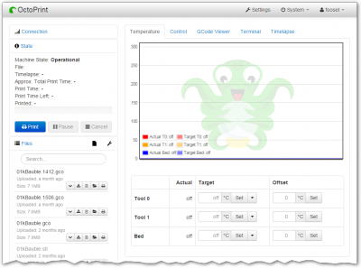
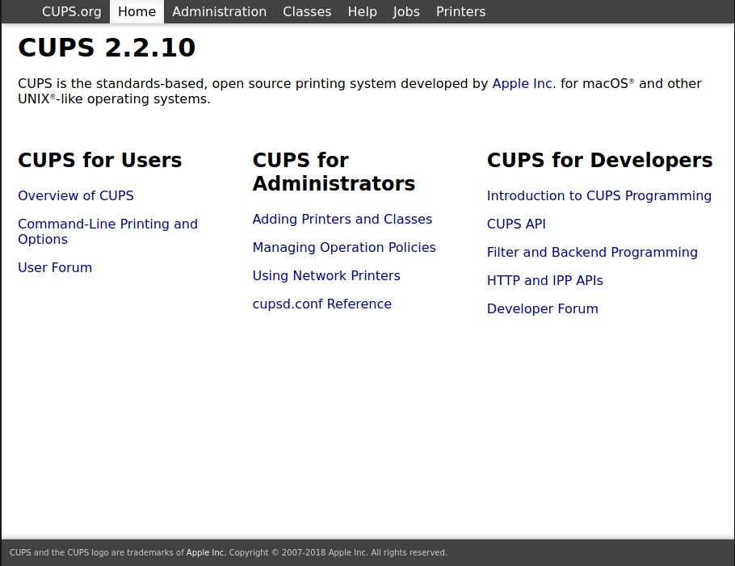

# Drucken

## &Uuml;berblick

- [**OctoPrint - Webinterface zur Steuerung von 3D-Druckern**](#octoprint)
- [**CUPS - Allgemeines UNIX-Drucksystem**](#cups)

??? Information "Wie f&uuml;hre ich **DietPi-Software** aus und installiere **optimierte Software**-Elemente?"
    Um eines der unten aufgef&uuml;hrten **DietPi-optimierten Softwareelemente** zu installieren, f&uuml;hren Sie es &uuml;ber die Befehlszeile aus:

    ```sh
    dietpi-software
    ```

    W&auml;hlen Sie **Software durchsuchen** und w&auml;hlen Sie einen oder mehrere Artikel aus. W&auml;hlen Sie abschlie&szlig;end `Installieren`.
    DietPi f&uuml;hrt alle notwendigen Schritte aus, um diese Softwareelemente zu installieren und zu starten.

    {: width="643" height="365" loading="lazy"}

    Um alle DietPi-Konfigurationsoptionen anzuzeigen, lesen Sie den Abschnitt [DietPi Tools](../../dietpi_tools/).

[Zur&uuml;ck zur **Liste der optimierten Software**](../../software/)

## OctoPrint

OctoPrint bietet eine Webschnittstelle zur Steuerung von Consumer-3D-Druckern.

{: width="400" height="297" loading="lazy"}

=== "Zugriff auf die Weboberfl&auml;che"

    Das Webinterface ist &uuml;ber Port **5001** erreichbar:

    - URL = `http://<Ihre.IP>:5001`

=== "Erste Ausf&uuml;hrung einrichten"

    Sobald Sie mit der Webschnittstelle verbunden sind, f&uuml;hren Sie einfach den Einrichtungsassistenten aus und konfigurieren die Software und Drucker nach Bedarf. Ein Login-Benutzer und ein Passwort m&uuml;ssen erstellt werden, aber es muss nicht mit einem bestehenden UNIX-Login-Benutzer &uuml;bereinstimmen, dh es kann frei gew&auml;hlt werden.

=== "OctoPrint-Verzeichnisse"

    - Basisverzeichnis: `/mnt/dietpi_userdata/octoprint`
    - Daten und Konfiguration: `/mnt/dietpi_userdata/octoprint/.octoprint`
    - Hauptkonfigurationsdatei: `/mnt/dietpi_userdata/octoprint/.octoprint/config.yaml`
    - Bin&auml;rdateien und Plugins: `/mnt/dietpi_userdata/octoprint/.local`

=== "Protokolle anzeigen"

    - Dienst- und Kernprotokolle: `journalctl -u octoprint`
    - Protokolldateien und Plugin-Protokolle: `/mnt/dietpi_userdata/octoprint/.octoprint/logs/`
    - Protokollierung &uuml;ber Webinterface konfigurieren > **Einstellungen** > **Protokollierung**

=== "Befehlszeilenschnittstelle (CLI)"

    OctoPrint bietet eine Befehlszeilenschnittstelle zum Ausf&uuml;hren von OctoPrint-Befehlen. Um es zu verwenden, f&uuml;hren Sie einfach `octoprint --help` von der Befehlszeile aus.

    Die aktuelle Shell muss `bash` sein und der Benutzer muss `sudo` verwenden d&uuml;rfen, da der obige Befehl ein Alias ist, um eine lokale OctoPrint-Bin&auml;rdatei als Systembenutzer `octoprint` aufzurufen. Der Alias ist in `/etc/bashrc.d/dietpi-octoprint.sh` definiert, das automatisch von Bash-Shells geladen wird. Sie k&ouml;nnen es aber bei Bedarf auch aus Nicht-Bash-Shells laden.

***

Website: <https://octoprint.org>
Offizielle Dokumentation: <https://docs.octoprint.org>
Forum: <https://community.octoprint.org>
Quellcode: <https://github.com/OctoPrint/OctoPrint>
Lizenz: [AGPLv3](https://github.com/OctoPrint/OctoPrint/blob/master/LICENSE.txt)

## CUPS

Das Common UNIX Printing System (CUPS) bietet eine Befehlszeilenschnittstelle (CLI) und eine Webschnittstelle zum Verwalten Ihrer lokalen und Netzwerkdrucker.

{: width="500" height="385" loading="lazy"}

=== "Zugriff auf die Weboberfl&auml;che"

    Das Webinterface ist &uuml;ber Port **631** erreichbar:

    - URL = `http(s)://<Ihre.IP>:631`
    - Benutzername = `root`
    - Passwort = `<Ihr Root-Passwort>`

    Sehen Sie sich die offiziellen Dokumente f&uuml;r Schnellstartanweisungen an: <https://www.cups.org/doc/overview.html>

***

Website: <https://www.cups.org>
Offizielle Dokumentation: <https://www.cups.org/documentation.html>
GitHub: <https://github.com/apple/cups>

[Zur&uuml;ck zur **Liste der optimierten Software**](../../software/)
