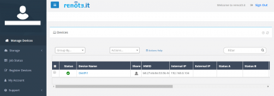

# Remotedesktopzugriff

F&uuml;hren Sie eine **Desktop-Umgebung** auf Ihrem Ger&auml;t aus und greifen Sie remote &uuml;ber das Netzwerk darauf zu. Es ist eine gro&szlig;artige Option f&uuml;r Headless-SBC-Ger&auml;te.

## &Uuml;berblick

### Remotedesktop

- [**TigerVNC Server - Desktop f&uuml;r Remoteverbindung**](#tigervnc-server)
- [**RealVNC Server - Desktop f&uuml;r Remote-Verbindung**](#realvnc-server)
- [**XRDP - Remotedesktopserver f&uuml;r Windows-Remotedesktopclient**](#xrdp)
- [**NoMachine - Remote-Desktop-Verbindung mit vielen Funktionen**](#nomachine)

### Fernzugriff

- [**Remot3.it - (Weaved) Greifen Sie &uuml;ber das Internet auf Ihr Ger&auml;t zu**](#remot3it)
- [**VirtualHere - Teilen Sie physisch angeschlossene USB-Ger&auml;te von Ihrem SBC &uuml;ber das Netzwerk**](#virtualhere)

??? Information "Wie f&uuml;hre ich **DietPi-Software** aus und installiere **optimierte Software**-Elemente?"
    Um eines der unten aufgef&uuml;hrten **DietPi-optimierten Softwareelemente** zu installieren, f&uuml;hren Sie es &uuml;ber die Befehlszeile aus:

    ```sh
    dietpi-software
    ```

    W&auml;hlen Sie **Software durchsuchen** und w&auml;hlen Sie einen oder mehrere Artikel aus. W&auml;hlen Sie abschlie&szlig;end `Installieren`.
    DietPi f&uuml;hrt alle notwendigen Schritte aus, um diese Softwareelemente zu installieren und zu starten.

    {: width="643" height="365" loading="lazy"}

    Um alle DietPi-Konfigurationsoptionen anzuzeigen, lesen Sie den Abschnitt [DietPi Tools](../../dietpi_tools/).

!!! info Desktop-Umgebung

    W&auml;hlen Sie aus der Liste **Browse Software** zusammen mit einer beliebigen Remote Desktop Software auch eine der [_Graphical Desktop Environment_](../desktop/) aus. DietPi installiert beide, sodass Sie Ihre Tastatur und Maus verwenden k&ouml;nnen, um mit einer grafischen Desktop-Umgebung auf Ihrem Ger&auml;t zu interagieren.

[Zur&uuml;ck zur **Liste der optimierten Software**](../../software/)

## TigerVNC-Server

{: width="600" height="482" loading="lazy"}

=== "Schnellstart"

    Sie k&ouml;nnen den VNC-Dienst &uuml;berwachen mit:

    ```sh
    systemctl status vncserver
    ```

    Obwohl jeder VNC-Viewer funktionieren kann, kann der neueste offizielle TigerVNC-Viewer hier heruntergeladen werden: <https://sourceforge.net/projects/tigervnc/files/stable/>

    #### Verbindungsdetails

    - Verwenden Sie die IP-Adresse Ihres DietPi-Ger&auml;ts, zB: `192.168.0.100`.
      Wenn Sie keine Verbindung herstellen k&ouml;nnen, versuchen Sie, eine Verbindung zu Bildschirm `1` herzustellen, z. B.: `192.168.0.100:1`.
    - Verwenden Sie das Passwort, das Sie w&auml;hrend der Installation eingegeben haben. Wenn Sie das Passwort &auml;ndern m&ouml;chten, f&uuml;hren Sie es von der Konsole/dem Terminal aus, f&uuml;hren Sie `vncpasswd` aus.
    - Der Standardport ist **5901**.
      **Hinweis:** Um den Zugriff von au&szlig;erhalb Ihres lokalen Netzwerks zu erm&ouml;glichen, muss dieser Port von Ihrem Router weitergeleitet werden.

=== "Konfigurationsoptionen"

    #### Freigegebener Desktop

    Der Modus *Shared Desktop* wird verwendet, um mehr als einen einzelnen VNC-Viewer mit derselben Desktop-Sitzung zu verbinden. Um diesen Modus zu aktivieren, bearbeiten Sie `/boot/dietpi.txt`, zB &uuml;ber `nano /boot/dietpi.txt`.
    &Auml;ndern Sie die folgende Zeile auf den Wert "1":

    ```sh
    SOFTWARE_VNCSERVER_SHARE_DESKTOP=1
    ```

    F&uuml;r diesen Modus ist ein laufender Desktop erforderlich, aktivieren Sie daher den Desktop-Autostart &uuml;ber `dietpi-autostart 2` oder stellen Sie sicher, dass eine lokale Desktop-Sitzung aktiv ist, bevor Sie TigerVNC manuell starten.

    #### Aufl&ouml;sungseinstellungen

    Im Folgenden sehen Sie ein Beispiel, wie Sie den VNC-Server auf dem Bildschirm **:1** ausf&uuml;hren, indem Sie einen neuen Desktop mit einer Aufl&ouml;sung von 1280 x 720 erstellen, indem Sie `/boot/dietpi.txt` bearbeiten:

    ```sh
    nano /boot/dietpi.txt
    ```

und &auml;ndern Sie die folgenden Einstellungen:

    ```sh
    SOFTWARE_VNCSERVER_WIDTH=1280
    SOFTWARE_VNCSERVER_HEIGHT=720
    SOFTWARE_VNCSERVER_DEPTH=32
    SOFTWARE_VNCSERVER_DISPLAY_INDEX=1
    ```

    Starten Sie zuletzt den Dienst neu, um die neuen Einstellungen zu aktivieren:

    ```sh
    systemctl restart vncserver
    ```

=== "Autostart"

    TigerVNC ist standardm&auml;&szlig;ig aktiviert, um beim Booten automatisch zu starten. F&uuml;hren Sie `systemctl disable vncserver` aus, um dieses Verhalten zu deaktivieren, und `systemctl start vncserver`, um es manuell von der Konsole aus zu starten.

    Um den Autostart von TigerVNC wieder zu aktivieren, f&uuml;hren Sie `systemctl enable vncserver` aus, um ihn manuell zu stoppen, kann `systemctl stop vncserver` verwendet werden.

***

Siehe auch <https://tigervnc.org>
Manpage: <https://tigervnc.org/doc/Xvnc.html>
Quellcode: <https://github.com/TigerVNC/tigervnc>

## RealVNC-Server

RealVNC besteht aus dem *VNC-Server* und der Anwendung *VNC Viewer*, um den Desktop freizugeben oder den Computer zu steuern, auf dem der VNC-Server l&auml;uft.

{: width="600" height="450" loading="lazy"}

=== "VNC-Server-Modi"

    #### Grundlagen

    Standardm&auml;&szlig;ig startet DietPi eine virtuelle VNC-Sitzung beim Booten auf Bildschirm **:1** f&uuml;r Benutzer **root**.
    Der Bildschirmindex kann &uuml;ber `SOFTWARE_VNCSERVER_DISPLAY_INDEX` in `/boot/dietpi.txt` ge&auml;ndert werden.
    Protokolle k&ouml;nnen &uuml;ber `journalctl -t Xvnc:1 -t vncserver` und in `/root/.vnc/` eingesehen werden.
    Wenn Sie sich abmelden (anstatt nur das VNC Viewer-Fenster zu schlie&szlig;en), wird die Sitzung beendet. Starten Sie es &uuml;ber `systemctl restart vncserver` neu.

    #### Freigegebener Desktop

    Wenn Sie `SOFTWARE_VNCSERVER_SHARE_DESKTOP=1` in `/boot/dietpi.txt` setzen oder die automatische Desktop-Anmeldung &uuml;ber `dietpi-autostart` (Index 2) ausw&auml;hlen, wird der RealVNC-Server beim Booten im Shared-Desktop-Modus gestartet und an den zuerst gefundenen angeh&auml;ngt lokale Desktop-Sitzung.
    &Uuml;berpr&uuml;fen Sie den Dienststatus &uuml;ber `systemctl status vncserver-x11-serviced`.
    &Uuml;berpr&uuml;fen Sie alle Protokolle &uuml;ber `journalctl -u vncserver-x11-serviced`.

    #### RealVNC-Unternehmensabonnement

    Wenn Sie ein Unternehmensabonnement f&uuml;r RealVNC haben, k&ouml;nnen Sie virtuelle VNC-Sitzungen automatisch bei Bedarf pro Clientverbindung starten und schlie&szlig;en, sobald der Client die Verbindung trennt. Auf diese Weise muss keine ressourcenintensive X11/Desktop-Sitzung dauerhaft auf dem Server aktiv sein, um VNC-Verbindungen zu erm&ouml;glichen.
    Um dies zu aktivieren, gehen Sie nach dem Hinzuf&uuml;gen Ihrer Enterprise-Abonnement-Anmeldeinformationen wie folgt vor:

    - `systemctl disable --now vncserver` deaktiviert die dauerhafte virtuelle VNC-Sitzung auf dem Bildschirm **:1**.
    - `systemctl enable --now vncserver-virtuald` aktiviert den On-Demand-VNC-Sitzungs-Daemon.

=== "VNC Viewer einrichten"

    W&auml;hlen Sie einfach einen VNC-Viewer f&uuml;r Ihr System aus und laden Sie ihn herunter: <https://www.realvnc.com/connect/download/viewer/>

    #### Verbindungsdetails

    - Um sich mit der permanenten VNC-Sitzung auf Bildschirm :1 zu verbinden, f&uuml;gen Sie den Bildschirmindex zu Ihrer lokalen IP oder Ihrem Hostnamen hinzu, z. B. `192.168.0.100:1`.
    - Um eine Verbindung zu einer freigegebenen Desktopsitzung herzustellen, &uuml;berspringen Sie den Bildschirmindex, z. B. `192.168.0.100`.
    - Benutzername = `root`
    - Passwort = `<root-Passwort>` (Standard: `dietpi`)

=== "Direkt gerenderte Apps ausf&uuml;hren"

    Dies kann zB der Fall sein, wenn Sie Minecraft remote ausf&uuml;hren m&ouml;chten.

    - Shared-Desktop-Modus aktivieren:
        - F&uuml;hren Sie `dietpi-autostart 2` aus, um automatisch in eine Desktop-Sitzung zu starten und RealVNC automatisch daran anzuh&auml;ngen.
        - Starten Sie dann das System neu, damit die &Auml;nderungen wirksam werden.
    - Befolgen Sie die Anweisungen im Abschnitt *Direkt gerenderte Apps wie Minecraft remote ausf&uuml;hren* in <https://help.realvnc.com/hc/en-us/articles/360002249917-VNC-Connect-and-Raspberry-Pi>.

## XRDP

XRDP ist eine Remote-Desktop-Anwendung, die den *Windows Remote Desktop Client* verwendet.

{: width="648" height="507" loading="lazy"}

=== "Mit Ihrem Desktop verbinden"

    Um eine Verbindung zum Desktop herzustellen, &ouml;ffnen Sie die Remote-Desktop-Anwendung in Windows (oder einem anderen XRDP-kompatiblen Client).
    Geben Sie die IP-Adresse Ihres DietPi-Ger&auml;ts ein, zB `192.168.0.100`.
    Klicken Sie auf Verbinden und geben Sie die folgenden Details ein, sobald die Verbindung hergestellt ist:

    - Modul = `Xorg`
    - Benutzername = `root`
    - Passwort = `dietpi`

=== "Zugriff von au&szlig;erhalb Ihres lokalen Netzwerks"

    XRDP verwendet standardm&auml;&szlig;ig Port **3389**, daher m&uuml;ssen Sie ihn von Ihrem Router zu DietPi &ouml;ffnen/weiterleiten.

## NoMachine

    NoMachine ist ein Remote-Desktop-Server mit erweiterten Funktionen wie Bildschirmaufzeichnung. Der Client scannt auch nach allen verf&uuml;gbaren NoMachine-Servern in Ihrem Netzwerk, was eine einfache Verbindung und Wartung Ihrer Remote-Desktops erm&ouml;glicht.

{: width="600" height="299" loading="lazy"}

=== "NoMachine-Client herunterladen"

    Laden Sie die *NoMachine*-Client-Software herunter von:

    - URL = <https://www.nomachine.com>

=== "Mit DietPi verbinden"

    Sobald der NoMachine-Client installiert ist und auf Ihrem System l&auml;uft, sollten Sie ein Ger&auml;t namens *DietPi* sehen. F&uuml;hren Sie die folgenden Schritte aus:

    1. Doppelklicken Sie darauf.
    2. W&auml;hlen Sie `Ja` f&uuml;r *Remote-Host-Identifikation hat sich ge&auml;ndert*.
    3. W&auml;hlen Sie `Ja` f&uuml;r *Hostauthentizit&auml;t pr&uuml;fen*.
    4. Geben Sie den Benutzernamen `root` und das Passwort `dietpi` ein.
    5. W&auml;hlen Sie `Ja` f&uuml;r *M&ouml;chten Sie, dass NoMachine eine neue Anzeige erstellt*.

    Sie werden nun mit Ihrem Ger&auml;t verbunden.

##Remot3.it

Remot3.it erm&ouml;glicht Ihnen den einfachen Zugriff auf Ihr DietPi-Ger&auml;t &uuml;ber das Internet.

{: width="400" height="140" loading="lazy"}

Remot3.it verbindet Sie mit einem bestimmten TCP-Port auf Ihrem Ger&auml;t, die alle w&auml;hrend der Ersteinrichtung angepasst werden k&ouml;nnen.

Beispiele f&uuml;r TCP-Ports f&uuml;r Remot3.it:

- SSH-Port **22**. &Ouml;ffnen Sie ein Remote-Terminal f&uuml;r Ihr Ger&auml;t.
- &Uuml;bertragungsport **9091**. &Uuml;berwachen Sie Ihre BitTorrent-Downloads.
- Webserver-Port **80**. Greifen Sie auf Ihre internen Websites zu.

=== "Erstlauf-Setup"

Bei interaktiven Installationen ruft `dietpi-software` das Setup-Skript auf, um Ihre Anwendungsverbindungen einzurichten und zu verwalten. Bei unbeaufsichtigten Installationen, z. B. &uuml;ber `dietpi.txt`, k&ouml;nnen Sie es manuell von der Konsole aus aufrufen:

    ```sh
    connectd_installer
    ```

    Sobald Ihr Konto erstellt und mit diesem System verkn&uuml;pft ist, k&ouml;nnen Sie einen Port f&uuml;r Remot3.it ausw&auml;hlen, um den Fernzugriff zu erm&ouml;glichen.

=== "Greifen Sie auf Ihr Ger&auml;t zu"

    Melden Sie sich bei Ihrem Remot3.it-Konto an, um remote auf Ihre Ger&auml;te zuzugreifen:

    - URL = <https://remote.it/>

***

YouTube-Video-Tutorial: `Raspberry Pi einfach fernsteuern: Remote.It SSH ohne VPN von &uuml;berall - Installation unter DietPi`.

<iframe src="https://www.youtube-nocookie.com/embed/V5MZXBo3hGw?rel?=0" frameborder="0" allow="fullscreen" width="560" height="315" loading="faul "></iframe>

## VirtualHere

Das VirtualHere-Paket wird verwendet, um physisch angeschlossene USB-Ger&auml;te von Ihrem SBC &uuml;ber das Netzwerk f&uuml;r andere Systeme freizugeben.

{: width="400" height="252" loading="lazy"}

Laden Sie den Client f&uuml;r Ihren PC herunter von:

- <https://www.virtualhere.com/usb_client_software>

Nach der Installation werden verf&uuml;gbare VirtualHere-Ger&auml;te in der Client-Benutzeroberfl&auml;che angezeigt und k&ouml;nnen auf dem Client-PC verwendet werden.

!!! Warnung `USB-Speicher WARNUNG`
    - Gem&auml;&szlig; <https://github.com/MichaIng/DietPi/issues/852#issuecomment-292781475> wird dringend empfohlen, VirtualHere nicht zu installieren, wenn Ihre DietPi-Benutzerdaten auf einem USB-Laufwerk gespeichert sind.
    - VirtualHere ber&uuml;cksichtigt keine eingebundenen Laufwerke bei der Auswahl f&uuml;r die Remote-Nutzung. Dies ist potenziell gef&auml;hrlich f&uuml;r alle bereitgestellten Laufwerke, die verwendet werden, und kann zu Datenverlust f&uuml;hren.
    - Verwenden Sie auf dem Client keine Laufwerke, die auf dem SBC gemountet sind.
      Unmounten Sie das Laufwerk vorher in `dietpi-drive_manager`.

[Zur&uuml;ck zur **Liste der optimierten Software**](../../software/)
