# Systemstatistiken und -verwaltung

## &Uuml;berblick

- [**DietPi-Dashboard - Offizielles, leichtes, eigenst&auml;ndiges DietPi-Webinterface**](#dietpi-dashboard)
- [**DietPi-CloudShell - Leichtgewichtige Systemstatistiken f&uuml;r Ihr LCD-Display oder Ihren Monitor**](#dietpi-cloudshell)
- [**Linux Dash - Systemstatistik der Webschnittstelle**](#linux-dash)
- [**phpSysInfo - Systemstatistik der Webschnittstelle**](#phpsysinfo)
- [**RPi-Monitor - Systemstatistiken der Webschnittstelle**](#rpi-monitor)
- [**Netdata - Systemstatistiken der Webschnittstelle**](#netdata)
- [**Webmin - Remote-Systemverwaltung mit Weboberfl&auml;che**](#webmin)
- [**K3s – Lightweight Kubernetes**](#k3s)

??? Information "Wie f&uuml;hre ich **DietPi-Software** aus und installiere **optimierte Software**-Elemente?"
Um eines der unten aufgef&uuml;hrten **DietPi-optimierten Softwareelemente** zu installieren, f&uuml;hren Sie es &uuml;ber die Befehlszeile aus:

    ```sh
    dietpi-software
    ```

    W&auml;hlen Sie **Software durchsuchen** und w&auml;hlen Sie einen oder mehrere Artikel aus. W&auml;hlen Sie abschlie&szlig;end `Installieren`.
    DietPi f&uuml;hrt alle notwendigen Schritte aus, um diese Softwareelemente zu installieren und zu starten.

    {: width="643" height="365" loading="lazy"}

    Um alle DietPi-Konfigurationsoptionen anzuzeigen, lesen Sie den Abschnitt [DietPi Tools](../../dietpi_tools/).

[Zur&uuml;ck zur **Liste der optimierten Software**](../../software/)

## DietPi-Dashboard

Das DietPi-Dashboard ist eine sehr leichte und eigenst&auml;ndige Weboberfl&auml;che zur &Uuml;berwachung und Verwaltung Ihres DietPi-Systems mit Ihrem bevorzugten Webbrowser. Es ist in Rust geschrieben. Einen &Uuml;berblick &uuml;ber seine Funktionen gibt unser Artikel [hier](https://dietpi.com/blog/?p=1137).

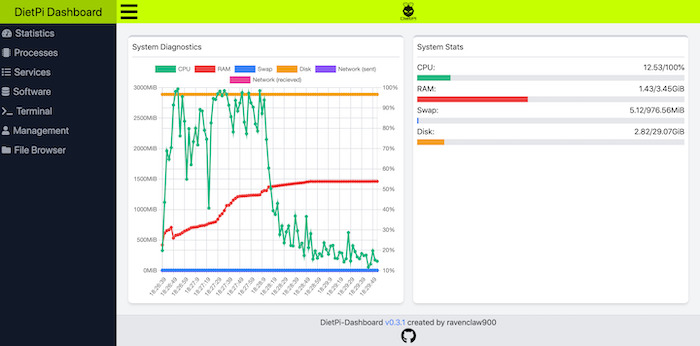{: width="700" height="346" loading="lazy"}

!!! Warnung "DietPi-Dashboard befindet sich noch in der Beta!"

    Wir empfehlen daher noch nicht, es aktiv auf sensiblen Produktivsystemen einzusetzen.

=== "Webinterface"

    DietPi-Dashboard ist standardm&auml;&szlig;ig &uuml;ber den TCP-Port **5252** erreichbar:

    - URL: `http://<Ihre.IP>:5252`
    - Passwort: `<Ihr Software-Passwort>` (Standard: `dietpi`)

=== "Verzeichnisse"

    Die ausf&uuml;hrbare DietPi-Dashboard-Datei und ihre Konfigurationsdatei finden Sie unter:

    ```
    /opt/dietpi-dashboard
    ```

=== "Konfiguration"

    Die Konfigurationsdatei befindet sich unter:

    ```
    /opt/dietpi-dashboard/config.toml
    ```

    Wenn Sie &Auml;nderungen vornehmen, m&uuml;ssen Sie den Dienst anschlie&szlig;end neu starten:

    ```sh
    systemctl restart dietpi-dashboard
    ```

=== "Passwortschutz"

Der Passwortschutz ist ab DietPi v7.9 standardm&auml;&szlig;ig aktiviert. Wenn Sie es zuvor installiert haben, m&uuml;ssen Sie es &uuml;ber die Konfigurationsdatei aktivieren. Erstellen Sie dazu einen SHA512-Hash des `PASSWORTS`, das Sie f&uuml;r die Anmeldung bei der Webschnittstelle verwenden m&ouml;chten, und ein zuf&auml;lliges 64-stelliges Geheimnis, das zum Generieren eines Tokens zum sicheren &Uuml;bertragen und Speichern in Ihrem Browser verwendet wird. Wenden Sie diese auf die Konfigurationsdatei an und starten Sie den Dienst neu, damit die &Auml;nderungen wirksam werden:

    ```sh
    hash=$(echo -n 'PASSWORD' | sha512sum | mawk '{print $1}')
    secret=$(openssl rand -hex 32)
    G_CONFIG_INJECT 'pass[[:blank:]]' 'pass = true' /opt/dietpi-dashboard/config.toml
    GCI_PASSWORD=1 G_CONFIG_INJECT 'hash[[:blank:]]' "hash = \"$hash\"" /opt/dietpi-dashboard/config.toml
    GCI_PASSWORD=1 G_CONFIG_INJECT 'secret[[:blank:]]' "secret = \"$secret\"" /opt/dietpi-dashboard/config.toml
    unset -v hash secret
    systemctl restart dietpi-dashboard
    ```

    Um das Passwort zu &auml;ndern, ersetzen Sie einfach den Hash in der Konfigurationsdatei und starten Sie den Dienst neu.

    Wenn Sie eine Abmeldung von allen Browsern erzwingen m&ouml;chten, ohne das Passwort zu &auml;ndern, k&ouml;nnen Sie stattdessen das Geheimnis &auml;ndern. Generieren und wenden Sie ein neues Geheimnis auf die Konfigurationsdatei an und starten Sie den Dienst neu. Jeder Client und Browser muss sich dann erneut anmelden, um das DietPi-Dashboard weiter nutzen zu k&ouml;nnen, da das gespeicherte Token, das auf Passwort und Geheimnis basiert, ung&uuml;ltig gemacht wurde.

=== "Mehrere Knoten"

    Ab DietPi v8.0 k&ouml;nnen Sie das DietPi-Dashboard als reinen Backend-Knoten installieren, der kein eigenes Webinterface enth&auml;lt. Auf solche Nur-Backend-Knoten kann dann von einem anderen vollst&auml;ndigen DietPi-Dashboard Frontend/Webinterface aus zugegriffen werden. Zus&auml;tzliche Knoten m&uuml;ssten manuell zur Konfigurationsdatei hinzugef&uuml;gt werden, die sich unter befindet:

    ```
    /opt/dietpi-dashboard/config.toml
    ```  
    
Wenn Sie &Auml;nderungen vornehmen, m&uuml;ssen Sie den Dienst anschlie&szlig;end neu starten:

    ```sh
    systemctl restart dietpi-dashboard
    ```

    !!! Hinweis "Vollst&auml;ndige DietPi-Dashboard-Knoten mit integriertem Frontend k&ouml;nnen derzeit nicht von anderen Frontends aus aufgerufen werden."

=== "Dienststeuerung"

    Das DietPi-Dashboard wird standardm&auml;&szlig;ig als systemd-Dienst gestartet und kann daher mit den folgenden Befehlen gesteuert werden:

    ```sh
    systemctl status dietpi-dashboard
    ```

    ```sh
    systemctl stop dietpi-dashboard
    ```

    ```sh
    systemctl start dietpi-dashboard
    ```

    ```sh
    systemctl restart dietpi-dashboard
    ```

=== "Protokolle"

    Dienstprotokolle k&ouml;nnen mit dem folgenden Befehl &uuml;berpr&uuml;ft werden:

    ```sh
    journalctl -u dietpi-dashboard
    ```

=== "Aktualisieren"

Sie k&ouml;nnen DastPi-Dashboard einfach aktualisieren, indem Sie es neu installieren:

    ```sh
    dietpi-software reinstall 200
    ```

***

Quellcode: <https://github.com/ravenclaw900/DietPi-Dashboard>
Lizenz: [GPLv3](https://github.com/ravenclaw900/DietPi-Dashboard/blob/main/LICENSE)

## DietPi-CloudShell

DietPi-CloudShell verwandelt Ihre Konsole oder Ihren LCD-Bildschirm in eine leichtgewichtige Systemstatistikanzeige.

### Beispiel-Screenshots

Die folgenden Screenshots sollen einen &Uuml;berblick &uuml;ber die Anzeigefunktionen von *DietPi-CloudShell* geben.

=== "CPU-Auslastung"

    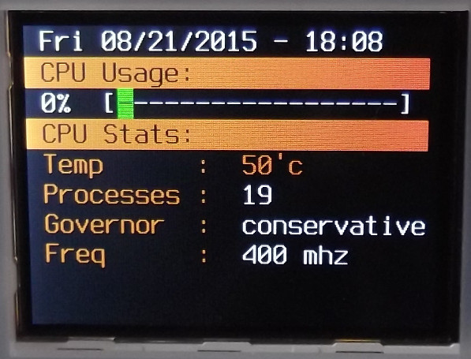{: width="400" height="305" loading="lazy"}

=== "Speicherauslastung"

    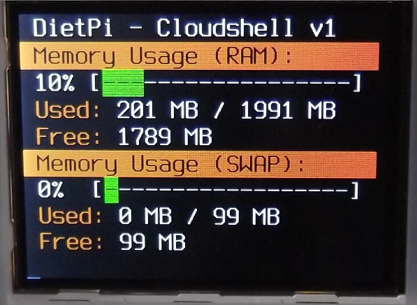{: width="400" height="293" loading="lazy"}

=== "Speicherdetails"

    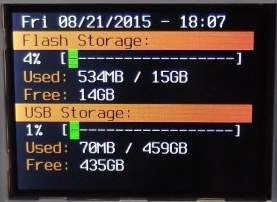{: width="400" height="292" loading="lazy"}

=== "Netzwerkdetails"

    {: width="400" height="303" loading="lazy"}

=== "Pi-Hole-Statistiken"

    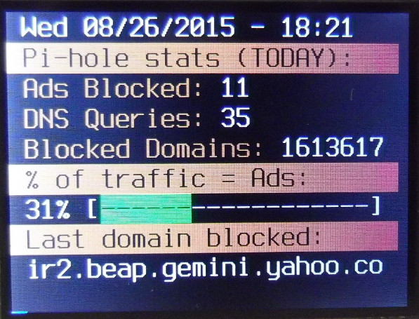{: width="400" height="305" loading="lazy"}

***

YouTube-Video-Tutorial: *DietPi CloudShell (RPi / Odroid XU4)*

<iframe src="https://www.youtube-nocookie.com/embed/O-W8Z33as_U?rel=0" frameborder="0" allow="fullscreen" width="560" height="315" loading=" faul"></iframe>

### Aufbau

=== "Konfiguration"

    Starten Sie das DietPi-CloudShell Control Panel:

    ```sh
    dietpi-cloudshell
    ```

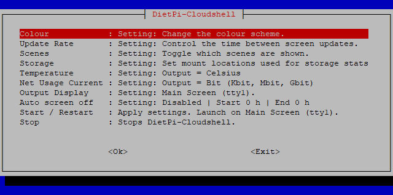{: width="600" height="298" loading="lazy"}

=== "Szenen"

    DietPi-CloudShell bietet Szenen mit vordefinierten Anzeigeausgaben bzw. Grundrisse.
    Szenen werden im Dialog *Scenes* innerhalb von `dietpi-cloudshell` konfiguriert.

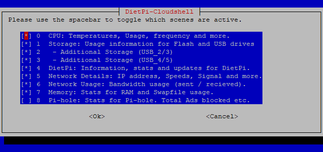{: width="600" height="283" loading="lazy"}

=== "Energiesparen"

    Mit dieser Funktion k&ouml;nnen Sie den Bildschirm automatisch ausschalten und die DietPi-CloudShell-Verarbeitung w&auml;hrend einer bestimmten Zeit deaktivieren.
    Bitte beachten Sie, dass diese Funktion erfordert, dass DietPi-CloudShell mit `dietpi-autostart` gestartet wird oder `dietpi-cloudshell` vom Hauptbildschirm aus (`tty1`) ausf&uuml;hrt.
    Wenn Sie &Auml;nderungen an DietPi-CloudShell &uuml;ber SSH vornehmen, starten Sie nach dem Speichern bitte das System neu, um sicherzustellen, dass diese Funktion aktiviert wird.

Energieeinsparung: `Auto screen off`

### Touchscreen-Unterst&uuml;tzung

=== "Waveshare32"

    Siehe <https://www.waveshare.com/3.2inch-rpi-lcd-b.htm>.
    Diese ist f&uuml;r alle Versionen von Raspberry Pi und Odroid verf&uuml;gbar. DietPi konfiguriert Ihr System automatisch f&uuml;r das Ger&auml;t.
    F&uuml;hren Sie einfach `dietpi-config` aus, w&auml;hlen Sie `Anzeigeoptionen` und dann `waveshare32`.
    Nach einem Neustart wird Ihr *Waveshare32* aktiv.

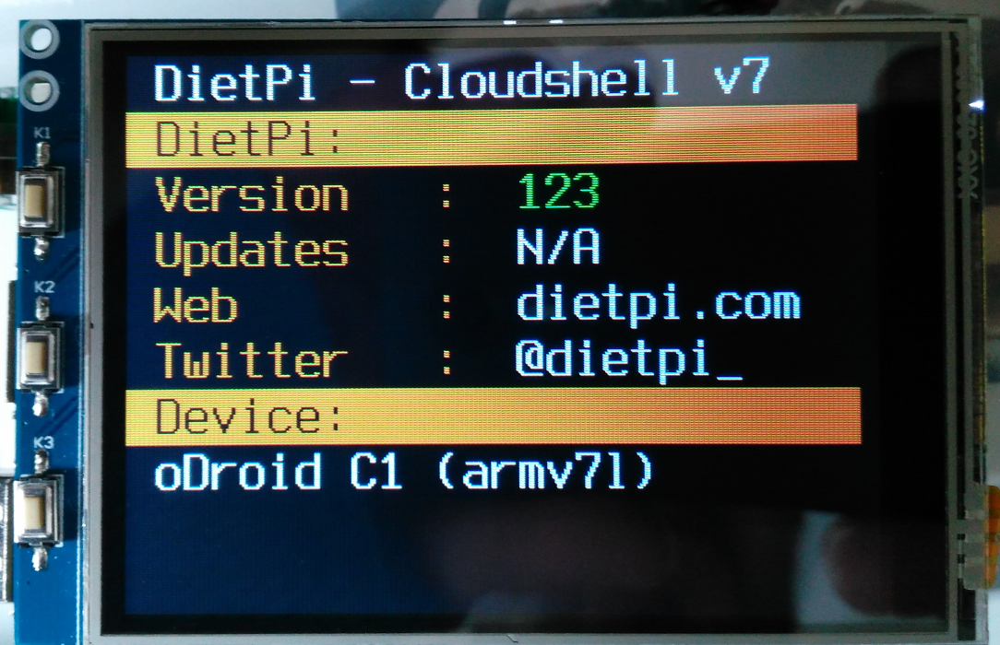{: width="400" height="258" loading="lazy"}

=== "Odroid 3.5 LCD-Schild"

    Siehe <https://www.hardkernel.com/shop/c1-3-2inch-tfttouchscreen-shield/>.
    Dies ist f&uuml;r alle Odroid-Versionen verf&uuml;gbar. DietPi konfiguriert Ihr System automatisch f&uuml;r das Ger&auml;t.
    F&uuml;hren Sie einfach `dietpi-config` aus, w&auml;hlen Sie `Anzeigeoptionen` und dann `odroid-lcd35`.
    Nach einem Neustart wird Ihr *Odroid 3.5 LCD* aktiv.

    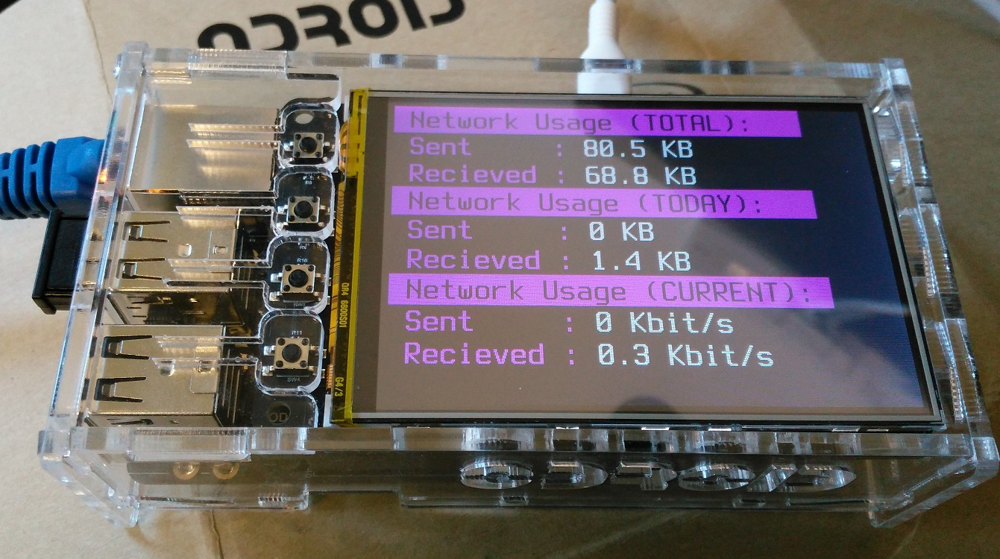{: width="400" height="224" loading="lazy"}

=== "Andere Touchscreens"

Die Anzeigefunktion von *DietPi-CloudShell* funktioniert grunds&auml;tzlich mit jedem LCD-Display oder Monitor mit einer Aufl&ouml;sung von mindestens 320x240 Pixel.

## Linux-Dash

Mit Linux Dash k&ouml;nnen Sie Ihre Systemstatistiken von einer Webseite aus &uuml;berwachen.

- Installiert auch: [LASP-Webserver-Stack](../webserver_stack/)

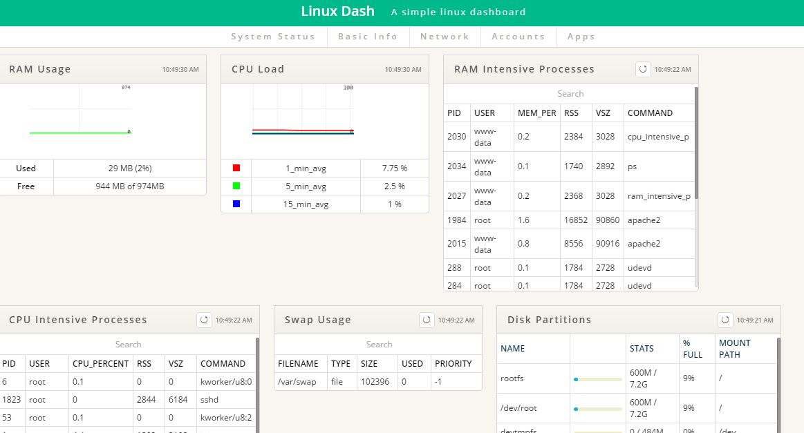{: width="500" height="270" loading="lazy"}

=== "Zugriff auf Linux Dash"

    Auf die Weboberfl&auml;che von *Linux Dash* kann zugegriffen werden &uuml;ber:

    - URL = `http://<your.IP>/linuxdash/app`

***

Offizielle Dokumentation: <https://github.com/afaqurk/linux-dash/wiki>

## phpSysInfo

Erm&ouml;glicht es Ihnen, Ihre Systemstatistiken von einer Webseite aus zu &uuml;berwachen. Die Displayausgabe kann &uuml;ber eine `.ini`-Datei angepasst werden.

- Installiert auch: [LASP-Webserver-Stack](../webserver_stack/)

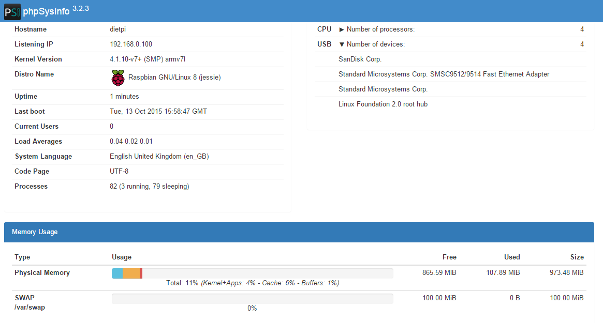{: width="500" height="268" loading="lazy"}

=== "Zugriff auf phpSysInfo"

    Das Webinterface von *phpSysInfo* erreichen Sie &uuml;ber:

    - URL = `http://<your.IP>/phpsysinfo`

=== "Anpassung"

    Dies geschieht &uuml;ber die Datei `phpsysinfo.ini` die sich im Hauptverzeichnis von phpSysInfo befindet (typisch `/var/www/phpsysinfo`). Eine Beispieldatei `phpsysinfo.ini.new` ist vorhanden und gibt Inline-Informationen &uuml;ber alle Konfigurationsoptionen. Gehen Sie einfach durch diese Datei und entdecken Sie all diese Schnickschnack.

***

Offizielle Website: <https://phpsysinfo.github.io/phpsysinfo>

## RPi-Monitor

RPi-Monitor ist ein schicker, leichter Systemstatistik-Monitor mit Web-Interface.

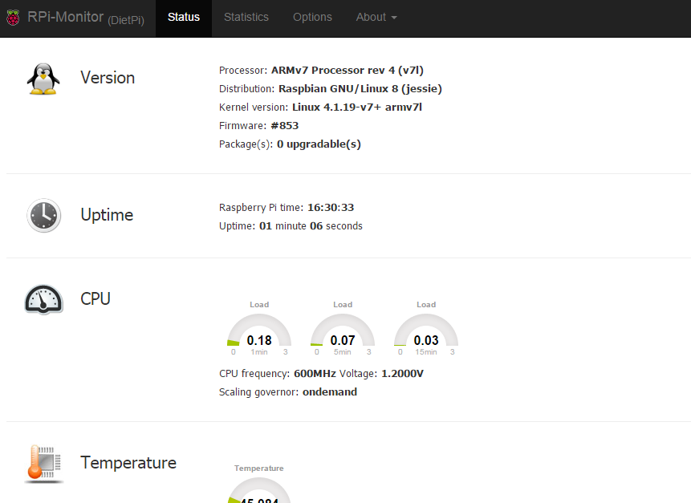{: width="500" height="364" loading="lazy"}

=== "Hauptmerkmale"

    Die Hauptfunktionen von *RPi-Monitor* sind:

    - Sammeln, Speichern und Pr&auml;sentieren von Metriken
    - Es ist flexibel konfigurierbar
    - Es ist vom Benutzer erweiterbar
    - Das Teilen von Metriken kann &uuml;ber eine JSON-Datei oder &uuml;ber SNMP erfolgen
    - Alarmoption

=== "Zugriff auf RPi-Monitor"

    Das Webinterface ist &uuml;ber Port **8888** erreichbar:

    - URL = `http://<Ihre.IP>:8888`

=== "Konfiguration"

    Die Konfiguration ist dort beschrieben: <https://xavierberger.github.io/RPi-Monitor-docs/20_index.html>

***

Offizielle Website: <https://github.com/XavierBerger/RPi-Monitor>.

## Nettodaten

Netdata ist ein raffinierter und funktionsreicher Systemstatistikmonitor mit Webschnittstelle.

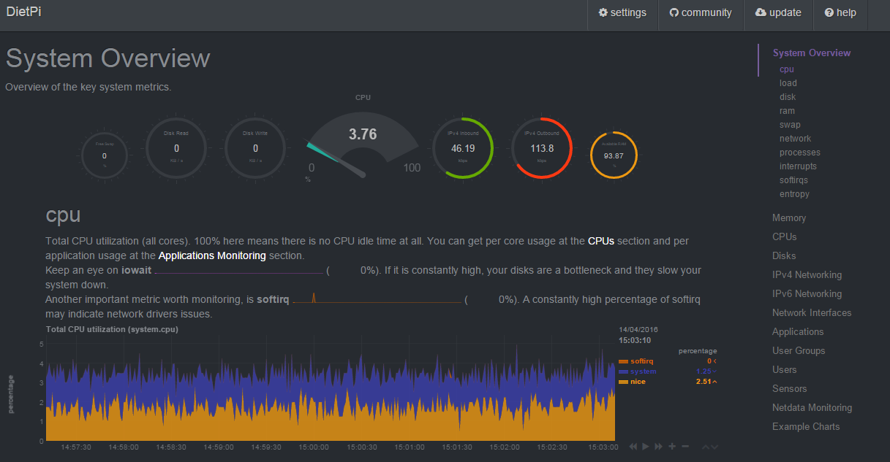{: width="500" height="260" loading="lazy"}

=== "Zugriff auf Netzdaten"

    Das Webinterface ist &uuml;ber Port **19999** erreichbar:

    - URL = `http://<Ihre.IP>:19999`

=== "Fehlerbehebung"

    Abh&auml;ngig von Ihrem System ist Netdata standardm&auml;&szlig;ig m&ouml;glicherweise nicht &uuml;ber Remote-Browser zug&auml;nglich. &Ouml;ffnen Sie in diesem Fall die Konfigurationsdatei
    `/etc/netdata/netdata.conf`
    und die Zeile &auml;ndern
    `bind socket to IP = 127.0.0.1`
    um je nach Bedarf entweder die lokale Netzwerk-IP oder die statische &ouml;ffentliche IP Ihres DietPi-Servers abzugleichen.
    Alternativ kommentieren Sie es zB, wenn Ihr Server keine statische &ouml;ffentliche IP hat, Sie aber einen Fernzugriff ben&ouml;tigen. Beachten Sie jedoch, dass eine ungesch&uuml;tzte &ouml;ffentlich zug&auml;ngliche Netdata-Weboberfl&auml;che ein potenzielles Sicherheitsrisiko darstellt. Gehen Sie zur Registerkarte `Sicherheitsh&auml;rtung`, um mehr dar&uuml;ber zu erfahren, wie Sie den Zugriff auf Netdata einschr&auml;nken k&ouml;nnen.

    Nach dem Speichern m&uuml;ssen Sie den Dienst neu starten, um die &Auml;nderungen zu implementieren, indem Sie Folgendes in das Terminal eingeben:

    ```sh
    systemctl restart netdata
    ```

=== "Sicherheitsh&auml;rtung"

    Beachten Sie, dass der Zugriff auf Netdata f&uuml;r jeden potenziellen Angreifer eine Menge n&uuml;tzlicher Informationen gibt, wo sie mit dem Hacken beginnen k&ouml;nnen.
    Um zu erfahren, wie Sie den Zugriff auf Netdata einschr&auml;nken k&ouml;nnen, lesen Sie bitte deren Dokumentation bez&uuml;glich [der Konfiguration von Zugriffslisten] (https://learn.netdata.cloud/docs/agent/web/server/#access-lists).

***

Offizielle Dokumentation: <https://learn.netdata.cloud/docs/overview/what-is-netdata>
Wikipedia: <https://wikipedia.org/wiki/Netdata>

##Webmin

Webmin ist ein webbasiertes, funktionsreiches Remote-Systemverwaltungstool. Viele Systemeinstellungen k&ouml;nnen einfach &uuml;ber die Dialoge der Weboberfl&auml;che vorgenommen werden.

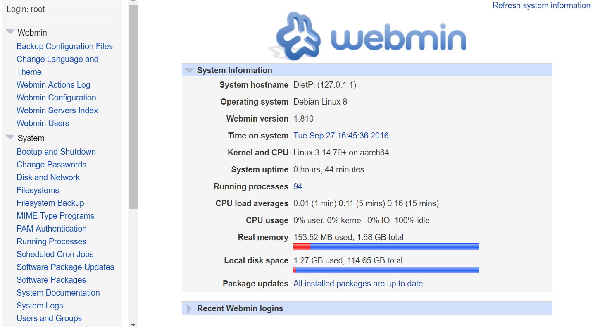{: width="500" height="276" loading="lazy"}

=== "Zugriff auf Webmin"

    Das Webinterface ist &uuml;ber Port **10000** erreichbar:

    - URL = `https://<Ihre.IP>:10000`
    - Benutzername = `root`
    - Passwort = `<Ihr Software-Passwort>` (Standard: `dietpi`)

    ???+ Hinweis "HTTPS verwenden"

    Bitte stellen Sie sicher, dass die URL "https://" eingegeben wird, "http://" funktioniert nicht!

=== "Systemprotokollierung"
    
    Das Webmin-Systemprotokollierungspanel h&auml;ngt immer noch von einem klassischen Dateilogger wie Rsyslog ab. DietPi wird diesen Protokollierungsaufwand jedoch standardm&auml;&szlig;ig nicht auf Systemen auferlegen. Wenn Sie Systemprotokolle &uuml;ber das *Webmin-Online-Panel* anzeigen m&uuml;ssen, k&ouml;nnen Sie entweder einen benutzerdefinierten *syslog*-Daemon konfigurieren oder *Rsyslog* manuell installieren:

    ```sh
    apt install rsyslog
    ```

    DietPi kommt mit *systemd* und dem dazugeh&ouml;rigen *journald* Systemlogger, der &uuml;ber den Befehl `journalctl` aufgerufen werden kann.

***

Offizielle Website: <https://webmin.com/>
<!--Offizielle Dokumentation: <https://doxfer.webmin.com/Webmin/Main_Page> -->
Wikipedia: <https://wikipedia.org/wiki/Webmin>

## K3s

Lightweight Kubernetes – Die zertifizierte Kubernetes-Distribution, die f&uuml;r IoT- und Edge-Computing entwickelt wurde

{: width="300" height="116" loading="lazy"}

=== "Vor der Installation"

    Die Standardinstallation von K3s erstellt einen Single-Node-Cluster.
    Wenn Sie ein Multi-Node-Setup haben m&ouml;chten, m&uuml;ssen Sie die Nodes so konfigurieren, dass sie mit den anderen sprechen.

    Bearbeiten Sie in `/boot/dietpi.txt` den Parameter `SOFTWARE_K3S_EXEC`, um den Befehl (`server` oder `agent`) festzulegen.
    Sie k&ouml;nnen nach dem Befehl weitere Befehlszeilenparameter hinzuf&uuml;gen.

    Beispiel:

    ```
    SOFTWARE_K3S_EXEC=server --disable=local-storage
    ```

    Wenn Sie viele Befehlszeilenparameter hinzuf&uuml;gen m&uuml;ssen, wird empfohlen, sie stattdessen in einer Datei abzulegen.
    nur den Befehl (`server` oder `agent`) in `/boot/dietpi.txt` behalten.
    Wenn `/boot/dietpi-k3s.yaml` vorhanden ist, wird sie w&auml;hrend der Installation nach `/etc/rancher/k3s/config.yaml` kopiert und von K3s verwendet.
    Das Format dieser Datei ist in den [K3s-Dokumenten](https://rancher.com/docs/k3s/latest/en/installation/install-options/#configuration-file) dokumentiert.

=== "Verbinden mit Ihrem Cluster"

    Bei Ausf&uuml;hrung im `Server`-Modus generiert K3s eine `kubeconfig`-Datei unter `/etc/rancher/k3s/k3s.yaml`.
    Kopieren Sie diese auf Ihren Client-Rechner und bearbeiten Sie die Einstellung `Server`, um auf den Hostnamen des Servers zu verweisen.

    Platzieren Sie die Datei am Standardspeicherort (`~/.kube/config`) oder zeigen Sie mit der Umgebungsvariable "KUBECONFIG" darauf.

    Sie sollten jetzt mit `kubectl` mit Ihrem Kubernetes-Cluster interagieren k&ouml;nnen:

    ```sh
    kubectl get nodes
    kubectl get pods -A
    ```

=== "Protokolle anzeigen"

    - Service: `journalctl -u k3s`

***

Offizielle Website: <https://k3s.io>
Offizielle Dokumentation: <https://rancher.com/docs/k3s/latest/en/>
Quellcode: <https://github.com/k3s-io/k3s>
Lizenz: [Apache 2.0](https://github.com/k3s-io/k3s/blob/master/LICENSE)

[Zur&uuml;ck zur **Liste der optimierten Software**](../../software/)
