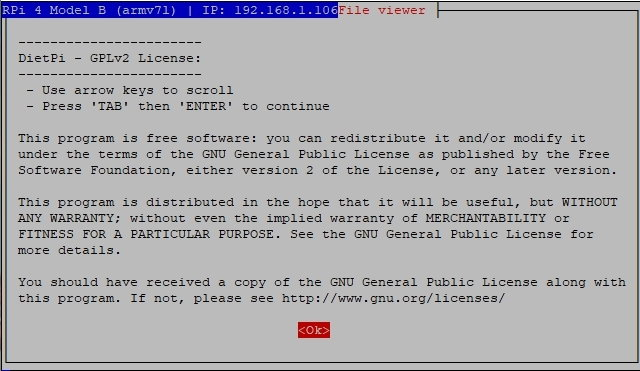

# Anwendungshinweise / HowTo

Dieses Kapitel enthält mehrere Dokumente, die die Verwendung von DietPi beschreiben.

## So aktualisieren Sie auf Buster

Debian Bullseye wurde am 14. August 2021 veröffentlicht und Debian Stretch wurde „oldoldstable“. Der reguläre Support für Debian Stretch endete letztes Jahr und der LTS-Support endet 2022. Wir empfehlen daher dringend, auf das neue Debian Bullseye zu aktualisieren.

Wenn Sie mit dem Flashen eines neuen Images zufrieden sind, befolgen Sie die kurzen Anweisungen in unserem [Blogbeitrag](https://dietpi.com/blog/?p=811#2.1-fresh-install), um allgemeine Migrationsschritte abzudecken.

Wenn zu viele Anpassungen vorgenommen wurden, ohne dass dies gut dokumentiert oder in Skripten festgehalten wurde, kann ein Upgrade des laufenden Systems einfacher sein. Führen Sie die folgenden Befehle Schritt für Schritt aus, um in einem ersten Schritt das Upgrade von Stretch auf Buster durchzuführen. Wenn Sie auf Fehler stoßen und sich nicht sicher sind, wie Sie sie beheben können, kontaktieren Sie uns bitte über unser [Community-Forum](https://dietpi.com/phpbb/viewforum.php?f=11) oder [GitHub-Problem](https:// github.com/MichaIng/DietPi/issues), um Hilfe zu finden.

```sh
dietpi-backup 1
sed -i 's/stretch/buster/g' /etc/apt/sources.list{,.d/*.list}
rm -f /etc/apt/sources.list.d/dietpi-php.list
rm -f /etc/apt/trusted.gpg.d/dietpi-php.gpg
rm -f /etc/apt/preferences.d/dietpi-{php,openssl,xrdp}
rm -f /etc/mysql/mariadb.conf.d/97-dietpi.cnf
/boot/dietpi/func/dietpi-set_software apt-cache clean
apt update
apt upgrade
apt full-upgrade
apt autopurge
/boot/dietpi/func/dietpi-obtain_hw_model
. /boot/dietpi/func/dietpi-globals
```

Wenn Sie PHP installiert haben, führen Sie auch die folgenden Befehle aus, um Probleme bei der Installation zusätzlicher PHP-Module zu vermeiden:

```bash
mapfile -t packages < <(dpkg --get-selections '*php*' | mawk '$2=="install" {print $1}')
dpkg -r --force-depends "${packages[@]}"
apt -y install "${packages[@]}"
unset -v packages
```

Wenn `dietpi-update` Sie bereits zum dedizierten Stretch-Update-Zweig migriert hat, können Sie jetzt zurück zum stabilen `master`-Zweig migrieren, um DietPi-Updates auf v8.0 und höher anzuwenden:

```sh
G_CONFIG_INJECT 'DEV_GITBRANCH=' 'DEV_GITBRANCH=master' /boot/dietpi.txt
dietpi-update
```

Wenn Sie **Python 3** installiert haben, muss es nach dem Upgrade von v3.5 auf v3.7 neu installiert werden und alte Module können zur Bereinigung entfernt werden:

```sh
rm -Rf /usr/local/lib/python3.5 /usr/local/bin/pip3*
dietpi-software reinstall 130
```

Möglicherweise müssen Sie auch andere Python-basierte Softwaretitel und Module neu installieren, die manuell mit dem Befehl "pip3" installiert wurden. Ihre Daten und Einstellungen bleiben erhalten.

Überprüfen Sie, ob alles in Ordnung ist, führen Sie einen „Neustart“ durch und überprüfen Sie es erneut. In diesem Fall empfehlen wir, direkt weiter auf die aktuelle stabile Version von Debian Bullseye zu aktualisieren, indem Sie die Anweisungen in unserem Blogbeitrag befolgen: <https://dietpi.com/blog/?p=811#2.2-manual-upgrade>

---

## Wie man den Protokollierungsmechanismus verwendet

DietPi verwendet systemd als System- und Dienstmanager, der den Logging-Daemon `systemd-journald` enthält.
Ein zusätzlicher Syslog-Daemon, wie `rsyslog`, wird nicht benötigt und ist daher auf DietPi nicht vorinstalliert. Der grundlegende Befehl für den Zugriff auf `systemd-journald`-Protokolle lautet

```sh
journalctl [options]
```

<font size="+2">Grundlegende Ausgabe protokollieren</font>

Die einfache Verwendung von `journalctl` druckt alle im System gespeicherten Logging-Meldungen aus.
Jede Zeile zeigt:
<Zeitstempel\> <Hostname\> <Prozessname\>[PID]: <Protokollmeldung\>

Der folgende Screenshot zeigt das Logging des Bootvorgangs (einer virtuellen Maschine von DietPi). Sie können die verschiedenen Felder (Zeitstempel, Hostname usw.) in den Protokolleinträgen sehen:

{: width="640" height="300" loading="lazy"}

<font size="+2">Filteroptionen für die Protokollausgabe</font>

Einige der Optionen werden in der folgenden Tabelle beschrieben.
Detailliertere Optionen können in den [Manpages von `journalctl`](https://man7.org/linux/man-pages/man1/journalctl.1.html) studiert werden.

| Befehl | Bemerkung |
| - | - |
| `journalctl -u UNITNAME` <br>(`--unit UNITNAME`) | Zeigt Meldungen der angegebenen Einheit | an
| `journalctl _PID=<process_id>` | Zeigt Meldungen von Prozessen an, deren PID gleich <process_id\> | ist
| `journalctl -r` <br>(`--reverse`) | Zeigt die Liste in umgekehrter Reihenfolge an, d. h. neueste Nachrichten zuerst |
| `journalctl -f` <br>(`--follow`) | Zeigt das Ende der Log-Meldungsliste an und zeigt neue Einträge *live* |
| `journalctl -b` <br>(`--boot`) | Zeigt Meldungen seit dem letzten Start an (d. h. keine älteren Meldungen). Siehe auch Option `--list-boots` |
| `journalctl -k` <br>(`--dmesg`) | Zeigt Kernelmeldungen an |
| `journalctl -p PRIORITY` <br>(--priority PRIORITÄT) | Zeigt Nachrichten mit der angegebenen Priorität an. PRIORITÄT kann „merg“, „alert“, „crit“, „err“, „warning“, „notice“, „info“ und „debug“ sein. Auch Nummern als PRIORITY sind möglich |
| `journalctl -o verbose` | Zeigt zusätzliche Metadaten an |
| `journalctl --disk-usage` | Zeigt den von den Logging-Meldungen belegten Speicherplatz an |
| `journalctl --no-pager | grep <filter>` | Filtert Protokollmeldungen (Filterung mit `grep`) |

In den Softwarepaketbeschreibungen gibt es manchmal eine Registerkarte namens "Protokolle anzeigen". Dies gibt ein `jounalctl -u UNITNAME`-Befehlsbeispiel, wie die Logging-Meldungen eines bestimmten Softwarepakets gefiltert werden.
Beispiel: Siehe [Tab "Protokolle anzeigen"](../software/dns_servers/#unbound) von *Unbound*. Es gibt: `journalctl -u unbound`.

<font size="+2">Protokollierungsoptionen</font>

Wie im Kapitel [Auswahl des Protokollsystems](../software/log_system/) beschrieben, hat DietPi mehrere Optionen, wie das Protokollsystem funktioniert. Vor allem der Log-Verlauf, der Speicherverbrauch und die Häufigkeit der Schreibzugriffe auf SD-Karten variieren.
Suchen und stellen Sie die Optionen ein, die Ihren Anforderungen entsprechen. Es ist auch eine Option, die Protokollierung zu ändern, um einige Probleme zu untersuchen.

| Protokolloption | Standort | Protokolltiefe | Protokollpersistenz |
| - | - | - | - |
| DietPi-RAMlog #1 | Arbeitsspeicher | letzte Stunde | flüchtig, d.h. nicht auf Platte gespeichert |
| DietPi-RAMlog #2 | Arbeitsspeicher | langfristig | gespeichert, d.h. stündlich auf Platte gespeichert |
| Vollständige Protokollierung | Datenträger | langfristig | gespeichert, d.h. sofort auf Platte gespeichert <br>(mit Rsyslog und Logrotate)|

---

## So führen Sie eine automatische Basisinstallation beim ersten Booten durch (DietPi-Automation)

DietPi bietet die Option für eine automatische First-Boot-Installation. Normalerweise findet während des ersten Systemstarts ein Installationsvorgang statt, der Ihr System anfänglich einrichtet. Anschließend werden die im Abschnitt ["Erstanmeldung auf DietPi"](../install/#4-first-logon-on-dietpi) beschriebenen Schritte durchgeführt.

{: width="640" height="371" loading="lazy"}

Diese Schritte erfordern eine Menge an Benutzerinteraktion, die mit der in diesem Abschnitt beschriebenen automatischen Basisinstallationsoption überwunden werden kann.
Die automatisierte Einrichtung basiert auf der Konfigurationsdatei `/boot/dietpi.txt`. Es kann vor dem ersten Booten editiert werden und wird beim ersten Bootvorgang ausgewertet. Bei nachfolgenden Bootvorgängen werden die meisten Optionen in der Datei nicht mehr ausgewertet.

??? info "Inhalt der Datei `/boot/dietpi.text` bearbeiten"

    Bei einigen Hardwareoptionen (z. B. Raspberry Pi) befindet sich die Datei auf einer eigenen FAT-Partition, auf die auf einem Windows-PC zugegriffen werden kann. In diesem Fall ist `dietpi.txt` im Stammverzeichnis zu finden.

    Einige Hardwareoptionen (z. B. NanoPi) haben diese zusätzliche Partition nicht, d. h. das System befindet sich auf einer einzelnen Partition, normalerweise ext4. In diesem Fall muss die SD-Karte gemountet werden, um auf die Datei „dietpi.txt“ zugreifen zu können, die dann im Verzeichnis „/boot“ zu finden ist.

Das Ergebnis der automatisierten Installation kann folgende Bereiche abdecken:

- **Netzwerkkonfiguration** (z. B. WLAN-, Netzwerk- und Proxy-Einstellungen)
- **Systemoptionen** (z. B. Zeitzone, Hostname, Root-Passwort)
- **Softwareeinstellungen** (z. B. SSH-Server, Dateiserver, Webserver)
- **Softwareoptionen** (z. B. VNC, Nextcloud, DietPi Dashboard)
- **Automatische Softwareinstallation** (Pakete von `dietpi-software`)
- **Benutzerskript** vor und nach der Erstinstallation
- **Wiederherstellen** von einer zuvor erstellten Systemsicherung

Um diese automatisierte Installation zu erreichen, müssen die folgenden Schritte in der angegebenen Reihenfolge durchgeführt werden:

1. Flashen Sie das Bootmedium (z. B. SD-Karte)
1. Bearbeiten Sie die Datei „/boot/dietpi.txt“ auf dem Bootmedium
1. Schließen Sie das Boot-Medium an Ihr System an
1. Starten Sie das System zum ersten Mal
1. Warten Sie, bis die automatische Einrichtung abgeschlossen ist

### Optionen innerhalb der Datei

Die Optionen werden im Allgemeinen in der Datei selbst beschrieben. Einzelheiten zu den Konfigurationsoptionen finden Sie im Wesentlichen im Inhalt der Datei.
Nachfolgend sind nur die wichtigsten Optionen aufgeführt. Weitere Optionen finden Sie in der Datei `dietpi.txt` selbst.

#### Netzwerkkonfiguration

Um die grundlegende Netzwerkkonfiguration zu erreichen, müssen die folgenden Optionen berücksichtigt werden:

- Mit WLAN ausführen: `AUTO_SETUP_NET_WIFI_ENABLED`, `AUTO_SETUP_NET_WIFI_COUNTRY_CODE` in Kombination mit `dietpi-wifi.txt`
- Verwenden Sie eine statische IP-Adresse: `AUTO_SETUP_NET_USESTATIC`, `AUTO_SETUP_NET_STATIC_IP`, `AUTO_SETUP_NET_STATIC_MASK`, `AUTO_SETUP_NET_STATIC_GATEWAY`, `AUTO_SETUP_NET_STATIC_DNS`, `AUTO_SETUP_DHCP_TO_STATIC`
- Verwendung eines Proxy-Servers: `CONFIG_PROXY_ADDRESS`, `CONFIG_PROXY_PORT`, `CONFIG_PROXY_USERNAME`, `CONFIG_PROXY_PASSWORD`

#### Systemoptionen

Viele der Systemoptionen lassen sich bei der automatisierten Installation einstellen und auch nachträglich über `dietpi-config` ändern:

- Grundeinstellungen: `AUTO_SETUP_NET_HOSTNAME`, `AUTO_SETUP_GLOBAL_PASSWORD`
- Lokalisierung: `AUTO_SETUP_LOCALE`, `AUTO_SETUP_KEYBOARD_LAYOUT`, `AUTO_SETUP_TIMEZONE`
- Autostart: `AUTO_SETUP_AUTOSTART_TARGET_INDEX`, `AUTO_SETUP_AUTOSTART_LOGIN_USER`
- Overclocking: `CONFIG_CPU_GOVERNOR`, `CONFIG_CPU_MAX_FREQ`, `CONFIG_CPU_MIN_FREQ` usw.
- Automatische Aktualisierung: `CONFIG_CHECK_DIETPI_UPDATES`, `CONFIG_CHECK_APT_UPDATES`

#### Softwareeinstellungen

Einige Serveroptionen können über `AUTO_SETUP_SSH_SERVER_INDEX`, `AUTO_SETUP_FILE_SERVER_INDEX`, `AUTO_SETUP_WEB_SERVER_INDEX` gesetzt werden.

#### Installation von Softwarepaketen

Alle Softwarepakete, die über `dietpi-software` installiert werden können, können ebenfalls verwendet werden automatisch mit dem Schlüsselwort `AUTO_SETUP_INSTALL_SOFTWARE_ID` installiert.
Die Softwarepakete werden mit ihrer Software-ID (einer Nummer) angegeben, die auf der linken Seite beim Durchsuchen der Software im Skript „dietpi-software“ zu finden ist. Zusätzlich sind sie in der [Liste verfügbarer Software-IDs](https://github.com/MichaIng/DietPi/wiki/DietPi-Software-list) aufgeführt.

Als Beispiel hat das Softwarepaket „Plex Media Server“ die ID 42.

#### Benutzerskript

Die Ausführung eines Benutzerskripts kann zu diesen beiden Zeitpunkten erfolgen:

- Pre-Networking und Pre-DietPi-Installation (`/boot/Automation_Custom_PreScript.sh`)
- Post-Networking und Post-DietPi-Installation (`/boot/Automation_Custom_Script.sh`)

Suchen Sie nach `AUTO_SETUP_CUSTOM_SCRIPT_EXEC` für Details.

#### Systemwiederherstellung

Mit dem Schlüsselwort `AUTO_SETUP_BACKUP_RESTORE` kann ein Wiederherstellungsvorgang automatisch durchgeführt werden. Dies gibt die Möglichkeit, ein System mit einer zuvor erstellten Systemsicherung (z. B. zum Generieren vieler identischer Systeme) zu starten.

#### Allgemeine Optionen

Diese Schlüsselwörter sind allgemein und müssen für vollständig automatisierte Setups verwendet werden:

- `AUTO_SETUP_ACCEPT_LICENSE`
- `AUTO_SETUP_AUTOMATIERT`

Anmerkung: Wenn `AUTO_SETUP_AUTOMATED=1` verwendet wird, muss die `AUTO_SETUP_ACCEPT_LICENCE` nicht gesetzt werden.

### Warten Sie auf den Abschluss der automatischen Einrichtung / Protokollierung

Die Dauer eines automatisierten Setups hängt von den gewählten Optionen ab, insbesondere von den zu installierenden Softwarepaketen und natürlich von der Geschwindigkeit des Systems. Es kann lange dauern (mehr als eine Stunde ist möglich). Um herauszufinden, ob der automatische Installationsprozess läuft, kann sich der Benutzer über eine andere SSH-Verbindung am System anmelden. Während des Installationsvorgangs erscheint nach dem Login eine zyklische Meldung.

Das Ergebnis des automatisierten Installationsvorgangs wird in die Datei „/var/tmp/dietpi/logs/dietpi-firstrun-setup.log“ geschrieben.

### Beispiel #1 des Dateiinhalts

Die folgenden Zeilen geben ein Beispiel für notwendige Änderungen in der Datei „dietpi.txt“. Das zu erreichende Ziel ist:

- Ethernet-Verbindung, DHCP, kein Proxy, kein WLAN
- Deutsche Lokalisierung
- Hostname „meinDietPiSystem“.

Dann müssen diese Einträge vor dem ersten Booten in der Datei `dietpi.txt` gesetzt werden:

```sh
AUTO_SETUP_ACCEPT_LICENSE=1
AUTO_SETUP_LOCALE=de_DE.UTF-8
AUTO_SETUP_KEYBOARD_LAYOUT=de
AUTO_SETUP_TIMEZONE=Europa/Berlin
AUTO_SETUP_NET_HOSTNAME=meinDietPiSystem
```

### Beispiel #2 des Dateiinhalts

Die folgenden Zeilen geben ein Beispiel für notwendige Änderungen in der Datei „dietpi.txt“. Das zu erreichende Ziel ist:

- Automatische Updates
- Ethernet-Verbindung, DHCP, kein Proxy, kein WLAN
- Deutsche Lokalisierung
- Hostname „meinDietPiSystem“.
- X11-Desktop mit XFCE und Chromium
- Autostart zum X11-Anmeldebildschirm

Dann müssen diese Einträge vor dem ersten Booten in der Datei `dietpi.txt` gesetzt werden:

```sh
AUTO_SETUP_LOCALE=de_DE.UTF-8
AUTO_SETUP_KEYBOARD_LAYOUT=de
AUTO_SETUP_TIMEZONE=Europa/Berlin
AUTO_SETUP_NET_HOSTNAME=meinDietPiSystem
AUTO_SETUP_BROWSER_INDEX=-2
AUTO_SETUP_AUTOSTART_TARGET_INDEX=16
AUTO_SETUP_AUTOMATED=1
AUTO_SETUP_INSTALL_SOFTWARE_ID=25
CONFIG_CHECK_DIETPI_UPDATES=1
CONFIG_CHECK_APT_UPDATES=2
```

---

### Verweise

DietPi-Community-Forum: [DietPi-Automatisierung](https://dietpi.com/phpbb/viewtopic.php?t=273)  
Blogeintrag von `Holger Erbe`: [Vollautomatische Installation eines Raspberry Pi unter DietPi – Schritt für Schritt](https://blog.login.gmbh/vollautomatische-installation-eines-raspberry-pi-unter-dietpi- schritt-fuer-schritt/){:class="nospellcheck"}  
Blogeintrag aus `DMW007`: [Raspberry Pi Ersteinrichtung mit DietPi Installation ohne Monitor automatisiert einrichten (Windows + Linux)](https://u-labs.de/portal/raspberry-pi-ersteinrichtung-mit-dietpi -installation-ohne-monitor-automatisiert-einrichten-windows-linux/){:class="nospellcheck"}  