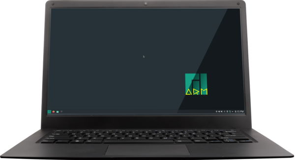
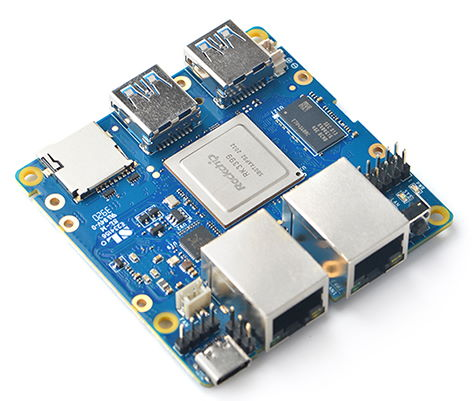
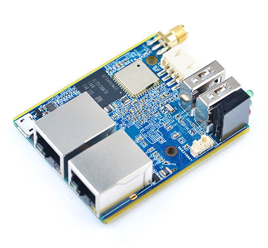

# Versionshinweise

## Mai 2021 (Version 7.2)

### Ü;berblick

Willkommen zur **Ver&ouml;ffentlichung vom Mai 2021** :octicons-heart-16: von **DietPi**.

Mit dieser Version bringen wir mehr Details zu Dingen, die in der aktuellen Iteration geliefert werden. Ü;berprüfen Sie immer die Iterationsplanungsseite in [DietPi Wiki](https://github.com/MichaIng/DietPi/wiki/Iteration-plans), um zu sehen, was als nächstes geliefert wird!

Diese Version erweitert die Unterstützung für neue SBCs, fügt neue Anbieter für `DietPi-DDNS` und `DietPi-VPN` hinzu und bringt auch eine neue Konfigurationsoption für die Browserauswahl.

Plus, mehr Verbesserungen und Fehlerbehebungen!

{: width="320" height="427" loading="lazy"}

### Browser-Einstellungsoption {: #new-software-72 }

- [Firefox](../../software/desktop/#firefox) :octicons-arrow-right-16: Der Browser Mozilla Firefox ist jetzt eine eigenständige Softwareoption mit der ID **67**. [DietPi-Software](../../dietpi_tools/#dietpi-software) wurde eine Browser-Einstellungsoption hinzugefügt.

    {: width="500" height="272" loading="lazy"}

    Dies kann vor dem ersten Booten eingestellt werden, indem die neue Einstellung verwendet wird, die in der Datei `dietpi.txt` verfügbar ist:

    !!! Hinweis "Konfigurationsoptionen"

        Als nächste Optionen stehen zur Verfügung: `0` = Keine | `-1` = [Firefox](../../software/desktop/#firefox) | `-2` = [Chromium](../../software/desktop/#chromium)

        **Hinweis:** Diese Option legt fest, dass der Browser **nur** installiert wird, wenn ein [Desktop](../../software/#desktops) installiert ist. Es wird nicht installiert, wenn kein Desktop installiert ist und eine manuelle Browserauswahl es au&szlig;er Kraft setzt.

        ```sh
        AUTO_SETUP_BROWSER_INDEX=-1
        ```

    Der Webbrowser wird _nur_ installiert, wenn ein [Desktop](../../software/#desktops) installiert ist. Es ähnelt der Webserver-Einstellung, bei der ein Webserver NUR installiert wird, wenn ein anderer Softwaretitel dies erfordert.

    **Warum diese Änderung?** Anstatt **immer** Firefox installiert zu haben, wenn ein Desktop ausgewählt wurde (oder als Abhängigkeit gezogen wurde, zB ein VNC-Server), k&ouml;nnen Sie jetzt wählen, ob Firefox, Chromium oder _kein Browser_ installiert wird.

    Es handelt sich nicht um eine _`diesen Browser jetzt installieren`_-Auswahl, wie bei Dateiservern, SSH-Servern oder Protokollierungssystemen, sondern um eine Einstellungsauswahl.

### Neue unterstützte SBCs {: #new-sbc-72 }

- Pinebook Pro | Anfängliche Hardwarekennung (ID: 46) :octicons-arrow-right-16: Unterstützung für dieses Gerät wurde zu DietPi hinzugefügt. Das DietPi-Image wird ab dem `30.05.2021` zum Download zur Verfügung stehen.

{: width="600" height="326" loading="lazy"}

-NanoPi R4S | Anfängliche Hardwarekennung (ID: 47) :octicons-arrow-right-16: Unterstützung für dieses Gerät wurde zu DietPi hinzugefügt. Das DietPi-Image wird ab dem `30.05.2021` zum Download zur Verfügung stehen.

{: width="472" height="401" loading="lazy"}

-NanoPi R1 | Anfängliche Hardwarekennung (ID: 48) :octicons-arrow-right-16: Unterstützung für dieses Gerät wurde zu DietPi hinzugefügt. Das DietPi-Image wird ab dem `30.05.2021` zum Download zur Verfügung stehen.

{: width="540" height="500" loading="lazy"}

### DietPi Tools (neue / bemerkenswerte Updates) {: #dietpi-tools-72 }

- [**DietPi-DDNS**](../../dietpi_tools/#dietpi-ddns)

    Es hat jetzt eine native Unterstützung für [FreeDNS](https://freedns.afraid.org) und [OVH](https://docs.ovh.com/gb/en/domains/hosting_dynhost/), was die Liste von erweitert vorhandene Optionen im `DietPi-DDNS`-Tool.

- [**DietPi-VPN**](../../dietpi_tools/#dietpi-vpn)

    Es enthält jetzt native Unterstützung für [IPVanish](https://www.ipvanish.com) und [Private Internet Access (PIA)](https://www.privateinternetaccess.com).

    Wenn `Zurücksetzen` ausgewählt wird, wird Ihnen nun angeboten, das OpenVPN-Paket zu l&ouml;schen, solange weder die OpenVPN (Server)-Installationsoption noch PiVPN installiert ist. Vielen Dank an @maartenlangeveld für diesen Vorschlag: <https://github.com/MichaIng/DietPi/issues/4346>.

    Lassen Sie eingehende Pakete von der Loopback-Schnittstelle zu. Es ist erforderlich, mit lokalen Servern (z. B. Pi-Hole) zu kommunizieren, die auf demselben Computer ausgeführt werden, da die Verbindung noch nicht als hergestellt gilt, wenn die Pakete noch nicht vom Server akzeptiert wurden.

- [**DietPi-AutoStart**](../../dietpi_tools/#dietpi-autostart)

    Es erm&ouml;glicht eine zuverlässigere automatische Desktop-Anmeldung für Nicht-Root-Benutzer. Früher wurde der X-Server selbst vom Login-Benutzer gestartet, was oft zusätzliche Berechtigungen erforderte und manchmal, basierend auf GPU und Treiber, überhaupt nicht m&ouml;glich war (ohne weitere Anpassungen).
    Die Methode wurde so geändert, dass LightDM für die automatische Anmeldung ohne Rootberechtigung verwendet wird, genau wie für die manuelle Desktop-Anmeldung, sich jedoch automatisch mit dem ausgewählten Benutzer am Desktop anmeldet.

- [**DietPi-Software**](../../dietpi_tools/#dietpi-software)

    Zusammen mit der Browsereinstellung wurde eine Desktopeinstellungsoption hinzugefügt, um auszuwählen, welcher Desktop (nur) installiert werden soll, wenn eine andere Softwareauswahl dies erfordert, insbesondere Remote-Desktop-L&ouml;sungen. Dies kann vor dem ersten Booten eingestellt werden, indem die neue Einstellung verwendet wird, die in der Datei `dietpi.txt` verfügbar ist:

    !!! Hinweis "Konfigurationsoptionen"

        Folgende Optionen sind verfügbar: `0` = [LXDE](../../software/desktop/#lxde) | `-1` = [Xfce](../../software/desktop/#xfce) | `-2` = [MATE](../../software/desktop/#mate) | `-3` = [LXQt](../../software/desktop/#lxqt) | `-4` = [GNUstep](../../software/desktop/#gnustep)

        **Hinweis:** Diese Option legt fest, dass der Desktop **nur** installiert wird, wenn eine andere ausgewählte Software dies erfordert. Es wird nicht installiert, wenn keine andere Software einen Desktop ben&ouml;tigt und eine manuelle Desktop-Auswahl ihn überschreibt.

        ```sh
        AUTO_SETUP_DESKTOP_INDEX=0
        ```

oder mit dem neuen Menüeintrag. Es funktioniert wie die Webserver-Präferenz, spielt also nur eine Rolle, wenn ein Desktop als Abhängigkeit installiert ist und ein manuell ausgewählter Desktop aus der vollständigen Softwareliste oder der Softwaresuchliste die Präferenz überschreibt.

### Änderungen / Verbesserungen / Optimierungen {: #changes-72 }

- [DietPi-Config](../../dietpi_tools/#dietpi-configuration) | Auf [Raspberry Pi](../../hardware/#raspberry-pi) kann der Allo Boss2 DAC jetzt aus der Soundkartenliste ausgewählt werden. Das mit diesem Produkt gelieferte OLED-Display muss derzeit manuell gemä&szlig; den Allo-Anweisungen installiert werden, wird aber mit der nächsten Version v7.3 nativ in DietPi integriert.
- [DietPi-Software | **WiringPi**](../../software/hardware_projects/#wiringpi) :octicons-arrow-right-16: Auf Raspberry Pi wird jetzt ein neuer aktualisierter Fork des veralteten Originalprojekts verwendet, der Unterstützung für erm&ouml;glicht [Raspberry Pi 4, Raspberry Pi 400 und Raspberry Compute Module (CM) 4](../../hardware/#raspberry-pi) – siehe <https://github.com/WiringPi/WiringPi>.
- [DietPi-Software | **WiringPi**](../../software/hardware_projects/#wiringpi) :octicons-arrow-right-16: Bei Neuinstallationen und Neuinstallationen wird das Verzeichnis source/examples jetzt in `/mnt/dietpi_userdata/ installiert WiringPi` anstelle von `/root/wiringPi`, um allgemeinen Zugriff für Nicht-Root-Benutzer zu erm&ouml;glichen.
- [DietPi-Software | **Node.js**](../../software/webserver_stack/#nodejs) :octicons-arrow-right-16: Auf ARMv6 werden neue Node.js-Versionen jetzt über inoffizielle Builds installiert. Offizielle Builds für ARMv6 werden nur bis Node v11 bereitgestellt. Vielen Dank an @ollliegits für das Hinzufügen von Unterstützung für diese Builds zu unserem Node.js-Installer-Fork: <https://github.com/MichaIng/nodejs-linux-installer/pull/2>.
- [DietPi-Software | **EmonPi**](../../software/home_automation/#emonhub) :octicons-arrow-right-16: Diese Softwareoption wurde umbenannt in `emonHub`, dem Namen des Datensammlers für das `emonPi ` RPi-Energieüberwachungs-Zusatzplatine. Eine viel neuere Python 3-kompatible Version aus dem offiziellen `OpenEnergyMonitor`-Repository wird ab sofort installiert und bietet zusätzliche Funktionen und Fehlerbehebungen.
- [DietPi-Software | **RPi Cam Control**](../../software/camera/#rpi-cam-control) :octicons-arrow-right-16: Diese Installationsoption wurde für 64-Bit-Systeme deaktiviert. Es verwendet eine `32-bit/armhf` `raspimjpeg`-Binärdatei, die von der `32-bit/armhf` C-Bibliothek abhängt. Es wird wieder aktiviert, sobald der Projektbetreuer oder wir eine native `64-bit/arm64` `raspimjpeg`-Binärdatei bereitstellen.
- [DietPi-Software | **Roon Extension Manager**](../../software/media/#roon-extension-manager) :octicons-arrow-right-16: Nach einem gr&ouml;&szlig;eren Upgrade auf v1.0 ist es jetzt als Docker implementiert Container, und nicht als Node.js-Modul. Das Upgrade kann angewendet werden, indem Sie Folgendes manuell ausführen:

    ```sh
    dietpi-software reinstall 86
    ```

    Vielen Dank an @JanKoudijs für die Entwicklung von Roon Extension Manager und die Implementierung der erforderlichen Änderungen in `DietPi-Software`: <https://github.com/MichaIng/DietPi/pull/4399>.
- [DietPi-Software | **Pi-hole**](../../software/dns_servers/#pi-hole) :octicons-arrow-right-16: Bei Neuinstallationen und Neuinstallationen wird die Dauer der DNS-Abfrageprotokollierung auf 2 Tage reduziert. Eine interne Diskussion ergab, dass niemand von uns Protokolle verwendet, die älter als ein paar Stunden sind, während diese standardmä&szlig;ig ein Jahr lang aufbewahrt werden, was zu Datenbankgr&ouml;&szlig;en von Hunderten von MiB bis GiB führt. Wir belassen es bei 2 Tagen, damit Dashboard-Grafiken/Diagramme beim Pi-Hole (Neu-)Start nicht leer sind. Benutzer, die langfristige DNS-Abfragedaten für Statistiken oder ähnliches ben&ouml;tigen, k&ouml;nnen die TTL problemlos erh&ouml;hen, was auch in unseren Dokumenten angezeigt wird.

### Fehlerbehebungen {: #bug-fixes-72 }

- [Odroid XU4](../../hardware/#odroid) :octicons-arrow-right-16: Es wurde ein Problem behoben, bei dem Installationen und m&ouml;glicherweise andere Aufgaben hängen blieben, weil dem Gerät die Entropie ausging. Auf dem System [Odroid XU4](../../hardware/#odroid) wird der nicht unterstützte Hardware-Zufallsgenerator-Daemon entfernt und stattdessen der Software-Daemon `HAVEGE` zur Entropieerzeugung installiert. Vielen Dank an @Speeedfire für die Meldung dieses Problems: <https://github.com/MichaIng/DietPi/issues/4318>
- [DietPi-Banner](../../dietpi_tools/#dietpi-banner) :octicons-arrow-right-16: Es wurde ein Problem behoben, bei dem die MOTD nicht über den täglichen Cron-Job aktualisiert wurde, wenn die Bannereinstellungen nicht aktualisiert wurden noch geändert, daher existiert keine Konfigurationsdatei. Da die MOTD standardmä&szlig;ig aktiviert ist, muss sie ebenfalls aktualisiert werden, wenn die Konfigurationsdatei nicht vorhanden ist. Vielen Dank an @gorby-pranata für die Hilfe bei der Entdeckung dieses Problems: [MichaIng/DietPi#4292](https://github.com/MichaIng/DietPi/pull/4292#issuecomment-830787256).
- [DietPi-Banner](../../dietpi_tools/#dietpi-banner) :octicons-arrow-right-16: Es wurde ein Problem behoben, bei dem DietPi-VPN-Statistiken aufgrund eines falschen Dateipfads nicht angezeigt werden konnten. Vielen Dank an @sl002 für die Meldung dieses Problems: <https://github.com/MichaIng/DietPi/issues/4354>.
- [DietPi-Banner](../../dietpi_tools/#dietpi-banner) und [DietPi-VPN](../../dietpi_tools/#dietpi-vpn) :octicons-arrow-right-16: Gel&ouml;st ein Problem, bei dem die WAN-IP nicht abgeleitet werden konnte, da der von uns verwendete externe API-Dienst zeitweise Serverprobleme hatte. Wir haben auch auf ein (hoffentlich) zuverlässigeres mit h&ouml;herem Ratenlimit umgestellt, bis wir Zeit finden, eine eigene `GeoIP-API` zu hosten. Vielen Dank an @maartenlangeveld für die Meldung dieses Problems: <https://github.com/MichaIng/DietPi/issues/4393>.
- [DietPi-Update](../../dietpi_tools/#dietpi-update) :octicons-arrow-right-16: Es wurde ein Problem behoben, bei dem die Aktualisierung von DietPi v6.16 oder älter nicht wie beabsichtigt abgeschlossen wurde. Vielen Dank an @orotarobas für die Meldung dieses Problems: <https://github.com/MichaIng/DietPi/issues/4385>.
- [DietPi-Drive_Manager](../../dietpi_tools/#dietpi-drive-manager) :octicons-arrow-right-16: Es wurde ein Problem behoben, bei dem NTFS (und m&ouml;glicherweise andere) Dateisysteme nicht korrekt erkannt wurden, was zu einem Fehler führte Mount-Versuche beim Booten. Vielen Dank an [phpBB:NoLifer](https://dietpi.com/phpbb/memberlist.php?username=NoLifer){: class="nospellcheck"} für die Meldung dieses Problems: [Externe Festplatte beim Neustart nicht eingebunden](https://dietpi.com/phpbb/viewtopic.php?t=8971)
- [DietPi-Drive_Manager](../../dietpi_tools/#dietpi-drive-manager) :octicons-arrow-right-16: Es wurde ein Problem behoben, bei dem Informationen für Laufwerke mit einer `systemd.automount`-Unit nicht korrekt erkannt wurden , was zu ungültigen `fstab`-Einträgen führt. Vielen Dank an @cocoflan und @BillyCorgan1 für die Meldung dieses Problems: <https://github.com/MichaIng/DietPi/issues/4339>.
- [DietPi-JustBoom](../../dietpi_tools/#dietpi-justboom) :octicons-arrow-right-16: Es wurde ein Problem behoben, bei dem der Equalizer in einigen Fällen keine Wirkung hatte. Vielen Dank an [phpBB:zackdvd](https://dietpi.com/phpbb/memberlist.php?username=zackdvd){: class="nospellcheck"} für die Meldung dieses Problems: <https://dietpi.com/phpbb/viewtopic.php?t=8992>.
- [DietPi-LetsEncrypt](../../dietpi_tools/#dietpi-letsencrypt) :octicons-arrow-right-16: Es wurde ein Problem mit Lighttpd behoben, bei dem `lighty-enable-mod` oder `lighty-disable-mod ` schlug fehl, wenn die zugeh&ouml;rige Konfiguration bereits aktiviert bzw. deaktiviert war. Vielen Dank an @staxfax für die Meldung dieses Problems: <https://github.com/MichaIng/DietPi/issues/4336>.
- [DietPi-Config](../../dietpi_tools/#dietpi-configuration) :octicons-arrow-right-16: Es wurde ein Problem behoben, bei dem das Ändern des Gebietsschemas dieses generierte, aber nicht als neuen Systemstandard anwendete. Vielen Dank an @bamyasi für die Meldung des Problems: [MichaIng/DietPi#3515](https://github.com/MichaIng/DietPi/issues/3515#issuecomment-840751875)
- [DietPi-Software | Python 3](../../software/programming/#python-3) :octicons-arrow-right-16: Es wurde ein Problem behoben, bei dem die Installation von pip auf Stretch-Systemen aufgrund einer geänderten Download-URL fehlschlug. Vielen Dank an @tfmeier für die Meldung dieses Problems: [docker-compose failed to install on Pine A64 on DietPi 7.1.2](https://dietpi.com/phpbb/viewtopic.php?t=8968)
- [DietPi-Software | Webmin](../../software/system_stats/#webmin) :octicons-arrow-right-16: Es wurde ein Problem behoben, bei dem Neustarts von der Weboberfläche nur den Dienst beendeten. Vielen Dank an @Burgess85 und [phpBB:Keridos](https://dietpi.com/phpbb/memberlist.php?username=Keridos){: class="nospellcheck"} für die Meldung dieses Problems: [Webmin](https://dietpi.com/phpbb/viewtopic.php?t=8839), <https://github.com/MichaIng/DietPi/pull/4331>.
- [DietPi-Software | Docker Compose](../../software/programming/#docker-compose) :octicons-arrow-right-16: Es wurde ein Problem auf ARMv8-Debian-Stretch-Systemen behoben, bei dem die Installation aufgrund fehlender Entwicklungsheader fehlschlug. Vielen Dank an [phpBB:tfmeier](https://dietpi.com/phpbb/memberlist.php?username=tfmeier){: class="nospellcheck"} für die Meldung dieses Problems: [docker-compose failed to install on Pine A64 auf DietPi 7.1.2](https://dietpi.com/phpbb/viewtopic.php?p=34293#p34293)
- [DietPi-Software | rTorrent](../../software/bittorrent/#rtorrent) :octicons-arrow-right-16: Es wurde ein Problem behoben, bei dem Neuinstallationen vor v7.1 mit Lighttpd die Webserverkonfiguration nicht aktualisierten, um den neuen RPC-Socket-Proxy bereitzustellen . Vielen Dank an @bbsixzz für die Meldung dieses Problems: <https://github.com/MichaIng/DietPi/issues/4330>.
- [DietPi-Software | rTorrent](../../software/bittorrent/#rtorrent) :octicons-arrow-right-16: Es wurde ein Problem behoben, bei dem die Neuinstallation von v7.1 fehlschlug. Vielen Dank an @Joulinar für die Behebung.
- [DietPi-Software | Radarr](../../software/bittorrent/#radarr) :octicons-arrow-right-16: Es wurde ein Problem behoben, bei dem eine ältere Fallback-Version statt der neuesten installiert wurde. Vielen Dank an @Takerman für die Meldung dieses Problems: <https://github.com/MichaIng/DietPi/issues/4350>.
- [DietPi-Software | Node.js](../../software/webserver_stack/#nodejs) :octicons-arrow-right-16: Behebung eines Problems auf ARMv6, bei dem die Installation weiterer Module über die Weboberfläche fehlschlug, da eine inkompatible Node.js-Version installiert wurde . Die neueste Node.js-Version wird jetzt über inoffizielle Builds installiert (siehe Änderungen oben). Vielen Dank an [phpBB:torwan](https://dietpi.com/phpbb/memberlist.php?username=torwan){: class="nospellcheck"} für die Meldung dieses Problems: <https://dietpi.com/phpbb/viewtopic.php?t=8944>
- [DietPi-Software | RPi Cam Control](../../software/camera/#rpi-cam-control) :octicons-arrow-right-16: Zwei Probleme behoben: Neuinstallationen schlugen fehl, wenn bestimmte Dateien in der Weboberfläche bereits vorhanden waren und das Herunterfahren und Schaltflächen zum Neustarten der Weboberfläche sind aufgrund unzureichender Webserver-Berechtigungen fehlgeschlagen.
- [DietPi-Software | Kodi](../../software/media/#kodi) :octicons-arrow-right-16: Es wurde ein Problem behoben, bei dem während der Installation versucht wurde, einen Desktop-Eintrag zu erstellen, selbst wenn keine Desktop-Umgebung installiert war. Vielen Dank an [phpBB:sidgeg](https://dietpi.com/phpbb/memberlist.php?username=sidgeg){: class="nospellcheck"} für die Meldung dieses Problems: [Kodi Install Issues](https:// dietpi.com/phpbb/viewtopic.php?t=8995).
- [DietPi-Software | Bitwarden_RS](../../software/cloud/#bitwarden_rs) :octicons-arrow-right-16: Dieses Projekt wurde von seinem Autor in `vaultwarden` umbenannt, um Verwechslungen und potenzielle rechtliche Probleme mit der ursprünglichen Bitwarden-Software zu vermeiden. Dies führte dazu, dass unsere Installationsoption fehlschlug. Um diese wichtige Änderung auf alle Bitwarden_RS-Instanzen anzuwenden, wird sie während der DietPi-Aktualisierung per Neuinstallation migriert. Da das Kompilieren bis zu mehreren Stunden dauern kann, werden die Nutzer zu Beginn des DietPi-Updates informiert, mit der M&ouml;glichkeit, es abzubrechen und zu einem späteren Zeitpunkt anzuwenden. Alle Daten und Konfigurationen bleiben während der Neuinstallation erhalten. Vielen Dank an @math-gout für die Information über diese Änderung: <https://github.com/MichaIng/DietPi/issues/4325>.
- [DietPi-Software | Home Assistant](../../software/home_automation/#home-assistant) :octicons-arrow-right-16: Es wurde ein Problem behoben, bei dem die Installation fehlschlug, da das Ausführen von `pyenv init -` die PATH-Variable nicht mehr ergänzt .
- [DietPi-Software | Mosquitto](../../software/hardware_projects/#mosquitto) :octicons-arrow-right-16: Es wurde ein Problem behoben, bei dem die Installation auf ARMv8-Systemen fehlschlug. Vielen Dank an @fra87 für die Meldung dieses Problems: <https://github.com/MichaIng/DietPi/issues/4424>
- [DietPi-Software | Kodi](../../software/media/#kodi) :octicons-arrow-right-16: Es wurde ein Problem auf 64-Bit-RPi-Systemen behoben, bei dem das Starten von Kodi au&szlig;erhalb einer Desktop-Sitzung (z -autostart](../../dietpi_tools/#dietpi-autostart) Option) ist fehlgeschlagen, da unser Skript versucht hat, es ohne X-Server zu starten (vorgesehen auf 32-Bit-RPi-Systemen). Vielen Dank an [phpBB:Milemar](https://dietpi.com/phpbb/memberlist.php?username=Milemar){: class="nospellcheck"} für die Meldung dieses Problems: <https://dietpi.com/phpbb/viewtopic.php?t=9030>

### Entfernte Software {: #removed-software-72 }

- `LibSSL1.0.0` :octicons-arrow-right-16: Diese alte Bibliothek wurde aus Gründen der Abwärtskompatibilität mit alten Binärdateien beibehalten, wird aber für keine von DietPi-Software installierten Binärdateien mehr ben&ouml;tigt. Es wurde daher aus der Softwareliste entfernt.
