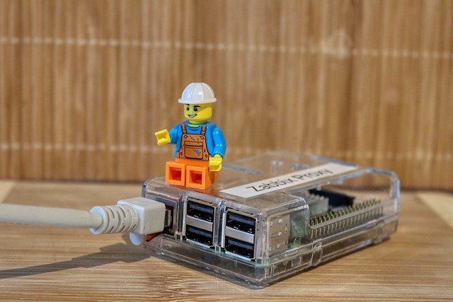

# Versionshinweise

## Oktober 2021 (Version 7.7)

### Ü;berblick

Willkommen zur **Ver&ouml;ffentlichung vom Oktober 2021** :octicons-heart-16: von **DietPi**. Es ist eine inkrementelle Version, die sich auf Verbesserungen an den Skripten und Softwarepaketen konzentriert und die Art und Weise verbessert, wie Sie **DietPi** verwenden.

{: width="320" height="427" loading="lazy"}

!!! zitiere "_Foto von planet_fox, Pixabay_"

### Verbesserungen {: #verbesserungen-77 }

**DietPi-Software**:

- [**DietPi-JustBoom**](../../dietpi_tools/#dietpi-justboom) :octicons-arrow-right-16: M&ouml;glichkeit hinzugefügt, eine Ausgabekanalanzahl zu erzwingen oder ein Audioformat nicht zu erzwingen -Wert, um das Eingabestreamformat beizubehalten, oder die Konvertierung ALSA überlassen, was jetzt die Standardeinstellung beim Zurücksetzen der Einstellungen ist. Ebenso kann der Audioausgabepuffer jetzt deaktiviert werden, um die MPD-Standardeinstellung beizubehalten. Wenn dies aus einem bestimmten Grund nicht erforderlich ist, wird im Allgemeinen empfohlen, den Audiostream nicht zu konvertieren und diese Einstellungen unverändert/standardmä&szlig;ig beizubehalten.

- [**Sintflut**](../../software/bittorrent/#sintflut):

    - Die Protokollierung erfolgt nicht mehr nach `/var/log/deluged/`, sondern stattdessen ins Journal, erreichbar über `journalctl -u deluged -u deluge-web`. Diese Änderung wirkt sich nur auf Neuinstallationen und Neuinstallationen von Deluge aus.
    - Bei Neuinstallationen ist die Webschnittstelle jetzt wie erwartet mit dem gewählten globalen Softwarepasswort zugänglich, das mit einem frischen zufälligen Salz gehasht gespeichert wird. Früher war das Passwort fest auf `dietpi` codiert.
    – Behebung eines Problems bei Bullseye, bei dem der Webschnittstellendienst nicht gestartet wurde, da ein neues Befehlszeilen-Flag `-d` erforderlich ist, um ihn im Vordergrund zu halten. Vielen Dank an @quyentruong für die Meldung dieses Problems: <https://github.com/MichaIng/DietPi/issues/4785>

- [**Kodi**](../../software/media/#kodi):

    - Auf Debian Bullseye, beginnend mit Kodi 19, ist die `GBM`-Unterstützung standardmä&szlig;ig vorhanden, was bedeutet, dass [**Kodi**](../../software/media/#kodi) ohne ein umschlie&szlig;endes X gestartet werden kann Server. Dies geschieht jetzt standardmä&szlig;ig beim Start von Kodi au&szlig;erhalb einer Desktop-Sitzung, einschlie&szlig;lich der Option dietpi-autostart. Das bedeutet auch, dass ein X-Server nicht mehr als Abhängigkeit von Kodi installiert wird, sondern nur noch als Abhängigkeit einer Desktop-Umgebung.
    - Es kann jetzt auf allen Geräten installiert werden. In einigen Fällen kann die Videowiedergabeleistung schlecht sein, abhängig von der GPU, ob gute Treiber verfügbar sind und natürlich von der Videoqualität. Es sollten jedoch unsere Benutzer anstelle von uns sein, die beurteilen, ob es ausreichend ist oder nicht. Mit Debian Bullseye, neuen Mesa-Treibern und Kodi 19, gestartet über `GBM`, sollte die Leistung viel besser sein als bei älteren Debian-/Paketversionen.
    – Es wurde ein Problem auf RPi ARMv8/64-Bit-Systemen behoben, bei dem Kodi nicht gestartet werden konnte, wenn es ohne Desktop installiert wurde. Vielen Dank an @Klola für die Meldung dieses Problems [im DietPi-Forum](https://dietpi.com/phpbb/viewtopic.php?p=38079#p38079).

- [Dateibrowser](../../software/cloud/#file-browser) :octicons-arrow-right-16: Der Standard-Netzwerkport wurde auf `8084` geändert, um einen Konflikt mit [HTPC Manager] zu l&ouml;sen (../../software/bittorrent/#htpc-manager). Dies betrifft nur **neue** [Dateibrowser](../../software/cloud/#file-browser)-Installationen. Vielen Dank an @KamikazeePL für die Meldung dieses Problems [im DietPi-Forum](https://dietpi.com/phpbb/viewtopic.php?t=9507).

**Netzwerk- und Druckschnittstelle**:

- **Allgemein** :octicons-arrow-right-16: Das Skript `/boot/dietpi/func/obtain_network_details` wurde entfernt, einschlie&szlig;lich der zugeh&ouml;rigen Datei `/run/dietpi/.network`, um Netzwerkdetails abzurufen. Alle Verwendungen dieser Dateien wurden durch die neue Funktion `G_GET_NET` von DietPi-Globals ersetzt (siehe unten).
- **DietPi-Globals** :octicons-arrow-right-16: Eine neue globale Funktion `G_GET_NET` wurde hinzugefügt, um Netzwerkschnittstellendetails zu drucken. Am wichtigsten ist, dass es Informationen für die Hauptschnittstelle ausgibt, indem es den Prioritäten von `/boot/dietpi/func/obtain_network_details folgt: Standard-Gateway => Status UP => IP zugewiesen`, aber es erlaubt zusätzlich nach IP-Familie, Typ, Schnittstellenname zu filtern oder drucken Sie das Standard-Gateway explizit aus. Es soll ein Ersatz für `/boot/dietpi/func/obtain_network_details` mit mehr Flexibilität sein und es erm&ouml;glichen, immer aktuelle Schnittstelleninformationen abzuleiten, anstatt von der Korrektheit einer Cache-Datei abhängig zu sein.
- DietPi-Globals | `G_GET_WAN_IP` :octicons-arrow-right-16: Wir verwenden jetzt unseren eigenen GEO-IP-Dienst, um die WAN-IP und den Standort des Systems im DietPi-Banner und DietPi-VPN anzuzeigen. Bei der Verwendung von Pi-hole wurde mit einem früheren Update `freegeoip.app` zur Whitelist von Pi-hole hinzugefügt, was jetzt nicht mehr erforderlich ist. Sie k&ouml;nnen diesen Eintrag daher von der Whitelist entfernen.
- DietPi-Boot :octicons-arrow-right-16: Dieses Skript und dieser Dienst wurden entfernt: Das Warten auf das Netzwerk erfolgt jetzt über `DietPi-PostBoot` `"After=network-online.target"`, die Zeitsynchronisierung erfolgt in `DietPi-PostBoot`, aber im Hintergrund (meistens nicht erforderlich für Dienststarts) und vorinstalliertes Image-Stage-Handling wird jetzt auch in PostBoot durchgeführt.
- DietPi-Update :octicons-arrow-right-16: Eine Ü;berprüfung der Netzwerkverbindung und der Zeitsynchronisierung wird jetzt durchgeführt, bevor nach Updates gesucht wird, ähnlich wie es die `DietPi-Software` bei Installationen tut.

**Zeitsynchronization**:

- Verwenden Sie dieselbe Flag-Datei, die `systemd-timesyncd` selbst seit Buster verwendet, um einen zusätzlichen Neustart des Dienstes zu überspringen und zu synchronisieren, wenn dies bereits geschehen ist.
- Wenn unsere Oneshot-Modi (nur booten, stündlich, täglich) ausgewählt sind, ist `systemd-timesyncd` jetzt "aktiviert", um von systemd früher beim Booten gestartet zu werden, anstatt bei unserem Skriptaufruf. Zumal beide jetzt die gleiche Flag-Datei teilen (auf Buster und h&ouml;her), hat dies eine Chance, einen zusätzlichen Neustart des Dienstes zu verhindern, wenn die Zeitsynchronisierung bereits beendet ist, wenn PostBoot erreicht ist.

**DietPi-Login**:

- Das DietPi-Banner beim Login wird nicht mehr angezeigt, wenn `~/.hushlogin` existiert, was eine gängige Methode ist, um zu verhindern, dass die Shell beim Login `/etc/motd` ausgibt, und sollte daher für das DietPi-Banner als respektiert werden Gut. Vielen Dank an @dnknth für diesen Vorschlag: <https://github.com/MichaIng/DietPi/issues/4786>

**Andere Änderungen**:

- **DietPi-Globals** :octicons-arrow-right-16: Die globalen Funktionen `G_DEV_1` und `G_DEV_BENCH` wurden entfernt, die nur zu Test- und Entwicklungszwecken existierten, aber in unseren aktuellen Arbeitsabläufen nicht verwendet werden.

### Fehlerbehebungen {: #bug-fixes-77 }

**DietPi-Software-Korrekturen**:

- [DietPi-Software | **DietPi-JustBoom**](../../dietpi_tools/#dietpi-justboom) :octicons-arrow-right-16: Es wurde ein Problem behoben, bei dem das Anwenden einiger MPD-Einstellungen nicht funktionierte. Vielen Dank an @elevader für die Meldung dieses Problems [im DietPi-Forum](https://dietpi.com/phpbb/viewtopic.php?t=9426).
- **DietPi-Software** :octicons-arrow-right-16: Behebung eines Problems, bei dem Softwaredienste mit einer kryptischen Fehlermeldung fehlschlugen, wenn ein erwartetes Verzeichnis nicht vorhanden war. Dies wurde insbesondere bei [Sonarr](../../software/bittorrent/#sonarr) und [Radarr](../../software/bittorrent/#radarr) gemeldet, wenn deren Logverzeichnis aus irgendeinem Grund fehlte . Wenn Verzeichnisse fehlen, die innerhalb des systemd-Dienstes explizit als schreib- und lesbar aufgeführt sind, gibt systemd `Failed at step NAMESPACE spawning` aus, während [Sonarr](../../software/bittorrent/#sonarr) und [Radarr ](../../software/bittorrent/#radarr) selbst würde eine deutlichere Fehlermeldung über das fehlende Protokollverzeichnis ausgeben. Vielen Dank an @stevewitz für die Meldung dieses Problems [im DietPi-Forum](https://dietpi.com/phpbb/viewtopic.php?t=9463).
- [DietPi-Software | **Lighttpd**](../../software/webserver_stack/#lighttpd) :octicons-arrow-right-16: Es wurde ein Problem behoben, bei dem das Upgrade von Buster auf Bullseye gemä&szlig; unserer Anleitung fehlschlägt, wenn HTTPS über aktiviert wurde DietPi-LetsEncrypt vor. Vielen Dank an @fhals für die Meldung dieses Problems [im DietPi-Forum](https://dietpi.com/phpbb/viewtopic.php?t=9477).
- [DietPi-Software | **Home Assistant**](../../software/home_automation/#home-assistant) :octicons-arrow-right-16: Die mit Home Assistant kompilierte Python-Version wurde auf v3.9.7 angehoben, wodurch und behoben werden Problem mit Installationen auf 32-Bit-ARM-Systemen. Vielen Dank an @Przemek für die Meldung dieses Problems: [MichaIng/DietPi#4372](https://github.com/MichaIng/DietPi/issues/4372#issuecomment-936656595)
- [DietPi-Software | **Home Assistant**](../../software/home_automation/#home-assistant) :octicons-arrow-right-16: Es wurde ein Problem behoben, bei dem Home Assistant aufgrund neu erforderlicher Laufzeitbibliotheken auf ARM-Systemen nicht gestartet wurde .
- [DietPi-Software | **Chromium**](../../software/desktop/#chromium) :octicons-arrow-right-16: Es wurde ein Problem behoben, bei dem die Autostart-Option nicht funktionierte, wenn Chromium ohne Desktop installiert wurde. Vielen Dank an @jowelboy für die Meldung dieses Problems [im DietPi-Forum](https://dietpi.com/phpbb/viewtopic.php?t=9531).
- [DietPi-Software | **Chromium**](../../software/desktop/#chromium) :octicons-arrow-right-16: Behebung eines Problems auf RPi, bei dem das Starten von Chromium aufgrund einer fehlenden Abhängigkeit fehlschlug, wenn kein Desktop installiert war. Vielen Dank an @Loader23 für die Meldung dieses Problems: <https://github.com/MichaIng/DietPi/issues/4782>
- DietPi-Software | X.Org X Server :octicons-arrow-right-16: Es wurde ein Problem mit Odroid N2- und C4-Modellen behoben, bei dem die Installation aufgrund eines Tippfehlers fehlschlug. Vielen Dank an @wiml für die Meldung dieses Problems: <https://github.com/MichaIng/DietPi/issues/4830>
- [DietPi-Software | **Airsonic**](../../software/media/#airsonic) :octicons-arrow-right-16: Da das Projekt archiviert wurde und Java 17 nicht unterstützt, wurde es auf Bullseye deaktiviert. Wir beobachten einen Fork (<https://github.com/airsonic-advanced/airsonic-advanced>), der aktiv entwickelt wird und bei dem zumindest das Webinterface mit Java 17 funktioniert. Das Abspielen von Audio schlug jedoch bei lokalen Tests fehl, daher Wir werden warten, bis es stabiler wird, um ein Drop-in-Ersatz für Airsonic im Allgemeinen zu sein und auch auf Bullseye mit Java 17 unterstützt zu werden. Vielen Dank an @Andaloup für die Meldung dieses Problems: <https://github.com/MichaIng/DietPi/issues/4847>
- [DietPi-Software | **FreshRSS**](../../software/social/#freshrss) :octicons-arrow-right-16: Es wurde ein Problem behoben, bei dem verschachtelte /opt/FreshRSS/FreshRSS-master und /opt/FreshRSS/ neu installiert wurden. p/p wurden erstellt. Da FreshRSS über einen internen Updater verfügt, werden Neuinstallationen die neue Version nicht herunterladen und installieren, solange /opt/FreshRSS bereits vorhanden ist. Das verschachtelte Verzeichnis und der Link werden beim nächsten DietPi-Update entfernt, sofern vorhanden. Vielen Dank an @kinoushe für die Meldung dieses Problems: <https://github.com/MichaIng/DietPi/issues/4775>

**Allgemeine DietPi- und Konfigurationstools**:

- **Allgemein** :octicons-arrow-right-16: Da der Armbian-Repository-Router HTTPS bei Umleitungen noch nicht zuverlässig beibehält, schlägt APT manchmal fehl, wenn ein Downgrade von HTTPS auf HTTP erkannt wird. Wir ändern daher die `armbian.list`, um einfaches HTTP zu verwenden, bis die Probleme mit dem Router behoben sind.
- **Allgemein** :octicons-arrow-right-16: Umgehung eines Problems auf Debian Stretch, bei dem `systemctl enable/disable --now` den Dienst unter bestimmten Umständen nicht startet/stoppt. Dies wird in unserem Fehlerhandler `G_EXEC` behoben, daher k&ouml;nnen Sie beim manuellen Aufruf von `systemctl` immer noch damit konfrontiert werden: <https://github.com/MichaIng/DietPi/issues/4815>
- **Allgemein** :octicons-arrow-right-16: Es wurde eine Problemumgehung auf Bullseye-Systemen mit älteren Linux-Versionen (v4.14 und darunter) angewendet, die die neue einheitliche `cgroup-Hierarchie` (auch bekannt als `cgroups-v2 `). Da das neuere systemd versucht, es automatisch zu verwenden, scheitern Docker und ähnliche Software, die `cgroups` verwenden. Bei Geräten mit bekannter Boot-Konfigurationsdatei werden die Kernel-Befehlszeilenargumente angewendet, um die Verwendung der alten `cgroups`-Hierarchie zu erzwingen.
- [**DietPi-Backup**](../../dietpi_tools/#dietpi-backup-backuprestore) :octicons-arrow-right-16: Es wurde ein Problem behoben, bei dem das L&ouml;schen des PATH-Cache über den Befehl `hash` nicht funktionierte funktionieren ab einem falschen Kommandozeilenargument: <https://github.com/MichaIng/DietPi/issues/4800>
- [DietPi-LetsEncrypt](../../dietpi_tools/#dietpi-letsencrypt) :octicons-arrow-right-16: Es wurde ein Problem behoben, bei dem das Skript fehlschlug, wenn [ownCloud](../../software/cloud /#owncloud) oder [Nextcloud](../../software/cloud/#nextcloud) installiert wurden. Vielen Dank an @billouetaudrey für die Meldung dieses Problems: <https://github.com/MichaIng/DietPi/issues/4752>
- [**DietPi-Config**](../../dietpi_tools/#dietpi-configuration) :octicons-arrow-right-16: Es wurde ein Problem behoben, bei dem der WiFi-Verbindungsstatus fälschlicherweise als versehentlich das Ethernet erhalten werden konnte Schnittstellenindex wurde verwendet, um es abzuleiten.
- [**DietPi-Config**](../../dietpi_tools/#dietpi-configuration) :octicons-arrow-right-16: Behebung eines Problems auf [NanoPi NEO](../../hardware/ #nanopi-series-friendlyarm) (und wahrscheinlich andere Allwinner H3 SBCs), wo die Auswahl einer Soundkarte fehlschlug, da versucht wurde, eine ungültige Steuerung einzustellen. Vielen Dank an @VS-X für die Meldung dieses Problems: <https://github.com/MichaIng/DietPi/issues/4833>

Wie immer wurden viele kleinere Codeleistungs- und Stabilitätsverbesserungen sowie visuelle und Rechtschreibkorrekturen vorgenommen, zu viel, um sie alle hier aufzulisten. Sehen Sie sich alle Codeänderungen dieser Version auf GitHub an: <https://github.com/MichaIng/DietPi/pull/4840>.

### Entfernte Software {: #removed-software-77 }

- **CouchPotato** :octicons-arrow-right-16: Leider wird das CouchPotato-Projekt nicht mehr gepflegt und wurde aufgegeben. Infolgedessen mussten wir es von DietPi entfernen. Die auf Ihrem System installierte Instanz bleibt erhalten, wird aber nicht mehr über die DietPi-Konfigurationstools verwaltet (sie kann nicht mehr installiert, neu installiert oder deinstalliert werden). Wir empfehlen, auf ein alternatives Projekt zu migrieren, wie [**Radarr**](../../software/bittorrent/#radarr), das in **DietPi-Software** gut zu finden ist. Bitte finden Sie [hier](https://github.com/MichaIng/DietPi/issues/4323#issuecomment-927128724) Deinstallationsanweisungen für eine manuelle Entfernung von CouchPotato.
