# BitTorrent / Download-Tools

## &Uuml;berblick

- [**Transmission - Lightweight BitTorrent-Server mit Webinterface**](#transmission)
- [**Deluge - Alternativer BitTorrent-Server mit Webinterface**](#deluge)
- [**qBittorrent - Leichter und schneller (C++) BitTorrent-Server mit Webinterface**](#qbittorrent)
- [**rTorrent - BitTorrent-Server mit ruTorrent-Weboberfl&auml;che**](#rtorrent)
- [**Aria2 - Downloadmanager mit Webinterface**](#aria2)
- [**SABnzbd - NZB-Download-Manager mit Weboberfl&auml;che**](#sabnzbd)
- [**Medusa - Fernsehsendungen automatisch herunterladen**](#medusa)
- [**Sonarr - Fernsehsendungen automatisch herunterladen**](#sonarr)
- [**Radarr - Filme automatisch herunterladen**](#radarr)
- [**Bazarr - Untertitel f&uuml;r Sonarr/Radarr automatisch herunterladen**](#bazarr)
- [**Lidarr - Musik automatisch herunterladen**](#lidarr)
- [**Jackett - API-Unterst&uuml;tzung f&uuml;r Ihre bevorzugten Torrent-Tracker**](#jackett)
- [**NZBGet - NZB-Download-Manager mit Weboberfl&auml;che**](#nzbget)
- [**HTPC Manager - kombiniert all Ihre Lieblingssoftware in einer eleganten Oberfl&auml;che**](#htpc-manager)
- [**youtube-dl - Videos von YouTube und anderen Seiten herunterladen**](#youtube-dl)

??? Information "Wie f&uuml;hre ich **DietPi-Software** aus und installiere **optimierte Software**-Elemente?"
    Um eines der unten aufgef&uuml;hrten **DietPi-optimierten Softwareelemente** zu installieren, f&uuml;hren Sie es &uuml;ber die Befehlszeile aus:

    ```sh
    dietpi-software
    ```

    W&auml;hlen Sie **Software durchsuchen** und w&auml;hlen Sie einen oder mehrere Artikel aus. W&auml;hlen Sie abschlie&szlig;end `Installieren`.
    DietPi f&uuml;hrt alle notwendigen Schritte aus, um diese Softwareelemente zu installieren und zu starten.

    {: width="643" height="365" loading="lazy"}

    Um alle DietPi-Konfigurationsoptionen anzuzeigen, lesen Sie den Abschnitt [DietPi Tools](../../dietpi_tools/).

[Zur&uuml;ck zur **Liste der optimierten Software**](../../software/)

## &Uuml;bertragung

Transmission, die leichtgewichtige Webschnittstelle des BitTorrent-Servers, mit der Sie BitTorrent-Dateien herunterladen k&ouml;nnen.

!!! Hinweis "dedizierte USB-Festplatte dringend empfohlen"

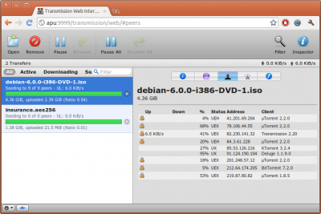{: width="500" height="334" loading="lazy"}

=== "Zugriff auf die Weboberfl&auml;che"

    Das Webinterface ist &uuml;ber Port **9091** erreichbar:

    - URL = `http://<Ihre.IP>:9091`
    - Benutzername = `root`
    - Passwort = `<Ihr globales Passwort>`

=== "Auf Downloads zugreifen"

    Stellen Sie sicher, dass Sie einen der [Dateiserver](../file_servers/) von DietPi installiert haben.
    Von Transmission verwendete Ordner:

    - Ordner, auf den &uuml;ber den Dateiserver zugegriffen wird = `downloads`
    - lokaler Ordner = `/mnt/dietpi_userdata/downloads`

=== "Probleme mit geschlossenen Ports"

    DietPi richtet Transmission ein, um die Portweiterleitung auf dem Router zu verwenden.
    In seltenen F&auml;llen funktioniert dies bei einigen Routern nicht und Sie m&uuml;ssen die Portweiterleitung manuell einrichten:

    - Verwenden Sie TCP+UDP mit dem standardm&auml;&szlig;igen DietPi-&Uuml;bertragungsport von **51413**.
    - Richten Sie diesen Port auf die IP-Adresse Ihres DietPi-Systems.

    Sobald die Portweiterleitung eingerichtet ist, f&uuml;hren Sie einfach die folgenden Schritte aus, um die &Uuml;bertragung zu aktualisieren:

    - Laden Sie das &Uuml;bertragungs-Webinterface hoch
    - Klicken Sie auf die Schaltfl&auml;che "Einstellungen" (Schraubenschl&uuml;ssel unten links)
    - Klicken Sie auf die Registerkarte `Netzwerk`.
    - Wo steht "Use port forwarding on my router", deaktivieren Sie dieses K&auml;stchen.

    Schlie&szlig;en Sie einfach diesen Bildschirm und &ouml;ffnen Sie ihn erneut, um den Portstatus zu aktualisieren.

=== `Empfohlen: Sch&uuml;tzen Sie Ihre Privatsph&auml;re mit einem VPN`

    Obwohl wir die erzwungene Verschl&uuml;sselung auf allen unseren BitTorrent-Clients aktivieren, ist die Verwendung eines VPN entscheidend, wenn Sie vollst&auml;ndige Privatsph&auml;re und Sicherheit f&uuml;r alle Ihre heruntergeladenen Inhalte gew&auml;hrleisten m&ouml;chten. Wir empfehlen dringend [**NordVPN**](https://go.nordvpn.net/aff_c?offer_id=15&aff_id=5305&url_id=902), da es unbegrenzte Bandbreite, keine Protokollierung und bis zu 6 Ger&auml;te in einem einzigen Konto bietet. Es kann einfach mit unserem Tool [**DietPi-VPN**](../../dietpi_tools/#dietpi-vpn) eingerichtet werden.
    [{: width="300" height="65" loading="lazy"}](https://go.nordvpn.net/ aff_c?offer_id=15&aff_id=5305&url_id=902)

## Deluge

Deluge, der Webinterface-BitTorrent-Server, mit dem Sie BitTorrent-Dateien herunterladen k&ouml;nnen. Dieser Python-codierte BitTorrent-Server ist eine Alternative zur Option [Lightweight Transmission](#transmission-lightweight-bittorrent-server-with-web-interface).

!!! Hinweis "dedizierte USB-Festplatte dringend empfohlen"

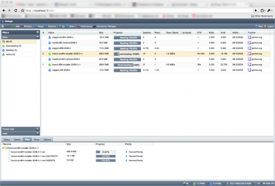{: width="500" height="338" loading="lazy"}

=== "Zugriff auf die Weboberfl&auml;che"

    Das Webinterface ist &uuml;ber Port **8112** erreichbar:

    - URL = `http://<Ihre.IP>:8112`
    - Passwort = `<Ihr globales Passwort>`

    W&auml;hlen Sie den Host 127.0.0.1 aus und klicken Sie auf `Verbinden`.

=== "Zugriff auf die Deluge-Konsole"

    ```sh
    sudo -u debian-deluged deluge-console
    ```

=== `Verbinden Sie sich mit Ihrem Desktop-Deluge-Client`

    - &Ouml;ffnen Sie den Deluge-Client auf Ihrem anderen System
    - W&auml;hlen Sie `Preferences` \> `Interface` und deaktivieren (deaktivieren) `Classic Mode`. Speichern Sie die &Auml;nderungen und starten Sie Deluge neu
    - Wenn der Verbindungsmanager erscheint, w&auml;hlen Sie `Hinzuf&uuml;gen`.
    - Geben Sie die folgenden Daten ein:
    - Hostname = IP-Adresse Ihres Ger&auml;ts (zB: 192.168.0.100)
    - Port = 58846
    - Benutzername = `root`
    - Passwort = `<Ihr globales Passwort>`
    - Einfach ausw&auml;hlen und mit dem neuen Eintrag verbinden

=== "Auf Downloads zugreifen"

    Stellen Sie sicher, dass Sie einen der [Dateiserver](../file_servers/) von DietPi installiert haben.
    Von Deluge verwendete Ordner:

    - Ordner, auf den &uuml;ber den Dateiserver zugegriffen wird = `downloads`
    - Lokaler Ordner = `/mnt/dietpi_userdata/downloads`

=== `Empfohlen: Sch&uuml;tzen Sie Ihre Privatsph&auml;re mit einem VPN`

    Obwohl wir die erzwungene Verschl&uuml;sselung auf allen unseren BitTorrent-Clients aktivieren, ist die Verwendung eines VPN entscheidend, wenn Sie vollst&auml;ndige Privatsph&auml;re und Sicherheit f&uuml;r alle Ihre heruntergeladenen Inhalte gew&auml;hrleisten m&ouml;chten. Wir empfehlen dringend [**NordVPN**](https://go.nordvpn.net/aff_c?offer_id=15&aff_id=5305&url_id=902), da es unbegrenzte Bandbreite, keine Protokollierung und bis zu 6 Ger&auml;te in einem einzigen Konto bietet. Es kann einfach mit unserem Tool [**DietPi-VPN**](../../dietpi_tools/#dietpi-vpn) eingerichtet werden.
    [{: width="300" height="65" loading="lazy"}](https://go.nordvpn.net/ aff_c?offer_id=15&aff_id=5305&url_id=902)

## qBittorrent

qBittorrent ist ein leichtgewichtiger BitTorrent-Server mit einer eleganten Weboberfl&auml;che. Da es in C++ (Qt) codiert ist, bietet es eine hervorragende Leistung auf jedem Ger&auml;t.

!!! Notiz "dedizierte USB-Festplatte dringend empfohlen"

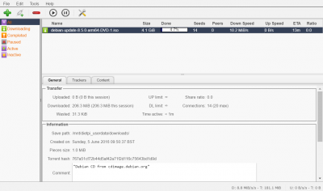{: width="400" height="236" loading="lazy"}

=== "Zugriff auf die Weboberfl&auml;che"

    Das Webinterface ist &uuml;ber Port **1340** erreichbar:

    - URL = `http://<Ihre.IP>:1340`
    - Benutzername = `qbittorrent`
    - Passwort = `<Ihr globales Passwort>` (Standard: `dietpi`)
        Anmerkung: Seit qBittorrent v4.2.0 (Debian Bullseye) wird ein neuer sicherer Hash-Algorithmus verwendet, den wir derzeit nicht mit g&auml;ngigen Shell-Tools dynamisch f&uuml;r das globale Software-Passwort replizieren k&ouml;nnen. Bis dahin lautet das Passwort f&uuml;r Ihren ersten Login `dietpi`. Bitte &auml;ndern Sie es direkt nach dem ersten Login: <https://github.com/MichaIng/DietPi/issues/5078>

=== "Auf Downloads zugreifen"

    Stellen Sie sicher, dass Sie einen der [Dateiserver](../file_servers/) von DietPi installiert haben.
    Von qBittorrent verwendete Ordner:

    - Ordner, auf den &uuml;ber den Dateiserver zugegriffen wird = `downloads`
    - Lokaler Ordner = `/mnt/dietpi_userdata/downloads`

=== "Verwendung von Such-Plugins"

    Bevor Sie Such-Plugins in qBittorrent aktivieren, m&uuml;ssen Sie zuerst Python installieren. Anschlie&szlig;end k&ouml;nnen Sie die Plugins suchen und aktivieren.

=== `Empfohlen: Sch&uuml;tzen Sie Ihre Privatsph&auml;re mit einem VPN`

    Obwohl wir die erzwungene Verschl&uuml;sselung auf allen unseren BitTorrent-Clients aktivieren, ist die Verwendung eines VPN entscheidend, wenn Sie vollst&auml;ndige Privatsph&auml;re und Sicherheit f&uuml;r alle Ihre heruntergeladenen Inhalte gew&auml;hrleisten m&ouml;chten. Wir empfehlen dringend [**NordVPN**](https://go.nordvpn.net/aff_c?offer_id=15&aff_id=5305&url_id=902), da es unbegrenzte Bandbreite, keine Protokollierung und bis zu 6 Ger&auml;te in einem einzigen Konto bietet. Es kann einfach mit unserem Tool [**DietPi-VPN**](../../dietpi_tools/#dietpi-vpn) eingerichtet werden.
    [{: width="300" height="65" loading="lazy"}](https://go.nordvpn.net/ aff_c?offer_id=15&aff_id=5305&url_id=902)

## rTorrent

rTorrent ist ein BitTorrent-Server. ruTorrent wird ebenfalls installiert, um den Zugriff und die Kontrolle &uuml;ber die Webschnittstelle zu erm&ouml;glichen.

Installiert auch:

- Webserver

!!! Hinweis "dedizierte USB-Festplatte dringend empfohlen"

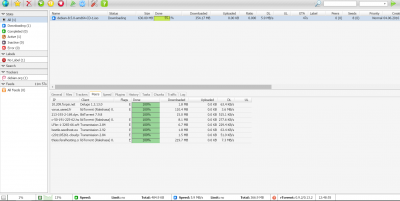{: width="400" height="201" loading="lazy"}

=== "Zugriff auf die Weboberfl&auml;che"

    - URL = `http://<your.IP>/rutorrent`
    - Benutzername = `root`
    - Passwort = `<Ihr globales Passwort>` (Standard: `dietpi`)

    Die Anmeldeinformationen k&ouml;nnen je nach Webserver-Wahl mit den folgenden Befehlen ge&auml;ndert werden:

    ```sh
    # mit Lighttpd (default):
    echo "username:rtorrent:$(echo -n 'username:rtorrent:password' | md5sum | mawk '{print $1}')" > /etc/.rutorrent-htaccess

    # mit Apache:
    htpasswd -c /etc/.rutorrent-htaccess

    # mit Nginx:
    echo "username:$(openssl passwd -apr1 'password')" > /etc/.rutorrent-htaccess
    ```

=== "Auf Downloads zugreifen"

    Stellen Sie sicher, dass Sie einen der [Dateiserver](../file_servers/) von DietPi installiert haben.
    Von rTorrent verwendete Ordner:

    - Ordner, auf den &uuml;ber den Dateiserver zugegriffen wird = `downloads`
    - Lokaler Ordner = `/mnt/dietpi_userdata/downloads`

    Wichtiger Hinweis:
    rTorrent erstellt eine Sperrdatei basierend auf dem Hostnamen des Systems. Wenn der Hostname ge&auml;ndert wird (z. B. &uuml;ber `dietpi-config` \> `Sicherheitsoptionen`), muss die alte Sperrdatei entfernt werden, damit rTorrent eine neue basierend auf dem neuen Hostnamen erstellen kann:

    ```sh
    rm /mnt/dietpi_userdata/downloads/.session/rtorrent.lock
    systemctl restart rtorrent
    ```

=== "Auf rTorrent RPC zugreifen"

    rTorrent lauscht standardm&auml;&szlig;ig auf dem UNIX-Domain-Socket unter `/mnt/dietpi_userdata/downloads/.session/rpc.socket`. Der Webserver ist so konfiguriert, dass er `http://<your.IP>/RPC2`-Aufrufe an den UNIX-Socket weiterleitet, aber f&uuml;r diese URL wird eine HTTP-Authentifizierung erzwungen.

=== `Empfohlen: Sch&uuml;tzen Sie Ihre Privatsph&auml;re mit einem VPN`

    Obwohl wir die erzwungene Verschl&uuml;sselung auf allen unseren BitTorrent-Clients aktivieren, ist die Verwendung eines VPN entscheidend, wenn Sie vollst&auml;ndige Privatsph&auml;re und Sicherheit f&uuml;r alle Ihre heruntergeladenen Inhalte gew&auml;hrleisten m&ouml;chten. Wir empfehlen dringend [**NordVPN**](https://go.nordvpn.net/aff_c?offer_id=15&aff_id=5305&url_id=902), da es unbegrenzte Bandbreite, keine Protokollierung und bis zu 6 Ger&auml;te in einem einzigen Konto bietet. Es kann einfach mit unserem Tool [**DietPi-VPN**](../../dietpi_tools/#dietpi-vpn) eingerichtet werden.
    [{: width="300" height="65" loading="lazy"}](https://go.nordvpn.net/ aff_c?offer_id=15&aff_id=5305&url_id=902)

=== "Protokolle anzeigen"

    F&uuml;hren Sie den folgenden Befehl aus, um rTorrent-Dienstprotokolle anzuzeigen:

    ```sh
    journalctl -u rtorrent
    ```

Probleme mit der Weboberfl&auml;che k&ouml;nnen &uuml;ber Webserver-Protokolle behoben werden:

    ```sh
    # mit Lighttpd (default):
    journalctl -u lighttpd
    more /var/log/lighttpd/error.log

    # mit Apache:
    journalctl -u apache2
    more /var/log/apache2/error.log

    # mit Nginx:
    journalctl -u nginx
    more /var/log/nginx/error.log
    ```

=== "Auf neueste Version aktualisieren"

    rTorrent selbst wird &uuml;ber APT installiert und kann daher durch Ausf&uuml;hren der folgenden Befehle aktualisiert werden:

    ```sh
    apt update
    apt install rtorrent
    ```

    Soll auch das ruTorrent-Webinterface aktualisiert werden, ist am einfachsten eine Neuinstallation:

    ```sh
    dietpi-software reinstall 107
    ```

***

Offizielle Website: <https://rakshasa.github.io/rtorrent/>
Offizielle Dokumentation: <https://github.com/rakshasa/rtorrent/wiki>
Wikipedia: <https://wikipedia.org/wiki/RTorrent>
Quellcode: <https://github.com/rakshasa/rtorrent>
Lizenz: [GPLv2](https://github.com/rakshasa/rtorrent/blob/master/COPYING)

ruTorrent-Dokumentation: <https://github.com/Novik/ruTorrent/wiki>
ruTorrent-Quellcode: <https://github.com/Novik/ruTorrent>
ruTorrent-Lizenz: [GPLv3](https://github.com/Novik/ruTorrent/blob/master/LICENSE.md)

## Arie2

Download-Manager mit einer eleganten Web-Benutzeroberfl&auml;che. Unterst&uuml;tzt auch BitTorrent-Downloads.

Installiert auch:

- Webserver

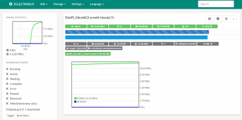{: width="400" height="199" loading="lazy"}

=== "Zugriff auf die Weboberfl&auml;che"

    - URL = `http://<your.IP>/aria2/docs`
    - rpc secret password = `<Ihr globales Passwort>`

    Dies muss an der folgenden Stelle in der Weboberfl&auml;che eingegeben werden:

    - `Einstellungen`.
    - `Verbindungseinstellungen`.
    - Geben Sie das geheime RPC-Passwort in das Feld "Geben Sie das geheime Token ein (optional):" ein und speichern Sie die &Auml;nderungen

=== "Auf Downloads zugreifen"

Stellen Sie sicher, dass Sie einen der [Dateiserver](../file_servers/) von DietPi installiert haben.
Von Aria2 verwendete Ordner:

    - Ordner, auf den &uuml;ber den Dateiserver zugegriffen wird = `downloads`
    - Lokaler Ordner = `/mnt/dietpi_userdata/downloads`

=== "Einstellungs&auml;nderungen dauerhaft vornehmen"

Bitte beachten Sie, dass das `aria2-webui` das Speichern von Einstellungen nach dem Beenden der Sitzung nicht unterst&uuml;tzt, dies ist eine bekannte Einschr&auml;nkung der Software, bitte verwenden Sie die Datei `aria2.conf`, um &Auml;nderungen vorzunehmen:

    - Stoppen Sie Dienste mit `systemctl stop aria2`
    - Bearbeiten Sie die folgende Konfigurationsdatei: `/mnt/dietpi_userdata/aria2/aria2.conf` und nehmen Sie die erforderlichen &Auml;nderungen vor.
    - Dienste mit `systemctl start aria2` starten

Vollst&auml;ndige Liste der `aria2.conf`-Einstellungen: <https://aria2.github.io/manual/en/html/aria2c.html>

=== `Empfohlen: Sch&uuml;tzen Sie Ihre Privatsph&auml;re mit einem VPN`

    Obwohl wir die erzwungene Verschl&uuml;sselung auf allen unseren BitTorrent-Clients aktivieren, ist die Verwendung eines VPN entscheidend, wenn Sie vollst&auml;ndige Privatsph&auml;re und Sicherheit f&uuml;r alle Ihre heruntergeladenen Inhalte gew&auml;hrleisten m&ouml;chten. Wir empfehlen dringend [**NordVPN**](https://go.nordvpn.net/aff_c?offer_id=15&aff_id=5305&url_id=902), da es unbegrenzte Bandbreite, keine Protokollierung und bis zu 6 Ger&auml;te in einem einzigen Konto bietet. Es kann einfach mit unserem Tool [**DietPi-VPN**](../../dietpi_tools/#dietpi-vpn) eingerichtet werden.
    [{: width="300" height="65" loading="lazy"}](https://go.nordvpn.net/ aff_c?offer_id=15&aff_id=5305&url_id=902)

## SABnzbd

NZB-Download-Manager mit Weboberfl&auml;che.

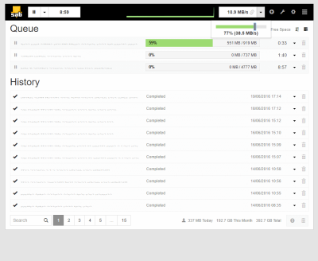{: width="400" height="328" loading="lazy"}

=== "Zugriff auf die Weboberfl&auml;che"

    Das Webinterface verwendet Port **8080**:

    - URL = `http://<your.IP>:8080/sabnzbd`

=== "Webinterface wird nicht geladen / Zugriff nicht m&ouml;glich"

    In einigen F&auml;llen ist die anf&auml;ngliche Konfigurationsgenerierung w&auml;hrend der Installation nicht erfolgreich.
    Wenn dies bei Ihnen auftritt, f&uuml;hren Sie bitte die folgenden Befehle aus, um die Konfigurationseinstellungen f&uuml;r DietPi erneut anzuwenden (kopieren und einf&uuml;gen).

    ```sh
    systemctl stop sabnzbd
    G_CONFIG_INJECT 'download_dir =' "download_dir = /mnt/dietpi_userdata/downloads/incomplete" /etc/sabnzbd/sabnzbd.ini
    G_CONFIG_INJECT 'complete_dir =' "complete_dir = /mnt/dietpi_userdata/downloads/complete" /etc/sabnzbd/sabnzbd.ini
    G_CONFIG_INJECT 'nzb_backup_dir =' "nzb_backup_dir = /mnt/dietpi_userdata/downloads/sabnzbd_nzb_backup" /etc/sabnzbd/sabnzbd.ini
    G_CONFIG_INJECT 'admin_dir =' "admin_dir = /mnt/dietpi_userdata/downloads/sabnzbd_admin" /etc/sabnzbd/sabnzbd.ini
    G_CONFIG_INJECT 'log_dir =' 'log_dir = /var/log/sabnzbd' /etc/sabnzbd/sabnzbd.ini
    G_CONFIG_INJECT 'log_level =' 'log_level = 0' /etc/sabnzbd/sabnzbd.ini
    G_CONFIG_INJECT 'refresh_rate =' 'refresh_rate = 2' /etc/sabnzbd/sabnzbd.ini
    G_CONFIG_INJECT 'host =' 'host = 0.0.0.0' /etc/sabnzbd/sabnzbd.ini
    G_CONFIG_INJECT 'permissions =' 'permissions = 0775' /etc/sabnzbd/sabnzbd.ini
    G_CONFIG_INJECT 'auto_browser =' 'auto_browser = 0' /etc/sabnzbd/sabnzbd.ini
    systemctl start sabnzbd
    ```

=== "Auf Downloads zugreifen"

    Stellen Sie sicher, dass Sie einen der [Dateiserver](../file_servers/) von DietPi installiert haben.
    Von SABnzbd verwendete Ordner:

    - Ordner, auf den &uuml;ber den Dateiserver zugegriffen wird = `downloads/complete`
    - lokaler Ordner = `/mnt/dietpi_userdata/downloads/complete`

=== "Optional: Multithreaded PAR2"

    Erfordert eine kompilierte Installation, siehe: <https://sabnzbd.org/wiki/installation/multicore-par2>

    Hinweis: Die Schritte erfordern einen Git-Client und Build-Tools (Build-Essentials). Sie k&ouml;nnen diesen Running Next-Befehl im Terminal installieren:

    ```sh
    dietpi-software install 16 17
    ```

=== `Empfohlen: Sch&uuml;tzen Sie Ihre Privatsph&auml;re mit einem VPN`

    Obwohl wir die erzwungene Verschl&uuml;sselung auf allen unseren BitTorrent-Clients aktivieren, ist die Verwendung eines VPN entscheidend, wenn Sie vollst&auml;ndige Privatsph&auml;re und Sicherheit f&uuml;r alle Ihre heruntergeladenen Inhalte gew&auml;hrleisten m&ouml;chten. Wir empfehlen dringend [**NordVPN**](https://go.nordvpn.net/aff_c?offer_id=15&aff_id=5305&url_id=902), da es unbegrenzte Bandbreite, keine Protokollierung und bis zu 6 Ger&auml;te in einem einzigen Konto bietet. Es kann einfach mit unserem Tool [**DietPi-VPN**](../../dietpi_tools/#dietpi-vpn) eingerichtet werden.
    [{: width="300" height="65" loading="lazy"}](https://go.nordvpn.net/ aff_c?offer_id=15&aff_id=5305&url_id=902)

## Medusa

Laden Sie Ihre Lieblingsfernsehsendungen automatisch herunter, sobald sie verf&uuml;gbar sind.
Durchsucht sowohl Bit Torrent als auch Usenet und verf&uuml;gt &uuml;ber eine Funktion zum automatischen Herunterladen und Organisieren des Downloads mit Ihrer bevorzugten Bit Torrent-App.

??? Notiz "Ein Download-Client ist erforderlich"

    &Uuml;bertragung BitTorrent-Server wird empfohlen, um automatische Downloads zu erm&ouml;glichen

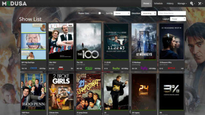{: width="400" height="225" loading="lazy"}

=== "Zugriff auf die Weboberfl&auml;che"

    Das Webinterface ist &uuml;ber Port **8081** erreichbar:

    - URL = `http://<Ihre.IP>:8081`

=== "TV-Sendung hinzuf&uuml;gen"

    Einmal bei Medusa registriert und eingeloggt:

    - Klicken Sie auf die Schaltfl&auml;che "Shows" (oben auf dem Bildschirm)
    - Klicken Sie auf die Option `Shows hinzuf&uuml;gen`.
    - W&auml;hlen Sie die Option `Neue Sendung hinzuf&uuml;gen`.
    - Geben Sie eine zu suchende TV-Sendung in das Suchfeld ein, w&auml;hlen Sie einen der Eintr&auml;ge aus den Suchergebnissen aus und klicken Sie dann auf `Weiter`.
    - Stellen Sie sicher, dass der &uuml;bergeordnete Ordner `/mnt/dietpi_userdata/downloads` ist, und klicken Sie dann auf `Weiter`.
    - Klicken Sie abschlie&szlig;end auf die Schaltfl&auml;che "Show hinzuf&uuml;gen".

=== "Optional: &Auml;ndern Sie, welche BitTorrent-Sites Medusa durchsuchen soll"

    - Klicken Sie auf die `Einstellungen`-Schaltfl&auml;che `Zahnrad` (in der oberen rechten Ecke des Bildschirms).
    - W&auml;hlen Sie `Anbieter suchen`.
    - W&auml;hlen und aktivieren Sie die BitTorrent-Sites, die Sie aktivieren m&ouml;chten. Wenn Medusa nach einer TV-Sendung sucht, werden diese Seiten nach dem verf&uuml;gbaren Torrent durchsucht.
    - Klicken Sie abschlie&szlig;end auf `&Auml;nderungen speichern` (unten auf der Seite)

=== "Medusa so einrichten, dass Torrents automatisch heruntergeladen werden"

    Um diese Funktion nutzen zu k&ouml;nnen, muss ein unterst&uuml;tzter BitTorrent-Server installiert sein. Alle in `dietpi-software` verf&uuml;gbaren BitTorrent-Server werden von Medusa unterst&uuml;tzt.

    - Klicken Sie auf die `Einstellungen`-Schaltfl&auml;che `Zahnrad` (in der oberen rechten Ecke des Bildschirms).
    - W&auml;hlen Sie `Sucheinstellungen`.
    - W&auml;hlen Sie die Registerkarte `Torrent-Suche`.
    - Stellen Sie sicher, dass der Eintrag Torrent-Suchanbieter aktivieren aktiviert ist (H&auml;kchen gesetzt)
    - W&auml;hlen Sie unter dem Abschnitt `Torrent-Dateien senden an` das BitTorrent-Programm aus, das Sie installiert haben, und geben Sie dann die Details ein.
    - Verwenden Sie die Schaltfl&auml;che `Verbindung testen` unten auf der Seite, um sicherzustellen, dass Medusa eine Verbindung zu Ihrem BitTorrent-Server herstellen kann.
    - Klicken Sie abschlie&szlig;end auf `&Auml;nderungen speichern` (unten auf der Seite)

=== `Empfohlen: Sch&uuml;tzen Sie Ihre Privatsph&auml;re mit einem VPN`

    Obwohl wir die erzwungene Verschl&uuml;sselung auf allen unseren BitTorrent-Clients aktivieren, ist die Verwendung eines VPN entscheidend, wenn Sie vollst&auml;ndige Privatsph&auml;re und Sicherheit f&uuml;r alle Ihre heruntergeladenen Inhalte gew&auml;hrleisten m&ouml;chten. Wir empfehlen dringend [**NordVPN**](https://go.nordvpn.net/aff_c?offer_id=15&aff_id=5305&url_id=902), da es unbegrenzte Bandbreite, keine Protokollierung und bis zu 6 Ger&auml;te in einem einzigen Konto bietet. Es kann einfach mit unserem Tool [**DietPi-VPN**](../../dietpi_tools/#dietpi-vpn) eingerichtet werden.
    [{: width="300" height="65" loading="lazy"}](https://go.nordvpn.net/ aff_c?offer_id=15&aff_id=5305&url_id=902)

## Sonarr

Laden Sie Ihre Lieblingsfernsehsendungen automatisch herunter, sobald sie verf&uuml;gbar sind.

??? Notiz "Ein Download-Client ist erforderlich"

    &Uuml;bertragung BitTorrent-Server wird empfohlen, um automatische Downloads zu erm&ouml;glichen

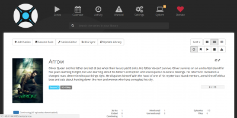{: width="400" height="200" loading="lazy"}

=== "Zugriff auf die Weboberfl&auml;che"

    Das Webinterface ist &uuml;ber Port **8989** erreichbar:

    - URL = `http://<Ihre.IP>:8989`

=== "Erste Ausf&uuml;hrung einrichten"

    Bevor Sie TV-Sendungen hinzuf&uuml;gen k&ouml;nnen, m&uuml;ssen Sie auf der Weboberfl&auml;che einen Suchindexer ausw&auml;hlen, der verwendet werden soll:

    - Gehen Sie einfach zu `Einstellungen` \> `Indexer` und w&auml;hlen Sie dann mindestens einen Indexer aus.

    Richten Sie Ihren Download-Client ein:

    - Gehen Sie einfach zu `Einstellungen` \> `Download-Client`, w&auml;hlen Sie Ihren installierten Download-Client aus und geben Sie [erforderliche Anmeldeinformationen](#transmission-lightweight-bittorrent-server-with-web-interface) ein.

    Maske zum Erstellen von Setup-Dateien:
    Wenn Sie Schreibzugriff von anderen Anwendungen ben&ouml;tigen (z. B. Plex-Untertitel-Downloads), m&uuml;ssen Sie auch die Datei-/Ordner-Erstellungsmaske so einstellen, dass dies zul&auml;ssig ist.

    - W&auml;hlen Sie in der Sonarr-Weboberfl&auml;che `Einstellungen`.
    - Wechseln Sie zum Schieberegler "Erweiterte Einstellungen" (aktivieren)
    - Scrollen Sie auf der Registerkarte "Medienverwaltung" zum Ende der Seite, stellen Sie unter "Berechtigungen" die folgenden Werte ein:

    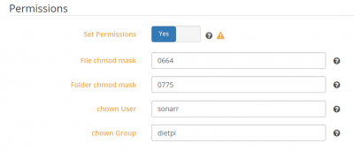{: width="400" height="171" loading="lazy"}

    - &Auml;nderungen speichern

=== "TV-Sendung hinzuf&uuml;gen"

    - W&auml;hlen Sie einfach "Serien" \> "TV-Sendung hinzuf&uuml;gen".
    - Geben Sie einen Namen der Show ein, die Sie finden m&ouml;chten
    - Einmal gefunden, verwenden Sie unter Pfad den folgenden Speicherort `/mnt/dietpi_userdata/downloads`
    - &Auml;ndern Sie bei Bedarf weitere Optionen (z. B. Videoqualit&auml;t) und w&auml;hlen Sie dann `+`.

=== "Benutzerdefinierte Download-/Medienverzeichnisse verwenden"

    Standardm&auml;&szlig;ig hat Sonarr strenge Berechtigungen, um nur auf Download- und Medienverzeichnisse in `/mnt/` zuzugreifen. Wenn Sie einen anderen Standort verwenden m&uuml;ssen, gehen Sie bitte wie folgt vor:

    1. F&uuml;hren Sie `dietpi-services` von der Konsole aus
    2. W&auml;hlen Sie `sonarr` aus
    3. W&auml;hlen Sie `Bearbeiten`.
    4. Kommentieren Sie die Zeile aus (entfernen Sie das f&uuml;hrende `#`), beginnend mit `ReadWritePaths=`
    5. F&uuml;gen Sie Ihren benutzerdefinierten Pfad am Ende dieser Zeile hinzu, getrennt durch ein Leerzeichen
    6. Dr&uuml;cken Sie die Tasten ++ctrl+o++ zum Speichern und ++ctrl+x++ zum Beenden

=== "Datenbanken mit RAM verkn&uuml;pfen"

    Verkn&uuml;pfen Sie die Sonarr-Info-/Einstellungsdatenbank mit dem RAM, um die Zugriffsleistung zu erh&ouml;hen, die Festplatten-E/A zu reduzieren und das st&auml;ndige Drehen externer Festplatten aufgrund des sehr regelm&auml;&szlig;igen Zugriffs auf diese Dateien zu vermeiden: <https://dietpi.com/phpbb/viewtopic.php? t=5828>

=== `Empfohlen: Sch&uuml;tzen Sie Ihre Privatsph&auml;re mit einem VPN`

    Obwohl wir die erzwungene Verschl&uuml;sselung auf allen unseren BitTorrent-Clients aktivieren, ist die Verwendung eines VPN entscheidend, wenn Sie vollst&auml;ndige Privatsph&auml;re und Sicherheit f&uuml;r alle Ihre heruntergeladenen Inhalte gew&auml;hrleisten m&ouml;chten. Wir empfehlen dringend [**NordVPN**](https://go.nordvpn.net/aff_c?offer_id=15&aff_id=5305&url_id=902), da es unbegrenzte Bandbreite, keine Protokollierung und bis zu 6 Ger&auml;te in einem einzigen Konto bietet. Es kann einfach mit unserem Tool [**DietPi-VPN**](../../dietpi_tools/#dietpi-vpn) eingerichtet werden.
    [{: width="300" height="65" loading="lazy"}](https://go.nordvpn.net/ aff_c?offer_id=15&aff_id=5305&url_id=902)

***

YouTube-Video-Tutorial: *Installieren und Konfigurieren von Sonarr auf Raspberry Pi mit DietPi*.

<iframe src="https://www.youtube-nocookie.com/embed/3h0GvdKcR0Y?rel=0" frameborder="0" allow="fullscreen" width="560" height="315" loading="lazy" ></iframe>

## Radar

Laden Sie Ihre Lieblingsfilme automatisch herunter, sobald sie verf&uuml;gbar sind.

??? Notiz "Ein Download-Client ist erforderlich"

    &Uuml;bertragung BitTorrent-Server wird empfohlen, um automatische Downloads zu erm&ouml;glichen

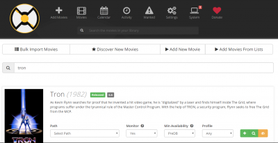{: width="400" height="207" loading="lazy"}

=== "Zugriff auf die Weboberfl&auml;che"

    Das Webinterface ist &uuml;ber Port **7878** erreichbar:

    - URL = `http://<Ihre.IP>:7878`

=== "Erste Ausf&uuml;hrung einrichten"

    Bevor Sie Filme hinzuf&uuml;gen k&ouml;nnen, m&uuml;ssen Sie auf der Weboberfl&auml;che einen Suchindexer ausw&auml;hlen, der verwendet werden soll:

    - Gehen Sie einfach zu `Einstellungen` \> `Indexer` und w&auml;hlen Sie dann mindestens einen Indexer aus.

    Richten Sie Ihren Download-Client ein:

    - Gehen Sie einfach zu `Einstellungen` \> `Download-Client`, w&auml;hlen Sie Ihren installierten Download-Client aus und geben Sie [erforderliche Anmeldeinformationen](#transmission-lightweight-bittorrent-server-with-web-interface) ein.

    Maske zum Erstellen von Setup-Dateien:
    Wenn Sie Schreibzugriff von anderen Anwendungen ben&ouml;tigen (z. B. Plex-Untertitel-Downloads), m&uuml;ssen Sie auch die Datei-/Ordner-Erstellungsmaske so einstellen, dass dies zul&auml;ssig ist.

    - W&auml;hlen Sie in der Sonarr-Weboberfl&auml;che `Einstellungen`.
    - Wechseln Sie zum Schieberegler "Erweiterte Einstellungen" (aktivieren)
    - Scrollen Sie auf der Registerkarte "Medienverwaltung" zum Ende der Seite, stellen Sie unter "Berechtigungen" die folgenden Werte ein:

{: width="400" height="171" loading="lazy"}

    - &Auml;nderungen speichern

=== "Film hinzuf&uuml;gen"

    - W&auml;hlen Sie einfach "Filme hinzuf&uuml;gen".
    - Geben Sie einen Namen des Films ein, den Sie finden m&ouml;chten
    - Einmal gefunden, verwenden Sie unter `Pfad` den folgenden Speicherort `/mnt/dietpi_userdata/downloads`.
    - &Auml;ndern Sie bei Bedarf weitere Optionen (z. B. Videoqualit&auml;t) und w&auml;hlen Sie dann `+`.

=== "Benutzerdefinierte Download-/Medienverzeichnisse verwenden"

    Standardm&auml;&szlig;ig hat Radarr strenge Berechtigungen, um nur auf Download- und Medienverzeichnisse in `/mnt/` zuzugreifen. Wenn Sie einen anderen Standort verwenden m&uuml;ssen, gehen Sie bitte wie folgt vor:

    1. F&uuml;hren Sie `dietpi-services` von der Konsole aus
    2. W&auml;hlen Sie `Radar` aus
    3. W&auml;hlen Sie `Bearbeiten`.
    4. Kommentieren Sie die Zeile aus (entfernen Sie das f&uuml;hrende `#`), beginnend mit `ReadWritePaths=`
    5. F&uuml;gen Sie Ihren benutzerdefinierten Pfad am Ende dieser Zeile hinzu, getrennt durch ein Leerzeichen
    6. Dr&uuml;cken Sie die Tasten ++ctrl+o++ zum Speichern und ++ctrl+x++ zum Beenden

=== "Datenbanken mit RAM verkn&uuml;pfen"

    Verkn&uuml;pfen Sie die Info-/Einstellungsdatenbank von Radarr mit dem RAM, um die Zugriffsleistung zu erh&ouml;hen, die Festplatten-E/A zu reduzieren und das st&auml;ndige Drehen externer Festplatten aufgrund des sehr regelm&auml;&szlig;igen Zugriffs auf diese Dateien zu vermeiden: <https://dietpi.com/phpbb/viewtopic.php? t=5828>

=== `Empfohlen: Sch&uuml;tzen Sie Ihre Privatsph&auml;re mit einem VPN`

    Obwohl wir die erzwungene Verschl&uuml;sselung auf allen unseren BitTorrent-Clients aktivieren, ist die Verwendung eines VPN entscheidend, wenn Sie vollst&auml;ndige Privatsph&auml;re und Sicherheit f&uuml;r alle Ihre heruntergeladenen Inhalte gew&auml;hrleisten m&ouml;chten. Wir empfehlen dringend [**NordVPN**](https://go.nordvpn.net/aff_c?offer_id=15&aff_id=5305&url_id=902), da es unbegrenzte Bandbreite, keine Protokollierung und bis zu 6 Ger&auml;te in einem einzigen Konto bietet. Es kann einfach mit unserem Tool [**DietPi-VPN**](../../dietpi_tools/#dietpi-vpn) eingerichtet werden.
    [{: width="300" height="65" loading="lazy"}](https://go.nordvpn.net/ aff_c?offer_id=15&aff_id=5305&url_id=902)

***

YouTube-Video-Tutorial: *Installieren und Konfigurieren von Radarr auf Raspberry Pi mit DietPi*.

<iframe src="https://www.youtube-nocookie.com/embed/ji9CgSBcf5E?rel=0" frameborder="0" allow="fullscreen" width="560" height="315" loading="lazy" ></iframe>

## Bazar

Bazarr ist eine Begleitanwendung zu Sonarr und Radarr, die Untertitel basierend auf Ihren Anforderungen verwaltet und herunterl&auml;dt.

Hauptmerkmale:

- **Automatische Suche**
Suchen Sie automatisch nach fehlenden Untertiteln und laden Sie sie herunter, sobald sie in Ihrer gew&uuml;nschten Sprache verf&uuml;gbar sind.
- **Manuelle Suche**
Finden Sie alle passenden Untertitel, w&auml;hlen Sie den gew&uuml;nschten aus und laden Sie ihn mit dem richtigen Namen zur Verwendung durch Ihren Mediaplayer in Ihr Medienverzeichnis herunter.
- **Untertitel-Upgrade**
Suchen Sie regelm&auml;&szlig;ig nach passenden Untertiteln und aktualisieren Sie den zuvor heruntergeladenen, wenn ein besserer gefunden wird.

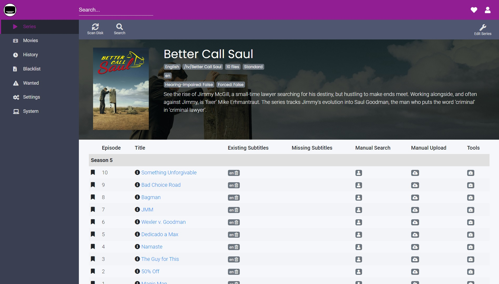{: width="1898" height="1080" loading="lazy"}

=== "Schnellstart"

    Das Webinterface ist &uuml;ber Port **6767** erreichbar:

    - URL = `http://<Ihre.IP>:6767`

    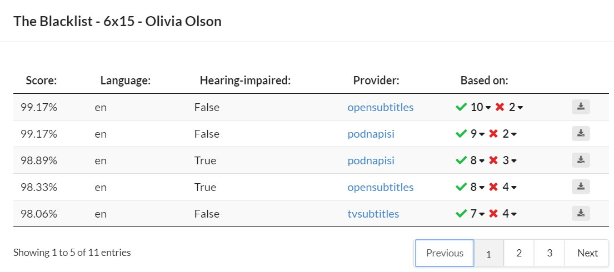{: width="1105" height="490" loading="lazy"}

=== "Erweitert"

    - Installationsverzeichnis: `/opt/bazarr`
    - Datenverzeichnis: `/mnt/dietpi_userdata/bazarr`
    - Bazarr-Konfigurationsdatei: `/mnt/dietpi_userdata/bazarr/config/config.ini`

=== "Protokolle anzeigen"

    - Dienst: `journalctl -u bazarr`
    - Bin&auml;r: `/var/log/bazarr/bazarr.log`

=== "Auf neueste Version aktualisieren"

    - Verwenden Sie den internen webbasierten Updater

***

Offizielle Dokumentation: <https://github.com/morpheus65535/bazarr/wiki>
Quellcode: <https://github.com/morpheus65535/bazarr>

## Lidarr

Laden Sie Ihre Lieblingsmusik automatisch herunter.

??? Notiz "Ein Download-Client ist erforderlich"

&Uuml;bertragung BitTorrent-Server wird empfohlen, um automatische Downloads zu erm&ouml;glichen

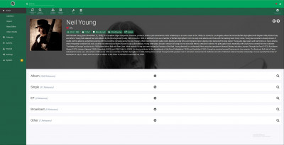{: width="400" height="205" loading="lazy"}

=== "Zugriff auf die Weboberfl&auml;che"

    Das Webinterface ist &uuml;ber Port **8686** erreichbar:

    - URL = `http://<Ihre.IP>:8686`

=== "Erste Ausf&uuml;hrung einrichten"

    Bevor Sie Musik verwenden k&ouml;nnen, m&uuml;ssen Sie einen Suchindexer ausw&auml;hlen, der von der Weboberfl&auml;che verwendet werden soll:

    - Gehen Sie einfach zu `Einstellungen` \> `Indexer` und w&auml;hlen Sie dann mindestens einen Indexer aus.

    Richten Sie Ihren Download-Client ein:

    - Gehen Sie einfach zu `Einstellungen` \> `Download-Client`, w&auml;hlen Sie Ihren installierten Download-Client aus und geben Sie [erforderliche Anmeldeinformationen](#transmission-lightweight-bittorrent-server-with-web-interface) ein.

    Maske zum Erstellen von Setup-Dateien:
    Wenn Sie Schreibzugriff von anderen Anwendungen ben&ouml;tigen (z. B. Plex-Untertitel-Downloads), m&uuml;ssen Sie auch die Datei-/Ordner-Erstellungsmaske so einstellen, dass dies zul&auml;ssig ist.

    - W&auml;hlen Sie in der Sonarr-Weboberfl&auml;che `Einstellungen`.
    - Wechseln Sie zum Schieberegler `Erweiterte Einstellungen` (aktivieren)
    - Scrollen Sie auf der Registerkarte `Medienverwaltung` zum Ende der Seite, stellen Sie unter "Berechtigungen" die folgenden Werte ein:

        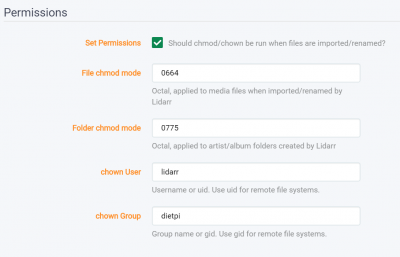{: width="400" height="257" loading="lazy"}

    - &Auml;nderungen speichern

=== "Musik hinzuf&uuml;gen"

    - W&auml;hlen Sie einfach `K&uuml;nstler` \> `Neu hinzuf&uuml;gen` aus
    - Geben Sie den Namen des K&uuml;nstlers ein, den Sie finden m&ouml;chten
    - Sobald Sie es gefunden haben, verwenden Sie im Stammordner den folgenden Speicherort `/mnt/dietpi_userdata/downloads`
    - &Auml;ndern Sie alle anderen Einstellungen nach Bedarf und w&auml;hlen Sie dann `Hinzuf&uuml;gen`.

=== "Benutzerdefinierte Download-/Medienverzeichnisse verwenden"

    Standardm&auml;&szlig;ig hat Lidarr strenge Berechtigungen, um nur auf Download- und Medienverzeichnisse in `/mnt/` zuzugreifen. Wenn Sie einen anderen Standort verwenden m&uuml;ssen, gehen Sie bitte wie folgt vor:

    1. F&uuml;hren Sie `dietpi-services` von der Konsole aus
    2. W&auml;hlen Sie `lidarr` aus
    3. W&auml;hlen Sie `Bearbeiten`.
    4. Kommentieren Sie die Zeile aus (entfernen Sie das f&uuml;hrende `#`), beginnend mit `ReadWritePaths=`
    5. F&uuml;gen Sie Ihren benutzerdefinierten Pfad am Ende dieser Zeile hinzu, getrennt durch ein Leerzeichen
    6. Dr&uuml;cken Sie die Tasten ++ctrl+o++ zum Speichern und ++ctrl+x++ zum Beenden

=== "Datenbanken mit RAM verkn&uuml;pfen"

    Verkn&uuml;pfen Sie die Lidarr-Info-/Einstellungsdatenbank mit dem RAM, um die Zugriffsleistung zu erh&ouml;hen, die Festplatten-E/A zu reduzieren und das st&auml;ndige Drehen der externen Festplatte aufgrund des sehr regelm&auml;&szlig;igen Zugriffs auf diese Dateien zu vermeiden:
    <https://dietpi.com/phpbb/viewtopic.php?t=5828>

=== `Empfohlen: Sch&uuml;tzen Sie Ihre Privatsph&auml;re mit einem VPN`

    Obwohl wir die erzwungene Verschl&uuml;sselung auf allen unseren BitTorrent-Clients aktivieren, ist die Verwendung eines VPN entscheidend, wenn Sie vollst&auml;ndige Privatsph&auml;re und Sicherheit f&uuml;r alle Ihre heruntergeladenen Inhalte gew&auml;hrleisten m&ouml;chten. Wir empfehlen dringend [**NordVPN**](https://go.nordvpn.net/aff_c?offer_id=15&aff_id=5305&url_id=902), da es unbegrenzte Bandbreite, keine Protokollierung und bis zu 6 Ger&auml;te in einem einzigen Konto bietet. Es kann einfach mit unserem Tool [**DietPi-VPN**](../../dietpi_tools/#dietpi-vpn) eingerichtet werden.
    [{: width="300" height="65" loading="lazy"}](https://go.nordvpn.net/ aff_c?offer_id=15&aff_id=5305&url_id=902)

## Jacke

API-Unterst&uuml;tzung f&uuml;r Ihre bevorzugten Torrent-Tracker.

Jackett fungiert als Proxy-Server: Es &uuml;bersetzt Anfragen von Apps (Sonarr, Radarr, Lidarr, Medusa) in Tracker-Site-spezifische HTTP-Anfragen, parst die HTML-Antwort und sendet die Ergebnisse dann zur&uuml;ck an die anfragende Software. Dies erm&ouml;glicht das Abrufen aktueller Uploads (wie RSS) und das Durchf&uuml;hren von Suchen.

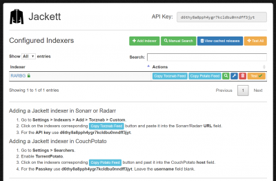{: width="400" height="262" loading="lazy"}

=== "Zugriff auf die Weboberfl&auml;che"

    Das Webinterface ist &uuml;ber Port **9117** erreichbar:

    - URL = `http://<Ihre.IP>:9117`

=== `Empfohlen: Sch&uuml;tzen Sie Ihre Privatsph&auml;re mit einem VPN`

    Obwohl wir die erzwungene Verschl&uuml;sselung auf allen unseren BitTorrent-Clients aktivieren, ist die Verwendung eines VPN entscheidend, wenn Sie vollst&auml;ndige Privatsph&auml;re und Sicherheit f&uuml;r alle Ihre heruntergeladenen Inhalte gew&auml;hrleisten m&ouml;chten. Wir empfehlen dringend [**NordVPN**](https://go.nordvpn.net/aff_c?offer_id=15&aff_id=5305&url_id=902), da es unbegrenzte Bandbreite, keine Protokollierung und bis zu 6 Ger&auml;te in einem einzigen Konto bietet. Es kann einfach mit unserem Tool [**DietPi-VPN**](../../dietpi_tools/#dietpi-vpn) eingerichtet werden.
    [{: width="300" height="65" loading="lazy"}](https://go.nordvpn.net/ aff_c?offer_id=15&aff_id=5305&url_id=902)

## NZBGet

Extrem effizienter und schneller NZB-Download-Manager mit Webinterface. Codiert in C++.

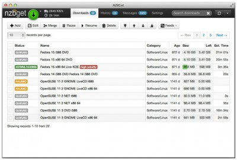{: width="400" height="270" loading="lazy"}

=== "Zugriff auf die Weboberfl&auml;che"

    Das Webinterface ist &uuml;ber Port **6789** erreichbar:

    - URL = `http://<Ihre.IP>:6789`
    - Benutzername = `admin`
    - Passwort = `<Ihr globales Passwort>`

=== "Auf Downloads zugreifen"

    Stellen Sie sicher, dass Sie einen der [Dateiserver](../file_servers/) von DietPi installiert haben.
    Von Transmission verwendete Ordner:

    - Ordnerzugriff &uuml;ber Dateiserver = `downloads/complete`
    - Lokaler Ordner = `/mnt/dietpi_userdata/downloads/complete`

=== `Empfohlen: Sch&uuml;tzen Sie Ihre Privatsph&auml;re mit einem VPN`

    Obwohl wir die erzwungene Verschl&uuml;sselung auf allen unseren BitTorrent-Clients aktivieren, ist die Verwendung eines VPN entscheidend, wenn Sie vollst&auml;ndige Privatsph&auml;re und Sicherheit f&uuml;r alle Ihre heruntergeladenen Inhalte gew&auml;hrleisten m&ouml;chten. Wir empfehlen dringend [**NordVPN**](https://go.nordvpn.net/aff_c?offer_id=15&aff_id=5305&url_id=902), da es unbegrenzte Bandbreite, keine Protokollierung und bis zu 6 Ger&auml;te in einem einzigen Konto bietet. Es kann einfach mit unserem Tool [**DietPi-VPN**](../../dietpi_tools/#dietpi-vpn) eingerichtet werden.
    [{: width="300" height="65" loading="lazy"}](https://go.nordvpn.net/ aff_c?offer_id=15&aff_id=5305&url_id=902)

## HTPC-Manager

HTPC Manager kombiniert all Ihre Lieblingssoftware in einer glatten Oberfl&auml;che.
Erledigen Sie alle Ihre HTPC-Aufgaben, ohne 5 verschiedene Schnittstellen zu verwenden!

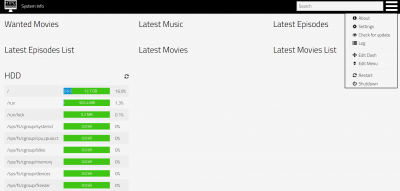{: width="400" height="191" loading="lazy"}

=== "Zugriff auf die Weboberfl&auml;che"

    Das Webinterface ist &uuml;ber Port **8085** erreichbar:

    - URL = `http://<Ihre.IP>:8085`

=== "Auf neueste Version aktualisieren"

    ```sh
    dietpi-software reinstall 155
    ```

## youtube-dl

`youtube-dl` ist ein Befehlszeilenprogramm zum Herunterladen von Videos von YouTube.com und vielen weiteren Websites. Sehen Sie hier die vollst&auml;ndige Liste der unterst&uuml;tzten Websites – [link](https://ytdl-org.github.io/youtube-dl/supportedsites.html).

=== "Schnellstart"

    Auf dieses Tool kann &uuml;ber die Befehlszeile zugegriffen werden

    ```sh
    youtube-dl [OPTIONS] URL [URL...]
    ```

    Lesen Sie die Dokumentation f&uuml;r weitere Details zu den verwendeten Optionen - [link](https://github.com/ytdl-org/youtube-dl).

***

Website: <https://ytdl-org.github.io/youtube-dl/>
Dokumentation: <https://github.com/ytdl-org/youtube-dl/blob/master/README.md#readme>

[Zur&uuml;ck zur **Liste der optimierten Software**](../../software/)
