# Cloud- und Backup-Systeme

## &Uuml;berblick

- [**ownCloud - Ihr eigenes, pers&ouml;nliches Cloud-basiertes Sicherungs-/Datenspeichersystem**](#owncloud)
- [**Nextcloud – Selbst gehostete Produktivit&auml;tsplattform**](#nextcloud)
- [**Nextcloud Talk - Videoanrufe &uuml;ber Nextcloud, einschlie&szlig;lich TURN-Server**](#nextcloud-talk)
- [**Pydio - Funktionsreicher Backup- und Sync-Server mit Weboberfl&auml;che**](#pydio)
- [**UrBackup Server - Vollst&auml;ndige Sicherungen f&uuml;r Systeme in Ihrem Netzwerk**](#urbackup)
- [**Gogs - Server im GitHub-Stil, mit Weboberfl&auml;che**](#gogs)
- [**Gitea - Server im GitHub-Stil, mit Webinterface**](#gitea)
- [**Syncthing - Backup- und Sync-Server mit Webinterface**](#syncthing)
- [**MinIO - S3-kompatibler verteilter Objektserver**](#minio)
- [**Firefox Sync Server - Lesezeichen, Tabs, Verlauf und Passw&ouml;rter synchronisieren**](#firefox-sync-server)
- [**vaultwarden - Inoffizieller Bitwarden-Passwort-Manager-Server, geschrieben in Rust**](#vaultwarden)
- [**FuguHub - Ihr eigener pers&ouml;nlicher Cloud-Server**](#fuguhub)
- [**Dateibrowser - Leichter webbasierter Dateimanager mit Freigabefunktionen**](#file-browser)

??? Information "Wie f&uuml;hre ich **DietPi-Software** aus und installiere **optimierte Software**-Elemente?"
Um eines der unten aufgef&uuml;hrten **DietPi-optimierten Softwareelemente** zu installieren, f&uuml;hren Sie es &uuml;ber die Befehlszeile aus:

    ```sh
    dietpi-software
    ```

    W&auml;hlen Sie **Software durchsuchen** und w&auml;hlen Sie einen oder mehrere Artikel aus. W&auml;hlen Sie abschlie&szlig;end `Installieren`.
    DietPi f&uuml;hrt alle notwendigen Schritte aus, um diese Softwareelemente zu installieren und zu starten.

    {: width="643" height="365" loading="lazy"}

    Um alle DietPi-Konfigurationsoptionen anzuzeigen, lesen Sie den Abschnitt [DietPi Tools](../../dietpi_tools/).

[Zur&uuml;ck zur **Liste der optimierten Software**](../../software/)

## ownCloud

Das ownCloud-Paket verwandelt Ihr DietPi-System in Ihr ganz pers&ouml;nliches Cloud-basiertes Backup-/Datenspeichersystem (zB: Dropbox).

Installiert auch:

- Webserver
- Dediziertes USB-Festplattenlaufwerk dringend empfohlen

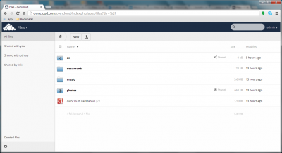{: width="400" height="218" loading="lazy"}

=== "Zugriff auf die Weboberfl&auml;che"

    - URL = `http://<your.IP>/owncloud`
    - Benutzername = `admin`
    - Passwort = `<Ihr globales Passwort>` (Standard: `dietpi`)

    Wenn Sie Ihre ownCloud von der Befehlszeile aus &uuml;ber den Befehl `occ` konfigurieren m&ouml;chten, lesen Sie das [ownCloud-Admin-Handbuch](https://doc.owncloud.org/server/10.5/admin_manual/configuration/server/occ_command.html).

    Um diese Konfiguration zu vereinfachen, hat DietPi dem sonst notwendigen `sudo -u www-data php /var/www/owncloud/occ` einen Shortcut hinzugef&uuml;gt.
    Verwenden Sie einfach in Ihrem Terminal:

    ```sh
    occ list
    ```

=== "ownCloud auf die neueste Version aktualisieren"

    1. Option: Verwenden Sie den webbasierten Updater in den Einstellungen der ownCloud-Web-Benutzeroberfl&auml;che.
    2. Option: Verwenden Sie das Updater-Skript von der Konsole (empfohlen):

        ```sh
        sudo -u www-data php /var/www/owncloud/updater/application.php
        1
        ```

    3. Folgen Sie der offiziellen Dokumentation f&uuml;r einen manuellen Upgrade-Prozess: <https://doc.owncloud.com/server/admin_manual/maintenance/manual_upgrade.html>

=== "H&auml;ufig gestellte Fragen"

    **Wo werden meine Daten gespeichert?**

    `/mnt/dietpi_userdata/owncloud_data` (oder `dietpi.txt` nach Wahl)

    **Warum bin ich auf Uploads mit einer Dateigr&ouml;&szlig;e von 2 GiB beschr&auml;nkt?**

    DietPi wendet automatisch die maximal unterst&uuml;tzte Upload-Gr&ouml;&szlig;e auf die PHP- und ownCloud-Konfigurationen an.

    - 32-Bit-Systeme k&ouml;nnen 2 GB verarbeiten
    - 64-Bit-Systeme k&ouml;nnen 8796 PB verarbeiten, ja, in Petabyte
    - `echo -e "$(( $(php -r 'print(PHP_INT_MAX);') / 1024 / 1024))MB"`

    **Werden meine Daten nach der Deinstallation gespeichert?**

    Ihr Benutzerdatenverzeichnis bleibt nach der Deinstallation bestehen.
    Au&szlig;erdem wird eine Datenbanksicherung in Ihrem Benutzerdatenverzeichnis gespeichert. Somit k&ouml;nnen Sie Ihre Instanz einfach wiederherstellen, indem Sie ownCloud neu installieren und den Datenbank-Dump wiederherstellen.

***

Website: <https://owncloud.com>
Offizielle Dokumentation: <https://doc.owncloud.org/server/admin_manual>

YouTube-Video-Tutorial: *How to Install DietPi OwnCloud on Raspberry Pi*.

<iframe src="https://www.youtube-nocookie.com/embed/-OatWtH1Z9c?rel=0" frameborder="0" allow="fullscreen" width="560" height="315" loading="faul "></iframe>

## Nextcloud

Mit Nextcloud haben Sie &uuml;berall Zugriff auf alle Ihre Dateien. Speichern Sie Ihre Dokumente, Kalender, Kontakte und Fotos auf einem Server zu Hause, bei einem unserer Provider oder in einem Rechenzentrum Ihres Vertrauens.

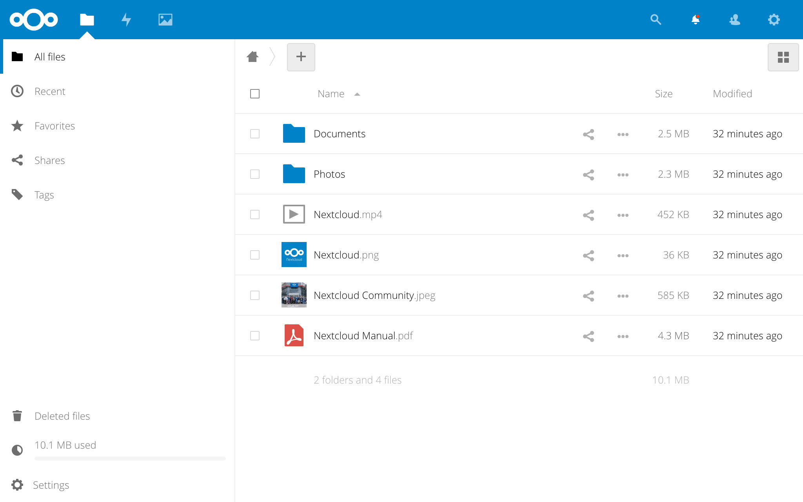{: width="2048" height="1280" loading="lazy"}

=== "Schnellstart"

    Nextcloud ist &uuml;ber den regul&auml;ren HTTP/HTTPS-Port **80**/**443** unter dem Pfad `/nextcloud` erreichbar:

    - URL = `http://<your.IP>/nextcloud/`
    - Benutzername = `admin`
    - Passwort = `<Ihr globales Passwort>` (Standard: `dietpi`)

    F&uuml;r den schnellen Zugriff auf die Dateien wird eine dedizierte USB-Festplatte dringend empfohlen.

=== "Erweiterte Konfiguration"

    F&uuml;r eine erweiterte Einrichtung k&ouml;nnen Sie Ihr Nextcloud-Setup &uuml;ber die Befehlszeile weiter konfigurieren – siehe [Nextcloud Admin Guide](https://docs.nextcloud.com/server/latest/admin_manual/configuration_server/occ_command.html).

    Um diese Konfiguration zu vereinfachen, hat DietPi dem sonst notwendigen `sudo -u www-data php /var/www/nextcloud/occ` einen Shortcut hinzugef&uuml;gt.
    Verwenden Sie einfach in Ihrem Terminal:

    ```sh
    ncc list
    ```

=== "Brute-Force-Schutz"

    Nextcloud bietet einen eingebauten Brute-Force-Schutz und zus&auml;tzlich ein Plugin ***Brute-Force-Einstellungen***.
    Dies verz&ouml;gert Ihre Anmelderate bei mehreren fehlgeschlagenen Anmeldeversuchen.

    Dieser Schutz kann mit Fail2Ban erweitert werden (siehe folgende Registerkarte).

    Siehe auch:

    - <https://apps.nextcloud.com/apps/bruteforcesettings>
    - <https://docs.nextcloud.com/server/latest/admin_manual/configuration_server/bruteforce_configuration.html>

=== "Fail2Ban-Integration"

    Mit Fail2Ban k&ouml;nnen Sie Benutzer nach fehlgeschlagenen Anmeldeversuchen sperren. Dies h&auml;rtet Ihr System zB gegen Brute-Force-Angriffe.

    - Optionen in der ***Nextcloud-Konfigurationsdatei*** festlegen (typisch `/var/www/nextcloud/config/config.php`):

        - Vertrauensw&uuml;rdige Domains hinzuf&uuml;gen, falls nicht bereits &uuml;ber den Eintrag `trusted_domains` festgelegt.

            ```ini
            'trusted_domains' =>
             array (
               0 => 'localhost',
               1 => '<your_trusted_domain>',
             ),
            ```

            Die Angabe der vertrauensw&uuml;rdigen Dom&auml;nen ist wichtig, da einer der regul&auml;ren Fail2Ban-Ausdr&uuml;cke in der Fail2Ban-Filterdatei ("Trusted domain error", siehe unten) Anmeldefehler bei vertrauensw&uuml;rdigen Dom&auml;nen behandelt. Wenn Sie sich &uuml;ber eine nicht vertrauensw&uuml;rdige Dom&auml;ne anmelden, zeigt Nextcloud standardm&auml;&szlig;ig einen Fehler-Anmeldedialog an.

            !!! Aufmerksamkeit
              Achtung, wenn Sie diese "trusted domain error" `failregex`-Option verwenden und die Seite dann mehrmals neu laden (&ouml;fter als `maxretry`-Wert in der Fail2Ban-Jail-Datei) sperren Sie sich auch f&uuml;r das Einloggen &uuml;ber eine vertrauensw&uuml;rdige Domain aus die von Ihnen verwendete IP-Adresse.

        - Logdatei-Optionen: Diese sind standardm&auml;&szlig;ig auf passende Werte gesetzt (zB `log_level`, `log_type`) bzw. DietPi-Voreinstellungen (`Logfile` &uuml;ber `SOFTWARE_NEXTCLOUD_DATADIR` innerhalb von `/boot/dietpi.txt`), so dass sie nicht wie manchmal anders beschrieben gesetzt werden m&uuml;ssen.

    - Neuen ***Fail2Ban-Filter*** erstellen (zB `/etc/fail2ban/filter.d/nextcloud.conf`):

        ```ini
        # Fail2Ban filter for Nextcloud

        [Definition]
        _groupsre = (?:(?:,?\s*"\w+":(?:"[^"]+"|\w+))*)
        failregex = ^\{%(_groupsre)s,?\s*"remoteAddr":"<HOST>"%(_groupsre)s,?\s*"message":"Login failed:
                    ^\{%(_groupsre)s,?\s*"remoteAddr":"<HOST>"%(_groupsre)s,?\s*"message":"Trusted domain error.
        datepattern = ,?\s*"time"\s*:\s*"%%Y-%%m-%%d[T ]%%H:%%M:%%S(%%z)?"
        ```

    - Neue ***Fail2Ban Jail-Datei*** `/etc/fail2ban/jail.d/nextcloud.local` erstellen:

        ```ini
        [nextcloud]
        backend = auto
        enabled = true
        port = http,https
        protocol = tcp
        filter = nextcloud
        maxretry = 5
        bantime = 600
        logpath = /mnt/dietpi_userdata/nextcloud_data/nextcloud.log
        ```

        &Uuml;berpr&uuml;fen Sie, ob der `logpath` mit dem Wert in der Nextcloud-Konfigurationsdatei (`config.php`siehe oben) identisch ist.

    Wie hier nicht angegeben, verwendet Fail2Ban Properties wie `maxretry`, `bantime`, etc. aus `/etc/fail2ban/jail.conf` oder `/etc/fail2ban/jail.local` (falls vorhanden). Beachten Sie die Einstellung `backend = auto`. Standardm&auml;&szlig;ig ist `backend` in `/etc/fail2ban/jail.conf` auf `systemd` gesetzt. Dadurch ignoriert Fail2Ban den `logpath`-Eintrag hier im Jail `nextcloud.conf`, mit der Folge, dass Fail2Ban einen Angriff auf Nextcloud (Port 80, 443) nicht erkennt, obwohl Angriffe in `/mnt/ aufgef&uuml;hrt sind. dietpi_userdata/nextcloud_data/nextcloud.log`.

    - Fail2Ban neu starten: `systemctl restart fail2ban`.
    - Testen Sie Ihre Einstellungen, indem Sie mehrmals versuchen, sich von einem Remote-PC mit einem falschen Benutzer oder Passwort anzumelden. Nach `maxretry`-Versuchen muss Ihre IP f&uuml;r `bantime` Sekunden gesperrt werden (DietPi antwortet nicht mehr), da die Standardaktion von Fail2Ban `route` ist, spezifiziert in `/etc/fail2ban/action.d/route.conf`.
    - &Uuml;berpr&uuml;fen Sie den aktuellen Status auf Ihrem DietPi mit `fail2ban-client status nextcloud`.
    - Siehe auch:
    - [Fail2Ban](../system_security/#fail2ban-protects-your-system-from-brute-force-attacks)
        - <https://help.nextcloud.com/t/repeated-login-attempts-from-china/6510/11?u=michaing>
        - <https://www.c-rieger.de/nextcloud-installationsanleitung/#c06>

=== "Nextcloud auf die neueste Version aktualisieren"

    1. Option: Verwenden Sie den webbasierten Updater in den Nextcloud-Web-UI-Einstellungen.
    2. Option: Verwenden Sie das Updater-Skript von der Konsole (empfohlen):

        ```sh
        phpenmod phar # The PHP Phar module is required
        sudo -u www-data php /var/www/nextcloud/updater/updater.phar
        y # Starts download and install of files
        y # Starts the internal database upgrade and migration steps
        N # Do not keep maintenance mode active
        ```

    3. Folgen Sie der offiziellen Dokumentation f&uuml;r einen manuellen Upgrade-Prozess: <https://docs.nextcloud.com/server/latest/admin_manual/maintenance/manual_upgrade.html>

=== "H&auml;ufig gestellte Fragen"

    **Wo werden meine Daten gespeichert?**

    `/mnt/dietpi_userdata/nextcloud_data` (oder `dietpi.txt` nach Wahl)

    **Warum bin ich auf Uploads mit einer Dateigr&ouml;&szlig;e von 2 GB beschr&auml;nkt?**

    DietPi wendet automatisch die maximal unterst&uuml;tzte Upload-Gr&ouml;&szlig;e auf die PHP- und Nextcloud-Konfigurationen an.

    - 32-Bit-Systeme k&ouml;nnen 2 GB verarbeiten
    - 64-Bit-Systeme k&ouml;nnen 8796 PB (Petabyte) verarbeiten

    **Werden meine Daten nach der Deinstallation gespeichert?**

    Ihr Benutzerdatenverzeichnis bleibt nach der Deinstallation bestehen. Au&szlig;erdem wird eine Datenbanksicherung in Ihrem Benutzerdatenverzeichnis gespeichert. Somit k&ouml;nnen Sie Ihre Instanz einfach wiederherstellen, indem Sie Nextcloud neu installieren und den Datenbank-Dump wiederherstellen.

    **Wie kann ich meinen OPcache-Status &uuml;berpr&uuml;fen?**

    PHP verwendet einen sogenannten *OPcache*, um PHP-Skripte im optimierten *opcode*-Format im RAM zu speichern, was den Browserzugriff beschleunigt, da die rohen PHP-Skripte nicht zuerst von der Festplatte gelesen und geparst werden m&uuml;ssen.
    Das Nextcloud-Admin-Panel enth&auml;lt eine &Uuml;berpr&uuml;fung auf ausreichende OPcache-Einstellungen und zeigt gegebenenfalls eine Empfehlung f&uuml;r anzuwendende Einstellungen an. Wenn solche erscheinen, empfehlen wir, sie mit einer eigenen Konfigurationsdatei anzuwenden, z.

    ```sh
    echo -e '; Custom Nextcloud OPcache settings\n; priority=99\nopcache.memory_consumption=128' > /etc/php/7.4/mods-available/custom.ini
    phpenmod custom
    ```

    Sie k&ouml;nnen die tats&auml;chliche Nutzung mit dem vorinstallierten [opcache-gui](https://github.com/amnuts/opcache-gui){:class="nospellcheck"} von @amnuts beobachten.

    - URL: `http://<your.IP>/opcache.php`

    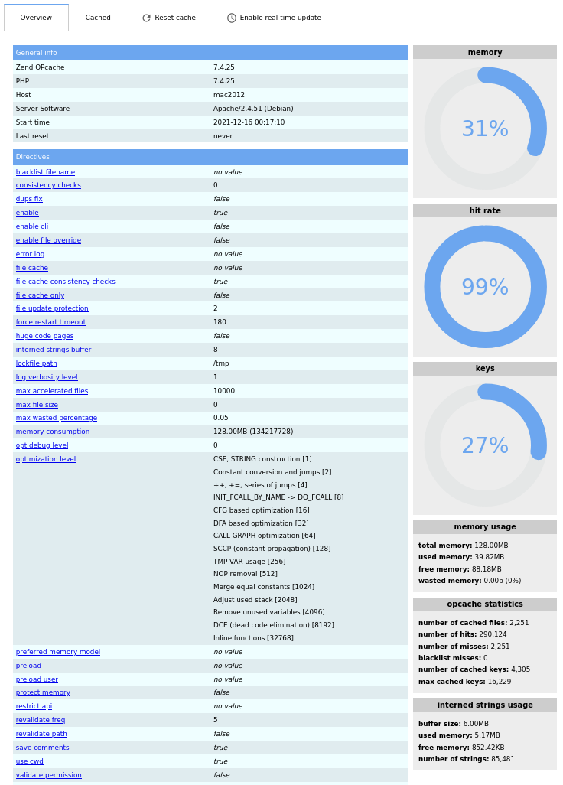{: width="700" height="976" loading="lazy"}

    Der Dialog zeigt den Cache-Status sowie die Einstellungen an.

    **Was soll ich tun, wenn die PHP-Module `bcmath`, `gmp` und `imagick` fehlen?**

    Nach einer Neuinstallation &uuml;ber `dietpi-software` zeigt Nextcloud eine Warnung *"In dieser Instanz fehlen einige empfohlene PHP-Module. F&uuml;r eine verbesserte Leistung und bessere Kompatibilit&auml;t wird dringend empfohlen, sie zu installieren."*, auch beschrieben [hier](https://dietpi.com/phpbb/viewtopic.php?p=27383#p27383). Wir schlagen vor, sie zu ignorieren, `imagick` wird &uuml;berhaupt nicht ben&ouml;tigt und ist ein Diskussionsthema bez&uuml;glich Sicherheitsfragen, `bcmath` und `gmp` sind nur erforderlich, wenn Sie die passwortlose WebAuthn-Authentifizierung mit Nextcloud verwenden m&ouml;chten.
    Wenn Sie diese Warnungen stumm schalten m&uuml;ssen, k&ouml;nnen Sie die Module manuell installieren:

    ```sh
    sudo apt install php-bcmath php-gmp php-imagick libmagickcore-6.q16-6-extra
    ```

    Die `imagick`-bezogene Warnung kann alternativ durch Deaktivieren der `Theming`-App (in den Nextcloud-Apps-Einstellungen) behoben werden, wenn ohnehin kein manuelles Theming an der Nextcloud-Instanz vorgenommen wird.

***

Website: <https://nextcloud.com/>
Offizielle Dokumentation: <https://docs.nextcloud.com/server/latest/admin_manual/contents.html>

YouTube-Video-Tutorial Nr. 1: *DietPi Nextcloud-Setup auf Raspberry Pi 3 B Plus*.

<iframe src="https://www.youtube-nocookie.com/embed/Q3R2RqFSyE4?rel=0" frameborder="0" allow="fullscreen" width="560" height="315" loading="lazy" ></iframe>

YouTube-Video-Tutorial Nr. 2: [DietPi Docker Nextcloud External Storage Setup with SAMBA SERVER on RPI3B](https://www.youtube.com/watch?v=NOb12BuNpZ8)

## Nextcloud-Gespr&auml;ch

Hosten Sie Videoanrufe auf Ihrer eigenen Nextcloud-Instanz. Der TURN-Server ***Coturn*** wird ebenfalls installiert und konfiguriert, um zuverl&auml;ssige Videoanrufe au&szlig;erhalb des lokalen Netzwerks, von NAT- und Firewall-Setups zu erm&ouml;glichen.

Installiert auch:

- [**N&auml;chsteWolke**](#N&auml;chsteWolke)
- **Zur&uuml;ck**

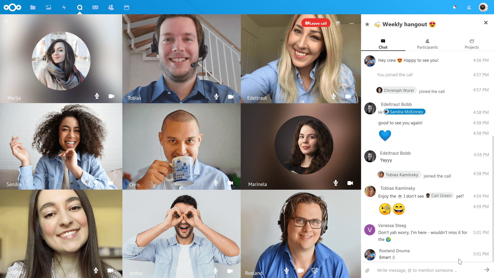{: width="2560" height="1440" loading="lazy"}

=== "Installationshinweise"

    W&auml;hrend der Installation werden Sie aufgefordert, die externe Serverdom&auml;ne und einen Port einzugeben, den Sie f&uuml;r den Coturn TURN-Server verwenden m&ouml;chten. Beachten Sie, dass Sie den gew&auml;hlten Port weiterleiten und/oder in Ihrer Firewall &ouml;ffnen m&uuml;ssen.

    Wenn HTTPS &uuml;ber `dietpi-letsencrypt` aktiviert wurde oder wird, wird Coturn so konfiguriert, dass die LetsEncrypt-Zertifikate f&uuml;r TLS-Verbindungen auf dem gew&auml;hlten TURN-Serverport automatisch verwendet werden.

    Coturn h&ouml;rt standardm&auml;&szlig;ig auch Nicht-TLS-Anfragen auf dem in `/etc/turnserver.conf` konfigurierten Port ab. Sie k&ouml;nnen TLS erzwingen/steuern, indem Sie die Portweiterleitung in Ihrem Router umschalten und/oder Ports in Ihrer Firewall &ouml;ffnen/fallen lassen.

    Die Coturn-Protokollierung ist standardm&auml;&szlig;ig &uuml;ber `/etc/default/coturn`-Befehlsargumente deaktiviert, da sie sehr ausf&uuml;hrlich ist und viel Platten-I/O erzeugt. Sie k&ouml;nnen die Protokollierung bei Bedarf &uuml;ber `/etc/turnserver.conf` aktivieren und konfigurieren.

***

Website: <https://nextcloud.com/talk>

##Pydio

Pydio ist ein funktionsreicher Backup- und Sync-Server mit Webinterface. &Auml;hnlich wie ownCloud mit umfangreichen Konfigurationsoptionen, um Ihre `Cloud`-Anforderungen zu erf&uuml;llen.

Installiert auch:

- Webserver

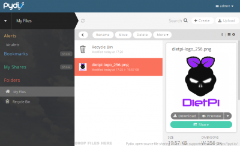{: width="400" height="243" loading="lazy"}

=== "Zugriff auf die Weboberfl&auml;che"

    URL = `http://<Ihre.IP>/pydio`

=== "Erste Verbindung"

    - Ignorieren Sie die Warnungen und klicken Sie auf die Schaltfl&auml;che mit dem Titel `KLICKEN SIE HIER, UM MIT PYDIO WEITERZUFAHREN`.
    Hinweis: Wenn Sie einen SSL-Zugriff ben&ouml;tigen, verwenden Sie bitte LetsEncrypt, um diesen einzurichten.
    - Der Assistent kann jetzt gestartet werden, klicken Sie zum Starten auf die Schaltfl&auml;che `Assistent starten >`.
    - Geben Sie ein neues Administratorkonto zur Verwendung mit Pydio ein und erstellen Sie es. Klicken Sie dann auf die Schaltfl&auml;che `>>`.
    - Geben Sie unter Datenbankdetails Folgendes ein:
        - Datenbanktyp = `MySQL`
        - Host = "lokaler Host".
        - Datenbank = `pydio`
        - Benutzer = "pydio".
        - Passwort = `<Ihr globales Passwort>` (Standard: `dietpi`)
        - Use MySqli = Nein
    - Klicken Sie auf Verbindung testen, wenn erfolgreich, klicken Sie auf die Schaltfl&auml;che `>>`.
    - Verwenden Sie unter den erweiterten Optionen die Standardwerte und klicken Sie dann auf die Schaltfl&auml;che `Pydio installieren`.

=== "Sync-Client auf Remote-Systemen einrichten"

    Nachdem der Server konfiguriert wurde (wie oben):

    - Laden Sie den Sync-Client f&uuml;r Ihr System herunter: <https://pydio.com/en/get-pydio/downloads/pydiosync-desktop-app>
    - Verwenden Sie beim Konfigurieren des Remote-Servers Folgendes:
        - W&auml;hlen Sie die HTTP-Option (es sei denn, Sie haben ein SSL-Zertifikat eingerichtet)
        - URL = `http://<your.IP>/pydio` (IP durch Ihre System-IP ersetzen)
        - Benutzer = Der `admin`-Benutzer, den Sie bei der Ersteinrichtung eingerichtet haben.
        - Passwort = Das "admin"-Passwort, das Sie bei der Ersteinrichtung eingerichtet haben.

***

Website: <https://pydio.com>

##UrBackup

UrBackup Server ist ein Open-Source-Client/Server-Backup-System, das durch eine Kombination aus Image- und Datei-Backups sowohl Datensicherheit als auch eine schnelle Wiederherstellungszeit erreicht.
Grunds&auml;tzlich k&ouml;nnen Sie mit einer einfachen Webschnittstelle ein vollst&auml;ndiges System-Backup f&uuml;r Systeme in Ihrem Netzwerk erstellen.

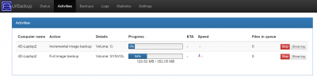{: width="400" height="103" loading="lazy"}

=== "Zugriff auf die Weboberfl&auml;che"

    Das Webinterface ist &uuml;ber Port **55414** erreichbar:

    URL = `http://<Ihre.IP>:55414`
    Anmerkung: &Auml;ndern Sie die IP-Adresse f&uuml;r Ihr System.

=== "Speicherort der Sicherung"

    Der Speicherort der Backups kann im Webinterface ge&auml;ndert werden:

    - W&auml;hlen Sie `Einstellungen`.
    - &Auml;ndern Sie den Backup-Speicherpfad: `/mnt/dietpi_userdata/urbackup` wird empfohlen.
    - Klicken Sie auf `Speichern`.
    - Dienst mit `systemctl restart urbackupsrv` neu starten.

=== "Client herunterladen"

Installieren Sie den entsprechenden Client auf den Systemen, die Sie von <https://www.urbackup.org/download.html#client_windows> sichern m&ouml;chten.

***
Website: <https://www.urbackup.org/index.html>

## Gogs

Ihr ganz eigener Server im GitHub-Stil mit Webinterface.

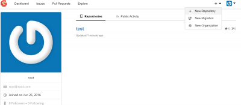{: width="400" height="175" loading="lazy"}

=== "Zugriff auf die Weboberfl&auml;che"

Das Webinterface ist &uuml;ber Port **3000** erreichbar:

- URL: `http://<Ihre.IP>:3000`

=== "Erste Ausf&uuml;hrung einrichten"

Muss bei bestehender Verbindung zum Webinterface einmalig durchgef&uuml;hrt werden:

    - &Auml;ndern Sie nur die folgenden Werte:
        - Datenbanktyp: `MySQL`.
        - Host: `/run/mysqld/mysqld.sock`
        - Passwort: `<Ihr globales Passwort>` (Standard: `dietpi`)
        - Repository-Stammpfad: `/mnt/dietpi_userdata/gogs-repo`
        - Benutzer ausf&uuml;hren: `gogs`
        - Dom&auml;ne: `<your.domain/IP>`
        - Anwendungs-URL: `http://<your.domain/IP>:3000/`
        - Protokollpfad: `/var/log/gogs`
    - Scrollen Sie zum Ende der Seite und w&auml;hlen Sie "Gogs installieren".
    - Abh&auml;ngig davon, ob die obige Anwendungs-URL korrekt eingegeben wurde/f&uuml;r den verbundenen Browser zug&auml;nglich ist, m&uuml;ssen Sie m&ouml;glicherweise die Verbindung zur Webseite mit der IP-Adresse erneut herstellen, z. B.: `http://<your.IP>:3000`
    - Nachdem die Seite neu geladen wurde, m&uuml;ssen Sie auf `Registrieren` klicken, um das Administratorkonto zu erstellen.

=== "Externer Zugriff"

    Wenn Sie externen Zugriff auf Ihren Gogs-Server zulassen m&ouml;chten, m&uuml;ssen Sie auf Ihrem Router eine Portweiterleitung einrichten, die auf die IP-Adresse Ihres DietPi-Ger&auml;ts verweist.

    - Hafen: 3000
    - Protokoll: TCP+UDP

    Wenn ein externer Zugriff verwendet wird, wird HTTPS dringend empfohlen, um Ihre Systemsicherheit zu erh&ouml;hen. Ein kostenloses Zertifikat erhalten Sie zB &uuml;ber [dietpi-letsencrypt](../../dietpi_tools/#dietpi-letsencrypt){:class="nospellcheck"}.

=== "Protokolle anzeigen"

    Anf&auml;ngliche Serviceprotokolle k&ouml;nnen angezeigt werden &uuml;ber:

    ```sh
    journalctl -u gogs
    ```

    Daemon-Protokolle finden Sie im folgenden Verzeichnis:

    ```
    /var/log/gogs
    ```

=== "Auf neueste Version aktualisieren"

    Sie k&ouml;nnen Gogs einfach aktualisieren, indem Sie es neu installieren. Ihre Einstellungen und Daten bleiben dabei erhalten:

    ```sh
    dietpi-software reinstall 49
    ```

***

Offizielle Website: <https://gogs.io/>
Offizielle Dokumentation: <https://gogs.io/docs>
Quellcode: <https://github.com/gogs/gogs>
Lizenz: [MIT](https://github.com/gogs/gogs/blob/main/LICENSE)

## Gitea

Ihr ganz eigener Server im GitHub-Stil mit Webinterface.

{: width="320" height="200" loading="lazy"}

=== "Zugriff auf die Weboberfl&auml;che"

    Das Webinterface ist &uuml;ber Port **3000** erreichbar:

    - URL: `http://<Ihre.IP>:3000`

=== "Erste Ausf&uuml;hrung einrichten"

    Muss bei bestehender Verbindung zum Webinterface einmalig durchgef&uuml;hrt werden:

    - &Auml;ndern Sie nur die folgenden Werte:
        - Host: `/run/mysqld/mysqld.sock`
        - Passwort: `<Ihr globales Passwort>` (Standard: `dietpi`)
        - SSH-Serverdom&auml;ne: `<your.domain/IP>`
        - Gitea-Basis-URL: `http://<your.domain/IP>:3000/`
        - Protokollpfad: `/var/log/gitea` (Dateiprotokollierung ist jedoch standardm&auml;&szlig;ig deaktiviert.)
    - Scrollen Sie zum Ende der Seite und w&auml;hlen Sie "Gitea installieren".
    - Abh&auml;ngig davon, ob die obige Basis-URL korrekt eingegeben wurde/f&uuml;r den verbundenen Browser zug&auml;nglich ist, m&uuml;ssen Sie m&ouml;glicherweise die Verbindung zur Webseite mit der IP-Adresse erneut herstellen, z. B.: `http://<your.IP>:3000`
    - Nachdem die Seite neu geladen wurde, m&uuml;ssen Sie auf `Registrieren` klicken, um das Administratorkonto zu erstellen.

=== "Externer Zugriff"

    Wenn Sie externen Zugriff auf Ihren Gitea-Server zulassen m&ouml;chten, m&uuml;ssen Sie auf Ihrem Router eine Portweiterleitung einrichten, die auf die IP-Adresse Ihres DietPi-Ger&auml;ts verweist.

    - Port: 3000
    - Protokoll: TCP+UDP

    Wenn ein externer Zugriff verwendet wird, wird HTTPS dringend empfohlen, um Ihre Systemsicherheit zu erh&ouml;hen. Ein kostenloses Zertifikat erhalten Sie zB &uuml;ber [dietpi-letsencrypt](../../dietpi_tools/#dietpi-letsencrypt){:class="nospellcheck"}.

=== "Fail2Ban-Integration"

    Mit Fail2Ban k&ouml;nnen Sie IP-Adressen nach fehlgeschlagenen Anmeldeversuchen sperren. Dies h&auml;rtet Ihr System gegen zB Brute-Force-Angriffe.

    === "Bei Verwendung der Journalprotokollierung (Standard)"

        Standardm&auml;&szlig;ig protokolliert Gitea das systemd-Journal (siehe Registerkarte `Protokolle anzeigen`). In diesem Fall kann der Fail2Ban-Schutz mit den folgenden Schritten aktiviert werden:

        Erstellen Sie einen neuen Filter `/etc/fail2ban/filter.d/gitea.conf`:

        ```ini
        [Definition]
        journalmatch = _SYSTEMD_UNIT=gitea.service
        failregex = Failed authentication attempt for \x1b\[1m.+\x1b\[0m from \x1b\[1m<HOST>:\d+\x1b\[0m:
        ```

        Erstellen Sie ein neues Jail `/etc/fail2ban/jail.d/gitea.conf`:

        ```ini
        [gitea]
        enabled = true
        backend = systemd
        ```

    === "Bei Verwendung der Dateiprotokollierung"

        Wenn die Dateiprotokollierung aktiviert ist (siehe Registerkarte `Protokolle anzeigen`), kann der Fail2Ban-Schutz mit den folgenden Schritten aktiviert werden:

        Erstellen Sie einen neuen Filter `/etc/fail2ban/filter.d/gitea.conf`:

        ```ini
        [Definition]
        failregex = Failed authentication attempt for .+ from <HOST>:\d+:
        ```

        Erstellen Sie ein neues Jail `/etc/fail2ban/jail.d/gitea.conf`:

        ```ini
        [gitea]
        enabled = true
        backend = auto
        logpath = /var/log/gitea/gitea.log
        ```

    Sie k&ouml;nnen andere Eigenschaften wie `maxretry` oder `bantime` angeben, um die Standardwerte in `/etc/fail2ban/jail.conf` oder `/etc/fail2ban/jail.local` zu &uuml;berschreiben, falls vorhanden. Wenn fertig:

    - Fail2Ban neu starten: `systemctl restart fail2ban`
    - Versuchen Sie, sich mit einem falschen Passwort bei der Gitea-Weboberfl&auml;che anzumelden.
    - &Uuml;berpr&uuml;fen Sie, ob die fehlgeschlagene Anmeldung erkannt wurde: `fail2ban-client status gitea`
    - Wenn Sie weiterhin versuchen, sich `maxretry`-mal anzumelden, sollte Ihre IP f&uuml;r `bantime`-Sekunden gesperrt werden, sodass weder die Gitea-Weboberfl&auml;che noch SSH oder andere Netzwerkanwendungen auf Anfragen Ihres Clients reagieren. Wenn Fail2Ban &uuml;ber `dietpi-software` installiert wurde, wird standardm&auml;&szlig;ig die `route`/`blackhole`-Blockierung verwendet, sodass `ip r` auf dem Server eine `blackhole`-Route f&uuml;r die IP Ihres Clients anzeigen sollte.
    - Siehe auch:
        - [Fail2Ban](../system_security/#fail2ban)
        - <https://docs.gitea.io/en-us/fail2ban-setup/>

=== "Protokolle anzeigen"

    Standardm&auml;&szlig;ig k&ouml;nnen Protokolle mit dem folgenden Befehl angezeigt werden:

    ```sh
    journalctl -u gitea
    ```

    Die Dateiprotokollierung in `/var/log/gitea/gitea.log` kann aktiviert werden, indem `/mnt/dietpi_userdata/gitea/custom/conf/app.ini` bearbeitet und `MODE = console` in `[log]` ge&auml;ndert wird Abschnitt zu `MODE = file`.

=== "Auf neueste Version aktualisieren"

    Sie k&ouml;nnen Gitea einfach aktualisieren, indem Sie es neu installieren. Ihre Einstellungen und Daten bleiben dabei erhalten:

    ```sh
    dietpi-software reinstall 165
    ```

***

Offizielle Website: <https://gitea.io/>
Offizielle Dokumentation: <https://docs.gitea.io/>
Offizielles Forum: <https://discourse.gitea.io/>
Quellcode: <https://github.com/go-gitea/gitea>
Lizenz: [MIT](https://github.com/go-gitea/gitea/blob/main/LICENSE)

## Syncthing (Synchronisieren)

Backup- und Sync-Server mit Webinterface. Extrem leicht und effizient, da kein Webserver erforderlich ist.

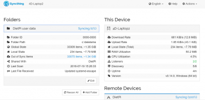{: width="400" height="195" loading="lazy"}

=== "Zugriff auf die Weboberfl&auml;che"

    Das Webinterface ist &uuml;ber Port **8384** erreichbar:

    URL = `http://<Ihre.IP>:8384`

=== "Erste Ausf&uuml;hrung einrichten"

    Muss einmalig durchgef&uuml;hrt werden, wenn eine Verbindung zum Webinterface besteht.

    - Wenn die `Gefahr! Bitte legen Sie einen Benutzer und ein Kennwort f&uuml;r die GUI-Authentifizierung im Dialogfeld `Einstellungen` fest. Wenn das Dialogfeld angezeigt wird, klicken Sie auf die Schaltfl&auml;che `Einstellungen` im Feld.
    - Unter `GUI-Authentifizierungsbenutzer` und `GUI-Authentifizierungspasswort`: Geben Sie die neuen Anmeldedaten ein, die Sie f&uuml;r den Zugriff auf die Weboberfl&auml;che verwenden m&ouml;chten. Klicken Sie dann auf `Speichern`.

    DietPi richtet automatisch Ihre Standardordnerfreigabe nach `/mnt/dietpi_userdata` ein.

=== "Ein zweites System zum Synchronisieren einrichten"

    In diesem Beispiel verwenden wir ein Windows-System. Das Ziel ist es, die Benutzerdaten von Ihrem DietPi-Ger&auml;t mit einem anderen System zu `synchronisieren`.

    - Laden Sie die Windows-Anwendung `syncthing.exe` herunter, extrahieren Sie sie und f&uuml;hren Sie sie aus: <https://syncthing.net/downloads/>.
    - Das Syncthing-Webinterface wird automatisch geladen, wenn nicht, k&ouml;nnen Sie &uuml;ber `http://127.0.0.1:8384/` darauf zugreifen.
        - Klicken Sie oben rechts auf "Aktionen" und w&auml;hlen Sie dann "ID anzeigen". Kopieren Sie den UUID-Code.
    - &Ouml;ffnen Sie auf dem DietPi-Ger&auml;t die Weboberfl&auml;che und klicken Sie auf `Remote-Ger&auml;t hinzuf&uuml;gen` (unten rechts).
        - F&uuml;gen Sie unter "Ger&auml;te-ID" die UUID ein, die wir zuvor kopiert haben.
        - Geben Sie unter `Ger&auml;tename` einen beliebigen Namen ein. zB: *Mein Windows-PC*.
        - Aktivieren/w&auml;hlen Sie unter `Ordner mit Ger&auml;t teilen` die DietPi-Benutzerdaten und klicken Sie dann auf `Speichern`.
    - Wechseln Sie nach einigen Sekunden zur&uuml;ck zur Windows-Weboberfl&auml;che `http://127.0.0.1:8384/`. Sie sollten eine Meldung erhalten, in der Sie aufgefordert werden, das neue Ger&auml;t zu best&auml;tigen, klicken Sie auf `Ger&auml;t hinzuf&uuml;gen`.
        - Aktivieren/w&auml;hlen Sie unter `Ordner mit Ger&auml;t teilen` die DietPi-Benutzerdaten und klicken Sie dann auf `Speichern`.

    Ihre Ger&auml;te sollten nun die Benutzerdaten von Ihrem DietPi-Ger&auml;t auf Ihren Windows-PC duplizieren.

***

Website: <https://syncthing.net>

## MinIO

Es ist ein Open Source Kubernetes nativer Hochleistungs-Objektspeicher (S3-kompatibel). Es hilft beim Aufbau einer Cloud-nativen Dateninfrastruktur f&uuml;r maschinelles Lernen, Analysen und Anwendungsdaten-Workloads.

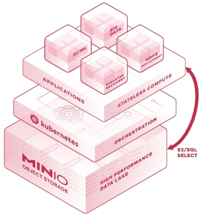{: width="417" height="443" loading="lazy"}

=== "Schnellstart"

    Das Webinterface ist &uuml;ber Port **9000** erreichbar:

    - URL: `http://<Ihre.IP>:9000`
    - Benutzername: `adminadmin`
    - Passwort: `adminadmin`
    - [Kurzanleitung f&uuml;r MinIO-Server](https://docs.min.io/docs/minio-quickstart-guide.html)
    - [Schnellstartanleitung f&uuml;r den Python-Client - MinIO](https://docs.min.io/docs/python-client-quickstart-guide.html)
    - [JavaScript-Client-Schnellstartanleitung - MinIO](https://docs.min.io/docs/javascript-client-quickstart-guide.html)

***

Webseite: <https://min.io/product/overview>
Offizielle Dokumentation: <https://docs.min.io>

## Firefox-Sync-Server

Dies ist der Firefox-Sync-Server von Mozilla, der die ger&auml;te&uuml;bergreifende Synchronisierung von Lesezeichen, Verlauf, Registerkarten und Passw&ouml;rtern von Firefox-Instanzen verwaltet. Out of the Box l&auml;uft es auf einem Python-Server f&uuml;r kleine Lasten und kann so konfiguriert werden, dass es hinter Nginx oder Apache l&auml;uft.

{: width="300" height="95" loading="lazy"}

=== "Firefox konfigurieren"

    - &Ouml;ffnen Sie `about:config`, um auf erweiterte Einstellungen zuzugreifen.
    - Suchen Sie nach: `identity.sync.tokenserver.uri`.
    - Setzen Sie den Wert auf: `http://<your.IP>:5002/token/1.0/sync/1.5`.
        - Wir empfehlen, auf Ihren Firefox-Sync-Server nur &uuml;ber ein lokales Netzwerk oder &uuml;ber VPN zuzugreifen und den standardm&auml;&szlig;igen Listening-Port **5002** f&uuml;r den Zugriff von au&szlig;erhalb Ihres LANs geschlossen zu lassen.
        - Wenn Sie ohne VPN aus der Ferne darauf zugreifen m&uuml;ssen, passen Sie die Einstellung `public_url` in der Konfigurationsdatei `/mnt/dietpi_userdata/firefox-sync/syncserver.ini` so an, dass sie Ihre &ouml;ffentliche IP oder Dom&auml;ne und den gew&uuml;nschten Port enth&auml;lt.

=== "Verzeichnisse"

    - Installationsverzeichnis: `/opt/firefox-sync`
    - Datenverzeichnis: `/mnt/dietpi_userdata/firefox-sync`
    - Konfigurationsdatei: `/mnt/dietpi_userdata/firefox-sync/syncserver.ini`

=== "Protokolle anzeigen"

    Zeigen Sie die Protokolle an, indem Sie Folgendes ausf&uuml;hren:

     ```sh
     journalctl -u firefox-sync
     ```

=== "Auf neueste Version aktualisieren"

    Sie k&ouml;nnen den Firefox Sync Server einfach aktualisieren, indem Sie ihn neu installieren. Ihre Einstellungen und Daten bleiben dabei erhalten:

    ```sh
    dietpi-software reinstall 177
    ```

***

Offizielle Dokumentation: <https://mozilla-services.readthedocs.io/en/latest/howtos/run-sync-1.5.html>
Quellcode: <https://github.com/mozilla-services/syncserver>
Lizenz: [MPL2.0](https://github.com/mozilla-services/syncserver/blob/master/LICENSE)

Credits: Dieser Softwaretitel wurde von [CedArctic](https://github.com/CedArctic) zur DietPi-Software hinzugef&uuml;gt, vielen Dank! :D

## Tresorw&auml;chter

vaultwarden ist ein inoffizieller Bitwarden-Passwortmanager-Server mit Weboberfl&auml;che, geschrieben in Rust.

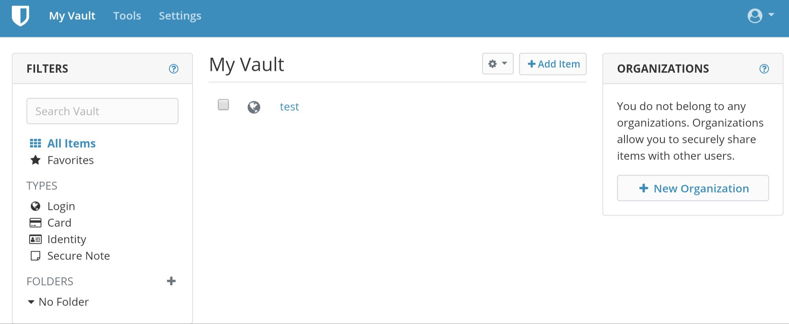{: width="600" height="247" loading="lazy"}

=== "Erster Zugriff"

    - W&auml;hrend der Installation wird ein selbstsigniertes 4096-Bit-RSA-TLS-Zertifikat erstellt, um verschl&uuml;sselten HTTPS-Zugriff zu erm&ouml;glichen, was f&uuml;r den Zugriff mit den meisten Bitwarden-Clients erforderlich ist und angesichts der Sensibilit&auml;t der Daten, die ein Passwort-Manager verarbeitet, angemessen ist.
    - Die meisten Webbrowser warnen Sie beim Zugriff, dass das Zertifikat nicht vertrauensw&uuml;rdig ist, obwohl Sie dies normalerweise ignorieren und trotzdem auf den Web-Tresor zugreifen k&ouml;nnen.
    - Die meisten Bitwarden-Clients hingegen verweigern den Zugriff auf Ihren Server, solange dem Zertifikat nicht vertraut wird.
    - Sofern Sie einen &ouml;ffentlichen Dom&auml;nennamen f&uuml;r Ihren DietPi-Server haben, empfehlen wir, ein offizielles vertrauensw&uuml;rdiges CA-Zertifikat anzufordern, z. B. &uuml;ber `dietpi-letsencrypt` und entweder einen Reverse-Proxy einzurichten oder Vaultwarden so zu konfigurieren, dass der abgerufene Schl&uuml;ssel und das Zertifikat direkt verwendet werden &uuml;ber die ROCKET_TLS-Einstellung in der Konfigurationsdatei (siehe Registerkarte "Verzeichnisse").

??? Information "Wie f&uuml;ge ich ein selbstsigniertes Zertifikat zum Speicher der vertrauensw&uuml;rdigen Stammzertifizierungsstellen des Betriebssystems hinzu?"

        === "Windows 10"

            1. W&auml;hlen Sie in Ihrem Browser neben der Adressleiste das Warn- oder Schlosssymbol aus.
                W&auml;hlen Sie dann die Schaltfl&auml;che Zertifikat, um die Zertifikatsansicht von Windows zu &ouml;ffnen.
            2. Wechseln Sie auf die Registerkarte `Details`.
                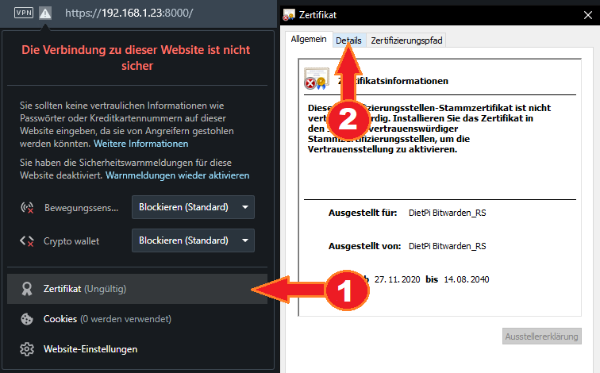
            3. W&auml;hlen Sie `In Datei speichern`.
            4. W&auml;hlen Sie im neu ge&ouml;ffneten Fenster `Weiter`.
                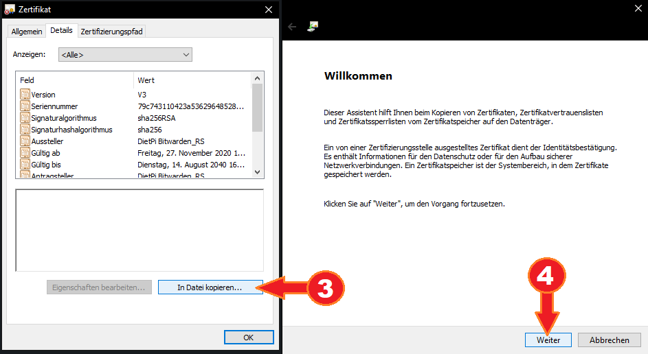
            5. Belassen Sie die standardm&auml;&szlig;ige DER-Codierung und w&auml;hlen Sie `Weiter`.
            6. W&auml;hlen Sie `Durchsuchen`, um einen Speicherort f&uuml;r die Zieldatei auszuw&auml;hlen.
                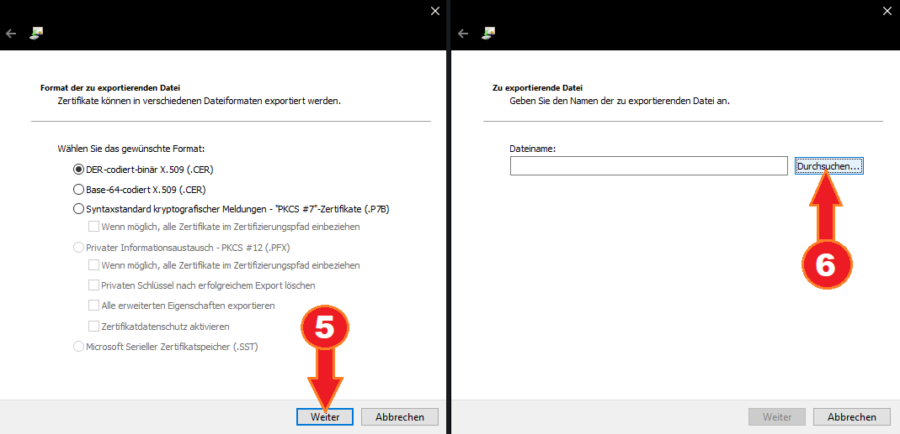
            7. W&auml;hlen Sie einen Speicherort und einen Namen f&uuml;r die Zieldatei, dies ist nur vor&uuml;bergehend erforderlich.
            8. W&auml;hlen Sie `Weiter`.
            9. W&auml;hlen Sie `Fertig stellen`.
                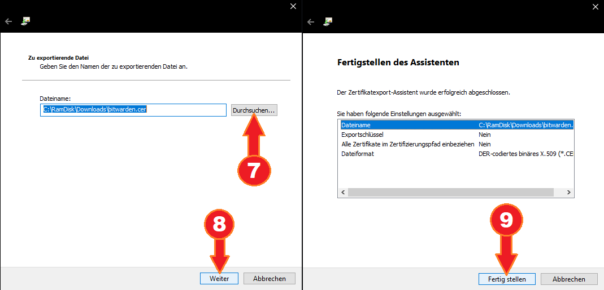
            10. Doppelklicken Sie auf die erstellte Zertifikatsdatei und w&auml;hlen Sie `Zertifikat installieren`.
            11. W&auml;hlen Sie `Lokales System`.
            12. W&auml;hlen Sie `Fortfahren`, wof&uuml;r Administratorrechte erforderlich sind.
                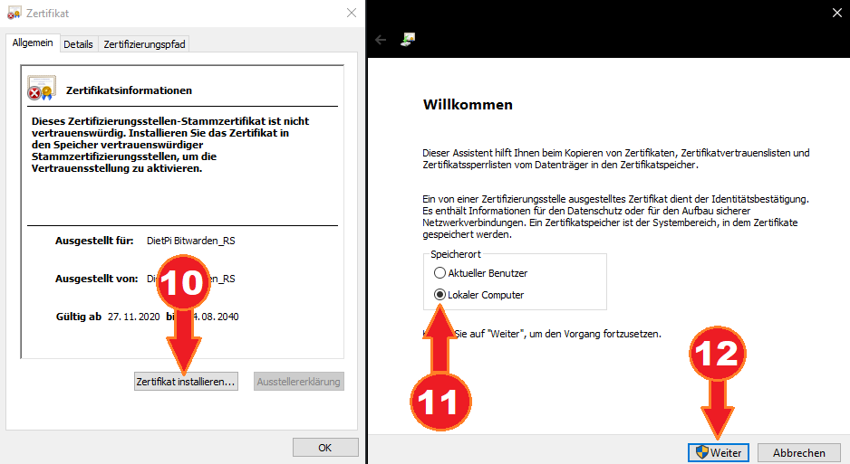
            13. W&auml;hlen Sie `Alle Zertifikate im folgenden Speicher speichern`.
            14. W&auml;hlen Sie `Durchsuchen`.
            15. W&auml;hlen Sie `Vertrauensw&uuml;rdige Stammzertifizierungsstellen` aus.
            16. W&auml;hlen Sie `Okay`.
            17. W&auml;hlen Sie `Weiter`.
            18. W&auml;hlen Sie `Fertig stellen`.
            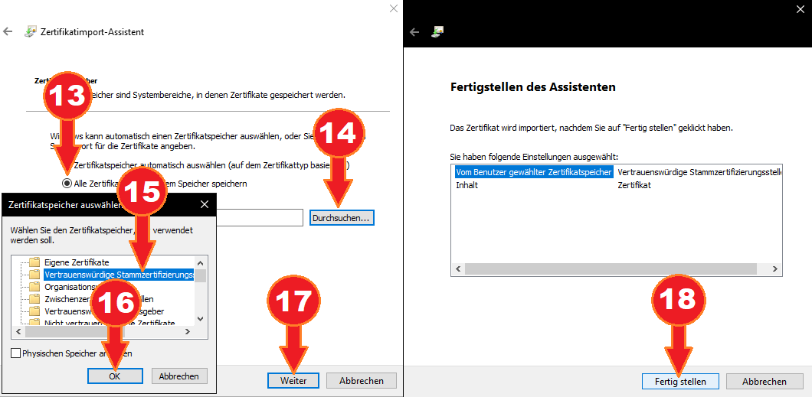

        === "macOS"

            1. W&auml;hlen Sie in Ihrem Browser (beachten Sie, dass dies in Safari nicht m&ouml;glich ist) neben der Adressleiste das Warn- oder Schlosssymbol aus.
                W&auml;hlen Sie dann die Schaltfl&auml;che "Zertifikat (ung&uuml;ltig)".
                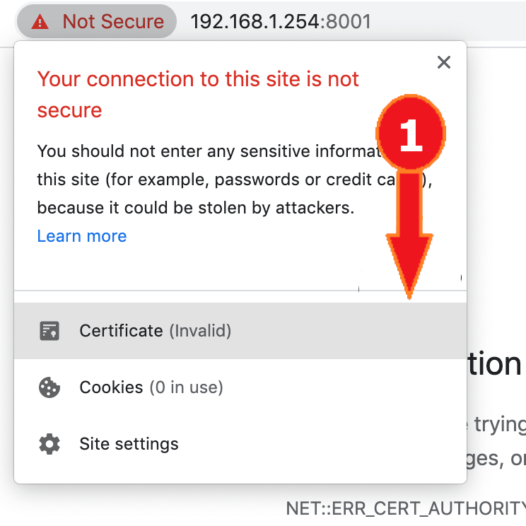{: width="250px"}
            2. Ziehen Sie das Zertifikatssymbol auf Ihren Desktop, es wird nur vor&uuml;bergehend ben&ouml;tigt.
            3. Doppelklicken Sie auf die Zertifikatsdatei.
                
            4. W&auml;hlen Sie im Dropdown-Men&uuml; `Schl&uuml;sselbund` `System` aus.
            5. W&auml;hlen Sie `Hinzuf&uuml;gen`.
            6. Geben Sie einen Administrator-Benutzernamen und ein Kennwort ein.
            7. W&auml;hlen Sie `Schl&uuml;sselbund &auml;ndern`.
                
            8. Doppelklicken Sie auf das Zertifikat in der Liste.
            9. W&auml;hlen Sie `Vertrauen`.
                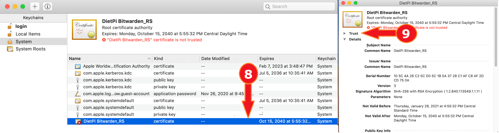
            10. W&auml;hlen Sie im Dropdown-Men&uuml; "Secure Sockets Layer (SSL)" die Option "Immer vertrauen".
            11. Klicken Sie auf die rote Schaltfl&auml;che in der oberen linken Ecke des Fensters.
            12. Geben Sie einen Administrator-Benutzernamen und ein Kennwort ein.
            13. W&auml;hlen Sie `Einstellungen aktualisieren`.
                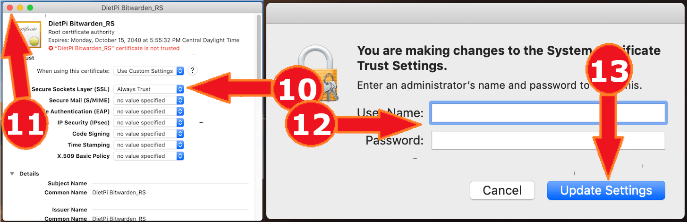

=== "Webzugriff"

    Das Webinterface ist &uuml;ber Port **8001** erreichbar:

    - URL = `https://<Ihre.IP>:8001`
    - Beim ersten Zugriff m&uuml;ssen Sie ein Konto erstellen, entweder &uuml;ber die Web-Benutzeroberfl&auml;che oder &uuml;ber den Client (siehe Registerkarte "Client-Zugriff").

=== "Client-Zugriff"

    Jeder offizielle Bitwarden-Client funktioniert: <https://bitwarden.com/download>

    1. W&auml;hlen Sie das Einstellungszahnrad oben links im Fenster.
    2. F&uuml;gen Sie `https://<Ihre.IP>:8001` in das benutzerdefinierte Serverfeld ein.
    3. Erstellen Sie ein neues Konto, das nur auf Ihrem eigenen Server erstellt wird.

=== "Verzeichnisse"

    - Installationsverzeichnis: `/opt/vaultwarden`
    - Datenverzeichnis: `/mnt/dietpi_userdata/vaultwarden`
    - Konfigurationsdatei: `/mnt/dietpi_userdata/vaultwarden/vaultwarden.env`

=== "Protokolle anzeigen"

    ```sh
    journalctl -u vaultwarden
    ```

=== "Auf neueste Version aktualisieren"

    ```sh
    dietpi-software reinstall 183
    ```

***

Offizielle Dokumentation: <https://github.com/dani-garcia/vaultwarden/wiki>
Forum: <https://vaultwarden.discourse.group>
Quellcode: <https://github.com/dani-garcia/vaultwarden>
Open-Source-Lizenz: [GPLv3](https://github.com/dani-garcia/vaultwarden/blob/master/LICENSE.txt)

Credits: Dieser Softwaretitel wurde von @CactiChameleon9 zur DietPi-Software hinzugef&uuml;gt. Vielen Dank!

## FuguHub

FuguHub verwandelt Ihr DietPi-Ger&auml;t in ein sicheres Online-Speichersystem, mit dem Sie von jedem angeschlossenen Computer oder Ger&auml;t aus auf Dateien zugreifen und diese freigeben k&ouml;nnen.

{: width="149" height="140" loading="lazy"}

=== "Webinterface"

    Das Webinterface ist &uuml;ber die regul&auml;ren HTTP- und HTTPS-Ports **80** und **443** erreichbar:

    - URL: `http://<Ihre.IP>` oder `https://<Ihre.IP>` (Bei Verwendung von HTTPS k&ouml;nnen Sie die Browserwarnung aufgrund des standardm&auml;&szlig;ig verwendeten selbstsignierten Zertifikats ignorieren. )
    - Benutzername: `dietpi`
    - Passwort: `<Ihr globales Passwort>` (Standard: `dietpi`)

    !!! Warnung "Die Tatsache, dass FuguHub standardm&auml;&szlig;ig auf den Ports 80 und 443 l&auml;uft, macht es bei Verwendung der Standardkonfiguration mit normalen Webservern inkompatibel."

    {: width="1920" height="1088" loading= "faul"}

=== "Einrichtungsdetails"

    - Installationsverzeichnis: `/home/bd`
    - Konfigurationsdatei: `/home/bd/bdd.conf`
    - Dateiserver-Verzeichnis: `/mnt/dietpi_userdata/fuguhub-data`

=== "Protokolle"

    - Dienst: `journalctl -u bdd`
    - Trace: `/home/bd/trace/`
    Es enth&auml;lt nur Informationen &uuml;ber die Datenbankerstellung, selbst nachdem Sie ein wenig mit der Web-Benutzeroberfl&auml;che herumgespielt haben.

=== "Aktualisieren"

    Um FuguHub zu aktualisieren, installieren Sie es einfach neu:

    ```sh
    dietpi-software reinstall 161
    ```

    Alle Ihre Einstellungen und Daten bleiben erhalten.

***

Offizielle Website: <https://fuguhub.com/>

## Dateibrowser

Greifen Sie mit diesem leichten Remote-Dateimanager von &uuml;berall &uuml;ber den Browser auf Ihre Daten zu und verwalten Sie sie. Anders als ownCloud und Nextcloud greift es auf die Rohdaten in Ihrem Dateisystem zu, basierend auf einem ausgew&auml;hlten Stammverzeichnis, was es &auml;hnlich wie Syncthing macht. Sie k&ouml;nnen mehrere Benutzer mit ihrem eigenen Stammverzeichnis einrichten und auch das Teilen von Dateien und Verzeichnissen &uuml;ber einen passwortgesch&uuml;tzten Link ist m&ouml;glich.

{: width="150" height="150" loading="lazy"}

=== "Zugriff auf die Weboberfl&auml;che"

    Das Webinterface ist &uuml;ber Port **8084** erreichbar:

    - URL = `http://<Ihre.IP>:8084`
    - Benutzername = `dietpi`
    - Passwort = `<Ihr globales Passwort>`

=== "Verzeichnisse"

    - Installationsverzeichnis: `/opt/filebrowser`
    - Konfigurationsverzeichnis: `/mnt/dietpi_userdata/filebrowser`
    - Standarddatenverzeichnis: `/mnt`

=== "Protokolle anzeigen"

    Zeigen Sie die Protokolle an, indem Sie Folgendes ausf&uuml;hren:

     ```sh
     journalctl -u filebrowser
     ```

=== "Auf neueste Version aktualisieren"

    Sie k&ouml;nnen den Dateibrowser einfach aktualisieren, indem Sie ihn neu installieren. Ihre Einstellungen und Daten bleiben dabei erhalten:

    ```sh
    dietpi-software reinstall 198
    ```

***

Offizielle Dokumentation: <https://filebrowser.org/>
Quellcode: <https://github.com/filebrowser/filebrowser>
Lizenz: [Apache 2.0](https://github.com/filebrowser/filebrowser/blob/master/LICENSE)

[Zur&uuml;ck zur **Liste der optimierten Software**](../../software/)
