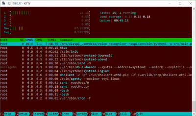
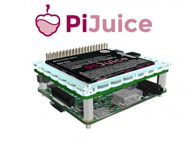
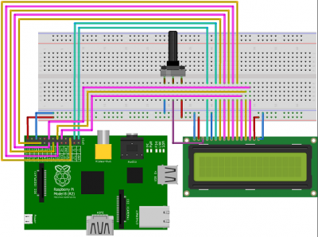
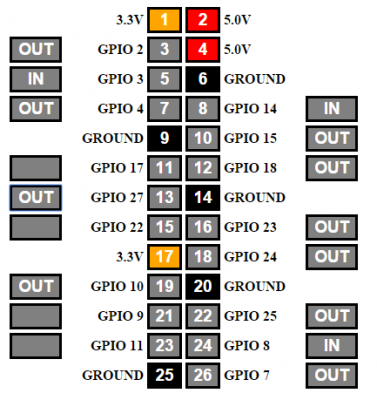

# Hardware-Projekte

## &Uuml;berblick

- [**Google AIY - Voice-Kit "Ok, Google"!**](#google-aiy)
- [**Mycroft AI - Open-Source-Sprachassistent**](#mycroft-ai)
- [**PiJuice - PiSupply USV/Batteriestromversorgungssystem**](#pijuice)
- [**RPi.GPIO - GPIO-Schnittstellenbibliothek f&uuml;r RPi (Python)**](#rpigpio)
- [**WiringPi - GPIO-Schnittstellenbibliothek**](#wiringpi)
- [**WebIOPi - Webinterface zur Steuerung von RPi GPIO**](#webiopi)
- [**Node-RED - Visuelles Tool zum Verbinden von Hardwareger&auml;ten, APIs und Onlinediensten**](#node-red)
- [**Mosquitto - Nachrichtenbroker, der das MQTT-Protokoll implementiert**](#mosquitto)
- [**Blynk Server - Blynk-Server mit Web- und MQTT-Schnittstelle zur Steuerung von IoT-Ger&auml;ten, geschrieben in Java**](#blynk-server)
- [**Audiophonics PI-SPC - Leistungssteuerungsmodul f&uuml;r Raspberry Pi, erm&ouml;glicht das Ein-/Ausschalten &uuml;ber physische Tasten**](#audiophonics-pi-spc)
- [**Grafana - Die offene Plattform f&uuml;r sch&ouml;ne Analysen und &Uuml;berwachung**](#grafana)

??? Information "Wie f&uuml;hre ich **DietPi-Software** aus und installiere **optimierte Software**-Elemente?"
    Um eines der unten aufgef&uuml;hrten **DietPi-optimierten Softwareelemente** zu installieren, f&uuml;hren Sie es &uuml;ber die Befehlszeile aus:

    ```sh
    dietpi-software
    ```

    W&auml;hlen Sie **Software durchsuchen** und w&auml;hlen Sie einen oder mehrere Artikel aus. W&auml;hlen Sie abschlie&szlig;end `Installieren`.
    DietPi f&uuml;hrt alle notwendigen Schritte aus, um diese Softwareelemente zu installieren und zu starten.

    {: width="643" height="365" loading="lazy"}

    Um alle DietPi-Konfigurationsoptionen anzuzeigen, lesen Sie den Abschnitt [DietPi Tools](../../dietpi_tools/).

## Google AIY

"Ok Google. Wer ist dein Daddy?"

???+ Hinweis "Unsere Installation ist hochoptimiert und leicht"

    Wir installieren keine Desktop-Umgebung. Der Benutzer muss die Google-API und die Schl&uuml;ssel auf einem anderen System einrichten (siehe Ersteinrichtung unten).
    Wir empfehlen SSH dringend, um eine schnelle Einrichtung der Google-API und der Ger&auml;teverbindung zu erm&ouml;glichen.
    Wir empfehlen auch einen der [DietPi-Dateiserver](../file_servers/), f&uuml;r die einfache &Uuml;bertragung von `assistant.json`, die w&auml;hrend der Google-API-Einrichtung generiert wurde.

{: width="400" height="239" loading="lazy"}

=== "Erste Ausf&uuml;hrung einrichten"

    Sobald DietPi das Google AIY Voice Kit installiert und neu gestartet hat, m&uuml;ssen Sie Ihr Google API-Konto einrichten und das Ger&auml;t verkn&uuml;pfen.

    - Folgen Sie dem Link unten, um die Google-API einzurichten und Clientschl&uuml;ssel herunterzuladen, die zum Aktivieren der Sprach-API erforderlich sind:
      <https://aiyprojects.withgoogle.com/voice#users-guide-1-2--turn-on-the-google-assistant-api>
      Anmerkung: Stellen Sie beim Einrichten der Aktivit&auml;tssteuerung sicher, dass Sie auch "Chrome-Browserverlauf und Aktivit&auml;ten von Websites und Apps einbeziehen, die Google-Dienste verwenden" aktivieren, sonst funktioniert sie nicht ;)
    - Stellen Sie sicher, dass Sie einen der [Dateiserver von DietPi](../file_servers/) installiert haben.
      Laden Sie nach Abschluss die Datei `client_secret.json` herunter und speichern Sie sie unter:
    - Bei Verwendung von SSH = `/mnt/dietpi_userdata/voice-recognizer-raspi/assistant.json`
    - Bei Verwendung von File Server = `voice-recognizer-raspi/assistant.json`
    - F&uuml;hren Sie den folgenden Befehl aus und folgen Sie dann dem Link/den Anweisungen auf dem Bildschirm, um die &Uuml;berpr&uuml;fung einzurichten:

        ```sh
        sudo -u dietpi /mnt/dietpi_userdata/voice-recognizer-raspi/env/bin/python3 -u /mnt/dietpi_userdata/voice-recognizer-raspi/src/main.py
        ```

    - Sobald die Eingabeaufforderung "Ok, Google" erscheint, testen Sie das Ger&auml;t. Anschlie&szlig;end k&ouml;nnen Sie das Programm mit ++ctrl+c++ beenden und die Dienste neu starten:

      ```sh
      dietpi-services restart
      ```

=== "Installationshinweise"

    Dort befindet sich die Sprachsoftware:
    `/mnt/dietpi_userdata/voice-recognizer-raspi`

=== "Dienststatus pr&uuml;fen"

    So &uuml;berpr&uuml;fen Sie den Status der Dienstausf&uuml;hrung:

    ```sh
    dietpi-services status
    ```

    {: width="500px"}

## Mycroft-KI

Mycroft AI ist ein kostenloser Open-Source-Sprachassistent.

{: width="200" height="33" loading="lazy"}

=== "Interaktive Installation"

    1. Branch-Auswahl: F&uuml;r unerfahrene Benutzer empfehlen wir auch den Master-Branch: ++y++
    2. Automatische Updates: Es verlangsamt den Startvorgang etwas, aber es dauert sowieso eine Weile, bis alle Skills geladen sind, daher empfehlen wir auch dies: ++y++
    3. F&uuml;gen Sie Mycroft-Befehle zu PATH hinzu: W&auml;hlen Sie hier *NEIN*, da der Installer als Benutzer `mycroft` ausgef&uuml;hrt wird, der kein Login-Benutzer ist, weshalb dies keine Auswirkung hat: ++n++
    4. &Uuml;berpr&uuml;fen Sie den Code vor dem Absenden: Wenn Sie ein offizieller Mycroft-Entwickler sind, w&auml;hlen Sie ++y++, sonst: ++n++

=== "Ersteinrichtung"

    1. Wenn Sie nach der Installation keinen Neustart durchgef&uuml;hrt haben, laden Sie die Mycroft-Befehle in die aktuelle Shell-Sitzung: `. /etc/bashrc.d/mycroft.sh`
    2. CLI-Client starten: `mycroft-cli-client`
    3. Sie sollten die Aufforderung sehen und bestenfalls h&ouml;ren, Ihr Ger&auml;t zu koppeln, zB: `PairingSkill - INFO - Kopplungscode: XXYYZZ`
    4. Besuchen Sie <https://home.mycroft.ai/>, um mit der Kopplung und Konfiguration Ihres Ger&auml;ts und Ihrer F&auml;higkeiten zu beginnen.

=== "Mimik f&uuml;r Offline-TTS-Unterst&uuml;tzung (britische M&auml;nner) erstellen (optional)""

    Anmerkung: Dies erfordert ungef&auml;hr 3 GiB RAM und dauert eine Weile, stellen Sie also sicher, dass Sie &uuml;ber gen&uuml;gend Speicher verf&uuml;gen (4 GiB empfohlen), falls Sie die Gr&ouml;&szlig;e Ihrer Auslagerungsdatei erh&ouml;hen und sich einen Kaffee holen.

    ```sh
    cd /mnt/dietpi_userdata/mycroft-core
    sudo -u mycroft ./scripts/install-mimic.sh $(nproc)
    ```

## PiJuice

PiJuice ist ein batteriebasiertes All-in-One-Netzteil f&uuml;r den RPi mit USV-F&auml;higkeiten und Batterielaufzeit.

{: width="400" height="300" loading="lazy"}

=== "Grundlegende Informationen"

    Unsere Standardinstallation enth&auml;lt nicht die Desktop-Anwendung. Falls erforderlich, installieren Sie bitte zuerst einen Desktop und f&uuml;hren Sie dann den folgenden Befehl aus, um die GUI anschlie&szlig;end zu installieren:

    ```sh
    apt install pijuice-gui
    ```

    Das PiJuice-Programm kann dann &uuml;ber LXDE start \> Preferences (LXDE) gestartet werden

    - SW1 = Ger&auml;t einschalten
    - SW2 = Einheit ausschalten (f&uuml;hrt ein Beispielskript aus, das ge&auml;ndert werden kann `/var/lib/dietpi/dietpi-software/installed/pijuice/pijuice_func1.sh`)
    - Eine zus&auml;tzliche Konfiguration kann durch Bearbeiten der folgenden Datei vorgenommen werden (vollst&auml;ndige Liste der verf&uuml;gbaren Konfigurationsoptionen):

        ```sh
        nano /var/lib/pijuice/pijuice_config.JSON
        ```

    Starten Sie den Dienst neu, um &Auml;nderungen zu &uuml;bernehmen:

    ```sh
    systemctl restart pijuice
    ```

=== "Firmware aktualisieren"

Zum Zeitpunkt des Verfassens dieses Artikels wird die Firmware auf dem Ger&auml;t auf `V1.1_2018_01_15` aktualisiert. Bitte ersetzen Sie jedoch den Firmware-Link durch die neueste Version:

    ```sh
    wget https://github.com/PiSupply/PiJuice/raw/master/Firmware/PiJuice-V1.1_2018_01_15.elf.binary -O package.binary
    chmod +x package.binary
    pijuiceboot 14 package.binary
    ```

##RPi.GPIO

Die bekannte Standard-GPIO-Schnittstellenbibliothek f&uuml;r RPi (Python). Bringen Sie den Ingenieur in Ihnen zum Vorschein!

{: width="250" height="186" loading="lazy"}

***

Website: <https://pypi.python.org/pypi/RPi.GPIO>

## VerkabelungPi

Alternative GPIO-Schnittstellenbibliothek basierend auf C. Bringen Sie den Ingenieur in Ihnen zum Vorschein!

{: width="250" height="186" loading="lazy"}

=== "Installationsbeispiele/Dokumentation anzeigen"

    ```sh
    cd /root/wiringPi*
    ls -l
    ```

=== "GPIO testen/ansehen"

    ```sh
    gpio -v
    gpio readall
    ```

***

Website: <http://wiringpi.com>

## WebIOPi

Mit WebIOPi k&ouml;nnen Sie die GPIO-Hardware Ihres Raspberry Pi &uuml;ber eine Webschnittstelle steuern.

{: width="200" height="212" loading="lazy"}

=== "Zugriff auf die Weboberfl&auml;che"

    Das Webinterface ist &uuml;ber Port **8002** erreichbar:

    - URL = `http://<Ihre.IP>:8002`
    - Benutzername = `webiopi`
    - Passwort = "Himbeere".

=== "Anmeldepasswort &auml;ndern"

    - F&uuml;hren Sie `webiopi-passwd` aus
    - Geben Sie den Benutzernamen `webiopi` ein
    - Geben Sie Ihr neues Passwort zweimal ein

Sie m&uuml;ssen auch den Dienst `webiopi` neu starten, damit Ihr neues Passwort wirksam wird:

    ```sh
    systemctl restart webiopi
    ```

=== "Zugriff auf WebIOPi &uuml;ber das Internet"

Um &uuml;ber das Internet auf Ihre WebIOPi-Oberfl&auml;che zugreifen zu k&ouml;nnen, k&ouml;nnen Sie [Remot3.it (Weaved)](../remote_desktop/#remot3it) installieren.

***

Website: <https://webiopi.trouch.com>

## Node-RED

Node-RED ist ein visuelles Tool zum Verbinden von Hardwareger&auml;ten, APIs und Onlinediensten auf neue und interessante Weise. Node-RED verwendet einen eigenst&auml;ndigen Webserver, auf den remote zugegriffen werden kann.

{: width="400" height="286" loading="lazy"}

=== "Zugriff auf die Programmier-IDE"

    Das Webinterface ist &uuml;ber Port **1880** erreichbar:

    - URL = `http://<Ihre.IP>:1880`

=== "Zugriff auf das Dashboard"

    Um das Node-RED-Dashboard, die Benutzeroberfl&auml;che von Node-RED, zu installieren, verwenden Sie die Einstellungen `Palette verwalten` aus der Programmier-IDE oder f&uuml;hren Sie den folgenden Befehl von der Konsole aus:

    ```sh
    node-red-admin install node-red-dashboard
    ```

    Verwenden Sie die folgende URL, um von Ihrem Browser aus eine Verbindung zum Dashboard herzustellen:
    `https://<your.IP>:1880/ui/`

=== "Daten- und Konfigurationsverzeichnis"

    Node-RED, alle Konfigurationen und Daten werden an folgendem Ort gespeichert:
    `/mnt/dietpi_userdata/node-red`

=== "Protokolle anzeigen"

    Um Node-RED-Dienstprotokolle anzuzeigen, f&uuml;hren Sie den folgenden Befehl von der Konsole aus:

    ```sh
    journalctl -u node-red
    ```

=== "Update auf aktuelle Version"

    Sie k&ouml;nnen Node-RED-Module &uuml;ber die Programmier-IDE aktualisieren. Um das Kernmodul `node-red` zu aktualisieren, f&uuml;hren Sie den folgenden Befehl von der Konsole aus:

    ```sh
    systemctl stop node-red
    cd /mnt/dietpi_userdata/node-red
    sudo -u nodered npm up --no-audit node-red
    systemctl start node-red
    ```

    Die aktuelle Node-RED-Version kann in der Programmier-IDE im *Burger-Men&uuml;* rechts oben ausgelesen werden.

***

Website: <https://nodered.org>
Bibliotheken bzw. Flows: <https://flows.nodered.org>

## Mosquitto

Eclipse Mosquitto™ ist ein Open-Source-Message-Broker (EPL/EDL-lizenziert), der die MQTT-Protokollversionen 3.1 und 3.1.1 implementiert.
MQTT bietet eine einfache Methode zur Durchf&uuml;hrung von Messaging mit einem Publish/Subscribe-Modell. Dadurch eignet es sich f&uuml;r IoT-Messaging (Internet of Things), z. B. mit Low-Power-Sensoren oder mobilen Ger&auml;ten wie Telefonen, eingebetteten Computern oder Mikrocontrollern wie dem Arduino.

{: width="100" height="76" loading="lazy"}

=== "Client-Konfiguration"

Mosquitto &uuml;berwacht standardm&auml;&szlig;ig den Netzwerkport **1883**. Clients m&uuml;ssen sich mit den folgenden Anmeldeinformationen authentifizieren:

    - Benutzername: `mosquitto`
    - Passwort: `<Ihr globales Passwort>` (Standard: `dietpi`)

=== "Serverkonfiguration"

    - Konfigurationsverzeichnis: `/etc/mosquitto`
    - Konfigurationsdatei: `/etc/mosquitto/mosquitto.conf`
    - Passwortdatei: `/etc/mosquitto/passwd`

F&uuml;hren Sie den folgenden Befehl aus, um das standardm&auml;&szlig;ige Authentifizierungspasswort f&uuml;r den Benutzer `dietpi` zu &auml;ndern:

    ```sh
    mosquitto_passwd /etc/mosquitto/passwd mosquitto
    ```

    F&uuml;hren Sie den folgenden Befehl aus, um einen neuen Authentifizierungsbenutzer zu erstellen:

    ```sh
    mosquitto_passwd /etc/mosquitto/passwd
    ```

    Nachdem die &Auml;nderungen vorgenommen wurden, m&uuml;ssen Sie den Dienst neu starten:

    ```sh
    systemctl restart mosquitto
    ```

    Weitere Einzelheiten finden Sie in der unten verlinkten offiziellen Dokumentation.

=== "Protokolle anzeigen"

    F&uuml;hren Sie den folgenden Befehl aus, um Mosquitto-Serverprotokolle anzuzeigen:

    ```sh
    journalctl -u mosquitto
    ```

=== "Auf neueste Version aktualisieren"

`Mosquitto wird &uuml;ber sein offizielles APT-Repository installiert, daher k&ouml;nnen die folgenden Befehle verwendet werden, um es auf die neueste Version zu aktualisieren:

    ```sh
    apt update
    apt install mosquitto
    ```

***

Offizielle Website: <https://mosquitto.org/>
Offizielle Dokumentation: <https://mosquitto.org/documentation/>
Quellcode: <https://github.com/eclipse/mosquitto>

## Blynk-Server

Plattform mit iOS- und Android-Apps zur Steuerung von Arduino, ESP8266, Raspberry Pi und &auml;hnlichen Mikrocontroller-Boards &uuml;ber das Internet, geschrieben in Java. Dies ist die Serverkomponente, die die Cloud-Server von Blynk Inc. ersetzen soll.

Installiert auch:

- Blynk JS-Bibliothek: <https://www.npmjs.com/package/blynk-library>

{: width="375" height="400" loading="lazy"}

=== "Webinterface"

    Das Webinterface verwendet Port **9443**:

    - URL: `https://<your.IP>:9443/admin` (Sie k&ouml;nnen die Browserwarnung ignorieren, da standardm&auml;&szlig;ig ein selbstsigniertes Zertifikat verwendet wird.)
    - E-Mail-Adresse: `admin@blynk.cc`
    - Passwort: `<Ihr globales Passwort>` (Standard: `dietpi`)

=== "Einrichtungsdetails"

    DietPi installiert Blynk (einschlie&szlig;lich Benutzerdaten und Konfigurationsdatei) an folgendem Ort:

    ```
    /mnt/dietpi_userdata/blynk
    ```

    Protokolle k&ouml;nnen angezeigt werden &uuml;ber:

    ```sh
    journalctl -u blynkserver
    ```

    und detailliertere Protokolldateien in:

    ```
    /var/log/blynk
    ```

    Wir haben einen systemd-Dienst f&uuml;r Blynk erstellt, der automatisch von DietPi beim Booten gestartet wird:

    ```sh
    systemctl status blynkserver
    ```

DietPi installiert zusammen mit dieser Installation auch die ***Blynk JS-Bibliothek***. Bitte &uuml;berspringen Sie diesen Abschnitt, wenn Sie das Blynk-Benutzerhandbuch erreichen.

=== "Konfiguration"

    !!! Warnung "&Auml;nderungen der Konfigurationsdatei &uuml;ber die Web-Benutzeroberfl&auml;che haben keine Auswirkung."

    Um Einstellungen zu &auml;ndern, m&uuml;ssen Sie sie bearbeiten

    ```
    /mnt/dietpi_userdata/blynk/server.properties
    ```

    und starten Sie den Blynk-Server neu:

    ```sh
    systemctl restart blynkserver
    ```

=== `Erste Schritte mit der Blynk-App`

    !!! Warnung `Die neue App `Blynk IoT` unterst&uuml;tzt keinen selbst gehosteten Blynk-Server!`

        Die "alte" Blynk-App wird an mehreren Stellen Hinweise auf die neue "Blynk IoT"-App geben. Sie m&uuml;ssen diese ignorieren, da die neue App keine selbst gehosteten Blynk-Server unterst&uuml;tzt, sondern nur die Cloud von Blynk Inc.

    1. Laden Sie die Blynk-App f&uuml;r Android herunter: <https://play.google.com/store/apps/details?id=cc.blynk>
    2. Um sich bei Ihrem eigenen Server anzumelden, dr&uuml;cken Sie auf `Anmelden`, dann auf die drei Punkte unten und stellen Sie den Schieberegler auf `BENUTZERDEFINIERT`.
    3. Dort k&ouml;nnen Sie die IP/Dom&auml;ne Ihres eigenen Blynk-Servers eingeben und die oben genannten Anmeldeinformationen verwenden.
    4. Erstellen Sie ein neues Projekt, indem Sie dieser Anleitung folgen: <https://docs.blynk.cc/#getting-started-getting-started-with-the-blynk-app-2-create-a-new-project>
    5. Das Authentifizierungstoken f&uuml;r das neue Projekt kann von der App und auch von der Weboberfl&auml;che unter `Benutzer` > `admin@blynk.cc` im Bereich `Profile DashBoards` abgerufen werden. Verwenden Sie es, um eine Verbindung mit Ihren Blynk-Bibliotheksknotenskripten herzustellen.

=== "Testskript ausf&uuml;hren"

    Sobald Sie ein Projekt in der iOS/Android-App erstellt haben, k&ouml;nnen Sie die Verbindung &uuml;ber `/mnt/dietpi_userdata/blynk/client-tcp-local.js` testen. Sie m&uuml;ssen die Datei bearbeiten und `YOUR_AUTH_TOKEN` durch das Authentifizierungstoken Ihres Projekts ersetzen. Dann f&uuml;hren Sie es aus:

    ```sh
    /mnt/dietpi_userdata/blynk/client-tcp-local.js
    ```

    Innerhalb des Skripts k&ouml;nnen Sie auch Ereignis-Listener und -Handler definieren. Standardm&auml;&szlig;ig wird der Wert des virtuellen Pins `V1` auf die Konsole gedruckt, wenn er sich &auml;ndert, und der Wert des virtuellen Pins `V9` wird immer dann auf Systemzeitsekunden gesetzt, wenn der Pin gelesen wird. F&uuml;r einen interaktiveren Test k&ouml;nnten Sie daher die folgenden Widgets per App zu Ihrem Projekt hinzuf&uuml;gen:

    1. F&uuml;gen Sie einen `Button` hinzu und &auml;ndern Sie seinen `OUTPUT`-Pin auf `Virtual` > `V1`. Gehen Sie zur&uuml;ck und dr&uuml;cken Sie die Play-Taste. Immer wenn Sie die Schaltfl&auml;che in der App dr&uuml;cken, sollte die Testskriptkonsole die Wert&auml;nderungen wie definiert drucken.
    2. Dr&uuml;cken Sie die Stopp-Taste. F&uuml;gen Sie eine `Wertanzeige` hinzu, &auml;ndern Sie den `INPUT`-Pin auf `Virtual` > `V9` und die `READING RATE` auf `1 sec`. Gehen Sie zur&uuml;ck und dr&uuml;cken Sie die Starttaste. W&auml;hrend das Testskript ausgef&uuml;hrt wird, zeigt das Anzeige-Widget nicht die Sekunden der Systemzeit des Servers an, die alle 1-2 Sekunden aktualisiert werden.

    Dr&uuml;cken Sie ++Strg+C++, um das Testskript zu beenden.

=== "Aktualisieren"

    Aktualisieren Sie Blynk mit:

    ```sh
    dietpi-software reinstall 131
    ```

***

Offizielle Website: <https://blynk.io/>
Offizielle Dokumentation: <https://docs.blynk.io/>
Quellcode: <https://github.com/Peterkn2001/blynk-server>
Lizenz: [GPLv3](https://github.com/Peterkn2001/blynk-server/blob/master/license.txt)

Blynk-Android-App: <https://play.google.com/store/apps/details?id=cc.blynk>

Seite `npm` der Blynk JS-Bibliothek: <https://www.npmjs.com/package/blynk-library>
Quellcode der Blynk JS-Bibliothek: <https://github.com/vshymanskyy/blynk-library-js>
Blynk JS-Bibliothekslizenz: [MIT](https://github.com/vshymanskyy/blynk-library-js/blob/master/LICENSE)

## Audiophonics PI-SPC

Leistungssteuerungsmodul f&uuml;r Raspberry Pi, mit dem Sie das System physisch ein- und ausschalten k&ouml;nnen, ohne `poweroff` ausf&uuml;hren zu m&uuml;ssen.
Siehe <https://www.audiophonics.fr/en/raspberry-pi-and-other-sbc-accessories/audiophonics-pi-spc-v2-power-management-module-for-raspberry-pi-p-10912. html> f&uuml;r weitere Details.

{: width="400" height="400" loading="lazy"}

???+ Anmerkung "Korrekte GPIO-Pins sicherstellen!"

    Bitte stellen Sie sicher, dass die richtigen GPIO-Pins verwendet werden, wenn Sie Pi-SPC mit RPi verbinden (siehe Abbildung unten).

    {: width="400" height="119" loading="lazy"}

Um das System auszuschalten, beginnen Sie mit dem Herunterfahren: Halten Sie den Netzschalter < 0,5 Sekunden lang gedr&uuml;ckt. Wenn Sie keinen Knopf haben, k&ouml;nnen Sie die Pins `BP PIN C` und `BP PIN NO` auch mit Ihrem bevorzugten elektrisch leitf&auml;higen Metall (z. B. Pinzette) schlie&szlig;en.
Anmerkung: Halten Sie den Netzschalter nicht l&auml;nger als 2 Sekunden gedr&uuml;ckt, da dies das System hart ausschaltet (gleiche Wirkung wie das Ziehen des Netzkabels). Dadurch werden Dateisystembesch&auml;digungen w&auml;hrend E/A-Vorg&auml;ngen beim Herunterfahren verursacht.

## InfluxDB

InfluxDB ist eine Datenbank, die optimiert ist, um zeitbasierte Daten als Protokolle oder Daten von einem Sensor zu speichern.
Die Hauptschnittstelle zur Datenbank f&uuml;r die Verwaltung und die Daten&uuml;bertragung sind HTTP-Anforderungen, die direkt vom Dienst `influxdb` verarbeitet werden (der standardm&auml;&szlig;ig verwendete Port ist 8086).

Die Daten lassen sich sch&ouml;n mit Grafana betrachten.
Diese Installation und Dokumentation war m&ouml;glich dank [@marcobrianza](https://github.com/MichaIng/DietPi/issues/1784#issuecomment-390778313).

{: width="300" height="112" loading="lazy"}

### Verwendungszweck

Das Paket enth&auml;lt ein Befehlszeilentool `influx` f&uuml;r Datenbankverwaltungsoperationen.
Dieses Tool verwendet auch HTTP, sodass es eine Datenbank auf einem Remote-Rechner verwalten kann, indem es die Option -host einstellt.

#### Erstellen Sie eine Datenbank

Um eine Datenbank zu erstellen, f&uuml;hren Sie Folgendes aus:

```sh
influx -execute 'create database mydb'
```

Alternative Methode:

```sh
curl -i -XPOST http://localhost:8086/query --data-urlencode "q=CREATE DATABASE mydb"
```

#### Buchungsdaten

Daten k&ouml;nnen durch Ausf&uuml;hren von:

```sh
curl -i -XPOST 'http://localhost:8086/write?db=mydb' --data-binary 'temperature value=20.12'
```

#### Daten anzeigen

```sh
influx -database mydb -execute 'SELECT * FROM temperature'
```

Alternative Methode:

```sh
curl -i -XPOST http://localhost:8086/query?db=mydb --data-urlencode "q=SELECT * FROM temperature"
```

#### Authentifizierung

Standardm&auml;&szlig;ig ist die HTTP-Authentifizierung deaktiviert. Um es zu aktivieren, &auml;ndern Sie `auth-enabled = true` in der Konfigurationsdatei `/etc/influxdb/influxdb.conf`. Starten Sie dann die Dienste mit `dietpi-services restart` neu.

#### Erstellen Sie Benutzer und Berechtigungen von der `influx`-CLI

Um die InfluxDB-Datenbankverwaltungsschnittstelle zu starten, geben Sie Folgendes ein:

```sh
influx -username admin -password admin01
```

Erstellen Sie dann die Datenbankeintr&auml;ge:

```sh
CREATE USER admin WITH PASSWORD 'admin01' WITH ALL PRIVILEGES
CREATE USER test_user WITH PASSWORD 'test_user01'
GRANT ALL ON mydb TO test_user
exit
```

### Installationsinformationen

Der Datenspeicherort f&uuml;r InfluxDB wird gespeichert bzw. verkn&uuml;pft mit symbolischen Links zum DietPi-Benutzerdatenverzeichnis: `/mnt/dietpi_userdata/influxdb`

***

Offizielle Dokumentation: <https://docs.influxdata.com/influxdb>

##Grafana

Die offene Plattform f&uuml;r sch&ouml;ne Analysen und &Uuml;berwachung.

Diese Installation und Dokumentation war m&ouml;glich dank [@marcobrianza](https://github.com/MichaIng/DietPi/issues/1784#issuecomment-390778313).
Anmerkung: Grafana-Bin&auml;rdateien sind spezifisch f&uuml;r die CPU-Architektur, daher wird das Austauschen von SD-Karten zwischen RPi 1 <> 2+ nicht empfohlen.

{: width="400" height="197" loading="lazy"}

=== "Voraussetzungen"

    F&uuml;r Grafana ist ein Datenbankserver erforderlich. Da Grafana viele Optionen bietet (InfluxDB/MySQL), haben wir beides nicht automatisch installiert, da eine manuelle Konfiguration m&ouml;glicherweise bevorzugt wird.
    Wir empfehlen jedoch dringend, [InfluxDB](../databases/#influxdb) zu installieren.

    Sie k&ouml;nnen dies mit den vom **DietPi-Software**-Tool bereitgestellten Installationsschritten tun oder die n&auml;chste Befehlszeile im Terminal ausf&uuml;hren:

    ```sh  
    dietpi-software install 74
    ```

    Nachdem die InfluxDB installiert ist, folgen Sie bitte der Anleitung zur Datenbankerstellung [hier](../databases/#influxdb).

=== "Zugriff auf die Weboberfl&auml;che"

    Das Webinterface ist &uuml;ber Port **3001** erreichbar:

    - URL: `http://<Ihre.IP>:3001`
    - Benutzername: `admin`
    - Passwort: `<Ihr globales Passwort>` (Standard: `dietpi`)

=== "Nutzungsinformationen"

    Wenn Sie eine Datenbank gem&auml;&szlig; der Online-Dokumentation von InfluxDB erstellt haben, befolgen Sie bitte diese Anweisungen:

    - Klicken Sie im Start-Dashboard auf "Datenquelle hinzuf&uuml;gen" und geben Sie dann die folgenden Informationen ein:
        - Typ = `InfluxDB`
        - URL = `http://localhost:8086`
        - Datenbank = `mydb`
        - Benutzername = `test_user`
        - Passwort = `test_password01`
        - Belassen Sie die restlichen Elemente mit den Standardwerten.
    - Klicken Sie auf `Speichern & Testen`.
    - &Uuml;ber das Start-Dashboard
        - Klicken Sie auf `Neues Dashboard`.
        - Klicken Sie auf `Grafik`.
        - Klicken Sie auf die Beispielgrafik
        - Dr&uuml;cken Sie ++e++, um die Datenquelle und die benutzerdefinierte Abfrage zu bearbeiten

=== "Installationsinformationen"

Der Datenstandort f&uuml;r Grafana wird gespeichert bzw. mit symbolischen Links auf das DietPi-Benutzerdatenverzeichnis verlinkt: `/mnt/dietpi_userdata/grafana`

[Zur&uuml;ck zur **Liste der optimierten Software**](../../software/)
